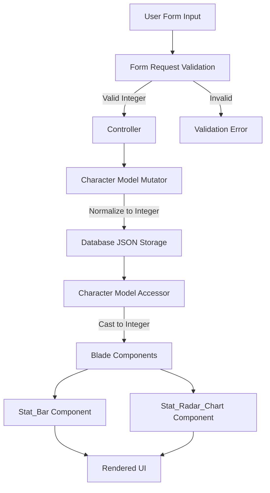

# Design Document: Character Stats Display Fix

## Overview

This design addresses critical data type inconsistencies in the Character Stats Display system where stat values are stored as strings instead of integers in the `current_stats` JSON field. The issue causes rendering failures in UI components (Stat_Bar and Stat_Radar_Chart) and type mismatches throughout the application.

The solution implements a multi-layered approach:

1. **Model Layer**: Add accessors/mutators to the Character model for automatic type normalization
2. **Validation Layer**: Enhance Form Request validation to enforce integer types
3. **Database Layer**: Create a data migration to fix existing records
4. **Component Layer**: Update Blade components to handle integer props correctly
5. **Testing Layer**: Add comprehensive test coverage for all layers

This design maintains backward compatibility while ensuring all new and existing data uses correct integer types.

## Architecture

### Current State

```
User Input (Form) → Controller → Character Model → Database (JSON)
                                                   ↓
                                            current_stats: {
                                              "speed": "800",    ← STRING (WRONG)
                                              "stamina": "750",  ← STRING (WRONG)
                                              ...
                                            }
                                                   ↓
                                            Blade Components
                                                   ↓
                                            Rendering Failures
```

### Target State

```
User Input (Form) → Form Request Validation (integer enforcement)
                           ↓
                    Controller
                           ↓
                    Character Model (with mutator)
                           ↓
                    Database (JSON)
                           ↓
                    current_stats: {
                      "speed": 800,      ← INTEGER (CORRECT)
                      "stamina": 750,    ← INTEGER (CORRECT)
                      ...
                    }
                           ↓
                    Character Model (with accessor)
                           ↓
                    Blade Components (integer props)
                           ↓
                    Correct Rendering
```

### Data Flow Diagram



## Components and Interfaces

### 1. Character Model Enhancements

**File**: `app/Models/Character.php`

**New Accessor** (for retrieval):

```php
/**
 * Get the current_stats attribute with integer normalization.
 *
 * @param  mixed  $value
 * @return array<string, int>
 */
protected function getCurrentStatsAttribute($value): array
{
    $stats = json_decode($value, true) ?? [];
    
    return [
        'speed' => (int) ($stats['speed'] ?? 0),
        'stamina' => (int) ($stats['stamina'] ?? 0),
        'power' => (int) ($stats['power'] ?? 0),
        'guts' => (int) ($stats['guts'] ?? 0),
        'wit' => (int) ($stats['wit'] ?? 0),
    ];
}
```

**New Mutator** (for storage):

```php
/**
 * Set the current_stats attribute with integer normalization.
 *
 * @param  mixed  $value
 * @return void
 */
protected function setCurrentStatsAttribute($value): void
{
    if (!is_array($value)) {
        $value = [];
    }
    
    $normalized = [
        'speed' => (int) ($value['speed'] ?? 0),
        'stamina' => (int) ($value['stamina'] ?? 0),
        'power' => (int) ($value['power'] ?? 0),
        'guts' => (int) ($value['guts'] ?? 0),
        'wit' => (int) ($value['wit'] ?? 0),
    ];
    
    $this->attributes['current_stats'] = json_encode($normalized);
}
```

**Enhanced getStat() Method**:

```php
/**
 * Get a specific stat value as an integer.
 *
 * @param  string  $stat
 * @return int
 */
public function getStat(string $stat): int
{
    $stats = $this->current_stats;
    return (int) ($stats[$stat] ?? 0);
}
```

### 2. Form Request Validation Enhancements

**Files**:

- `app/Http/Requests/StoreCharacterRequest.php`
- `app/Http/Requests/UpdateCharacterRequest.php`

**Enhanced Validation Rules**:

```php
public function rules(): array
{
    return [
        // ... existing rules ...
        
        // Enhanced stats validation with integer enforcement
        'stats' => ['required', 'array'],
        'stats.speed' => ['required', 'integer', 'min:0', 'max:2000'],
        'stats.stamina' => ['required', 'integer', 'min:0', 'max:2000'],
        'stats.power' => ['required', 'integer', 'min:0', 'max:2000'],
        'stats.guts' => ['required', 'integer', 'min:0', 'max:2000'],
        'stats.wit' => ['required', 'integer', 'min:0', 'max:2000'],
    ];
}
```

**New Preparation Method** (input sanitization):

```php
/**
 * Prepare the data for validation.
 *
 * @return void
 */
protected function prepareForValidation(): void
{
    if ($this->has('stats') && is_array($this->stats)) {
        $sanitized = [];
        foreach ($this->stats as $key => $value) {
            // Strip non-numeric characters and convert to integer
            $sanitized[$key] = (int) preg_replace('/[^0-9]/', '', (string) $value);
        }
        $this->merge(['stats' => $sanitized]);
    }
}
```

### 3. Database Migration

**File**: `database/migrations/YYYY_MM_DD_HHMMSS_normalize_character_stats_to_integers.php`

```php
<?php

use Illuminate\Database\Migrations\Migration;
use Illuminate\Support\Facades\DB;
use Illuminate\Support\Facades\Log;

return new class extends Migration
{
    /**
     * Run the migrations.
     */
    public function up(): void
    {
        $characters = DB::table('ucp_characters')->get();
        $updatedCount = 0;
        $errorCount = 0;
        
        foreach ($characters as $character) {
            try {
                $currentStats = json_decode($character->current_stats, true);
                
                if (!is_array($currentStats)) {
                    continue;
                }
                
                // Check if any stat is a string
                $needsUpdate = false;
                foreach ($currentStats as $value) {
                    if (is_string($value)) {
                        $needsUpdate = true;
                        break;
                    }
                }
                
                if (!$needsUpdate) {
                    continue;
                }
                
                // Normalize all stats to integers
                $normalized = [
                    'speed' => $this->normalizeStatValue($currentStats['speed'] ?? 0),
                    'stamina' => $this->normalizeStatValue($currentStats['stamina'] ?? 0),
                    'power' => $this->normalizeStatValue($currentStats['power'] ?? 0),
                    'guts' => $this->normalizeStatValue($currentStats['guts'] ?? 0),
                    'wit' => $this->normalizeStatValue($currentStats['wit'] ?? 0),
                ];
                
                DB::table('ucp_characters')
                    ->where('id', $character->id)
                    ->update(['current_stats' => json_encode($normalized)]);
                
                $updatedCount++;
            } catch (\Exception $e) {
                Log::warning("Failed to normalize stats for character {$character->id}: {$e->getMessage()}");
                $errorCount++;
            }
        }
        
        Log::info("Character stats normalization complete. Updated: {$updatedCount}, Errors: {$errorCount}");
    }
    
    /**
     * Reverse the migrations.
     */
    public function down(): void
    {
        // No reversal needed - integer stats are valid in both states
        Log::info("Character stats normalization rollback - no action needed");
    }
    
    /**
     * Normalize a stat value to integer.
     */
    private function normalizeStatValue(mixed $value): int
    {
        if (is_numeric($value)) {
            return (int) $value;
        }
        
        Log::warning("Non-numeric stat value encountered: " . var_export($value, true));
        return 0;
    }
};
```

### 4. Blade Component Updates

**File**: `resources/views/components/stat-bar.blade.php`

**Component Class** (new):

```php
<?php

namespace App\View\Components;

use Illuminate\View\Component;

class StatBar extends Component
{
    public string $stat;
    public int $current;
    public int $max;
    public ?int $target;
    public int $factorBonus;
    public bool $showIcon;
    public bool $showPercentage;
    public bool $showSoftCap;
    public bool $showLabel;
    public string $size;
    
    /**
     * Create a new component instance.
     */
    public function __construct(
        string $stat,
        int|string $current,
        int|string $max = 2000,
        int|string|null $target = null,
        int|string $factorBonus = 0,
        bool $showIcon = true,
        bool $showPercentage = true,
        bool $showSoftCap = true,
        bool $showLabel = true,
        string $size = 'md'
    ) {
        $this->stat = $stat;
        $this->current = (int) $current;
        $this->max = (int) $max;
        $this->target = $target !== null ? (int) $target : null;
        $this->factorBonus = (int) $factorBonus;
        $this->showIcon = $showIcon;
        $this->showPercentage = $showPercentage;
        $this->showSoftCap = $showSoftCap;
        $this->showLabel = $showLabel;
        $this->size = $size;
    }
    
    // ... helper methods ...
}
```

**File**: `resources/views/components/stat-radar-chart.blade.php`

**Component Class** (new):

```php
<?php

namespace App\View\Components;

use Illuminate\View\Component;

class StatRadarChart extends Component
{
    /** @var array<string, int> */
    public array $stats;
    public int $max;
    public bool $showLabels;
    public bool $showValues;
    public bool $animated;
    public string $size;
    
    /**
     * Create a new component instance.
     *
     * @param  array<string, int|string>  $stats
     */
    public function __construct(
        array $stats,
        int|string $max = 2000,
        bool $showLabels = true,
        bool $showValues = true,
        bool $animated = true,
        string $size = 'md'
    ) {
        // Normalize all stat values to integers
        $this->stats = [
            'speed' => (int) ($stats['speed'] ?? 0),
            'stamina' => (int) ($stats['stamina'] ?? 0),
            'power' => (int) ($stats['power'] ?? 0),
            'guts' => (int) ($stats['guts'] ?? 0),
            'wit' => (int) ($stats['wit'] ?? 0),
        ];
        $this->max = (int) $max;
        $this->showLabels = $showLabels;
        $this->showValues = $showValues;
        $this->animated = $animated;
        $this->size = $size;
    }
    
    // ... helper methods ...
}
```

## Data Models

### Character Model Schema

**Table**: `ucp_characters`

**Relevant Field**:

```sql
current_stats JSON NOT NULL COMMENT 'Current stat values: {speed, stamina, power, guts, wit}'
```

**Expected JSON Structure** (after fix):

```json
{
  "speed": 800,
  "stamina": 750,
  "power": 650,
  "guts": 700,
  "wit": 600
}
```

**Type Constraints**:

- All values MUST be integers
- Valid range: 0-2000
- All five stats MUST be present
- No additional keys allowed

### Stat Value Ranges

| Stat | Minimum | Maximum | Soft Cap | Notes |
|------|---------|---------|----------|-------|
| Speed | 0 | 2000 | 1200 | Diminishing returns above 1200 |
| Stamina | 0 | 2000 | 1200 | Diminishing returns above 1200 |
| Power | 0 | 2000 | 1200 | Diminishing returns above 1200 |
| Guts | 0 | 2000 | 1200 | Diminishing returns above 1200 |
| Wit | 0 | 2000 | 1200 | Diminishing returns above 1200 |

## Correctness Properties

*A property is a characteristic or behavior that should hold true across all valid executions of a system—essentially, a formal statement about what the system should do. Properties serve as the bridge between human-readable specifications and machine-verifiable correctness guarantees.*

### Property 1: Database Storage Type Consistency

*For any* character creation or update operation, all stat values stored in the `current_stats` JSON field should be integers, not strings.

**Validates: Requirements 1.1, 1.2**

### Property 2: Stat Value Boundary Validation

*For any* stat input value, the system should accept values in the range [0, 2000] and reject values outside this range with a validation error.

**Validates: Requirements 1.5, 3.4**

### Property 3: Invalid Input Rejection

*For any* non-numeric stat input (strings, nulls, arrays, objects), the system should reject the input with a clear validation error message.

**Validates: Requirements 1.3, 3.3**

### Property 4: Backward Compatibility Normalization

*For any* existing character record with string-typed stats, accessing the `current_stats` attribute should return an array with integer values.

**Validates: Requirements 1.4, 2.1**

### Property 5: Mutator Type Conversion

*For any* stat value assignment (string or integer), the Character model mutator should convert and store it as an integer in the database.

**Validates: Requirements 2.2**

### Property 6: getStat() Return Type

*For any* stat name ('speed', 'stamina', 'power', 'guts', 'wit'), the `getStat()` method should return an integer value.

**Validates: Requirements 2.3, 8.2**

### Property 7: Form Validation Type Enforcement

*For any* character creation or update form submission, the validation should enforce that all stat values are integers before processing.

**Validates: Requirements 3.1, 3.2**

### Property 8: Input Sanitization

*For any* stat input containing non-numeric characters (e.g., "800px", "750.5", "600 points"), the system should strip non-numeric characters before validation.

**Validates: Requirements 3.5**

### Property 9: Stat Bar Percentage Calculation

*For any* stat value and maximum value, the Stat_Bar component should calculate the percentage as `(current / max) * 100` using integer arithmetic without type errors.

**Validates: Requirements 4.5**

### Property 10: Soft Cap Indicator Display

*For any* stat value above 1200, the Stat_Bar component should display the soft cap indicator.

**Validates: Requirements 4.3**

### Property 11: Target Marker Display

*For any* character with target stats defined in goals, the Stat_Bar component should display the target marker at the correct position.

**Validates: Requirements 4.4**

### Property 12: Radar Chart Point Calculation

*For any* set of five stat values, the Stat_Radar_Chart component should calculate polygon points using integer math without producing NaN or type errors.

**Validates: Requirements 5.3**

### Property 13: Radar Chart Percentage Normalization

*For any* stat value, the Stat_Radar_Chart component should normalize it to a percentage (0-100) for visualization.

**Validates: Requirements 5.5**

### Property 14: Migration String-to-Integer Conversion

*For any* character record with string-typed stats, the migration should convert all stat values to integers.

**Validates: Requirements 6.2**

### Property 15: Missing Stat Handling

*For any* component rendering with missing or null stat values, the system should default to 0 and render without errors.

**Validates: Requirements 7.4**

### Property 16: API Response Structure Compatibility

*For any* API endpoint returning character data, the JSON response should maintain the same structure with integer stat values.

**Validates: Requirements 8.4**

### Property 17: Current Stats Array Structure

*For any* access to the `current_stats` attribute, the system should return an array with exactly five keys: 'speed', 'stamina', 'power', 'guts', 'wit'.

**Validates: Requirements 8.1**

## Error Handling

### Validation Errors

**Scenario**: User submits non-integer stat values

```php
// Input: stats.speed = "abc"
// Response:
[
    'stats.speed' => ['The Speed field must be an integer.']
]
```

**Scenario**: User submits out-of-range stat values

```php
// Input: stats.speed = 3000
// Response:
[
    'stats.speed' => ['The Speed field must not be greater than 2000.']
]
```

### Migration Errors

**Scenario**: Stat value cannot be converted to integer

```php
// Log warning and set to 0
Log::warning("Non-numeric stat value encountered for character {$id}: {$value}");
// Set stat to 0 and continue
```

**Scenario**: JSON decode failure

```php
// Skip character and log error
Log::error("Failed to decode current_stats for character {$id}");
// Continue with next character
```

### Component Rendering Errors

**Scenario**: Missing stat in current_stats array

```php
// Default to 0
$statValue = $stats[$statName] ?? 0;
```

**Scenario**: Null or invalid stat value

```php
// Cast to integer (null becomes 0)
$statValue = (int) ($stats[$statName] ?? 0);
```

### Error Recovery Strategy

1. **Validation Layer**: Reject invalid input before it reaches the database
2. **Model Layer**: Normalize any data that bypasses validation
3. **Migration Layer**: Log errors but continue processing other records
4. **Component Layer**: Use safe defaults (0) for missing/invalid data
5. **Monitoring**: Log all normalization events for audit trail

## Testing Strategy

### Unit Tests

**File**: `tests/Unit/Models/CharacterTest.php`

```php
it('normalizes string stats to integers via accessor', function () {
    $character = Character::factory()->create([
        'current_stats' => json_encode([
            'speed' => '800',
            'stamina' => '750',
            'power' => '650',
            'guts' => '700',
            'wit' => '600',
        ]),
    ]);
    
    $stats = $character->current_stats;
    
    expect($stats['speed'])->toBeInt()->toBe(800);
    expect($stats['stamina'])->toBeInt()->toBe(750);
});

it('normalizes string stats to integers via mutator', function () {
    $character = Character::factory()->create();
    
    $character->current_stats = [
        'speed' => '900',
        'stamina' => '850',
        'power' => '750',
        'guts' => '800',
        'wit' => '700',
    ];
    $character->save();
    
    $character->refresh();
    $decoded = json_decode($character->getAttributes()['current_stats'], true);
    
    expect($decoded['speed'])->toBeInt()->toBe(900);
});

it('getStat returns integer for all stat types', function () {
    $character = Character::factory()->create([
        'current_stats' => [
            'speed' => 800,
            'stamina' => 750,
            'power' => 650,
            'guts' => 700,
            'wit' => 600,
        ],
    ]);
    
    expect($character->getStat('speed'))->toBeInt()->toBe(800);
    expect($character->getStat('stamina'))->toBeInt()->toBe(750);
});

it('handles missing stats gracefully', function () {
    $character = Character::factory()->create([
        'current_stats' => ['speed' => 800],
    ]);
    
    expect($character->getStat('stamina'))->toBe(0);
    expect($character->getStat('invalid'))->toBe(0);
});
```

### Feature Tests

**File**: `tests/Feature/CharacterManagementTest.php`

```php
it('validates stat values are integers on creation', function () {
    $response = $this->post(route('characters.store'), [
        'name' => 'Test Character',
        'scenario_type' => 'ura_finale',
        'stats' => [
            'speed' => 'abc',
            'stamina' => 750,
            'power' => 650,
            'guts' => 700,
            'wit' => 600,
        ],
        'aptitudes' => [/* ... */],
    ]);
    
    $response->assertSessionHasErrors('stats.speed');
});

it('rejects out-of-range stat values', function () {
    $response = $this->post(route('characters.store'), [
        'name' => 'Test Character',
        'scenario_type' => 'ura_finale',
        'stats' => [
            'speed' => 3000,
            'stamina' => 750,
            'power' => 650,
            'guts' => 700,
            'wit' => 600,
        ],
        'aptitudes' => [/* ... */],
    ]);
    
    $response->assertSessionHasErrors('stats.speed');
});

it('stores stats as integers in database', function () {
    $response = $this->post(route('characters.store'), [
        'name' => 'Test Character',
        'scenario_type' => 'ura_finale',
        'stats' => [
            'speed' => 800,
            'stamina' => 750,
            'power' => 650,
            'guts' => 700,
            'wit' => 600,
        ],
        'aptitudes' => [/* ... */],
    ]);
    
    $character = Character::latest()->first();
    $decoded = json_decode($character->getAttributes()['current_stats'], true);
    
    expect($decoded['speed'])->toBeInt();
    expect($decoded['stamina'])->toBeInt();
});
```

### Component Tests

**File**: `tests/Feature/Components/StatBarTest.php`

```php
it('renders with integer stat values', function () {
    $component = new StatBar(
        stat: 'speed',
        current: 800,
        max: 2000
    );
    
    expect($component->current)->toBeInt()->toBe(800);
    expect($component->max)->toBeInt()->toBe(2000);
});

it('converts string props to integers', function () {
    $component = new StatBar(
        stat: 'speed',
        current: '800',
        max: '2000'
    );
    
    expect($component->current)->toBeInt()->toBe(800);
    expect($component->max)->toBeInt()->toBe(2000);
});

it('displays soft cap indicator for stats above 1200', function () {
    $character = Character::factory()->create([
        'current_stats' => ['speed' => 1300, 'stamina' => 750, 'power' => 650, 'guts' => 700, 'wit' => 600],
    ]);
    
    $view = $this->blade('<x-stat-bar stat="speed" :current="$character->getStat(\'speed\')" />', [
        'character' => $character,
    ]);
    
    $view->assertSee('Soft cap');
});
```

### Migration Tests

**File**: `tests/Feature/Migrations/NormalizeCharacterStatsTest.php`

```php
it('converts string stats to integers', function () {
    // Create character with string stats directly in database
    DB::table('ucp_characters')->insert([
        'user_id' => 1,
        'uuid' => Str::uuid(),
        'name' => 'Test',
        'scenario_type' => 'ura_finale',
        'career_stage' => 'junior',
        'current_turn' => 1,
        'current_stats' => json_encode([
            'speed' => '800',
            'stamina' => '750',
            'power' => '650',
            'guts' => '700',
            'wit' => '600',
        ]),
        'status' => 'active',
        'created_at' => now(),
        'updated_at' => now(),
    ]);
    
    // Run migration
    Artisan::call('migrate', ['--path' => 'database/migrations/YYYY_MM_DD_HHMMSS_normalize_character_stats_to_integers.php']);
    
    // Verify conversion
    $character = DB::table('ucp_characters')->first();
    $stats = json_decode($character->current_stats, true);
    
    expect($stats['speed'])->toBeInt()->toBe(800);
    expect($stats['stamina'])->toBeInt()->toBe(750);
});

it('handles unconvertible stat values', function () {
    DB::table('ucp_characters')->insert([
        'user_id' => 1,
        'uuid' => Str::uuid(),
        'name' => 'Test',
        'scenario_type' => 'ura_finale',
        'career_stage' => 'junior',
        'current_turn' => 1,
        'current_stats' => json_encode([
            'speed' => 'invalid',
            'stamina' => 750,
            'power' => 650,
            'guts' => 700,
            'wit' => 600,
        ]),
        'status' => 'active',
        'created_at' => now(),
        'updated_at' => now(),
    ]);
    
    Artisan::call('migrate', ['--path' => 'database/migrations/YYYY_MM_DD_HHMMSS_normalize_character_stats_to_integers.php']);
    
    $character = DB::table('ucp_characters')->first();
    $stats = json_decode($character->current_stats, true);
    
    expect($stats['speed'])->toBe(0); // Defaults to 0
});
```

### Property-Based Tests

**File**: `tests/Property/CharacterStatsPropertyTest.php`

```php
use function Pest\Faker\fake;

it('normalizes any numeric string to integer', function () {
    // Generate 100 random numeric strings
    for ($i = 0; $i < 100; $i++) {
        $value = (string) fake()->numberBetween(0, 2000);
        
        $character = Character::factory()->create();
        $character->current_stats = ['speed' => $value, 'stamina' => 0, 'power' => 0, 'guts' => 0, 'wit' => 0];
        $character->save();
        $character->refresh();
        
        expect($character->getStat('speed'))->toBeInt();
    }
})->tag('Feature: character-stats-display-fix', 'Property 1: Database Storage Type Consistency');

it('rejects any value outside 0-2000 range', function () {
    $invalidValues = [
        -100, -1, 2001, 3000, 10000,
        fake()->numberBetween(-1000, -1),
        fake()->numberBetween(2001, 10000),
    ];
    
    foreach ($invalidValues as $value) {
        $response = $this->post(route('characters.store'), [
            'name' => 'Test',
            'scenario_type' => 'ura_finale',
            'stats' => ['speed' => $value, 'stamina' => 500, 'power' => 500, 'guts' => 500, 'wit' => 500],
            'aptitudes' => [/* ... */],
        ]);
        
        $response->assertSessionHasErrors();
    }
})->tag('Feature: character-stats-display-fix', 'Property 2: Stat Value Boundary Validation');
```

### Test Configuration

- **Minimum iterations for property tests**: 100
- **Test database**: SQLite in-memory for speed
- **Test isolation**: Each test uses database transactions
- **Coverage target**: >90% for modified files

---

## Document Information

**Document Type**: Design Document  
**Version**: 1.0.0  
**Date**: January 29, 2026  
**Status**: Draft  
**Feature**: Character Stats Display Fix  
**Related**: requirements.md, PRD-001_Character_Management.md, SPEC-001_Character_Management_Technical.md
