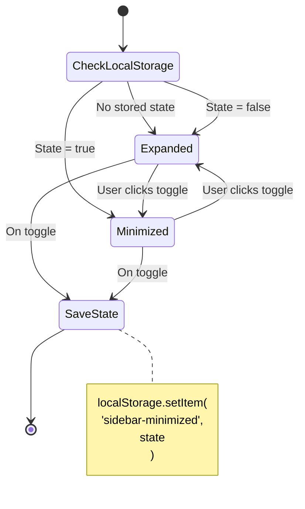
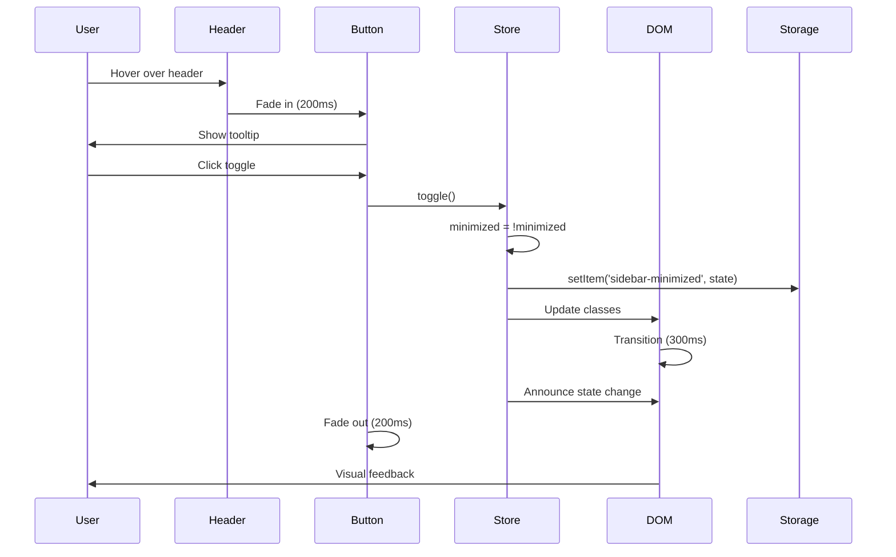
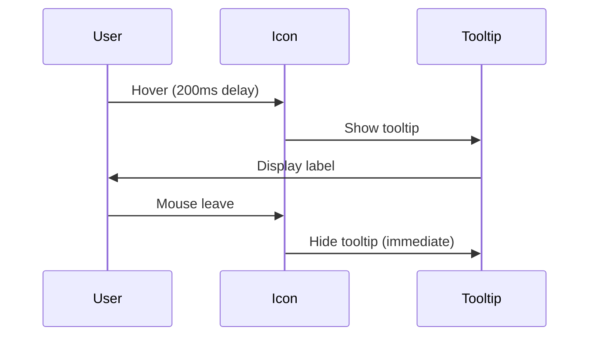

# Sidebar Minimize Feature - Design Document

**Feature Name**: sidebar-minimize  
**Document Type**: Design  
**Version**: 1.0.0  
**Date**: February 8, 2026  
**Status**: Planning - Ready for Implementation  
**Related Documents**:

- [Requirements](./requirements.md)
- [Implementation Plan](../../../docs/frontend-development/sidebar-minimize-implementation-plan.md)
- [Visual Reference](../../../docs/frontend-development/sidebar-minimize-visual-reference.md)

---

## 1. Design Overview

### 1.1 Architecture Approach

The sidebar minimize feature uses a **client-side state management** approach with Alpine.js stores for reactive UI updates and localStorage for persistence. The design follows the project's existing patterns:

- **Alpine.js Store**: Centralized state management
- **Blade Components**: Reusable UI components
- **Tailwind CSS**: Utility-first styling
- **Progressive Enhancement**: Works without JavaScript (defaults to expanded)

### 1.2 Design Principles

1. **Minimal Complexity**: Use existing project patterns and libraries
2. **Performance First**: GPU-accelerated transitions, no layout thrashing
3. **Accessibility First**: WCAG 2.2 AA compliance built-in
4. **Responsive by Default**: Adapts to all viewport sizes
5. **Maintainable**: Clear separation of concerns, well-documented

---

## 2. Component Architecture

### 2.1 Component Hierarchy

```
app.blade.php (Layout)
├── Alpine.js Store (sidebar)
├── Sidebar Container
│   ├── Logo Section
│   │   ├── Logo Image
│   │   └── Logo Text (conditional)
│   ├── Navigation Section
│   │   ├── Navigation Items
│   │   │   ├── Icon
│   │   │   ├── Label (conditional)
│   │   │   └── Tooltip (minimized only)
│   │   └── Collapsible Groups
│   │       ├── Group Header
│   │       └── Group Items (conditional)
│   ├── User Menu Section
│   │   ├── Avatar
│   │   ├── User Info (conditional)
│   │   └── Tooltip (minimized only)
│   └── Toggle Button
│       ├── Icon (chevron left/right)
│       └── ARIA Attributes
└── Main Content Area (dynamic padding)
```

### 2.2 State Flow Diagram



---

## 3. Data Model

### 3.1 Alpine.js Store Schema

```javascript
{
    // State
    minimized: boolean,          // Current sidebar state
    
    // Methods
    toggle(): void,              // Toggle between states
    expand(): void,              // Force expand
    minimize(): void,            // Force minimize
    announce(): void,            // Announce to screen readers
    
    // Computed (if needed)
    width: string,               // '288px' or '80px'
    contentPadding: string       // 'lg:pl-72' or 'lg:pl-20'
}
```

### 3.2 localStorage Schema

```javascript
{
    "sidebar-minimized": "true" | "false"  // String boolean
}
```

### 3.3 Component Props

**Sidebar Tooltip Component:**

```php
@props([
    'text' => '',              // Tooltip text
    'position' => 'right',     // Tooltip position
    'delay' => 200,            // Hover delay (ms)
])
```

---

## 4. UI/UX Design

### 4.1 Visual States

#### Expanded State (Default)

```
┌────────────────────────────────┐
│  ┌──────────────────────────┐  │
│  │ [Logo] Umamusume    [<<] │  │ ← Toggle appears on hover
│  │        Career Planner     │  │
│  └──────────────────────────┘  │
│                                │
│  📊  Dashboard                 │
│  ⭐  Characters                │
│  🏋️  Training                  │
│  🏇  Races                     │
│  ⚡  Skills                    │
│  🎴  Support Cards             │
│                                │
│  ▼  Data Management            │
│      • Data Hub                │
│      • Import Data             │
│      • Export Data             │
│                                │
│  ▼  Analytics                  │
│  ▼  AI Tools                   │
│                                │
│  ┌──────────────────────────┐  │
│  │ [Avatar] John Doe        │  │
│  │          john@email.com  │  │
│  └──────────────────────────┘  │
└────────────────────────────────┘
    Width: 288px (w-72)
```

#### Minimized State

```
┌────┐
│ 🏇 │  ← Logo Icon (always visible, never cropped)
│[>>]│  ← Toggle appears on hover
├────┤
│ 📊 │  ← Dashboard (tooltip on hover)
│ ⭐ │  ← Characters
│ 🏋️ │  ← Training
│ 🏇 │  ← Races
│ ⚡ │  ← Skills
│ 🎴 │  ← Support Cards
│ 💾 │  ← Data Management
│ 📊 │  ← Analytics
│ 🤖 │  ← AI Tools
├────┤
│ 👤 │  ← User Avatar (tooltip on hover)
└────┘
  80px
 (w-20)
```

### 4.2 Interaction Design

#### Toggle Button Interaction



#### Tooltip Interaction



### 4.3 Animation Specifications

**Sidebar Width Transition:**

```css
transition: width 300ms cubic-bezier(0.4, 0, 0.2, 1);
```

**Content Padding Transition:**

```css
transition: padding-left 300ms cubic-bezier(0.4, 0, 0.2, 1);
```

**Tooltip Fade In:**

```css
transition: opacity 200ms ease-out, transform 200ms ease-out;
transform: translateX(0);
```

**Tooltip Fade Out:**

```css
transition: opacity 150ms ease-in, transform 150ms ease-in;
transform: translateX(8px);
```

---

## 5. Technical Design

### 5.1 Alpine.js Store Implementation

```javascript
// resources/js/app.js

document.addEventListener('alpine:init', () => {
    Alpine.store('sidebar', {
        // Initialize from localStorage
        minimized: localStorage.getItem('sidebar-minimized') === 'true',
        
        // Toggle between states
        toggle() {
            this.minimized = !this.minimized;
            this.persist();
            this.announce();
        },
        
        // Force expand
        expand() {
            if (this.minimized) {
                this.minimized = false;
                this.persist();
                this.announce();
            }
        },
        
        // Force minimize
        minimize() {
            if (!this.minimized) {
                this.minimized = true;
                this.persist();
                this.announce();
            }
        },
        
        // Persist to localStorage
        persist() {
            try {
                localStorage.setItem('sidebar-minimized', this.minimized);
            } catch (e) {
                console.warn('Failed to persist sidebar state:', e);
            }
        },
        
        // Announce to screen readers
        announce() {
            const message = this.minimized 
                ? 'Sidebar minimized' 
                : 'Sidebar expanded';
            
            const announcer = document.getElementById('sidebar-announcer');
            if (announcer) {
                announcer.textContent = message;
                
                // Clear after announcement
                setTimeout(() => {
                    announcer.textContent = '';
                }, 1000);
            }
        }
    });
});
```

### 5.2 Sidebar Container Template

```blade
<!-- resources/views/layouts/app.blade.php -->

<!-- Desktop Sidebar (always visible on lg screens) -->
<div
    x-data
    :class="$store.sidebar.minimized ? 'lg:w-20' : 'lg:w-72'"
    class="hidden lg:fixed lg:inset-y-0 lg:left-0 lg:z-50 lg:flex lg:flex-col lg:border-r lg:border-gray-200 dark:lg:border-gray-700 lg:bg-white dark:lg:bg-gray-800 transition-all duration-300 ease-in-out"
>
    <x-app.sidebar />
</div>

<!-- Main Column of Content -->
<div 
    x-data
    :class="$store.sidebar.minimized ? 'lg:pl-20' : 'lg:pl-72'"
    class="flex flex-col min-h-screen transition-all duration-300 ease-in-out relative z-10"
>
    <!-- Content -->
</div>

<!-- Screen Reader Announcer -->
<div 
    id="sidebar-announcer" 
    class="sr-only" 
    role="status" 
    aria-live="polite" 
    aria-atomic="true"
></div>
```

### 5.3 Sidebar Component Updates

```blade
<!-- resources/views/components/app/sidebar.blade.php -->

<div class="flex grow flex-col gap-y-5 overflow-y-auto bg-white dark:bg-gray-800 px-6 pb-4">
    <!-- Logo Section with Hover Toggle -->
    <div 
        x-data="{ showToggle: false }"
        @mouseenter="showToggle = true"
        @mouseleave="showToggle = false"
        class="relative flex h-16 shrink-0 items-center border-b border-gray-200 dark:border-gray-700"
        :class="$store.sidebar.minimized ? 'justify-center px-2' : 'justify-between px-6'"
    >
        <!-- Logo -->
        <a href="/" class="flex items-center gap-3">
            
            <span 
                x-show="!$store.sidebar.minimized" 
                x-transition:enter="transition ease-out duration-200"
                x-transition:enter-start="opacity-0"
                x-transition:enter-end="opacity-100"
                x-transition:leave="transition ease-in duration-150"
                x-transition:leave-start="opacity-100"
                x-transition:leave-end="opacity-0"
                class="text-base font-bold text-primary-600 dark:text-primary-400 leading-tight"
            >
                Umamusume<br>Career Planner
            </span>
        </a>
        
        <!-- Toggle Button (appears on hover) -->
        <div
            x-show="showToggle"
            x-transition:enter="transition ease-out duration-200"
            x-transition:enter-start="opacity-0 scale-95"
            x-transition:enter-end="opacity-100 scale-100"
            x-transition:leave="transition ease-in duration-150"
            x-transition:leave-start="opacity-100 scale-100"
            x-transition:leave-end="opacity-0 scale-95"
            class="absolute top-2 right-2"
        >
            <x-sidebar-tooltip :text="$store.sidebar.minimized ? 'Expand sidebar' : 'Minimize sidebar'">
                <button
                    @click="$store.sidebar.toggle()"
                    type="button"
                    class="p-2 rounded-lg text-gray-600 dark:text-gray-400 hover:bg-gray-100 dark:hover:bg-gray-700 hover:text-gray-900 dark:hover:text-gray-100 transition-colors focus:outline-none focus:ring-2 focus:ring-inset focus:ring-primary-500"
                    :aria-label="$store.sidebar.minimized ? 'Expand sidebar' : 'Minimize sidebar'"
                    :aria-pressed="$store.sidebar.minimized"
                    aria-controls="sidebar-navigation"
                >
                    <!-- Chevron Double Left (Minimize) -->
                    <svg 
                        x-show="!$store.sidebar.minimized"
                        class="h-5 w-5" 
                        fill="none" 
                        viewBox="0 0 24 24" 
                        stroke-width="1.5" 
                        stroke="currentColor"
                    >
                        <path stroke-linecap="round" stroke-linejoin="round" d="m18.75 4.5-7.5 7.5 7.5 7.5m-6-15L5.25 12l7.5 7.5" />
                    </svg>
                    
                    <!-- Chevron Double Right (Expand) -->
                    <svg 
                        x-show="$store.sidebar.minimized"
                        class="h-5 w-5" 
                        fill="none" 
                        viewBox="0 0 24 24" 
                        stroke-width="1.5" 
                        stroke="currentColor"
                    >
                        <path stroke-linecap="round" stroke-linejoin="round" d="m5.25 4.5 7.5 7.5-7.5 7.5m6-15 7.5 7.5-7.5 7.5" />
                    </svg>
                </button>
            </x-sidebar-tooltip>
        </div>
    </div>

    <!-- Navigation Section -->
    <nav class="flex flex-1 flex-col">
        <ul role="list" class="flex flex-1 flex-col gap-y-7">
            <!-- Primary Navigation -->
            <li>
                <ul role="list" class="-mx-2 space-y-1">
                    <!-- Dashboard -->
                    <li>
                        <x-sidebar-nav-item 
                            href="{{ route('dashboard') }}"
                            :active="request()->routeIs('dashboard')"
                            icon="chart-bar"
                            label="Dashboard"
                        />
                    </li>
                    
                    <!-- More navigation items... -->
                </ul>
            </li>
            
            <!-- Collapsible Groups -->
            <li x-data="{ dataOpen: false }">
                <!-- Group Header (Expanded) -->
                <div x-show="!$store.sidebar.minimized">
                    <button 
                        @click="dataOpen = !dataOpen"
                        class="group flex w-full items-center gap-x-3 rounded-md p-2 text-sm font-semibold leading-6 text-gray-700 dark:text-gray-200 hover:bg-gray-50 dark:hover:bg-gray-700"
                    >
                        <svg class="h-6 w-6 shrink-0"><!-- Icon --></svg>
                        <span>Data Management</span>
                        <svg 
                            :class="dataOpen ? 'rotate-90' : ''"
                            class="ml-auto h-5 w-5 shrink-0 transition-transform"
                        >
                            <!-- Chevron icon -->
                        </svg>
                    </button>
                    
                    <!-- Group Items -->
                    <ul x-show="dataOpen" x-collapse class="mt-1 px-2">
                        <!-- Submenu items -->
                    </ul>
                </div>
                
                <!-- Group Icon (Minimized) -->
                <div x-show="$store.sidebar.minimized">
                    <x-sidebar-tooltip text="Data Management">
                        <button class="group flex w-full justify-center rounded-md p-2 text-gray-700 dark:text-gray-200 hover:bg-gray-50 dark:hover:bg-gray-700">
                            <svg class="h-7 w-7 shrink-0"><!-- Larger icon --></svg>
                        </button>
                    </x-sidebar-tooltip>
                </div>
            </li>
        </ul>
    </nav>

    <!-- User Menu Section -->
    @auth
        <div class="border-t border-gray-200 dark:border-gray-700 pt-4">
            <!-- Expanded User Menu -->
            <div x-show="!$store.sidebar.minimized">
                <a href="{{ route('profile.edit') }}" class="group flex items-center gap-x-3 rounded-md p-2 text-sm font-semibold leading-6 text-gray-700 dark:text-gray-200 hover:bg-gray-50 dark:hover:bg-gray-700">
                    avatar_url ?? 'https://ui-avatars.com/api/?name=' . urlencode(Auth::user()->name) }}" 
                        alt="{{ Auth::user()->name }}" 
                        class="h-8 w-8 rounded-full"
                    >
                    <span class="flex flex-col">
                        <span class="text-sm font-semibold">{{ Auth::user()->name }}</span>
                        <span class="text-xs text-gray-500 dark:text-gray-400">{{ Auth::user()->email }}</span>
                    </span>
                </a>
            </div>
            
            <!-- Minimized User Menu -->
            <div x-show="$store.sidebar.minimized">
                <x-sidebar-tooltip :text="Auth::user()->name">
                    <a href="{{ route('profile.edit') }}" class="group flex justify-center rounded-md p-2 hover:bg-gray-50 dark:hover:bg-gray-700">
                        avatar_url ?? 'https://ui-avatars.com/api/?name=' . urlencode(Auth::user()->name) }}" 
                            alt="{{ Auth::user()->name }}" 
                            class="h-8 w-8 rounded-full"
                        >
                    </a>
                </x-sidebar-tooltip>
            </div>
        </div>
    @endauth
</div>
```

### 5.4 Sidebar Navigation Item Component

```blade
<!-- resources/views/components/sidebar-nav-item.blade.php -->

@props([
    'href' => '#',
    'active' => false,
    'icon' => '',
    'label' => '',
])

<div x-data>
    <!-- Expanded State -->
    <a 
        x-show="!$store.sidebar.minimized"
        href="{{ $href }}"
        @class([
            'group flex items-center gap-x-3 rounded-md p-2 text-sm font-semibold leading-6 transition-colors',
            'bg-gray-50 dark:bg-gray-700 text-primary-600 dark:text-primary-400' => $active,
            'text-gray-700 dark:text-gray-200 hover:bg-gray-50 dark:hover:bg-gray-700 hover:text-gray-900 dark:hover:text-gray-100' => !$active,
        ])
        aria-current="{{ $active ? 'page' : 'false' }}"
    >
        <x-dynamic-component :component="'heroicon-o-' . $icon" class="h-6 w-6 shrink-0" />
        <span>{{ $label }}</span>
    </a>
    
    <!-- Minimized State with Tooltip -->
    <div x-show="$store.sidebar.minimized">
        <x-sidebar-tooltip :text="$label">
            <a 
                href="{{ $href }}"
                @class([
                    'group flex justify-center rounded-md p-2 transition-colors',
                    'bg-gray-50 dark:bg-gray-700 text-primary-600 dark:text-primary-400' => $active,
                    'text-gray-700 dark:text-gray-200 hover:bg-gray-50 dark:hover:bg-gray-700 hover:text-gray-900 dark:hover:text-gray-100' => !$active,
                ])
                aria-current="{{ $active ? 'page' : 'false' }}"
            >
                <x-dynamic-component :component="'heroicon-o-' . $icon" class="h-7 w-7 shrink-0" />
            </a>
        </x-sidebar-tooltip>
    </div>
</div>
```

### 5.5 Sidebar Tooltip Component

```blade
<!-- resources/views/components/sidebar-tooltip.blade.php -->

@props([
    'text' => '',
    'position' => 'right',
    'delay' => 200,
])

<div 
    x-data="{ 
        show: false,
        timeout: null,
        enter() {
            this.timeout = setTimeout(() => {
                this.show = true;
            }, {{ $delay }});
        },
        leave() {
            clearTimeout(this.timeout);
            this.show = false;
        }
    }"
    @mouseenter="enter()"
    @mouseleave="leave()"
    @focus="enter()"
    @blur="leave()"
    class="relative inline-block"
>
    {{ $slot }}
    
    <div 
        x-show="show"
        x-transition:enter="transition ease-out duration-200"
        x-transition:enter-start="opacity-0 translate-x-2"
        x-transition:enter-end="opacity-100 translate-x-0"
        x-transition:leave="transition ease-in duration-150"
        x-transition:leave-start="opacity-100 translate-x-0"
        x-transition:leave-end="opacity-0 translate-x-2"
        @class([
            'absolute z-50 px-3 py-2 text-sm font-medium text-white bg-gray-900 dark:bg-gray-700 rounded-lg shadow-lg whitespace-nowrap pointer-events-none',
            'left-full ml-2 top-1/2 -translate-y-1/2' => $position === 'right',
            'right-full mr-2 top-1/2 -translate-y-1/2' => $position === 'left',
        ])
        role="tooltip"
    >
        {{ $text }}
        
        <!-- Arrow -->
        <div 
            @class([
                'absolute w-2 h-2 bg-gray-900 dark:bg-gray-700 rotate-45',
                '-left-1 top-1/2 -translate-y-1/2' => $position === 'right',
                '-right-1 top-1/2 -translate-y-1/2' => $position === 'left',
            ])
        ></div>
    </div>
</div>
```

---

## 6. Accessibility Design

### 6.1 ARIA Implementation

**Toggle Button:**

```html
<button
    aria-label="Minimize sidebar"
    aria-pressed="false"
    aria-controls="sidebar-navigation"
    role="button"
>
```

**Sidebar Container:**

```html
<nav
    id="sidebar-navigation"
    aria-label="Main navigation"
    aria-expanded="true"
>
```

**Screen Reader Announcer:**

```html
<div 
    id="sidebar-announcer"
    role="status"
    aria-live="polite"
    aria-atomic="true"
    class="sr-only"
></div>
```

### 6.2 Keyboard Navigation

**Focus Order:**

1. Skip to content link
2. Mobile hamburger menu (mobile only)
3. Sidebar navigation items
4. Sidebar toggle button
5. Main content area

**Keyboard Shortcuts:**

- `Tab`: Navigate to next focusable element
- `Shift + Tab`: Navigate to previous focusable element
- `Enter` / `Space`: Activate toggle button
- `Escape`: Close mobile sidebar (existing behavior)

### 6.3 Reduced Motion Support

```css
@media (prefers-reduced-motion: reduce) {
    .sidebar-transition,
    .content-transition {
        transition-duration: 0.01ms !important;
    }
}
```

---

## 7. Performance Optimization

### 7.1 CSS Optimization

**Use GPU-Accelerated Properties:**

```css
/* Good: GPU-accelerated */
transform: translateX(0);
opacity: 1;

/* Avoid: Causes layout reflow */
width: 288px;
padding-left: 288px;
```

**Composite Layers:**

```css
.sidebar {
    will-change: transform;
    transform: translateZ(0);
}
```

### 7.2 JavaScript Optimization

**Debounce Toggle Clicks:**

```javascript
toggle() {
    if (this.toggling) return;
    
    this.toggling = true;
    this.minimized = !this.minimized;
    this.persist();
    this.announce();
    
    setTimeout(() => {
        this.toggling = false;
    }, 300);
}
```

### 7.3 localStorage Optimization

**Minimize Writes:**

```javascript
persist() {
    // Only write if state actually changed
    const current = localStorage.getItem('sidebar-minimized');
    const newState = String(this.minimized);
    
    if (current !== newState) {
        try {
            localStorage.setItem('sidebar-minimized', newState);
        } catch (e) {
            console.warn('Failed to persist sidebar state:', e);
        }
    }
}
```

---

## 8. Error Handling

### 8.1 localStorage Unavailable

```javascript
persist() {
    try {
        localStorage.setItem('sidebar-minimized', this.minimized);
    } catch (e) {
        // localStorage quota exceeded or unavailable
        console.warn('Failed to persist sidebar state:', e);
        // Feature still works, just doesn't persist
    }
}
```

### 8.2 Alpine.js Store Not Initialized

```blade
<!-- Fallback to expanded state -->
<div 
    x-data
    :class="$store.sidebar?.minimized ? 'lg:w-20' : 'lg:w-72'"
    class="lg:w-72"
>
```

### 8.3 JavaScript Disabled

```html
<!-- Graceful degradation: sidebar defaults to expanded -->
<div class="lg:w-72">
    <!-- Sidebar content -->
</div>
```

---

## 9. Testing Strategy

### 9.1 Unit Tests

```php
// tests/Feature/SidebarMinimizeTest.php

it('initializes with expanded state by default')
it('toggles to minimized state')
it('persists state to localStorage')
it('restores state from localStorage')
it('handles localStorage errors gracefully')
```

### 9.2 Browser Tests

```php
// tests/Browser/SidebarMinimizeTest.php

it('toggles sidebar with mouse click')
it('toggles sidebar with keyboard')
it('shows tooltips on hover in minimized state')
it('maintains navigation functionality')
it('persists state across page navigation')
```

### 9.3 Accessibility Tests

```javascript
// tests/e2e/accessibility/sidebar-minimize.spec.js

test('has no accessibility violations')
test('toggle button has correct ARIA attributes')
test('announces state changes to screen readers')
test('maintains keyboard navigation flow')
test('respects prefers-reduced-motion')
```

---

## 10. Deployment Considerations

### 10.1 Feature Flag (Optional)

```php
// config/features.php
return [
    'sidebar_minimize' => env('FEATURE_SIDEBAR_MINIMIZE', true),
];
```

```blade
@if(config('features.sidebar_minimize'))
    <!-- Toggle button -->
@endif
```

### 10.2 Rollback Plan

If issues arise:

1. Set feature flag to `false`
2. Clear localStorage: `localStorage.removeItem('sidebar-minimized')`
3. Revert to previous sidebar implementation
4. No database changes required (client-side only)

### 10.3 Monitoring

**Metrics to Track:**

- localStorage write errors
- JavaScript errors related to Alpine.js store
- User adoption rate (% using minimize feature)
- Performance impact (page load time)

---

## 11. Future Enhancements

### 11.1 Phase 2 Features

1. **Keyboard Shortcut**: Global shortcut (Alt+B) to toggle
2. **Hover Expand**: Temporarily expand on hover when minimized
3. **Custom Width**: Allow users to set custom sidebar width
4. **Pinned Items**: Keep certain items always visible
5. **Animation Presets**: Multiple transition styles

### 11.2 Integration Opportunities

1. **User Preferences API**: Sync state across devices
2. **Analytics**: Track usage patterns
3. **Onboarding**: Tutorial for new users
4. **Themes**: Different icon styles for minimized state

---

## 12. Correctness Properties

### 12.1 State Consistency

**Property 1.1**: Sidebar width and content padding are always synchronized

```
∀ state ∈ {expanded, minimized}:
    sidebar.width = (state = expanded) ? 288px : 80px
    content.paddingLeft = (state = expanded) ? 288px : 80px
```

**Property 1.2**: localStorage state matches UI state

```
∀ toggle operation:
    localStorage['sidebar-minimized'] = String(store.minimized)
```

### 12.2 Accessibility Invariants

**Property 2.1**: Toggle button always has correct ARIA attributes

```
∀ state ∈ {expanded, minimized}:
    button['aria-pressed'] = String(state = minimized)
    button['aria-label'] = (state = minimized) ? 'Expand sidebar' : 'Minimize sidebar'
```

**Property 2.2**: All navigation items remain keyboard accessible

```
∀ nav_item ∈ navigation:
    nav_item.tabIndex ≥ 0
    nav_item.focusable = true
```

### 12.3 Performance Guarantees

**Property 3.1**: Transition duration is constant

```
∀ toggle operation:
    transition.duration = 300ms
```

**Property 3.2**: No layout reflow during transition

```
∀ toggle operation:
    layout.reflow = false
    paint.layers = GPU_accelerated
```

---

## 13. Document Control

**Version History:**

| Version | Date | Author | Changes |
|---------|------|--------|---------|
| 1.0.0 | 2026-02-08 | Development Team | Initial design document |

**Next Review**: Post-implementation (Week 4)

**Status**: Planning Complete - Ready for Implementation
