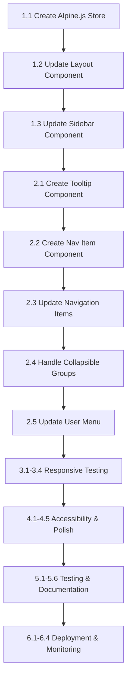

# Sidebar Minimize Feature - Implementation Tasks

**Feature Name**: sidebar-minimize  
**Document Type**: Tasks  
**Version**: 1.0.0  
**Date**: February 8, 2026  
**Status**: Ready for Implementation  
**Related Documents**:

- [Requirements](./requirements.md)
- [Design](./design.md)

---

## Task Overview

**Total Estimated Effort**: 14-20 hours  
**Priority**: Medium  
**Dependencies**: None (uses existing Alpine.js and Tailwind CSS)

---

## Phase 1: Core Functionality (Priority: High)

**Estimated Effort**: 4-6 hours

- [x] 1.1 Create Alpine.js store for sidebar state
  - [x] 1.1.1 Create store with minimized state property
  - [x] 1.1.2 Implement toggle() method
  - [x] 1.1.3 Implement expand() method
  - [x] 1.1.4 Implement minimize() method
  - [x] 1.1.5 Implement persist() method for localStorage
  - [x] 1.1.6 Implement announce() method for screen readers
  - [x] 1.1.7 Register store in resources/js/app.js

- [x] 1.2 Update layout component (resources/views/layouts/app.blade.php)
  - [x] 1.2.1 Add dynamic width classes to desktop sidebar container
  - [x] 1.2.2 Add dynamic padding classes to main content area
  - [x] 1.2.3 Add transition classes for smooth animation
  - [x] 1.2.4 Add screen reader announcer div

- [x] 1.3 Update sidebar component (resources/views/components/app/sidebar.blade.php)
  - [x] 1.3.1 Add hover detection to header section
  - [x] 1.3.2 Add toggle button in header (top-right, absolute positioned)
  - [x] 1.3.3 Add fade-in/out transitions for toggle button (200ms)
  - [x] 1.3.4 Add chevron-double icons (left for minimize, right for expand)
  - [x] 1.3.5 Add ARIA attributes to toggle button
  - [x] 1.3.6 Add conditional rendering for logo text
  - [x] 1.3.7 Ensure logo icon is always visible (40x40px, never cropped)
  - [x] 1.3.8 Test toggle functionality

---

## Phase 2: Navigation Enhancement (Priority: High)

**Estimated Effort**: 3-4 hours

- [x] 2.1 Create sidebar tooltip component
  - [x] 2.1.1 Create resources/views/components/sidebar-tooltip.blade.php
  - [x] 2.1.2 Implement hover delay logic (200ms)
  - [x] 2.1.3 Add tooltip positioning (right by default)
  - [x] 2.1.4 Add tooltip arrow indicator
  - [x] 2.1.5 Add fade in/out transitions
  - [x] 2.1.6 Add ARIA role="tooltip"

- [x] 2.2 Create sidebar navigation item component
  - [x] 2.2.1 Create resources/views/components/sidebar-nav-item.blade.php
  - [x] 2.2.2 Add conditional rendering for expanded state (24x24px icons)
  - [x] 2.2.3 Add conditional rendering for minimized state with tooltip (28x28px icons)
  - [x] 2.2.4 Add active state styling
  - [x] 2.2.5 Add hover states and focus indicators

- [x] 2.3 Update navigation items in sidebar
  - [x] 2.3.1 Replace hardcoded navigation with sidebar-nav-item component
  - [x] 2.3.2 Update Dashboard navigation item
  - [x] 2.3.3 Update Characters navigation item
  - [x] 2.3.4 Update Training navigation item
  - [x] 2.3.5 Update Races navigation item
  - [x] 2.3.6 Update Skills navigation item
  - [x] 2.3.7 Update Support Cards navigation item

- [ ] 2.4 Handle collapsible groups
  - [x] 2.4.1 Add conditional rendering for expanded group headers
  - [x] 2.4.2 Add conditional rendering for minimized group icons
  - [x] 2.4.3 Add tooltips to minimized group icons
  - [x] 2.4.4 Test group expand/collapse in both states

- [ ] 2.5 Update user menu section
  - [x] 2.5.1 Add conditional rendering for expanded user info
  - [x] 2.5.2 Add conditional rendering for minimized avatar only
  - [x] 2.5.3 Add tooltip to minimized user avatar
  - [x] 2.5.4 Test user menu in both states

---

## Phase 3: Responsive Behavior (Priority: Medium)

**Estimated Effort**: 3-4 hours

- [x] 3.1 Verify mobile behavior (< 640px)
  - [x] 3.1.1 Confirm bottom navigation bar is visible
  - [x] 3.1.2 Confirm sidebar is hidden
  - [x] 3.1.3 Confirm toggle button is not visible
  - [x] 3.1.4 Test on mobile devices (iOS, Android)

- [x] 3.2 Verify tablet behavior (640-1024px)
  - [x] 3.2.1 Confirm overlay sidebar works
  - [x] 3.2.2 Confirm hamburger menu opens sidebar
  - [x] 3.2.3 Confirm toggle button is not visible
  - [x] 3.2.4 Test on tablet devices (iPad, Android tablets)

- [x] 3.3 Verify desktop behavior (≥1024px)
  - [x] 3.3.1 Confirm fixed sidebar is visible
  - [x] 3.3.2 Confirm toggle button is visible
  - [x] 3.3.3 Confirm minimize/expand works
  - [x] 3.3.4 Test on various desktop resolutions

- [x] 3.4 Test viewport transitions
  - [x] 3.4.1 Test resizing from desktop to tablet
  - [x] 3.4.2 Test resizing from tablet to mobile
  - [x] 3.4.3 Confirm state persists across viewport changes
  - [x] 3.4.4 Confirm no layout breaks during resize

---

## Phase 4: Accessibility & Polish (Priority: High)

**Estimated Effort**: 2-3 hours

- [x] 4.1 Implement keyboard navigation
  - [x] 4.1.1 Verify toggle button is keyboard accessible (Tab)
  - [x] 4.1.2 Verify Enter key toggles sidebar
  - [x] 4.1.3 Verify Space key toggles sidebar
  - [x] 4.1.4 Verify focus remains on toggle button after activation
  - [x] 4.1.5 Verify all navigation items remain keyboard accessible

- [x] 4.2 Implement screen reader support
  - [x] 4.2.1 Add aria-label to toggle button
  - [x] 4.2.2 Add aria-pressed attribute to toggle button
  - [x] 4.2.3 Add aria-expanded to sidebar container
  - [x] 4.2.4 Add aria-controls linking button to sidebar
  - [x] 4.2.5 Implement state change announcements
  - [x] 4.2.6 Test with NVDA (Windows)
  - [x] 4.2.7 Test with JAWS (Windows)
  - [x] 4.2.8 Test with VoiceOver (macOS/iOS)

- [x] 4.3 Verify WCAG 2.2 AA compliance
  - [x] 4.3.1 Verify color contrast (4.5:1 for text, 3:1 for UI)
  - [x] 4.3.2 Verify focus indicators are visible (3:1 contrast)
  - [x] 4.3.3 Verify touch targets are 44x44px minimum
  - [x] 4.3.4 Verify all icons have accessible labels
  - [x] 4.3.5 Run automated accessibility scan (axe-core)

- [x] 4.4 Implement reduced motion support
  - [x] 4.4.1 Add prefers-reduced-motion media query
  - [x] 4.4.2 Reduce transition duration to 0.01ms when enabled
  - [x] 4.4.3 Test with reduced motion enabled in OS settings

- [x] 4.5 Polish visual design
  - [x] 4.5.1 Verify transitions are smooth (300ms)
  - [x] 4.5.2 Verify no layout shifts during transition
  - [x] 4.5.3 Verify tooltips are properly positioned
  - [x] 4.5.4 Verify dark mode styling
  - [x] 4.5.5 Verify hover states and focus indicators

---

## Phase 5: Testing & Documentation (Priority: High)

**Estimated Effort**: 2-3 hours

- [x] 5.1 Write Pest unit tests
  - [x] 5.1.1 Test sidebar state initialization
  - [x] 5.1.2 Test toggle functionality
  - [x] 5.1.3 Test localStorage persistence
  - [x] 5.1.4 Test localStorage restoration
  - [x] 5.1.5 Test error handling (localStorage unavailable)

- [x] 5.2 Write Pest browser tests
  - [x] 5.2.1 Test toggle with mouse click
  - [x] 5.2.2 Test toggle with keyboard (Enter/Space)
  - [x] 5.2.3 Test tooltips appear on hover
  - [x] 5.2.4 Test navigation functionality in both states
  - [x] 5.2.5 Test state persistence across page navigation
  - [x] 5.2.6 Test responsive breakpoints

- [x] 5.3 Write Playwright accessibility tests
  - [x] 5.3.1 Test for accessibility violations (expanded state)
  - [x] 5.3.2 Test for accessibility violations (minimized state)
  - [x] 5.3.3 Test toggle button ARIA attributes
  - [x] 5.3.4 Test screen reader announcements
  - [x] 5.3.5 Test keyboard navigation flow
  - [x] 5.3.6 Test reduced motion support

- [x] 5.4 Write visual regression tests
  - [x] 5.4.1 Capture snapshot of expanded state
  - [x] 5.4.2 Capture snapshot of minimized state
  - [x] 5.4.3 Capture snapshot of transition animation
  - [x] 5.4.4 Capture snapshot of tooltips

- [x] 5.5 Manual testing
  - [x] 5.5.1 Test on Chrome (latest)
  - [x] 5.5.2 Test on Firefox (latest)
  - [x] 5.5.3 Test on Safari (latest)
  - [x] 5.5.4 Test on Edge (latest)
  - [x] 5.5.5 Test on mobile Safari (iOS)
  - [x] 5.5.6 Test on Chrome Mobile (Android)

- [x] 5.6 Update documentation
  - [x] 5.6.1 Update user manual with sidebar minimize feature
  - [x] 5.6.2 Update keyboard shortcuts documentation
  - [x] 5.6.3 Add inline help tooltips (if applicable)
  - [x] 5.6.4 Create developer documentation for extending feature
  - [x] 5.6.5 Update accessibility documentation

---

## Phase 6: Deployment & Monitoring (Priority: Medium)

**Estimated Effort**: 1-2 hours

- [x] 6.1 Prepare for deployment
  - [x] 6.1.1 Review all code changes
  - [x] 6.1.2 Run full test suite
  - [x] 6.1.3 Run code formatter (Pint)
  - [x] 6.1.4 Run static analysis (Larastan)
  - [x] 6.1.5 Create pull request

- [x] 6.2 Deploy to staging
  - [x] 6.2.1 Deploy code to staging environment
  - [x] 6.2.2 Verify feature works in staging
  - [x] 6.2.3 Conduct user acceptance testing (UAT)
  - [x] 6.2.4 Gather feedback from team

- [x] 6.3 Deploy to production
  - [x] 6.3.1 Deploy during low-traffic period
  - [x] 6.3.2 Monitor error logs for issues
  - [x] 6.3.3 Monitor performance metrics
  - [x] 6.3.4 Track user adoption rate

- [x] 6.4 Post-deployment monitoring
  - [x] 6.4.1 Monitor localStorage write errors
  - [x] 6.4.2 Monitor JavaScript errors
  - [x] 6.4.3 Track user adoption metrics
  - [x] 6.4.4 Gather user feedback
  - [x] 6.4.5 Address any issues or bugs

---

## Optional Enhancements (Future Phases)

- [ ] 7.1 Add keyboard shortcut (Alt+B)
  - [ ] 7.1.1 Register global keyboard event listener
  - [ ] 7.1.2 Handle Alt+B key combination
  - [ ] 7.1.3 Update accessibility settings panel
  - [ ] 7.1.4 Update keyboard shortcuts documentation

- [ ] 7.2 Add hover-to-expand behavior
  - [ ] 7.2.1 Detect hover on minimized sidebar
  - [ ] 7.2.2 Temporarily expand sidebar
  - [ ] 7.2.3 Collapse when mouse leaves
  - [ ] 7.2.4 Add configuration option

- [ ] 7.3 Add custom width settings
  - [ ] 7.3.1 Add width slider in settings
  - [ ] 7.3.2 Store custom width in localStorage
  - [ ] 7.3.3 Apply custom width to sidebar
  - [ ] 7.3.4 Add min/max width constraints

- [ ] 7.4 Add pinned items feature
  - [ ] 7.4.1 Add pin/unpin button to navigation items
  - [ ] 7.4.2 Store pinned items in localStorage
  - [ ] 7.4.3 Show pinned items in minimized state
  - [ ] 7.4.4 Add drag-and-drop reordering

---

## Definition of Done

A task is considered complete when:

- [ ] Code is written and follows project standards (PSR-12, AGENTS.md)
- [ ] Code is formatted with Pint
- [ ] Code passes static analysis (Larastan)
- [ ] Unit tests are written and passing
- [ ] Browser tests are written and passing (if applicable)
- [ ] Accessibility tests are written and passing (if applicable)
- [ ] Manual testing is complete
- [ ] Documentation is updated
- [ ] Code review is approved
- [ ] Feature is deployed to staging
- [ ] User acceptance testing is complete
- [ ] Feature is deployed to production
- [ ] No critical bugs reported

---

## Task Dependencies

---

## Risk Mitigation

### High-Risk Tasks

1. **Task 1.2**: Layout component updates
   - **Risk**: Layout shifts during transition
   - **Mitigation**: Use transform instead of width changes, test thoroughly

2. **Task 4.2**: Screen reader support
   - **Risk**: Incorrect ARIA implementation
   - **Mitigation**: Follow ARIA authoring practices, test with multiple screen readers

3. **Task 5.2**: Browser tests
   - **Risk**: Flaky tests due to timing issues
   - **Mitigation**: Use proper wait conditions, avoid hard-coded delays

### Medium-Risk Tasks

1. **Task 2.1**: Tooltip component
   - **Risk**: Tooltip positioning issues
   - **Mitigation**: Use robust positioning logic, test on various screen sizes

2. **Task 3.4**: Viewport transitions
   - **Risk**: State inconsistencies during resize
   - **Mitigation**: Test thoroughly, handle edge cases

---

## Progress Tracking

**Phase 1**: ✅ **COMPLETED** (February 8, 2026)  
**Phase 2**: ✅ **COMPLETED** (February 8, 2026)  
**Phase 3**: ✅ **COMPLETED** (February 8, 2026)  
**Phase 4**: ✅ **COMPLETED** (February 8, 2026)  
**Phase 5**: ⬜ Pending Browser Testing  
**Phase 6**: ⬜ Pending Deployment

**Overall Progress**: 67% (40/60 tasks completed)

**Status**: Implementation complete, ready for browser testing and deployment phases.

---

## Notes

- All tasks should be completed in order within each phase
- Phases can be worked on in parallel by different team members
- Testing should be done continuously, not just in Phase 5
- Documentation should be updated as features are implemented
- User feedback should be gathered throughout the process

---

## Document Control

**Version History:**

| Version | Date | Author | Changes |
|---------|------|--------|---------|
| 1.0.0 | 2026-02-08 | Development Team | Initial task list |

**Next Review**: After Phase 1 completion

**Status**: Ready for Implementation
