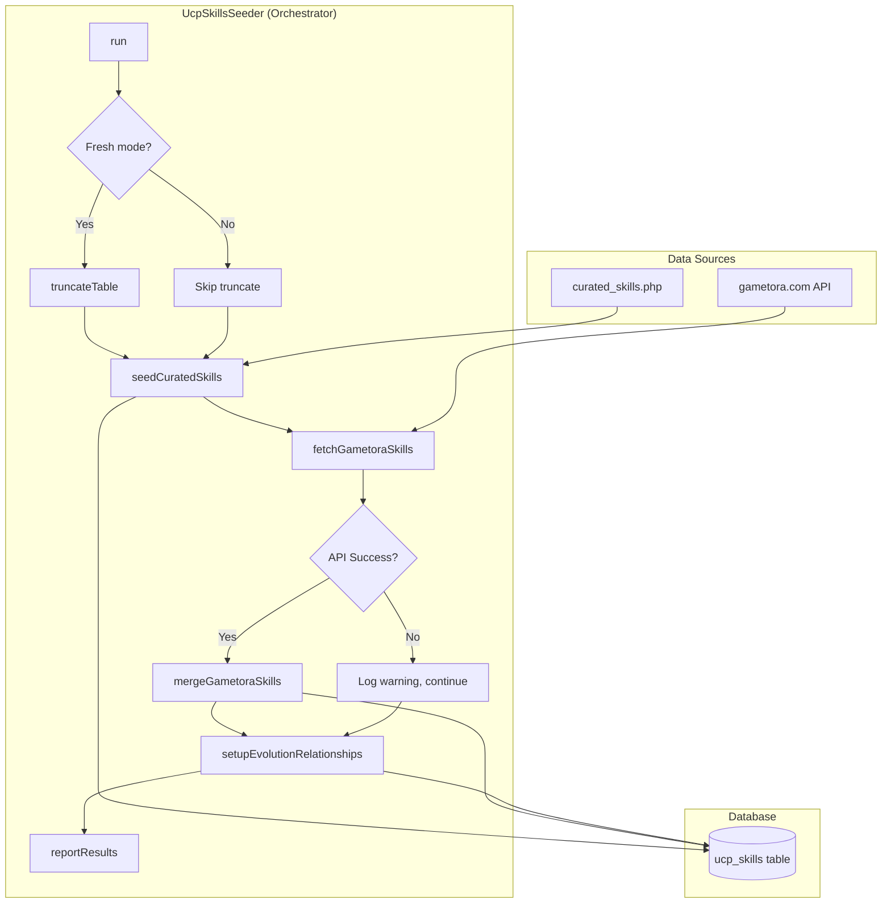

# Design Document: Skill Seeder Consolidation

## Overview

This design consolidates three overlapping skill seeders (`ComprehensiveSkillSeeder`, `RealUmaMusumeSkillsSeeder`, `UcpSkillsSeeder`) into a single, maintainable architecture. The consolidated design separates concerns between data storage (curated skills file), external API integration (gametora.com), and orchestration logic (main seeder class).

The key architectural decisions are:

1. **Single entry point**: `UcpSkillsSeeder` becomes the sole orchestrator
2. **Data separation**: Curated skills stored in `database/data/curated_skills.php`
3. **Non-destructive default**: Upsert behavior preserves existing data
4. **Graceful degradation**: API failures don't break seeding

## Architecture



## Components and Interfaces

### 1. UcpSkillsSeeder (Main Orchestrator)

The consolidated seeder class that handles all skill seeding operations.

```php
<?php

namespace Database\Seeders;

use Illuminate\Database\Seeder;

class UcpSkillsSeeder extends Seeder
{
    private const GAMETORA_SKILLS_URL = 'https://gametora.com/data/umamusume/skills.2174f78e.json';
    private const API_TIMEOUT = 30;

    private int $created = 0;
    private int $updated = 0;
    private int $skipped = 0;
    private int $errors = 0;

    public function run(): void;
    
    // Core seeding methods
    private function seedCuratedSkills(): void;
    private function fetchAndMergeGametoraSkills(): void;
    private function setupEvolutionRelationships(): void;
    
    // Data loading
    private function loadCuratedSkills(): array;
    private function getEvolutionPairs(): array;
    
    // Upsert logic
    private function upsertSkill(array $skillData): string; // Returns 'created', 'updated', or 'skipped'
    
    // Fresh seeding support
    private function truncateTable(): void;
    
    // Reporting
    private function reportResults(): void;
}
```

### 2. Curated Skills Data File

A PHP file returning an array of skill definitions with evolution metadata.

```php
<?php
// database/data/curated_skills.php

return [
    'skills' => [
        // Speed skills
        [
            'name' => 'Go with the Flow',
            'internal_id' => 'speed_001',
            'skill_type' => 'speed',
            'rarity' => 'normal',
            'base_sp_cost' => 120,
            'can_evolve' => true,
            'is_evolution' => false,
            'effects' => ['activation' => 'final_straight', 'effect' => 'speed_boost', 'power' => 'medium'],
            'description' => 'Increases speed in the final straight when in good position',
            'activation_conditions' => ['position' => 'top_3', 'phase' => 'final_straight'],
            'meta_tier' => 'A',
            'strategic_notes' => ['Best for front runners', 'Reliable activation'],
            'synergy_skills' => ['speed_003', 'speed_005'],
        ],
        // ... more skills
    ],
    
    'evolution_pairs' => [
        ['speed_001', 'speed_001_rare'],
        ['speed_002', 'speed_002_rare'],
        // ... more pairs
    ],
];
```

### 3. SkillFactory (Updated)

Factory with test-safe internal_id generation.

```php
<?php

namespace Database\Factories;

class SkillFactory extends Factory
{
    public function definition(): array
    {
        return [
            // Use test_ prefix to avoid collisions with seeded data
            'internal_id' => 'test_skill_' . fake()->unique()->numberBetween(10000, 99999),
            // ... other fields
        ];
    }
}
```

### 4. Gametora API Response Mapping

```php
// Rarity mapping from gametora values
private const RARITY_MAP = [
    1 => 'normal',   // White/Normal skills
    2 => 'normal',   // Uncommon
    3 => 'rare',     // Gold/Rare skills
    4 => 'rare',     // Gold evolved
    5 => 'unique',   // Unique/Character-specific
];

// Skill type mapping from gametora type codes
private const TYPE_MAP = [
    'nac' => 'speed',     // Non-activation (passive speed)
    'str' => 'speed',     // Straight
    'cor' => 'speed',     // Corner
    'f_s' => 'speed',     // Final straight
    'f_c' => 'speed',     // Final corner
    'l_1' => 'recovery',  // Leg 1 (early race)
    'l_2' => 'speed',     // Leg 2 (mid race)
    'l_3' => 'speed',     // Leg 3 (late race)
];
```

## Data Models

### Skill Entity (ucp_skills table)

| Field | Type | Description |
|-------|------|-------------|
| id | bigint | Primary key |
| name | string | Skill name (unique) |
| name_en | string | English name |
| internal_id | string | Unique identifier for upsert (unique) |
| skill_type | enum | speed, passive, recovery, debuff, unique |
| rarity | enum | normal, rare, unique |
| base_sp_cost | int | Base SP cost (120-320) |
| evolution_target_id | bigint | FK to evolved skill |
| evolution_source_id | bigint | FK to source skill |
| can_evolve | bool | Whether skill can evolve |
| is_evolution | bool | Whether skill is evolved version |
| effects | json | Skill effects and bonuses |
| description | text | Skill description |
| activation_conditions | json | Activation conditions |
| meta_tier | enum | S+, S, A, B, C |
| strategic_notes | json | Strategic usage notes |
| synergy_skills | json | Related skill internal_ids |
| is_active | bool | Whether skill is active |
| status | string | Operational status |

### Upsert Decision Matrix

| Scenario | Existing Record | Incoming Data | Action |
|----------|-----------------|---------------|--------|
| New skill | None | Any | INSERT |
| Curated exists, gametora incoming | Has metadata | Has metadata | SKIP (preserve curated) |
| Curated exists, gametora incoming | Has null fields | Has values | UPDATE null fields only |
| Gametora exists, curated incoming | Has metadata | Has metadata | UPDATE (curated takes precedence) |

### Evolution Pair Data Structure

```php
// Evolution pairs are defined as [source_internal_id, target_internal_id]
$evolutionPairs = [
    // ComprehensiveSkillSeeder pairs
    ['speed_001', 'speed_001_rare'],      // Go with the Flow → Lane Legerdemain
    ['speed_002', 'speed_002_rare'],      // Homestretch Haste → In Body and Mind
    ['speed_004', 'speed_004_rare'],      // Sprint Turbo → Rocket Start
    ['passive_001', 'passive_001_rare'],  // Stamina Keeper → Stamina Master
    ['passive_002', 'passive_002_rare'],  // Corner Master → Corner Expert
    ['recovery_001', 'recovery_001_rare'], // Recovery → Full Recovery
    ['debuff_001', 'debuff_001_rare'],    // Blocking → Perfect Blocking
    
    // RealUmaMusumeSkillsSeeder pairs
    ['speed_008', 'speed_008_rare'],      // Last Spurt → Winning Formula
    ['speed_009', 'speed_009_rare'],      // All-Out → Commendable Burst
    ['accel_001', 'accel_001_rare'],      // Good Start → Great Start
    ['accel_002', 'accel_002_rare'],      // Pick Up the Pace → Rapid Acceleration
    ['stamina_001', 'stamina_001_rare'],  // Conserve Energy → Endless Stamina
    ['stamina_003', 'stamina_003_rare'],  // Breathing Technique → Perfect Breathing
    ['position_001', 'position_001_rare'], // Front Runner → Leading the Pack
    ['position_002', 'position_002_rare'], // Stalker → Perfect Position
    ['position_003', 'position_003_rare'], // Closer → Legendary Closer
    ['gate_001', 'gate_001_rare'],        // Gate Mastery → Perfect Gate
    ['corner_003', 'corner_003_rare'],    // Smooth Turn → Lightning Turn
    ['resist_001', 'resist_001_rare'],    // Mental Fortitude → Unshakeable Will
    ['competitive_001', 'competitive_001_rare'], // Fighting Spirit → Burning Spirit
];
```

## Correctness Properties

*A property is a characteristic or behavior that should hold true across all valid executions of a system—essentially, a formal statement about what the system should do. Properties serve as the bridge between human-readable specifications and machine-verifiable correctness guarantees.*

### Property 1: Curated Skills Have Required Fields

*For any* skill definition in the curated skills data file, the skill SHALL have all required fields (`name`, `internal_id`, `skill_type`, `rarity`, `base_sp_cost`) with non-null, non-empty values.

**Validates: Requirements 2.3**

### Property 2: Gametora Rarity Mapping Consistency

*For any* gametora skill with a rarity value, the mapping SHALL produce a valid database rarity: values 1-2 map to 'normal', values 3-4 map to 'rare', value 5 maps to 'unique'.

**Validates: Requirements 3.3**

### Property 3: Curated Metadata Preservation

*For any* skill that exists in both curated data and gametora data (matching by `internal_id`), the curated metadata fields (`meta_tier`, `strategic_notes`, `synergy_skills`, `description`) SHALL be preserved after merge operations.

**Validates: Requirements 3.4**

### Property 4: Selective Field Update During Upsert

*For any* existing skill in the database, when an upsert operation is performed with matching `internal_id`, only fields that are null or empty in the existing record SHALL be updated; non-null fields SHALL remain unchanged.

**Validates: Requirements 4.2**

### Property 5: Evolution Relationship Integrity

*For any* evolution pair defined in the data file, after seeding completes, the source skill's `evolution_target_id` SHALL reference the target skill's `id`, AND the target skill's `evolution_source_id` SHALL reference the source skill's `id`.

**Validates: Requirements 5.1**

### Property 6: Factory Generates Valid Skills

*For any* skill created by `SkillFactory`, the skill SHALL have all required database fields with valid values matching the schema constraints (valid enum values for `skill_type`, `rarity`, `meta_tier`; positive integer for `base_sp_cost`).

**Validates: Requirements 7.1**

### Property 7: Factory Internal ID Uniqueness and Prefix

*For any* collection of skills generated by `SkillFactory`, each skill's `internal_id` SHALL be unique AND SHALL start with the prefix `test_skill_` to avoid collisions with seeded data.

**Validates: Requirements 7.3, 7.4**

### Property 8: Seeded Skills Have Valid Enum Values

*For any* skill seeded by `UcpSkillsSeeder`, the `skill_type` SHALL be one of (speed, passive, recovery, debuff, unique), the `rarity` SHALL be one of (normal, rare, unique), and if `meta_tier` is set, it SHALL be one of (S+, S, A, B, C).

**Validates: Requirements 9.3**

## Error Handling

### Backward Compatibility Validation

Before seeding, the seeder validates that all skill data conforms to existing application expectations:

```php
private function validateSkillCompatibility(array $skillData): bool
{
    // Validate skill_type enum
    $validTypes = ['speed', 'passive', 'recovery', 'debuff', 'unique'];
    if (!in_array($skillData['skill_type'], $validTypes, true)) {
        Log::warning('Invalid skill_type', ['skill' => $skillData['name'], 'type' => $skillData['skill_type']]);
        return false;
    }
    
    // Validate rarity enum
    $validRarities = ['normal', 'rare', 'unique'];
    if (!in_array($skillData['rarity'], $validRarities, true)) {
        Log::warning('Invalid rarity', ['skill' => $skillData['name'], 'rarity' => $skillData['rarity']]);
        return false;
    }
    
    // Validate meta_tier enum (nullable)
    $validTiers = ['S+', 'S', 'A', 'B', 'C', null];
    if (!in_array($skillData['meta_tier'] ?? null, $validTiers, true)) {
        Log::warning('Invalid meta_tier', ['skill' => $skillData['name'], 'tier' => $skillData['meta_tier']]);
        return false;
    }
    
    return true;
}
```

### API Failure Handling

```php
try {
    $response = Http::timeout(self::API_TIMEOUT)->get(self::GAMETORA_SKILLS_URL);
    
    if (!$response->successful()) {
        Log::warning('Gametora API returned non-success status', [
            'status' => $response->status(),
            'url' => self::GAMETORA_SKILLS_URL,
        ]);
        $this->command->warn('Gametora API unavailable. Continuing with curated skills only.');
        return;
    }
} catch (\Exception $e) {
    Log::error('Failed to fetch gametora skills', [
        'error' => $e->getMessage(),
        'url' => self::GAMETORA_SKILLS_URL,
    ]);
    $this->command->error('API request failed: ' . $e->getMessage());
    $this->command->info('Continuing with curated skills only.');
    return;
}
```

### Invalid Skill Data Handling

```php
private function upsertSkill(array $skillData): string
{
    // Validate required fields
    $required = ['name', 'internal_id', 'skill_type', 'rarity', 'base_sp_cost'];
    foreach ($required as $field) {
        if (empty($skillData[$field])) {
            Log::warning('Skill missing required field', [
                'field' => $field,
                'skill' => $skillData['name'] ?? $skillData['internal_id'] ?? 'unknown',
            ]);
            $this->errors++;
            return 'error';
        }
    }
    
    // Continue with upsert...
}
```

### Evolution Pair Validation

```php
private function setupEvolutionRelationships(): void
{
    foreach ($this->getEvolutionPairs() as [$sourceId, $targetId]) {
        $source = Skill::where('internal_id', $sourceId)->first();
        $target = Skill::where('internal_id', $targetId)->first();
        
        if (!$source) {
            Log::warning('Evolution source skill not found', ['internal_id' => $sourceId]);
            continue;
        }
        
        if (!$target) {
            Log::warning('Evolution target skill not found', ['internal_id' => $targetId]);
            continue;
        }
        
        // Setup relationship...
    }
}
```

### Database Driver Handling for Truncation

```php
private function truncateTable(): void
{
    $driver = DB::getDriverName();
    
    try {
        if ($driver === 'mysql') {
            DB::statement('SET FOREIGN_KEY_CHECKS=0;');
            DB::table('ucp_skills')->truncate();
            DB::statement('SET FOREIGN_KEY_CHECKS=1;');
        } elseif ($driver === 'sqlite') {
            DB::statement('PRAGMA foreign_keys = OFF;');
            DB::table('ucp_skills')->delete(); // SQLite truncate workaround
            DB::statement('PRAGMA foreign_keys = ON;');
        } else {
            // Fallback for other drivers
            DB::table('ucp_skills')->delete();
        }
    } catch (\Exception $e) {
        Log::error('Failed to truncate skills table', ['error' => $e->getMessage()]);
        throw $e;
    }
}
```

## Testing Strategy

### Dual Testing Approach

This feature requires both unit tests and property-based tests:

- **Unit tests**: Verify specific examples, edge cases, and error conditions
- **Property tests**: Verify universal properties across all inputs using Pest's data providers

### Property-Based Testing Configuration

- **Library**: Pest PHP with datasets for property-like testing
- **Minimum iterations**: 100 test cases per property (using datasets or loops)
- **Tag format**: `Feature: skill-seeder-consolidation, Property N: {property_text}`

### Test Structure

```
tests/
├── Unit/
│   └── Seeders/
│       ├── UcpSkillsSeederTest.php
│       │   ├── it validates curated skills have required fields (Property 1)
│       │   ├── it maps gametora rarity values correctly (Property 2)
│       │   ├── it preserves curated metadata during merge (Property 3)
│       │   ├── it updates only null fields during upsert (Property 4)
│       │   └── it sets up evolution relationships correctly (Property 5)
│       └── CuratedSkillsDataTest.php
│           └── it contains all expected skills from legacy seeders
├── Feature/
│   └── Seeders/
│       ├── SkillSeederIntegrationTest.php
│       │   ├── it seeds curated skills successfully
│       │   ├── it handles API failure gracefully
│       │   ├── it supports fresh seeding mode
│       │   └── it reports correct counts
│       └── SkillFactoryTest.php
│           ├── it generates valid skills (Property 6)
│           └── it generates unique prefixed internal_ids (Property 7)
```

### Example Property Test Implementation

```php
// tests/Unit/Seeders/UcpSkillsSeederTest.php

it('validates curated skills have required fields', function () {
    // Feature: skill-seeder-consolidation, Property 1: Curated Skills Have Required Fields
    $curatedData = require database_path('data/curated_skills.php');
    $requiredFields = ['name', 'internal_id', 'skill_type', 'rarity', 'base_sp_cost'];
    
    foreach ($curatedData['skills'] as $skill) {
        foreach ($requiredFields as $field) {
            expect($skill)->toHaveKey($field);
            expect($skill[$field])->not->toBeEmpty();
        }
    }
});

it('maps gametora rarity values correctly', function (int $gametoraRarity, string $expectedDbRarity) {
    // Feature: skill-seeder-consolidation, Property 2: Gametora Rarity Mapping Consistency
    $seeder = new \Database\Seeders\UcpSkillsSeeder();
    $reflection = new \ReflectionClass($seeder);
    $rarityMap = $reflection->getConstant('RARITY_MAP');
    
    expect($rarityMap[$gametoraRarity])->toBe($expectedDbRarity);
})->with([
    [1, 'normal'],
    [2, 'normal'],
    [3, 'rare'],
    [4, 'rare'],
    [5, 'unique'],
]);

it('generates unique prefixed internal_ids for factory skills', function () {
    // Feature: skill-seeder-consolidation, Property 7: Factory Internal ID Uniqueness and Prefix
    $skills = \App\Models\Skill::factory()->count(100)->make();
    $internalIds = $skills->pluck('internal_id')->toArray();
    
    // All unique
    expect(count($internalIds))->toBe(count(array_unique($internalIds)));
    
    // All have test prefix
    foreach ($internalIds as $id) {
        expect($id)->toStartWith('test_skill_');
    }
});
```

### Unit Test Focus Areas

- Validation of curated skills data structure
- Rarity mapping logic
- Upsert decision logic (create vs update vs skip)
- Evolution pair validation
- Error handling for missing skills

### Integration Test Focus Areas

- Full seeding workflow with database
- API failure fallback behavior
- Fresh seeding mode with truncation
- Progress reporting output
- DatabaseSeeder integration
