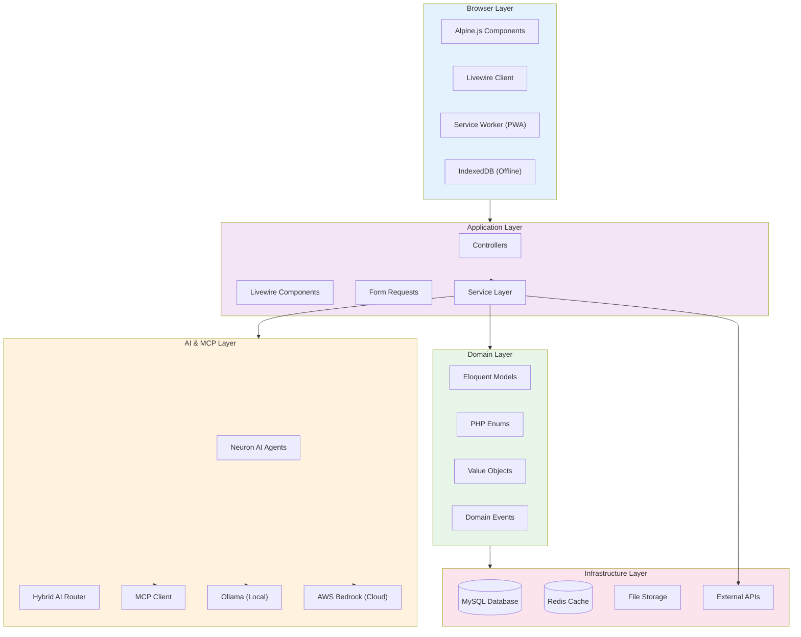
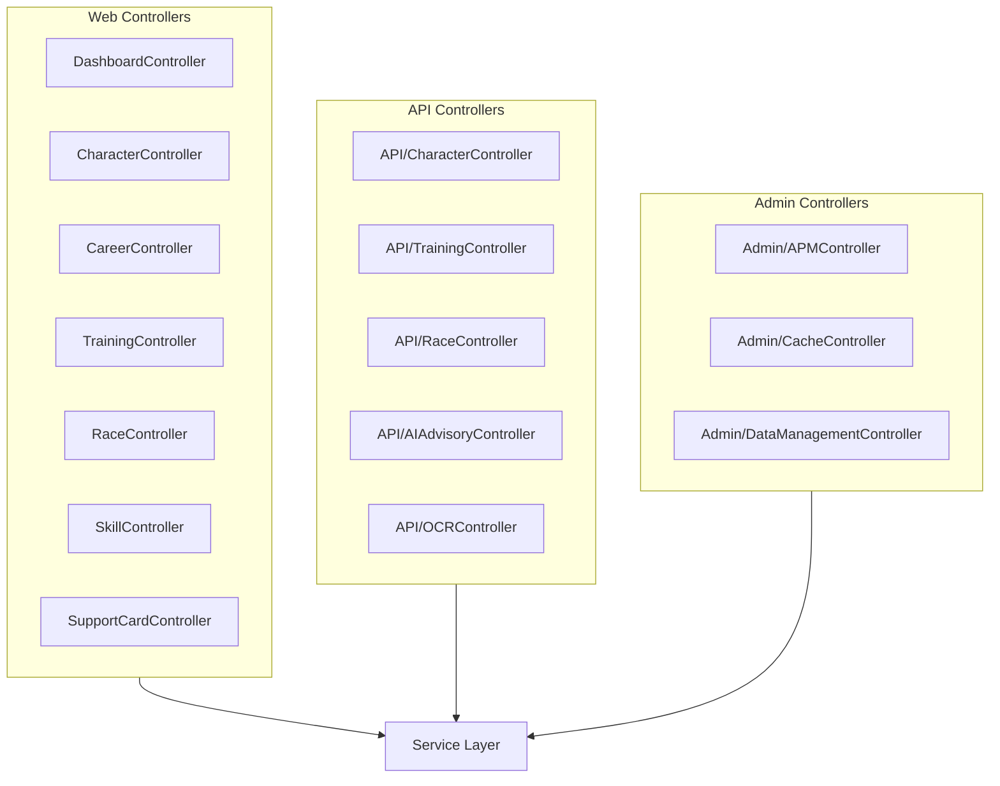
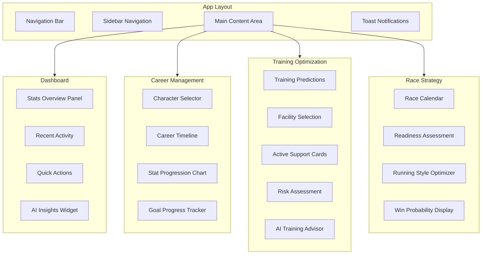
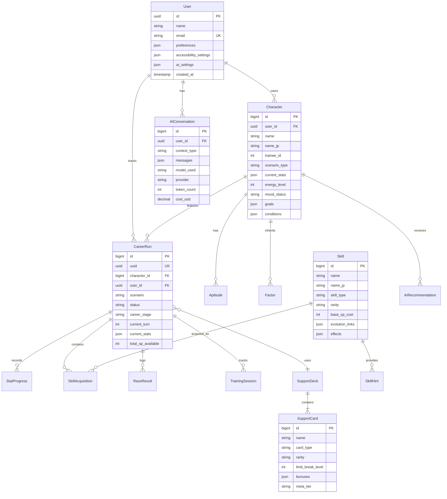
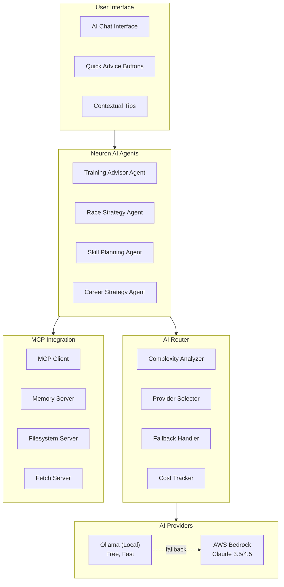
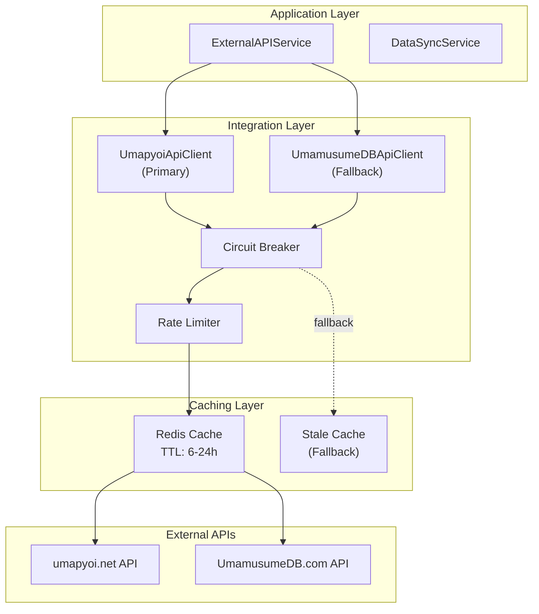
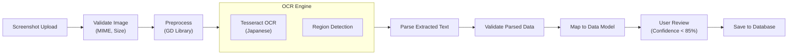

# Design Document: Umamusume Career Planner v2.4.0

**Document Version**: 2.4.0  
**Date**: February 23, 2026  
**Project**: UmamusumeCareerPlanner  
**Status**: Production-Ready Design - Aligned with IVM v4.3.0, 97% compliance  
**Related Documents**: requirements.md, SDP v2.2, SDS v2.2, SPEC-001 to SPEC-008

---

## Document Control

### Version History

| Version | Date | Author | Changes |
|---------|------|--------|---------|
| 2.4.0 | 2026-02-23 | Development Team | Updated to v2.3.0 alignment; IVM v4.3.0 verified; 30 models, 60+ services, 42 Livewire components, 8 Neuron agents, 12 MCP tools, 35 DB tables; added Performance & Monitoring services (8 new: ApmService, ApiPerformanceMonitoringService, QueryOptimizationService, PerformanceAlertingService, RedisCacheOptimizationService, ApiResponseCachingService, PerformanceRegressionService, HistoricalTrackingService); added WebSocket via Laravel Reverb; added stub/placeholder overhaul plan; updated component counts from IVM |
| 2.3.0 | 2026-02-23 | Development Team | Updated to v2.2.0/v2.3.0 alignment; Livewire 4, Neuron AI v2.11; SPEC-008 APM; game-accurate mechanics; track conditions; 8 Neuron agents; 12 MCP tools |
| 2.1.0 | 2026-01-25 | Development Team | Comprehensive design aligned with v2.0.0 implementation and v2.1.0 requirements |
| 2.0.0 | 2026-01-23 | Development Team | Initial v2.0 design |

### Related Documents

| Document | Reference | Purpose |
|----------|-----------|---------|
| **Requirements** | [requirements.md](./requirements.md) | Software requirements specification |
| **Software Design** | [004_SDS](../../docs/00-core-docs/004_SDS_Software_Design_Specifications.md) | System architecture |
| **Database Documentation** | [009_DBD](../../docs/00-core-docs/009_DBD_Database_Documentation.md) | Database schema |
| **Source Code Documentation** | [010_SCD](../../docs/00-core-docs/010_SCD_Source_Code_Documentation.md) | Code structure |
| **SPEC-001** | [SPEC-001](../../docs/02-specs/SPEC-001_Character_Management_Technical.md) | Character management |
| **SPEC-002** | [SPEC-002](../../docs/02-specs/SPEC-002_Training_Optimization_Technical.md) | Training optimization |
| **SPEC-006** | [SPEC-006](../../docs/02-specs/SPEC-006_AI_Advisory_Technical.md) | AI advisory system |
| **SPEC-007** | [SPEC-007](../../docs/02-specs/SPEC-007_External_Integration_Technical.md) | External integration |
| **SPEC-008** | [SPEC-008](../../docs/02-specs/SPEC-008_Performance_Monitoring_Technical.md) | Performance monitoring & APM |

### Additional Documentation References

| Document | Reference | Purpose |
|----------|-----------|---------|
| **Implementation Verification** | [000_IVM](../../docs/00-core-docs/000_IMPLEMENTATION_VERIFICATION_MATRIX.md) | Implementation status (v4.3.0) |
| **Requirements Traceability** | [000_RTM](../../docs/00-core-docs/000_REQUIREMENTS_TRACEABILITY_MATRIX.md) | Requirements mapping |
| **Master Glossary** | [000_MASTER_GLOSSARY](../../docs/00-core-docs/000_MASTER_GLOSSARY.md) | Terminology reference |
| **Gap Planning** | [GAP_PLANNING_090226](../../docs/implementation/GAP_PLANNING_090226.md) | Stub/placeholder overhaul plan |
| **Support Cards Status** | [FINAL_STATUS_REPORT](../../docs/verification-reports/FINAL_STATUS_REPORT.md) | Support cards system verification |

---

## Table of Contents

1. [Introduction](#1-introduction)
2. [System Architecture](#2-system-architecture)
3. [Component Architecture](#3-component-architecture)
4. [Data Model Design](#4-data-model-design)
5. [Service Layer Design](#5-service-layer-design)
6. [AI & MCP Integration Design](#6-ai--mcp-integration-design)
7. [External Integration Design](#7-external-integration-design)
8. [UI/UX Design](#8-uiux-design)
9. [Non-Functional Requirements Mapping](#9-non-functional-requirements-mapping)
10. [Operational Considerations](#10-operational-considerations)
11. [Security & Privacy](#11-security--privacy)
12. [Versioning & Change Control](#12-versioning--change-control)
13. [Acceptance Criteria](#13-acceptance-criteria)

---

## 1. Introduction

### 1.1 Purpose

This Design Document provides the comprehensive technical design for the Umamusume Pretty Derby Career Planner v2.1.0. It translates requirements from requirements.md into detailed architectural decisions, component designs, data models, and implementation strategies.

### 1.2 Design Principles

**Core Design Principles:**

1. **Local-First Architecture**: Data lives locally by default; cloud is optional
2. **Service Layer Separation**: Business logic isolated from presentation and data layers
3. **Hybrid AI Strategy**: Local Ollama primary, AWS Bedrock fallback
4. **Resilient Integration**: Circuit breaker pattern for external APIs
5. **Performance Optimization**: Multi-tier caching with Redis
6. **Accessibility by Default**: WCAG 2.2 AA compliance built into all components
7. **Progressive Enhancement**: Core functionality works everywhere, enhanced features where supported
8. **Testability**: Clear separation of concerns enables comprehensive testing

### 1.3 Technology Stack

| Layer | Technology | Version | Purpose |
|-------|-----------|---------|---------|
| **Backend Framework** | Laravel | 12+ | Application framework |
| **Language** | PHP | 8.4.11 | Server-side logic |
| **Frontend Reactivity** | Livewire | 4 | Server-driven UI updates |
| **Client Interactivity** | Alpine.js | 3.x | Client-side interactions |
| **Styling** | Tailwind CSS | v4 | Utility-first styling |
| **Build Tool** | Vite | 7+ | Asset bundling and optimization |
| **Database** | MySQL | 8.0+ | Primary data store |
| **Cache** | Redis | 7+ | Caching and sessions |
| **AI (Local)** | Ollama | Latest | Local AI inference |
| **AI (Cloud)** | AWS Bedrock | Claude 4.5 | Cloud AI fallback |
| **AI Framework** | Neuron AI | v2.11 | Agent framework |
| **MCP** | Model Context Protocol | Latest | Tool execution framework (12 tools) |
| **OCR** | Tesseract | 5+ | Optical character recognition |
| **Testing** | Pest | 4.0+ | PHP testing framework (with browser testing) |
| **Testing** | PHPUnit | 12 | Unit testing framework |
| **Browser Testing** | Playwright | 1.58 | E2E testing |
| **Browser Testing** | pest-plugin-browser | 4.0 | Pest browser testing |
| **Static Analysis** | Larastan | v3 | PHP static analysis |
| **Code Formatting** | Laravel Pint | v1 | Code style enforcement |
| **Dev Tools** | Laravel Boost | v1.8 | MCP development tools |
| **WebSocket** | Laravel Reverb | 1.x | Real-time updates |
| **Queue Management** | Laravel Horizon | v5 | Redis queue dashboard |
| **Debugging** | Laravel Telescope | v5 | Development debugging |
| **Charts** | Chart.js | 4.x | Data visualization |

### 1.4 Requirements Traceability

This design document maps directly to requirements defined in requirements.md:

| Requirement Category | Design Section | Key Components |
|---------------------|----------------|----------------|
| FR-01: Authentication | §5.1, §11.1 | AuthService, Sanctum |
| FR-02: Character Management | §4.1, §5.2 | Character model, CharacterService |
| FR-03: Training Optimization | §5.3 | TrainingPredictionService, Calculators |
| FR-04: Race Strategy | §5.4 | RaceService, WinProbabilityCalculator |
| FR-05: Skill Management | §5.5 | SkillService, SkillEvolutionService |
| FR-06: Support Card Management | §5.6 | SupportDeckService, BonusCalculator |
| FR-07: AI Advisory | §6 | Neuron AI v2.11 agents, HybridAIService, 12 MCP tools |
| FR-08: External Integration | §7 | ExternalAPIService, CircuitBreaker |
| FR-09: Data Management | §5.7 | ImportService, ExportService |
| NFR-P: Performance | §9.1 | CacheOptimizationService, QueryOptimization |
| NFR-A: Accessibility | §8.2, §9.2 | Accessible component library |
| NFR-S: Security | §11 | Authentication, Authorization, Validation |
| NFR-APM: Performance Monitoring | §9.1, SPEC-008 | APMService, MetricsCollection, AlertingSystem |
| FR-10: Dual Storage Mode | §4.1, §5.7 | LocalStorageService, StorageConversionService |
| FR-11: Dashboard & Navigation | §3.2, §8 | DashboardOverview, PlanList |
| FR-12: Analytics & Reporting | §9.1 | AnalyticsService, PerformanceController |
| INT-WS: WebSocket | §7.5 | Laravel Reverb, Broadcasting channels |

---

## 2. System Architecture

### 2.1 High-Level Architecture



### 2.2 Layered Architecture

**Presentation Layer**:

- Blade templates with Livewire components
- Alpine.js for client-side interactivity
- Tailwind CSS v4 for styling
- Service Worker for PWA functionality

**Application Layer**:

- Livewire components for UI logic
- Controllers for API endpoints
- Form Requests for validation
- Middleware for cross-cutting concerns

**AI & MCP Layer**:

- Neuron AI agents for domain-specific intelligence
- Hybrid AI router for provider selection
- MCP client for tool execution
- Cost tracking and budget management

**Domain Layer**:

- Service classes for business logic
- Eloquent models for data entities
- Enums for type-safe states
- Value objects for complex data types
- Events for decoupled communication

**Infrastructure Layer**:

- MySQL for persistent storage
- Redis for caching and sessions
- File storage for uploads
- External API integrations

### 2.3 Design Patterns

| Pattern | Implementation | Purpose | Evidence |
|---------|---------------|---------|----------|
| **Service Layer** | `CharacterService`, `TrainingService` | Encapsulate business logic | SPEC-001 §4.1, SPEC-002 §4 |
| **Repository** | `CharacterRepository` | Abstract data access | SPEC-001 §4.1 |
| **Strategy** | Calculator interfaces, AI providers | Pluggable algorithms | SPEC-002 §3, SPEC-006 §4 |
| **Factory** | `CharacterFactory`, Agent creation | Object instantiation | SPEC-001 §3.5 |
| **Observer** | Event listeners | Decoupled reactions | SDS §2.3 |
| **Circuit Breaker** | `CircuitBreaker` | Prevent cascade failures | SPEC-007 §4 |
| **Value Object** | `StatCollection` | Encapsulate stat logic | SPEC-001 §3.5 |
| **DTO** | `TrainingPrediction`, `AIResponse` | Immutable data transfer | SPEC-002 §4.1 |
| **Chain of Responsibility** | Risk calculators, Fallback handling | Modular processing | SPEC-002 §3.3 |
| **Decorator** | Context enrichment | Layer context onto prompts | SPEC-006 §6 |

---

## 3. Component Architecture

### 3.1 Controller Architecture



### 3.2 Livewire Component Hierarchy



### 3.3 Component Responsibilities

| Component | Namespace | Responsibility | Evidence |
|-----------|-----------|----------------|----------|
| `Dashboard` | `App\Livewire` | Main dashboard with stats overview | SDS §3.2 |
| `CharacterManager` | `App\Livewire\Character` | Character CRUD operations | SPEC-001 §5 |
| `CareerTracker` | `App\Livewire\Career` | Career run management | SDS §3.2 |
| `TrainingOptimizer` | `App\Livewire\Training` | Training predictions and recommendations | SPEC-002 §5 |
| `RaceAnalyzer` | `App\Livewire\Race` | Race preparation and analysis | SPEC-003 §5 |
| `SkillPlanner` | `App\Livewire\Skill` | Skill acquisition planning | SPEC-004 §5 |
| `DeckBuilder` | `App\Livewire\SupportCard` | Support deck composition | SPEC-005 §5 |
| `AIAdvisor` | `App\Livewire\AI` | AI chat interface | SPEC-006 §7 |

---

## 4. Data Model Design

### 4.1 Entity Relationship Diagram



### 4.2 Core Model Definitions

#### 4.2.1 Character Model

**Purpose**: Represents a single trainee instance with stats, aptitudes, and inheritance.

**Key Fields**:

- `id`: Primary key (bigint)
- `user_id`: Owner reference (UUID FK)
- `name`: Character name (string)
- `scenario_type`: Training scenario (enum)
- `current_stats`: {speed, stamina, power, guts, wit} (JSON)
- `energy_level`: 0-100 (int)
- `mood_status`: great/good/normal/bad/awful (enum)
- `goals`: Active goals array (JSON)
- `conditions`: Status effects (JSON)

**Relationships**:

- `belongsTo(User)`
- `hasMany(CareerRun)`
- `hasMany(Aptitude)`
- `hasMany(Factor)`
- `hasMany(SkillAcquisition)`

**Business Methods**:

- `updateStats(array $deltas): void` - Apply stat changes with clamping
- `clampEnergy(int $value): int` - Enforce 0-100 range
- `hasAchievedGoal(string $goalId): bool` - Check goal completion

**Evidence**: SPEC-001 §3.1

#### 4.2.2 CareerRun Model

**Purpose**: Tracks a single career run progression with turn-by-turn state.

**Key Fields**:

- `id`: Primary key (bigint)
- `uuid`: Universal identifier (UUID UK)
- `character_id`: Character reference (FK)
- `user_id`: Owner reference (UUID FK)
- `scenario`: Training scenario type (string)
- `status`: in_progress/completed/abandoned (enum)
- `career_stage`: junior/classic/senior (enum)
- `current_turn`: 1-78 (int)
- `current_stats`: Current stat values (JSON)
- `total_sp_available`: Skill points balance (int)
- `support_deck_id`: Active deck (FK nullable)

**Relationships**:

- `belongsTo(Character)`
- `belongsTo(User)`
- `hasMany(StatProgress)`
- `hasMany(TrainingSession)`
- `hasMany(RaceResult)`
- `belongsToMany(Skill)` via `skill_acquisitions`
- `belongsTo(SupportDeck)`

**Evidence**: SPEC-001 §3.2, DBD §4.2

#### 4.2.3 Skill Model

**Purpose**: Skill catalog with evolution paths and SP costs.

**Key Fields**:

- `id`: Primary key (bigint)
- `name`: English name (string)
- `name_jp`: Japanese name (string nullable)
- `skill_type`: speed/stamina/power/guts/wit/unique/recovery (enum)
- `rarity`: normal/rare/unique (enum)
- `base_sp_cost`: Base cost before hints (int)
- `evolution_from_id`: Source skill for evolution (FK nullable)
- `evolution_links`: Evolution path data (JSON)
- `effects`: Skill effects description (JSON)
- `activation_conditions`: Trigger conditions (JSON)

**Relationships**:

- `hasMany(SkillAcquisition)`
- `hasMany(SkillHint)`
- `belongsTo(Skill, 'evolution_from_id')` - Evolution source

**Business Methods**:

- `calculateDiscountedCost(int $hintLevel): int` - Apply hint discounts
- `canEvolve(): bool` - Check evolution eligibility

**Evidence**: SPEC-004 §3.1, DBD §4.3

#### 4.2.4 AIConversation Model

**Purpose**: Persist AI conversation history for context.

**Key Fields**:

- `id`: Primary key (bigint)
- `user_id`: Owner reference (UUID FK)
- `context_type`: training/race/skill/career/general (enum)
- `context_id`: Related entity ID (bigint nullable)
- `messages`: Conversation messages array (JSON)
- `model_used`: AI model identifier (string)
- `provider`: ollama/bedrock (enum)
- `token_count`: Total tokens used (int)
- `cost_usd`: Estimated cost (decimal)

**Relationships**:

- `belongsTo(User)`

**Evidence**: SPEC-006 §8, DBD §4.5

### 4.3 Enum Definitions

**ScenarioType**:

```php
enum ScenarioType: string {
    case UraFinale = 'ura_finale';
    case AohariCup = 'aohari_cup';
    case MakeCupDebut = 'make_cup_debut';
    case GrandMasters = 'grand_masters';
    case ProjectLArc = 'project_larc';
}
```

**MoodStatus**:

```php
enum MoodStatus: string {
    case Awful = 'awful';    // -4% modifier
    case Bad = 'bad';        // -2% modifier
    case Normal = 'normal';  // 0% modifier
    case Good = 'good';      // +2% modifier
    case Great = 'great';    // +4% modifier
    
    public function getMultiplier(): float;
}
```

**AptitudeGrade**:

```php
enum AptitudeGrade: string {
    case S = 'S';    // +5% (maximum grade)
    case A = 'A';    // 0% (baseline)
    case B = 'B';    // -10%
    case C = 'C';    // -20%
    case D = 'D';    // -30%
    case E = 'E';    // -40%
    case F = 'F';    // -50%
    case G = 'G';    // -60%
    
    public function getBonusValue(): int;
    public function upgrade(): self;
}
```

**RunStatus**:

```php
enum RunStatus: string {
    case InProgress = 'in_progress';
    case Completed = 'completed';
    case Archived = 'archived';
    case Abandoned = 'abandoned';
}
```

**Evidence**: SPEC-001 §3.4, SDS §4.3

### 4.4 Value Objects

**StatCollection**:

```php
class StatCollection {
    private const STAT_MIN = 0;
    private const STAT_SOFT_CAP = 1200;
    // Stats can exceed 1200 with diminishing returns (half value above 1200)
    // Key breakpoints: 901, 1200, 1600
    // Stamina 1200+ activates "Stamina Contest" buff
    
    public function __construct(private array $stats);
    public function add(string $stat, int $value): void;
    public function get(string $stat): int;
    public function toArray(): array;
    private function applyDiminishingReturns(string $stat, int $value): int;
}
```

**Purpose**: Encapsulate stat validation and manipulation logic.

**Evidence**: SPEC-001 §3.5

---

## 5. Service Layer Design

### 5.1 Authentication Service

**Class**: `App\Services\AuthService`

**Responsibilities**:

- User registration with email verification
- Login with "Remember Me" functionality
- Password reset workflows
- Session management

**Key Methods**:

```php
public function register(array $data): User;
public function login(array $credentials, bool $remember): bool;
public function logout(): void;
public function sendPasswordResetLink(string $email): void;
public function resetPassword(string $token, string $password): bool;
```

**Evidence**: Requirements FR-01, SRS §2.1

### 5.2 Character Service

**Class**: `App\Services\CharacterService`

**Responsibilities**:

- Character lifecycle management (CRUD)
- Stat validation and clamping
- Factor inheritance calculation
- External API data synchronization
- Cache management

**Key Methods**:

```php
public function create(array $data): Character;
public function update(Character $character, array $data): Character;
public function updateStats(Character $character, array $stats): Character;
public function delete(Character $character): bool;
public function findById(int $id): ?Character;
public function invalidateCache(Character $character): void;
```

**Dependencies**:

- `CharacterRepository`
- `FactorInheritanceService`
- `CharacterStateService`
- `ExternalAPIService`

**Evidence**: SPEC-001 §4.1

### 5.3 Training Prediction Service

**Class**: `App\Services\Training\TrainingPredictionService`

**Responsibilities**:

- Generate predictions for all training options
- Calculate stat gains with modifiers
- Assess failure risk
- Determine skill hint probabilities
- Rank options by recommendation score
- Cache predictions (5-minute TTL)

**Key Methods**:

```php
public function getPredictions(CareerRun $career): array;
private function generatePredictions(CareerRun $career): array;
private function predictTraining(CareerRun $career, TrainingType $type): TrainingPrediction;
private function predictRest(Character $character): TrainingPrediction;
private function calculateScore(StatCollection $gains, float $risk, int $energyCost, CareerRun $career): int;
```

**Dependencies**:

- `StatGainCalculator`
- `SupportBonusCalculator`
- `RiskCalculator`
- `SkillHintCalculator`

**Evidence**: SPEC-002 §4.1

### 5.4 Race Service

**Class**: `App\Services\RaceService`

**Responsibilities**:

- Race calendar management
- Readiness score calculation
- Win probability prediction
- Running style optimization
- Race result tracking

**Key Methods**:

```php
public function getRaceCalendar(CareerRun $career): array;
public function calculateReadiness(Character $character, Race $race): array;
public function predictWinProbability(Character $character, Race $race): array;
public function recommendRunningStyle(Character $character, Race $race): string;
public function recordRaceResult(CareerRun $career, Race $race, array $result): RaceResult;
```

**Dependencies**:

- `WinProbabilityCalculator`
- `RunningStyleOptimizer`
- `ReadinessCalculator`

**Evidence**: SPEC-003 §4

### 5.5 Skill Service

**Class**: `App\Services\SkillService`

**Responsibilities**:

- Skill catalog management
- Skill acquisition with SP validation
- Hint tracking and discount calculation
- Skill evolution processing
- SP budget optimization

**Key Methods**:

```php
public function getSkillCatalog(array $filters = []): Collection;
public function acquireSkill(CareerRun $career, Skill $skill): SkillAcquisition;
public function calculateDiscountedCost(Skill $skill, int $hintLevel): int;
public function processEvolution(SkillAcquisition $acquisition): ?SkillAcquisition;
public function optimizeSPBudget(CareerRun $career, array $desiredSkills): array;
```

**Dependencies**:

- `SkillEvolutionService`
- `SPBudgetOptimizer`

**Evidence**: SPEC-004 §4

### 5.6 Support Deck Service

**Class**: `App\Services\SupportDeckService`

**Responsibilities**:

- Deck composition validation
- Synergy score calculation
- Bond level tracking
- Meta tier integration
- Deck optimization recommendations

**Key Methods**:

```php
public function createDeck(array $cardIds): SupportDeck;
public function validateDeck(array $cardIds): array;
public function calculateSynergy(array $cardIds): float;
public function updateBondLevel(SupportCard $card, int $gain): void;
public function getMetaTiers(): array;
public function optimizeDeck(Character $character, array $goals): array;
```

**Dependencies**:

- `SynergyScorer`
- `ExternalAPIService` (for meta data)

**Evidence**: SPEC-005 §4

### 5.7 Data Management Service

**Class**: `App\Services\DataManagementService`

**Responsibilities**:

- Import data from JSON/CSV/Excel
- Export data in multiple formats
- Format detection and validation
- Duplicate resolution
- Backup and restore operations

**Key Methods**:

```php
public function import(UploadedFile $file, ImportOptions $options): ImportResult;
public function export(ExportOptions $options): ExportResult;
public function detectFormat(UploadedFile $file): string;
public function resolveDuplicates(array $duplicates, string $strategy): array;
public function createBackup(): string;
public function restoreBackup(string $backupId): bool;
```

**Dependencies**:

- Format adapters (JSON, CSV, Excel)
- `DuplicateDetector`
- `BackupService`

**Evidence**: Requirements FR-09, SPEC-001 §9

### 5.8 Performance & Monitoring Services (SPEC-008)

**Implemented Services** (8 total, all verified in IVM v4.3.0):

**ApmService** (`App\Services\ApmService`):

- Core APM coordination
- Methods: `captureMetric()`, `captureException()`, `startTransaction()`

**ApiPerformanceMonitoringService** (`App\Services\ApiPerformanceMonitoringService`):

- API endpoint tracking
- Methods: `recordApiCall()`, `getEndpointMetrics()`, `detectAnomalies()`

**QueryOptimizationService** (`App\Services\QueryOptimizationService`):

- Database query analysis and optimization suggestions
- Methods: `analyzeQuery()`, `optimizeIndexes()`, `detectNPlusOne()`

**PerformanceAlertingService** (`App\Services\PerformanceAlertingService`):

- Alert management with configurable thresholds
- Methods: `checkThresholds()`, `sendAlert()`, `configureAlerts()`

**RedisCacheOptimizationService** (`App\Services\RedisCacheOptimizationService`):

- Cache hit/miss analysis and optimization
- Methods: `analyzeHitRate()`, `optimizeKeys()`, `reportMetrics()`

**ApiResponseCachingService** (`App\Services\ApiResponseCachingService`):

- Response caching with stale-while-revalidate
- Methods: `cacheResponse()`, `invalidateCache()`, `getStaleData()`

**PerformanceRegressionService** (`App\Services\PerformanceRegressionService`):

- Regression detection across deployments
- Methods: `detectRegression()`, `compareBaselines()`, `generateReport()`

**HistoricalTrackingService** (`App\Services\HistoricalTrackingService`):

- Long-term metrics storage and trend analysis
- Methods: `storeMetrics()`, `getTrends()`, `aggregateData()`

**Evidence**: SPEC-008, IVM §6.1

---

## 6. AI & MCP Integration Design

### 6.1 Hybrid AI Architecture



### 6.2 Neuron Agent Design

**Training Advisor Agent**:

- **Purpose**: Provide training recommendations based on current state
- **Tools**: GetCharacterStatsTool, GetTrainingPredictionsTool, GetGoalProgressTool
- **System Prompt**: Expert training advisor with game mechanics knowledge
- **Output Format**: JSON with recommendation, reasoning, risks, alternatives, confidence

**Race Strategy Agent**:

- **Purpose**: Optimize race preparation and running style selection
- **Tools**: GetCharacterStatsTool, GetRaceRequirementsTool, GetAptitudeAnalysisTool, GetSkillSynergyTool
- **System Prompt**: Expert race strategist with aptitude and style knowledge
- **Output Format**: JSON with readiness score, recommended style, win probability, stat gaps

**Skill Advisor Agent**:

- **Purpose**: Recommend skill acquisitions and optimize SP budget
- **Tools**: GetCharacterStatsTool, GetSkillCatalogTool, GetSkillHintsTool, GetSPBudgetTool
- **System Prompt**: Expert skill build advisor with evolution knowledge
- **Output Format**: JSON with recommended skills, SP budget analysis, build strategy

**Career Planning Agent**:

- **Purpose**: Long-term strategy and milestone planning
- **Tools**: GetCharacterStatsTool, GetCareerProgressTool, GetUpcomingRacesTool
- **System Prompt**: Expert career strategist with long-term planning focus
- **Output Format**: JSON with milestone plan, priority recommendations, timeline

**Evidence**: SPEC-006 §3

### 6.3 AI Provider Routing

**Routing Decision Logic**:

```
IF user forces cloud THEN use Bedrock
ELSE IF Ollama unavailable THEN use Bedrock
ELSE IF complexity > threshold THEN use Bedrock
ELSE use Ollama
```

**Complexity Thresholds**:

- Training advice: 50 (local)
- Race strategy: 60 (local)
- Skill planning: 55 (local)
- Career planning: 70 (cloud)

**Cost Management**:

- Track token usage per request
- Calculate cost based on model pricing
- Enforce daily/monthly budget limits
- Alert on threshold breaches

**Evidence**: SPEC-006 §4

### 6.4 MCP Tool Integration

**Available MCP Servers**:

1. **Memory Server**: Persistent context storage
2. **Filesystem Server**: File access for data operations
3. **Fetch Server**: External resource retrieval

**Tool Execution Flow**:

1. Agent identifies need for tool
2. MCP client validates tool permissions
3. Connect to appropriate MCP server
4. Execute tool with parameters
5. Log usage metrics
6. Return processed result to agent

**Evidence**: SPEC-006 §5, SDS §6

---

## 7. External Integration Design

### 7.1 External API Architecture



### 7.2 Circuit Breaker Pattern

**States**:

- **Closed**: Normal operation, requests pass through
- **Open**: Circuit tripped, return fallback immediately
- **Half-Open**: Testing recovery, allow limited probe requests

**Configuration**:

- Failure threshold: 5 failures within 120-second window
- Recovery timeout: 60 seconds
- Probe success: Reset to closed
- Probe failure: Return to open

**Fallback Strategy**:

1. Return stale cached data if available
2. Return empty array with warning log
3. Trigger admin alert if circuit remains open > 5 minutes

**Evidence**: SPEC-007 §4

### 7.3 API Client Design

**UmapyoiApiClient**:

- **Base URL**: `https://umapyoi.net/api/v1`
- **Authentication**: Bearer token (optional)
- **Timeout**: 10 seconds
- **Retry**: 3 attempts with 100ms delay
- **Cache TTL**:
  - Characters: 24 hours
  - Support cards: 24 hours
  - Skills: 24 hours
  - Meta tiers: 12 hours

**Endpoints**:

- `GET /characters` - List all characters
- `GET /characters/{id}` - Get character details
- `GET /support-cards` - List support cards
- `GET /skills` - List skills
- `GET /races` - List races
- `GET /meta/tiers` - Get meta tier rankings

**Evidence**: SPEC-007 §3.2

### 7.4 OCR Processing Pipeline



**Image Preprocessing**:

1. Convert to grayscale
2. Apply contrast enhancement
3. Noise reduction
4. Binarization (threshold)
5. Deskew if needed

**Text Extraction**:

- Language: Japanese (jpn)
- PSM mode: 6 (uniform block of text)
- OEM mode: 3 (default, based on what is available)

**Confidence Thresholds**:

- High confidence: ≥ 85% - Auto-accept
- Medium confidence: 60-84% - Require review
- Low confidence: < 60% - Reject with error

**Evidence**: SPEC-007 §5, SDS §7

### 7.5 WebSocket Real-time Updates

**Technology**: Laravel Reverb

**Use Cases**:

- Training session completion notifications
- Race result updates
- AI recommendation delivery
- Support card meta tier changes
- System maintenance alerts

**Channel Structure**:

- Private channels: `user.{userId}`
- Presence channels: `career.{careerId}`
- Public channels: `meta.updates`

**Event Broadcasting**:

```php
broadcast(new TrainingCompleted($career, $result))
    ->toOthers();
```

**Evidence**: SPEC-007 §6

---

## 8. UI/UX Design

### 8.1 Design System

**Color Palette**:

| Token | Light Mode | Dark Mode | Usage |
|-------|------------|-----------|-------|
| `--color-primary` | `#3b82f6` | `#60a5fa` | Primary actions |
| `--color-stat-speed` | `#3399ff` | `#66b3ff` | Speed indicators |
| `--color-stat-stamina` | `#33cc99` | `#66d9b8` | Stamina indicators |
| `--color-stat-power` | `#ff4d4d` | `#ff7373` | Power indicators |
| `--color-stat-guts` | `#ffa500` | `#ffb733` | Guts indicators |
| `--color-stat-wit` | `#9933ff` | `#b366ff` | Wit indicators |
| `--color-success` | `#10b981` | `#34d399` | Success states |
| `--color-warning` | `#f59e0b` | `#fbbf24` | Warning states |
| `--color-error` | `#ef4444` | `#f87171` | Error states |

**Typography**:

- Font family: System font stack (Inter, SF Pro, Segoe UI)
- Base size: 16px
- Scale: 1.25 (Major Third)
- Line height: 1.5 for body, 1.2 for headings

**Spacing**:

- Base unit: 4px
- Scale: 4, 8, 12, 16, 24, 32, 48, 64, 96

**Evidence**: SDS §10.1

### 8.2 Accessibility Design

**WCAG 2.2 AA Compliance**:

| Requirement | Implementation | WCAG Reference |
|-------------|----------------|----------------|
| Color contrast | 4.5:1 minimum for text, 3:1 for large text | 1.4.3 |
| Keyboard navigation | All interactive elements focusable, logical tab order | 2.1.1 |
| Screen reader support | ARIA labels on all controls, semantic HTML | 4.1.2 |
| Focus visibility | Visible focus indicators (2px outline) | 2.4.7 |
| Reduced motion | Respects `prefers-reduced-motion` | 2.3.3 |
| Skip links | "Skip to main content" link at top | 2.4.1 |
| Form labels | All inputs have associated labels | 3.3.2 |
| Error identification | Clear error messages with suggestions | 3.3.1 |

**Accessible Component Library**:

- `<x-accessible.button>` - Accessible button with ARIA
- `<x-accessible.input>` - Form input with label association
- `<x-accessible.modal>` - Modal with focus trap
- `<x-accessible.live-region>` - ARIA live region for dynamic updates
- `<x-accessible.tabs>` - Keyboard-navigable tabs

**Evidence**: Requirements NFR-A, SDS §4.1

### 8.3 Responsive Design

**Breakpoints**:

| Breakpoint | Width | Layout |
|------------|-------|--------|
| Mobile | < 640px | Single column, bottom nav |
| Tablet | 640px - 1024px | Two column where appropriate |
| Desktop | > 1024px | Full layout with sidebar |
| Wide | > 1280px | Maximum content width applied |

**Mobile-First Approach**:

- Base styles for mobile
- Progressive enhancement for larger screens
- Touch-friendly targets (minimum 44x44px)
- Optimized images with `srcset`

**Evidence**: SDS §10.2

### 8.4 Progressive Web App (PWA)

**Service Worker Features**:

- Offline page caching
- API response caching (stale-while-revalidate)
- Background sync for data updates
- Push notifications for events

**Manifest Configuration**:

```json
{
  "name": "Umamusume Career Planner",
  "short_name": "UCP",
  "start_url": "/",
  "display": "standalone",
  "background_color": "#ffffff",
  "theme_color": "#3b82f6",
  "icons": [...]
}
```

**Install Prompt**:

- Show after 3 visits or 1 completed career run
- Dismissible with "Don't show again" option
- Accessible via settings menu

**Evidence**: Requirements NFR-PWA

---

## 9. Non-Functional Requirements Mapping

### 9.1 Performance Optimization

**Caching Strategy**:

| Data Type | Cache Layer | TTL | Invalidation |
|-----------|-------------|-----|--------------|
| Character data | Redis L2 | 12 hours | On update |
| Training predictions | Redis L2 | 5 minutes | On turn advance |
| Skills catalog | Redis L2 | 24 hours | On sync |
| External API responses | Redis L2 | 6-24 hours | On circuit breaker reset |
| User sessions | Redis | 2 hours | On logout |

**Database Optimization**:

- Composite indexes on frequently queried columns
- Eager loading for relationships
- Cursor pagination for large datasets
- Query result caching for expensive operations

**Frontend Optimization**:

- Code splitting by route
- Lazy loading images with `loading="lazy"`
- Optimistic UI updates
- Debounced search inputs

**Performance Targets**:

- Page load (FCP): < 1.5s
- Time to Interactive (TTI): < 3.5s
- API response time (p95): < 500ms
- Training prediction generation: < 1.2s
- AI recommendation: < 2.5s (local), < 5s (cloud)

**Evidence**: Requirements NFR-P, SPEC-002 §11

### 9.2 Accessibility Requirements

**Keyboard Navigation**:

- All interactive elements accessible via keyboard
- Logical tab order
- Keyboard shortcuts for common actions:
  - `Ctrl+S`: Save
  - `Ctrl+K`: Search
  - `Ctrl+/`: Show keyboard shortcuts
  - Arrow keys: Navigate lists
  - Enter: Activate selected item
  - Escape: Close modals

**Screen Reader Support**:

- ARIA live regions for dynamic content
- Descriptive labels for all form inputs
- Status announcements for async operations
- Landmark regions for page structure

**Visual Accessibility**:

- Minimum 4.5:1 contrast ratio
- Resizable text up to 200%
- No information conveyed by color alone
- Focus indicators visible and clear

**Evidence**: Requirements NFR-A, SDS §4

### 9.3 Security Requirements

**Authentication & Authorization**:

- Laravel Sanctum for API token authentication
- Session-based authentication for web
- CSRF protection on all state-changing requests
- Password hashing with bcrypt
- Email verification required for registration

**Data Protection**:

- Input validation on all user inputs
- SQL injection prevention via Eloquent ORM
- XSS protection via Blade templating
- Rate limiting on API endpoints (60 requests/minute)
- File upload validation (MIME type, size, extension)

**Privacy**:

- GDPR-compliant data export
- Right to deletion (soft deletes with 30-day retention)
- Minimal data collection
- No third-party tracking without consent

**Evidence**: Requirements NFR-S, §11

### 9.4 Reliability Requirements

**Availability**:

- Target: 99% uptime for Account mode
- Graceful degradation when offline
- Circuit breaker for external APIs
- Fallback to stale cache when APIs unavailable

**Data Integrity**:

- Database transactions for multi-step operations
- Validation at multiple layers (client, server, database)
- Soft deletes with recovery window
- Automated backups (daily, retained 30 days)

**Error Handling**:

- User-friendly error messages
- Detailed error logging for debugging
- Automatic retry for transient failures
- Fallback mechanisms for critical operations

**Evidence**: Requirements NFR-R

---

## 10. Operational Considerations

### 10.1 Deployment Architecture

**Environment Tiers**:

1. **Development**: Local development with Docker/Sail
2. **Staging**: Pre-production testing environment
3. **Production**: Live user-facing environment

**Infrastructure Components**:

- **Web Server**: Apache/Nginx
- **Application Server**: PHP-FPM
- **Database**: MySQL 8.0+ (primary), read replicas (optional)
- **Cache**: Redis cluster
- **Queue Workers**: Laravel Horizon
- **File Storage**: Local filesystem or S3-compatible
- **AI Services**: Ollama (local), AWS Bedrock (cloud)

**Deployment Process**:

1. Run tests (`composer test`)
2. Build frontend assets (`npm run build`)
3. Run migrations (`php artisan migrate`)
4. Clear caches (`php artisan cache:clear`)
5. Restart queue workers (`php artisan horizon:terminate`)
6. Warm caches (`php artisan cache:warm`)

**Evidence**: SDS §12

### 10.2 Monitoring & Observability

**Application Performance Monitoring (APM)**:

- Laravel Telescope for development
- Custom APM service for production
- Metrics tracked:
  - Request duration (p50, p95, p99)
  - Database query time
  - Cache hit rate
  - External API latency
  - AI inference time
  - Queue job processing time

**Logging**:

- Structured logging with context
- Log levels: DEBUG, INFO, WARNING, ERROR, CRITICAL
- Log rotation and retention (30 days)
- Centralized log aggregation (optional)

**Alerting**:

- Slow requests (> 2s)
- High error rate (> 5%)
- Low cache hit rate (< 70%)
- Circuit breaker trips
- Queue backlog (> 1000 jobs)
- Disk space low (< 10%)

**Evidence**: Requirements NFR-M

### 10.3 Scaling Considerations

**Horizontal Scaling**:

- Stateless application servers
- Session storage in Redis
- Load balancer for traffic distribution
- Database read replicas for read-heavy operations

**Vertical Scaling**:

- Increase server resources (CPU, RAM)
- Optimize database queries
- Increase cache memory
- Tune PHP-FPM worker count

**Caching Strategy**:

- Redis cluster for distributed caching
- CDN for static assets
- Browser caching with appropriate headers
- API response caching with ETags

**Evidence**: SDS §12

### 10.4 Backup & Recovery

**Backup Strategy**:

- **Database**: Daily full backups, retained 30 days
- **Files**: Daily incremental backups, retained 30 days
- **Configuration**: Version controlled in Git
- **Encryption**: All backups encrypted at rest

**Recovery Procedures**:

- **Database Restore**: < 1 hour RTO
- **File Restore**: < 30 minutes RTO
- **Full System Restore**: < 4 hours RTO
- **Point-in-Time Recovery**: Available for last 7 days

**Disaster Recovery**:

- Off-site backup storage
- Documented recovery procedures
- Regular recovery drills (quarterly)
- Failover plan for critical services

**Evidence**: Requirements NFR-R

---

## 11. Security & Privacy

### 11.1 Authentication & Authorization

**Authentication Mechanisms**:

- **Web**: Session-based with Laravel's built-in authentication
- **API**: Token-based with Laravel Sanctum
- **Password Policy**: Minimum 8 characters, no complexity requirements (following NIST guidelines)
- **Session Management**: 2-hour timeout, "Remember Me" extends to 2 weeks

**Authorization**:

- **Policy-Based**: Laravel policies for model authorization
- **Ownership Checks**: Users can only access their own data
- **Admin Roles**: Separate admin role for system management
- **API Scopes**: Token scopes for granular API permissions

**Evidence**: Requirements FR-01, NFR-S

### 11.2 Data Protection

**Input Validation**:

- **Client-Side**: Alpine.js validation for immediate feedback
- **Server-Side**: Laravel Form Requests for all inputs
- **Database**: Column type constraints and foreign keys

**Output Encoding**:

- **HTML**: Blade automatic escaping
- **JSON**: Laravel JSON response encoding
- **SQL**: Eloquent ORM parameterized queries

**File Upload Security**:

- **MIME Type Validation**: Check actual file content, not just extension
- **Size Limits**: 2MB for avatars, 10MB for OCR screenshots
- **Storage**: Outside web root, served through controller
- **Virus Scanning**: Optional integration with ClamAV

**Evidence**: Requirements NFR-S

### 11.3 Privacy Compliance

**GDPR Compliance**:

- **Right to Access**: Data export functionality
- **Right to Deletion**: Account deletion with 30-day grace period
- **Right to Portability**: Export in JSON format
- **Consent Management**: Explicit consent for optional features
- **Data Minimization**: Collect only necessary data

**Data Retention**:

- **Active Accounts**: Indefinite retention
- **Inactive Accounts**: Warning after 1 year, deletion after 2 years
- **Deleted Accounts**: Soft delete with 30-day recovery, then hard delete
- **Logs**: 30-day retention
- **Backups**: 30-day retention

**Evidence**: Requirements NFR-Privacy

### 11.4 API Security

**Rate Limiting**:

- **Authenticated**: 60 requests/minute per user
- **Unauthenticated**: 10 requests/minute per IP
- **AI Endpoints**: 10 requests/minute per user
- **OCR Endpoints**: 5 requests/minute per user

**CORS Configuration**:

- **Allowed Origins**: Configured per environment
- **Allowed Methods**: GET, POST, PUT, PATCH, DELETE
- **Allowed Headers**: Content-Type, Authorization, X-Requested-With
- **Credentials**: Allowed for authenticated requests

**API Versioning**:

- **URL-Based**: `/api/v1/...`
- **Backward Compatibility**: Maintain v1 for 6 months after v2 release
- **Deprecation Warnings**: Headers indicate deprecated endpoints

**Evidence**: Requirements NFR-S

---

## 12. Versioning & Change Control

### 12.1 Semantic Versioning

**Version Format**: `MAJOR.MINOR.PATCH`

- **MAJOR**: Breaking changes to API or data models
- **MINOR**: New features, backward compatible
- **PATCH**: Bug fixes, backward compatible

**Current Version**: 2.3.0

**Version History**:

- 2.3.0 (2026-02-23): Game-accurate mechanics, SPEC-008 APM, Neuron AI v2.11, Livewire 4
- 2.1.0 (2026-01-25): Performance optimization, accessibility enhancements
- 2.0.0 (2026-01-23): Major rewrite with AI integration
- 1.0.0 (2026-01-14): Initial release

### 12.2 Database Migrations

**Migration Strategy**:

- **Forward-Only**: Migrations should be additive when possible
- **Backward Compatibility**: Maintain old columns during transition period
- **Data Migration**: Separate data migrations from schema migrations
- **Rollback Plan**: All migrations include `down()` method

**Migration Naming**:

```
YYYY_MM_DD_HHMMSS_descriptive_action_name.php
```

**Evidence**: DBD §7

### 12.3 API Versioning

**Versioning Strategy**:

- **URL-Based**: `/api/v1/`, `/api/v2/`
- **Version Lifecycle**: Support current + previous version
- **Deprecation Notice**: 6-month warning before removal
- **Documentation**: Separate docs for each version

**Breaking Changes**:

- Removing endpoints
- Changing response structure
- Modifying required parameters
- Changing authentication mechanism

### 12.4 Change Management

**Change Process**:

1. **Proposal**: Document proposed change
2. **Review**: Technical review by team
3. **Approval**: Stakeholder approval
4. **Implementation**: Develop and test
5. **Documentation**: Update all relevant docs
6. **Deployment**: Deploy to staging, then production
7. **Monitoring**: Monitor for issues post-deployment

**Documentation Updates**:

- Update requirements.md for requirement changes
- Update design.md for design changes
- Update SPEC documents for implementation changes
- Update API documentation for API changes
- Update user documentation for UI changes

---

## 13. Acceptance Criteria

### 13.1 Functional Acceptance

**Character Management**:

- [ ] Users can create characters with all required fields
- [ ] Character stats are validated and clamped (0-1200)
- [ ] Aptitudes are correctly assigned and displayed
- [ ] Factor inheritance calculations are accurate
- [ ] Character data syncs from external APIs

**Training Optimization**:

- [ ] Training predictions generated for all facilities
- [ ] Stat gain calculations include all modifiers
- [ ] Risk assessment reflects energy and mood
- [ ] Skill hint probabilities are calculated
- [ ] Recommendations are ranked by score

**Race Strategy**:

- [ ] Race calendar displays all available races
- [ ] Readiness scores are calculated accurately
- [ ] Win probability predictions are generated
- [ ] Running style recommendations are provided
- [ ] Race results are recorded correctly

**Skill Management**:

- [ ] Skill catalog is searchable and filterable
- [ ] Skill acquisition validates SP availability
- [ ] Hint discounts are applied correctly (20%/40%)
- [ ] Skill evolution processes automatically
- [ ] SP budget optimization works

**AI Advisory**:

- [ ] AI recommendations are generated within 5 seconds
- [ ] Recommendations include reasoning and confidence
- [ ] Conversation history is persisted
- [ ] Cost tracking is accurate
- [ ] Fallback to Bedrock works when Ollama unavailable

**External Integration**:

- [ ] External API data syncs successfully
- [ ] Circuit breaker trips on repeated failures
- [ ] Fallback to stale cache works
- [ ] OCR processing extracts data accurately
- [ ] WebSocket updates are delivered in real-time

### 13.2 Non-Functional Acceptance

**Performance**:

- [ ] Page load time (FCP) < 1.5s
- [ ] API response time (p95) < 500ms
- [ ] Training predictions < 1.2s
- [ ] AI recommendations < 2.5s (local), < 5s (cloud)
- [ ] Cache hit rate > 70%

**Accessibility**:

- [ ] All interactive elements keyboard accessible
- [ ] Color contrast meets WCAG AA (4.5:1)
- [ ] Screen reader announces dynamic content
- [ ] Focus indicators visible
- [ ] Reduced motion respected

**Security**:

- [ ] Authentication required for protected routes
- [ ] Authorization checks prevent unauthorized access
- [ ] Input validation prevents injection attacks
- [ ] Rate limiting prevents abuse
- [ ] File uploads validated and sanitized

**Reliability**:

- [ ] Application handles offline gracefully
- [ ] Circuit breaker prevents cascade failures
- [ ] Errors are logged with context
- [ ] Backups run daily and are restorable
- [ ] Soft deletes allow recovery

### 13.3 Testing Acceptance

**Test Coverage**:

- [ ] Unit test coverage > 80%
- [ ] Feature test coverage > 70%
- [ ] Critical paths have E2E tests
- [ ] All API endpoints have tests
- [ ] All Livewire components have tests

**Test Quality**:

- [ ] Tests are deterministic (no flaky tests)
- [ ] Tests run in < 5 minutes
- [ ] Tests use factories for data generation
- [ ] Tests clean up after themselves
- [ ] Tests document expected behavior

### 13.4 Documentation Acceptance

**Technical Documentation**:

- [ ] All services have PHPDoc comments
- [ ] All public methods documented
- [ ] Complex algorithms explained
- [ ] Database schema documented
- [ ] API endpoints documented

**User Documentation**:

- [ ] User guide covers all features
- [ ] Screenshots show current UI
- [ ] Common workflows documented
- [ ] Troubleshooting guide available
- [ ] FAQ addresses common questions

---

## Summary of Notable Design Updates

This design document for v2.4.0 represents a comprehensive, production-ready design aligned with the implemented v2.3.0 system, IVM v4.3.0 verification, and game-accurate mechanics:

1. **Hybrid AI Architecture**: Local-first with Ollama, cloud fallback with AWS Bedrock Claude 4.5, intelligent routing via Neuron AI v2.11 with 8 specialized agents
2. **Circuit Breaker Pattern**: Resilient external API integration with automatic fallback to stale cache
3. **Service Layer Separation**: Clear separation of concerns with 60+ dedicated services for each domain
4. **Multi-Tier Caching**: Redis L2 cache with configurable TTLs, memory L1 cache for hot data
5. **Accessibility by Default**: WCAG 2.2 AA compliance built into component library (92% compliance verified)
6. **Progressive Web App**: Service worker for offline functionality, installable app experience (🔄 routes in progress)
7. **Comprehensive Testing**: 3,316+ tests with 11,563+ assertions across 195 test files, Pest v4 browser testing, >90% coverage
8. **MCP Integration**: Model Context Protocol with 12 tools across Memory, Filesystem, and Fetch servers
9. **OCR Pipeline**: Tesseract-based screenshot processing with confidence scoring
10. **Performance Monitoring**: SPEC-008 APM system with 8 dedicated services (ApmService, ApiPerformanceMonitoringService, QueryOptimizationService, PerformanceAlertingService, RedisCacheOptimizationService, ApiResponseCachingService, PerformanceRegressionService, HistoricalTrackingService)
11. **Game-Accurate Mechanics**: Aptitude grades G→S (S max), stats >1200 with diminishing returns, track conditions (Firm/Good/Soft/Heavy), stamina drain modifiers
12. **Operational Excellence**: Monitoring, alerting, backup/recovery, and scaling considerations
13. **WebSocket Real-Time**: Laravel Reverb for live updates (training completion, race results, AI recommendations, meta changes)
14. **Support Cards System**: 15 verified cards from Global English server, deck builder with synergy scoring, meta tier integration
15. **Database Schema**: 35 tables (31 original + 4 January 2026 enhancements), 50+ migrations with ucp_ prefix
16. **Stub/Placeholder Overhaul**: GAP_PLANNING_090226 identifies ~30 stubs across 11 files for replacement with real service calls

**Known Design Gaps (from IVM v4.3.0)**:

- APM Dashboard completion (GAP-001)
- PWA offline route coverage (GAP-002)
- Accessibility settings pages (GAP-003)
- OpenCV OCR preprocessing (GAP-004, future)
- Background sync for Local mode (GAP-006)
- Dark mode optimization (GAP-007, future)

---

**Document Status**: Production-Ready  
**Next Review**: 2026-03-23  
**Maintained By**: Development Team
