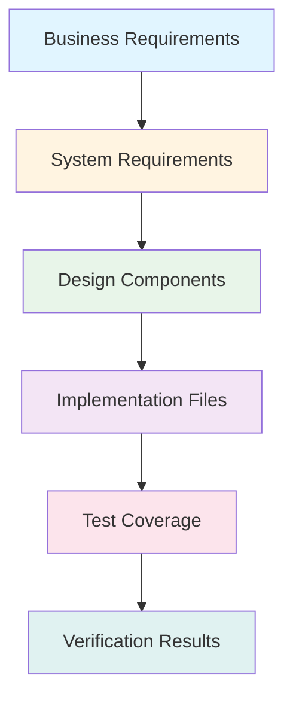
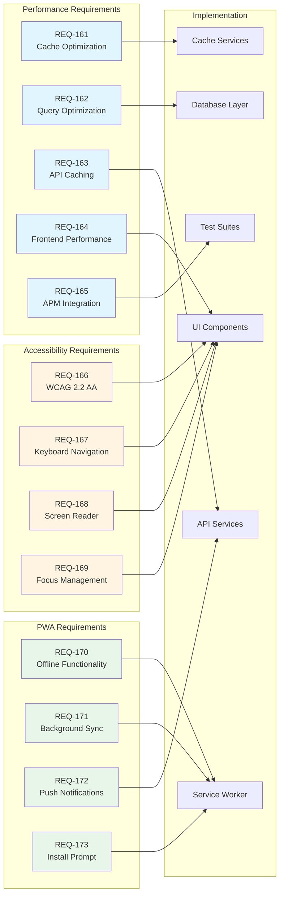

# Design Document: Umamusume Career Planner v2.1.0

**Document Version**: 2.1.0  
**Date**: January 23, 2026  
**Project**: UmamusumeCareerPlanner  
**Status**: Active - Design Phase  
**Standard**: IEEE 1016-2009  
**Related Documents**: requirements.md, SDP v2.1, SDS v2.1, SPEC-001 to SPEC-007

---

## Document Control

| Version | Date | Author | Changes |
|---------|------|--------|---------|
| 2.1.0 | 2026-01-23 | Development Team | Complete design for v2.1.0 with performance, accessibility, PWA, analytics |
| 2.0.0 | 2026-01-14 | Development Team | v2.0.0 release design |
| 1.0.0 | 2026-01-03 | Development Team | Initial design document |

---

## Table of Contents

1. [Introduction](#1-introduction)
2. [Requirements Traceability Matrix](#2-requirements-traceability-matrix)
3. [System Architecture](#3-system-architecture)
4. [Performance Optimization Design](#4-performance-optimization-design)
5. [Accessibility Design](#5-accessibility-design)
6. [Progressive Web App Design](#6-progressive-web-app-design)
7. [Advanced Features Design](#7-advanced-features-design)
8. [Testing Strategy Design](#8-testing-strategy-design)
9. [Security Design](#9-security-design)
10. [Data Models](#10-data-models)
11. [API Design](#11-api-design)
12. [Component Architecture](#12-component-architecture)
13. [Deployment Architecture](#13-deployment-architecture)
14. [Appendices](#14-appendices)

---

## 1. Introduction

### 1.1 Purpose

This Design Document provides comprehensive technical specifications for implementing the Umamusume Career Planner v2.1.0 requirements. It details architectural decisions, component designs, data models, API contracts, and implementation strategies for:

- **Performance Optimization**: Advanced caching, query optimization, Core Web Vitals compliance
- **Accessibility Compliance**: Complete WCAG 2.2 AA implementation with keyboard navigation and screen reader support
- **PWA Enhancements**: Enhanced offline functionality, background sync, push notifications, install prompts
- **Advanced Analytics**: Batch simulation, AI model retraining, pattern recognition, enhanced exports
- **Testing Strategy**: Property-based testing, cross-browser testing, performance benchmarking
- **Security Hardening**: Comprehensive security audits, privacy controls, vulnerability management

### 1.2 Design Principles

**Core Design Principles for v2.1.0:**

1. **Performance First**: Every design decision considers performance impact with measurable targets
2. **Accessibility by Default**: WCAG 2.2 AA compliance built into all components from the ground up
3. **Progressive Enhancement**: Core functionality works everywhere, enhanced features where supported
4. **Offline Resilience**: Graceful degradation when connectivity is lost with automatic sync on reconnection
5. **Maintainability**: Clear separation of concerns, testable components, comprehensive documentation
6. **Scalability**: Designed to handle growth in users (100+ concurrent), data (1M+ records), and features

### 1.3 Technology Stack

| Layer | Technology | Version | Purpose | Rationale |
|-------|-----------|---------|---------|-----------|
| **Backend Framework** | Laravel | 12+ | Application framework | Latest features, excellent ecosystem |
| **Frontend Reactivity** | Livewire | 3 | Server-driven UI updates | Reduces JavaScript complexity |
| **Client Interactivity** | Alpine.js | 3.x | Client-side interactions | Lightweight, reactive, no build step |
| **Styling** | Tailwind CSS | v4 | Utility-first styling | Rapid development, consistent design |
| **Build Tool** | Vite | 7+ | Asset bundling | Fast HMR, optimized production builds |
| **Database** | MySQL | 8.0+ | Primary data store | ACID compliance, excellent performance |
| **Cache** | Redis | 6.0+ | Caching and sessions | In-memory speed, persistence options |
| **Testing PHP** | Pest | 4.0+ | PHP testing framework | Modern syntax, property testing support |
| **Testing Browser** | Playwright | Latest | E2E testing | Cross-browser, visual regression |
| **Service Worker** | Workbox | 7+ | PWA functionality | Battle-tested caching strategies |
| **AI Framework** | Neuron | Custom | AI orchestration | Hybrid local/cloud routing |

### 1.4 Design Rationale

**Why These Technologies?**

- **Laravel 12**: Streamlined structure, improved performance, excellent developer experience
- **Livewire 3**: Reduces frontend complexity while maintaining reactivity
- **Alpine.js**: Perfect for progressive enhancement without heavy framework overhead
- **Tailwind v4**: CSS-first configuration, zero-config setup, excellent performance
- **Vite 7**: Fastest build tool, excellent HMR, optimal production bundles
- **Pest v4**: Modern testing syntax, property-based testing, browser testing support
- **Playwright**: Best-in-class cross-browser testing with visual regression
- **Workbox**: Industry-standard service worker library with proven reliability

---

## 2. Requirements Traceability Matrix

### 2.1 Complete Traceability Overview

This matrix provides end-to-end traceability from business requirements through system requirements, design components, implementation files, and test coverage.

### 2.2 Detailed Traceability Matrix

| Req ID | Requirement Name | Design Section | Key Components | Implementation Files | Test Cases | Status |
|--------|------------------|----------------|----------------|---------------------|------------|--------|
| **REQ-161** | Advanced Cache Optimization | 4.1 | TieredCacheStrategy, CacheOptimizationService | `app/Services/Cache/CacheOptimizationService.php` `app/Services/Cache/TieredCacheStrategy.php` `config/cache.php` | TC-161-01 to TC-161-05 `tests/Feature/Cache/CacheOptimizationTest.php` | 📋 Planned |
| **REQ-162** | Database Query Optimization | 4.2 | EloquentCharacterRepository, QueryOptimizationService | `app/Repositories/EloquentCharacterRepository.php` `database/migrations/*_add_performance_indexes.php` `app/Telescope/Watchers/SlowQueryWatcher.php` | TC-162-01 to TC-162-05 `tests/Feature/Query/QueryOptimizationTest.php` | 📋 Planned |
| **REQ-163** | API Response Caching | 4.3 | ExternalAPIService, CircuitBreaker | `app/Services/ExternalAPI/ExternalAPIService.php` `app/Services/ExternalAPI/CircuitBreaker.php` `app/Jobs/RefreshExternalDataJob.php` | TC-163-01 to TC-163-05 `tests/Feature/ExternalAPI/CachingTest.php` | 📋 Planned |
| **REQ-164** | Frontend Performance | 4.4 | Vite config, Lazy loading components | `vite.config.js` `resources/js/components/*` `resources/views/components/optimized-image.blade.php` | TC-164-01 to TC-164-05 `tests/Browser/Performance/PerformanceTest.php` | 📋 Planned |
| **REQ-165** | APM Integration | 4.5 | APMService, Custom Watchers | `app/Services/Monitoring/APMService.php` `app/Telescope/Watchers/*` `resources/views/admin/apm.blade.php` | TC-165-01 to TC-165-05 `tests/Feature/Monitoring/APMTest.php` | 📋 Planned |
| **REQ-166** | WCAG 2.2 AA Compliance | 5.1 | Accessible component library | `resources/views/components/accessible/*` `resources/css/accessibility.css` `tests/Browser/Accessibility/WCAG22Test.php` | TC-166-01 to TC-166-05 `tests/Browser/Accessibility/WCAG22Test.php` | 📋 Planned |
| **REQ-167** | Keyboard Navigation | 5.2 | Keyboard shortcuts system | `resources/js/keyboard-shortcuts.js` `resources/js/list-navigation.js` `resources/views/accessibility/keyboard-shortcuts.blade.php` | TC-167-01 to TC-167-05 `tests/Browser/Accessibility/KeyboardNavigationTest.php` | 📋 Planned |
| **REQ-168** | Screen Reader Support | 5.3 | Live regions, ARIA components | `resources/views/components/accessible/live-region.blade.php` `resources/views/components/accessible/form-field.blade.php` | TC-168-01 to TC-168-05 `tests/Browser/Accessibility/ScreenReaderTest.php` | 📋 Planned |
| **REQ-169** | Focus Management | 5.4 | Focus trap, focus indicators | `resources/css/accessibility.css` `resources/js/focus-trap.js` | TC-169-01 to TC-169-05 `tests/Browser/Accessibility/FocusManagementTest.php` | 📋 Planned |
| **REQ-170** | Enhanced Offline | 6.1 | Service Worker, IndexedDB | `public/sw.js` `resources/js/offline-storage.js` `resources/js/background-sync.js` | TC-170-01 to TC-170-05 `tests/Browser/PWA/OfflineTest.php` | 📋 Planned |
| **REQ-171** | Background Sync | 6.2 | Background Sync API, Push Service | `app/Services/Notifications/PushNotificationService.php` `resources/js/push-notifications.js` | TC-171-01 to TC-171-05 `tests/Feature/Notifications/PushNotificationTest.php` | 📋 Planned |
| **REQ-172** | Push Notifications | 6.2 | PushNotificationService | `app/Services/Notifications/PushNotificationService.php` `database/migrations/*_create_push_subscriptions_table.php` | TC-172-01 to TC-172-05 `tests/Feature/Notifications/PushNotificationTest.php` | 📋 Planned |
| **REQ-173** | PWA Install Prompt | 6.3 | Install prompt handler | `public/manifest.json` `resources/js/install-prompt.js` `app/Services/Analytics/PWAAnalyticsService.php` | TC-173-01 to TC-173-05 `tests/Browser/PWA/InstallTest.php` | 📋 Planned |
| **REQ-174** | Batch Simulation | 7.1 | BatchSimulationService, SimulationEngine | `app/Services/Simulation/BatchSimulationService.php` `app/Services/Simulation/SimulationEngine.php` `app/Jobs/RunSimulationScenarioJob.php` | TC-174-01 to TC-174-05 `tests/Feature/Simulation/BatchSimulationTest.php` | 📋 Planned |
| **REQ-175** | AI Model Retraining | 7.2 | ModelRetrainingService, ABTestingService | `app/Services/AI/ModelRetrainingService.php` `app/Services/AI/ABTestingService.php` `app/Jobs/RetrainPredictionModelJob.php` | TC-175-01 to TC-175-05 `tests/Feature/AI/ModelRetrainingTest.php` | 📋 Planned |
| **REQ-176** | Advanced Analytics | 7.3 | PatternRecognitionService, ComparisonService | `app/Services/Analytics/PatternRecognitionService.php` `app/Services/Analytics/CareerComparisonService.php` `resources/js/charts/comparison-charts.js` | TC-176-01 to TC-176-05 `tests/Feature/Analytics/PatternRecognitionTest.php` | 📋 Planned |
| **REQ-177** | Enhanced Export | 7.4 | PDFExportService, ExcelExportService, ShareLinkService | `app/Services/Export/PDFExportService.php` `app/Services/Export/ExcelExportService.php` `app/Services/Share/ShareLinkService.php` | TC-177-01 to TC-177-05 `tests/Feature/Export/EnhancedExportTest.php` | 📋 Planned |
| **REQ-178** | Property-Based Testing | 8.1 | Property test suite | `tests/Property/*PropertyTest.php` `tests/Property/Generators/*` | TC-178-01 to TC-178-05 `tests/Property/*PropertyTest.php` | 📋 Planned |
| **REQ-179** | Browser Testing | 8.2 | Playwright test suite | `playwright.config.ts` `tests/Browser/CrossBrowser/*.spec.ts` `tests/Browser/VisualRegression/*.spec.ts` | TC-179-01 to TC-179-05 `tests/Browser/**/*.spec.ts` | 📋 Planned |
| **REQ-180** | Performance Benchmarking | 8.3 | Benchmark suite | `tests/Performance/BenchmarkSuite.php` `tests/Performance/load-test.js` `scripts/run-benchmarks.sh` | TC-180-01 to TC-180-05 `tests/Performance/BenchmarkSuite.php` | 📋 Planned |
| **REQ-181** | Security Audit | 9.1 | Security scanning pipeline | `.github/workflows/security-scan.yml` `tests/Security/VulnerabilityScanTest.php` | TC-181-01 to TC-181-05 `tests/Security/VulnerabilityScanTest.php` | 📋 Planned |
| **REQ-182** | Privacy Controls | 9.2 | DataExportService, DataDeletionService | `app/Services/Privacy/DataExportService.php` `app/Services/Privacy/DataDeletionService.php` `resources/views/privacy/dashboard.blade.php` | TC-182-01 to TC-182-05 `tests/Feature/Privacy/PrivacyControlsTest.php` | 📋 Planned |

### 2.3 Requirements-to-Code Relationship Diagram

### 2.4 Test Coverage Matrix

| Component | Unit Tests | Integration Tests | E2E Tests | Property Tests | Coverage Target |
|-----------|------------|-------------------|-----------|----------------|-----------------|
| Cache Services | ✓ | ✓ | - | ✓ | >90% |
| Database Repositories | ✓ | ✓ | - | ✓ | >90% |
| API Services | ✓ | ✓ | ✓ | - | >85% |
| UI Components | - | ✓ | ✓ | - | >80% |
| Service Worker | - | - | ✓ | - | >75% |
| Export Services | ✓ | ✓ | - | - | >85% |
| Analytics Services | ✓ | ✓ | - | ✓ | >80% |
| Security | ✓ | ✓ | ✓ | - | >90% |
