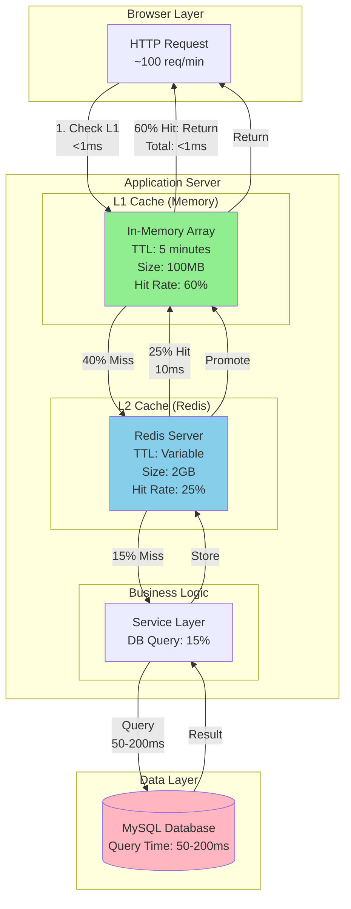

# Design Document Enhancements for v2.1.0

**Document Version**: 2.1.0-enhancements  
**Date**: January 23, 2026  
**Purpose**: Additional diagrams, rationales, and sequence flows for design.md

---

## Table of Contents

1. [Enhanced Mermaid Diagrams](#1-enhanced-mermaid-diagrams)
2. [Design Rationales and Alternatives](#2-design-rationales-and-alternatives)
3. [Critical Sequence Diagrams](#3-critical-sequence-diagrams)
4. [Implementation Depth Examples](#4-implementation-depth-examples)
5. [Component Interaction Flows](#5-component-interaction-flows)

---

## 1. Enhanced Mermaid Diagrams

### 1.1 Cache Hierarchy with Data Flow

**Purpose**: Visualize the complete L1/L2 caching flow with timing and hit rates

