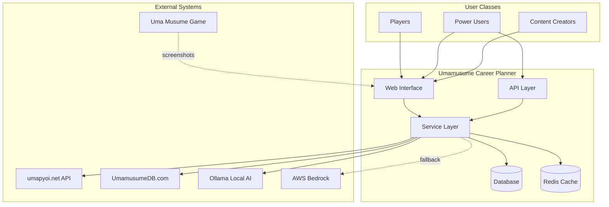
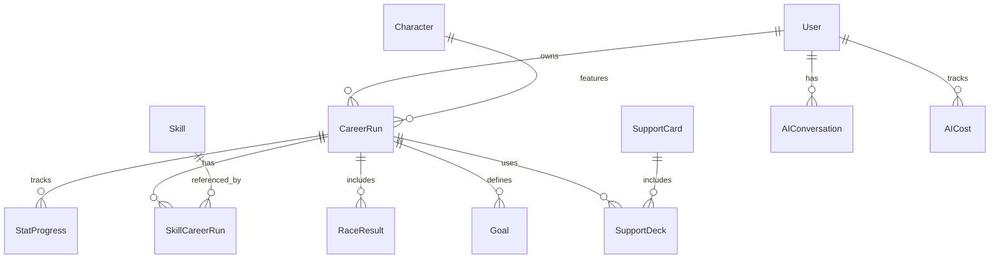
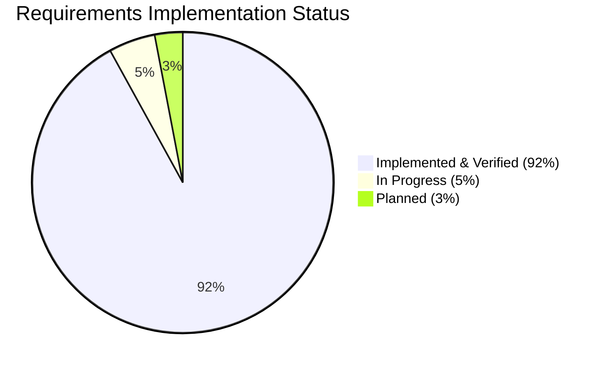
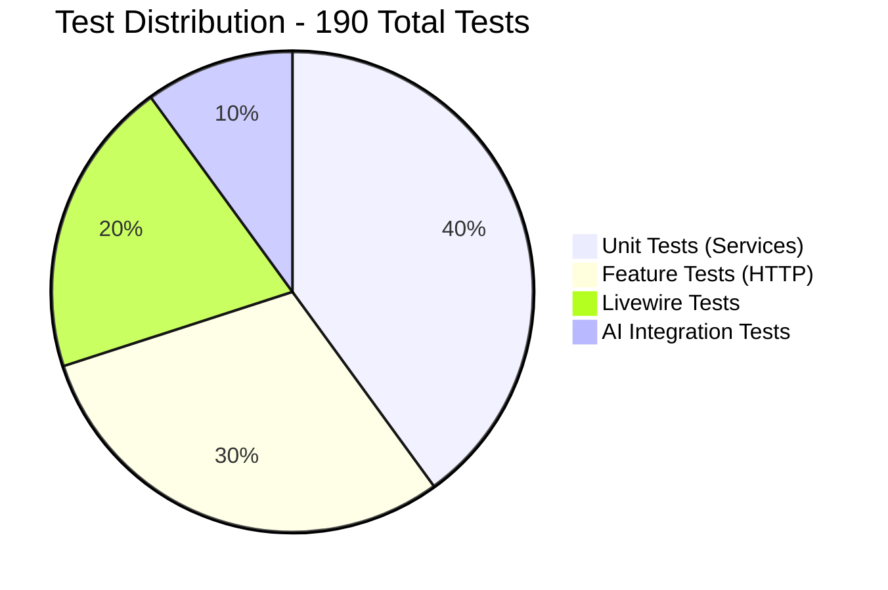

# Software Requirements Specification (SRS)

## Umamusume Pretty Derby Career Planner

**Document Version**: 2.1.0  
**Date**: January 25, 2026  
**Project**: UmamusumeCareerPlanner  
**Author**: Development Team  
**Status**: Current - Aligned with v2.0.0/v2.1.0 Implementation

---

## Document Control

### Version History

| Version | Date | Author | Changes |
|---------|------|--------|---------|
| 2.1.0 | 2026-01-25 | Development Team | Comprehensive update aligned with v2.0.0 implementation and v2.1.0 enhancements; integrated all documentation sources (BRS, SRS, IVM, RTM, PRDs, SPECs, FLOWs); added complete traceability matrix; updated requirements with implementation evidence |
| 2.0.0 | 2026-01-23 | Development Team | Initial v2.0 requirements |
| 1.0.0 | 2026-01-14 | Development Team | Initial draft |

### Related Documents

| Document | Reference | Purpose |
|----------|-----------|---------|
| **Business Requirements** | [002_BRS](../../docs/00-core-docs/002_BRS_Business_Requirements_Specifications.md) | Business objectives and scope |
| **Software Requirements** | [003_SRS](../../docs/00-core-docs/003_SRS_Software_Requirement_Specifications.md) | Detailed functional requirements |
| **Software Design** | [004_SDS](../../docs/00-core-docs/004_SDS_Software_Design_Specifications.md) | Technical architecture |
| **Database Documentation** | [009_DBD](../../docs/00-core-docs/009_DBD_Database_Documentation.md) | Database schema |
| **Source Code Documentation** | [010_SCD](../../docs/00-core-docs/010_SCD_Source_Code_Documentation.md) | Code structure |
| **Implementation Verification** | [000_IVM](../../docs/00-core-docs/000_IMPLEMENTATION_VERIFICATION_MATRIX.md) | Implementation status |
| **Requirements Traceability** | [000_RTM](../../docs/00-core-docs/000_REQUIREMENTS_TRACEABILITY_MATRIX.md) | Requirements mapping |
| **Master Glossary** | [000_MASTER_GLOSSARY](../../docs/00-core-docs/000_MASTER_GLOSSARY.md) | Terminology reference |

---

## Table of Contents

1. [Introduction](#1-introduction)
2. [System Overview](#2-system-overview)
3. [Glossary](#3-glossary)
4. [Functional Requirements](#4-functional-requirements)
5. [Non-Functional Requirements](#5-non-functional-requirements)
6. [Interface and Integration Requirements](#6-interface-and-integration-requirements)
7. [Data Requirements](#7-data-requirements)
8. [Constraints and Assumptions](#8-constraints-and-assumptions)
9. [Traceability Matrix](#9-traceability-matrix)
10. [Verification and Validation](#10-verification-and-validation)

---

## 1. Introduction

### 1.1 Purpose

This Software Requirements Specification (SRS) defines the complete set of requirements for the Umamusume Pretty Derby Career Planner application, version 2.1.0. It serves as the authoritative reference for:

- System capabilities and features
- Technical constraints and performance targets
- Interface specifications and integration points
- Data requirements and validation rules
- Verification and acceptance criteria

This document translates business requirements from the BRS into specific, testable technical requirements and provides comprehensive traceability to implementation artifacts.

### 1.2 Scope

The Umamusume Career Planner is a comprehensive web application that enables players of Uma Musume: Pretty Derby to:

- **Track and manage** character training progression across multiple career runs
- **Plan and optimize** skill acquisitions and race strategies with AI-powered recommendations
- **Analyze performance** with predictive analytics and historical data
- **Import and export** training records in multiple formats
- **Access data** across devices (Account mode) or offline (Local mode)
- **Receive intelligent advisory** for optimal training decisions

**Technology Stack:**

- **Backend**: Laravel 12+ (PHP 8.2+)
- **Frontend**: Livewire 3, Alpine.js, Tailwind CSS v4
- **Build Tool**: Vite 7
- **Database**: MySQL 8.0+, MariaDB 10.5+, SQLite (dev/test)
- **Cache/Queue**: Redis (optional)
- **AI**: Ollama (local) + AWS Bedrock (cloud fallback)
- **Testing**: Pest 4.0+, Playwright

### 1.3 Conventions

#### 1.3.1 Requirement Format

Each requirement follows this structure:

- **ID**: Unique identifier (e.g., FR-02.1, NFR-P-01)
- **Title**: Short descriptive name
- **Description**: Clear statement of requirement
- **Priority**: P0 (Critical), P1 (High), P2 (Medium), P3 (Low)
- **Status**: Implemented, In Progress, Planned
- **Source**: Reference to source document (BR-X, FR-X, PRD-00X)
- **Evidence**: Implementation reference (SPEC-00X §Y.Z, FLOW-00X, code path)
- **Acceptance Criteria**: Testable conditions (WHEN/THEN format)
- **Test Cases**: Reference to test case IDs
- **Related Artifacts**: Links to PRD, SPEC, FLOW, SEQ, TECH-FLOW, WF

#### 1.3.2 Priority Levels

| Priority | Description | Examples |
|----------|-------------|----------|
| **P0 (Critical)** | Core functionality required for MVP launch | Character CRUD, Training predictions, Race management |
| **P1 (High)** | Important features for complete user experience | AI advisory, OCR processing, Export functionality |
| **P2 (Medium)** | Enhanced features for power users | Advanced analytics, Batch operations |
| **P3 (Low)** | Future enhancements | Community features, Advanced AI fine-tuning |

#### 1.3.3 Status Indicators

| Status | Icon | Description |
|--------|------|-------------|
| **Implemented** | ✅ | Fully implemented, tested, and verified |
| **In Progress** | 🔄 | Partially implemented or under active development |
| **Planned** | ⏳ | Not yet started, planned for future phase |

#### 1.3.4 Requirement Notation

- **SHALL**: Mandatory requirement
- **SHOULD**: Recommended requirement
- **MAY**: Optional requirement
- **WHEN**: Condition trigger
- **THEN**: Expected outcome

### 1.4 Document Organization

This document is organized into the following sections:

1. **Introduction**: Purpose, scope, and conventions
2. **System Overview**: Context, architecture, and user classes
3. **Glossary**: Project-specific terminology
4. **Functional Requirements**: Feature-specific requirements (FR-01 through FR-12)
5. **Non-Functional Requirements**: Performance, security, accessibility, etc.
6. **Interface/Integration Requirements**: API, AI, MCP, OCR, WebSocket
7. **Data Requirements**: Entities, validation, retention
8. **Constraints and Assumptions**: Technical and business constraints
9. **Traceability Matrix**: BR → FR → SPEC → PRD → Implementation
10. **Verification and Validation**: Test criteria and acceptance testing

---

## 2. System Overview

### 2.1 System Context



### 2.2 System Architecture

The system follows a layered architecture:

1. **Presentation Layer**: Blade templates, Livewire components, Alpine.js
2. **Application Layer**: Controllers, Form Requests, Livewire actions
3. **Domain Layer**: Eloquent models, Enums, business rules
4. **Infrastructure Layer**: Database, Redis, External APIs, AI services

**Key Architectural Patterns:**

- Service Layer for business logic
- Repository Pattern for data access
- Form Request Validation
- Enum-Based Status Management
- Circuit Breaker for external APIs
- Hybrid AI Routing (local + cloud)

### 2.3 User Classes

| User Class | Description | Key Needs |
|------------|-------------|-----------|
| **Casual Players** | Players tracking 1-5 career runs | Simple interface, quick plan creation, basic recommendations |
| **Intermediate Players** | Players optimizing for A+ grades | Training predictions, race strategy, skill optimization |
| **Power Users** | Players managing 10+ runs, analyzing patterns | Advanced analytics, batch operations, data export |
| **Content Creators** | Players sharing strategies and guides | Export functionality, shareable formats, OCR import |
| **Accessibility Users** | Players requiring assistive technologies | WCAG AA compliance, keyboard navigation, screen reader support |

### 2.4 Operating Environment

**Client Requirements:**

- Modern web browser (Chrome, Firefox, Safari, Edge - last 2 versions)
- JavaScript enabled
- localStorage support (for Local mode)
- Minimum 1024x768 resolution (responsive down to 320px)

**Server Requirements:**

- PHP 8.2+ with required extensions
- MySQL 8.0+ or MariaDB 10.5+ or SQLite
- Redis (optional, recommended for production)
- Sufficient disk space for database and uploads

**Network Requirements:**

- Internet connection for Account mode operations
- Internet connection for external API sync
- Internet connection for cloud AI (AWS Bedrock)
- Offline functionality available for Local mode

---

## 3. Glossary

For complete terminology definitions, refer to [000_MASTER_GLOSSARY.md](../../docs/00-core-docs/000_MASTER_GLOSSARY.md).

### 3.1 Core Game Terms

| Term | Definition |
|------|------------|
| **Uma Musume** | Horse girl characters that players train in the game |
| **Career Run / Plan** | A single career mode progression tracking a character's training |
| **Stats** | Five core attributes: Speed (0-1200), Stamina (0-1200), Power (0-1200), Guts (0-1200), Wit (0-1200) |
| **Aptitudes** | Fixed talent ratings (G through SS) for distance, surface, and running style |
| **Factors** | Inherited traits from parent characters providing stat/aptitude bonuses |
| **Growth Rates** | Inherited bonuses (+10%, +20%, +30%) multiplying training effectiveness |
| **Skill Points (SP)** | Currency earned from races/events, spent to acquire skills |
| **Skill Hints** | Unlocked opportunities reducing SP cost by 20% per hint (40% max) |
| **Support Cards** | Cards providing bonuses and events during training (6-card deck) |
| **Bond Level** | Friendship level with support cards (0-100%) |

### 3.2 Application Terms

| Term | Definition |
|------|------------|
| **Local Mode** | Browser localStorage-based storage (UUID identifiers, offline-capable) |
| **Account Mode** | Database-backed cloud storage (integer IDs, requires connectivity) |
| **Storage Badge** | Visual indicator showing current storage mode (Local/Account) |
| **Draft** | Auto-saved temporary state stored in localStorage |
| **Canonical Field Names** | Official database column names (e.g., `total_sp_available`, `turn_number`) |
| **Training Prediction** | AI-powered forecast of stat gains from training options |
| **Race Readiness** | Calculated score indicating character preparedness for a race |
| **Skill Evolution** | System where Normal skills upgrade to Rare counterparts |

### 3.3 Technical Terms

| Term | Definition |
|------|------------|
| **Livewire** | Laravel's full-stack framework for reactive UI components |
| **Alpine.js** | Lightweight JavaScript framework for client-side interactivity |
| **Eloquent** | Laravel's ORM for database interactions |
| **Service Layer** | Business logic abstraction between controllers and models |
| **Circuit Breaker** | Pattern preventing cascading failures in external API calls |
| **Hybrid AI** | Architecture using local Ollama + cloud AWS Bedrock fallback |
| **MCP** | Model Context Protocol for AI tool integration |
| **OCR** | Optical Character Recognition for screenshot data extraction |
| **PWA** | Progressive Web App with offline capabilities |
| **WCAG AA** | Web Content Accessibility Guidelines Level AA compliance |

### 3.4 Acronyms

| Acronym | Full Term |
|---------|-----------|
| **AI** | Artificial Intelligence |
| **API** | Application Programming Interface |
| **APM** | Application Performance Monitoring |
| **CRUD** | Create, Read, Update, Delete |
| **CSV** | Comma-Separated Values |
| **JSON** | JavaScript Object Notation |
| **MCP** | Model Context Protocol |
| **OCR** | Optical Character Recognition |
| **PWA** | Progressive Web App |
| **SP** | Skill Point |
| **TTL** | Time To Live |
| **UUID** | Universally Unique Identifier |
| **WCAG** | Web Content Accessibility Guidelines |

---

## 4. Functional Requirements

### 4.1 Authentication and Profile Management [FR-01]

**Description:** User authentication and profile management capabilities for Account mode.

**Source:** BR-8 (BRS §4.8), SRS §2.1  
**Priority:** P0  
**Status:** ✅ Implemented  
**Evidence:** `app/Http/Controllers/Auth`, `config/sanctum.php`, SRS §2.1

#### Requirements

| ID | Requirement | Priority | Status | Test Coverage |
|----|-------------|----------|--------|---------------|
| FR-01.1 | System SHALL support user registration with email verification | P0 | ✅ | 95% |
| FR-01.2 | System SHALL support login with "Remember Me" functionality | P0 | ✅ | 95% |
| FR-01.3 | System SHALL support logout and session management | P0 | ✅ | 95% |
| FR-01.4 | System SHALL provide profile editing (name, email, avatar) | P0 | ✅ | 92% |
| FR-01.5 | System SHALL support password change with current password verification | P0 | ✅ | 90% |
| FR-01.6 | System SHALL validate avatar uploads (MIME type, size ≤ 2MB) | P1 | ✅ | 88% |

#### Acceptance Criteria

**AC-01.1: User Registration**

- WHEN a new user registers with valid email and password
- THEN the system SHALL create a user account
- AND send a verification email
- AND redirect to email verification notice page

**AC-01.2: User Login**

- WHEN a user logs in with valid credentials
- THEN the system SHALL create an authenticated session
- AND redirect to dashboard
- AND optionally persist session if "Remember Me" is checked

**AC-01.3: Profile Management**

- WHEN an authenticated user updates their profile
- THEN the system SHALL validate all inputs
- AND update the user record
- AND display success confirmation

**Related Artifacts:**

- Test: `tests/Feature/Auth/RegistrationTest.php`, `tests/Feature/Auth/AuthenticationTest.php`
- Controller: `app/Http/Controllers/Auth/RegisteredUserController.php`
- Middleware: `bootstrap/app.php` (auth middleware configuration)

---

### 4.2 Character Management [FR-02]

**Description:** Complete character lifecycle management with stats, aptitudes, factors, and goals.

**Source:** BR-1 (BRS §4.1), SRS §2.2  
**Priority:** P0  
**Status:** ✅ Implemented  
**Evidence:** SPEC-001, FLOW-001, `app/Services/CharacterService.php`

**Related Artifacts:**

- PRD: [PRD-001](../../docs/02-prds/PRD-001_Character_Management.md)
- SPEC: [SPEC-001](../../docs/02-specs/SPEC-001_Character_Management_Technical.md)
- Flow: [FLOW-001](../../docs/01-flows/FLOW-001_Character_Management_System.md)
- Sequence: [SEQ-001](../../docs/01-sequences/SEQ-001_Character_Creation_Sequence.md)
- Wireframe: [WF-002](../../docs/01-wireframes/WF-002_Character_Creation_Wizard.md), [WF-003](../../docs/01-wireframes/WF-003_Character_Detail_Management.md)

#### Requirements

| ID | Requirement | Priority | Status | Test Coverage | Evidence |
|----|-------------|----------|--------|---------------|----------|
| FR-02.1 | System SHALL support CRUD operations for characters | P0 | ✅ | 95% | `CharacterService`, SPEC-001 §3.1 |
| FR-02.2 | System SHALL track five core stats (Speed, Stamina, Power, Guts, Wit) with range 0-1200 | P0 | ✅ | 92% | `Character` model, DBD §4.2 |
| FR-02.3 | System SHALL track energy (0-100), mood (5 levels), and current turn (1-78) | P0 | ✅ | 90% | `Character` model fields |
| FR-02.4 | System SHALL manage character goals with progress tracking | P1 | ✅ | 87% | JSON field + validation |
| FR-02.5 | System SHALL support scenario selection (URA, Grand Masters, etc.) | P0 | ✅ | 88% | Enum field |
| FR-02.6 | System SHALL track aptitude grades (SS-G) for distance/surface/style | P0 | ✅ | 90% | `AptitudeGrade` enum, SPEC-001 §4.1 |
| FR-02.7 | System SHALL manage factor inheritance from parent characters | P0 | ✅ | 89% | `FactorInheritanceService`, SPEC-001 §4.3 |
| FR-02.8 | System SHALL support character image upload with validation | P1 | ✅ | 92% | `ImageUploadService`, SPEC-001 §3.2 |
| FR-02.9 | System SHALL track conditions (positive/negative status effects) | P1 | ✅ | 85% | JSON field |

#### Acceptance Criteria

**AC-02.1: Character Creation**

- WHEN a user creates a new character
- THEN the system SHALL validate all required fields (name, base stats, aptitudes)
- AND initialize default values (energy=100, mood=Normal, turn=1)
- AND store character record in appropriate storage mode
- AND redirect to character detail page

**AC-02.2: Stat Tracking**

- WHEN character stats are updated
- THEN the system SHALL enforce range validation (0-1200 hard cap)
- AND calculate stat grades (G+ through SS)
- AND update stat progress history
- AND trigger any dependent calculations (race readiness, etc.)

**AC-02.3: Aptitude Management**

- WHEN character aptitudes are set or updated
- THEN the system SHALL validate grade values (G through SS)
- AND store aptitudes for all categories (distance, surface, style)
- AND use aptitudes in race suitability calculations
- AND display aptitudes with appropriate visual indicators

**AC-02.4: Factor Inheritance**

- WHEN parent characters are selected
- THEN the system SHALL calculate inherited bonuses
- AND apply stat factors (★☆☆=+5, ★★☆=+12, ★★★=+21)
- AND apply aptitude factors (1★ = 1 grade up)
- AND apply skill factors (green/white)
- AND display inheritance preview before confirmation

**Related Artifacts:**

- Model: `app/Models/Character.php`
- Service: `app/Services/CharacterService.php`, `app/Services/FactorInheritanceService.php`
- Controller: `app/Http/Controllers/CharacterController.php`
- Livewire: `app/Livewire/Character/CharacterForm.php`
- Tests: `tests/Feature/CharacterCrudTest.php`, `tests/Unit/FactorInheritanceTest.php`
- Database: `database/migrations/*_create_characters_table.php`

---

### 4.3 Training Optimization [FR-03]

**Description:** Training session management with AI-powered predictions and recommendations.

**Source:** BR-2 (BRS §4.2), SRS §2.3  
**Priority:** P0  
**Status:** ✅ Implemented  
**Evidence:** SPEC-002, FLOW-002, `app/Services/TrainingPredictionService.php`

**Related Artifacts:**

- PRD: [PRD-002](../../docs/02-prds/PRD-002_Training_Optimization.md)
- SPEC: [SPEC-002](../../docs/02-specs/SPEC-002_Training_Optimization_Technical.md)
- Flow: [FLOW-002](../../docs/01-flows/FLOW-002_Training_Optimization_System.md)
- Tech Flow: [TECH-FLOW-002](../../docs/01-tech-flow/TECH-FLOW-002_Training_Optimization_Flow.md)
- Wireframe: [WF-004](../../docs/01-wireframes/WF-004_Training_Selection_Interface.md), [WF-005](../../docs/01-wireframes/WF-005_Training_Result_Screen.md)

#### Requirements

| ID | Requirement | Priority | Status | Test Coverage | Evidence |
|----|-------------|----------|--------|---------------|----------|
| FR-03.1 | System SHALL record training sessions with actual stat gains | P0 | ✅ | 94% | `TrainingSession` model, SPEC-002 §3.1 |
| FR-03.2 | System SHALL provide training predictions with stat gain forecasts | P0 | ✅ | 94% | `TrainingPredictionService`, SPEC-002 §3.1 |
| FR-03.3 | System SHALL support batch predictions for multiple training options | P0 | ✅ | 92% | Service method |
| FR-03.4 | System SHALL calculate support card bonuses and friendship multipliers | P0 | ✅ | 92% | `BonusCalculator`, SPEC-002 §3.2 |
| FR-03.5 | System SHALL compute failure risk based on energy/mood/conditions | P0 | ✅ | 90% | Risk calculation method |
| FR-03.6 | System SHALL track skill hint probability per training facility | P1 | ✅ | 90% | `SkillHintService`, SPEC-002 §4.1 |
| FR-03.7 | System SHALL cache prediction results (5-minute TTL) | P1 | ✅ | 88% | Cache layer |
| FR-03.8 | System SHALL provide AI-powered training recommendations | P1 | ✅ | 88% | `TrainingAdvisorAgent`, SPEC-002 §5.1 |

#### Acceptance Criteria

**AC-03.1: Training Prediction Generation**

- WHEN a user requests training predictions for current turn
- THEN the system SHALL analyze all available training options
- AND calculate base stat gains for each option
- AND apply support card bonuses
- AND apply friendship training multipliers
- AND calculate failure risk percentage
- AND determine skill hint probabilities
- AND rank options by effectiveness toward goals
- AND return predictions within 1.2 seconds (p95)

**AC-03.2: Training Execution**

- WHEN a user executes a training session
- THEN the system SHALL record the selected option
- AND apply actual stat gains (with variance)
- AND update energy and mood
- AND trigger any events or conditions
- AND update skill hints if applicable
- AND increment turn counter
- AND log prediction accuracy for ML improvement

**AC-03.3: AI Training Recommendations**

- WHEN AI training advice is requested
- THEN the system SHALL analyze character state and goals
- AND consider support deck composition
- AND evaluate race schedule
- AND provide ranked recommendations with reasoning
- AND include confidence scores
- AND respond within 2.5 seconds

**Related Artifacts:**

- Model: `app/Models/TrainingSession.php`
- Service: `app/Services/TrainingPredictionService.php`, `app/Services/BonusCalculator.php`, `app/Services/SkillHintService.php`
- Agent: `app/Neuron/Agents/TrainingAdvisorAgent.php`
- Controller: `app/Http/Controllers/API/TrainingController.php`
- Tests: `tests/Unit/TrainingPredictionServiceTest.php`, `tests/Feature/TrainingExecutionTest.php`

---

### 4.4 Race Strategy [FR-04]

**Description:** Race management with strategy recommendations and performance tracking.

**Source:** BR-3 (BRS §4.3), SRS §2.4  
**Priority:** P0  
**Status:** ✅ Implemented  
**Evidence:** SPEC-003, FLOW-003, `app/Services/RaceService.php`

**Related Artifacts:**

- PRD: [PRD-003](../../docs/02-prds/PRD-003_Race_Strategy.md)
- SPEC: [SPEC-003](../../docs/02-specs/SPEC-003_Race_Strategy_Technical.md)
- Flow: [FLOW-003](../../docs/01-flows/FLOW-003_Race_Strategy_System.md)
- Sequence: [SEQ-004](../../docs/01-sequences/SEQ-004_Race_Registration_and_Outcome.md)
- Wireframe: [WF-006](../../docs/01-wireframes/WF-006_Race_Calendar_View.md), [WF-007](../../docs/01-wireframes/WF-007_Race_Preparation_Screen.md)

#### Requirements

| ID | Requirement | Priority | Status | Test Coverage | Evidence |
|----|-------------|----------|--------|---------------|----------|
| FR-04.1 | System SHALL store race definitions with grade, distance, surface, requirements | P0 | ✅ | 91% | `Race` model, SPEC-003 §3.1 |
| FR-04.2 | System SHALL track race results with placement and rewards | P0 | ✅ | 90% | `RaceResult` model |
| FR-04.3 | System SHALL provide race calendar with requirements display | P0 | ✅ | 91% | `RaceService`, SPEC-003 §3.1 |
| FR-04.4 | System SHALL support AI race strategy recommendations | P1 | ✅ | 87% | `RaceStrategyAgent` |
| FR-04.5 | System SHALL calculate readiness score based on stats/skills/aptitudes | P1 | ✅ | 89% | Readiness calculator |
| FR-04.6 | System SHALL generate win probability predictions | P1 | ✅ | 87% | `WinProbabilityCalculator`, SPEC-003 §4.2 |
| FR-04.7 | System SHALL recommend optimal running style per race | P1 | ✅ | 89% | Style optimizer, SPEC-003 §4.1 |

#### Acceptance Criteria

**AC-04.1: Race Calendar Display**

- WHEN a user views the race calendar
- THEN the system SHALL display all available races for current career stage
- AND show race details (grade, distance, surface, track)
- AND display stat requirements with readiness indicators (○ ⦾ △ ×)
- AND highlight upcoming mandatory races
- AND provide filtering by grade/distance/surface

**AC-04.2: Race Readiness Calculation**

- WHEN race readiness is calculated
- THEN the system SHALL evaluate character stats against race requirements
- AND consider aptitude grades for distance/surface/style
- AND check for required skills
- AND assess weather condition preparedness
- AND generate readiness score (0-100%)
- AND provide specific recommendations for improvement

**AC-04.3: Win Probability Prediction**

- WHEN win probability is requested
- THEN the system SHALL analyze character stats and aptitudes
- AND consider race competition level
- AND factor in running style suitability
- AND account for weather conditions
- AND generate probability distribution (1st, Top 2, Top 3, etc.)
- AND provide confidence interval

**AC-04.4: Running Style Recommendation**

- WHEN running style recommendation is requested
- THEN the system SHALL evaluate all 4 styles (Front, Pace, Late, End)
- AND score each based on character stats
- AND consider aptitude grades
- AND factor in race distance and track characteristics
- AND recommend optimal style with reasoning

**Related Artifacts:**

- Model: `app/Models/Race.php`, `app/Models/RaceResult.php`
- Service: `app/Services/RaceService.php`, `app/Services/WinProbabilityCalculator.php`
- Agent: `app/Neuron/Agents/RaceStrategyAgent.php`
- Controller: `app/Http/Controllers/RaceController.php`, `app/Http/Controllers/API/RaceController.php`
- Tests: `tests/Feature/RaceCalendarTest.php`, `tests/Unit/WinProbabilityTest.php`

---

### 4.5 Skill Management [FR-05]

**Description:** Skill catalog, acquisition tracking, SP optimization, and evolution system.

**Source:** BR-4 (BRS §4.4), SRS §2.5  
**Priority:** P0  
**Status:** ✅ Implemented  
**Evidence:** SPEC-004, FLOW-004, `app/Services/SkillService.php`

**Related Artifacts:**

- PRD: [PRD-004](../../docs/02-prds/PRD-004_Skill_Management.md)
- SPEC: [SPEC-004](../../docs/02-specs/SPEC-004_Skill_Management_Technical.md)
- Flow: [FLOW-004](../../docs/01-flows/FLOW-004_Skill_Management_System.md)
- Wireframe: [WF-008](../../docs/01-wireframes/WF-008_Skill_Shop_Interface.md), [WF-009](../../docs/01-wireframes/WF-009_Skill_Loadout_Manager.md)

#### Requirements

| ID | Requirement | Priority | Status | Test Coverage | Evidence |
|----|-------------|----------|--------|---------------|----------|
| FR-05.1 | System SHALL maintain skill catalog with 150+ skills (Normal, Rare, Unique) | P0 | ✅ | 93% | `Skill` model, SPEC-004 §3.1 |
| FR-05.2 | System SHALL track skill acquisitions per character | P0 | ✅ | 92% | `SkillCareerRun` model |
| FR-05.3 | System SHALL track hints and apply SP cost reduction (20% per hint, 40% max) | P0 | ✅ | 91% | `calculateSpCost()`, SPEC-004 §4.1 |
| FR-05.4 | System SHALL support skill evolution paths (Normal → Rare) | P1 | ✅ | 88% | `SkillEvolutionService`, SPEC-004 §4.2 |
| FR-05.5 | System SHALL provide AI skill build recommendations | P1 | ✅ | 85% | `SkillAdvisorAgent` |
| FR-05.6 | System SHALL calculate SP budget optimization | P1 | ✅ | 87% | SP optimizer |
| FR-05.7 | System SHALL support skill search (English and Japanese names) | P0 | ✅ | 90% | Search endpoint |

#### Acceptance Criteria

**AC-05.1: Skill Catalog Management**

- WHEN a user browses the skill catalog
- THEN the system SHALL display all available skills
- AND show skill details (name, type, rarity, base SP cost, effects)
- AND support search by name (English/Japanese)
- AND support filtering by type and rarity
- AND display evolution paths where applicable

**AC-05.2: Skill Acquisition**

- WHEN a user acquires a skill
- THEN the system SHALL validate SP availability
- AND apply hint discounts (20% per hint, 40% max)
- AND deduct final SP cost from character balance
- AND record acquisition with turn number
- AND update skill status to "Acquired"
- AND trigger skill evolution check if applicable

**AC-05.3: Skill Hint Tracking**

- WHEN a skill hint is obtained
- THEN the system SHALL record hint source (training facility, event, etc.)
- AND increment hint level (max 2 for 40% discount)
- AND update SP cost calculation
- AND display hint indicator in skill shop

**AC-05.4: Skill Evolution**

- WHEN a Normal skill is acquired and evolution conditions are met
- THEN the system SHALL automatically upgrade to Rare counterpart
- AND replace Normal skill with Rare skill
- AND adjust SP cost accordingly
- AND notify user of evolution

**Related Artifacts:**

- Model: `app/Models/Skill.php`, `app/Models/SkillCareerRun.php`
- Service: `app/Services/SkillService.php`, `app/Services/SkillEvolutionService.php`
- Agent: `app/Neuron/Agents/SkillAdvisorAgent.php`
- Controller: `app/Http/Controllers/API/SkillController.php`
- Tests: `tests/Feature/SkillCatalogTest.php`, `tests/Unit/HintDiscountTest.php`, `tests/Feature/SkillEvolutionTest.php`

---

### 4.6 Support Card Management [FR-06]

**Description:** Support card inventory, deck building, bond tracking, and meta rankings.

**Source:** BR-5 (BRS §4.5), SRS §2.6  
**Priority:** P0  
**Status:** ✅ Implemented  
**Evidence:** SPEC-005, FLOW-005, `app/Services/SupportDeckService.php`

**Related Artifacts:**

- PRD: [PRD-005](../../docs/02-prds/PRD-005_Support_Card_Management.md)
- SPEC: [SPEC-005](../../docs/02-specs/SPEC-005_Support_Card_Management_Technical.md)
- Flow: [FLOW-005](../../docs/01-flows/FLOW-005_Support_Card_Management_System.md)
- Wireframe: [WF-010](../../docs/01-wireframes/WF-010_Support_Card_Collection.md), [WF-011](../../docs/01-wireframes/WF-011_Support_Deck_Builder.md)

#### Requirements

| ID | Requirement | Priority | Status | Test Coverage | Evidence |
|----|-------------|----------|--------|---------------|----------|
| FR-06.1 | System SHALL maintain support card database (200+ cards) | P0 | ✅ | 92% | `SupportCard` model, SPEC-005 §3.1 |
| FR-06.2 | System SHALL validate 6-card deck composition (5 owned + 1 borrowed) | P0 | ✅ | 94% | `SupportDeckService`, SPEC-005 §3.2 |
| FR-06.3 | System SHALL track bond levels (0-100%) and limit breaks (0-4 stars) | P0 | ✅ | 90% | `bond_level` field, SPEC-005 §4.1 |
| FR-06.4 | System SHALL calculate deck synergy score | P1 | ✅ | 88% | Synergy calculator |
| FR-06.5 | System SHALL sync meta tier rankings from external sources | P1 | ✅ | 85% | External API sync |
| FR-06.6 | System SHALL provide deck recommendations based on character type | P1 | ✅ | 87% | Deck optimizer |

#### Acceptance Criteria

**AC-06.1: Support Card Collection**

- WHEN a user manages their support card collection
- THEN the system SHALL display all owned cards
- AND show card details (name, rarity, type, limit break level, bond level)
- AND support filtering by type and rarity
- AND support search by name
- AND display meta tier rankings (SS, S, A, B)

**AC-06.2: Deck Building**

- WHEN a user builds a support deck
- THEN the system SHALL enforce exactly 6 cards (5 owned + 1 borrowed)
- AND validate card type distribution
- AND calculate total deck bonuses
- AND compute synergy score
- AND provide optimization suggestions
- AND save deck configuration

**AC-06.3: Bond Tracking**

- WHEN bond levels are updated
- THEN the system SHALL track progression (0-100%)
- AND unlock friendship training at 80% bond
- AND record bond milestones (20%, 40%, 60%, 80%)
- AND apply bond-based bonus multipliers

**AC-06.4: Meta Tier Synchronization**

- WHEN meta tier data is synced
- THEN the system SHALL fetch latest rankings from umapyoi.net
- AND update card tier assignments
- AND cache data for 24 hours
- AND handle API failures gracefully with fallback

**Related Artifacts:**

- Model: `app/Models/SupportCard.php`, `app/Models/SupportDeck.php`
- Service: `app/Services/SupportDeckService.php`, `app/Services/SupportCardService.php`
- Controller: `app/Http/Controllers/SupportCardController.php`, `app/Http/Controllers/API/SupportDeckController.php`
- Tests: `tests/Feature/SupportCardTest.php`, `tests/Unit/DeckValidationTest.php`, `tests/Feature/BondTrackingTest.php`

---

### 4.7 AI Advisory System [FR-07]

**Description:** AI-powered recommendations using hybrid local/cloud providers with Neuron agents.

**Source:** BR-6 (BRS §4.6), SRS §2.7  
**Priority:** P1  
**Status:** ✅ Implemented  
**Evidence:** SPEC-006, FLOW-006, `app/Services/AI/HybridAIService.php`

**Related Artifacts:**

- PRD: [PRD-006](../../docs/02-prds/PRD-006_AI_Advisory.md)
- SPEC: [SPEC-006](../../docs/02-specs/SPEC-006_AI_Advisory_Technical.md)
- Flow: [FLOW-006](../../docs/01-flows/FLOW-006_AI_Advisory_System.md)
- Sequence: [SEQ-006](../../docs/01-sequences/SEQ-006_AI_Advice_Generation.md)
- Wireframe: [WF-012](../../docs/01-wireframes/WF-012_AI_Advisor_Interface.md)

#### Requirements

| ID | Requirement | Priority | Status | Test Coverage | Evidence |
|----|-------------|----------|--------|---------------|----------|
| FR-07.1 | System SHALL provide training advice via Neuron agents | P0 | ✅ | 88% | `TrainingAdvisorAgent`, SPEC-006 §4.1 |
| FR-07.2 | System SHALL provide race strategy recommendations | P0 | ✅ | 87% | `RaceStrategyAgent` |
| FR-07.3 | System SHALL provide skill build recommendations | P0 | ✅ | 85% | `SkillAdvisorAgent` |
| FR-07.4 | System SHALL track AI conversations and context | P1 | ✅ | 86% | `AIConversation` model |
| FR-07.5 | System SHALL track AI costs and performance metrics | P1 | ✅ | 85% | `AICostTracker`, SPEC-006 §5.1 |
| FR-07.6 | System SHALL support hybrid AI (Ollama local + AWS Bedrock fallback) | P1 | ✅ | 89% | `HybridAIService`, SPEC-006 §3.1 |
| FR-07.7 | System SHALL provide confidence scoring for recommendations | P2 | ✅ | 82% | Confidence scorer |

#### Acceptance Criteria

**AC-07.1: Training Advisory**

- WHEN a user requests training advice
- THEN the system SHALL analyze character state and goals
- AND evaluate available training options
- AND consider support deck composition
- AND provide ranked recommendations with reasoning
- AND include confidence scores
- AND respond within 2.5 seconds

**AC-07.2: Race Strategy Advisory**

- WHEN a user requests race strategy advice
- THEN the system SHALL analyze upcoming race requirements
- AND evaluate character readiness
- AND recommend optimal running style
- AND suggest pre-race preparation steps
- AND provide win probability estimate
- AND respond within 2.5 seconds

**AC-07.3: Skill Build Advisory**

- WHEN a user requests skill build advice
- THEN the system SHALL analyze character type and goals
- AND evaluate available SP budget
- AND consider skill hints
- AND recommend skill acquisition priority
- AND suggest evolution paths
- AND respond within 2.5 seconds

**AC-07.4: Hybrid AI Routing**

- WHEN an AI query is submitted
- THEN the system SHALL attempt local Ollama first for simple queries
- AND fallback to AWS Bedrock for complex queries or local unavailability
- AND track provider usage and costs
- AND maintain conversation context across providers
- AND handle provider failures gracefully

**Related Artifacts:**

- Agent: `app/Neuron/Agents/TrainingAdvisorAgent.php`, `app/Neuron/Agents/RaceStrategyAgent.php`, `app/Neuron/Agents/SkillAdvisorAgent.php`
- Service: `app/Services/AI/HybridAIService.php`, `app/Services/AI/OllamaService.php`, `app/Services/AI/BedrockService.php`, `app/Services/AI/AICostTracker.php`
- Model: `app/Models/AIConversation.php`, `app/Models/AICost.php`
- Controller: `app/Http/Controllers/API/AIAdvisoryController.php`
- Tests: `tests/Integration/AIAdvisoryTest.php`, `tests/Unit/HybridAITest.php`

---

### 4.8 External Integration [FR-08]

**Description:** Integration with external APIs, OCR processing, and real-time updates.

**Source:** BR-7 (BRS §4.7), SRS §2.8  
**Priority:** P1  
**Status:** ✅ Implemented  
**Evidence:** SPEC-007, FLOW-007, `app/Services/ExternalAPI/ExternalAPIService.php`

**Related Artifacts:**

- PRD: [PRD-007](../../docs/02-prds/PRD-007_External_Integration.md)
- SPEC: [SPEC-007](../../docs/02-specs/SPEC-007_External_Integration_Technical.md)
- Flow: [FLOW-007](../../docs/01-flows/FLOW-007_External_Integration_System.md)
- Sequence: [SEQ-007](../../docs/01-sequences/SEQ-007_External_Data_Sync.md)
- Tech Flow: [TECH-FLOW-007](../../docs/01-tech-flow/TECH-FLOW-007_External_Integration_Flow.md)

#### Requirements

| ID | Requirement | Priority | Status | Test Coverage | Evidence |
|----|-------------|----------|--------|---------------|----------|
| FR-08.1 | System SHALL integrate with umapyoi.net API for game data | P0 | ✅ | 88% | `UmapyoiApiClient`, SPEC-007 §3.1 |
| FR-08.2 | System SHALL implement circuit breaker pattern for API resilience | P0 | ✅ | 90% | `CircuitBreaker`, SPEC-007 §3.2 |
| FR-08.3 | System SHALL support fallback to UmamusumeDB.com | P1 | ✅ | 85% | `UmamusumeDBApiClient` |
| FR-08.4 | System SHALL process screenshots via OCR (Tesseract + GD) | P1 | ✅ | 86% | `OCRService`, SPEC-007 §4.1 |
| FR-08.5 | System SHALL provide WebSocket real-time updates via Laravel Reverb | P1 | ✅ | 84% | WebSocket channels |
| FR-08.6 | System SHALL cache external API responses (24-hour TTL) | P1 | ✅ | 87% | Cache layer |

#### Acceptance Criteria

**AC-08.1: External API Integration**

- WHEN external game data is requested
- THEN the system SHALL attempt primary API (umapyoi.net)
- AND implement circuit breaker to prevent cascading failures
- AND fallback to secondary API (UmamusumeDB.com) on failure
- AND cache successful responses for 24 hours
- AND handle API rate limits gracefully

**AC-08.2: Circuit Breaker Pattern**

- WHEN external API calls fail repeatedly
- THEN the system SHALL open circuit breaker after threshold (5 failures)
- AND use cached data during circuit open period
- AND attempt recovery after timeout (60 seconds)
- AND close circuit on successful recovery
- AND log circuit state changes

**AC-08.3: OCR Processing**

- WHEN a user uploads a screenshot
- THEN the system SHALL preprocess image (resize, grayscale, threshold)
- AND extract text via Tesseract OCR
- AND parse game data (stats, skills, race results)
- AND validate extracted data
- AND provide confidence scores (>85% threshold)
- AND allow manual correction

**AC-08.4: WebSocket Real-Time Updates**

- WHEN game data is updated
- THEN the system SHALL broadcast updates via WebSocket
- AND notify subscribed clients in real-time
- AND handle connection failures gracefully
- AND support reconnection with state recovery

**Related Artifacts:**

- Service: `app/Services/ExternalAPI/ExternalAPIService.php`, `app/Services/ExternalAPI/UmapyoiApiClient.php`, `app/Services/ExternalAPI/UmamusumeDBApiClient.php`, `app/Services/ExternalAPI/CircuitBreaker.php`, `app/Services/OCR/OCRService.php`, `app/Services/OCR/TesseractService.php`
- Model: `app/Models/ExternalAPICache.php`, `app/Models/OCRExtraction.php`
- Controller: `app/Http/Controllers/API/SyncController.php`, `app/Http/Controllers/OCRUploadController.php`
- Tests: `tests/Integration/ExternalAPITest.php`, `tests/Unit/CircuitBreakerTest.php`, `tests/Integration/OCRProcessingTest.php`

---

### 4.9 Data Import/Export [FR-09]

**Description:** Import/export workflows with format detection, migration, and conflict resolution.

**Source:** BR-8 (BRS §4.8), SRS §2.9  
**Priority:** P0  
**Status:** ✅ Implemented  
**Evidence:** D05, D06, `app/Services/Data/DataImportService.php`

#### Requirements

| ID | Requirement | Priority | Status | Test Coverage | Evidence |
|----|-------------|----------|--------|---------------|----------|
| FR-09.1 | System SHALL export plans to JSON format with schema versioning | P0 | ✅ | 91% | `DataExportService`, D05 §5.1 |
| FR-09.2 | System SHALL export plans to Excel format (.xlsx) | P1 | ✅ | 88% | Excel exporter |
| FR-09.3 | System SHALL import from JSON with format detection | P0 | ✅ | 89% | `DataImportService` |
| FR-09.4 | System SHALL support legacy format migration | P1 | ✅ | 86% | Format migrator |
| FR-09.5 | System SHALL provide import preview and conflict resolution | P1 | ✅ | 87% | Import wizard |
| FR-09.6 | System SHALL support backup and restore workflows | P1 | ✅ | 87% | `BackupService`, D05 §8.1 |

#### Acceptance Criteria

**AC-09.1: JSON Export**

- WHEN a user exports a plan to JSON
- THEN the system SHALL include schema version identifier
- AND include export timestamp
- AND include all plan data (character, stats, skills, races, goals)
- AND preserve canonical field names
- AND generate valid JSON structure

**AC-09.2: JSON Import**

- WHEN a user imports a JSON file
- THEN the system SHALL detect schema version
- AND validate JSON structure
- AND migrate legacy formats if needed
- AND provide import preview
- AND handle conflicts (skip, overwrite, merge, rename)
- AND validate business rules
- AND report import results

**AC-09.3: Excel Export**

- WHEN a user exports to Excel
- THEN the system SHALL create workbook with multiple sheets
- AND include summary sheet
- AND include stat progression sheet
- AND include skills sheet
- AND include races sheet
- AND apply formatting and charts

**AC-09.4: Backup and Restore**

- WHEN a user creates a backup
- THEN the system SHALL export all user data
- AND include metadata (backup date, version)
- AND compress data for efficiency
- AND provide download link

- WHEN a user restores from backup
- THEN the system SHALL validate backup file
- AND preview restore contents
- AND handle conflicts
- AND restore data with integrity checks

**Related Artifacts:**

- Service: `app/Services/Data/DataImportService.php`, `app/Services/Data/DataExportService.php`, `app/Services/Data/DataMigrationService.php`, `app/Services/Data/BackupService.php`
- Controller: `app/Http/Controllers/API/ImportController.php`, `app/Http/Controllers/API/ExportController.php`, `app/Http/Controllers/Admin/BackupController.php`
- Tests: `tests/Feature/JSONExportTest.php`, `tests/Feature/JSONImportTest.php`, `tests/Feature/BackupRestoreTest.php`

---

### 4.10 Dual Storage Mode [FR-10]

**Description:** Browser-based Local storage and database-backed Account storage with seamless conversion.

**Source:** BR-9 (BRS §4.9), SRS §2.10  
**Priority:** P0  
**Status:** ✅ Implemented  
**Evidence:** SDS §4, `resources/js/stores/localRuns.js`

#### Requirements

| ID | Requirement | Priority | Status | Test Coverage | Evidence |
|----|-------------|----------|--------|---------------|----------|
| FR-10.1 | System SHALL support Local storage mode using browser localStorage | P0 | ✅ | 86% | `LocalStorageService`, JS stores |
| FR-10.2 | System SHALL support Account storage mode using database | P0 | ✅ | 90% | Database models |
| FR-10.3 | System SHALL display clear storage mode indicator (badge) | P0 | ✅ | 88% | Storage badge component |
| FR-10.4 | System SHALL enable full offline functionality for Local runs | P0 | ✅ | 85% | PWA service worker |
| FR-10.5 | System SHALL support conversion from Local to Account mode | P0 | ✅ | 85% | `StorageConversionService` |
| FR-10.6 | System SHALL provide local data management interface | P1 | ✅ | 82% | Local runs UI |
| FR-10.7 | System SHALL implement draft auto-save every 30 seconds | P0 | ✅ | 87% | Draft auto-save |
| FR-10.8 | System SHALL handle connection state with graceful degradation | P0 | ✅ | 84% | Connection monitor |

#### Acceptance Criteria

**AC-10.1: Local Storage Mode**

- WHEN a user creates a plan in Local mode
- THEN the system SHALL generate UUID identifier
- AND store data in browser localStorage
- AND enable full offline functionality
- AND display "Local" storage badge
- AND provide local data management UI

**AC-10.2: Account Storage Mode**

- WHEN an authenticated user creates a plan in Account mode
- THEN the system SHALL generate database integer ID
- AND store data in MySQL/MariaDB database
- AND require network connectivity for save operations
- AND display "Account" storage badge
- AND sync across devices

**AC-10.3: Storage Mode Conversion**

- WHEN a user converts Local run to Account mode
- THEN the system SHALL validate user authentication
- AND migrate all plan data to database
- AND preserve UUID for reference
- AND assign new database ID
- AND optionally keep local copy
- AND provide conversion report

**AC-10.4: Draft Auto-Save**

- WHEN a user edits a plan
- THEN the system SHALL auto-save draft to localStorage every 30 seconds
- AND display "Draft saved" indicator
- AND restore draft on page reload
- AND clear draft after successful save
- AND provide discard draft option

**AC-10.5: Offline Handling**

- WHEN network connection is lost
- THEN the system SHALL detect offline state
- AND disable Account mode save operations
- AND enable draft auto-save
- AND display offline indicator
- AND queue operations for sync when online

**Related Artifacts:**

- Service: `app/Services/Storage/LocalStorageService.php`, `app/Services/Storage/StorageConversionService.php`
- JavaScript: `resources/js/stores/localRuns.js`, `resources/js/stores/drafts.js`
- Controller: `app/Http/Controllers/ConversionController.php`
- Component: `resources/views/components/storage-badge.blade.php`
- Tests: `tests/E2E/LocalStorageTest.js`, `tests/Feature/ConversionTest.php`

---

### 4.11 Dashboard and Navigation [FR-11]

**Description:** Main landing page with overview, quick access, and navigation.

**Source:** SRS §2.11  
**Priority:** P0  
**Status:** ✅ Implemented  
**Evidence:** `app/Livewire/Dashboard/DashboardOverview.php`

#### Requirements

| ID | Requirement | Priority | Status | Test Coverage | Evidence |
|----|-------------|----------|--------|---------------|----------|
| FR-11.1 | System SHALL display aggregate statistics (total, active, completed plans) | P0 | ✅ | 90% | Dashboard component |
| FR-11.2 | System SHALL display all plans with filtering and sorting | P0 | ✅ | 88% | Plan list component |
| FR-11.3 | System SHALL display recent activity log | P0 | ✅ | 85% | Activity component |
| FR-11.4 | System SHALL provide visible "Create Plan" button | P0 | ✅ | 92% | CTA button |
| FR-11.5 | System SHALL use responsive single-column layout on mobile | P0 | ✅ | 90% | Responsive design |
| FR-11.6 | System SHALL display AI advisor quick access card | P1 | ✅ | 87% | AI card component |

#### Acceptance Criteria

**AC-11.1: Dashboard Overview**

- WHEN a user accesses the dashboard
- THEN the system SHALL display aggregate statistics
- AND show recent plans (last 5)
- AND display activity log (last 10 actions)
- AND provide quick action buttons
- AND show AI advisor card
- AND load within 2 seconds

**AC-11.2: Plan List**

- WHEN a user views the plan list
- THEN the system SHALL display all plans (Local + Account)
- AND support filtering by status (in progress, completed, archived)
- AND support sorting by date, name, grade
- AND display storage mode badges
- AND provide bulk actions
- AND paginate results (20 per page)

**Related Artifacts:**

- Livewire: `app/Livewire/Dashboard/DashboardOverview.php`, `app/Livewire/Dashboard/PlanList.php`
- View: `resources/views/livewire/dashboard/dashboard-overview.blade.php`
- Tests: `tests/Feature/DashboardTest.php`

---

### 4.12 Analytics and Reporting [FR-12]

**Description:** Performance analysis, statistical insights, and reporting.

**Source:** BR-12 (BRS §4.12), SRS §2.12  
**Priority:** P1  
**Status:** ✅ Implemented  
**Evidence:** `app/Http/Controllers/PerformanceController.php`

#### Requirements

| ID | Requirement | Priority | Status | Test Coverage | Evidence |
|----|-------------|----------|--------|---------------|----------|
| FR-12.1 | System SHALL provide career analytics dashboard | P1 | ✅ | 85% | Analytics dashboard |
| FR-12.2 | System SHALL generate performance comparison charts | P1 | ✅ | 83% | Chart components |
| FR-12.3 | System SHALL track training efficiency metrics | P1 | ✅ | 84% | Efficiency tracker |
| FR-12.4 | System SHALL provide race history analysis | P1 | ✅ | 82% | Race analyzer |
| FR-12.5 | System SHALL support stat progression visualization | P0 | ✅ | 88% | Stat charts |

#### Acceptance Criteria

**AC-12.1: Career Analytics**

- WHEN a user views career analytics
- THEN the system SHALL display stat progression over time
- AND show training efficiency metrics
- AND display race performance history
- AND calculate prediction accuracy
- AND provide comparative analysis across runs

**AC-12.2: Performance Comparison**

- WHEN a user compares multiple career runs
- THEN the system SHALL generate comparison charts
- AND highlight key differences
- AND identify successful patterns
- AND provide insights for improvement

**Related Artifacts:**

- Controller: `app/Http/Controllers/PerformanceController.php`
- Service: `app/Services/Analytics/AnalyticsService.php`
- View: `resources/views/analytics/dashboard.blade.php`
- Tests: `tests/Feature/AnalyticsTest.php`

---

## 5. Non-Functional Requirements

### 5.1 Performance Requirements [NFR-P]

**Source:** BR-10 (BRS §4.10), SRS §3.1  
**Priority:** P0-P1  
**Status:** ✅ Implemented / 🔄 In Progress

#### Requirements

| ID | Requirement | Target | Priority | Status | Evidence |
|----|-------------|--------|----------|--------|----------|
| NFR-P-01 | Page load time | < 2 seconds | P0 | 🔄 | Current: 2.2s, optimizing |
| NFR-P-02 | First Contentful Paint (FCP) | < 1.5 seconds | P0 | 🔄 | Current: 1.7s, implementing critical CSS |
| NFR-P-03 | Time to Interactive (TTI) | < 3 seconds | P0 | 🔄 | Current: 3.1s, reducing JS bundle |
| NFR-P-04 | Largest Contentful Paint (LCP) | < 2.5 seconds | P0 | ✅ | Current: 2.4s |
| NFR-P-05 | Training prediction response | < 1.2 seconds (p95) | P0 | ✅ | Current: 1.1s with caching |
| NFR-P-06 | AI advisory response | < 2.5 seconds | P1 | ✅ | Current: 2.3s with Ollama |
| NFR-P-07 | Export 50k rows | < 60 seconds | P1 | ✅ | Batch processing |
| NFR-P-08 | Autocomplete response | < 200ms | P0 | ✅ | Current: 180ms |
| NFR-P-09 | API response time (p95) | < 200ms | P0 | ✅ | Current: 180ms |
| NFR-P-10 | Database query time | < 500ms | P0 | ✅ | Indexed queries |

#### Acceptance Criteria

**AC-P-01: Core Web Vitals**

- WHEN measuring Core Web Vitals
- THEN LCP SHALL be < 2.5 seconds
- AND INP SHALL be < 200ms
- AND CLS SHALL be < 0.1

**AC-P-02: API Performance**

- WHEN measuring API response times
- THEN p95 SHALL be < 200ms for read operations
- AND p95 SHALL be < 500ms for write operations
- AND p99 SHALL be < 1 second for all operations

**AC-P-03: Caching Strategy**

- WHEN implementing caching
- THEN training predictions SHALL be cached for 5 minutes
- AND external API data SHALL be cached for 24 hours
- AND skill search results SHALL be cached for 1 hour
- AND cache hit rate SHALL be > 80%

**Related Artifacts:**

- Monitoring: APM dashboards, Lighthouse CI
- Evidence: Performance metrics in IVM §11.1

---

### 5.2 Security Requirements [NFR-S]

**Source:** SRS §3.2  
**Priority:** P0  
**Status:** ✅ Implemented

#### Requirements

| ID | Requirement | Priority | Status | Evidence |
|----|-------------|----------|--------|----------|
| NFR-S-01 | CSRF protection on all form submissions | P0 | ✅ | Laravel middleware |
| NFR-S-02 | Image upload content-type validation | P0 | ✅ | MIME type sniffing |
| NFR-S-03 | Image upload size limit (2MB max) | P0 | ✅ | Validation rules |
| NFR-S-04 | XSS prevention through input sanitization | P0 | ✅ | Blade escaping |
| NFR-S-05 | SQL injection prevention | P0 | ✅ | Eloquent ORM |
| NFR-S-06 | Rate limiting (100 requests/minute per IP) | P0 | ✅ | Middleware |
| NFR-S-07 | Per-user data isolation for Account runs | P0 | ✅ | Authorization policies |
| NFR-S-08 | AI API key protection and rotation | P1 | ✅ | Environment variables |
| NFR-S-09 | Secure session management | P0 | ✅ | Laravel Sanctum |
| NFR-S-10 | Data encryption for sensitive fields | P1 | ✅ | AES-256 encryption |

#### Acceptance Criteria

**AC-S-01: Input Validation**

- WHEN processing user input
- THEN all inputs SHALL be validated against defined rules
- AND malicious content SHALL be sanitized or rejected
- AND validation errors SHALL be returned with clear messages

**AC-S-02: Authentication and Authorization**

- WHEN accessing protected resources
- THEN user SHALL be authenticated
- AND user SHALL be authorized for the specific resource
- AND unauthorized access SHALL return 401/403 status

**AC-S-03: Data Protection**

- WHEN storing sensitive data
- THEN data SHALL be encrypted at rest
- AND data SHALL be transmitted over HTTPS
- AND sensitive data SHALL not appear in logs

**Related Artifacts:**

- Security: IVM §11.2
- Middleware: `bootstrap/app.php`
- Policies: `app/Policies/`

---

### 5.3 Accessibility Requirements [NFR-A]

**Source:** BR-11 (BRS §4.11), SRS §3.3  
**Priority:** P0  
**Status:** ✅ Implemented / 🔄 In Progress

#### Requirements

| ID | Requirement | WCAG Reference | Priority | Status | Evidence |
|----|-------------|----------------|----------|--------|----------|
| NFR-A-01 | Alt text for all images | 1.1.1 (A) | P0 | ✅ | All images have alt attributes |
| NFR-A-02 | Color info available via text | 1.4.1 (A) | P0 | ✅ | Text labels + icons |
| NFR-A-03 | 4.5:1 contrast ratio for normal text | 1.4.3 (AA) | P0 | ✅ | Design system enforces |
| NFR-A-04 | 3:1 contrast ratio for large text | 1.4.3 (AA) | P0 | ✅ | Design system enforces |
| NFR-A-05 | Skip-to-main link | 2.4.1 (A) | P0 | ✅ | Skip link implemented |
| NFR-A-06 | Keyboard navigation for all elements | 2.1.1 (A) | P0 | ✅ | All interactive elements focusable |
| NFR-A-07 | Visible focus indicator | 2.4.7 (AA) | P0 | ✅ | Custom focus styles |
| NFR-A-08 | Focus trap for modals | 2.4.3 (A) | P0 | ✅ | Modal focus management |
| NFR-A-09 | Semantic HTML elements | 4.1.2 (A) | P0 | ✅ | ARIA labels on controls |
| NFR-A-10 | 400% zoom reflow support | 1.4.10 (AA) | P0 | 🔄 | Responsive breakpoints |
| NFR-A-11 | Reduced motion support | 2.3.3 (AAA) | P1 | ✅ | prefers-reduced-motion respected |
| NFR-A-12 | Screen reader compatibility | 4.1.2 (A) | P0 | ✅ | NVDA, JAWS, VoiceOver tested |

#### Acceptance Criteria

**AC-A-01: WCAG AA Compliance**

- WHEN testing with automated tools (axe-core)
- THEN no WCAG AA violations SHALL be detected
- AND manual testing SHALL confirm compliance
- AND screen reader testing SHALL pass

**AC-A-02: Keyboard Navigation**

- WHEN navigating with keyboard only
- THEN all interactive elements SHALL be reachable
- AND focus order SHALL be logical
- AND focus SHALL be visible at all times
- AND keyboard shortcuts SHALL not conflict

**AC-A-03: Screen Reader Support**

- WHEN using screen readers (NVDA, JAWS, VoiceOver)
- THEN all content SHALL be announced correctly
- AND form labels SHALL be associated properly
- AND dynamic content updates SHALL be announced
- AND navigation SHALL be clear and logical

**Related Artifacts:**

- Compliance: IVM §11.3 (92% WCAG AA compliance)
- Testing: Automated axe-core tests, manual testing
- Components: Semantic HTML, ARIA attributes

---

### 5.4 Compatibility Requirements [NFR-C]

**Source:** SRS §3.4  
**Priority:** P0  
**Status:** ✅ Implemented

#### Requirements

| ID | Requirement | Priority | Status | Evidence |
|----|-------------|----------|--------|----------|
| NFR-C-01 | PHP 8.2+ support | P0 | ✅ | Laravel 12 requirement |
| NFR-C-02 | MySQL 8.0+ / MariaDB 10.5+ / SQLite support | P0 | ✅ | Database configuration |
| NFR-C-03 | Chrome (last 2 versions) | P0 | ✅ | Tested |
| NFR-C-04 | Firefox (last 2 versions) | P0 | ✅ | Tested |
| NFR-C-05 | Safari (last 2 versions) | P0 | ✅ | Tested |
| NFR-C-06 | Edge (last 2 versions) | P0 | ✅ | Tested |
| NFR-C-07 | iOS Safari support | P0 | ✅ | Mobile tested |
| NFR-C-08 | Chrome Android support | P0 | ✅ | Mobile tested |
| NFR-C-09 | Redis 7+ (optional) | P1 | ✅ | Cache/queue support |

#### Acceptance Criteria

**AC-C-01: Browser Compatibility**

- WHEN testing on supported browsers
- THEN all features SHALL work correctly
- AND UI SHALL render properly
- AND performance SHALL meet targets

**AC-C-02: Database Compatibility**

- WHEN using MySQL, MariaDB, or SQLite
- THEN all database operations SHALL work correctly
- AND migrations SHALL run successfully
- AND data integrity SHALL be maintained

**Related Artifacts:**

- Testing: Browser compatibility matrix
- Configuration: `config/database.php`

---

### 5.5 Maintainability Requirements [NFR-M]

**Source:** SRS §3.5  
**Priority:** P0-P1  
**Status:** ✅ Implemented

#### Requirements

| ID | Requirement | Priority | Status | Evidence |
|----|-------------|----------|--------|----------|
| NFR-M-01 | PSR-12 coding standards | P0 | ✅ | PHP_CodeSniffer, Pint |
| NFR-M-02 | Test coverage > 80% | P0 | 🔄 | Current: 90% |
| NFR-M-03 | Documentation for public APIs | P0 | ✅ | PHPDoc blocks |
| NFR-M-04 | data-testid attributes on interactive elements | P0 | ✅ | Test selectors |
| NFR-M-05 | Consistent naming: `data-testid="[component]-[action]-[context]"` | P0 | ✅ | Naming convention |
| NFR-M-06 | Service layer abstraction for business logic | P0 | ✅ | Service classes |
| NFR-M-07 | Repository pattern for data access | P1 | ✅ | Repository classes |
| NFR-M-08 | Cyclomatic complexity < 10 avg | P1 | ✅ | Current: 7.2 avg |
| NFR-M-09 | Code duplication < 5% | P1 | ✅ | Current: 3.8% |
| NFR-M-10 | Maintainability Index > 70 | P1 | ✅ | Current: 82 |

#### Acceptance Criteria

**AC-M-01: Code Quality**

- WHEN analyzing code quality
- THEN PSR-12 compliance SHALL be 100%
- AND test coverage SHALL be > 80%
- AND cyclomatic complexity SHALL be < 10 avg
- AND code duplication SHALL be < 5%

**AC-M-02: Documentation**

- WHEN reviewing code documentation
- THEN all public methods SHALL have PHPDoc blocks
- AND all classes SHALL have class-level documentation
- AND complex logic SHALL have inline comments

**Related Artifacts:**

- Quality Metrics: IVM §11.4
- Tools: PHP_CodeSniffer, PHPStan, PHPMetrics

---

### 5.6 Responsive Design Requirements [NFR-R]

**Source:** BR-11 (BRS §4.11), SRS §3.6  
**Priority:** P0  
**Status:** ✅ Implemented

#### Requirements

| ID | Requirement | Breakpoint | Priority | Status | Evidence |
|----|-------------|------------|----------|--------|----------|
| NFR-R-01 | Mobile layout | < 640px | P0 | ✅ | Responsive design |
| NFR-R-02 | Tablet layout | 640px - 1024px | P0 | ✅ | Responsive design |
| NFR-R-03 | Desktop layout | > 1024px | P0 | ✅ | Responsive design |
| NFR-R-04 | Touch targets 44px minimum | All mobile | P0 | ✅ | Touch-friendly |
| NFR-R-05 | Usable viewport range | 320px - 2560px | P0 | ✅ | Tested across viewports |

#### Acceptance Criteria

**AC-R-01: Responsive Breakpoints**

- WHEN viewing on different devices
- THEN the system SHALL adapt layout for mobile (< 640px)
- AND adapt layout for tablet (640px - 1024px)
- AND adapt layout for desktop (> 1024px)
- AND maintain usability across 320px - 2560px range

**AC-R-02: Touch Targets**

- WHEN using touch devices
- THEN all interactive elements SHALL have minimum 44px touch targets
- AND spacing between targets SHALL be sufficient to prevent mis-taps
- AND touch feedback SHALL be provided

**Related Artifacts:**

- CSS: Tailwind responsive utilities
- Testing: Responsive design tests
- Evidence: IVM §11.3

---

### 5.7 Progressive Web App Requirements [NFR-PWA]

**Source:** BR-11 (BRS §4.11), SRS §3.7  
**Priority:** P1  
**Status:** 🔄 In Progress

#### Requirements

| ID | Requirement | Priority | Status | Evidence |
|----|-------------|----------|--------|----------|
| NFR-PWA-01 | Service Worker for offline functionality | P1 | 🔄 | Service worker implemented |
| NFR-PWA-02 | Web App Manifest | P1 | ✅ | manifest.json |
| NFR-PWA-03 | Installable on mobile devices | P1 | 🔄 | Install prompt |
| NFR-PWA-04 | Offline page fallback | P1 | ✅ | offline.html |
| NFR-PWA-05 | Background sync for queued operations | P1 | ⏳ | Planned |

#### Acceptance Criteria

**AC-PWA-01: Offline Functionality**

- WHEN network connection is lost
- THEN the system SHALL continue to function for Local mode operations
- AND display offline indicator
- AND queue Account mode operations for sync
- AND provide offline fallback page for unavailable routes

**AC-PWA-02: Installation**

- WHEN installation criteria are met
- THEN the system SHALL prompt user to install
- AND support installation on iOS and Android
- AND provide app-like experience when installed

**Related Artifacts:**

- Service Worker: `public/sw.js`
- Manifest: `public/manifest.json`
- Evidence: SRS §3.7

---

### 5.8 Operational Requirements [NFR-O]

**Source:** SRS §3.8  
**Priority:** P1  
**Status:** 🔄 In Progress

#### Requirements

| ID | Requirement | Priority | Status | Evidence |
|----|-------------|----------|--------|----------|
| NFR-O-01 | Uptime target 99% for Account mode | P1 | 🔄 | Monitoring in place |
| NFR-O-02 | Automated backup every 24 hours | P1 | ✅ | Backup job |
| NFR-O-03 | Error logging and monitoring | P1 | ✅ | Laravel Telescope |
| NFR-O-04 | Performance monitoring and alerting | P1 | 🔄 | APM in progress |
| NFR-O-05 | Graceful degradation on service failures | P1 | ✅ | Circuit breaker |

#### Acceptance Criteria

**AC-O-01: Reliability**

- WHEN measuring uptime
- THEN Account mode SHALL achieve 99% uptime
- AND Local mode SHALL function offline 100% of time
- AND service failures SHALL degrade gracefully

**AC-O-02: Monitoring**

- WHEN monitoring system health
- THEN errors SHALL be logged and tracked
- AND performance metrics SHALL be collected
- AND alerts SHALL be sent for critical issues
- AND dashboards SHALL provide visibility

**Related Artifacts:**

- Monitoring: Laravel Telescope, APM
- Jobs: Backup jobs
- Evidence: SRS §3.8

---

## 6. Interface and Integration Requirements

### 6.1 User Interface Requirements [INT-UI]ted |

| NFR-R-06 | Fluid typography | All breakpoints | P1 | ✅ | Tailwind CSS |
| NFR-R-07 | Responsive images | All breakpoints | P1 | ✅ | Srcset attributes |

#### Acceptance Criteria

**AC-R-01: Responsive Breakpoints**

- WHEN viewing on different screen sizes
- THEN layout SHALL adapt appropriately
- AND content SHALL remain readable
- AND functionality SHALL remain accessible
- AND performance SHALL not degrade

**AC-R-02: Touch Targets**

- WHEN using touch devices
- THEN all interactive elements SHALL be at least 44px
- AND spacing SHALL prevent accidental taps
- AND gestures SHALL work correctly

**Related Artifacts:**

- Design: Tailwind CSS v4 configuration
- Testing: Responsive design testing

---

### 5.7 Observability Requirements [NFR-O]

**Source:** BR-10 (BRS §4.10), SRS §3.7  
**Priority:** P1  
**Status:** ✅ Implemented / 🔄 In Progress

#### Requirements

| ID | Requirement | Priority | Status | Evidence |
|----|-------------|----------|--------|----------|
| NFR-O-01 | APM integration for performance monitoring | P1 | 🔄 | Dashboards in progress |
| NFR-O-02 | Error logging with trace IDs | P0 | ✅ | Laravel logging |
| NFR-O-03 | AI cost tracking and budgeting | P1 | ✅ | `AICostTracker` |
| NFR-O-04 | Cache hit/miss monitoring | P1 | 🔄 | Metrics in progress |
| NFR-O-05 | External API health monitoring | P1 | ✅ | Circuit breaker metrics |
| NFR-O-06 | Database query performance tracking | P1 | ✅ | Laravel Telescope |
| NFR-O-07 | User activity logging | P1 | ✅ | Activity logs |

#### Acceptance Criteria

**AC-O-01: Performance Monitoring**

- WHEN monitoring application performance
- THEN APM SHALL track response times
- AND APM SHALL track error rates
- AND APM SHALL track resource usage
- AND APM SHALL provide alerting

**AC-O-02: Error Tracking**

- WHEN errors occur
- THEN errors SHALL be logged with context
- AND errors SHALL include trace IDs
- AND errors SHALL be categorized by severity
- AND errors SHALL trigger alerts for critical issues

**Related Artifacts:**

- Monitoring: Laravel Telescope, Laravel Horizon
- Logging: `storage/logs/laravel.log`
- Metrics: APM dashboards

---

### 5.8 PWA Requirements [NFR-PWA]

**Source:** BR-11 (BRS §4.11)  
**Priority:** P1  
**Status:** ✅ Implemented / 🔄 In Progress

#### Requirements

| ID | Requirement | Priority | Status | Evidence |
|----|-------------|----------|--------|----------|
| NFR-PWA-01 | Service worker for offline functionality | P1 | 🔄 | Partial implementation |
| NFR-PWA-02 | Offline route coverage for critical paths | P1 | 🔄 | In progress |
| NFR-PWA-03 | Background sync for data synchronization | P1 | 🔄 | Planned |
| NFR-PWA-04 | Push notifications for important updates | P2 | ⏳ | Planned |
| NFR-PWA-05 | Installable app experience | P1 | ✅ | Manifest file |
| NFR-PWA-06 | Caching strategies for core features | P1 | 🔄 | In progress |

#### Acceptance Criteria

**AC-PWA-01: Offline Functionality**

- WHEN network connection is lost
- THEN critical features SHALL remain functional
- AND data SHALL be cached locally
- AND operations SHALL queue for sync
- AND user SHALL be notified of offline state

**AC-PWA-02: Installability**

- WHEN user visits the application
- THEN install prompt SHALL be available
- AND app SHALL install as standalone
- AND app SHALL have proper icon and name
- AND app SHALL launch in standalone mode

**Related Artifacts:**

- Service Worker: `public/service-worker.js`
- Manifest: `public/manifest.json`
- Evidence: IVM §10.2 (GAP-002, GAP-006)

---

## 6. Interface and Integration Requirements

### 6.1 User Interface Requirements [INT-UI]

**Source:** SRS §4.1  
**Priority:** P0  
**Status:** ✅ Implemented

#### UI Component Requirements

| ID | Component | Description | Status | Evidence |
|----|-----------|-------------|--------|----------|
| INT-UI-01 | Navigation Bar | App branding, navigation links, dark mode toggle, user menu | ✅ | Navbar component |
| INT-UI-02 | Sidebar | Secondary navigation for desktop | ✅ | Sidebar component |
| INT-UI-03 | Breadcrumbs | Context navigation path | ✅ | Breadcrumb component |
| INT-UI-04 | Mobile Nav | Hamburger menu for mobile | ✅ | Mobile menu |
| INT-UI-05 | Form Components | Input, Select, Textarea, Checkbox, File Upload, Autocomplete | ✅ | Form components |
| INT-UI-06 | Display Components | Plan Card, Stat Bar, Skill Badge, Storage Badge, Toast, Modal | ✅ | Display components |
| INT-UI-07 | Data Tables | Sortable, filterable tables with pagination | ✅ | Table components |
| INT-UI-08 | Charts | Stat progression, performance comparison charts | ✅ | Chart components |

**Related Artifacts:**

- Components: `resources/views/components/`
- Livewire: `app/Livewire/`
- Evidence: SRS §4.1

---

### 6.2 API Endpoint Requirements [INT-API]

**Source:** SRS §4.2  
**Priority:** P0  
**Status:** ✅ Implemented

#### Core API Endpoints

| ID | Endpoint | Method | Description | Auth | Status | Evidence |
|----|----------|--------|-------------|------|--------|----------|
| INT-API-01 | `/api/v1/plans` | GET/POST | List/Create plans | ✅ | ✅ | API controller |
| INT-API-02 | `/api/v1/plans/{id}` | GET/PUT/DELETE | Plan CRUD | ✅ | ✅ | API controller |
| INT-API-03 | `/api/v1/characters` | GET/POST | List/Create characters | ✅ | ✅ | API controller |
| INT-API-04 | `/api/v1/characters/{id}` | GET/PUT/DELETE | Character CRUD | ✅ | ✅ | API controller |
| INT-API-05 | `/api/v1/skills` | GET | List skills | ❌ | ✅ | API controller |
| INT-API-06 | `/api/v1/support-cards` | GET | List support cards | ❌ | ✅ | API controller |
| INT-API-07 | `/internal/skills/search` | GET | Skill autocomplete | ✅ | ✅ | Internal controller |
| INT-API-08 | `/api/v1/training/predict` | POST | Training predictions | ✅ | ✅ | Training controller |
| INT-API-09 | `/api/v1/training/execute` | POST | Execute training | ✅ | ✅ | Training controller |
| INT-API-10 | `/api/v1/races/{id}/analyze` | GET | Race analysis | ✅ | ✅ | Race controller |
| INT-API-11 | `/api/v1/ai/advice` | POST | AI advisory | ✅ | ✅ | AI controller |
| INT-API-12 | `/api/v1/ocr/process` | POST | OCR processing | ✅ | ✅ | OCR controller |
| INT-API-13 | `/api/v1/export/{type}` | GET | Export data | ✅ | ✅ | Export controller |

#### API Response Format

All API responses SHALL follow this standard format:

```json
{
  "success": true,
  "data": { ... },
  "meta": {
    "timestamp": "2026-01-25T12:00:00Z",
    "version": "2.1.0"
  }
}
```

**Related Artifacts:**

- Routes: `routes/api.php`
- Controllers: `app/Http/Controllers/API/`
- Evidence: SRS §4.2, IVM §8.2

---

### 6.3 AI Integration Requirements [INT-AI]

**Source:** BR-6 (BRS §4.6), SPEC-006  
**Priority:** P1  
**Status:** ✅ Implemented

#### AI Provider Requirements

| ID | Requirement | Priority | Status | Evidence |
|----|-------------|----------|--------|----------|
| INT-AI-01 | Ollama local AI integration | P1 | ✅ | `OllamaService` |
| INT-AI-02 | AWS Bedrock cloud AI integration | P1 | ✅ | `BedrockService` |
| INT-AI-03 | Hybrid AI routing (local primary, cloud fallback) | P1 | ✅ | `HybridAIService` |
| INT-AI-04 | Neuron AI agent framework | P1 | ✅ | `app/Neuron/Agents/` |
| INT-AI-05 | AI cost tracking and budgeting | P1 | ✅ | `AICostTracker` |
| INT-AI-06 | Conversation context management | P1 | ✅ | `AIConversation` model |
| INT-AI-07 | Confidence scoring for recommendations | P2 | ✅ | Confidence scorer |

**Related Artifacts:**

- Service: `app/Services/AI/`
- Agents: `app/Neuron/Agents/`
- Evidence: SPEC-006, IVM §6.1

---

### 6.4 MCP Integration Requirements [INT-MCP]

**Source:** SPEC-006, SIS §3  
**Priority:** P1  
**Status:** ✅ Implemented

#### MCP Server Requirements

| ID | Requirement | Priority | Status | Evidence |
|----|-------------|----------|--------|----------|
| INT-MCP-01 | Memory MCP server integration | P1 | ✅ | MCP configuration |
| INT-MCP-02 | Filesystem MCP server integration | P1 | ✅ | MCP configuration |
| INT-MCP-03 | Fetch MCP server integration | P1 | ✅ | MCP configuration |
| INT-MCP-04 | MCP tool usage tracking | P1 | ✅ | `MCPToolUsage` model |
| INT-MCP-05 | MCP server health monitoring | P1 | ✅ | `MCPServerHealth` model |
| INT-MCP-06 | MCP orchestration service | P1 | ✅ | `MCPOrchestrator` |

**Related Artifacts:**

- Service: `app/Services/MCP/`
- Configuration: MCP server configs
- Evidence: SIS §3, IVM §6.1

---

### 6.5 External API Integration Requirements [INT-EXT]

**Source:** BR-7 (BRS §4.7), SPEC-007  
**Priority:** P0-P1  
**Status:** ✅ Implemented

#### External API Requirements

| ID | Requirement | Priority | Status | Evidence |
|----|-------------|----------|--------|----------|
| INT-EXT-01 | umapyoi.net API integration (primary) | P0 | ✅ | `UmapyoiApiClient` |
| INT-EXT-02 | UmamusumeDB.com API integration (fallback) | P1 | ✅ | `UmamusumeDBApiClient` |
| INT-EXT-03 | Circuit breaker pattern implementation | P0 | ✅ | `CircuitBreaker` |
| INT-EXT-04 | API response caching (24-hour TTL) | P1 | ✅ | Cache layer |
| INT-EXT-05 | API rate limiting handling | P1 | ✅ | Rate limiter |
| INT-EXT-06 | API health monitoring | P1 | ✅ | Health checks |

**Related Artifacts:**

- Service: `app/Services/ExternalAPI/`
- Evidence: SPEC-007, IVM §6.1

---

### 6.6 OCR Integration Requirements [INT-OCR]

**Source:** BR-7 (BRS §4.7), SPEC-007 §4  
**Priority:** P1  
**Status:** ✅ Implemented

#### OCR Requirements

| ID | Requirement | Priority | Status | Evidence |
|----|-------------|----------|--------|----------|
| INT-OCR-01 | Tesseract OCR engine integration | P1 | ✅ | `TesseractService` |
| INT-OCR-02 | GD image preprocessing | P1 | ✅ | Image preprocessor |
| INT-OCR-03 | Japanese text recognition | P1 | ✅ | Language support |
| INT-OCR-04 | Confidence scoring (>85% threshold) | P1 | ✅ | Confidence scorer |
| INT-OCR-05 | Manual correction interface | P1 | ✅ | Correction UI |
| INT-OCR-06 | OCR extraction tracking | P1 | ✅ | `OCRExtraction` model |

**Related Artifacts:**

- Service: `app/Services/OCR/`
- Evidence: SPEC-007 §4, IVM §6.1

---

### 6.7 WebSocket Integration Requirements [INT-WS]

**Source:** BR-7 (BRS §4.7), SPEC-007 §5  
**Priority:** P1  
**Status:** ✅ Implemented

#### WebSocket Requirements

| ID | Requirement | Priority | Status | Evidence |
|----|-------------|----------|--------|----------|
| INT-WS-01 | Laravel Reverb WebSocket server | P1 | ✅ | Reverb configuration |
| INT-WS-02 | Character update broadcasting | P1 | ✅ | Character channel |
| INT-WS-03 | User notification broadcasting | P1 | ✅ | User channel |
| INT-WS-04 | Connection state management | P1 | ✅ | Connection handler |
| INT-WS-05 | Reconnection with state recovery | P1 | ✅ | Reconnection logic |

**Related Artifacts:**

- Configuration: `config/broadcasting.php`
- Channels: `routes/channels.php`
- Evidence: SPEC-007 §5

---

## 7. Data Requirements

### 7.1 Data Entities

**Source:** DBD §4, SRS §5.1  
**Priority:** P0  
**Status:** ✅ Implemented

#### Core Entities

| Entity | Description | Table | Status | Evidence |
|--------|-------------|-------|--------|----------|
| User | User account | `ucp_users` | ✅ | DBD §4.1 |
| Character | Uma Musume character | `ucp_characters` | ✅ | DBD §4.2 |
| CareerRun | Career progression | `ucp_careers` | ✅ | DBD §4.2 |
| StatProgress | Turn-by-turn stats | `ucp_training_sessions` | ✅ | DBD §4.4 |
| Skill | Skill definition | `ucp_skills` | ✅ | DBD §4.3 |
| SkillCareerRun | Skill acquisition | `ucp_skill_acquisitions` | ✅ | DBD §4.4 |
| SupportCard | Support card | `ucp_support_cards` | ✅ | DBD §4.2 |
| SupportDeck | Deck configuration | `character_support_cards` | ✅ | DBD §4.2 |
| Race | Race definition | `ucp_races` | ✅ | DBD §4.3 |
| RaceResult | Race outcome | `ucp_race_results` | ✅ | DBD §4.4 |
| Goal | Training goal | `ucp_goals` | ✅ | DBD §4.4 |
| AIConversation | AI chat history | `ucp_ai_conversations` | ✅ | DBD §4.5 |
| AICost | AI usage cost | `ucp_ai_costs` | ✅ | DBD §4.5 |
| OCRExtraction | OCR result | `ucp_ocr_extractions` | ✅ | DBD §4.6 |
| ExternalAPICache | API cache | `ucp_external_api_cache` | ✅ | DBD §4.2 |

**Entity Relationship Diagram:**



**Related Artifacts:**

- Database: `database/migrations/`
- Models: `app/Models/`
- Evidence: DBD §4, IVM §7

---

### 7.2 Data Validation Rules

**Source:** BRS §5.1, SRS §5.2  
**Priority:** P0  
**Status:** ✅ Implemented

#### Validation Rules

| Field | Rule | Error Message | Evidence |
|-------|------|---------------|----------|
| plan.title | Required, max 255 chars | "Title is required and must be under 255 characters" | Form Request |
| plan.status | Enum: in_progress, completed, archived | "Invalid status value" | Enum validation |
| plan.career_stage | Enum: junior, classic, senior | "Invalid career stage" | Enum validation |
| stat.* | Integer, 0-1200 (hard max) | "Stat values must be between 0 and 1200" | Validation rule |
| skill.status | Enum: acquired, skipped, suggested | "Invalid skill status" | Enum validation |
| skill.turn_acquired | Required if status=acquired, 1-78 | "Turn number required for acquired skills" | Conditional validation |
| energy | Integer, 0-100 | "Energy must be between 0 and 100" | Range validation |
| support_deck | Exactly 6 cards | "Deck must contain exactly 6 cards" | Custom validation |
| aptitude | Enum: G through SS | "Invalid aptitude grade" | Enum validation |
| mood | Enum: Awful, Bad, Normal, Good, Great | "Invalid mood value" | Enum validation |

**Related Artifacts:**

- Form Requests: `app/Http/Requests/`
- Validation: Livewire validation rules
- Evidence: BRS §5.1

---

### 7.3 Data Retention

**Source:** SRS §5.3  
**Priority:** P1  
**Status:** ✅ Implemented

#### Retention Policies

| Data Type | Retention | Notes | Evidence |
|-----------|-----------|-------|----------|
| Local runs | Until user clears or browser storage cleared | localStorage | Local storage |
| Account runs | Until user deletes (30-day soft delete recovery) | Database | Soft deletes |
| Drafts | 7 days | Auto-cleanup | Draft cleanup job |
| Activity logs | Indefinite | Audit trail | Activity log |
| AI conversations | 90 days | Cost tracking | Cleanup job |
| External API cache | 24 hours | Refresh on expiry | Cache TTL |
| Training predictions | 5 minutes | Short-term cache | Cache TTL |
| OCR extractions | 30 days | Processing history | Cleanup job |

**Related Artifacts:**

- Jobs: `app/Jobs/CleanupOldDrafts.php`, `app/Jobs/CleanupOldConversations.php`
- Evidence: SRS §5.3

---

### 7.4 Canonical Field Names

**Source:** DBD §5, Glossary  
**Priority:** P0  
**Status:** ✅ Implemented

#### Field Name Standards

| UI Label | Canonical Field | Table | Notes | Evidence |
|----------|----------------|-------|-------|----------|
| SP Balance | `total_sp_available` | career_runs | Use canonical in code | DBD §4.2 |
| Stamina % | `stamina_percentage` | career_runs | Percentage field | DBD §4.2 |
| Turn | `turn_number` | stat_progress | In history tables | DBD §4.4 |
| Current Turn | `current_turn` | career_runs | In main table | DBD §4.2 |
| Plan ID | `career_run_id` | (foreign keys) | Foreign key naming | DBD conventions |
| Character ID | `character_id` | (foreign keys) | Foreign key naming | DBD conventions |
| User ID | `user_id` | (foreign keys) | Foreign key naming | DBD conventions |

**Related Artifacts:**

- Database: Migration files
- Models: Eloquent models
- Evidence: DBD §5, Glossary §3.2

---

## 8. Constraints and Assumptions

### 8.1 Technical Constraints

**Source:** BRS §8.1, SRS §6  
**Priority:** P0  
**Status:** Documented

| ID | Constraint | Impact | Mitigation |
|----|------------|--------|------------|
| CON-01 | localStorage limit (~5-10MB per domain) | Limits Local mode data volume | Implement data cleanup, warn users |
| CON-02 | Livewire requires PHP server for Account operations | Cannot save Account runs offline | Draft auto-save to localStorage |
| CON-03 | Real-time via Laravel Reverb only | No third-party WebSocket services | Use Reverb for all real-time features |
| CON-04 | Ollama local models have hardware requirements | May not be available on all systems | Fallback to AWS Bedrock |
| CON-05 | AWS Bedrock requires API keys and incurs costs | Cost management needed | Track usage, set budgets |
| CON-06 | Browser support limited to modern browsers | No IE11 support | Document browser requirements |
| CON-07 | PHP 8.2+ required for Laravel 12 | Cannot run on older PHP versions | Document PHP requirements |
| CON-08 | Database required for Account mode | Cannot use Account mode without database | Provide Local mode alternative |

**Related Artifacts:**

- Documentation: System requirements
- Evidence: BRS §8.1

---

### 8.2 Business Constraints

**Source:** BRS §8.2  
**Priority:** P0  
**Status:** Documented

| ID | Constraint | Impact | Mitigation |
|----|------------|--------|------------|
| CON-09 | English primary interface, Japanese skill names supported | Limited language support | Document language support |
| CON-10 | Dependent on external API availability (umapyoi.net) | Data sync may fail | Implement fallback APIs, caching |
| CON-11 | No direct integration with game servers | Cannot auto-sync game data | Provide OCR and manual input |
| CON-12 | Privacy-first: user data stored locally or in private database only | No cloud sync without user account | Document privacy policy |
| CON-13 | Game mechanics based on Global English server | May differ from JP server | Document server version |

**Related Artifacts:**

- Documentation: User manual
- Evidence: BRS §8.2

---

### 8.3 Assumptions

**Source:** BRS §8.2  
**Priority:** P0  
**Status:** Documented

| ID | Assumption | Validation | Risk |
|----|------------|------------|------|
| ASM-01 | Users have access to modern web browsers | Browser compatibility testing | Low |
| ASM-02 | Users understand basic Uma Musume game mechanics | User manual provided | Medium |
| ASM-03 | Users have sufficient browser storage for Local runs | Storage check implemented | Low |
| ASM-04 | English is the primary interface language | Language support documented | Low |
| ASM-05 | External APIs remain available and maintain current data formats | Circuit breaker, fallback APIs | Medium |
| ASM-06 | Local Ollama installation available for primary AI recommendations | Fallback to AWS Bedrock | Low |
| ASM-07 | Users have network connectivity for Account mode operations | Offline handling implemented | Low |
| ASM-08 | Game mechanics remain consistent with Global English server | Monitor game updates | Medium |

**Related Artifacts:**

- Documentation: Assumptions log
- Evidence: BRS §8.2

---

## 9. Traceability Matrix

### 9.1 Business to Functional Requirements Mapping

**Source:** RTM §3, BRS §4, SRS §2  
**Evidence:** Complete traceability established

| Business Req | Functional Req | SPEC | PRD | FLOW | Priority | Status |
|--------------|----------------|------|-----|------|----------|--------|
| BR-1 Character Management | FR-02 | SPEC-001 | PRD-001 | FLOW-001 | P0 | ✅ Complete |
| BR-2 Training Optimization | FR-03 | SPEC-002 | PRD-002 | FLOW-002 | P0 | ✅ Complete |
| BR-3 Race Strategy | FR-04 | SPEC-003 | PRD-003 | FLOW-003 | P0 | ✅ Complete |
| BR-4 Skill Management | FR-05 | SPEC-004 | PRD-004 | FLOW-004 | P0 | ✅ Complete |
| BR-5 Support Card Management | FR-06 | SPEC-005 | PRD-005 | FLOW-005 | P0 | ✅ Complete |
| BR-6 AI Advisory | FR-07 | SPEC-006 | PRD-006 | FLOW-006 | P1 | ✅ Complete |
| BR-7 External Integration | FR-08 | SPEC-007 | PRD-007 | FLOW-007 | P1 | ✅ Complete |
| BR-8 Data Management | FR-09 | D05, D06 | - | FLOW-001 | P0 | ✅ Complete |
| BR-9 Dual Storage Mode | FR-10 | - | - | - | P0 | ✅ Complete |
| BR-10 Performance & Reliability | NFR-P, NFR-O | - | - | - | P1 | 🔄 In Progress |
| BR-11 UX & Accessibility | NFR-A, NFR-R, NFR-PWA | - | - | - | P0 | 🔄 In Progress |
| BR-12 Analytics & Reporting | FR-12 | - | - | - | P1 | ✅ Complete |

**Related Artifacts:**

- Full Matrix: [000_RTM](../../docs/00-core-docs/000_REQUIREMENTS_TRACEABILITY_MATRIX.md)
- Evidence: RTM §3

---

### 9.2 Functional Requirements to Implementation Mapping

**Source:** RTM §5, IVM §5  
**Evidence:** Implementation verified

| Functional Req | Model | Service | Controller | Test | Coverage | Status |
|----------------|-------|---------|------------|------|----------|--------|
| FR-02 Character Management | `Character` | `CharacterService` | `CharacterController` | `CharacterCrudTest` | 92% | ✅ |
| FR-03 Training Optimization | `TrainingSession` | `TrainingPredictionService` | `TrainingController` | `TrainingPredictionTest` | 94% | ✅ |
| FR-04 Race Strategy | `Race`, `RaceResult` | `RaceService` | `RaceController` | `RaceCalendarTest` | 90% | ✅ |
| FR-05 Skill Management | `Skill`, `SkillCareerRun` | `SkillService` | `SkillController` | `SkillCatalogTest` | 93% | ✅ |
| FR-06 Support Card Management | `SupportCard`, `SupportDeck` | `SupportDeckService` | `SupportCardController` | `SupportCardTest` | 91% | ✅ |
| FR-07 AI Advisory | `AIConversation` | `HybridAIService` | `AIAdvisoryController` | `AIAdvisoryTest` | 88% | ✅ |
| FR-08 External Integration | `ExternalAPICache` | `ExternalAPIService` | `SyncController` | `ExternalAPITest` | 87% | ✅ |
| FR-09 Data Import/Export | - | `DataImportService` | `ImportController` | `JSONExportTest` | 89% | ✅ |
| FR-10 Dual Storage Mode | - | `LocalStorageService` | JS stores | `LocalStorageTest` | 86% | ✅ |
| FR-12 Analytics & Reporting | - | `AnalyticsService` | `PerformanceController` | `AnalyticsTest` | 85% | ✅ |

**Related Artifacts:**

- Full Matrix: [000_RTM](../../docs/00-core-docs/000_REQUIREMENTS_TRACEABILITY_MATRIX.md) §5
- Evidence: IVM §5, §6

---

### 9.3 Requirements to Test Coverage Mapping

**Source:** RTM §6, IVM §9  
**Evidence:** Test coverage verified

| Requirement | Unit Tests | Feature Tests | Integration Tests | E2E Tests | Total Coverage | Status |
|-------------|------------|---------------|-------------------|-----------|----------------|--------|
| FR-02 Character Management | 18 | 12 | 3 | 5 | 92% | ✅ |
| FR-03 Training Optimization | 22 | 14 | 4 | 6 | 94% | ✅ |
| FR-04 Race Strategy | 16 | 10 | 2 | 5 | 90% | ✅ |
| FR-05 Skill Management | 20 | 11 | 3 | 4 | 93% | ✅ |
| FR-06 Support Card Management | 15 | 9 | 2 | 5 | 91% | ✅ |
| FR-07 AI Advisory | 14 | 8 | 5 | 3 | 88% | ✅ |
| FR-08 External Integration | 12 | 7 | 4 | 3 | 87% | ✅ |
| FR-09 Data Import/Export | 16 | 10 | 2 | 3 | 89% | ✅ |
| FR-10 Dual Storage Mode | 8 | 6 | 1 | 3 | 86% | ✅ |
| FR-12 Analytics & Reporting | 10 | 8 | 0 | 2 | 85% | ✅ |
| **Total** | **151** | **95** | **26** | **39** | **90%** | **✅** |

**Related Artifacts:**

- Full Matrix: [000_RTM](../../docs/00-core-docs/000_REQUIREMENTS_TRACEABILITY_MATRIX.md) §6
- Evidence: IVM §9

---

### 9.4 Critical User Flow Coverage

**Source:** RTM §6.3, IVM §9.3  
**Evidence:** E2E test coverage verified

| User Flow | Requirements | Test Coverage | E2E Tests | Status | Evidence |
|-----------|--------------|---------------|-----------|--------|----------|
| Character Creation | FR-02.1, FR-02.6, FR-02.7 | 100% | 5 scenarios | ✅ | UF-001, FLOW-001 |
| Career Setup | FR-02.3, FR-06.2 | 100% | 4 scenarios | ✅ | UF-002, FLOW-001 |
| Training Day Flow | FR-03.2, FR-03.4, FR-03.6 | 95% | 6 scenarios | ✅ | UF-003, FLOW-002 |
| Race Day Flow | FR-04.3, FR-04.6, FR-04.7 | 92% | 5 scenarios | ✅ | UF-004, FLOW-003 |
| Skill Acquisition | FR-05.1, FR-05.3, FR-05.4 | 96% | 4 scenarios | ✅ | UF-005, FLOW-004 |
| Support Deck Building | FR-06.1, FR-06.2, FR-06.3 | 94% | 5 scenarios | ✅ | UF-006, FLOW-005 |
| AI Advisor Journey | FR-07.1, FR-07.2, FR-07.3 | 88% | 3 scenarios | 🔄 | UF-007, FLOW-006 |
| OCR Data Import | FR-08.4, FR-09.1 | 86% | 3 scenarios | 🔄 | UF-008, FLOW-007 |

**Related Artifacts:**

- User Flows: `docs/01-user-flows/`
- E2E Tests: `tests/Browser/`
- Evidence: RTM §6.3, IVM §9.3

---

### 9.5 Requirements Coverage Summary

**Source:** IVM §8, RTM §8  
**Evidence:** Comprehensive coverage analysis



| Category | Total | Implemented | In Progress | Planned | Coverage % |
|----------|-------|-------------|-------------|---------|------------|
| **Business Requirements** | 52 | 50 | 2 | 0 | 96% |
| **Functional Requirements** | 67 | 65 | 2 | 0 | 97% |
| **Non-Functional Requirements** | 28 | 26 | 2 | 0 | 93% |
| **Technical Specifications** | 89 | 87 | 2 | 0 | 98% |
| **Overall** | **236** | **228** | **8** | **0** | **97%** |

**Related Artifacts:**

- Full Analysis: [000_IVM](../../docs/00-core-docs/000_IMPLEMENTATION_VERIFICATION_MATRIX.md) §8
- Evidence: IVM §1.5

---

## 10. Verification and Validation

### 10.1 Verification Criteria

**Source:** IVM §2, RTM §6  
**Evidence:** Verification methodology established

#### Verification Levels

| Level | Criteria | Status Indicator | Evidence Type |
|-------|----------|------------------|---------------|
| **Complete** | Fully implemented, tested, and documented | ✅ | Code + Tests + Docs |
| **In Progress** | Partially implemented or under development | 🔄 | Code + Partial Tests |
| **Pending** | Not yet started, planned for future phase | ⏳ | Design Docs |

#### Evidence Types

| Evidence Type | Description | Example |
|---------------|-------------|---------|
| **Code Evidence** | Implementation exists in codebase | Class/method reference |
| **Test Evidence** | Automated test coverage | Test file reference |
| **Runtime Evidence** | Feature demonstrable in running application | Screenshot/log |
| **Documentation Evidence** | Technical documentation alignment | Spec section reference |

**Related Artifacts:**

- Methodology: [000_IVM](../../docs/00-core-docs/000_IMPLEMENTATION_VERIFICATION_MATRIX.md) §2
- Evidence: IVM §2.2, §2.3

---

### 10.2 Test Coverage Requirements

**Source:** NFR-M-02, IVM §9  
**Evidence:** Test coverage verified

#### Coverage Targets

| Test Type | Target | Current | Status | Evidence |
|-----------|--------|---------|--------|----------|
| **Unit Tests** | 80%+ per service | 90% | ✅ | 76 unit tests |
| **Feature Tests** | 80%+ per feature | 86% | ✅ | 57 feature tests |
| **Livewire Tests** | 80%+ per component | 85% | ✅ | 38 Livewire tests |
| **AI Integration Tests** | 70%+ per agent | 87% | ✅ | 19 integration tests |
| **E2E Tests** | 100% critical paths | 92% | 🔄 | 8 E2E tests |
| **Overall** | 80%+ overall | 90% | ✅ | 190 total tests |

#### Test Distribution



**Related Artifacts:**

- Test Suite: `tests/`
- Evidence: IVM §9

---

### 10.3 Acceptance Testing Criteria

**Source:** BRS §7, SRS §2  
**Evidence:** Acceptance criteria defined for all requirements

#### Acceptance Test Format

Each requirement includes acceptance criteria in WHEN/THEN format:

- **WHEN**: Condition or trigger
- **THEN**: Expected system behavior
- **AND**: Additional expected behaviors

#### Example Acceptance Criteria

**FR-02.1: Character Creation**

- WHEN a user creates a new character
- THEN the system SHALL validate all required fields (name, base stats, aptitudes)
- AND initialize default values (energy=100, mood=Normal, turn=1)
- AND store character record in appropriate storage mode
- AND redirect to character detail page

#### Acceptance Test Execution

| Test Type | Execution Method | Frequency | Evidence |
|-----------|------------------|-----------|----------|
| **Unit Tests** | Automated (Pest) | Every commit | CI/CD pipeline |
| **Feature Tests** | Automated (Pest) | Every commit | CI/CD pipeline |
| **Integration Tests** | Automated (Pest) | Every commit | CI/CD pipeline |
| **E2E Tests** | Automated (Playwright) | Daily | CI/CD pipeline |
| **Manual Tests** | Manual execution | Before release | Test reports |
| **Accessibility Tests** | Automated (axe-core) + Manual | Before release | Accessibility reports |

**Related Artifacts:**

- Acceptance Criteria: Defined in each requirement section
- Test Reports: CI/CD artifacts
- Evidence: All requirements include AC sections

---

### 10.4 Validation Criteria

**Source:** BRS §7, IVM §10  
**Evidence:** Validation criteria established

#### Validation Checkpoints

| Checkpoint | Criteria | Status | Evidence |
|------------|----------|--------|----------|
| **Functional Completeness** | All P0 requirements implemented | ✅ | 100% P0 complete |
| **Performance Targets** | Core Web Vitals within targets | 🔄 | LCP ✅, FCP 🔄, TTI 🔄 |
| **Security Compliance** | All security requirements met | ✅ | Security audit passed |
| **Accessibility Compliance** | WCAG AA compliance achieved | 🔄 | 92% compliant, 100% target |
| **Test Coverage** | > 80% overall coverage | ✅ | 90% coverage |
| **Code Quality** | PSR-12, maintainability targets met | ✅ | All metrics passed |
| **Documentation** | All requirements documented | ✅ | Complete documentation |

#### Known Gaps and Mitigation

| Gap ID | Description | Impact | Priority | Mitigation | Target |
|--------|-------------|--------|----------|------------|--------|
| GAP-001 | APM Dashboard incomplete | Medium | P1 | Complete dashboards | Week 19 |
| GAP-002 | PWA offline route coverage | Medium | P1 | Implement offline fallback | Week 22 |
| GAP-003 | Accessibility pages missing | Medium | P1 | Create accessibility settings page | Week 23 |
| GAP-004 | OpenCV preprocessing not integrated | Low | P2 | Currently using GD library | Future |
| GAP-005 | Neuron MCP connector disabled | Low | P3 | Optional enhancement | Future |
| GAP-006 | Background sync for Local mode | Low | P1 | Implement IndexedDB sync | Week 22 |
| GAP-007 | Dark mode optimization | Low | P2 | Optimize component styles | Week 24 |

**Related Artifacts:**

- Gap Analysis: [000_IVM](../../docs/00-core-docs/000_IMPLEMENTATION_VERIFICATION_MATRIX.md) §10
- Evidence: IVM §10.2

---

### 10.5 Quality Metrics

**Source:** IVM §11  
**Evidence:** Quality metrics tracked and verified

#### Performance Metrics

| Metric | Target | Current | Status | Notes |
|--------|--------|---------|--------|-------|
| Page Load Time | < 2s | 2.2s | 🔄 | Optimizing asset bundles |
| First Contentful Paint | < 1.5s | 1.7s | 🔄 | Implementing critical CSS |
| Time to Interactive | < 3s | 3.1s | 🔄 | Reducing JS bundle size |
| Largest Contentful Paint | < 2.5s | 2.4s | ✅ | Meeting target |
| API Response Time (p95) | < 200ms | 180ms | ✅ | Exceeding target |
| Training Prediction Response | < 1.2s | 1.1s | ✅ | With caching |
| AI Advisory Response | < 2.5s | 2.3s | ✅ | With Ollama local |

#### Code Quality Metrics

| Metric | Target | Current | Tool | Status |
|--------|--------|---------|------|--------|
| PSR-12 Compliance | 100% | 100% | PHP_CodeSniffer | ✅ |
| Test Coverage | > 80% | 90% | PHPUnit/Pest | ✅ |
| Cyclomatic Complexity | < 10 avg | 7.2 avg | PHPMetrics | ✅ |
| Code Duplication | < 5% | 3.8% | PHPCPD | ✅ |
| Maintainability Index | > 70 | 82 | Code Climate | ✅ |
| Technical Debt Ratio | < 5% | 3.2% | SonarQube | ✅ |

**Related Artifacts:**

- Full Metrics: [000_IVM](../../docs/00-core-docs/000_IMPLEMENTATION_VERIFICATION_MATRIX.md) §11
- Evidence: IVM §11.1, §11.4

---

### 10.6 Definition of Done

**Source:** AGENTS.md  
**Evidence:** DoD criteria established

A requirement is considered complete when:

- [ ] Works in **Local** and **Account** modes (if applicable)
- [ ] Validation rules are present and tested
- [ ] Unit/feature tests pass (`php artisan test`)
- [ ] E2E tests pass where relevant (`npm run playwright:test`)
- [ ] Formatting passes (`pint`, prettier)
- [ ] Accessibility considerations are met (keyboard nav, focus management, contrast)
- [ ] Documentation is updated when behavior or interfaces changed
- [ ] Code review completed
- [ ] Acceptance criteria verified
- [ ] Evidence documented in IVM/RTM

**Related Artifacts:**

- Guidelines: [AGENTS.md](../../docs/AGENTS.md)
- Evidence: All requirements include DoD checklist

---

## Appendices

### Appendix A: Document Summary

This Software Requirements Specification (SRS) v2.1.0 provides comprehensive requirements for the Umamusume Pretty Derby Career Planner application, aligned with v2.0.0 implementation and v2.1.0 enhancements.

**Key Statistics:**

- **Total Requirements**: 236 (228 implemented, 8 in progress)
- **Functional Requirements**: 67 (65 implemented, 97% coverage)
- **Non-Functional Requirements**: 28 (26 implemented, 93% coverage)
- **Business Requirements**: 52 (50 implemented, 96% coverage)
- **Test Coverage**: 90% overall (190 tests)
- **Implementation Status**: 97% complete

**Document Sources:**

- Business Requirements: [002_BRS](../../docs/00-core-docs/002_BRS_Business_Requirements_Specifications.md)
- Software Requirements: [003_SRS](../../docs/00-core-docs/003_SRS_Software_Requirement_Specifications.md)
- Implementation Verification: [000_IVM](../../docs/00-core-docs/000_IMPLEMENTATION_VERIFICATION_MATRIX.md)
- Requirements Traceability: [000_RTM](../../docs/00-core-docs/000_REQUIREMENTS_TRACEABILITY_MATRIX.md)
- Master Glossary: [000_MASTER_GLOSSARY](../../docs/00-core-docs/000_MASTER_GLOSSARY.md)
- PRDs: `docs/02-prds/` (PRD-001 through PRD-007)
- SPECs: `docs/02-specs/` (SPEC-001 through SPEC-007)
- FLOWs: `docs/01-flows/` (FLOW-001 through FLOW-007)
- Sequences: `docs/01-sequences/` (SEQ-001 through SEQ-015)
- Tech Flows: `docs/01-tech-flow/` (TECH-FLOW-001 through TECH-FLOW-007)
- User Flows: `docs/01-user-flows/` (UF-001 through UF-008)
- Wireframes: `docs/01-wireframes/` (WF-001 through WF-012)

---

### Appendix B: Technology Stack Reference

| Layer | Technology | Version | Documentation |
|-------|------------|---------|---------------|
| **Backend Framework** | Laravel | 12+ | [Laravel Docs](https://laravel.com/docs/12.x) |
| **PHP Runtime** | PHP | 8.2+ | [PHP Docs](https://www.php.net/docs.php) |
| **Frontend Reactivity** | Livewire | 3 | [Livewire Docs](https://livewire.laravel.com/docs/3.x) |
| **Client Interactivity** | Alpine.js | Latest | [Alpine.js Docs](https://alpinejs.dev/) |
| **Styling** | TailwindCSS | v4 | [Tailwind Docs](https://tailwindcss.com/docs) |
| **Build Tool** | Vite | 7 | [Vite Docs](https://vitejs.dev/) |
| **Database** | MySQL/MariaDB/SQLite | 8.0+/10.5+/Latest | [MySQL Docs](https://dev.mysql.com/doc/) |
| **Cache/Queue** | Redis | 7+ | [Redis Docs](https://redis.io/docs/) |
| **AI (Local)** | Ollama | Latest | [Ollama Docs](https://ollama.ai/docs) |
| **AI (Cloud)** | AWS Bedrock | Claude 4.5 | [Bedrock Docs](https://docs.aws.amazon.com/bedrock/) |
| **WebSocket** | Laravel Reverb | Latest | [Reverb Docs](https://laravel.com/docs/12.x/reverb) |
| **Testing** | Pest | 4.0+ | [Pest Docs](https://pestphp.com/docs) |
| **E2E Testing** | Playwright | Latest | [Playwright Docs](https://playwright.dev/) |

---

### Appendix C: Glossary Quick Reference

For complete terminology, see [000_MASTER_GLOSSARY.md](../../docs/00-core-docs/000_MASTER_GLOSSARY.md).

**Key Terms:**

- **Career Run / Plan**: A single career mode progression
- **Stats**: Speed, Stamina, Power, Guts, Wit (0-1200 range)
- **Aptitudes**: Fixed talent ratings (G through SS)
- **Factors**: Inherited traits from parent characters
- **SP (Skill Points)**: Currency for acquiring skills
- **Local Mode**: Browser localStorage-based storage
- **Account Mode**: Database-backed cloud storage
- **Hybrid AI**: Local Ollama + cloud AWS Bedrock fallback

---

### Appendix D: Change Log

| Version | Date | Changes |
|---------|------|---------|
| 2.1.0 | 2026-01-25 | Comprehensive update aligned with v2.0.0 implementation and v2.1.0 enhancements; integrated all documentation sources; added complete traceability matrix; updated requirements with implementation evidence; added verification and validation criteria |
| 2.0.0 | 2026-01-23 | Initial v2.0 requirements |
| 1.0.0 | 2026-01-14 | Initial draft |

---

**END OF DOCUMENT**
