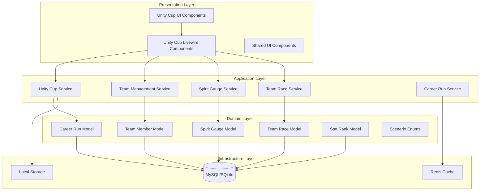
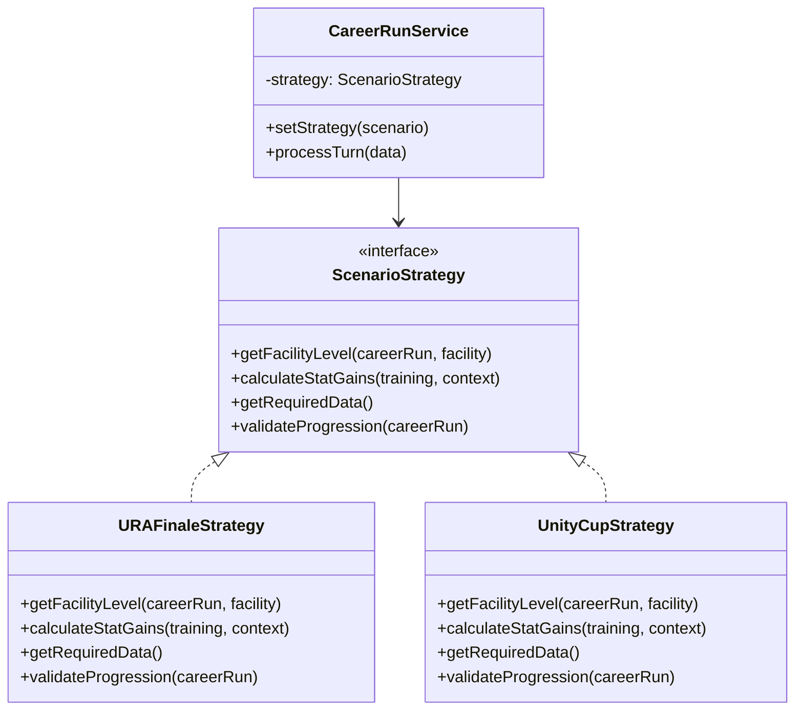

# Design Document: Unity Cup Scenario Support

## Overview

This design document specifies the technical implementation for Unity Cup scenario support in the Umamusume Career Planner. Unity Cup introduces team-based mechanics that fundamentally differ from the existing URA Finale scenario, requiring new data models, business logic, and UI components.

### Key Design Principles

1. **Scenario Polymorphism**: Support multiple scenario types (URA Finale, Unity Cup) with shared interfaces and scenario-specific implementations
2. **Team-Centric Data Model**: Extend the existing character and career run models to support team composition and team member progression
3. **Resource Management**: Implement Spirit Gauge tracking as a turn-by-turn resource management system
4. **Rank-Based Progression**: Replace usage-based facility progression with Team Rank-based progression for Unity Cup
5. **Backward Compatibility**: Ensure existing URA Finale functionality remains unchanged and fully functional

### Scope

**In Scope:**

- Unity Cup scenario selection and initialization
- Team member selection and management (5 members)
- Spirit Gauge tracking and Spirit Burst activation
- Team Rank and Stat Rank progression systems
- Team race scheduling, assignment, and results tracking
- Unity Training identification and tracking
- Facility level calculation based on Team Rank
- Unity Cup-specific UI components
- Import/export with Unity Cup data
- AI advisory integration for Unity Cup strategy

**Out of Scope:**

- Modifications to URA Finale scenario logic
- Multiplayer or competitive Unity Cup features
- Real-time synchronization with game state
- Automated OCR for Unity Cup-specific UI elements (future enhancement)
- Advanced team composition optimization algorithms (future enhancement)

## Architecture

### High-Level Architecture



### Scenario Type Strategy Pattern

Unity Cup and URA Finale scenarios will use a strategy pattern to handle scenario-specific logic:



## Components and Interfaces

### 1. Scenario Type Enum

```php
enum ScenarioType: string
{
    case URA_FINALE = 'ura_finale';
    case UNITY_CUP = 'unity_cup';
    
    public function getDisplayName(): string
    {
        return match($this) {
            self::URA_FINALE => 'URA Finale',
            self::UNITY_CUP => 'Unity Cup',
        };
    }
    
    public function getStrategy(): ScenarioStrategy
    {
        return match($this) {
            self::URA_FINALE => new URAFinaleStrategy(),
            self::UNITY_CUP => new UnityCupStrategy(),
        };
    }
}
```

### 2. Team Rank Enum

```php
enum TeamRank: string
{
    case F = 'F';
    case G = 'G';
    case E = 'E';
    case D = 'D';
    case C = 'C';
    case B = 'B';
    case A = 'A';
    case S = 'S';
    
    public function getFacilityLevel(): int
    {
        return match($this) {
            self::F, self::G => 1,
            self::E, self::D => 2,
            self::C, self::B => 3,
            self::A => 4,
            self::S => 5,
        };
    }
    
    public function getNumericValue(): int
    {
        return match($this) {
            self::F => 1,
            self::G => 2,
            self::E => 3,
            self::D => 4,
            self::C => 5,
            self::B => 6,
            self::A => 7,
            self::S => 8,
        };
    }
}
```

### 3. Race Distance Type Enum

```php
enum RaceDistanceType: string
{
    case SPRINT = 'sprint';
    case MILE = 'mile';
    case MEDIUM = 'medium';
    case LONG = 'long';
    case DIRT = 'dirt';
    
    public function getDisplayName(): string
    {
        return match($this) {
            self::SPRINT => 'Sprint',
            self::MILE => 'Mile',
            self::MEDIUM => 'Medium',
            self::LONG => 'Long',
            self::DIRT => 'Dirt',
        };
    }
}
```

### 4. Unity Cup Service

```php
class UnityCupService
{
    public function __construct(
        private TeamManagementService $teamService,
        private SpiritGaugeService $spiritService,
        private TeamRaceService $raceService,
    ) {}
    
    /**
     * Initialize a new Unity Cup career run with team composition
     */
    public function initializeCareerRun(
        CareerRun $careerRun,
        array $teamMemberIds
    ): void;
    
    /**
     * Get current facility levels based on Team Rank
     */
    public function getFacilityLevels(CareerRun $careerRun): array;
    
    /**
     * Update Team Rank and recalculate facility levels
     */
    public function updateTeamRank(
        CareerRun $careerRun,
        TeamRank $newRank
    ): void;
    
    /**
     * Check if career run is ready for final Unity Cup
     */
    public function isReadyForFinalCup(CareerRun $careerRun): bool;
    
    /**
     * Process final Unity Cup results
     */
    public function processFinalCup(
        CareerRun $careerRun,
        array $raceResults
    ): bool;
    
    /**
     * Get Unity Cup progression summary
     */
    public function getProgressionSummary(CareerRun $careerRun): array;
}
```

### 5. Team Management Service

```php
class TeamManagementService
{
    /**
     * Validate team member selection
     */
    public function validateTeamSelection(
        int $traineeId,
        array $teamMemberIds
    ): ValidationResult;
    
    /**
     * Create team member associations for career run
     */
    public function createTeamMembers(
        CareerRun $careerRun,
        array $characterIds
    ): Collection;
    
    /**
     * Get team member with current stats and ranks
     */
    public function getTeamMemberDetails(int $teamMemberId): array;
    
    /**
     * Update stat ranks for team member
     */
    public function updateStatRanks(
        int $teamMemberId,
        array $statRanks
    ): void;
    
    /**
     * Get team composition summary
     */
    public function getTeamSummary(CareerRun $careerRun): array;
    
    /**
     * Recommend team race assignments based on aptitudes
     */
    public function recommendRaceAssignments(
        Collection $teamMembers
    ): array;
}
```

### 6. Spirit Gauge Service

```php
class SpiritGaugeService
{
    /**
     * Initialize Spirit Gauges for all team members
     */
    public function initializeGauges(CareerRun $careerRun): void;
    
    /**
     * Update Spirit Gauge value for team member
     */
    public function updateGauge(
        int $teamMemberId,
        int $turnNumber,
        float $gaugeValue
    ): void;
    
    /**
     * Get current Spirit Gauge levels for all team members
     */
    public function getCurrentGauges(CareerRun $careerRun): array;
    
    /**
     * Check if Spirit Burst is available for team member
     */
    public function isSpiritBurstAvailable(int $teamMemberId): bool;
    
    /**
     * Activate Spirit Burst and reset gauge
     */
    public function activateSpiritBurst(
        int $teamMemberId,
        int $turnNumber,
        array $statGains
    ): void;
    
    /**
     * Get Spirit Burst activation history
     */
    public function getSpiritBurstHistory(CareerRun $careerRun): Collection;
}
```

### 7. Team Race Service

```php
class TeamRaceService
{
    /**
     * Get scheduled team races for career run
     */
    public function getScheduledRaces(CareerRun $careerRun): Collection;
    
    /**
     * Create team race event
     */
    public function createTeamRace(
        CareerRun $careerRun,
        int $turnNumber,
        bool $isFinalCup = false
    ): TeamRace;
    
    /**
     * Assign team members to race slots
     */
    public function assignTeamMembers(
        TeamRace $teamRace,
        array $assignments
    ): void;
    
    /**
     * Validate race assignments
     */
    public function validateAssignments(array $assignments): ValidationResult;
    
    /**
     * Record race results and apply stat bonuses
     */
    public function recordResults(
        TeamRace $teamRace,
        array $results
    ): void;
    
    /**
     * Calculate stat bonuses from race results
     */
    public function calculateStatBonuses(array $results): array;
    
    /**
     * Check if Team Zenith was defeated
     */
    public function isTeamZenithDefeated(TeamRace $teamRace): bool;
}
```

## Data Models

### 1. Career Run Model Extension

```php
// Add to existing CareerRun model
class CareerRun extends Model
{
    protected $fillable = [
        // ... existing fields
        'scenario_type',
        'team_rank',
    ];
    
    protected $casts = [
        // ... existing casts
        'scenario_type' => ScenarioType::class,
        'team_rank' => TeamRank::class,
    ];
    
    public function teamMembers(): HasMany
    {
        return $this->hasMany(TeamMember::class);
    }
    
    public function teamRaces(): HasMany
    {
        return $this->hasMany(TeamRace::class);
    }
    
    public function isUnityCup(): bool
    {
        return $this->scenario_type === ScenarioType::UNITY_CUP;
    }
    
    public function getFacilityLevel(string $facility): int
    {
        return $this->scenario_type
            ->getStrategy()
            ->getFacilityLevel($this, $facility);
    }
}
```

### 2. Team Member Model

```php
class TeamMember extends Model
{
    protected $fillable = [
        'career_run_id',
        'character_id',
        'position',
    ];
    
    public function careerRun(): BelongsTo
    {
        return $this->belongsTo(CareerRun::class);
    }
    
    public function character(): BelongsTo
    {
        return $this->belongsTo(Character::class);
    }
    
    public function spiritGauges(): HasMany
    {
        return $this->hasMany(SpiritGauge::class);
    }
    
    public function statRanks(): HasMany
    {
        return $this->hasMany(StatRank::class);
    }
    
    public function raceAssignments(): HasMany
    {
        return $this->hasMany(TeamRaceAssignment::class);
    }
    
    public function getCurrentSpiritGauge(): ?float
    {
        return $this->spiritGauges()
            ->latest('turn_number')
            ->value('gauge_value');
    }
    
    public function getCurrentStatRanks(): Collection
    {
        return $this->statRanks()
            ->where('turn_number', $this->careerRun->current_turn)
            ->get();
    }
}
```

### 3. Spirit Gauge Model

```php
class SpiritGauge extends Model
{
    protected $fillable = [
        'team_member_id',
        'turn_number',
        'gauge_value',
        'spirit_burst_activated',
        'stat_gains',
    ];
    
    protected $casts = [
        'gauge_value' => 'float',
        'spirit_burst_activated' => 'boolean',
        'stat_gains' => 'array',
    ];
    
    public function teamMember(): BelongsTo
    {
        return $this->belongsTo(TeamMember::class);
    }
    
    public function isFull(): bool
    {
        return $this->gauge_value >= 100.0;
    }
    
    public function canActivateSpiritBurst(): bool
    {
        return $this->isFull() && !$this->spirit_burst_activated;
    }
}
```

### 4. Team Race Model

```php
class TeamRace extends Model
{
    protected $fillable = [
        'career_run_id',
        'turn_number',
        'is_final_cup',
        'is_completed',
        'races_won',
        'races_lost',
        'defeated_team_zenith',
    ];
    
    protected $casts = [
        'is_final_cup' => 'boolean',
        'is_completed' => 'boolean',
        'defeated_team_zenith' => 'boolean',
    ];
    
    public function careerRun(): BelongsTo
    {
        return $this->belongsTo(CareerRun::class);
    }
    
    public function assignments(): HasMany
    {
        return $this->hasMany(TeamRaceAssignment::class);
    }
    
    public function isVictorious(): bool
    {
        return $this->races_won >= 3;
    }
    
    public function getTotalStatBonus(): int
    {
        return ($this->races_won * 50) + ($this->races_lost * 10);
    }
}
```

### 5. Team Race Assignment Model

```php
class TeamRaceAssignment extends Model
{
    protected $fillable = [
        'team_race_id',
        'team_member_id',
        'race_distance_type',
        'result',
        'stat_bonus_applied',
    ];
    
    protected $casts = [
        'race_distance_type' => RaceDistanceType::class,
        'result' => 'boolean', // true = win, false = loss
        'stat_bonus_applied' => 'integer',
    ];
    
    public function teamRace(): BelongsTo
    {
        return $this->belongsTo(TeamRace::class);
    }
    
    public function teamMember(): BelongsTo
    {
        return $this->belongsTo(TeamMember::class);
    }
}
```

### 6. Stat Rank Model

```php
class StatRank extends Model
{
    protected $fillable = [
        'team_member_id',
        'turn_number',
        'speed_rank',
        'stamina_rank',
        'power_rank',
        'guts_rank',
        'wit_rank',
    ];
    
    protected $casts = [
        'speed_rank' => TeamRank::class,
        'stamina_rank' => TeamRank::class,
        'power_rank' => TeamRank::class,
        'guts_rank' => TeamRank::class,
        'wit_rank' => TeamRank::class,
    ];
    
    public function teamMember(): BelongsTo
    {
        return $this->belongsTo(TeamMember::class);
    }
    
    public function getRankForStat(string $stat): TeamRank
    {
        return $this->{$stat . '_rank'};
    }
    
    public function getAverageRankValue(): float
    {
        $ranks = [
            $this->speed_rank,
            $this->stamina_rank,
            $this->power_rank,
            $this->guts_rank,
            $this->wit_rank,
        ];
        
        $sum = array_sum(array_map(
            fn($rank) => $rank->getNumericValue(),
            $ranks
        ));
        
        return $sum / 5;
    }
}
```

### 7. Turn Progress Extension

```php
// Add to existing StatProgress model
class StatProgress extends Model
{
    protected $fillable = [
        // ... existing fields
        'unity_training_activated',
        'unity_burst_activated',
        'spirit_burst_team_member_id',
    ];
    
    protected $casts = [
        // ... existing casts
        'unity_training_activated' => 'boolean',
        'unity_burst_activated' => 'boolean',
    ];
    
    public function spiritBurstTeamMember(): BelongsTo
    {
        return $this->belongsTo(TeamMember::class, 'spirit_burst_team_member_id');
    }
}
```

### Database Schema

```sql
-- Add columns to career_runs table
ALTER TABLE career_runs 
ADD COLUMN scenario_type VARCHAR(20) DEFAULT 'ura_finale',
ADD COLUMN team_rank VARCHAR(1) NULL,
ADD INDEX idx_scenario_type (scenario_type);

-- Team members table
CREATE TABLE team_members (
    id BIGINT UNSIGNED AUTO_INCREMENT PRIMARY KEY,
    career_run_id BIGINT UNSIGNED NOT NULL,
    character_id BIGINT UNSIGNED NOT NULL,
    position TINYINT UNSIGNED NOT NULL,
    created_at TIMESTAMP NULL,
    updated_at TIMESTAMP NULL,
    FOREIGN KEY (career_run_id) REFERENCES career_runs(id) ON DELETE CASCADE,
    FOREIGN KEY (character_id) REFERENCES characters(id),
    INDEX idx_career_run (career_run_id),
    UNIQUE KEY unique_position (career_run_id, position)
);

-- Spirit gauges table
CREATE TABLE spirit_gauges (
    id BIGINT UNSIGNED AUTO_INCREMENT PRIMARY KEY,
    team_member_id BIGINT UNSIGNED NOT NULL,
    turn_number TINYINT UNSIGNED NOT NULL,
    gauge_value DECIMAL(5,2) NOT NULL DEFAULT 0.00,
    spirit_burst_activated BOOLEAN DEFAULT FALSE,
    stat_gains JSON NULL,
    created_at TIMESTAMP NULL,
    updated_at TIMESTAMP NULL,
    FOREIGN KEY (team_member_id) REFERENCES team_members(id) ON DELETE CASCADE,
    INDEX idx_team_member_turn (team_member_id, turn_number),
    CHECK (gauge_value >= 0 AND gauge_value <= 100)
);

-- Team races table
CREATE TABLE team_races (
    id BIGINT UNSIGNED AUTO_INCREMENT PRIMARY KEY,
    career_run_id BIGINT UNSIGNED NOT NULL,
    turn_number TINYINT UNSIGNED NOT NULL,
    is_final_cup BOOLEAN DEFAULT FALSE,
    is_completed BOOLEAN DEFAULT FALSE,
    races_won TINYINT UNSIGNED DEFAULT 0,
    races_lost TINYINT UNSIGNED DEFAULT 0,
    defeated_team_zenith BOOLEAN DEFAULT FALSE,
    created_at TIMESTAMP NULL,
    updated_at TIMESTAMP NULL,
    FOREIGN KEY (career_run_id) REFERENCES career_runs(id) ON DELETE CASCADE,
    INDEX idx_career_run (career_run_id),
    CHECK (races_won + races_lost <= 5)
);

-- Team race assignments table
CREATE TABLE team_race_assignments (
    id BIGINT UNSIGNED AUTO_INCREMENT PRIMARY KEY,
    team_race_id BIGINT UNSIGNED NOT NULL,
    team_member_id BIGINT UNSIGNED NOT NULL,
    race_distance_type VARCHAR(20) NOT NULL,
    result BOOLEAN NULL,
    stat_bonus_applied INT DEFAULT 0,
    created_at TIMESTAMP NULL,
    updated_at TIMESTAMP NULL,
    FOREIGN KEY (team_race_id) REFERENCES team_races(id) ON DELETE CASCADE,
    FOREIGN KEY (team_member_id) REFERENCES team_members(id),
    INDEX idx_team_race (team_race_id),
    UNIQUE KEY unique_assignment (team_race_id, race_distance_type)
);

-- Stat ranks table
CREATE TABLE stat_ranks (
    id BIGINT UNSIGNED AUTO_INCREMENT PRIMARY KEY,
    team_member_id BIGINT UNSIGNED NOT NULL,
    turn_number TINYINT UNSIGNED NOT NULL,
    speed_rank VARCHAR(1) NOT NULL,
    stamina_rank VARCHAR(1) NOT NULL,
    power_rank VARCHAR(1) NOT NULL,
    guts_rank VARCHAR(1) NOT NULL,
    wit_rank VARCHAR(1) NOT NULL,
    created_at TIMESTAMP NULL,
    updated_at TIMESTAMP NULL,
    FOREIGN KEY (team_member_id) REFERENCES team_members(id) ON DELETE CASCADE,
    INDEX idx_team_member_turn (team_member_id, turn_number)
);

-- Add columns to stat_progress table
ALTER TABLE stat_progress
ADD COLUMN unity_training_activated BOOLEAN DEFAULT FALSE,
ADD COLUMN unity_burst_activated BOOLEAN DEFAULT FALSE,
ADD COLUMN spirit_burst_team_member_id BIGINT UNSIGNED NULL,
ADD FOREIGN KEY (spirit_burst_team_member_id) REFERENCES team_members(id);
```

## Correctness Properties

*A property is a characteristic or behavior that should hold true across all valid executions of a system—essentially, a formal statement about what the system should do. Properties serve as the bridge between human-readable specifications and machine-verifiable correctness guarantees.*

### Property 1: Unity Cup Initialization Completeness

*For any* Unity Cup career run creation, initializing the career run should create all required data structures: exactly 5 team members, Spirit Gauges at 0% for each team member, Stat Ranks initialized for all 5 stats per team member, and Team Rank set to a valid initial value.

**Validates: Requirements 1.2, 2.3, 2.4**

### Property 2: Scenario Type Persistence

*For any* career run with a selected scenario type, saving and reloading the career run should preserve the scenario type value unchanged.

**Validates: Requirements 1.5**

### Property 3: Team Member Count Validation

*For any* Unity Cup career run, the system should reject team member selections that do not contain exactly 5 members, and should reject selections where the trainee character is included as a team member.

**Validates: Requirements 2.1, 2.5**

### Property 4: Spirit Gauge Range Invariant

*For any* Spirit Gauge value at any point in time, the value should be within the range 0-100% inclusive.

**Validates: Requirements 4.1, 17.2**

### Property 5: Spirit Gauge Visualization Completeness

*For any* team member display, the rendered output should include Spirit Gauge visualization (progress bar or percentage), and when the gauge is at 100%, should include a visual indicator that Spirit Burst is available.

**Validates: Requirements 4.2, 4.4, 4.6**

### Property 6: Spirit Burst State Transition

*For any* Spirit Burst activation, the team member's Spirit Gauge should transition from 100% to 0%, and the activation should be recorded in the turn-by-turn progression history.

**Validates: Requirements 5.4, 5.5**

### Property 7: Spirit Burst Stat Gain Ranges

*For any* Spirit Burst activation, the stat gains applied to participating team members should be at least 150, and the stat gains applied to the trainee should be between 15 and 50 inclusive.

**Validates: Requirements 5.2, 5.3**

### Property 8: Team Race Scheduling

*For any* Unity Cup career run, when the turn number reaches Late December (turn 36) or Late June (turn 60), a team race event should be created with exactly 5 race slots (Sprint, Mile, Medium, Long, Dirt).

**Validates: Requirements 3.1, 3.2**

### Property 9: Team Race Assignment Uniqueness

*For any* team race assignment, each of the 5 team members should be assigned to exactly one race slot, with no team member assigned to multiple slots and no race slot left unassigned.

**Validates: Requirements 3.3, 17.5**

### Property 10: Team Race Stat Bonus Calculation

*For any* completed team race, the total stat bonus should equal (races_won × 50) + (races_lost × 10), where races_won + races_lost = 5.

**Validates: Requirements 3.5, 3.6**

### Property 11: Team Rank to Facility Level Mapping

*For any* Unity Cup career run with a Team Rank value, all facility levels should match the defined mapping: F/G→1, D/E→2, B/C→3, A→4, S→5, and when Team Rank changes, all facility level displays should immediately reflect the new mapping.

**Validates: Requirements 7.2, 7.4, 9.1, 9.2, 17.6**

### Property 12: Team Rank Validity

*For any* Team Rank value in the system, the value should be one of the valid grades: F, G, E, D, C, B, A, or S.

**Validates: Requirements 7.1, 17.3**

### Property 13: Stat Rank Validity

*For any* team member at any turn, each of the five Stat Ranks (Speed, Stamina, Power, Guts, Wit) should be one of the valid grades: F, G, E, D, C, B, A, or S.

**Validates: Requirements 8.1, 17.4**

### Property 14: Stat Rank Display Completeness

*For any* team member display, the rendered output should include all five Stat Ranks (Speed, Stamina, Power, Guts, Wit) with visual grade indicators.

**Validates: Requirements 8.3**

### Property 15: Final Unity Cup Victory Condition

*For any* final Unity Cup team race, the career run should be marked as successfully completed if and only if at least 3 of the 5 races were won, and should be marked as failed otherwise.

**Validates: Requirements 3.8, 10.2, 10.3, 10.4**

### Property 16: Turn Data Completeness

*For any* turn recording in a Unity Cup career run, the persisted data should include Spirit Gauge levels for all 5 team members, current Team Rank, Stat Ranks for all team members, and activation flags for Unity Training and Spirit Burst.

**Validates: Requirements 11.1, 11.2, 11.3, 11.4**

### Property 17: Unity Cup Data Round-Trip Integrity

*For any* Unity Cup career run, exporting the run to JSON or CSV format and then importing it back should produce a career run with identical team composition, Spirit Gauge history, Team Rank progression, Stat Rank progression, and team race results.

**Validates: Requirements 13.1, 13.3, 4.5, 5.5, 6.6, 7.5, 8.4, 11.5**

### Property 18: Import Format Detection

*For any* import file containing Unity Cup scenario indicators (team_members array, spirit_gauges data, team_rank field), the system should route the import to the Unity Cup import handler rather than the URA Finale handler.

**Validates: Requirements 13.5**

### Property 19: Import Validation Error Clarity

*For any* Unity Cup import that fails validation (missing required fields, invalid enum values, constraint violations), the system should provide an error message that identifies the specific field, the validation rule violated, and guidance on how to correct the issue.

**Validates: Requirements 13.6, 17.8**

### Property 20: Scenario Data Isolation

*For any* URA Finale career run, Unity Cup-specific features (Team Rank-based facility levels, Spirit Gauges, team member associations) should not affect the run's data or behavior, and facility levels should continue to be determined by usage count.

**Validates: Requirements 16.1, 16.5, 16.6**

### Property 21: Scenario Type Filtering

*For any* career run list filtered by scenario type, all returned runs should have the specified scenario type, and runs of other scenario types should be excluded.

**Validates: Requirements 16.2**

### Property 22: Facility Level Manual Adjustment Prevention

*For any* Unity Cup career run, attempts to manually adjust facility levels should be rejected, as facility levels are derived from Team Rank.

**Validates: Requirements 9.7**

### Property 23: Training Prediction Facility Level Consistency

*For any* training prediction in Unity Cup mode, the stat gain calculations should use facility levels derived from the current Team Rank according to the defined mapping, not usage-based levels.

**Validates: Requirements 9.6**

### Property 24: Unity Training Impact Recording

*For any* Unity Training activation, the system should record the activation in turn-by-turn history and apply boosts to team member stats and Team Rank progression.

**Validates: Requirements 6.2, 6.4**

### Property 25: Accessibility Compliance

*For all* Unity Cup UI components, automated accessibility testing should confirm WCAG 2.2 AA compliance including keyboard navigation support, screen reader announcements for state changes, sufficient color contrast in both light and dark modes, and touch targets meeting minimum size requirements (44x44px).

**Validates: Requirements 14.7, 20.1, 20.2, 20.3, 20.4, 20.7**

### Property 26: Alt Text Completeness

*For any* Unity Cup-specific icon or visual indicator, the element should have descriptive alt text that conveys the meaning of the visual element to screen reader users.

**Validates: Requirements 20.6**

### Property 27: Scenario Conversion Prevention

*For any* URA Finale career run, attempts to convert it to Unity Cup format should be rejected with a clear error message explaining that scenario conversion is not supported.

**Validates: Requirements 16.3**

### Property 28: Team Race Result Completeness

*For any* final Unity Cup team race, the recorded results should include win/loss status for all 5 race slots (Sprint, Mile, Medium, Long, Dirt).

**Validates: Requirements 17.7**

### Property 29: Default Scenario Selection

*For any* user creating a new career run, the scenario type selector should default to the scenario type of the user's most recently created career run, or to URA Finale if no previous runs exist.

**Validates: Requirements 16.7**

### Property 30: Spirit Burst Opportunity Indication

*For any* training prediction where at least one team member has a Spirit Gauge at 100% and is present at the training facility, the prediction should include an indicator that Spirit Burst is available.

**Validates: Requirements 5.6**

### Property 31: Unity Training Prioritization

*For any* set of training recommendations that includes Unity Training opportunities, the Unity Training options should be ranked higher in priority than non-Unity Training options.

**Validates: Requirements 6.5**

## Error Handling

### Error Categories

1. **Validation Errors**: Invalid data input (team member count, gauge values, rank values)
2. **Business Rule Violations**: Scenario-specific constraints (team race assignments, victory conditions)
3. **Data Integrity Errors**: Inconsistent state (missing team members, orphaned Spirit Gauges)
4. **Import/Export Errors**: Format detection failures, schema mismatches, data corruption

### Error Handling Strategy

```php
class UnityCupValidationException extends Exception
{
    public function __construct(
        public readonly string $field,
        public readonly string $rule,
        public readonly string $guidance,
        string $message = '',
    ) {
        parent::__construct($message);
    }
    
    public function toArray(): array
    {
        return [
            'field' => $this->field,
            'rule' => $this->rule,
            'guidance' => $this->guidance,
            'message' => $this->getMessage(),
        ];
    }
}
```

### Validation Rules

```php
class UnityCupValidator
{
    public function validateTeamSelection(array $teamMemberIds, int $traineeId): void
    {
        if (count($teamMemberIds) !== 5) {
            throw new UnityCupValidationException(
                field: 'team_members',
                rule: 'exactly_5_required',
                guidance: 'Unity Cup requires exactly 5 team members. Please select ' . (5 - count($teamMemberIds)) . ' more.',
                message: 'Team must have exactly 5 members'
            );
        }
        
        if (in_array($traineeId, $teamMemberIds)) {
            throw new UnityCupValidationException(
                field: 'team_members',
                rule: 'trainee_excluded',
                guidance: 'The trainee character cannot be selected as a team member.',
                message: 'Trainee cannot be a team member'
            );
        }
    }
    
    public function validateSpiritGauge(float $value): void
    {
        if ($value < 0 || $value > 100) {
            throw new UnityCupValidationException(
                field: 'spirit_gauge',
                rule: 'range_0_100',
                guidance: 'Spirit Gauge must be between 0% and 100%. Please enter a valid percentage.',
                message: 'Spirit Gauge out of range'
            );
        }
    }
    
    public function validateTeamRank(string $rank): void
    {
        if (!TeamRank::tryFrom($rank)) {
            throw new UnityCupValidationException(
                field: 'team_rank',
                rule: 'valid_grade',
                guidance: 'Team Rank must be one of: F, G, E, D, C, B, A, S',
                message: 'Invalid Team Rank'
            );
        }
    }
    
    public function validateRaceAssignments(array $assignments): void
    {
        $teamMemberIds = array_column($assignments, 'team_member_id');
        
        if (count($teamMemberIds) !== 5) {
            throw new UnityCupValidationException(
                field: 'race_assignments',
                rule: 'all_slots_filled',
                guidance: 'All 5 race slots must be assigned. Missing: ' . (5 - count($teamMemberIds)),
                message: 'Incomplete race assignments'
            );
        }
        
        if (count($teamMemberIds) !== count(array_unique($teamMemberIds))) {
            throw new UnityCupValidationException(
                field: 'race_assignments',
                rule: 'no_duplicates',
                guidance: 'Each team member can only be assigned to one race.',
                message: 'Duplicate team member assignments'
            );
        }
    }
}
```

### Graceful Degradation

- **Missing Team Members**: Display warning, allow viewing but prevent turn progression
- **Incomplete Spirit Gauge Data**: Use last known values, flag for user correction
- **Invalid Team Rank**: Prevent facility level calculation, prompt for correction
- **Import Failures**: Provide detailed error report, allow partial import with warnings

## Testing Strategy

### Dual Testing Approach

This feature requires both unit tests and property-based tests to ensure comprehensive coverage:

- **Unit tests**: Verify specific examples, edge cases, and error conditions
- **Property tests**: Verify universal properties across all inputs

### Unit Testing Focus Areas

1. **Scenario Selection**: Test UI rendering for both scenario types
2. **Team Member Selection**: Test selection workflow, validation messages
3. **Spirit Gauge Updates**: Test manual adjustments, boundary values
4. **Team Race Creation**: Test scheduling at specific turns
5. **Final Unity Cup**: Test victory/defeat outcomes
6. **Import/Export**: Test specific file formats, error cases
7. **UI Components**: Test component rendering, accessibility features

### Property-Based Testing Configuration

All property tests should:

- Run minimum 100 iterations per test
- Use the project's property-based testing library (Pest with appropriate plugins)
- Tag each test with a comment referencing the design property
- Tag format: `// Feature: unity-cup-scenario, Property {number}: {property_text}`

### Property Test Examples

```php
// Feature: unity-cup-scenario, Property 1: Unity Cup Initialization Completeness
it('initializes all required Unity Cup data structures', function () {
    // Generate random trainee and team member IDs
    $traineeId = fake()->numberBetween(1, 100);
    $teamMemberIds = fake()->randomElements(range(1, 100), 5);
    
    $careerRun = CareerRun::factory()->create([
        'character_id' => $traineeId,
        'scenario_type' => ScenarioType::UNITY_CUP,
    ]);
    
    $unityCupService = app(UnityCupService::class);
    $unityCupService->initializeCareerRun($careerRun, $teamMemberIds);
    
    // Verify team members created
    expect($careerRun->teamMembers)->toHaveCount(5);
    
    // Verify Spirit Gauges initialized
    foreach ($careerRun->teamMembers as $member) {
        expect($member->getCurrentSpiritGauge())->toBe(0.0);
    }
    
    // Verify Stat Ranks initialized
    foreach ($careerRun->teamMembers as $member) {
        $statRanks = $member->getCurrentStatRanks();
        expect($statRanks)->toHaveCount(5);
    }
    
    // Verify Team Rank set
    expect($careerRun->team_rank)->toBeInstanceOf(TeamRank::class);
})->repeat(100);

// Feature: unity-cup-scenario, Property 4: Spirit Gauge Range Invariant
it('maintains Spirit Gauge values within 0-100% range', function () {
    $teamMember = TeamMember::factory()->create();
    $spiritService = app(SpiritGaugeService::class);
    
    // Generate random gauge value
    $gaugeValue = fake()->randomFloat(2, -50, 150);
    
    if ($gaugeValue < 0 || $gaugeValue > 100) {
        expect(fn() => $spiritService->updateGauge(
            $teamMember->id,
            1,
            $gaugeValue
        ))->toThrow(UnityCupValidationException::class);
    } else {
        $spiritService->updateGauge($teamMember->id, 1, $gaugeValue);
        expect($teamMember->getCurrentSpiritGauge())->toBe($gaugeValue);
    }
})->repeat(100);

// Feature: unity-cup-scenario, Property 11: Team Rank to Facility Level Mapping
it('maps Team Rank to facility levels correctly', function () {
    $teamRanks = [
        TeamRank::F, TeamRank::G, TeamRank::E, TeamRank::D,
        TeamRank::C, TeamRank::B, TeamRank::A, TeamRank::S,
    ];
    
    $expectedLevels = [1, 1, 2, 2, 3, 3, 4, 5];
    
    foreach ($teamRanks as $index => $rank) {
        $careerRun = CareerRun::factory()->create([
            'scenario_type' => ScenarioType::UNITY_CUP,
            'team_rank' => $rank,
        ]);
        
        $facilityLevel = $careerRun->getFacilityLevel('speed');
        expect($facilityLevel)->toBe($expectedLevels[$index]);
    }
})->repeat(100);

// Feature: unity-cup-scenario, Property 17: Unity Cup Data Round-Trip Integrity
it('preserves all Unity Cup data through export and import', function () {
    // Create a complete Unity Cup career run
    $careerRun = CareerRun::factory()
        ->unityCup()
        ->withTeamMembers(5)
        ->withSpiritGauges()
        ->withTeamRaces()
        ->create();
    
    $exportService = app(ExportService::class);
    $importService = app(ImportService::class);
    
    // Export to JSON
    $exportedData = $exportService->exportCareerRun($careerRun, 'json');
    
    // Import back
    $importedRun = $importService->importCareerRun($exportedData);
    
    // Verify team composition
    expect($importedRun->teamMembers)->toHaveCount($careerRun->teamMembers->count());
    
    // Verify Spirit Gauge history
    foreach ($importedRun->teamMembers as $index => $member) {
        $originalMember = $careerRun->teamMembers[$index];
        expect($member->spiritGauges->count())
            ->toBe($originalMember->spiritGauges->count());
    }
    
    // Verify Team Rank
    expect($importedRun->team_rank)->toBe($careerRun->team_rank);
    
    // Verify team race results
    expect($importedRun->teamRaces->count())
        ->toBe($careerRun->teamRaces->count());
})->repeat(100);
```

### Browser Testing (Playwright)

```javascript
// Test Unity Cup scenario selection and initialization
test('creates Unity Cup career run with team selection', async ({ page }) => {
  await page.goto('/career-runs/create');
  
  // Select Unity Cup scenario
  await page.click('[data-scenario="unity-cup"]');
  
  // Select trainee
  await page.selectOption('[name="character_id"]', '1');
  
  // Select 5 team members
  for (let i = 0; i < 5; i++) {
    await page.click(`[data-team-member="${i + 2}"]`);
  }
  
  // Submit form
  await page.click('button[type="submit"]');
  
  // Verify redirect to career run page
  await expect(page).toHaveURL(/\/career-runs\/\d+/);
  
  // Verify Unity Cup badge displayed
  await expect(page.locator('[data-scenario-badge="unity-cup"]')).toBeVisible();
  
  // Verify team members displayed
  await expect(page.locator('[data-team-member]')).toHaveCount(5);
  
  // Verify Spirit Gauges displayed
  await expect(page.locator('[data-spirit-gauge]')).toHaveCount(5);
});

// Test Spirit Burst activation
test('activates Spirit Burst when gauge is full', async ({ page }) => {
  // Navigate to career run with full Spirit Gauge
  await page.goto('/career-runs/1/turn/10');
  
  // Verify Spirit Burst available indicator
  await expect(page.locator('[data-spirit-burst-available="true"]')).toBeVisible();
  
  // Click Spirit Burst activation
  await page.click('[data-action="activate-spirit-burst"]');
  
  // Verify gauge reset to 0%
  await expect(page.locator('[data-spirit-gauge-value]')).toHaveText('0%');
  
  // Verify stat gains recorded
  await expect(page.locator('[data-stat-gain-source="spirit-burst"]')).toBeVisible();
});

// Test Team Rank to facility level mapping
test('updates facility levels when Team Rank changes', async ({ page }) => {
  await page.goto('/career-runs/1/turn/20');
  
  // Record current facility levels
  const initialLevel = await page.locator('[data-facility="speed"] [data-level]').textContent();
  
  // Update Team Rank
  await page.selectOption('[name="team_rank"]', 'A');
  await page.click('button[data-action="save-turn"]');
  
  // Verify facility levels updated
  const newLevel = await page.locator('[data-facility="speed"] [data-level]').textContent();
  expect(newLevel).toBe('4');
});
```

### Test Coverage Goals

- **Unit Tests**: >80% code coverage for Unity Cup services and models
- **Property Tests**: All 31 correctness properties implemented
- **Browser Tests**: All critical user workflows covered
- **Accessibility Tests**: All UI components pass automated WCAG 2.2 AA checks

### Continuous Integration

- Run unit tests on every commit
- Run property tests on every pull request
- Run browser tests on staging deployment
- Run accessibility tests weekly and on UI changes

## Implementation Notes

### Migration Strategy

1. **Phase 1**: Add database schema (migrations for new tables and columns)
2. **Phase 2**: Implement domain models and enums
3. **Phase 3**: Implement service layer (Unity Cup, Team Management, Spirit Gauge, Team Race services)
4. **Phase 4**: Implement strategy pattern for scenario-specific logic
5. **Phase 5**: Implement UI components (team selector, Spirit Gauge displays, Team Rank indicators)
6. **Phase 6**: Implement import/export extensions
7. **Phase 7**: Integrate AI advisory for Unity Cup strategy
8. **Phase 8**: Comprehensive testing and accessibility validation

### Backward Compatibility

- Existing URA Finale career runs remain unchanged
- Default scenario type for existing users: URA Finale
- Clear migration path for users to try Unity Cup without affecting existing data
- Export format versioning to support both scenarios

### Performance Considerations

- Eager load team members and Spirit Gauges when loading Unity Cup career runs
- Cache Team Rank to facility level mapping (static data)
- Index foreign keys for team member associations
- Optimize turn-by-turn queries with proper indexing on (career_run_id, turn_number)

### Security Considerations

- Validate team member IDs belong to valid characters
- Prevent unauthorized access to other users' Unity Cup data
- Sanitize all user inputs for Spirit Gauge values, Team Rank, and Stat Ranks
- Rate limit import operations to prevent abuse

### Accessibility Considerations

- All Spirit Gauge progress bars include aria-valuenow, aria-valuemin, aria-valuemax
- Team member selection uses proper checkbox/radio semantics
- Team race assignment interface supports keyboard drag-and-drop alternatives
- Screen reader announcements for Spirit Burst availability and Team Rank changes
- High contrast mode support for all Unity Cup indicators
- Focus management for modal dialogs and slide panels

### Internationalization Considerations

- Externalize all Unity Cup-specific terminology
- Support Japanese character names and skill names
- Locale-aware number formatting for percentages and stat values
- RTL layout support for future language expansion

## Conclusion

This design provides a comprehensive foundation for Unity Cup scenario support while maintaining backward compatibility with URA Finale. The strategy pattern enables clean separation of scenario-specific logic, and the property-based testing approach ensures correctness across all possible inputs. The phased implementation approach allows for incremental delivery and validation at each stage.
