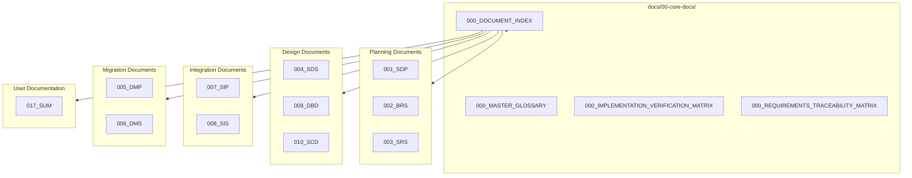
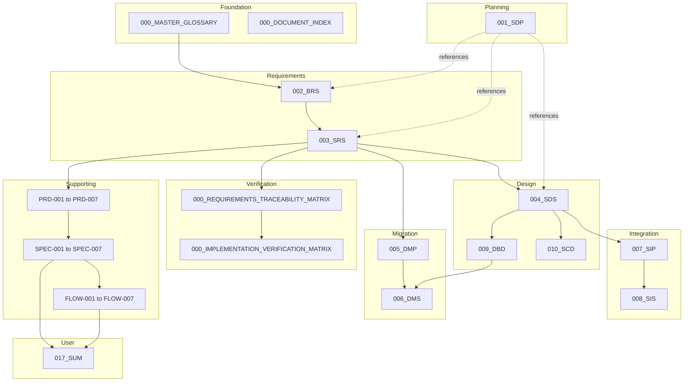

# Documentation Index

## Umamusume Pretty Derby Career Planner

**Document Version**: 5.1.0
**Date**: January 28, 2026
**Project**: UmamusumeCareerPlanner
**Author**: Development Team
**Status**: Current - Aligned to codebase v2.2.0

---

## Table of Contents

1. [Document Overview](#1-document-overview)
2. [Document Catalog](#2-document-catalog)
3. [Document Dependencies](#3-document-dependencies)
4. [Quick Reference Guide](#4-quick-reference-guide)
5. [Archive Structure](#5-archive-structure)
6. [Version Control](#6-version-control)

---

## 1. Document Overview

This index provides a current reference to core documentation in `docs/00-core-docs`, aligned with the v2.0.0 implementation of the Umamusume Pretty Derby Career Planner.

### 1.1 Documentation Structure



- **Core Docs**: Authoritative, implementation-aligned documents in `docs/00-core-docs/`
- **Product/Specs**: Detailed PRDs and specs in `docs/02-prds/` and `docs/02-specs/`
- **Flows/Diagrams**: Supporting diagrams in `docs/01-*` folders
- **Implementation Summaries**: Status and changes in `docs/implementation-summaries/`
- **Archive**: Superseded documents in `docs/archive/`

### 1.2 Documentation Suite Summary

| Category | Documents | Purpose | Status |
| --- | --- | --- | --- |
| Reference | 000_MASTER_GLOSSARY, 000_DOCUMENT_INDEX | Terminology and navigation | Current |
| Planning | 001_SDP | Current development plan and milestones | v2.2.0 |
| Requirements | 002_BRS, 003_SRS | Business and software requirements (current scope) | v2.2.0 |
| Design | 004_SDS | Current technical architecture and design | v2.2.0 |
| Migration | 005_DMP, 006_DMS | Data migration plan and technical specs | v2.2.0 |
| Integration | 007_SIP, 008_SIS | Integration plan and specifications | v2.2.0 |
| Technical | 009_DBD, 010_SCD | Database and source code documentation | v2.2.0 |
| Verification | 000_IMPLEMENTATION_VERIFICATION_MATRIX, 000_REQUIREMENTS_TRACEABILITY_MATRIX | Implementation status and traceability | v2.2.0 |
| User | 017_SUM | End-user manual | v2.2.0 |

### 1.3 Technology Stack Reference

| Layer | Technology | Version | Documentation |
| --- | --- | --- | --- |
| Framework | Laravel | 12+ | 004_SDS, 010_SCD |
| PHP Runtime | PHP | 8.2+ | 004_SDS |
| Frontend Reactivity | Livewire | 3 | 010_SCD |
| Client Interactivity | Alpine.js | Latest | 010_SCD |
| Styling | TailwindCSS | v4 | 004_SDS, 010_SCD |
| Build Tool | Vite | 7 | 004_SDS |
| Database | MySQL/MariaDB/SQLite | 8.0+ | 009_DBD |
| Cache | Redis | 7+ | 004_SDS |
| AI (Local) | Ollama | Latest | 007_SIP, 008_SIS |
| AI (Cloud) | AWS Bedrock | Claude 4.5 | 007_SIP, 008_SIS |

---

## 2. Document Catalog

### 2.1 Reference Documents

#### 000_MASTER_GLOSSARY.md

**Status**: Current  
**Purpose**: Standardized terminology for the system  
**Key Content**: Game terms, technical terms, acronyms, status indicators

#### 000_DOCUMENT_INDEX.md

**Status**: Current  
**Purpose**: This index - navigation hub for all documentation  
**Key Content**: Document catalog, dependencies, quick reference

### 2.2 Planning Documents

#### 001_SDP_Software_Development_Plan.md

**Version**: 2.2.0  
**Status**: Current  
**Purpose**: Current roadmap, phases, and milestones  
**Key Content**:

- Executive summary and objectives
- Development methodology and principles
- System architecture overview
- Phase-based milestone tracking (Phases 1-6)
- Current status: Phases 1-4 complete, Phases 5-6 in progress
- Resource allocation and team structure
- Risk management and quality assurance
- Success criteria and KPIs

**Related Documents**: All core documents

### 2.3 Requirements Documents

#### 002_BRS_Business_Requirements_Specifications.md

**Version**: 2.2.0  
**Status**: Current  
**Purpose**: Business goals and current scope  
**Key Content**:

- Business context and objectives
- Stakeholder analysis
- 12 major business requirement categories (BR-1 through BR-12)
- Business rules and calculation rules
- Success metrics and KPIs
- Constraints and assumptions
- Dependencies and risk factors

**Related Documents**: 003_SRS, PRD-001 through PRD-007

#### 003_SRS_Software_Requirement_Specifications.md

**Version**: 2.2.0  
**Status**: Current  
**Purpose**: Functional and non-functional requirements aligned to the implemented system  
**Key Content**:

- 12 functional requirement categories (FR-01 through FR-12)
- Non-functional requirements (NFR-01 through NFR-07)
  - Performance, Security, Accessibility, Compatibility
  - Maintainability, Responsive Design, Observability
- Interface requirements (UI components, API endpoints)
- Data requirements (entities, validation, retention)
- Traceability matrix linking BRS to FR to SPEC
- Test data requirements

**Related Documents**: 002_BRS, 004_SDS, SPEC-001 through SPEC-007

### 2.4 Design Documents

#### 004_SDS_Software_Design_Specifications.md

**Version**: 2.2.0  
**Status**: Current  
**Purpose**: System architecture and implementation design  
**Key Content**:

- Layered architecture (Presentation, Application, Domain, Infrastructure)
- Component design and hierarchy
- Data models and entity relationships
- Service layer architecture
  - Core services (Character, Career, Training, Race, Skill, Support)
  - AI services (Advisory, Ollama, Bedrock, Router)
  - Integration services (External API, OCR, WebSocket)
  - Data management services (Import, Export, Migration, Backup)
- AI and MCP integration architecture
- OCR pipeline design
- API design patterns
- Data management workflows
- UI/UX design system

**Related Documents**: 003_SRS, 009_DBD, 010_SCD, 007_SIP

#### 009_DBD_Database_Documentation.md

**Version**: 2.2.0  
**Status**: Current  
**Purpose**: Database schema and relationships  
**Key Content**:

- Database configuration (MySQL 8.0+, utf8mb4, `ucp_` prefix)
- Schema catalog with 15+ domain tables
- Entity relationship diagrams (ERD)
- Table definitions with field specifications
- Index strategy and performance optimization
- Data relationships and cascade rules
- Migration strategy and rollback considerations

**Related Documents**: 004_SDS, 003_SRS

#### 010_SCD_Source_Code_Documentation.md

**Version**: 2.2.0  
**Status**: Current  
**Purpose**: Codebase structure and key components  
**Key Content**:

- Project structure and directory organization
- Key namespaces and class catalog
- Service layer implementations with code examples
- AI and MCP integration code architecture
- Frontend code structure (Livewire, Alpine.js)
- API reference and endpoint catalog
- Coding standards (PSR-12, naming conventions)
- Testing strategy (Pest PHP, Playwright)

**Related Documents**: 004_SDS, 009_DBD, 007_SIP

### 2.5 Migration Documents

#### 005_DMP_Data_Migration_Plan.md

**Version**: 2.0.0  
**Status**: Current  
**Purpose**: Migration strategy and procedures  
**Key Content**:

- Migration sources (6 legacy applications, external APIs, OCR)
- Migration targets (current schema v2.0)
- Migration workflow (6-step process)
- Data transformation rules and field mapping
- Conflict resolution strategies
- Validation procedures (3-layer validation)
- Rollback strategy and mechanisms
- Operational considerations (performance, monitoring)

**Related Documents**: 006_DMS, FLOW-001, SEQ-015, TECH-FLOW-007

#### 006_DMS_Data_Migration_Specifications.md

**Version**: 2.0.0  
**Status**: Current  
**Purpose**: Migration technical specifications  
**Key Content**:

- Legacy system analysis and schema mapping
- Field-level transformation specifications
- Migration scripts and batch processing
- Validation rules and error handling
- Performance benchmarks

**Related Documents**: 005_DMP, 009_DBD

### 2.6 Integration Documents

#### 007_SIP_Software_Integration_Plan.md

**Version**: 2.1.0  
**Status**: Current  
**Purpose**: Integration plan for external services and AI components  
**Key Content**:

- Integration targets (AI providers, MCP servers, External APIs, OCR)
- Integration architecture overview
- Integration strategy and phases (5 phases, all complete)
- Integration points for:
  - AI providers (Ollama, AWS Bedrock, Neuron agents)
  - MCP servers (Memory, Filesystem, Fetch)
  - External APIs (umapyoi.net, umamusumedb.com)
  - OCR pipeline (Tesseract + GD)
- Data flow integration patterns
- Integration test environment configuration
- Integration scenarios (fallback, MCP tools, API resilience)
- Sign-off criteria and acceptance checklist

**Related Documents**: 008_SIS, 004_SDS, SPEC-006, SPEC-007

#### 008_SIS_Software_Integration_Specifications.md

**Version**: 2.1.0  
**Status**: Current  
**Purpose**: Integration technical details and specifications  
**Key Content**:

- AI provider integration specifications
  - Hybrid AI configuration (Ollama + Bedrock)
  - Neuron AI agent configuration
  - Provider cost tracking
- MCP integration specifications
  - Server configuration and types
  - MCP service architecture
  - Monitoring integration
- External API integration specifications
  - API client architecture
  - Circuit breaker pattern implementation
  - Data sync workflow
- OCR integration specifications
  - Processing pipeline stages
  - Preprocessing operations
  - Supported data types
- Security and access control
  - Authentication patterns
  - Rate limiting configuration
  - Data sanitization methods
- Service layer architecture diagrams
- Configuration priority and dependency injection

**Related Documents**: 007_SIP, 004_SDS, SPEC-006, SPEC-007

### 2.7 Verification Documents

#### 000_IMPLEMENTATION_VERIFICATION_MATRIX.md

**Status**: Current  
**Purpose**: Implementation status snapshot  
**Key Content**:

- Feature implementation status by module
- Test coverage status
- Known issues and limitations
- Verification checkpoints

**Related Documents**: 000_REQUIREMENTS_TRACEABILITY_MATRIX, 003_SRS

#### 000_REQUIREMENTS_TRACEABILITY_MATRIX.md

**Status**: Current  
**Purpose**: Requirements to implementation traceability  
**Key Content**:

- Business requirements to functional requirements mapping
- Functional requirements to technical specifications mapping
- Requirements to test cases mapping
- Coverage analysis

**Related Documents**: 002_BRS, 003_SRS, SPEC-001 through SPEC-007

### 2.8 User Documents

#### 017_SUM_Software_User_Manual.md

**Version**: 2.0.0  
**Status**: Current  
**Purpose**: User manual and feature walkthroughs  
**Key Content**:

- Introduction and system overview
- Getting started guide with onboarding flow
- Dashboard overview and navigation
- Feature-by-feature user guides:
  - Character Management (creation wizard, dashboard, stats, aptitudes)
  - Career Run Management (stages, turn progression, goals)
  - Training System (selection, predictions, risk assessment, hints)
  - Race Strategy (calendar, preparation, readiness, running styles)
  - Skill Management (shop, hints, evolution, SP tracking)
  - Support Card & Deck Management (collection, deck building, bonds)
  - AI Advisory System (interface, topics, providers)
  - Data Import & Export (formats, workflows, OCR)
- Storage modes (Local vs Account, conversion)
- Settings & preferences
- Troubleshooting guide with common issues
- Keyboard shortcuts reference
- Glossary of game and application terms
- Support & resources

**Related Documents**: All PRDs, All SPECs, All FLOWs, All Wireframes

---

## 3. Document Dependencies

### 3.1 Dependency Graph



### 3.2 Cross-Reference Matrix

| Source | References | Referenced By |
| --- | --- | --- |
| 000_MASTER_GLOSSARY | None | All documents |
| 001_SDP | 002_BRS, 003_SRS, 004_SDS, All PRDs | None |
| 002_BRS | 000_MASTER_GLOSSARY | 003_SRS, PRD-001 to PRD-007 |
| 003_SRS | 002_BRS | 004_SDS, SPEC-001 to SPEC-007, 000_RTM |
| 004_SDS | 003_SRS | 009_DBD, 010_SCD, 007_SIP |
| 005_DMP | 003_SRS, 009_DBD | 006_DMS |
| 006_DMS | 005_DMP, 009_DBD | None |
| 007_SIP | 004_SDS, SPEC-006, SPEC-007 | 008_SIS |
| 008_SIS | 007_SIP, 004_SDS | None |
| 009_DBD | 004_SDS | 005_DMP, 006_DMS |
| 010_SCD | 004_SDS | None |
| 017_SUM | All PRDs, All SPECs, All FLOWs | None |
| 000_IVM | 003_SRS, 000_RTM | None |
| 000_RTM | 002_BRS, 003_SRS, All SPECs | 000_IVM |

---

## 4. Quick Reference Guide

### 4.1 By Topic

| Topic | Primary Document | Supporting Documents |
| --- | --- | --- |
| **Project Overview** | 001_SDP | 002_BRS |
| **Architecture** | 004_SDS | 010_SCD, 009_DBD, 007_SIP |
| **Database** | 009_DBD | 004_SDS, 005_DMP, 006_DMS |
| **API & Routes** | 010_SCD | 004_SDS, 008_SIS |
| **AI & MCP Integration** | 007_SIP, 008_SIS | 004_SDS, SPEC-006 |
| **External APIs** | 007_SIP, 008_SIS | SPEC-007, TECH-FLOW-007 |
| **Data Migration** | 005_DMP | 006_DMS, FLOW-001, SEQ-015 |
| **OCR Processing** | 007_SIP, 008_SIS | SPEC-007 |
| **Implementation Status** | 000_IVM | 000_RTM, 001_SDP |
| **Requirements** | 003_SRS | 002_BRS, 000_RTM |
| **User Guide** | 017_SUM | 000_MASTER_GLOSSARY, All PRDs |

### 4.2 By Role

| Role | Primary Documents | Supporting Documents |
| --- | --- | --- |
| **Project Manager** | 001_SDP, 002_BRS, 000_IVM | 000_RTM, 003_SRS |
| **System Architect** | 004_SDS, 007_SIP | 009_DBD, 010_SCD, 008_SIS |
| **Backend Developer** | 010_SCD, 009_DBD, 003_SRS | 004_SDS, SPEC-001 to SPEC-007 |
| **Frontend Developer** | 010_SCD, 017_SUM | 004_SDS, WF-001 to WF-011 |
| **QA Engineer** | 003_SRS, 000_RTM | 000_IVM, All SPECs, All FLOWs |
| **Support/Training** | 017_SUM | 000_MASTER_GLOSSARY, PRD-001 to PRD-007 |
| **Data Engineer** | 009_DBD, 005_DMP | 006_DMS, 004_SDS |
| **AI/ML Engineer** | 007_SIP, 008_SIS | SPEC-006, FLOW-006, TECH-FLOW-006 |

### 4.3 By Development Phase

| Phase | Key Documents |
| --- | --- |
| **Phase 1: Foundation** (Complete) | 001_SDP, 004_SDS, 009_DBD |
| **Phase 2: Core Gameplay** (Complete) | SPEC-001 to SPEC-005, FLOW-001 to FLOW-005 |
| **Phase 3: AI Integration** (Complete) | 007_SIP, 008_SIS, SPEC-006, FLOW-006 |
| **Phase 4: Data Management** (Complete) | 005_DMP, 006_DMS, SPEC-007, FLOW-007 |
| **Phase 5: Performance** (In Progress) | 001_SDP, 004_SDS, 000_IVM |
| **Phase 6: UX & Accessibility** (In Progress) | 017_SUM, 003_SRS (NFR-03), WF-001 to WF-011 |

### 4.4 By Feature Module

| Module | Requirements | Design | Technical Specs | User Guide |
| --- | --- | --- | --- | --- |
| **Character Management** | BR-1, FR-02 | SPEC-001 | FLOW-001, SEQ-001 | SUM §4 |
| **Training Optimization** | BR-2, FR-03 | SPEC-002 | FLOW-002, TECH-FLOW-002 | SUM §6 |
| **Race Strategy** | BR-3, FR-04 | SPEC-003 | FLOW-003, SEQ-004 | SUM §7 |
| **Skill Management** | BR-4, FR-05 | SPEC-004 | FLOW-004, WF-008 | SUM §8 |
| **Support Cards** | BR-5, FR-06 | SPEC-005 | FLOW-005, WF-011 | SUM §9 |
| **AI Advisory** | BR-6, FR-07 | SPEC-006 | FLOW-006, SEQ-006 | SUM §10 |
| **External Integration** | BR-7, FR-08 | SPEC-007 | FLOW-007, SEQ-007 | SUM §11 |
| **Data Management** | BR-8, FR-09 | 005_DMP, 006_DMS | FLOW-001, SEQ-015 | SUM §11 |
| **Storage Modes** | BR-9, FR-10 | 004_SDS | 010_SCD | SUM §12 |

---

## 5. Archive Structure

### 5.1 Archive Organization

Archived documents live in `docs/archive/`:

```
docs/archive/
├── versions/                      # Superseded document versions
│   ├── 001_SDP_v1.0.0.md
│   ├── 002_BRS_v1.0.0.md
│   ├── 003_SRS_v1.0.0.md
│   └── ...
├── task-summaries/                # Completed task summaries
│   ├── 2026-01-10_Character_System_Complete.md
│   ├── 2026-01-15_AI_Integration_Complete.md
│   └── ...
├── superseded/                    # Retired documents
│   ├── Legacy_Planning_Documents/
│   └── Deprecated_Specs/
└── migration-reports/             # Historical migration data
    ├── 2026-01-12_Legacy_Migration_Report.md
    └── ...
```

### 5.2 Archive Retention Policy

| Document Type | Retention Period | Notes |
| --- | --- | --- |
| Core Document Versions | Indefinite | Historical reference |
| Task Summaries | 2 years | Audit trail |
| Superseded Specs | 1 year | Legacy support period |
| Migration Reports | Indefinite | Compliance and troubleshooting |

### 5.3 Version Naming Convention

- **Current**: `[DocumentID]_[DocumentName].md` (e.g., `001_SDP_Software_Development_Plan.md`)
- **Archived**: `[DocumentID]_[DocumentName]_v[MAJOR].[MINOR].[PATCH].md` (e.g., `001_SDP_v1.0.0.md`)

---

## 6. Version Control

### 6.1 Document Versioning Scheme

All core documents follow **Semantic Versioning**:

- **MAJOR.MINOR.PATCH** (e.g., 2.1.0)
  - **MAJOR**: Breaking changes, major scope revisions
  - **MINOR**: New content, features, or sections
  - **PATCH**: Corrections, clarifications, formatting

### 6.2 Change Log Template

Each document includes a "Document Control" section:

```markdown
## Document Control

| Version | Date | Author | Changes |
|---------|------|--------|---------|
| 2.1.0 | 2026-01-23 | Development Team | Updated for v2.0.0 implementation |
| 2.0.0 | 2026-01-14 | Development Team | Major revision |
| 1.0.0 | 2026-01-03 | Development Team | Initial draft |
```

### 6.3 Review and Approval Process

| Stage | Reviewer | Action | Timeline |
| --- | --- | --- | --- |
| **Draft** | Author | Initial creation | N/A |
| **Technical Review** | Technical Lead | Accuracy verification | 2 days |
| **Peer Review** | Team Members | Content review | 3 days |
| **Approval** | Project Manager | Final approval | 1 day |
| **Publication** | Documentation Team | Publish to repository | Same day |

### 6.4 Current Document Status

| Document ID | Document Name | Version | Status | Last Updated |
| --- | --- | --- | --- | --- |
| 000 | DOCUMENT_INDEX | 5.1.0 | Current | 2026-01-28 |
| 000 | MASTER_GLOSSARY | 3.2.0 | Current | 2026-01-28 |
| 001 | SDP | 2.2.0 | Current | 2026-01-28 |
| 002 | BRS | 2.2.0 | Current | 2026-01-28 |
| 003 | SRS | 2.2.0 | Current | 2026-01-28 |
| 004 | SDS | 2.2.0 | Current | 2026-01-28 |
| 005 | DMP | 2.2.0 | Current | 2026-01-28 |
| 006 | DMS | 2.2.0 | Current | 2026-01-28 |
| 007 | SIP | 2.2.0 | Current | 2026-01-28 |
| 008 | SIS | 2.2.0 | Current | 2026-01-28 |
| 009 | DBD | 2.2.0 | Current | 2026-01-28 |
| 010 | SCD | 2.2.0 | Current | 2026-01-28 |
| 017 | SUM | 2.2.0 | Current | 2026-01-28 |
| 000 | IVM | 4.2.0 | Current | 2026-01-28 |
| 000 | RTM | 3.1.0 | Current | 2026-01-28 |

---

## Document Control

| Version | Date | Author | Changes |
| --- | --- | --- | --- |
| 5.1.0 | 2026-01-28 | Development Team | Updated all documents to v2.2.0 with game-accurate mechanics; corrected aptitude grades (S is maximum, SS does NOT exist); updated hint system to 5 levels (10%/20%/30%/35%/40%); aligned with Global English Server mechanics |
| 4.0 | 2026-01-23 | Development Team | Comprehensive update for v2.0.0 alignment; added detailed catalog entries with key content summaries; expanded dependency graph; added cross-reference matrix; enhanced quick reference by topic, role, phase, and module; added version control section; updated all document versions |
| 3.1 | 2026-01-23 | Development Team | Updated catalog and dependency map to match current codebase |
| 3.0 | 2026-01-12 | Development Team | Documentation consolidation and archive structure |
| 2.0 | 2026-01-03 | Development Team | Added technology stack and supporting documents |
| 1.0 | 2025-12-15 | Development Team | Initial index |

---

## Related Resources

### External Documentation

- **Laravel 12 Documentation**: <https://laravel.com/docs/12.x>
- **Livewire 3 Documentation**: <https://livewire.laravel.com/docs/3.x>
- **TailwindCSS v4 Documentation**: <https://tailwindcss.com/docs>
- **AWS Bedrock Documentation**: <https://docs.aws.amazon.com/bedrock/>
- **Ollama Documentation**: <https://ollama.ai/docs>

### Supporting Documentation Directories

- **PRDs**: `docs/02-prds/` - Product Requirement Documents (PRD-001 to PRD-007)
- **Technical Specs**: `docs/02-specs/` - Technical Specifications (SPEC-001 to SPEC-007)
- **System Flows**: `docs/01-flows/` - System Flow Diagrams (FLOW-001 to FLOW-007)
- **Technical Flows**: `docs/01-tech-flow/` - Technical Flow Diagrams (TECH-FLOW-001 to TECH-FLOW-007)
- **Sequences**: `docs/01-sequences/` - Sequence Diagrams (SEQ-001 to SEQ-015)
- **Wireframes**: `docs/03-wireframes/` - UI Wireframes (WF-001 to WF-011)
- **User Flows**: `docs/04-user-flows/` - User Flow Diagrams (UF-001 to UF-008)

---

*This index is the authoritative navigation guide for the Umamusume Career Planner core documentation suite, version 2.0.0. All documents are aligned with the current implementation and reflect the production system state as of January 23, 2026.*
