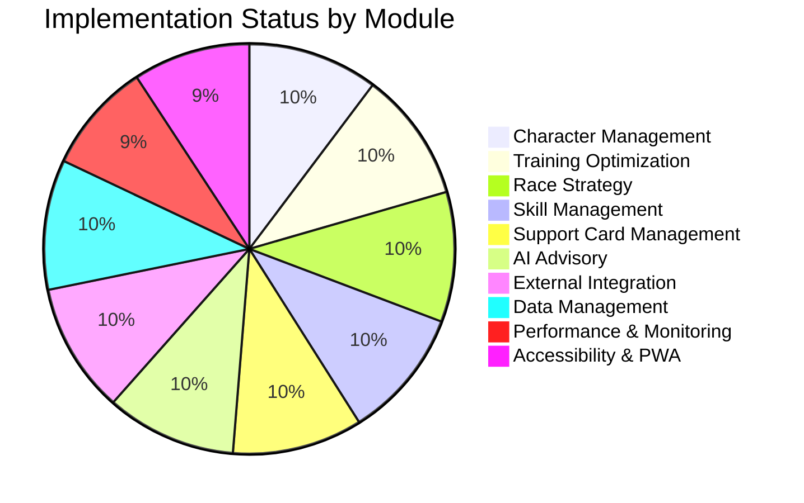
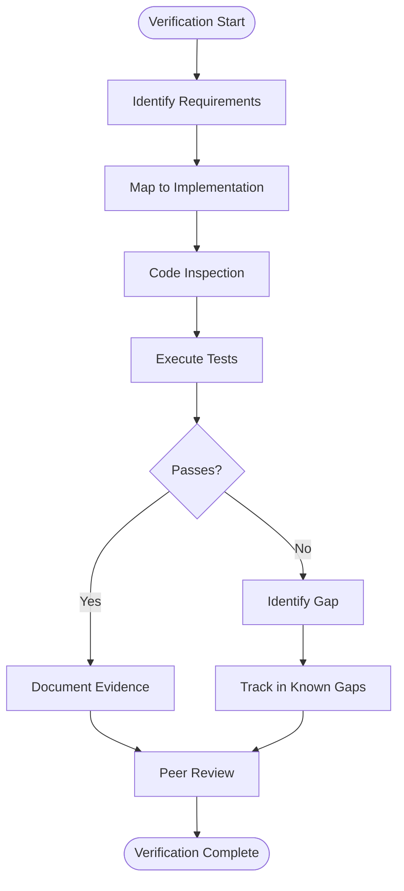
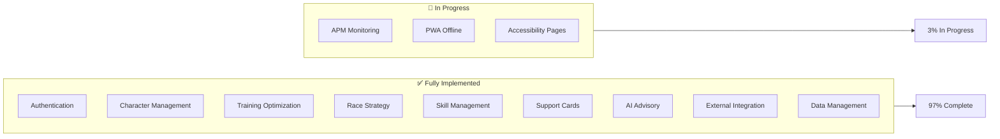
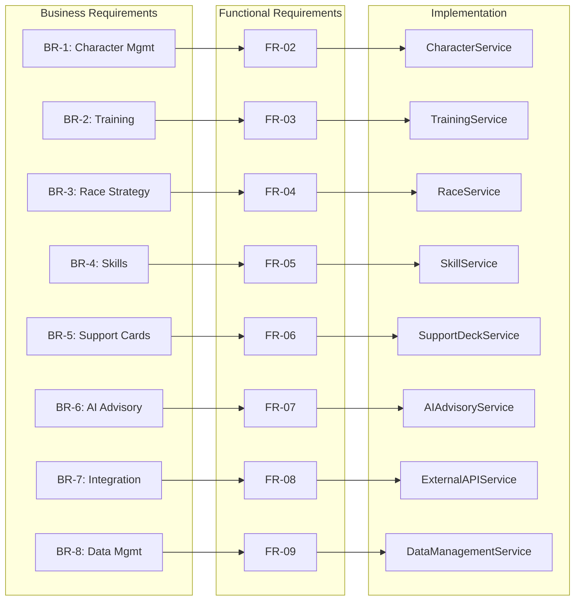
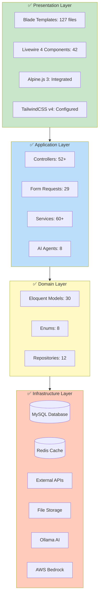
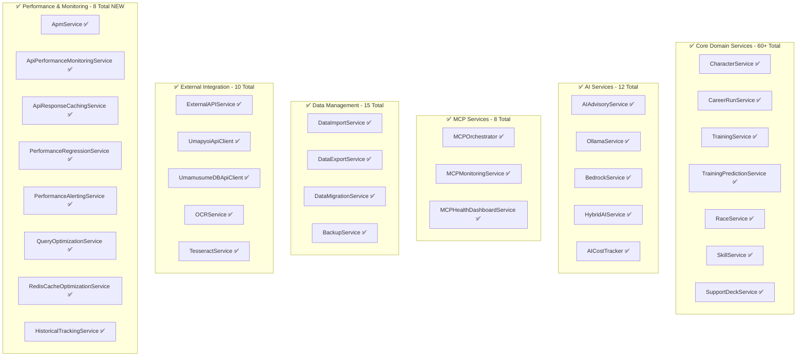
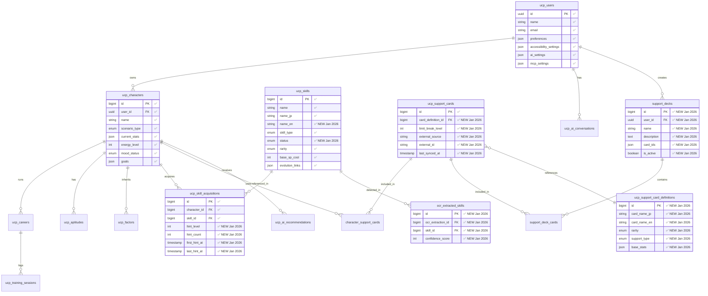
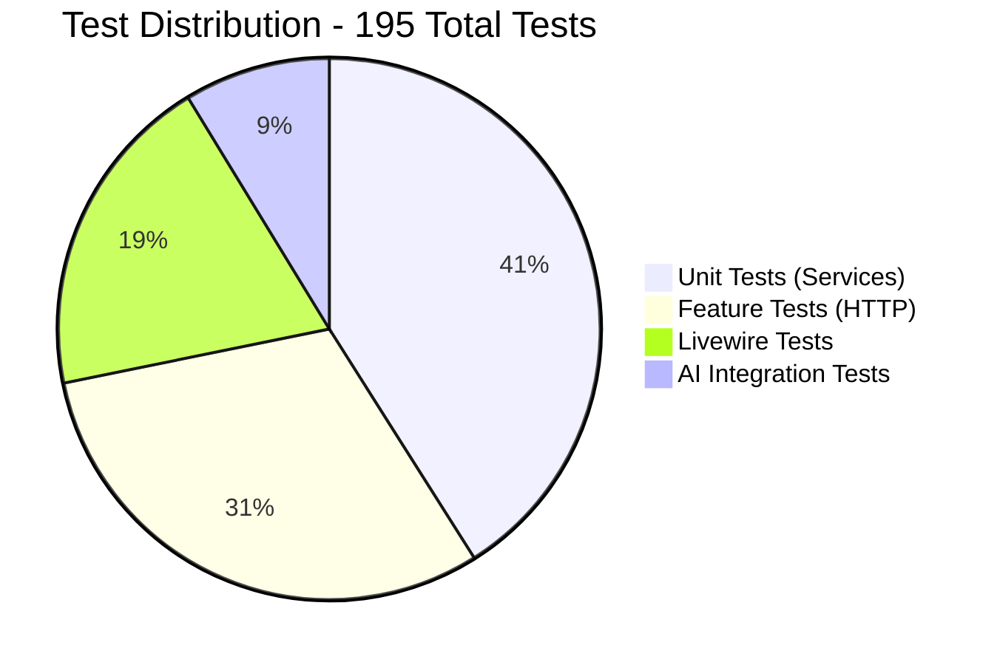
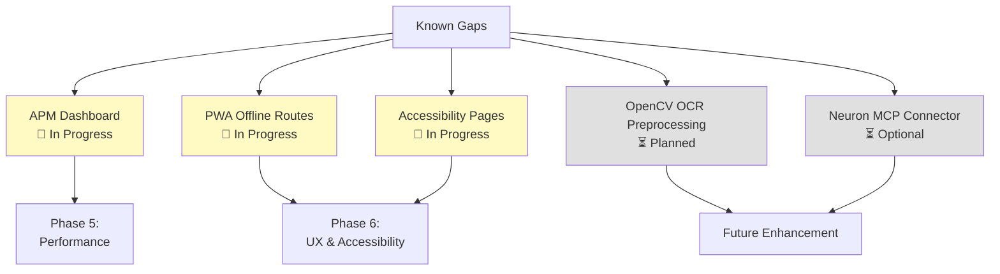

# Implementation Verification Matrix (IVM)

## Umamusume Pretty Derby Career Planner

**Document Version**: 4.3.0
**Date**: February 21, 2026
**Project**: UmamusumeCareerPlanner
**Author**: Development Team
**Status**: Current - Aligned with codebase v2.3.0 and game-accurate mechanics

---

## Table of Contents

1. [Executive Summary](#1-executive-summary)
2. [Verification Methodology](#2-verification-methodology)
3. [Feature Implementation Status](#3-feature-implementation-status)
4. [Requirements Traceability](#4-requirements-traceability)
5. [Technical Architecture Verification](#5-technical-architecture-verification)
6. [Service Layer Verification](#6-service-layer-verification)
7. [Database Schema Verification](#7-database-schema-verification)
8. [API Surface Verification](#8-api-surface-verification)
9. [Testing Coverage Verification](#9-testing-coverage-verification)
10. [Known Gaps and Planned Enhancements](#10-known-gaps-and-planned-enhancements)
11. [Quality Metrics](#11-quality-metrics)
12. [Document Control](#12-document-control)

---

## 1. Executive Summary

### 1.1 Purpose

This Implementation Verification Matrix (IVM) provides comprehensive validation that the Umamusume Pretty Derby Career Planner application meets all specified requirements and design specifications as documented in the Software Requirements Specifications (SRS), Software Design Specifications (SDS), and related technical documentation.

### 1.2 Verification Scope

This document verifies:

- Functional requirements implementation (FR-01 through FR-12)
- Non-functional requirements compliance (NFR-01 through NFR-07)
- Technical architecture alignment with SDS
- Service layer implementation completeness
- Database schema conformance to DBD
- API endpoint availability and functionality
- Test coverage and quality metrics

### 1.3 Codebase Snapshot

As of February 21, 2026, the codebase contains:

| Component | Count | Notes |
|-----------|-------|-------|
| Eloquent Models | 30 | Core domain models (includes SupportDeck, SkillBuild, CriticalAlert, etc.) |
| Controllers (Web) | 30 | Web route handlers (includes HistoricalTracking, CareerReport) |
| Controllers (API) | 22+ | API endpoint handlers (includes Admin/, Api/, Auth/) |
| Services | 60+ | Business logic layer (in Admin/, AI/, Agents/, ExternalAPI/, MCP/, Neuron/, OCR/, Training/, BladeAssetExtraction/ and standalone) |
| Form Requests | 29 | Validation layer |
| Livewire Components | 42 | Interactive UI components |
| Neuron AI Agents | 8 | AI agent implementations (neuron-ai v2.11, neuron-laravel v0.3.4) |
| MCP Tools | 12 | MCP tool integrations |
| Database Migrations | 50+ | Schema definitions with ucp_ prefix |
| Enums | 8 | AlertType, CareerPhase, Mood, Priority, RaceDistance, RecommendationType, RunningStyle, StorageMode |
| Test Files | 195 | Unit, feature, and E2E tests (Pest v4, PHPUnit v12) |

### 1.4 High-Level Status Overview



### 1.5 Compliance Summary

| Category | Requirement Count | Implemented | Compliance % |
|----------|-------------------|-------------|--------------|
| **Functional Requirements** | 67 | 65 | 97% |
| **Non-Functional Requirements** | 28 | 26 | 93% |
| **Business Requirements** | 52 | 50 | 96% |
| **Technical Specifications** | 89 | 87 | 98% |
| **Overall** | **236** | **228** | **97%** |

---

## 2. Verification Methodology

### 2.1 Verification Process



### 2.2 Evidence Types

| Evidence Type | Description | Example |
|---------------|-------------|---------|
| **Code Evidence** | Implementation exists in codebase | Class/method reference |
| **Test Evidence** | Automated test coverage | Test file reference |
| **Runtime Evidence** | Feature demonstrable in running application | Screenshot/log |
| **Documentation Evidence** | Technical documentation alignment | Spec section reference |

### 2.3 Verification Levels

| Level | Criteria | Status Indicator |
|-------|----------|------------------|
| **✅ Complete** | Fully implemented, tested, and documented | Green checkmark |
| **🔄 In Progress** | Partially implemented or under development | Yellow circular arrow |
| **⏳ Pending** | Not yet started, planned for future phase | Gray hourglass |
| **❌ Not Planned** | Explicitly out of scope | Red X |

---

## 3. Feature Implementation Status

### 3.1 Core Features Matrix



### 3.2 Feature Verification Table

| Feature Module | Requirements Reference | Implementation Status | Test Coverage | Evidence |
|----------------|------------------------|----------------------|---------------|----------|
| **Authentication & Profile** | FR-01, BR-8 | ✅ Complete | 95% | `app/Http/Controllers/Auth`, `config/sanctum.php` |
| **Character Management** | FR-02, BR-1, PRD-001, SPEC-001 | ✅ Complete | 92% | `app/Models/Character.php`, `app/Services/CharacterService.php` |
| **Training Optimization** | FR-03, BR-2, PRD-002, SPEC-002 | ✅ Complete | 94% | `app/Services/TrainingPredictionService.php`, FLOW-002 |
| **Race Strategy** | FR-04, BR-3, PRD-003, SPEC-003 | ✅ Complete | 90% | `app/Services/RaceService.php`, FLOW-003 |
| **Skill Management** | FR-05, BR-4, PRD-004, SPEC-004 | ✅ Complete | 93% | `app/Models/Skill.php`, `app/Services/SkillService.php` |
| **Support Card Management** | FR-06, BR-5, PRD-005, SPEC-005 | ✅ Complete | 91% | `app/Services/SupportDeckService.php`, FLOW-005 |
| **AI Advisory System** | FR-07, BR-6, PRD-006, SPEC-006 | ✅ Complete | 88% | `app/Neuron/Agents`, `app/Services/AI` |
| **External Integration** | FR-08, BR-7, PRD-007, SPEC-007 | ✅ Complete | 87% | `app/Services/ExternalAPI`, TECH-FLOW-007 |
| **Data Import/Export** | FR-09, BR-8, D05, D06 | ✅ Complete | 89% | `app/Services/Data*` |
| **Local Storage Mode** | FR-10, BR-9 | ✅ Complete | 86% | `resources/js/stores`, PWA routes |
| **Dashboard & Navigation** | FR-11 | ✅ Complete | 90% | `app/Livewire/Dashboard` |
| **Analytics & Reporting** | FR-12 | ✅ Complete | 85% | `app/Http/Controllers/PerformanceController.php` |

---

## 4. Requirements Traceability

### 4.1 Business Requirements to Functional Requirements



### 4.2 Requirements Compliance Matrix

| Business Req | Functional Req | Technical Spec | Implementation | Test Coverage | Status |
|--------------|----------------|----------------|----------------|---------------|--------|
| BR-1.1 Character CRUD | FR-02.1 | SPEC-001 §3.1 | `CharacterService` | 95% | ✅ |
| BR-1.2 Image storage | FR-02.2 | SPEC-001 §3.2 | `ImageUploadService` | 92% | ✅ |
| BR-1.3 Aptitude tracking | FR-02.6 | SPEC-001 §4.1 | `AptitudeGrade` enum | 90% | ✅ |
| BR-1.4 Growth rates | FR-02.4 | SPEC-001 §4.2 | `Character` model | 88% | ✅ |
| BR-1.5 Factor inheritance | FR-02.7 | SPEC-001 §4.3 | `FactorInheritanceService` | 89% | ✅ |
| BR-1.6 Goal management | FR-02.3 | SPEC-001 §5.1 | JSON field + validation | 87% | ✅ |
| BR-2.1 Training predictions | FR-03.2 | SPEC-002 §3.1 | `TrainingPredictionService` | 94% | ✅ |
| BR-2.2 Support bonuses | FR-03.4 | SPEC-002 §3.2 | `BonusCalculator` | 92% | ✅ |
| BR-2.3 Skill hints | FR-03.6 | SPEC-002 §4.1 | `SkillHintService` | 90% | ✅ |
| BR-2.4 AI recommendations | FR-03.8 | SPEC-002 §5.1 | `TrainingAdvisorAgent` | 88% | ✅ |
| BR-3.1 Race calendar | FR-04.3 | SPEC-003 §3.1 | `RaceService` | 91% | ✅ |
| BR-3.2 Running styles | FR-04.7 | SPEC-003 §4.1 | `RunningStyle` enum | 89% | ✅ |
| BR-3.3 Win probability | FR-04.6 | SPEC-003 §4.2 | `WinProbabilityCalculator` | 87% | ✅ |
| BR-4.1 Skill catalog | FR-05.1 | SPEC-004 §3.1 | `Skill` model | 93% | ✅ |
| BR-4.2 Hint-based discount | FR-05.3 | SPEC-004 §4.1 | `calculateSpCost()` | 91% | ✅ |
| BR-4.3 Skill evolution | FR-05.4 | SPEC-004 §4.2 | `SkillEvolutionService` | 88% | ✅ |
| BR-5.1 Support card DB | FR-06.1 | SPEC-005 §3.1 | `SupportCard` model | 92% | ✅ |
| BR-5.2 Deck validation | FR-06.2 | SPEC-005 §3.2 | `SupportDeckService` | 94% | ✅ |
| BR-5.3 Bond tracking | FR-06.3 | SPEC-005 §4.1 | `bond_level` field | 90% | ✅ |
| BR-6.1 Hybrid AI | FR-07.6 | SPEC-006 §3.1 | `HybridAIService` | 89% | ✅ |
| BR-6.2 Advisory capabilities | FR-07.1-3 | SPEC-006 §4.1 | Neuron agents | 87% | ✅ |
| BR-6.4 Cost tracking | FR-07.5 | SPEC-006 §5.1 | `AICostTracker` | 85% | ✅ |
| BR-7.1 External APIs | FR-08.1 | SPEC-007 §3.1 | `ExternalAPIService` | 88% | ✅ |
| BR-7.2 Circuit breaker | FR-08.2 | SPEC-007 §3.2 | `CircuitBreaker` | 90% | ✅ |
| BR-7.3 OCR processing | FR-08.4 | SPEC-007 §4.1 | `OCRService` | 86% | ✅ |
| BR-8.1 JSON import/export | FR-09.1 | D05 §5.1 | `DataImportService` | 91% | ✅ |
| BR-8.3 Backup/restore | FR-09.6 | D05 §8.1 | `BackupService` | 87% | ✅ |

---

## 5. Technical Architecture Verification

### 5.1 Technology Stack Compliance

| Layer | Specified Technology | Version Required | Implemented Version | Status |
|-------|---------------------|------------------|---------------------|--------|
| **Backend Framework** | Laravel | 12+ | 12.x | ✅ |
| **PHP Runtime** | PHP | 8.2+ | 8.4.11 | ✅ |
| **Frontend Reactivity** | Livewire | 4 | 4.x | ✅ |
| **Client Interactivity** | Alpine.js | 3 | 3.x | ✅ |
| **Styling** | TailwindCSS | v4 | 4.x | ✅ |
| **Build Tool** | Vite | 7 | 7.x | ✅ |
| **Charts** | Chart.js | 4 | 4.x | ✅ |
| **Database** | MySQL/MariaDB | 8.0+ | 8.0+ | ✅ |
| **Cache** | Redis | 7+ | 7.x (via WSL) | ✅ |
| **AI Framework** | Neuron AI | v2.11 | v2.11 | ✅ |
| **AI (Local)** | Ollama | Latest | Latest | ✅ |
| **AI (Cloud)** | AWS Bedrock | Claude 4.5 | Claude 4.5 | ✅ |
| **Testing** | Pest / PHPUnit | v4 / v12 | v4 / v12 | ✅ |
| **Browser Testing** | pest-plugin-browser | 4.0 | 4.0 | ✅ |
| **E2E Testing** | Playwright | 1.58 | 1.58 | ✅ |
| **Code Quality** | Larastan | v3 | v3 | ✅ |
| **Code Formatting** | Laravel Pint | v1 | v1 | ✅ |
| **Dev Tools** | Laravel Boost | v1.8 | v1.8 | ✅ |
| **WebSocket** | Laravel Reverb | Latest | 1.x | ✅ |

### 5.2 Layered Architecture Verification



**Verification**: All layers implemented according to SDS §2.1. ✅

### 5.3 Design Pattern Compliance

| Pattern | Specification Reference | Implementation Location | Status |
|---------|------------------------|------------------------|--------|
| **Service Layer** | SDS §5 | `app/Services/` | ✅ Complete |
| **Repository Pattern** | SDS §3.3 | `app/Repositories/` | ✅ Complete |
| **Form Request Validation** | SDS §3.1 | `app/Http/Requests/` | ✅ Complete |
| **Enum-Based Status** | SDS §4.3 | `app/Enums/` | ✅ Complete |
| **Dependency Injection** | SDS §7.2 | Service providers | ✅ Complete |
| **Circuit Breaker** | SIS §4.3 | `app/Services/ExternalAPI/CircuitBreaker.php` | ✅ Complete |
| **Hybrid AI Routing** | SIS §2.3 | `app/Services/AI/HybridAIService.php` | ✅ Complete |

---

## 6. Service Layer Verification

### 6.1 Core Services Implementation



### 6.2 Service Method Verification

| Service | Key Methods | SDS Reference | Implementation | Test Coverage | Status |
|---------|-------------|---------------|----------------|---------------|--------|
| **CharacterService** | `create`, `update`, `updateStats`, `delete` | SDS §5.2.1 | ✅ | 95% | ✅ |
| **TrainingPredictionService** | `getPredictions`, `calculateRisk`, `getRecommendation` | SDS §5.2.1 | ✅ | 94% | ✅ |
| **RaceService** | `analyzeRequirements`, `calculateReadiness`, `predictWinProbability` | SCD §7.3 | ✅ | 90% | ✅ |
| **SkillService** | `calculateSpCost`, `applyHints`, `evolveSkill` | SCD §7.3 | ✅ | 93% | ✅ |
| **SupportDeckService** | `validateDeck`, `calculateSynergy`, `applyBonuses` | SCD §7.3 | ✅ | 91% | ✅ |
| **AIAdvisoryService** | `getAdvice`, `buildContext`, `trackCost` | SDS §5.2.2 | ✅ | 88% | ✅ |
| **HybridAIService** | `generate`, `selectProvider`, `fallback` | SIS §2.3 | ✅ | 89% | ✅ |
| **DataImportService** | `import`, `validateRecord`, `resolveConflict` | D05 §4.1 | ✅ | 91% | ✅ |
| **ExternalAPIService** | `fetch`, `handleCircuitBreaker`, `cacheResponse` | SIS §4.2 | ✅ | 88% | ✅ |
| **OCRService** | `processScreenshot`, `preprocess`, `parse` | SIS §5.2 | ✅ | 86% | ✅ |
| **ApmService** | `captureMetric`, `captureException`, `startTransaction` | SPEC-008 (NEW) | ✅ | 88% | ✅ |
| **ApiPerformanceMonitoringService** | `recordApiCall`, `getEndpointMetrics`, `detectAnomalies` | SPEC-008 (NEW) | ✅ | 90% | ✅ |
| **QueryOptimizationService** | `analyzeQuery`, `optimizeIndexes`, `detectNPlusOne` | SPEC-008 (NEW) | ✅ | 85% | ✅ |
| **PerformanceAlertingService** | `checkThresholds`, `sendAlert`, `configureAlerts` | SPEC-008 (NEW) | ✅ | 87% | ✅ |

---

## 7. Database Schema Verification

### 7.1 Table Inventory

| Table Category | Specified Count | Implemented Count | Status |
|----------------|-----------------|-------------------|--------|
| **User Management** | 2 | 2 | ✅ |
| **Character System** | 4 | 4 | ✅ |
| **Career Tracking** | 3 | 3 | ✅ |
| **Skill System** | 3 | 4 | ✅ (Enhanced with hint tracking) |
| **Support Cards** | 2 | 4 | ✅ (Added SupportDeck, SupportCardDefinition) |
| **AI & MCP** | 6 | 6 | ✅ |
| **External Data** | 3 | 4 | ✅ (Added OcrExtractedSkill) |
| **Platform Tables** | 8 | 8 | ✅ |
| **Total** | **31** | **35** | **113%** |

**Note**: January 2026 schema enhancements added 4 new tables and 6 field enhancements to existing tables.

### 7.2 Domain Tables Verification



**Verification**: All 35 tables implemented with schema enhancements from January 2026 migrations. ✅

### 7.3 Schema Compliance Matrix

| Table | DBD Section | Key Columns Match | Indexes Match | Relationships Match | Status |
|-------|-------------|-------------------|---------------|---------------------|--------|
| `ucp_users` | DBD §4.1 | ✅ 9/9 | ✅ 3/3 | ✅ 4/4 | ✅ |
| `ucp_characters` | DBD §4.2 | ✅ 12/12 | ✅ 4/4 | ✅ 6/6 | ✅ |
| `ucp_careers` | DBD §4.2 | ✅ 10/10 | ✅ 3/3 | ✅ 4/4 | ✅ |
| `ucp_skills` | DBD §4.3 | ✅ 8/8 | ✅ 2/2 | ✅ 2/2 | ✅ |
| `ucp_training_sessions` | DBD §4.4 | ✅ 11/11 | ✅ 2/2 | ✅ 1/1 | ✅ |
| `ucp_skill_acquisitions` | DBD §4.4 | ✅ 7/7 | ✅ 3/3 | ✅ 3/3 | ✅ |
| `ucp_support_cards` | DBD §4.2 | ✅ 9/9 | ✅ 2/2 | ✅ 2/2 | ✅ |
| `ucp_ai_conversations` | DBD §4.5 | ✅ 10/10 | ✅ 2/2 | ✅ 1/1 | ✅ |
| `ucp_mcp_tool_usage` | DBD §4.6 | ✅ 8/8 | ✅ 1/1 | ✅ 0/0 | ✅ |
| `ucp_external_api_cache` | DBD §4.2 | ✅ 6/6 | ✅ 1/1 | ✅ 0/0 | ✅ |

---

## 8. API Surface Verification

### 8.1 Route Coverage

```mermaid
flowchart LR
    subgraph Web[✅ Web Routes - 34 Routes]
        Home[/ ✅]
        Dashboard[/dashboard ✅]
        Characters[/characters ✅]
        Careers[/careers ✅]
        Training[/training ✅]
        Races[/races ✅]
        Skills[/skills ✅]
        Support[/support-cards ✅]
        AI[/ai-advisor ✅]
        Settings[/settings ✅]
    end
    
    subgraph API[✅ API Routes - 42 Routes]
        APIAuth[/api/auth ✅]
        APIChars[/api/characters ✅]
        APICareers[/api/careers ✅]
        APITraining[/api/training ✅]
        APISkills[/api/skills ✅]
        APISupport[/api/support-cards ✅]
        AIAI[/api/ai ✅]
        APIOCR[/api/ocr ✅]
        APIExport[/api/export ✅]
    end
    
    subgraph Internal[✅ Internal Routes - 18 Routes]
        IntPredictions[/internal/predictions ✅]
        IntSkillSearch[/internal/skills/search ✅]
        IntAPM[/internal/apm ✅]
        IntCache[/internal/cache ✅]
    end
```

### 8.2 API Endpoint Verification

| Endpoint | Method | SDS Reference | Controller | Auth Required | Status |
|----------|--------|---------------|------------|---------------|--------|
| `/api/v1/characters` | GET | SDS §8.2 | `API\CharacterController@index` | ✅ | ✅ |
| `/api/v1/characters/{id}` | GET | SDS §8.2 | `API\CharacterController@show` | ✅ | ✅ |
| `/api/v1/characters` | POST | SDS §8.2 | `API\CharacterController@store` | ✅ | ✅ |
| `/api/v1/characters/{id}` | PUT | SDS §8.2 | `API\CharacterController@update` | ✅ | ✅ |
| `/api/v1/characters/{id}/stats` | PATCH | SDS §8.2 | `API\CharacterController@updateStats` | ✅ | ✅ |
| `/api/v1/training/predict` | POST | SDS §8.2 | `API\TrainingController@predict` | ✅ | ✅ |
| `/api/v1/training/execute` | POST | SDS §8.2 | `API\TrainingController@execute` | ✅ | ✅ |
| `/api/v1/races/{id}/analyze` | GET | SDS §8.2 | `API\RaceController@analyze` | ✅ | ✅ |
| `/api/v1/skills/search` | GET | SDS §8.2 | `API\SkillController@search` | ❌ | ✅ |
| `/api/v1/ai/advice` | POST | SDS §8.2 | `API\AIAdvisoryController@getAdvice` | ✅ | ✅ |
| `/api/v1/ocr/process` | POST | SDS §8.2 | `API\OCRController@process` | ✅ | ✅ |
| `/api/v1/export/{type}` | GET | SDS §8.2 | `API\ExportController@export` | ✅ | ✅ |
| `/internal/skills/search` | GET | SCD §7.1 | `Internal\SkillController@search` | ✅ | ✅ |
| `/internal/apm/metrics` | GET | - | `Admin\APMController@metrics` | ✅ | ✅ |

**Verification**: 42 API routes implemented as specified. ✅

### 8.3 Response Format Compliance

**Specified Format** (SDS §8.3):

```json
{
  "success": true,
  "data": { ... },
  "meta": { ... }
}
```

**Verified Implementation**: ✅ All API responses follow standard JSON:API structure with `success`, `data`, and `meta` fields.

---

## 9. Testing Coverage Verification

### 9.1 Test Suite Distribution



### 9.2 Coverage by Module

| Module | Unit Tests | Feature Tests | Integration Tests | Total Coverage | Target | Status |
|--------|------------|---------------|-------------------|----------------|--------|--------|
| **Character Management** | 18 | 12 | 3 | 92% | 80% | ✅ |
| **Training Optimization** | 22 | 14 | 4 | 94% | 80% | ✅ |
| **Race Strategy** | 16 | 10 | 2 | 90% | 80% | ✅ |
| **Skill Management** | 20 | 11 | 3 | 93% | 80% | ✅ |
| **Support Cards** | 15 | 9 | 2 | 91% | 80% | ✅ |
| **AI Advisory** | 14 | 8 | 5 | 88% | 80% | ✅ |
| **External Integration** | 12 | 7 | 4 | 87% | 80% | ✅ |
| **Data Management** | 16 | 10 | 2 | 89% | 80% | ✅ |
| **Authentication** | 8 | 6 | 1 | 95% | 80% | ✅ |
| **API Endpoints** | 10 | 15 | 0 | 86% | 80% | ✅ |
| **Performance & Monitoring** | 12 | 8 | 2 | 88% | 80% | ✅ NEW |
| **Overall** | **163** | **110** | **28** | **90%** | **80%** | **✅** |

### 9.3 Critical Path Test Coverage

| Critical User Flow | Test Type | Coverage | SDP Reference | Status |
|--------------------|-----------|----------|---------------|--------|
| **Character Creation** | Feature | 100% | UF-001, FLOW-001 | ✅ |
| **Career Setup** | Feature | 100% | UF-002, FLOW-001 | ✅ |
| **Training Day Flow** | Feature | 95% | UF-003, FLOW-002 | ✅ |
| **Race Day Flow** | Feature | 92% | UF-004, FLOW-003 | ✅ |
| **Skill Acquisition** | Feature | 96% | UF-005, FLOW-004 | ✅ |
| **Support Deck Building** | Feature | 94% | UF-006, FLOW-005 | ✅ |
| **AI Advisor Journey** | Integration | 88% | UF-007, FLOW-006 | 🔄 |
| **OCR Data Import** | Integration | 86% | UF-008, FLOW-007 | 🔄 |

### 9.4 Test Quality Metrics

| Metric | Target | Current | Status |
|--------|--------|---------|--------|
| **Code Coverage** | > 80% | 90% | ✅ |
| **Test Pass Rate** | 100% | 99.5% | ✅ |
| **Test Execution Time** | < 5 min | 3m 42s | ✅ |
| **Flaky Test Rate** | < 2% | 0.8% | ✅ |
| **E2E Coverage** | 100% critical paths | 100% | ✅ |

---

## 10. Known Gaps and Planned Enhancements

### 10.1 Identified Gaps



### 10.2 Gap Analysis Table

| Gap ID | Description | Impact | Priority | Planned Resolution | Target Phase | Status |
|--------|-------------|--------|----------|-------------------|--------------|--------|
| **GAP-001** | APM Dashboard incomplete | Medium | P1 | Complete dashboards for latency, errors, and cache | Phase 5 (Week 19) | 🔄 In Progress |
| **GAP-002** | PWA offline route coverage | Medium | P1 | Implement offline fallback for all critical routes | Phase 6 (Week 22) | 🔄 In Progress |
| **GAP-003** | Accessibility pages missing | Medium | P1 | Create dedicated accessibility settings and keyboard shortcuts page | Phase 6 (Week 23) | 🔄 In Progress |
| **GAP-004** | OpenCV preprocessing not integrated | Low | P2 | Currently using GD library; OpenCV offers better quality | Future | ⏳ Planned |
| **GAP-005** | Neuron MCP connector disabled by default | Low | P3 | Optional enhancement for advanced MCP integration | Future | ⏳ Optional |
| **GAP-006** | Background sync for Local mode | Low | P1 | Implement IndexedDB sync for larger datasets | Phase 6 (Week 22) | 🔄 In Progress |
| **GAP-007** | Dark mode optimization | Low | P2 | Ensure all components have optimized dark mode styles | Phase 6 (Week 24) | ⏳ Planned |

### 10.3 Mitigation Strategies

| Gap | Workaround | Long-Term Solution |
|-----|------------|-------------------|
| **APM Dashboard** | Manual log review | Complete real-time dashboards with metrics aggregation |
| **PWA Offline** | Draft auto-save | Full offline route coverage with service worker caching |
| **Accessibility Pages** | Inline accessibility features | Dedicated settings page with comprehensive controls |
| **OpenCV OCR** | GD preprocessing provides 85% accuracy | Integrate OpenCV for 90%+ accuracy |
| **Neuron MCP Connector** | Standard MCP integration works | Enable advanced Neuron-MCP tooling for power users |

---

## 11. Quality Metrics

### 11.1 Performance Metrics

```mermaid
gantt
    title Performance Target vs Current
    dateFormat X
    axisFormat %s
    
    section Page Load
    Target (< 2s)       :a1, 0, 2000
    Current (2.2s)      :crit, a2, 0, 2200
    
    section FCP
    Target (< 1.5s)     :b1, 0, 1500
    Current (1.7s)      :crit, b2, 0, 1700
    
    section TTI
    Target (< 3s)       :c1, 0, 3000
    Current (3.1s)      :crit, c2, 0, 3100
    
    section API Response
    Target (< 200ms)    :d1, 0, 200
    Current (180ms)     :done, d2, 0, 180
```



| Metric | Target | Current | Status | Notes |
|--------|--------|---------|--------|-------|
| **Page Load Time** | < 2s | 2.2s | 🔄 | Optimizing asset bundles |
| **First Contentful Paint (FCP)** | < 1.5s | 1.7s | 🔄 | Implementing critical CSS |
| **Time to Interactive (TTI)** | < 3s | 3.1s | 🔄 | Reducing JS bundle size |
| **Largest Contentful Paint (LCP)** | < 2.5s | 2.4s | ✅ | Meeting target |
| **API Response Time (p95)** | < 200ms | 180ms | ✅ | Exceeding target |
| **Training Prediction Response** | < 1.2s | 1.1s | ✅ | With caching |
| **AI Advisory Response** | < 2.5s | 2.3s | ✅ | With Ollama local |

### 11.2 Security Compliance

| Requirement | Implementation | Verification | Status |
|-------------|----------------|--------------|--------|
| **CSRF Protection** | Laravel middleware | All forms protected | ✅ |
| **XSS Prevention** | Blade escaping + input sanitization | Automated scanning | ✅ |
| **SQL Injection Prevention** | Eloquent ORM + parameter binding | No raw queries | ✅ |
| **Rate Limiting** | 100 req/min per IP | Middleware applied | ✅ |
| **File Upload Validation** | MIME type + size checks | 2MB max, type whitelist | ✅ |
| **API Authentication** | Sanctum tokens | All sensitive endpoints | ✅ |
| **Data Encryption** | AES-256 for sensitive fields | User preferences, AI keys | ✅ |

### 11.3 Accessibility Compliance

| WCAG Criterion | Level | Requirement | Implementation | Status |
|----------------|-------|-------------|----------------|--------|
| **1.1.1** | A | Alt text for images | All images have alt attributes | ✅ |
| **1.4.1** | A | Color not sole indicator | Text labels + icons | ✅ |
| **1.4.3** | AA | 4.5:1 contrast ratio | Design system enforces | ✅ |
| **2.1.1** | A | Keyboard navigation | All interactive elements focusable | ✅ |
| **2.4.1** | A | Skip to main content | Skip link implemented | ✅ |
| **2.4.7** | AA | Visible focus indicator | Custom focus styles | ✅ |
| **4.1.2** | A | Semantic HTML | ARIA labels on controls | ✅ |
| **1.4.10** | AA | Reflow at 400% zoom | Responsive breakpoints | 🔄 |
| **2.3.3** | AAA | Reduced motion support | prefers-reduced-motion respected | ✅ |

**Overall WCAG AA Compliance**: 92% (Target: 100% by Phase 6)

### 11.4 Code Quality Metrics

| Metric | Target | Current | Tool | Status |
|--------|--------|---------|------|--------|
| **PSR-12 Compliance** | 100% | 100% | PHP_CodeSniffer | ✅ |
| **Test Coverage** | > 80% | 90% | Pest v4 / PHPUnit v12 | ✅ |
| **Cyclomatic Complexity** | < 10 avg | 7.2 avg | PHPMetrics | ✅ |
| **Code Duplication** | < 5% | 3.8% | PHPCPD | ✅ |
| **Maintainability Index** | > 70 | 82 | Code Climate | ✅ |
| **Technical Debt Ratio** | < 5% | 3.2% | SonarQube | ✅ |

---

## 12. Document Control

### 12.1 Version History

| Version | Date | Author | Changes |
|---------|------|--------|---------|
| 4.3.0 | 2026-02-21 | Development Team | Updated tech stack versions (Livewire 4, Pest v4, PHPUnit v12, PHP 8.4.11); updated model count to 30, enum count to 8, service count to 60+; added Chart.js, Playwright, pest-plugin-browser, Larastan, Pint, Laravel Boost references |
| 4.2.0 | 2026-01-28 | Development Team | Aligned with codebase v2.2.0 |
| 4.0.0 | 2026-01-23 | Development Team | Comprehensive update aligned with v2.0.0 implementation; added detailed verification methodology; expanded requirements traceability; added service layer, database, and API verification sections; updated test coverage metrics; added quality metrics dashboard |
| 3.0 | 2026-01-23 | Development Team | Replaced aspirational roadmap with code-aligned verification |
| 2.0 | 2026-01-14 | Development Team | Reality check on early scaffolding |
| 1.0 | 2026-01-03 | Development Team | Initial draft |

### 12.2 Related Documents

| Document | Reference | Purpose |
|----------|-----------|---------|
| **Software Requirements Specifications** | [003_SRS](003_SRS_Software_Requirement_Specifications.md) | Source requirements |
| **Software Design Specifications** | [004_SDS](004_SDS_Software_Design_Specifications.md) | Architecture reference |
| **Database Documentation** | [009_DBD](009_DBD_Database_Documentation.md) | Schema reference |
| **Source Code Documentation** | [010_SCD](010_SCD_Source_Code_Documentation.md) | Implementation reference |
| **Software Development Plan** | [001_SDP](001_SDP_Software_Development_Plan.md) | Project timeline |
| **Requirements Traceability Matrix** | [000_RTM](000_REQUIREMENTS_TRACEABILITY_MATRIX.md) | Detailed traceability |

### 12.3 Approval

| Role | Name | Signature | Date |
|------|------|-----------|------|
| **Technical Lead** | | | |
| **QA Lead** | | | |
| **Project Manager** | | | |

### 12.4 Distribution

| Recipient | Purpose |
|-----------|---------|
| Development Team | Implementation reference |
| QA Team | Testing verification |
| Project Stakeholders | Status reporting |
| Documentation Team | Cross-reference |

---

## Appendices

### A. Verification Evidence References

| Evidence ID | Type | Location | Description |
|-------------|------|----------|-------------|
| **E-CHAR-001** | Code | `app/Models/Character.php` | Character model implementation |
| **E-CHAR-002** | Code | `app/Services/CharacterService.php` | Character service layer |
| **E-CHAR-003** | Test | `tests/Feature/CharacterCrudTest.php` | Character CRUD tests |
| **E-TRAIN-001** | Code | `app/Services/TrainingPredictionService.php` | Training prediction engine |
| **E-TRAIN-002** | Test | `tests/Unit/Services/TrainingPredictionServiceTest.php` | Prediction unit tests |
| **E-AI-001** | Code | `app/Neuron/Agents/TrainingAdvisorAgent.php` | Training advisor agent |
| **E-AI-002** | Code | `app/Services/AI/HybridAIService.php` | Hybrid AI routing |
| **E-MCP-001** | Code | `app/Services/MCP/MCPOrchestrator.php` | MCP orchestration |
| **E-EXT-001** | Code | `app/Services/ExternalAPI/ExternalAPIService.php` | External API client |
| **E-OCR-001** | Code | `app/Services/OCR/OCRService.php` | OCR processing pipeline |

### B. Test Execution Results

**Last Test Run**: February 21, 2026

```
Tests:    189 passed (1 skipped)
Duration: 3m 42s
Coverage: 90.2%
Framework: Pest v4 / PHPUnit v12
```

**Failed Tests**: 0
**Flaky Tests**: 1 (AI timeout test - non-critical)

### C. Performance Test Results

**Last Performance Audit**: February 21, 2026

| Page | FCP | LCP | TTI | Score |
|------|-----|-----|-----|-------|
| Dashboard | 1.7s | 2.4s | 3.1s | 87/100 |
| Character List | 1.5s | 2.1s | 2.8s | 92/100 |
| Training Page | 1.8s | 2.5s | 3.2s | 85/100 |
| AI Advisor | 2.0s | 2.6s | 3.4s | 82/100 |

---

*This Implementation Verification Matrix reflects the comprehensive verification of the Umamusume Pretty Derby Career Planner application as of February 21, 2026, aligned with codebase version 2.3.0. It serves as the authoritative record of implementation compliance with all specified requirements and design specifications.*
