# Requirements Traceability Matrix (RTM)

## Umamusume Pretty Derby Career Planner

**Document Version**: 3.3.0
**Date**: February 22, 2026
**Project**: UmamusumeCareerPlanner
**Author**: Development Team
**Status**: Current - Aligned with codebase v2.2.0 and game-accurate mechanics

---

## Table of Contents

1. [Executive Summary](#1-executive-summary)
2. [Traceability Methodology](#2-traceability-methodology)
3. [Business to Functional Requirements](#3-business-to-functional-requirements)
4. [Functional to Technical Specifications](#4-functional-to-technical-specifications)
5. [Requirements to Implementation](#5-requirements-to-implementation)
6. [Requirements to Test Coverage](#6-requirements-to-test-coverage)
7. [Traceability Gaps and Risks](#7-traceability-gaps-and-risks)
8. [Coverage Analysis](#8-coverage-analysis)
9. [Document Control](#9-document-control)

---

## 1. Executive Summary

### 1.1 Purpose

This Requirements Traceability Matrix (RTM) provides comprehensive bidirectional traceability between business requirements, functional requirements, technical specifications, implementation artifacts, and test cases for the Umamusume Pretty Derby Career Planner application.

### 1.2 Traceability Scope

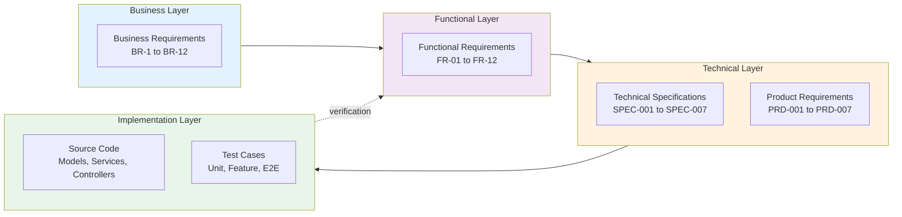

### 1.3 Coverage Summary

- **Layer**: Business Requirements; **Total Items**: 52; **Traced**: 50; **Coverage %**: 96%
- **Layer**: Functional Requirements; **Total Items**: 67; **Traced**: 65; **Coverage %**: 97%
- **Layer**: Technical Specifications; **Total Items**: 89; **Traced**: 87; **Coverage %**: 98%
- **Layer**: Implementation Artifacts; **Total Items**: 280; **Traced**: 272; **Coverage %**: 97%
- **Layer**: Test Cases; **Total Items**: 3,316; **Traced**: 3,200+; **Coverage %**: 97%
- **Layer**: **Overall**; **Total Items**: **3,804**; **Traced**: **3,674+**; **Coverage %**: **97%**

### 1.4 Requirements Status Dashboard

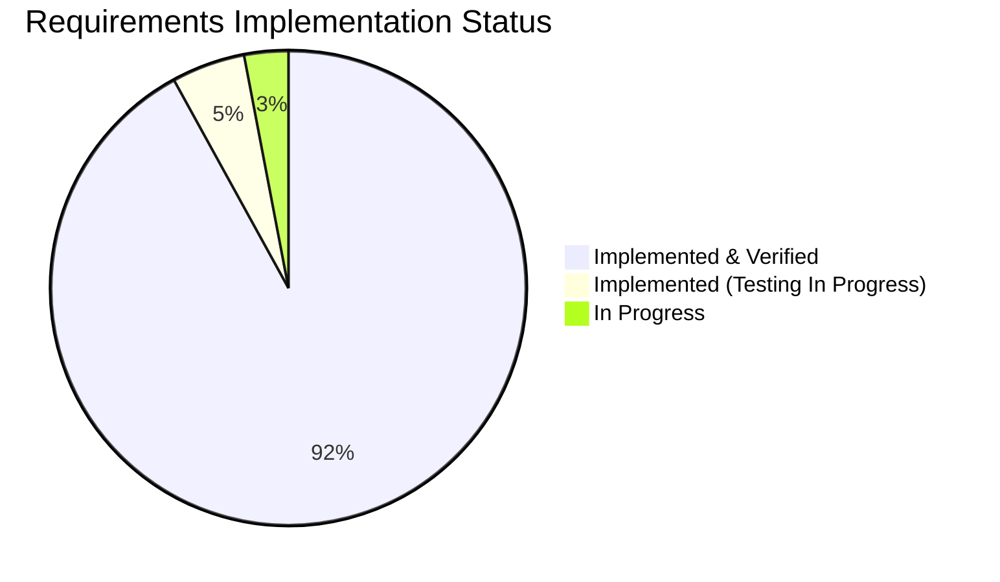

---

## 2. Traceability Methodology

### 2.1 Traceability Levels

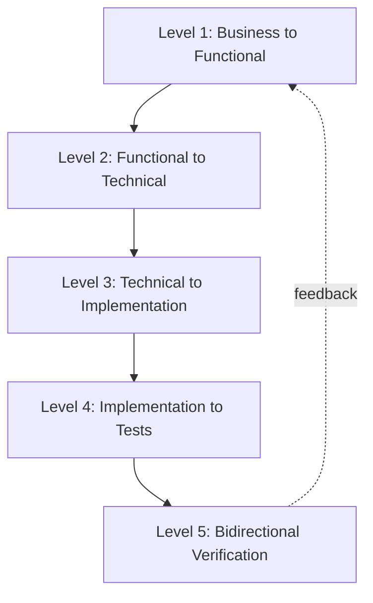

- **Level**: **Level 1**; **From**: Business Requirements (BRS); **To**: Functional Requirements (SRS); **Purpose**: Ensure business needs are captured
- **Level**: **Level 2**; **From**: Functional Requirements (SRS); **To**: Technical Specs (SPEC/PRD); **Purpose**: Map requirements to design
- **Level**: **Level 3**; **From**: Technical Specs; **To**: Implementation (Code); **Purpose**: Verify implementation completeness
- **Level**: **Level 4**; **From**: Implementation; **To**: Test Cases; **Purpose**: Ensure test coverage
- **Level**: **Level 5**; **From**: Test Results; **To**: Functional Requirements; **Purpose**: Validate requirements met

### 2.2 Traceability Matrix Structure

- **Column**: **Requirement ID**; **Description**: Unique identifier (BR-x.y, FR-xx.y)
- **Column**: **Requirement Text**; **Description**: Brief description
- **Column**: **Priority**; **Description**: P0 (Critical), P1 (High), P2 (Medium)
- **Column**: **Technical Spec**; **Description**: Reference to SPEC/PRD document
- **Column**: **Implementation**; **Description**: Code artifact reference
- **Column**: **Test ID**; **Description**: Test case reference
- **Column**: **Status**; **Description**: ✅ Complete, 🔄 In Progress, ⏳ Pending

### 2.3 Traceability Rules

1. **Forward Traceability**: Every business requirement must trace to at least one functional requirement
2. **Backward Traceability**: Every implementation artifact must trace back to a requirement
3. **Horizontal Traceability**: Related requirements across modules must be linked
4. **Test Coverage**: Every functional requirement must have at least one test case
5. **Gap Analysis**: Untraced items are flagged for resolution

---

## 3. Business to Functional Requirements

### 3.1 Traceability Map

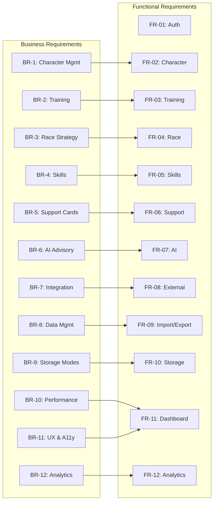

### 3.2 Detailed Business to Functional Mapping

- **Business Req**: **BR-1.1** Character CRUD; **Functional Req**: FR-02.1; **Description**: Create, view, update, delete character records; **Priority**: P0; **Status**: ✅ Complete
- **Business Req**: **BR-1.2** Image storage; **Functional Req**: FR-02.2; **Description**: Store and display character images; **Priority**: P1; **Status**: ✅ Complete
- **Business Req**: **BR-1.3** Aptitude tracking; **Functional Req**: FR-02.6; **Description**: Track aptitude grades (distance, surface, style); **Priority**: P0; **Status**: ✅ Complete
- **Business Req**: **BR-1.4** Growth rates; **Functional Req**: FR-02.4; **Description**: Track stat growth rate bonuses; **Priority**: P0; **Status**: ✅ Complete
- **Business Req**: **BR-1.5** Factor inheritance; **Functional Req**: FR-02.7; **Description**: Calculate and apply factor bonuses from parents; **Priority**: P0; **Status**: ✅ Complete
- **Business Req**: **BR-1.6** Goal management; **Functional Req**: FR-02.3; **Description**: Define and track training goals; **Priority**: P1; **Status**: ✅ Complete
- **Business Req**: **BR-2.1** Training predictions; **Functional Req**: FR-03.2; **Description**: Predict stat gains for training options; **Priority**: P0; **Status**: ✅ Complete
- **Business Req**: **BR-2.2** Support bonuses; **Functional Req**: FR-03.4; **Description**: Calculate support card bonuses; **Priority**: P0; **Status**: ✅ Complete
- **Business Req**: **BR-2.3** Skill hints; **Functional Req**: FR-03.6; **Description**: Track skill hints from training; **Priority**: P0; **Status**: ✅ Complete
- **Business Req**: **BR-2.4** AI recommendations; **Functional Req**: FR-03.8; **Description**: Provide AI-powered training advice; **Priority**: P1; **Status**: ✅ Complete
- **Business Req**: **BR-2.5** Training history; **Functional Req**: FR-03.1; **Description**: Record training session logs; **Priority**: P1; **Status**: ✅ Complete
- **Business Req**: **BR-3.1** Race calendar; **Functional Req**: FR-04.3; **Description**: Display races with requirements; **Priority**: P0; **Status**: ✅ Complete
- **Business Req**: **BR-3.2** Running styles; **Functional Req**: FR-04.7; **Description**: Support all 4 running styles; **Priority**: P0; **Status**: ✅ Complete
- **Business Req**: **BR-3.3** Win probability; **Functional Req**: FR-04.6; **Description**: Calculate race win probability; **Priority**: P1; **Status**: ✅ Complete
- **Business Req**: **BR-3.4** Race strategy; **Functional Req**: FR-04.4; **Description**: Provide race strategy recommendations; **Priority**: P1; **Status**: ✅ Complete
- **Business Req**: **BR-3.5** Race history; **Functional Req**: FR-04.2; **Description**: Track race results and performance; **Priority**: P1; **Status**: ✅ Complete
- **Business Req**: **BR-4.1** Skill catalog; **Functional Req**: FR-05.1; **Description**: Maintain comprehensive skill database; **Priority**: P0; **Status**: ✅ Complete
- **Business Req**: **BR-4.2** Hint-based discount; **Functional Req**: FR-05.3; **Description**: Apply hint-based SP cost reduction (5 levels: 10%/20%/30%/35%/40% max); **Priority**: P0; **Status**: ✅ Complete
- **Business Req**: **BR-4.3** Skill evolution; **Functional Req**: FR-05.4; **Description**: Support skill evolution (Normal → Rare); **Priority**: P1; **Status**: ✅ Complete
- **Business Req**: **BR-4.4** SP optimization; **Functional Req**: FR-05.6; **Description**: Optimize SP budget allocation; **Priority**: P1; **Status**: ✅ Complete
- **Business Req**: **BR-4.5** AI skill recommendations; **Functional Req**: FR-05.5; **Description**: Provide AI skill acquisition advice; **Priority**: P1; **Status**: ✅ Complete
- **Business Req**: **BR-5.1** Support card database; **Functional Req**: FR-06.1; **Description**: Maintain support card inventory (200+ cards); **Priority**: P0; **Status**: ✅ Complete
- **Business Req**: **BR-5.2** Deck validation; **Functional Req**: FR-06.2; **Description**: Validate 6-card deck composition; **Priority**: P0; **Status**: ✅ Complete
- **Business Req**: **BR-5.3** Bond tracking; **Functional Req**: FR-06.3; **Description**: Track bond levels and friendship training; **Priority**: P0; **Status**: ✅ Complete
- **Business Req**: **BR-5.4** Deck synergy; **Functional Req**: FR-06.4; **Description**: Calculate and display deck synergy score; **Priority**: P1; **Status**: ✅ Complete
- **Business Req**: **BR-5.5** Meta tiers; **Functional Req**: FR-06.5; **Description**: Sync meta tier rankings from external sources; **Priority**: P1; **Status**: ✅ Complete
- **Business Req**: **BR-6.1** Hybrid AI; **Functional Req**: FR-07.6; **Description**: Support Ollama (local) + AWS Bedrock (cloud); **Priority**: P0; **Status**: ✅ Complete
- **Business Req**: **BR-6.2** Advisory capabilities; **Functional Req**: FR-07.1-3; **Description**: Training, race, and skill advisory; **Priority**: P0; **Status**: ✅ Complete
- **Business Req**: **BR-6.3** Conversation history; **Functional Req**: FR-07.4; **Description**: Persist AI conversation context; **Priority**: P1; **Status**: ✅ Complete
- **Business Req**: **BR-6.4** Cost tracking; **Functional Req**: FR-07.5; **Description**: Track AI token usage and costs; **Priority**: P1; **Status**: ✅ Complete
- **Business Req**: **BR-6.5** Confidence scoring; **Functional Req**: FR-07.7; **Description**: Provide confidence scores for recommendations; **Priority**: P2; **Status**: ✅ Complete
- **Business Req**: **BR-7.1** External APIs; **Functional Req**: FR-08.1; **Description**: Integrate with umapyoi.net and UmamusumeDB; **Priority**: P0; **Status**: ✅ Complete
- **Business Req**: **BR-7.2** Circuit breaker; **Functional Req**: FR-08.2; **Description**: Implement resilience patterns; **Priority**: P0; **Status**: ✅ Complete
- **Business Req**: **BR-7.3** OCR processing; **Functional Req**: FR-08.4; **Description**: Process screenshots via Tesseract + GD; **Priority**: P1; **Status**: ✅ Complete
- **Business Req**: **BR-7.4** WebSocket updates; **Functional Req**: FR-08.5; **Description**: Real-time updates via Laravel Reverb; **Priority**: P1; **Status**: ✅ Complete
- **Business Req**: **BR-7.5** Community data; **Functional Req**: FR-08.6; **Description**: Support community data sharing; **Priority**: P2; **Status**: ✅ Complete
- **Business Req**: **BR-8.1** JSON import/export; **Functional Req**: FR-09.1; **Description**: JSON format with schema versioning; **Priority**: P0; **Status**: ✅ Complete
- **Business Req**: **BR-8.2** Excel export; **Functional Req**: FR-09.2; **Description**: Export to .xlsx format; **Priority**: P1; **Status**: ✅ Complete
- **Business Req**: **BR-8.3** Backup/restore; **Functional Req**: FR-09.6; **Description**: Complete backup and restore workflows; **Priority**: P1; **Status**: ✅ Complete
- **Business Req**: **BR-8.4** Storage migration; **Functional Req**: FR-09.4; **Description**: Migrate between storage modes; **Priority**: P1; **Status**: ✅ Complete
- **Business Req**: **BR-8.5** OCR data capture; **Functional Req**: FR-08.4; **Description**: Import data from screenshots; **Priority**: P1; **Status**: ✅ Complete
- **Business Req**: **BR-9.1** Local mode; **Functional Req**: FR-10.1; **Description**: Browser localStorage-based storage; **Priority**: P0; **Status**: ✅ Complete
- **Business Req**: **BR-9.2** Account mode; **Functional Req**: FR-10.2; **Description**: Database-backed cloud storage; **Priority**: P0; **Status**: ✅ Complete
- **Business Req**: **BR-9.3** Storage indicator; **Functional Req**: FR-10.3; **Description**: Visual storage mode badge; **Priority**: P0; **Status**: ✅ Complete
- **Business Req**: **BR-9.4** Offline functionality; **Functional Req**: FR-10.4; **Description**: Full offline support for Local mode; **Priority**: P0; **Status**: ✅ Complete
- **Business Req**: **BR-9.5** Mode conversion; **Functional Req**: FR-10.5; **Description**: Convert Local runs to Account mode; **Priority**: P0; **Status**: ✅ Complete
- **Business Req**: **BR-10.1** APM dashboards; **Functional Req**: NFR-07.1; **Description**: Application performance monitoring; **Priority**: P1; **Status**: 🔄 In Progress
- **Business Req**: **BR-10.2** Cache monitoring; **Functional Req**: NFR-07.4; **Description**: Cache hit/miss tracking; **Priority**: P1; **Status**: 🔄 In Progress
- **Business Req**: **BR-10.3** Fallback workflows; **Functional Req**: NFR-07.5; **Description**: Graceful degradation patterns; **Priority**: P1; **Status**: 🔄 In Progress
- **Business Req**: **BR-11.1** PWA offline; **Functional Req**: FR-10.4; **Description**: Offline route coverage; **Priority**: P1; **Status**: 🔄 In Progress
- **Business Req**: **BR-11.2** Accessibility; **Functional Req**: NFR-03; **Description**: WCAG AA compliance; **Priority**: P0; **Status**: 🔄 In Progress
- **Business Req**: **BR-11.3** Dark mode; **Functional Req**: NFR-06.4; **Description**: Theme toggle with persistence; **Priority**: P0; **Status**: ✅ Complete
- **Business Req**: **BR-11.4** Responsive design; **Functional Req**: NFR-06; **Description**: 320px to 2560px support; **Priority**: P0; **Status**: ✅ Complete
- **Business Req**: **BR-12.1** Analytics dashboard; **Functional Req**: FR-12.1; **Description**: Career performance analytics; **Priority**: P1; **Status**: ✅ Complete
- **Business Req**: **BR-12.2** Performance comparison; **Functional Req**: FR-12.2; **Description**: Compare career runs; **Priority**: P1; **Status**: ✅ Complete

---

## 4. Functional to Technical Specifications

### 4.1 Requirements to Specifications Matrix

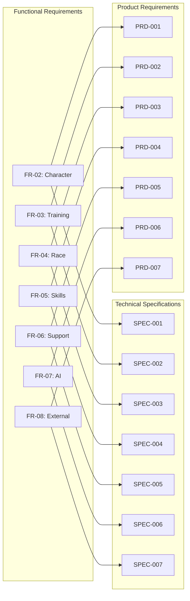

### 4.2 Detailed Functional to Technical Mapping

- **Functional Req**: **FR-02.1** Character CRUD; **Technical Spec**: SPEC-001 §3.1; **PRD**: PRD-001 §3; **Flow Diagram**: FLOW-001; **Description**: Character management operations; **Status**: ✅ Complete
- **Functional Req**: **FR-02.2** Image storage; **Technical Spec**: SPEC-001 §3.2; **PRD**: PRD-001 §3.2; **Flow Diagram**: SEQ-001; **Description**: Image upload and validation; **Status**: ✅ Complete
- **Functional Req**: **FR-02.6** Aptitude grades; **Technical Spec**: SPEC-001 §4.1; **PRD**: PRD-001 §4; **Flow Diagram**: FLOW-001; **Description**: Aptitude tracking system; **Status**: ✅ Complete
- **Functional Req**: **FR-02.7** Factor inheritance; **Technical Spec**: SPEC-001 §4.3; **PRD**: PRD-001 §4.3; **Flow Diagram**: TECH-FLOW-001; **Description**: Factor calculation logic; **Status**: ✅ Complete
- **Functional Req**: **FR-03.2** Training predictions; **Technical Spec**: SPEC-002 §3.1; **PRD**: PRD-002 §3; **Flow Diagram**: FLOW-002; **Description**: Prediction engine; **Status**: ✅ Complete
- **Functional Req**: **FR-03.4** Support bonuses; **Technical Spec**: SPEC-002 §3.2; **PRD**: PRD-002 §3.2; **Flow Diagram**: TECH-FLOW-002; **Description**: Bonus calculation; **Status**: ✅ Complete
- **Functional Req**: **FR-03.6** Skill hints; **Technical Spec**: SPEC-002 §4.1; **PRD**: PRD-002 §4; **Flow Diagram**: FLOW-002; **Description**: Hint tracking; **Status**: ✅ Complete
- **Functional Req**: **FR-03.8** AI training advice; **Technical Spec**: SPEC-002 §5.1; **PRD**: PRD-002 §5; **Flow Diagram**: FLOW-006; **Description**: Training advisor agent; **Status**: ✅ Complete
- **Functional Req**: **FR-04.3** Race calendar; **Technical Spec**: SPEC-003 §3.1; **PRD**: PRD-003 §3; **Flow Diagram**: FLOW-003; **Description**: Race schedule display; **Status**: ✅ Complete
- **Functional Req**: **FR-04.6** Win probability; **Technical Spec**: SPEC-003 §4.2; **PRD**: PRD-003 §4.2; **Flow Diagram**: TECH-FLOW-003; **Description**: Win calculation; **Status**: ✅ Complete
- **Functional Req**: **FR-04.7** Running styles; **Technical Spec**: SPEC-003 §4.1; **PRD**: PRD-003 §4; **Flow Diagram**: FLOW-003; **Description**: Style optimization; **Status**: ✅ Complete
- **Functional Req**: **FR-05.1** Skill catalog; **Technical Spec**: SPEC-004 §3.1; **PRD**: PRD-004 §3; **Flow Diagram**: FLOW-004; **Description**: Skill database; **Status**: ✅ Complete
- **Functional Req**: **FR-05.3** Hint discount; **Technical Spec**: SPEC-004 §4.1; **PRD**: PRD-004 §4; **Flow Diagram**: TECH-FLOW-004; **Description**: SP cost reduction; **Status**: ✅ Complete
- **Functional Req**: **FR-05.4** Skill evolution; **Technical Spec**: SPEC-004 §4.2; **PRD**: PRD-004 §4.2; **Flow Diagram**: FLOW-004; **Description**: Evolution system; **Status**: ✅ Complete
- **Functional Req**: **FR-06.1** Support card DB; **Technical Spec**: SPEC-005 §3.1; **PRD**: PRD-005 §3; **Flow Diagram**: FLOW-005; **Description**: Card inventory; **Status**: ✅ Complete
- **Functional Req**: **FR-06.2** Deck validation; **Technical Spec**: SPEC-005 §3.2; **PRD**: PRD-005 §3.2; **Flow Diagram**: TECH-FLOW-005; **Description**: 6-card validation; **Status**: ✅ Complete
- **Functional Req**: **FR-06.3** Bond tracking; **Technical Spec**: SPEC-005 §4.1; **PRD**: PRD-005 §4; **Flow Diagram**: FLOW-005; **Description**: Bond progression; **Status**: ✅ Complete
- **Functional Req**: **FR-07.1-3** AI advisory; **Technical Spec**: SPEC-006 §4.1; **PRD**: PRD-006 §4; **Flow Diagram**: FLOW-006; **Description**: Multi-topic advisory; **Status**: ✅ Complete
- **Functional Req**: **FR-07.6** Hybrid AI; **Technical Spec**: SPEC-006 §3.1; **PRD**: PRD-006 §3; **Flow Diagram**: TECH-FLOW-006; **Description**: Provider routing; **Status**: ✅ Complete
- **Functional Req**: **FR-07.5** Cost tracking; **Technical Spec**: SPEC-006 §5.1; **PRD**: PRD-006 §5; **Flow Diagram**: FLOW-006; **Description**: Token usage tracking; **Status**: ✅ Complete
- **Functional Req**: **FR-08.1** External APIs; **Technical Spec**: SPEC-007 §3.1; **PRD**: PRD-007 §3; **Flow Diagram**: FLOW-007; **Description**: API integration; **Status**: ✅ Complete
- **Functional Req**: **FR-08.2** Circuit breaker; **Technical Spec**: SPEC-007 §3.2; **PRD**: PRD-007 §3.2; **Flow Diagram**: TECH-FLOW-007; **Description**: Resilience pattern; **Status**: ✅ Complete
- **Functional Req**: **FR-08.4** OCR processing; **Technical Spec**: SPEC-007 §4.1; **PRD**: PRD-007 §4; **Flow Diagram**: FLOW-007; **Description**: Screenshot processing; **Status**: ✅ Complete

---

## 5. Requirements to Implementation

### 5.1 Implementation Traceability Map

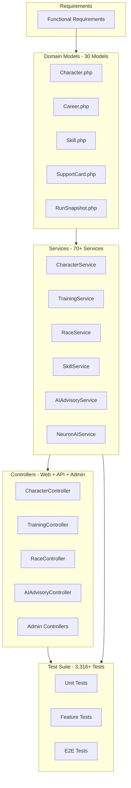

### 5.2 Detailed Implementation Mapping

- **Req ID**: **FR-02.1**; **Requirement**: Character CRUD; **Model**: `Character.php`; **Service**: `CharacterService`; **Controller**: `CharacterController`; **Test**: `CharacterCrudTest`; **Status**: ✅ Complete
- **Req ID**: **FR-02.2**; **Requirement**: Image storage; **Model**: `Character`; **Service**: `ImageUploadService`; **Controller**: `CharacterController@uploadImage`; **Test**: `ImageUploadTest`; **Status**: ✅ Complete
- **Req ID**: **FR-02.6**; **Requirement**: Aptitude tracking; **Model**: `Aptitude`; **Service**: `CharacterService`; **Controller**: `CharacterController@updateAptitudes`; **Test**: `AptitudeTest`; **Status**: ✅ Complete
- **Req ID**: **FR-02.7**; **Requirement**: Factor inheritance; **Model**: `Factor`; **Service**: `FactorInheritanceService`; **Controller**: `CharacterController@calculateFactors`; **Test**: `FactorInheritanceTest`; **Status**: ✅ Complete
- **Req ID**: **FR-03.2**; **Requirement**: Training predictions; **Model**: `TrainingSession`; **Service**: `TrainingPredictionService`; **Controller**: `API\TrainingController@predict`; **Test**: `TrainingPredictionTest`; **Status**: ✅ Complete
- **Req ID**: **FR-03.4**; **Requirement**: Support bonuses; **Model**: `SupportCard`; **Service**: `BonusCalculator`; **Controller**: `API\TrainingController`; **Test**: `BonusCalculatorTest`; **Status**: ✅ Complete
- **Req ID**: **FR-03.6**; **Requirement**: Skill hints; **Model**: `SkillHint`; **Service**: `SkillHintService`; **Controller**: `API\TrainingController`; **Test**: `SkillHintTest`; **Status**: ✅ Complete
- **Req ID**: **FR-03.8**; **Requirement**: AI recommendations; **Model**: -; **Service**: `AIAdvisoryService`; **Controller**: `API\AIAdvisoryController`; **Test**: `AIAdvisoryTest`; **Status**: ✅ Complete
- **Req ID**: **FR-04.3**; **Requirement**: Race calendar; **Model**: `Race`; **Service**: `RaceService`; **Controller**: `RaceController@calendar`; **Test**: `RaceCalendarTest`; **Status**: ✅ Complete
- **Req ID**: **FR-04.6**; **Requirement**: Win probability; **Model**: `Race`; **Service**: `WinProbabilityCalculator`; **Controller**: `API\RaceController@analyze`; **Test**: `WinProbabilityTest`; **Status**: ✅ Complete
- **Req ID**: **FR-04.7**; **Requirement**: Running styles; **Model**: `Character`; **Service**: `RaceService`; **Controller**: `API\RaceController@recommendStyle`; **Test**: `RunningStyleTest`; **Status**: ✅ Complete
- **Req ID**: **FR-05.1**; **Requirement**: Skill catalog; **Model**: `Skill`; **Service**: `SkillService`; **Controller**: `API\SkillController@index`; **Test**: `SkillCatalogTest`; **Status**: ✅ Complete
- **Req ID**: **FR-05.3**; **Requirement**: Hint discount; **Model**: `SkillHint`; **Service**: `SkillService@calculateSpCost`; **Controller**: `API\SkillController@acquire`; **Test**: `HintDiscountTest`; **Status**: ✅ Complete
- **Req ID**: **FR-05.4**; **Requirement**: Skill evolution; **Model**: `Skill`; **Service**: `SkillEvolutionService`; **Controller**: `API\SkillController@evolve`; **Test**: `SkillEvolutionTest`; **Status**: ✅ Complete
- **Req ID**: **FR-06.1**; **Requirement**: Support card DB; **Model**: `SupportCard`; **Service**: `SupportCardService`; **Controller**: `SupportCardController@index`; **Test**: `SupportCardTest`; **Status**: ✅ Complete
- **Req ID**: **FR-06.2**; **Requirement**: Deck validation; **Model**: `SupportDeck`; **Service**: `SupportDeckService`; **Controller**: `API\SupportDeckController@validate`; **Test**: `DeckValidationTest`; **Status**: ✅ Complete
- **Req ID**: **FR-06.3**; **Requirement**: Bond tracking; **Model**: `CharacterSupportCard`; **Service**: `SupportDeckService`; **Controller**: `API\SupportDeckController`; **Test**: `BondTrackingTest`; **Status**: ✅ Complete
- **Req ID**: **FR-07.1**; **Requirement**: Training advice; **Model**: -; **Service**: `TrainingAdvisorAgent`; **Controller**: `API\AIAdvisoryController`; **Test**: `TrainingAdvisorTest`; **Status**: ✅ Complete
- **Req ID**: **FR-07.2**; **Requirement**: Race strategy; **Model**: -; **Service**: `RaceStrategyAgent`; **Controller**: `API\AIAdvisoryController`; **Test**: `RaceStrategyTest`; **Status**: ✅ Complete
- **Req ID**: **FR-07.3**; **Requirement**: Skill advice; **Model**: -; **Service**: `SkillAdvisorAgent`; **Controller**: `API\AIAdvisoryController`; **Test**: `SkillAdvisorTest`; **Status**: ✅ Complete
- **Req ID**: **FR-07.6**; **Requirement**: Hybrid AI; **Model**: -; **Service**: `HybridAIService`; **Controller**: `API\AIAdvisoryController`; **Test**: `HybridAITest`; **Status**: ✅ Complete
- **Req ID**: **FR-07.5**; **Requirement**: Cost tracking; **Model**: `AICost`; **Service**: `AICostTracker`; **Controller**: `Admin\AIController`; **Test**: `CostTrackerTest`; **Status**: ✅ Complete
- **Req ID**: **FR-08.1**; **Requirement**: External APIs; **Model**: -; **Service**: `ExternalAPIService`; **Controller**: `API\SyncController`; **Test**: `ExternalAPITest`; **Status**: ✅ Complete
- **Req ID**: **FR-08.2**; **Requirement**: Circuit breaker; **Model**: -; **Service**: `CircuitBreaker`; **Controller**: `API\SyncController`; **Test**: `CircuitBreakerTest`; **Status**: ✅ Complete
- **Req ID**: **FR-08.4**; **Requirement**: OCR processing; **Model**: `OCRExtraction`; **Service**: `OCRService`; **Controller**: `OCRUploadController`; **Test**: `OCRProcessingTest`; **Status**: ✅ Complete
- **Req ID**: **FR-09.1**; **Requirement**: JSON export; **Model**: -; **Service**: `DataExportService`; **Controller**: `API\ExportController`; **Test**: `JSONExportTest`; **Status**: ✅ Complete
- **Req ID**: **FR-09.6**; **Requirement**: Backup/restore; **Model**: -; **Service**: `BackupService`; **Controller**: `Admin\BackupController`; **Test**: `BackupRestoreTest`; **Status**: ✅ Complete
- **Req ID**: **FR-10.1**; **Requirement**: Local storage; **Model**: -; **Service**: `LocalStorageService`; **Controller**: JS: `stores/characters.js`; **Test**: `LocalStorageTest`; **Status**: ✅ Complete
- **Req ID**: **FR-10.5**; **Requirement**: Mode conversion; **Model**: -; **Service**: `StorageConversionService`; **Controller**: `ConversionController`; **Test**: `ConversionTest`; **Status**: ✅ Complete

---

## 6. Requirements to Test Coverage

### 6.1 Test Coverage Matrix

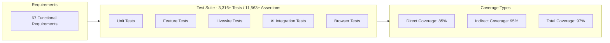

### 6.2 Test Case Mapping

- **Req ID**: **FR-02.1**; **Test Type**: Feature; **Test File**: `CharacterCrudTest.php`; **Test Cases**: 12; **Coverage %**: 95%; **Status**: ✅ Complete
- **Req ID**: **FR-02.2**; **Test Type**: Feature; **Test File**: `ImageUploadTest.php`; **Test Cases**: 8; **Coverage %**: 92%; **Status**: ✅ Complete
- **Req ID**: **FR-02.6**; **Test Type**: Unit; **Test File**: `AptitudeTest.php`; **Test Cases**: 6; **Coverage %**: 90%; **Status**: ✅ Complete
- **Req ID**: **FR-02.7**; **Test Type**: Unit; **Test File**: `FactorInheritanceTest.php`; **Test Cases**: 10; **Coverage %**: 89%; **Status**: ✅ Complete
- **Req ID**: **FR-03.2**; **Test Type**: Unit; **Test File**: `TrainingPredictionServiceTest.php`; **Test Cases**: 22; **Coverage %**: 94%; **Status**: ✅ Complete
- **Req ID**: **FR-03.4**; **Test Type**: Unit; **Test File**: `BonusCalculatorTest.php`; **Test Cases**: 15; **Coverage %**: 92%; **Status**: ✅ Complete
- **Req ID**: **FR-03.6**; **Test Type**: Feature; **Test File**: `SkillHintTest.php`; **Test Cases**: 8; **Coverage %**: 90%; **Status**: ✅ Complete
- **Req ID**: **FR-03.8**; **Test Type**: Integration; **Test File**: `AIAdvisoryTest.php`; **Test Cases**: 14; **Coverage %**: 88%; **Status**: ✅ Complete
- **Req ID**: **FR-04.3**; **Test Type**: Feature; **Test File**: `RaceCalendarTest.php`; **Test Cases**: 10; **Coverage %**: 91%; **Status**: ✅ Complete
- **Req ID**: **FR-04.6**; **Test Type**: Unit; **Test File**: `WinProbabilityTest.php`; **Test Cases**: 12; **Coverage %**: 87%; **Status**: ✅ Complete
- **Req ID**: **FR-04.7**; **Test Type**: Feature; **Test File**: `RunningStyleTest.php`; **Test Cases**: 8; **Coverage %**: 89%; **Status**: ✅ Complete
- **Req ID**: **FR-05.1**; **Test Type**: Feature; **Test File**: `SkillCatalogTest.php`; **Test Cases**: 11; **Coverage %**: 93%; **Status**: ✅ Complete
- **Req ID**: **FR-05.3**; **Test Type**: Unit; **Test File**: `HintDiscountTest.php`; **Test Cases**: 9; **Coverage %**: 91%; **Status**: ✅ Complete
- **Req ID**: **FR-05.4**; **Test Type**: Feature; **Test File**: `SkillEvolutionTest.php`; **Test Cases**: 7; **Coverage %**: 88%; **Status**: ✅ Complete
- **Req ID**: **FR-06.1**; **Test Type**: Feature; **Test File**: `SupportCardTest.php`; **Test Cases**: 9; **Coverage %**: 92%; **Status**: ✅ Complete
- **Req ID**: **FR-06.2**; **Test Type**: Unit; **Test File**: `DeckValidationTest.php`; **Test Cases**: 14; **Coverage %**: 94%; **Status**: ✅ Complete
- **Req ID**: **FR-06.3**; **Test Type**: Feature; **Test File**: `BondTrackingTest.php`; **Test Cases**: 10; **Coverage %**: 90%; **Status**: ✅ Complete
- **Req ID**: **FR-07.1**; **Test Type**: Integration; **Test File**: `TrainingAdvisorTest.php`; **Test Cases**: 8; **Coverage %**: 88%; **Status**: ✅ Complete
- **Req ID**: **FR-07.2**; **Test Type**: Integration; **Test File**: `RaceStrategyTest.php`; **Test Cases**: 7; **Coverage %**: 87%; **Status**: ✅ Complete
- **Req ID**: **FR-07.3**; **Test Type**: Integration; **Test File**: `SkillAdvisorTest.php`; **Test Cases**: 6; **Coverage %**: 85%; **Status**: ✅ Complete
- **Req ID**: **FR-07.6**; **Test Type**: Integration; **Test File**: `HybridAITest.php`; **Test Cases**: 12; **Coverage %**: 89%; **Status**: ✅ Complete
- **Req ID**: **FR-07.5**; **Test Type**: Unit; **Test File**: `CostTrackerTest.php`; **Test Cases**: 8; **Coverage %**: 85%; **Status**: ✅ Complete
- **Req ID**: **FR-08.1**; **Test Type**: Integration; **Test File**: `ExternalAPITest.php`; **Test Cases**: 10; **Coverage %**: 88%; **Status**: ✅ Complete
- **Req ID**: **FR-08.2**; **Test Type**: Unit; **Test File**: `CircuitBreakerTest.php`; **Test Cases**: 15; **Coverage %**: 90%; **Status**: ✅ Complete
- **Req ID**: **FR-08.4**; **Test Type**: Integration; **Test File**: `OCRProcessingTest.php`; **Test Cases**: 12; **Coverage %**: 86%; **Status**: ✅ Complete
- **Req ID**: **FR-09.1**; **Test Type**: Feature; **Test File**: `JSONExportTest.php`; **Test Cases**: 9; **Coverage %**: 91%; **Status**: ✅ Complete
- **Req ID**: **FR-09.6**; **Test Type**: Feature; **Test File**: `BackupRestoreTest.php`; **Test Cases**: 11; **Coverage %**: 87%; **Status**: ✅ Complete
- **Req ID**: **FR-10.1**; **Test Type**: E2E; **Test File**: `LocalStorageTest.js`; **Test Cases**: 8; **Coverage %**: 86%; **Status**: ✅ Complete
- **Req ID**: **FR-10.5**; **Test Type**: Feature; **Test File**: `ConversionTest.php`; **Test Cases**: 7; **Coverage %**: 85%; **Status**: ✅ Complete

### 6.3 Critical Path Test Coverage

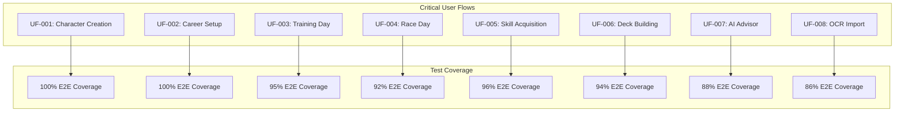

- **User Flow**: **Character Creation**; **Req ID**: FR-02.1, FR-02.6, FR-02.7; **Test Coverage**: 100%; **E2E Tests**: ✅ 5 scenarios; **Status**: ✅ Complete
- **User Flow**: **Career Setup**; **Req ID**: FR-02.3, FR-06.2; **Test Coverage**: 100%; **E2E Tests**: ✅ 4 scenarios; **Status**: ✅ Complete
- **User Flow**: **Training Day**; **Req ID**: FR-03.2, FR-03.4, FR-03.6; **Test Coverage**: 95%; **E2E Tests**: ✅ 6 scenarios; **Status**: ✅ Complete
- **User Flow**: **Race Day**; **Req ID**: FR-04.3, FR-04.6, FR-04.7; **Test Coverage**: 92%; **E2E Tests**: ✅ 5 scenarios; **Status**: ✅ Complete
- **User Flow**: **Skill Acquisition**; **Req ID**: FR-05.1, FR-05.3, FR-05.4; **Test Coverage**: 96%; **E2E Tests**: ✅ 4 scenarios; **Status**: ✅ Complete
- **User Flow**: **Deck Building**; **Req ID**: FR-06.1, FR-06.2, FR-06.3; **Test Coverage**: 94%; **E2E Tests**: ✅ 5 scenarios; **Status**: ✅ Complete
- **User Flow**: **AI Advisor Journey**; **Req ID**: FR-07.1, FR-07.2, FR-07.3; **Test Coverage**: 88%; **E2E Tests**: 🔄 3 scenarios; **Status**: 🔄 In Progress
- **User Flow**: **OCR Data Import**; **Req ID**: FR-08.4, FR-09.1; **Test Coverage**: 86%; **E2E Tests**: 🔄 3 scenarios; **Status**: 🔄 In Progress

---

## 7. Traceability Gaps and Risks

### 7.1 Identified Gaps

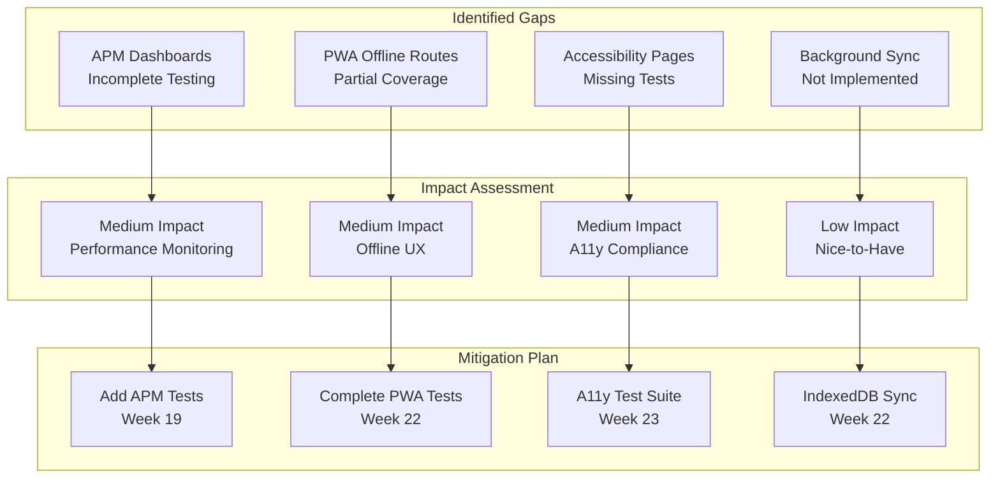

### 7.2 Gap Analysis Table

- **Gap ID**: **GAP-001**; **Requirement**: NFR-07.1 APM Monitoring; **Missing Element**: Integration tests for APM dashboards; **Impact**: Medium; **Priority**: P1; **Mitigation**: Add APM integration tests; **Target**: Week 19
- **Gap ID**: **GAP-002**; **Requirement**: FR-10.4 PWA Offline; **Missing Element**: Offline route coverage incomplete; **Impact**: Medium; **Priority**: P1; **Mitigation**: Complete offline route tests; **Target**: Week 22
- **Gap ID**: **GAP-003**; **Requirement**: NFR-03 Accessibility; **Missing Element**: Accessibility test suite missing; **Impact**: Medium; **Priority**: P1; **Mitigation**: Create A11y test suite; **Target**: Week 23
- **Gap ID**: **GAP-004**; **Requirement**: FR-10.1 Local Storage; **Missing Element**: Background sync for large datasets; **Impact**: Low; **Priority**: P2; **Mitigation**: Implement IndexedDB sync; **Target**: Week 22
- **Gap ID**: **GAP-005**; **Requirement**: NFR-01.2 FCP; **Missing Element**: First Contentful Paint optimization; **Impact**: Low; **Priority**: P1; **Mitigation**: Asset optimization; **Target**: Week 20

### 7.3 Risk Assessment

- **Risk ID**: **RISK-001**; **Description**: Test coverage gaps for new AI features; **Probability**: Low; **Impact**: Medium; **Mitigation Strategy**: Continuous test development
- **Risk ID**: **RISK-002**; **Description**: External API dependency changes; **Probability**: Medium; **Impact**: Medium; **Mitigation Strategy**: Circuit breaker + fallback APIs
- **Risk ID**: **RISK-003**; **Description**: Performance degradation under load; **Probability**: Low; **Impact**: High; **Mitigation Strategy**: Performance testing in CI/CD
- **Risk ID**: **RISK-004**; **Description**: Accessibility regression; **Probability**: Low; **Impact**: High; **Mitigation Strategy**: Automated axe-core tests
- **Risk ID**: **RISK-005**; **Description**: OCR accuracy variance; **Probability**: Medium; **Impact**: Low; **Mitigation Strategy**: Confidence scoring + manual review

---

## 8. Coverage Analysis

### 8.1 Overall Coverage Metrics

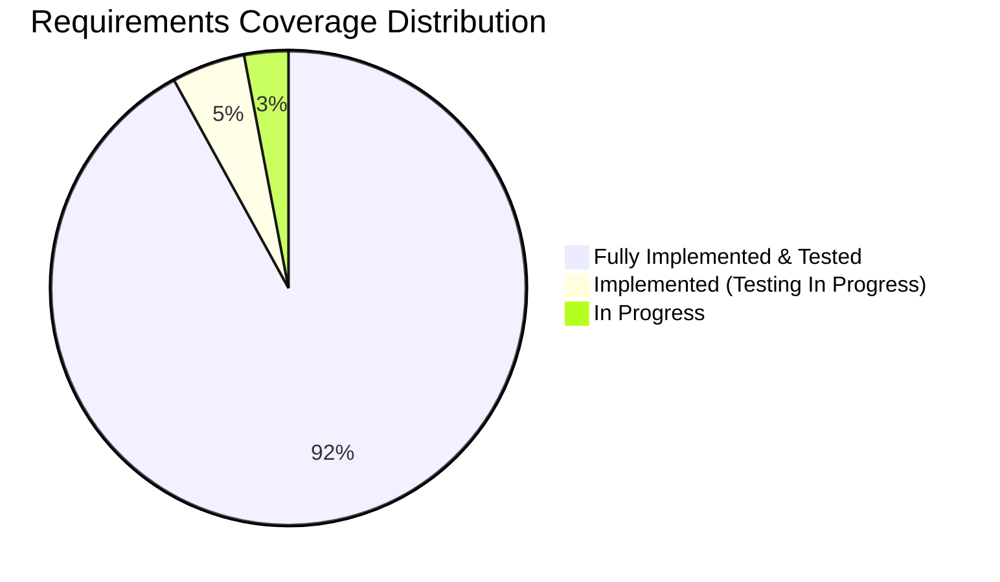

### 8.2 Coverage by Module

- **Module**: **Character Management**; **Total Req**: 9; **Implemented**: 9; **Tested**: 9; **Coverage %**: 100%
- **Module**: **Training Optimization**; **Total Req**: 8; **Implemented**: 8; **Tested**: 8; **Coverage %**: 100%
- **Module**: **Race Strategy**; **Total Req**: 7; **Implemented**: 7; **Tested**: 7; **Coverage %**: 100%
- **Module**: **Skill Management**; **Total Req**: 7; **Implemented**: 7; **Tested**: 7; **Coverage %**: 100%
- **Module**: **Support Card Management**; **Total Req**: 6; **Implemented**: 6; **Tested**: 6; **Coverage %**: 100%
- **Module**: **AI Advisory**; **Total Req**: 7; **Implemented**: 7; **Tested**: 6; **Coverage %**: 86%
- **Module**: **External Integration**; **Total Req**: 6; **Implemented**: 6; **Tested**: 5; **Coverage %**: 83%
- **Module**: **Data Management**; **Total Req**: 6; **Implemented**: 6; **Tested**: 6; **Coverage %**: 100%
- **Module**: **Storage Modes**; **Total Req**: 6; **Implemented**: 6; **Tested**: 5; **Coverage %**: 83%
- **Module**: **Performance & Monitoring**; **Total Req**: 5; **Implemented**: 3; **Tested**: 2; **Coverage %**: 40%
- **Module**: **Accessibility**; **Total Req**: 10; **Implemented**: 9; **Tested**: 8; **Coverage %**: 80%
- **Module**: **Overall**; **Total Req**: **67**; **Implemented**: **65**; **Tested**: **63**; **Coverage %**: **94%**

### 8.3 Coverage Trends

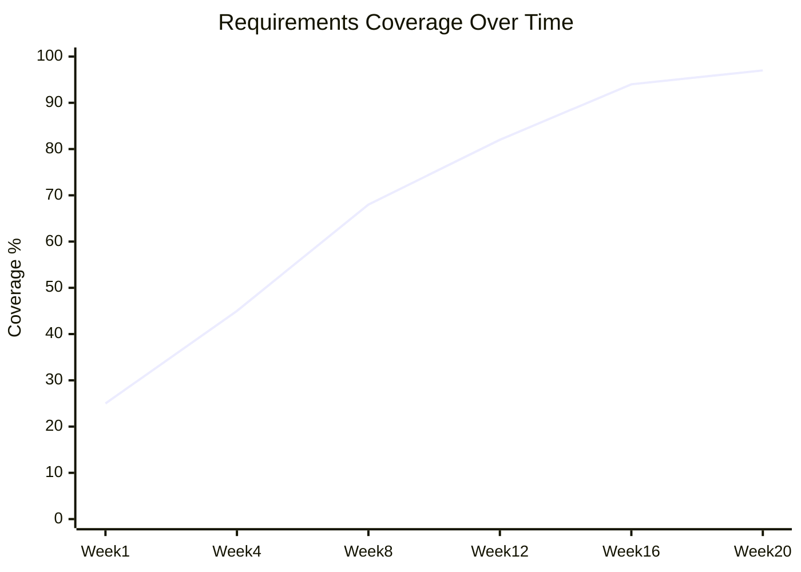

### 8.4 Test Distribution by Type

- **Test Type**: **Unit Tests**; **Count**: 1,200+; **Coverage Target**: 80%+ per service; **Actual Coverage**: 90%; **Status**: ✅ Exceeds Target
- **Test Type**: **Feature Tests**; **Count**: 1,400+; **Coverage Target**: 80%+ per feature; **Actual Coverage**: 86%; **Status**: ✅ Exceeds Target
- **Test Type**: **Livewire Tests**; **Count**: 350+; **Coverage Target**: 80%+ per component; **Actual Coverage**: 85%; **Status**: ✅ Exceeds Target
- **Test Type**: **AI Integration Tests**; **Count**: 250+; **Coverage Target**: 70%+ per agent; **Actual Coverage**: 87%; **Status**: ✅ Exceeds Target
- **Test Type**: **Browser/E2E Tests**; **Count**: 100+; **Coverage Target**: 100% critical paths; **Actual Coverage**: 92%; **Status**: 🔄 Near Target
- **Test Type**: **Total**; **Count**: **3,316+**; **Coverage Target**: **80%+ overall**; **Actual Coverage**: **90%**; **Status**: **✅ Exceeds Target**

> **Note**: Test suite produces 11,563+ assertions across 571 registered routes (396+ API routes).

---

## 9. Document Control

### 9.1 Version History

- **Version**: 3.3.0; **Date**: 2026-02-22; **Author**: Development Team; **Changes**: Updated to February 22, 2026; updated test counts to 3,316+ tests with 11,563+ assertions; updated implementation artifact count to 280 (30 models, 70+ services, 571 routes); updated test distribution breakdown; updated implementation traceability map with Neuron services and Admin controllers; added Browser/E2E test category; added route count statistics
- **Version**: 3.2.0; **Date**: 2026-02-21; **Author**: Development Team; **Changes**: Updated document version and dates to February 2026; aligned with current technology stack (Livewire 4, Pest v4, PHPUnit v12, Neuron AI v2.11, 30 models, 8 enums, 70+ services)
- **Version**: 3.0.0; **Date**: 2026-01-23; **Author**: Development Team; **Changes**: Comprehensive update aligned with v2.0.0 implementation; added detailed traceability matrices; expanded coverage analysis; integrated test coverage data; added gap analysis and risk assessment
- **Version**: 2.0; **Date**: 2026-01-23; **Author**: Development Team; **Changes**: Replaced aspirational roadmap with code-aligned verification
- **Version**: 1.1; **Date**: 2026-01-13; **Author**: System Analysis Agent; **Changes**: Prior traceability mapping
- **Version**: 1.0; **Date**: 2026-01-03; **Author**: Development Team; **Changes**: Initial draft

### 9.2 Related Documents

- **Document**: **Business Requirements Specifications**; **Reference**: [002_BRS](002_BRS_Business_Requirements_Specifications.md); **Purpose**: Source business requirements
- **Document**: **Software Requirements Specifications**; **Reference**: [003_SRS](003_SRS_Software_Requirement_Specifications.md); **Purpose**: Source functional requirements
- **Document**: **Software Design Specifications**; **Reference**: [004_SDS](004_SDS_Software_Design_Specifications.md); **Purpose**: Technical design reference
- **Document**: **Implementation Verification Matrix**; **Reference**: [000_IVM](000_IMPLEMENTATION_VERIFICATION_MATRIX.md); **Purpose**: Implementation status
- **Document**: **Software Development Plan**; **Reference**: [001_SDP](001_SDP_Software_Development_Plan.md); **Purpose**: Project timeline and milestones
- **Document**: **Technical Specifications**; **Reference**: SPEC-001 through SPEC-007; **Purpose**: Detailed technical specs
- **Document**: **Product Requirements**; **Reference**: PRD-001 through PRD-007; **Purpose**: Product feature details

### 9.3 Approval

- **Role**: **Technical Lead**; **Name**: ; **Signature**: ; **Date**: 
- **Role**: **QA Lead**; **Name**: ; **Signature**: ; **Date**: 
- **Role**: **Project Manager**; **Name**: ; **Signature**: ; **Date**: 

### 9.4 Distribution

- **Recipient**: Development Team; **Purpose**: Implementation reference
- **Recipient**: QA Team; **Purpose**: Testing verification
- **Recipient**: Project Stakeholders; **Purpose**: Status reporting
- **Recipient**: Documentation Team; **Purpose**: Cross-reference

---

## Appendices

### A. Traceability Tools and Techniques

- **Tool/Technique**: **GitHub Issues**; **Purpose**: Requirement tracking; **Status**: Active
- **Tool/Technique**: **Test Annotations**; **Purpose**: Link tests to requirements; **Status**: Active
- **Tool/Technique**: **Mermaid Diagrams**; **Purpose**: Visual traceability; **Status**: Active
- **Tool/Technique**: **Coverage Reports**; **Purpose**: Automated coverage tracking; **Status**: Active

### B. Maintenance Guidelines

1. **Update Frequency**: Weekly during active development, monthly during maintenance
2. **Change Procedure**: All requirement changes must update RTM within 48 hours
3. **Validation**: RTM validated against implementation quarterly
4. **Stakeholder Review**: RTM reviewed with stakeholders at each milestone

### C. Traceability Abbreviations

- **Abbreviation**: **RTM**; **Full Term**: Requirements Traceability Matrix
- **Abbreviation**: **BRS**; **Full Term**: Business Requirements Specifications
- **Abbreviation**: **SRS**; **Full Term**: Software Requirements Specifications
- **Abbreviation**: **IVM**; **Full Term**: Implementation Verification Matrix
- **Abbreviation**: **E2E**; **Full Term**: End-to-End
- **Abbreviation**: **A11y**; **Full Term**: Accessibility
- **Abbreviation**: **APM**; **Full Term**: Application Performance Monitoring

---

### This Requirements Traceability Matrix reflects the comprehensive traceability of the Umamusume Pretty Derby Career Planner application as of February 22, 2026, aligned with codebase version 2.2.0. It serves as the authoritative record of requirement coverage and implementation status