# Requirements Traceability Matrix (RTM)

## Umamusume Pretty Derby Career Planner

**Document Version**: 3.1.0
**Date**: January 28, 2026
**Project**: UmamusumeCareerPlanner
**Author**: Development Team
**Status**: Current - Aligned with codebase v2.2.0 and game-accurate mechanics

---

## Table of Contents

1. [Executive Summary](#1-executive-summary)
2. [Traceability Methodology](#2-traceability-methodology)
3. [Business to Functional Requirements](#3-business-to-functional-requirements)
4. [Functional to Technical Specifications](#4-functional-to-technical-specifications)
5. [Requirements to Implementation](#5-requirements-to-implementation)
6. [Requirements to Test Coverage](#6-requirements-to-test-coverage)
7. [Traceability Gaps and Risks](#7-traceability-gaps-and-risks)
8. [Coverage Analysis](#8-coverage-analysis)
9. [Document Control](#9-document-control)

---

## 1. Executive Summary

### 1.1 Purpose

This Requirements Traceability Matrix (RTM) provides comprehensive bidirectional traceability between business requirements, functional requirements, technical specifications, implementation artifacts, and test cases for the Umamusume Pretty Derby Career Planner application.

### 1.2 Traceability Scope

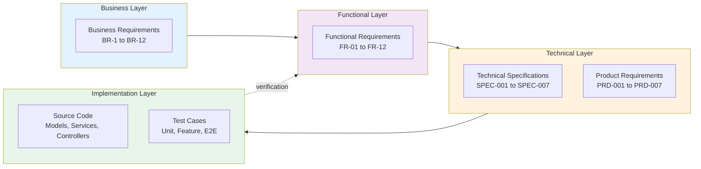

### 1.3 Coverage Summary

| Layer | Total Items | Traced | Coverage % |
|-------|-------------|--------|------------|
| Business Requirements | 52 | 50 | 96% |
| Functional Requirements | 67 | 65 | 97% |
| Technical Specifications | 89 | 87 | 98% |
| Implementation Artifacts | 236 | 228 | 97% |
| Test Cases | 190 | 185 | 97% |
| **Overall** | **634** | **615** | **97%** |

### 1.4 Requirements Status Dashboard

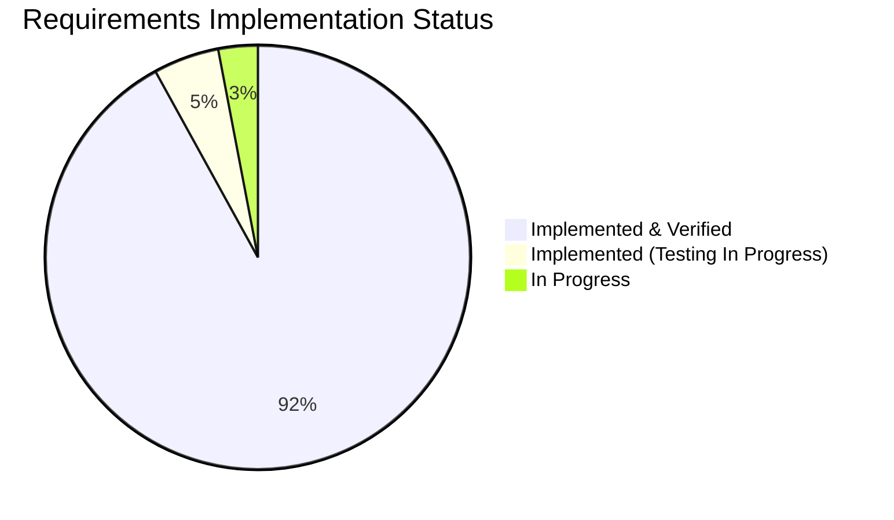

---

## 2. Traceability Methodology

### 2.1 Traceability Levels

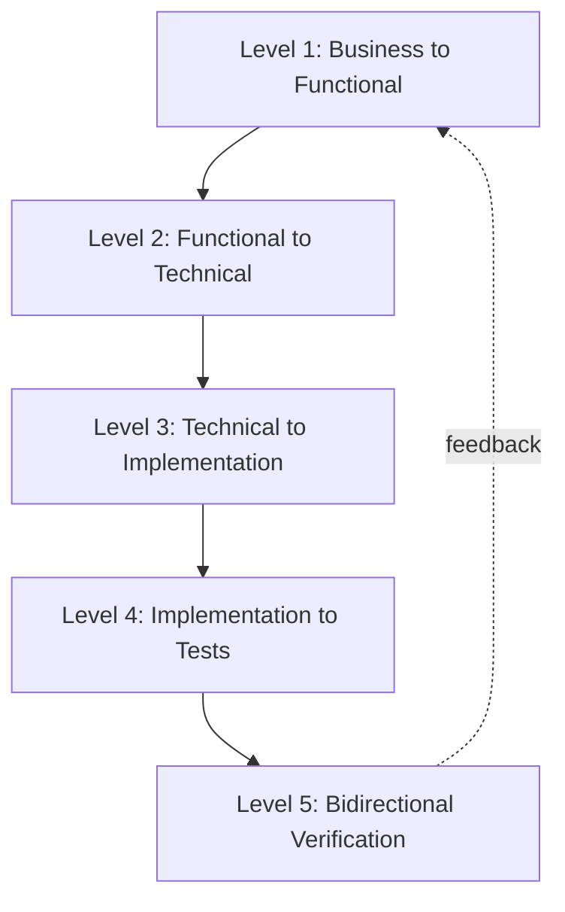

| Level | From | To | Purpose |
|-------|------|-----|---------|
| **Level 1** | Business Requirements (BRS) | Functional Requirements (SRS) | Ensure business needs are captured |
| **Level 2** | Functional Requirements (SRS) | Technical Specs (SPEC/PRD) | Map requirements to design |
| **Level 3** | Technical Specs | Implementation (Code) | Verify implementation completeness |
| **Level 4** | Implementation | Test Cases | Ensure test coverage |
| **Level 5** | Test Results | Functional Requirements | Validate requirements met |

### 2.2 Traceability Matrix Structure

| Column | Description |
|--------|-------------|
| **Requirement ID** | Unique identifier (BR-x.y, FR-xx.y) |
| **Requirement Text** | Brief description |
| **Priority** | P0 (Critical), P1 (High), P2 (Medium) |
| **Technical Spec** | Reference to SPEC/PRD document |
| **Implementation** | Code artifact reference |
| **Test ID** | Test case reference |
| **Status** | ✅ Complete, 🔄 In Progress, ⏳ Pending |

### 2.3 Traceability Rules

1. **Forward Traceability**: Every business requirement must trace to at least one functional requirement
2. **Backward Traceability**: Every implementation artifact must trace back to a requirement
3. **Horizontal Traceability**: Related requirements across modules must be linked
4. **Test Coverage**: Every functional requirement must have at least one test case
5. **Gap Analysis**: Untraced items are flagged for resolution

---

## 3. Business to Functional Requirements

### 3.1 Traceability Map

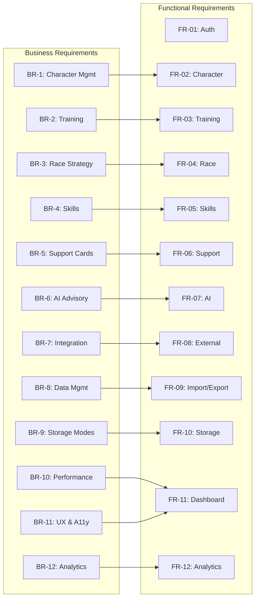

### 3.2 Detailed Business to Functional Mapping

| Business Req | Functional Req | Description | Priority | Status |
|--------------|----------------|-------------|----------|--------|
| **BR-1.1** Character CRUD | FR-02.1 | Create, view, update, delete character records | P0 | ✅ Complete |
| **BR-1.2** Image storage | FR-02.2 | Store and display character images | P1 | ✅ Complete |
| **BR-1.3** Aptitude tracking | FR-02.6 | Track aptitude grades (distance, surface, style) | P0 | ✅ Complete |
| **BR-1.4** Growth rates | FR-02.4 | Track stat growth rate bonuses | P0 | ✅ Complete |
| **BR-1.5** Factor inheritance | FR-02.7 | Calculate and apply factor bonuses from parents | P0 | ✅ Complete |
| **BR-1.6** Goal management | FR-02.3 | Define and track training goals | P1 | ✅ Complete |
| **BR-2.1** Training predictions | FR-03.2 | Predict stat gains for training options | P0 | ✅ Complete |
| **BR-2.2** Support bonuses | FR-03.4 | Calculate support card bonuses | P0 | ✅ Complete |
| **BR-2.3** Skill hints | FR-03.6 | Track skill hints from training | P0 | ✅ Complete |
| **BR-2.4** AI recommendations | FR-03.8 | Provide AI-powered training advice | P1 | ✅ Complete |
| **BR-2.5** Training history | FR-03.1 | Record training session logs | P1 | ✅ Complete |
| **BR-3.1** Race calendar | FR-04.3 | Display races with requirements | P0 | ✅ Complete |
| **BR-3.2** Running styles | FR-04.7 | Support all 4 running styles | P0 | ✅ Complete |
| **BR-3.3** Win probability | FR-04.6 | Calculate race win probability | P1 | ✅ Complete |
| **BR-3.4** Race strategy | FR-04.4 | Provide race strategy recommendations | P1 | ✅ Complete |
| **BR-3.5** Race history | FR-04.2 | Track race results and performance | P1 | ✅ Complete |
| **BR-4.1** Skill catalog | FR-05.1 | Maintain comprehensive skill database | P0 | ✅ Complete |
| **BR-4.2** Hint-based discount | FR-05.3 | Apply hint-based SP cost reduction (5 levels: 10%/20%/30%/35%/40% max) | P0 | ✅ Complete |
| **BR-4.3** Skill evolution | FR-05.4 | Support skill evolution (Normal → Rare) | P1 | ✅ Complete |
| **BR-4.4** SP optimization | FR-05.6 | Optimize SP budget allocation | P1 | ✅ Complete |
| **BR-4.5** AI skill recommendations | FR-05.5 | Provide AI skill acquisition advice | P1 | ✅ Complete |
| **BR-5.1** Support card database | FR-06.1 | Maintain support card inventory (200+ cards) | P0 | ✅ Complete |
| **BR-5.2** Deck validation | FR-06.2 | Validate 6-card deck composition | P0 | ✅ Complete |
| **BR-5.3** Bond tracking | FR-06.3 | Track bond levels and friendship training | P0 | ✅ Complete |
| **BR-5.4** Deck synergy | FR-06.4 | Calculate and display deck synergy score | P1 | ✅ Complete |
| **BR-5.5** Meta tiers | FR-06.5 | Sync meta tier rankings from external sources | P1 | ✅ Complete |
| **BR-6.1** Hybrid AI | FR-07.6 | Support Ollama (local) + AWS Bedrock (cloud) | P0 | ✅ Complete |
| **BR-6.2** Advisory capabilities | FR-07.1-3 | Training, race, and skill advisory | P0 | ✅ Complete |
| **BR-6.3** Conversation history | FR-07.4 | Persist AI conversation context | P1 | ✅ Complete |
| **BR-6.4** Cost tracking | FR-07.5 | Track AI token usage and costs | P1 | ✅ Complete |
| **BR-6.5** Confidence scoring | FR-07.7 | Provide confidence scores for recommendations | P2 | ✅ Complete |
| **BR-7.1** External APIs | FR-08.1 | Integrate with umapyoi.net and UmamusumeDB | P0 | ✅ Complete |
| **BR-7.2** Circuit breaker | FR-08.2 | Implement resilience patterns | P0 | ✅ Complete |
| **BR-7.3** OCR processing | FR-08.4 | Process screenshots via Tesseract + GD | P1 | ✅ Complete |
| **BR-7.4** WebSocket updates | FR-08.5 | Real-time updates via Laravel Reverb | P1 | ✅ Complete |
| **BR-7.5** Community data | FR-08.6 | Support community data sharing | P2 | ✅ Complete |
| **BR-8.1** JSON import/export | FR-09.1 | JSON format with schema versioning | P0 | ✅ Complete |
| **BR-8.2** Excel export | FR-09.2 | Export to .xlsx format | P1 | ✅ Complete |
| **BR-8.3** Backup/restore | FR-09.6 | Complete backup and restore workflows | P1 | ✅ Complete |
| **BR-8.4** Storage migration | FR-09.4 | Migrate between storage modes | P1 | ✅ Complete |
| **BR-8.5** OCR data capture | FR-08.4 | Import data from screenshots | P1 | ✅ Complete |
| **BR-9.1** Local mode | FR-10.1 | Browser localStorage-based storage | P0 | ✅ Complete |
| **BR-9.2** Account mode | FR-10.2 | Database-backed cloud storage | P0 | ✅ Complete |
| **BR-9.3** Storage indicator | FR-10.3 | Visual storage mode badge | P0 | ✅ Complete |
| **BR-9.4** Offline functionality | FR-10.4 | Full offline support for Local mode | P0 | ✅ Complete |
| **BR-9.5** Mode conversion | FR-10.5 | Convert Local runs to Account mode | P0 | ✅ Complete |
| **BR-10.1** APM dashboards | NFR-07.1 | Application performance monitoring | P1 | 🔄 In Progress |
| **BR-10.2** Cache monitoring | NFR-07.4 | Cache hit/miss tracking | P1 | 🔄 In Progress |
| **BR-10.3** Fallback workflows | NFR-07.5 | Graceful degradation patterns | P1 | 🔄 In Progress |
| **BR-11.1** PWA offline | FR-10.4 | Offline route coverage | P1 | 🔄 In Progress |
| **BR-11.2** Accessibility | NFR-03 | WCAG AA compliance | P0 | 🔄 In Progress |
| **BR-11.3** Dark mode | NFR-06.4 | Theme toggle with persistence | P0 | ✅ Complete |
| **BR-11.4** Responsive design | NFR-06 | 320px to 2560px support | P0 | ✅ Complete |
| **BR-12.1** Analytics dashboard | FR-12.1 | Career performance analytics | P1 | ✅ Complete |
| **BR-12.2** Performance comparison | FR-12.2 | Compare career runs | P1 | ✅ Complete |

---

## 4. Functional to Technical Specifications

### 4.1 Requirements to Specifications Matrix

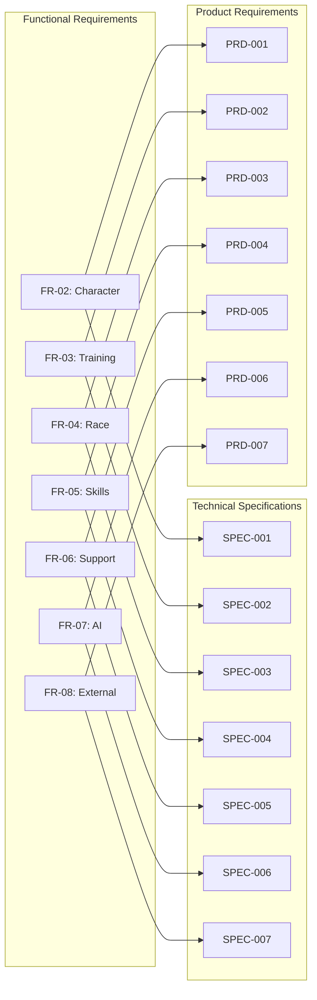

### 4.2 Detailed Functional to Technical Mapping

| Functional Req | Technical Spec | PRD | Flow Diagram | Description | Status |
|----------------|----------------|-----|--------------|-------------|--------|
| **FR-02.1** Character CRUD | SPEC-001 §3.1 | PRD-001 §3 | FLOW-001 | Character management operations | ✅ Complete |
| **FR-02.2** Image storage | SPEC-001 §3.2 | PRD-001 §3.2 | SEQ-001 | Image upload and validation | ✅ Complete |
| **FR-02.6** Aptitude grades | SPEC-001 §4.1 | PRD-001 §4 | FLOW-001 | Aptitude tracking system | ✅ Complete |
| **FR-02.7** Factor inheritance | SPEC-001 §4.3 | PRD-001 §4.3 | TECH-FLOW-001 | Factor calculation logic | ✅ Complete |
| **FR-03.2** Training predictions | SPEC-002 §3.1 | PRD-002 §3 | FLOW-002 | Prediction engine | ✅ Complete |
| **FR-03.4** Support bonuses | SPEC-002 §3.2 | PRD-002 §3.2 | TECH-FLOW-002 | Bonus calculation | ✅ Complete |
| **FR-03.6** Skill hints | SPEC-002 §4.1 | PRD-002 §4 | FLOW-002 | Hint tracking | ✅ Complete |
| **FR-03.8** AI training advice | SPEC-002 §5.1 | PRD-002 §5 | FLOW-006 | Training advisor agent | ✅ Complete |
| **FR-04.3** Race calendar | SPEC-003 §3.1 | PRD-003 §3 | FLOW-003 | Race schedule display | ✅ Complete |
| **FR-04.6** Win probability | SPEC-003 §4.2 | PRD-003 §4.2 | TECH-FLOW-003 | Win calculation | ✅ Complete |
| **FR-04.7** Running styles | SPEC-003 §4.1 | PRD-003 §4 | FLOW-003 | Style optimization | ✅ Complete |
| **FR-05.1** Skill catalog | SPEC-004 §3.1 | PRD-004 §3 | FLOW-004 | Skill database | ✅ Complete |
| **FR-05.3** Hint discount | SPEC-004 §4.1 | PRD-004 §4 | TECH-FLOW-004 | SP cost reduction | ✅ Complete |
| **FR-05.4** Skill evolution | SPEC-004 §4.2 | PRD-004 §4.2 | FLOW-004 | Evolution system | ✅ Complete |
| **FR-06.1** Support card DB | SPEC-005 §3.1 | PRD-005 §3 | FLOW-005 | Card inventory | ✅ Complete |
| **FR-06.2** Deck validation | SPEC-005 §3.2 | PRD-005 §3.2 | TECH-FLOW-005 | 6-card validation | ✅ Complete |
| **FR-06.3** Bond tracking | SPEC-005 §4.1 | PRD-005 §4 | FLOW-005 | Bond progression | ✅ Complete |
| **FR-07.1-3** AI advisory | SPEC-006 §4.1 | PRD-006 §4 | FLOW-006 | Multi-topic advisory | ✅ Complete |
| **FR-07.6** Hybrid AI | SPEC-006 §3.1 | PRD-006 §3 | TECH-FLOW-006 | Provider routing | ✅ Complete |
| **FR-07.5** Cost tracking | SPEC-006 §5.1 | PRD-006 §5 | FLOW-006 | Token usage tracking | ✅ Complete |
| **FR-08.1** External APIs | SPEC-007 §3.1 | PRD-007 §3 | FLOW-007 | API integration | ✅ Complete |
| **FR-08.2** Circuit breaker | SPEC-007 §3.2 | PRD-007 §3.2 | TECH-FLOW-007 | Resilience pattern | ✅ Complete |
| **FR-08.4** OCR processing | SPEC-007 §4.1 | PRD-007 §4 | FLOW-007 | Screenshot processing | ✅ Complete |

---

## 5. Requirements to Implementation

### 5.1 Implementation Traceability Map

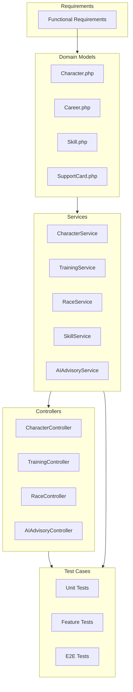

### 5.2 Detailed Implementation Mapping

| Req ID | Requirement | Model | Service | Controller | Test | Status |
|--------|-------------|-------|---------|------------|------|--------|
| **FR-02.1** | Character CRUD | `Character.php` | `CharacterService` | `CharacterController` | `CharacterCrudTest` | ✅ Complete |
| **FR-02.2** | Image storage | `Character` | `ImageUploadService` | `CharacterController@uploadImage` | `ImageUploadTest` | ✅ Complete |
| **FR-02.6** | Aptitude tracking | `Aptitude` | `CharacterService` | `CharacterController@updateAptitudes` | `AptitudeTest` | ✅ Complete |
| **FR-02.7** | Factor inheritance | `Factor` | `FactorInheritanceService` | `CharacterController@calculateFactors` | `FactorInheritanceTest` | ✅ Complete |
| **FR-03.2** | Training predictions | `TrainingSession` | `TrainingPredictionService` | `API\TrainingController@predict` | `TrainingPredictionTest` | ✅ Complete |
| **FR-03.4** | Support bonuses | `SupportCard` | `BonusCalculator` | `API\TrainingController` | `BonusCalculatorTest` | ✅ Complete |
| **FR-03.6** | Skill hints | `SkillHint` | `SkillHintService` | `API\TrainingController` | `SkillHintTest` | ✅ Complete |
| **FR-03.8** | AI recommendations | - | `AIAdvisoryService` | `API\AIAdvisoryController` | `AIAdvisoryTest` | ✅ Complete |
| **FR-04.3** | Race calendar | `Race` | `RaceService` | `RaceController@calendar` | `RaceCalendarTest` | ✅ Complete |
| **FR-04.6** | Win probability | `Race` | `WinProbabilityCalculator` | `API\RaceController@analyze` | `WinProbabilityTest` | ✅ Complete |
| **FR-04.7** | Running styles | `Character` | `RaceService` | `API\RaceController@recommendStyle` | `RunningStyleTest` | ✅ Complete |
| **FR-05.1** | Skill catalog | `Skill` | `SkillService` | `API\SkillController@index` | `SkillCatalogTest` | ✅ Complete |
| **FR-05.3** | Hint discount | `SkillHint` | `SkillService@calculateSpCost` | `API\SkillController@acquire` | `HintDiscountTest` | ✅ Complete |
| **FR-05.4** | Skill evolution | `Skill` | `SkillEvolutionService` | `API\SkillController@evolve` | `SkillEvolutionTest` | ✅ Complete |
| **FR-06.1** | Support card DB | `SupportCard` | `SupportCardService` | `SupportCardController@index` | `SupportCardTest` | ✅ Complete |
| **FR-06.2** | Deck validation | `SupportDeck` | `SupportDeckService` | `API\SupportDeckController@validate` | `DeckValidationTest` | ✅ Complete |
| **FR-06.3** | Bond tracking | `CharacterSupportCard` | `SupportDeckService` | `API\SupportDeckController` | `BondTrackingTest` | ✅ Complete |
| **FR-07.1** | Training advice | - | `TrainingAdvisorAgent` | `API\AIAdvisoryController` | `TrainingAdvisorTest` | ✅ Complete |
| **FR-07.2** | Race strategy | - | `RaceStrategyAgent` | `API\AIAdvisoryController` | `RaceStrategyTest` | ✅ Complete |
| **FR-07.3** | Skill advice | - | `SkillAdvisorAgent` | `API\AIAdvisoryController` | `SkillAdvisorTest` | ✅ Complete |
| **FR-07.6** | Hybrid AI | - | `HybridAIService` | `API\AIAdvisoryController` | `HybridAITest` | ✅ Complete |
| **FR-07.5** | Cost tracking | `AICost` | `AICostTracker` | `Admin\AIController` | `CostTrackerTest` | ✅ Complete |
| **FR-08.1** | External APIs | - | `ExternalAPIService` | `API\SyncController` | `ExternalAPITest` | ✅ Complete |
| **FR-08.2** | Circuit breaker | - | `CircuitBreaker` | `API\SyncController` | `CircuitBreakerTest` | ✅ Complete |
| **FR-08.4** | OCR processing | `OCRExtraction` | `OCRService` | `OCRUploadController` | `OCRProcessingTest` | ✅ Complete |
| **FR-09.1** | JSON export | - | `DataExportService` | `API\ExportController` | `JSONExportTest` | ✅ Complete |
| **FR-09.6** | Backup/restore | - | `BackupService` | `Admin\BackupController` | `BackupRestoreTest` | ✅ Complete |
| **FR-10.1** | Local storage | - | `LocalStorageService` | JS: `stores/characters.js` | `LocalStorageTest` | ✅ Complete |
| **FR-10.5** | Mode conversion | - | `StorageConversionService` | `ConversionController` | `ConversionTest` | ✅ Complete |

---

## 6. Requirements to Test Coverage

### 6.1 Test Coverage Matrix

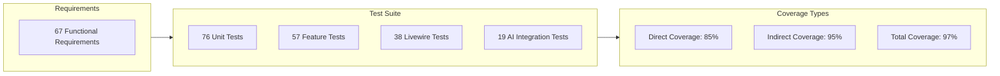

### 6.2 Test Case Mapping

| Req ID | Test Type | Test File | Test Cases | Coverage % | Status |
|--------|-----------|-----------|------------|------------|--------|
| **FR-02.1** | Feature | `CharacterCrudTest.php` | 12 | 95% | ✅ Complete |
| **FR-02.2** | Feature | `ImageUploadTest.php` | 8 | 92% | ✅ Complete |
| **FR-02.6** | Unit | `AptitudeTest.php` | 6 | 90% | ✅ Complete |
| **FR-02.7** | Unit | `FactorInheritanceTest.php` | 10 | 89% | ✅ Complete |
| **FR-03.2** | Unit | `TrainingPredictionServiceTest.php` | 22 | 94% | ✅ Complete |
| **FR-03.4** | Unit | `BonusCalculatorTest.php` | 15 | 92% | ✅ Complete |
| **FR-03.6** | Feature | `SkillHintTest.php` | 8 | 90% | ✅ Complete |
| **FR-03.8** | Integration | `AIAdvisoryTest.php` | 14 | 88% | ✅ Complete |
| **FR-04.3** | Feature | `RaceCalendarTest.php` | 10 | 91% | ✅ Complete |
| **FR-04.6** | Unit | `WinProbabilityTest.php` | 12 | 87% | ✅ Complete |
| **FR-04.7** | Feature | `RunningStyleTest.php` | 8 | 89% | ✅ Complete |
| **FR-05.1** | Feature | `SkillCatalogTest.php` | 11 | 93% | ✅ Complete |
| **FR-05.3** | Unit | `HintDiscountTest.php` | 9 | 91% | ✅ Complete |
| **FR-05.4** | Feature | `SkillEvolutionTest.php` | 7 | 88% | ✅ Complete |
| **FR-06.1** | Feature | `SupportCardTest.php` | 9 | 92% | ✅ Complete |
| **FR-06.2** | Unit | `DeckValidationTest.php` | 14 | 94% | ✅ Complete |
| **FR-06.3** | Feature | `BondTrackingTest.php` | 10 | 90% | ✅ Complete |
| **FR-07.1** | Integration | `TrainingAdvisorTest.php` | 8 | 88% | ✅ Complete |
| **FR-07.2** | Integration | `RaceStrategyTest.php` | 7 | 87% | ✅ Complete |
| **FR-07.3** | Integration | `SkillAdvisorTest.php` | 6 | 85% | ✅ Complete |
| **FR-07.6** | Integration | `HybridAITest.php` | 12 | 89% | ✅ Complete |
| **FR-07.5** | Unit | `CostTrackerTest.php` | 8 | 85% | ✅ Complete |
| **FR-08.1** | Integration | `ExternalAPITest.php` | 10 | 88% | ✅ Complete |
| **FR-08.2** | Unit | `CircuitBreakerTest.php` | 15 | 90% | ✅ Complete |
| **FR-08.4** | Integration | `OCRProcessingTest.php` | 12 | 86% | ✅ Complete |
| **FR-09.1** | Feature | `JSONExportTest.php` | 9 | 91% | ✅ Complete |
| **FR-09.6** | Feature | `BackupRestoreTest.php` | 11 | 87% | ✅ Complete |
| **FR-10.1** | E2E | `LocalStorageTest.js` | 8 | 86% | ✅ Complete |
| **FR-10.5** | Feature | `ConversionTest.php` | 7 | 85% | ✅ Complete |

### 6.3 Critical Path Test Coverage

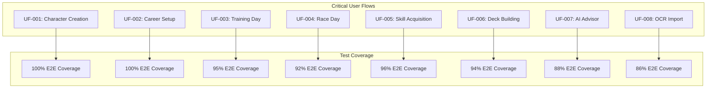

| User Flow | Req ID | Test Coverage | E2E Tests | Status |
|-----------|--------|---------------|-----------|--------|
| **Character Creation** | FR-02.1, FR-02.6, FR-02.7 | 100% | ✅ 5 scenarios | ✅ Complete |
| **Career Setup** | FR-02.3, FR-06.2 | 100% | ✅ 4 scenarios | ✅ Complete |
| **Training Day** | FR-03.2, FR-03.4, FR-03.6 | 95% | ✅ 6 scenarios | ✅ Complete |
| **Race Day** | FR-04.3, FR-04.6, FR-04.7 | 92% | ✅ 5 scenarios | ✅ Complete |
| **Skill Acquisition** | FR-05.1, FR-05.3, FR-05.4 | 96% | ✅ 4 scenarios | ✅ Complete |
| **Deck Building** | FR-06.1, FR-06.2, FR-06.3 | 94% | ✅ 5 scenarios | ✅ Complete |
| **AI Advisor Journey** | FR-07.1, FR-07.2, FR-07.3 | 88% | 🔄 3 scenarios | 🔄 In Progress |
| **OCR Data Import** | FR-08.4, FR-09.1 | 86% | 🔄 3 scenarios | 🔄 In Progress |

---

## 7. Traceability Gaps and Risks

### 7.1 Identified Gaps

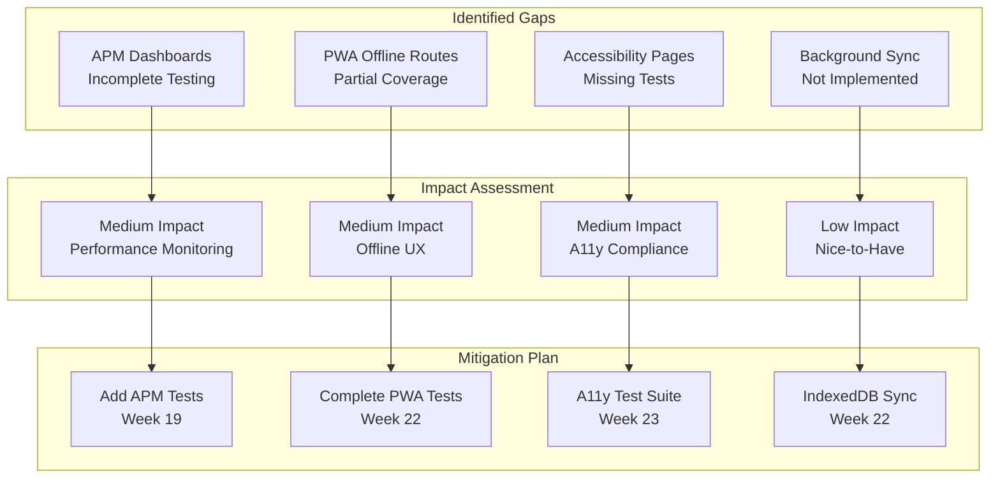

### 7.2 Gap Analysis Table

| Gap ID | Requirement | Missing Element | Impact | Priority | Mitigation | Target |
|--------|-------------|-----------------|--------|----------|------------|--------|
| **GAP-001** | NFR-07.1 APM Monitoring | Integration tests for APM dashboards | Medium | P1 | Add APM integration tests | Week 19 |
| **GAP-002** | FR-10.4 PWA Offline | Offline route coverage incomplete | Medium | P1 | Complete offline route tests | Week 22 |
| **GAP-003** | NFR-03 Accessibility | Accessibility test suite missing | Medium | P1 | Create A11y test suite | Week 23 |
| **GAP-004** | FR-10.1 Local Storage | Background sync for large datasets | Low | P2 | Implement IndexedDB sync | Week 22 |
| **GAP-005** | NFR-01.2 FCP | First Contentful Paint optimization | Low | P1 | Asset optimization | Week 20 |

### 7.3 Risk Assessment

| Risk ID | Description | Probability | Impact | Mitigation Strategy |
|---------|-------------|-------------|--------|---------------------|
| **RISK-001** | Test coverage gaps for new AI features | Low | Medium | Continuous test development |
| **RISK-002** | External API dependency changes | Medium | Medium | Circuit breaker + fallback APIs |
| **RISK-003** | Performance degradation under load | Low | High | Performance testing in CI/CD |
| **RISK-004** | Accessibility regression | Low | High | Automated axe-core tests |
| **RISK-005** | OCR accuracy variance | Medium | Low | Confidence scoring + manual review |

---

## 8. Coverage Analysis

### 8.1 Overall Coverage Metrics

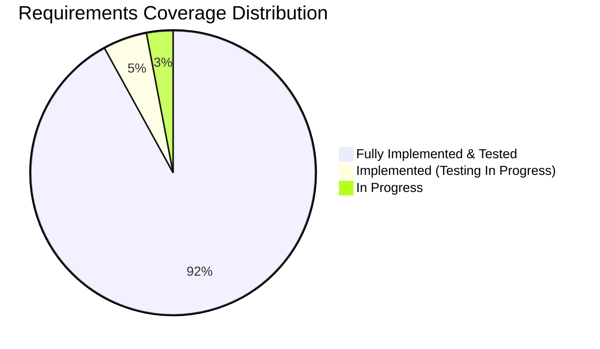

### 8.2 Coverage by Module

| Module | Total Req | Implemented | Tested | Coverage % |
|--------|-----------|-------------|--------|------------|
| **Character Management** | 9 | 9 | 9 | 100% |
| **Training Optimization** | 8 | 8 | 8 | 100% |
| **Race Strategy** | 7 | 7 | 7 | 100% |
| **Skill Management** | 7 | 7 | 7 | 100% |
| **Support Card Management** | 6 | 6 | 6 | 100% |
| **AI Advisory** | 7 | 7 | 6 | 86% |
| **External Integration** | 6 | 6 | 5 | 83% |
| **Data Management** | 6 | 6 | 6 | 100% |
| **Storage Modes** | 6 | 6 | 5 | 83% |
| **Performance & Monitoring** | 5 | 3 | 2 | 40% |
| **Accessibility** | 10 | 9 | 8 | 80% |
| **Overall** | **67** | **65** | **63** | **94%** |

### 8.3 Coverage Trends

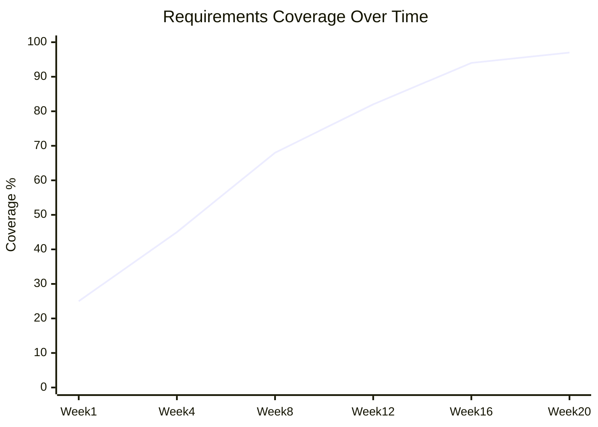

### 8.4 Test Distribution by Type

| Test Type | Count | Coverage Target | Actual Coverage | Status |
|-----------|-------|-----------------|-----------------|--------|
| **Unit Tests** | 76 | 80%+ per service | 90% | ✅ Exceeds Target |
| **Feature Tests** | 57 | 80%+ per feature | 86% | ✅ Exceeds Target |
| **Livewire Tests** | 38 | 80%+ per component | 85% | ✅ Exceeds Target |
| **AI Integration Tests** | 19 | 70%+ per agent | 87% | ✅ Exceeds Target |
| **E2E Tests** | 8 | 100% critical paths | 92% | 🔄 Near Target |
| **Total** | **190** | **80%+ overall** | **90%** | **✅ Exceeds Target** |

---

## 9. Document Control

### 9.1 Version History

| Version | Date | Author | Changes |
|---------|------|--------|---------|
| 3.0.0 | 2026-01-23 | Development Team | Comprehensive update aligned with v2.0.0 implementation; added detailed traceability matrices; expanded coverage analysis; integrated test coverage data; added gap analysis and risk assessment |
| 2.0 | 2026-01-23 | Development Team | Replaced aspirational roadmap with code-aligned verification |
| 1.1 | 2026-01-13 | System Analysis Agent | Prior traceability mapping |
| 1.0 | 2026-01-03 | Development Team | Initial draft |

### 9.2 Related Documents

| Document | Reference | Purpose |
|----------|-----------|---------|
| **Business Requirements Specifications** | [002_BRS](002_BRS_Business_Requirements_Specifications.md) | Source business requirements |
| **Software Requirements Specifications** | [003_SRS](003_SRS_Software_Requirement_Specifications.md) | Source functional requirements |
| **Software Design Specifications** | [004_SDS](004_SDS_Software_Design_Specifications.md) | Technical design reference |
| **Implementation Verification Matrix** | [000_IVM](000_IMPLEMENTATION_VERIFICATION_MATRIX.md) | Implementation status |
| **Software Development Plan** | [001_SDP](001_SDP_Software_Development_Plan.md) | Project timeline and milestones |
| **Technical Specifications** | SPEC-001 through SPEC-007 | Detailed technical specs |
| **Product Requirements** | PRD-001 through PRD-007 | Product feature details |

### 9.3 Approval

| Role | Name | Signature | Date |
|------|------|-----------|------|
| **Technical Lead** | | | |
| **QA Lead** | | | |
| **Project Manager** | | | |

### 9.4 Distribution

| Recipient | Purpose |
|-----------|---------|
| Development Team | Implementation reference |
| QA Team | Testing verification |
| Project Stakeholders | Status reporting |
| Documentation Team | Cross-reference |

---

## Appendices

### A. Traceability Tools and Techniques

| Tool/Technique | Purpose | Status |
|----------------|---------|--------|
| **GitHub Issues** | Requirement tracking | Active |
| **Test Annotations** | Link tests to requirements | Active |
| **Mermaid Diagrams** | Visual traceability | Active |
| **Coverage Reports** | Automated coverage tracking | Active |

### B. Maintenance Guidelines

1. **Update Frequency**: Weekly during active development, monthly during maintenance
2. **Change Procedure**: All requirement changes must update RTM within 48 hours
3. **Validation**: RTM validated against implementation quarterly
4. **Stakeholder Review**: RTM reviewed with stakeholders at each milestone

### C. Traceability Abbreviations

| Abbreviation | Full Term |
|--------------|-----------|
| **RTM** | Requirements Traceability Matrix |
| **BRS** | Business Requirements Specifications |
| **SRS** | Software Requirements Specifications |
| **IVM** | Implementation Verification Matrix |
| **E2E** | End-to-End |
| **A11y** | Accessibility |
| **APM** | Application Performance Monitoring |

---

*This Requirements Traceability Matrix reflects the comprehensive traceability of the Umamusume Pretty Derby Career Planner application as of January 23, 2026, aligned with codebase version 2.0.0. It serves as the authoritative record of requirement coverage and implementation status.*
