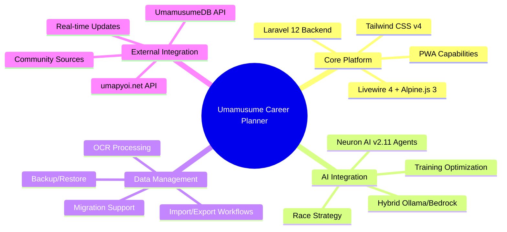
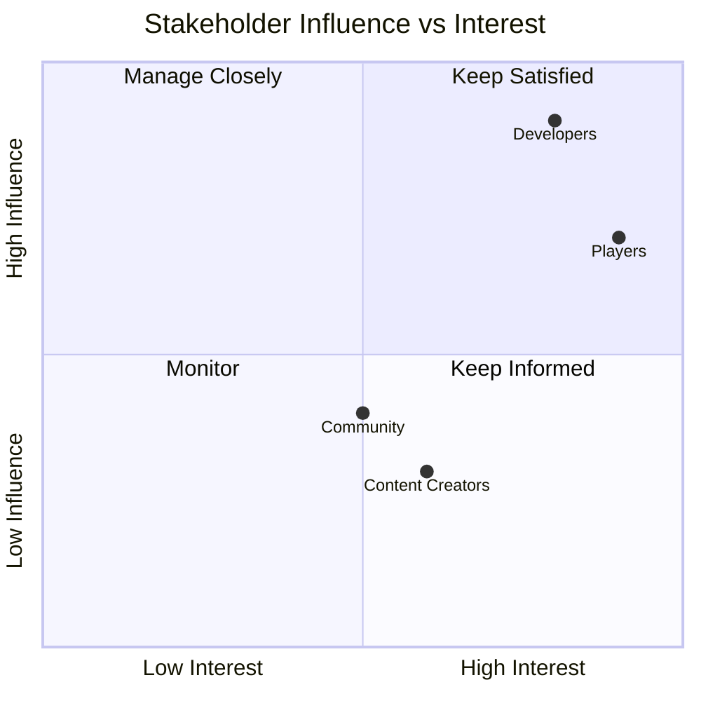
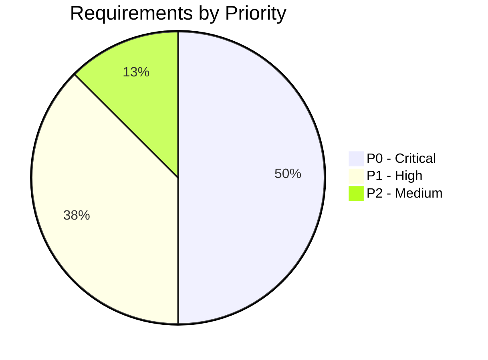
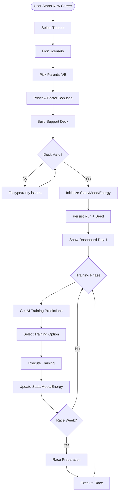
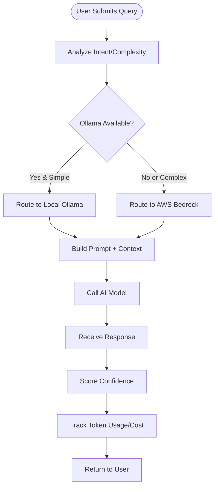
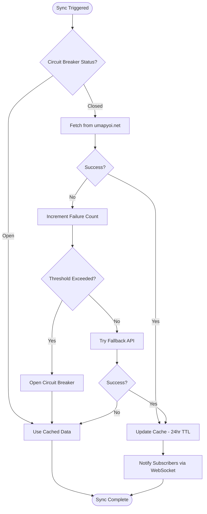
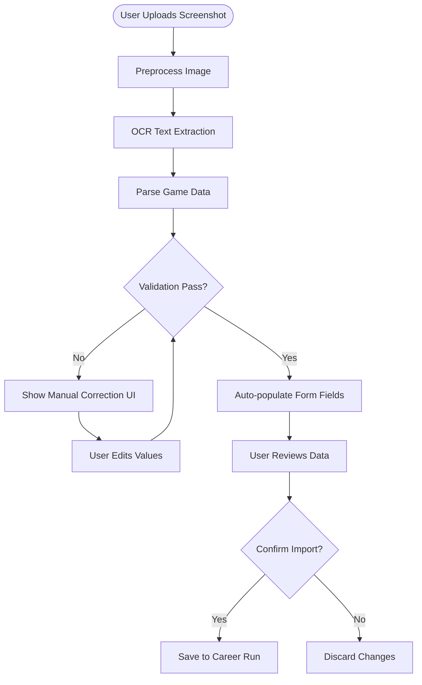
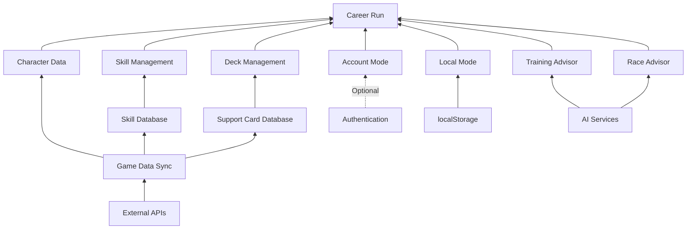

# Business Requirements Specifications (BRS)

## Umamusume Pretty Derby Career Planner

**Document Version**: 2.3.0
**Date**: February 21, 2026
**Project**: UmamusumeCareerPlanner
**Author**: Development Team
**Status**: Current - Aligned with codebase v2.3.0 and game-accurate mechanics

---

## Table of Contents

1. [Introduction](#1-introduction)
2. [Business Context](#2-business-context)
3. [Stakeholder Analysis](#3-stakeholder-analysis)
4. [Business Requirements](#4-business-requirements)
5. [Business Rules](#5-business-rules)
6. [Business Process Flows](#6-business-process-flows)
7. [Success Metrics](#7-success-metrics)
8. [Constraints and Assumptions](#8-constraints-and-assumptions)
9. [Dependencies](#9-dependencies)
10. [Document Control](#10-document-control)

---

## 1. Introduction

### 1.1 Purpose

This document defines the business objectives and current scope for the Umamusume Pretty Derby Career Planner application. It establishes the business context, stakeholder needs, and high-level requirements that guide the technical implementation.

### 1.2 Scope

The Umamusume Career Planner is a comprehensive web application built with **Laravel 12** (released February 24, 2025), **Livewire 4**, **Alpine.js 3**, **Tailwind CSS v4** (released January 22, 2025), and integrates with **AWS Bedrock Claude 4.5** models and **Ollama** for AI capabilities via **Neuron AI v2.11**. The system enables players of Uma Musume: Pretty Derby to track, manage, and optimize their career progression through intelligent recommendations and analytics.

### 1.3 Definitions and Acronyms

| Term | Definition |
|------|------------|
| Plan/Career Run | A career run record tracking an Uma Musume character's training progression |
| Uma Musume | A horse girl character from the Uma Musume: Pretty Derby game |
| SP (Skill Points) | Points earned from races and events, spent to purchase skills |
| Stat Soft Cap | Soft cap at 1200 - stats above 1200 count for 50% value (diminishing returns) |
| URA Finale | The final race series at the end of Senior Year |
| OCR | Optical Character Recognition for screenshot data extraction |
| MCP | Model Context Protocol for AI integration |

---

## 2. Business Context

### 2.1 Business Problem

Players of Uma Musume: Pretty Derby currently lack a comprehensive, unified tool to:

- Track character training progression across multiple career runs
- Plan skill acquisitions and race strategies with AI-powered recommendations
- Analyze training effectiveness and outcomes with predictive analytics
- Export and share training records
- Access data across devices or offline
- Receive intelligent advisory for optimal training decisions

### 2.2 Business Opportunity

By providing a modern, AI-enhanced planning platform, we can:

- Deliver superior user experience with modern web technologies (Laravel 12, Livewire 4, Tailwind CSS v4)
- Enable offline-first usage for players without reliable connectivity
- Support cross-device access for authenticated users
- Improve accessibility for users with disabilities (WCAG AA compliance)
- Provide AI-powered training optimization and race strategy recommendations
- Integrate external game data sources for accurate planning

### 2.3 Business Objectives

| Objective | Success Metric |
|-----------|----------------|
| User Adoption | Active users tracking plans |
| Data Migration | Successful import of legacy data |
| Accessibility | WCAG AA compliance |
| Performance | Page load < 2 seconds |
| Reliability | 99% uptime for Account mode |
| AI Advisory | Response times within configured timeouts |

### 2.4 Value Proposition

---

## 3. Stakeholder Analysis

### 3.1 Primary Stakeholders

#### 3.1.1 Players (End Users)

**Needs:**

- Quick and easy plan creation with AI recommendations
- Offline access to data via PWA
- Cross-device synchronization
- Data export for sharing/backup
- Accessible interface (WCAG AA compliant)
- Intelligent training and race strategy guidance

**Pain Points:**

- Current tools are fragmented
- No AI-powered optimization
- Poor mobile experience
- Data locked in single application

#### 3.1.2 Developers/Maintainers

**Needs:**

- Single codebase to maintain
- Modern, well-documented architecture
- Comprehensive test coverage
- Clear development standards
- Monitoring and observability

### 3.2 Stakeholder Map

---

## 4. Business Requirements

### 4.1 Character Management [BR-1]

**Business Need:** Players need to manage their Uma Musume character roster with complete information.

| ID | Requirement | Priority | Status |
|----|-------------|----------|--------|
| BR-1.1 | Create, view, update, and delete character records | P0 | Implemented |
| BR-1.2 | Store character images with visual preview | P1 | Implemented |
| BR-1.3 | Track aptitude grades for terrain, distance, and style | P0 | Implemented |
| BR-1.4 | Track growth rate bonuses for all five stats | P0 | Implemented |
| BR-1.5 | Factor inheritance system with stat/aptitude bonuses | P0 | Implemented |
| BR-1.6 | Goal management and progress tracking | P1 | Implemented |

**Related Artifacts:**

- PRD: [PRD-001](prds/PRD-001_Character_Management.md)
- SPEC: [SPEC-001](specs/SPEC-001_Character_Management_Technical.md)
- Flow: [FLOW-001](flows/FLOW-001_Character_Management_System.md)
- Wireframes: [WF-002](wireframes/WF-002_Character_Creation_Wizard.md), [WF-003](wireframes/WF-003_Character_Detail_Management.md)

### 4.2 Training Optimization [BR-2]

**Business Need:** Players need intelligent training recommendations and predictions.

| ID | Requirement | Priority | Status |
|----|-------------|----------|--------|
| BR-2.1 | Training prediction engine with stat gain calculations | P0 | Implemented |
| BR-2.2 | Support card bonus integration | P0 | Implemented |
| BR-2.3 | Skill hint tracking and SP cost reduction | P0 | Implemented |
| BR-2.4 | AI-powered training recommendations | P0 | Implemented |
| BR-2.5 | Training session history and analytics | P1 | Implemented |

**Related Artifacts:**

- PRD: [PRD-002](prds/PRD-002_Training_Optimization.md)
- SPEC: [SPEC-002](specs/SPEC-002_Training_Optimization_Technical.md)
- Flow: [FLOW-002](flows/FLOW-002_Training_Optimization_System.md)
- Wireframes: [WF-004](wireframes/WF-004_Training_Selection_Interface.md), [WF-005](wireframes/WF-005_Training_Result_Screen.md)

### 4.3 Race Strategy [BR-3]

**Business Need:** Players need race preparation guidance and strategy optimization.

| ID | Requirement | Priority | Status |
|----|-------------|----------|--------|
| BR-3.1 | Race calendar with requirements and readiness scoring | P0 | Implemented |
| BR-3.2 | Running style optimization (4 styles) | P0 | Implemented |
| BR-3.3 | Win probability calculation | P1 | Implemented |
| BR-3.4 | AI-powered race strategy recommendations | P0 | Implemented |
| BR-3.5 | Race history and performance analytics | P1 | Implemented |

**Related Artifacts:**

- PRD: [PRD-003](prds/PRD-003_Race_Strategy.md)
- SPEC: [SPEC-003](specs/SPEC-003_Race_Strategy_Technical.md)
- Flow: [FLOW-003](flows/FLOW-003_Race_Strategy_System.md)
- Wireframes: [WF-006](wireframes/WF-006_Race_Calendar_View.md), [WF-007](wireframes/WF-007_Race_Preparation_Screen.md)

### 4.4 Skill Management [BR-4]

**Business Need:** Players need to plan and track skill acquisitions efficiently.

| ID | Requirement | Priority | Status |
|----|-------------|----------|--------|
| BR-4.1 | Skill catalog with search (English and Japanese) | P0 | Implemented |
| BR-4.2 | Hint-based SP cost reduction (5 levels: 10%/20%/30%/35%/40% max) | P0 | Implemented |
| BR-4.3 | Skill evolution system (Normal → Rare) | P0 | Implemented |
| BR-4.4 | SP budget optimization | P1 | Implemented |
| BR-4.5 | AI skill build recommendations | P1 | Implemented |

**Related Artifacts:**

- PRD: [PRD-004](prds/PRD-004_Skill_Management.md)
- SPEC: [SPEC-004](specs/SPEC-004_Skill_Management_Technical.md)
- Flow: [FLOW-004](flows/FLOW-004_Skill_Management_System.md)
- Wireframes: [WF-008](wireframes/WF-008_Skill_Shop_Interface.md), [WF-009](wireframes/WF-009_Skill_Loadout_Manager.md)

### 4.5 Support Card Management [BR-5]

**Business Need:** Players need to optimize support card decks for training.

| ID | Requirement | Priority | Status |
|----|-------------|----------|--------|
| BR-5.1 | Support card database (200+ cards with meta tiers) | P0 | Implemented |
| BR-5.2 | Deck composition validator (6-card deck) | P0 | Implemented |
| BR-5.3 | Bond level and limit break tracking | P0 | Implemented |
| BR-5.4 | Deck synergy scoring and recommendations | P1 | Implemented |
| BR-5.5 | Meta tier synchronization from external sources | P1 | Implemented |

**Related Artifacts:**

- PRD: [PRD-005](prds/PRD-005_Support_Card_Management.md)
- SPEC: [SPEC-005](specs/SPEC-005_Support_Card_Management_Technical.md)
- Flow: [FLOW-005](flows/FLOW-005_Support_Card_Management_System.md)
- Wireframes: [WF-010](wireframes/WF-010_Support_Card_Collection.md), [WF-011](wireframes/WF-011_Support_Deck_Builder.md)

### 4.6 AI Advisory System [BR-6]

**Business Need:** Players need intelligent recommendations across all planning aspects.

| ID | Requirement | Priority | Status |
|----|-------------|----------|--------|
| BR-6.1 | Hybrid AI architecture (Ollama local + AWS Bedrock fallback) | P0 | Implemented |
| BR-6.2 | Training, race, and skill advisory capabilities | P0 | Implemented |
| BR-6.3 | Conversation history management | P1 | Implemented |
| BR-6.4 | Cost tracking and budget management for cloud AI | P1 | Implemented |
| BR-6.5 | Confidence scoring for recommendations | P1 | Implemented |

**Related Artifacts:**

- PRD: [PRD-006](prds/PRD-006_AI_Advisory.md)
- SPEC: [SPEC-006](specs/SPEC-006_AI_Advisory_Technical.md)
- Flow: [FLOW-006](flows/FLOW-006_AI_Advisory_System.md)
- Wireframes: [WF-012](wireframes/WF-012_AI_Advisor_Interface.md)

### 4.7 External Integration [BR-7]

**Business Need:** Players need accurate, up-to-date game data from external sources.

| ID | Requirement | Priority | Status |
|----|-------------|----------|--------|
| BR-7.1 | External API integration (umapyoi.net, UmamusumeDB) | P0 | Implemented |
| BR-7.2 | Circuit breaker pattern for resilience | P0 | Implemented |
| BR-7.3 | OCR screenshot processing | P1 | Implemented |
| BR-7.4 | WebSocket real-time updates (Laravel Reverb) | P1 | Implemented |
| BR-7.5 | Community data sharing | P2 | Implemented |

**Related Artifacts:**

- PRD: [PRD-007](prds/PRD-007_External_Integration.md)
- SPEC: [SPEC-007](specs/SPEC-007_External_Integration_Technical.md)
- Flow: [FLOW-007](flows/FLOW-007_External_Integration_System.md)

### 4.8 Data Management [BR-8]

**Business Need:** Players need reliable data import, export, and backup capabilities.

| ID | Requirement | Priority | Status |
|----|-------------|----------|--------|
| BR-8.1 | JSON import/export with schema versioning | P0 | Implemented |
| BR-8.2 | Excel export (.xlsx) | P1 | Implemented |
| BR-8.3 | Backup and restore workflows | P0 | Implemented |
| BR-8.4 | Data migration between storage modes | P1 | Implemented |
| BR-8.5 | OCR-based data capture and validation | P1 | Implemented |

### 4.9 Dual Storage Mode [BR-9]

**Business Need:** Players need flexibility in how their data is stored and accessed.

| ID | Requirement | Priority | Status |
|----|-------------|----------|--------|
| BR-9.1 | Local storage mode (browser localStorage) | P0 | Implemented |
| BR-9.2 | Account storage mode (database) | P0 | Implemented |
| BR-9.3 | Clear visual indication of storage mode | P0 | Implemented |
| BR-9.4 | Full offline functionality for Local runs | P0 | Implemented |
| BR-9.5 | Convert Local runs to Account runs | P0 | Implemented |
| BR-9.6 | Local data management interface | P1 | Implemented |

### 4.10 Performance and Reliability [BR-10]

**Business Need:** System must be performant and reliable for power users.

| ID | Requirement | Priority | Status |
|----|-------------|----------|--------|
| BR-10.1 | APM and performance dashboards | P1 | In Progress |
| BR-10.2 | Cache monitoring and invalidation | P1 | In Progress |
| BR-10.3 | Fallback and degradation workflows | P1 | In Progress |
| BR-10.4 | Page load < 2 seconds | P0 | Implemented |

### 4.11 User Experience and Accessibility [BR-11]

**Business Need:** Application must be accessible and provide excellent UX.

| ID | Requirement | Priority | Status |
|----|-------------|----------|--------|
| BR-11.1 | PWA offline route coverage | P1 | In Progress |
| BR-11.2 | Accessibility pages and keyboard shortcuts | P1 | In Progress |
| BR-11.3 | Dark/Light mode toggle with persistence | P0 | Implemented |
| BR-11.4 | Responsive design (320px to 2560px) | P0 | Implemented |
| BR-11.5 | WCAG AA accessibility compliance | P0 | Implemented |

### 4.12 Requirements Priority Matrix

---

## 5. Business Rules

### 5.1 Data Validation Rules

| Rule ID | Rule Description |
|---------|------------------|
| BV-1 | Plan title is required and cannot be empty |
| BV-2 | Stat values have soft cap at 1200 (50% effectiveness above), practical max ~1600 |
| BV-3 | Turn numbers must be between 1 and 78 |
| BV-4 | Skill status "Acquired" requires turn_acquired value |
| BV-5 | Energy level must be between 0 and 100 |
| BV-6 | Support deck must contain exactly 6 cards (5 owned + 1 borrowed) |
| BV-7 | Skill hint levels cap at 5 (40% maximum discount: 10%/20%/30%/35%/40%) |

### 5.2 Calculation Rules

| Rule ID | Rule Description |
|---------|------------------|
| BC-1 | Stat soft cap at 1200 (values above count for 50%, practical max ~1600) |
| BC-2 | Acquired SP = sum of sp_cost where status = acquired |
| BC-3 | Mood modifiers: Great +4%, Good +2%, Normal 0%, Bad -2%, Awful -4% |
| BC-4 | Aptitude effectiveness: S=+5% (max), A=0% (baseline), B=-10%, C=-20%, D=-30%/-40%, E=-50%/-60%, F=-70%/-80%, G=-90% |
| BC-5 | Skill hint discount: Level 1=10%, Level 2=20%, Level 3=30%, Level 4=35%, Level 5=40% (max) |
| BC-6 | Factor inheritance: ★☆☆=+5, ★★☆=+12, ★★★=+21 bonus |

### 5.3 Storage Rules

| Rule ID | Rule Description |
|---------|------------------|
| BS-1 | Local runs use UUID identifiers |
| BS-2 | Account runs use database integer IDs |
| BS-3 | Local runs are fully functional offline |
| BS-4 | Account runs require network connectivity to save |
| BS-5 | Drafts are always saved to localStorage regardless of storage mode |
| BS-6 | External API data cached for 24 hours |
| BS-7 | Training predictions cached for 5 minutes |

### 5.4 AI Advisory Rules

| Rule ID | Rule Description |
|---------|------------------|
| BA-1 | Local Ollama model used as primary for simple queries |
| BA-2 | AWS Bedrock used as fallback for complex decisions or local unavailability |
| BA-3 | AI responses include confidence scores |
| BA-4 | Token usage tracked for cost management |
| BA-5 | Conversation context maintained per session |

---

## 6. Business Process Flows

### 6.1 Career Planning Flow

### 6.2 AI Advisory Flow

### 6.3 External Data Sync Flow

### 6.4 OCR Data Capture Flow

---

## 7. Success Metrics

### 7.1 User Experience Metrics

| Metric | Target | Measurement Method |
|--------|--------|-------------------|
| Time to create first plan | < 30 seconds | User testing |
| Task completion rate | > 95% | Analytics |
| User satisfaction | > 4/5 stars | Surveys |
| AI recommendation acceptance rate | > 70% | Analytics |

### 7.2 Technical Metrics

| Metric | Target | Measurement Method |
|--------|--------|-------------------|
| Page load time | < 2 seconds | Performance monitoring |
| First Contentful Paint | < 1.5 seconds | Lighthouse |
| Accessibility score | 100% AA | axe-core |
| Error rate | < 1% | Error logging |
| AI response time | < 3 seconds | APM monitoring |
| API fallback success rate | > 95% | Circuit breaker metrics |

### 7.3 Data Quality Metrics

| Metric | Target | Measurement Method |
|--------|--------|-------------------|
| Successful data imports | > 90% | Import logs |
| OCR accuracy rate | > 85% | Validation logs |
| External API sync success | > 95% | Sync logs |
| Backup completion rate | 100% | Backup logs |

---

## 8. Constraints and Assumptions

### 8.1 Constraints

1. **Browser Storage Limits**: localStorage typically limited to 5-10MB
2. **Offline Limitations**: Account runs cannot be saved without connectivity
3. **Browser Support**: Modern browsers only (Chrome, Firefox, Safari, Edge)
4. **AI Cost**: AWS Bedrock usage incurs per-token costs
5. **External API Availability**: Dependent on umapyoi.net and UmamusumeDB uptime

### 8.2 Assumptions

1. Users have access to modern web browsers
2. Users understand basic Uma Musume game mechanics
3. Users have sufficient browser storage for Local runs
4. English is the primary interface language (Japanese skill names supported)
5. External APIs remain available and maintain current data formats
6. Local Ollama installation available for primary AI recommendations

---

## 9. Dependencies

### 9.1 External Dependencies

| Dependency | Description | Risk Level |
|------------|-------------|------------|
| Browser localStorage API | Local run storage | Low |
| Livewire connection | Account run operations | Medium |
| Database availability | Account data persistence | Medium |
| umapyoi.net API | Primary external game data | Medium |
| UmamusumeDB API | Fallback external game data | Low |
| AWS Bedrock | Cloud AI fallback | Medium |
| Ollama | Local AI primary | Low |

### 9.2 Internal Dependencies

| Dependency | Description |
|------------|-------------|
| Character data | Required before creating career runs |
| Skill reference database | Required for skill autocomplete and management |
| Support card database | Required for deck building |
| Authentication (optional) | Required for Account mode |
| AI services | Required for training/race recommendations |

### 9.3 Dependency Graph

---

## 10. Document Control

### 10.1 Related Documents

- [SDP - Software Development Plan](001_SDP_Software_Development_Plan.md)
- [SRS - System Requirements Specifications](003_SRS_Software_Requirement_Specifications.md)
- [SDS - System Design Specifications](004_SDS_System_Design_Specifications.md)
- [PRD Index](prds/000_PRDS_INDEX.md)
- [SPEC Index](specs/000_SPECS_INDEX.md)
- [Data Flow Diagram](diagrams/data-flow-diagram.md)

### 10.2 Revision History

| Version | Date | Author | Changes |
|---------|------|--------|---------|| 2.3.0 | 2026-02-21 | Development Team | Updated tech stack references (Livewire 4, Neuron AI v2.11); replaced TypeScript with Livewire 4 + Alpine.js 3; aligned with v2.3.0 architecture |
| 2.2.0 | 2026-01-28 | Development Team | Aligned with codebase v2.2.0 || 2.1.0 | 2026-01-23 | Development Team | Updated scope and requirements to match implementation; added AI integration requirements; added external API integration; aligned with v2.0 architecture |
| 1.0 | 2026-01-14 | Development Team | Initial draft |

---

*This BRS describes the current business scope as implemented in version 2.3.0.*
