# Software Requirements Specifications (SRS)

## Umamusume Pretty Derby Career Planner

**Document Version**: 2.3.0  
**Date**: February 21, 2026  
**Project**: UmamusumeCareerPlanner  
**Author**: Development Team  
**Status**: Current - Aligned with codebase v2.3.0 and game-accurate mechanics

---

## Table of Contents

1. [Introduction](#1-introduction)
2. [Functional Requirements](#2-functional-requirements)
3. [Non-Functional Requirements](#3-non-functional-requirements)
4. [Interface Requirements](#4-interface-requirements)
5. [Data Requirements](#5-data-requirements)
6. [System Constraints](#6-system-constraints)
7. [Traceability Matrix](#7-traceability-matrix)
8. [Appendices](#8-appendices)

---

## 1. Introduction

This document lists the current functional and non-functional requirements reflected in the implemented Laravel 12 system. It serves as the authoritative reference for system capabilities and technical constraints.

### 1.1 Purpose

Define the complete set of software requirements for the Umamusume Pretty Derby Career Planner application, translating business requirements into specific, testable technical requirements.

### 1.2 Scope

This specification covers:

- Functional requirements for all system features
- Non-functional requirements (performance, security, accessibility)
- Interface requirements (UI components, API endpoints)
- Data requirements (entities, validation, retention)

### 1.3 Requirement Priorities

| Priority | Description |
| -------- | ----------- |
| P0 (Critical) | Core functionality required for MVP launch |
| P1 (High) | Important features for complete user experience |
| P2 (Medium) | Enhanced features for power users |
| P3 (Low) | Future enhancements |

### 1.4 Requirements Overview

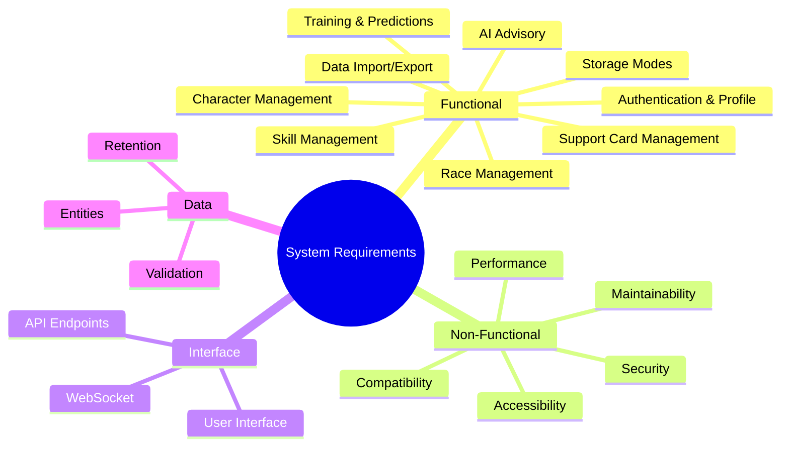

### 1.5 Reference Documents

- `.kiro/specs/umamusume-career-planner-main/requirements.md` (59 core requirements)
- `.kiro/specs/umamusume-career-planner-main/design.md` (Architecture design)
- `.kiro/specs/umamusume-career-planner-main/tasks.md` (Implementation tasks)

---

## 2. Functional Requirements

### 2.1 Authentication and Profile [FR-01]

**Description:** User authentication and profile management capabilities.

| ID | Requirement | Priority | Status |
| -- | ----------- | -------- | ------ |
| FR-01.1 | Support registration, login, logout, and session management | P0 | Complete |
| FR-01.2 | Provide profile editing and password change functionality | P0 | Complete |
| FR-01.3 | Support avatar upload with image validation | P1 | Complete |
| FR-01.4 | Expose profile endpoints via API and web UI | P0 | Complete |
| FR-01.5 | Implement "Remember Me" functionality | P1 | Complete |
| FR-01.6 | Support email verification flow | P2 | Complete |

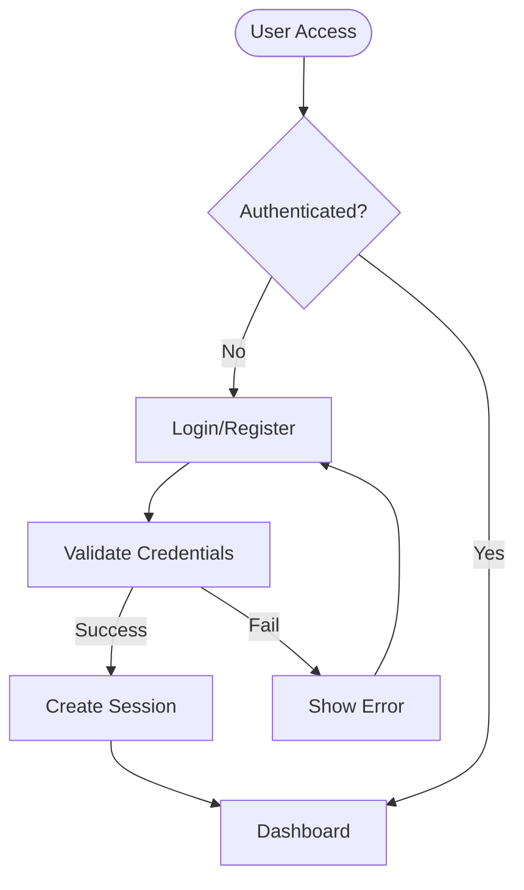

### 2.2 Character Management [FR-02]

**Description:** Complete character lifecycle management supporting the 59 requirements.

**Related Artifacts:**

- PRD: [PRD-001](../prds/PRD-001_Character_Management.md)
- SPEC: [SPEC-001](../specs/SPEC-001_Character_Management_Technical.md)
- Flow: [FLOW-001](../flows/FLOW-001_Character_Management_System.md)
- Sequence: [SEQ-001](../sequences/SEQ-001_Character_Creation_Sequence.md)
- Wireframe: [WF-002](../wireframes/WF-002_Character_Creation_Wizard.md)

| ID | Requirement | Priority | Status |
| -- | ----------- | -------- | ------ |
| FR-02.1 | CRUD operations for characters with stat tracking | P0 | Complete |
| FR-02.2 | Track five core stats: Speed, Stamina, Power, Guts, Wit (soft cap 1200, practical max ~1600) | P0 | Complete |
| FR-02.3 | Track energy, mood, goals, and progression | P0 | Complete |
| FR-02.4 | Manage character deck assignments (6-card support deck) | P0 | Complete |
| FR-02.5 | Support scenario selection (URA Championship, Grand Masters, etc.) | P0 | Complete |
| FR-02.6 | Track aptitude grades (S through G, S is maximum) for distance/surface/style | P0 | Complete |
| FR-02.7 | Manage factor inheritance from parent characters | P0 | Complete |
| FR-02.8 | Support character snapshots for versioning | P1 | Complete |
| FR-02.9 | Track conditions (positive/negative status effects) | P1 | Complete |

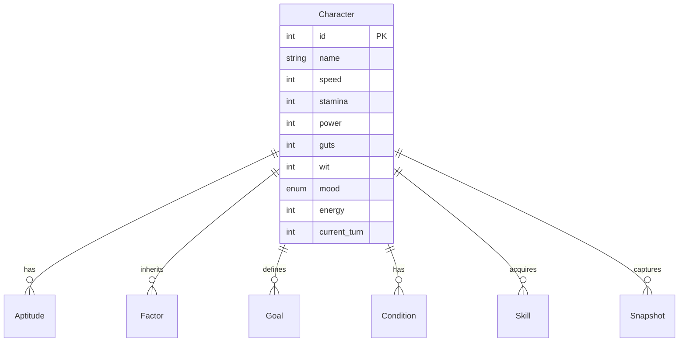

### 2.3 Training and Predictions [FR-03]

**Description:** Training session management with AI-powered predictions.

**Related Artifacts:**

- PRD: [PRD-002](../prds/PRD-002_Training_Optimization.md)
- SPEC: [SPEC-002](../specs/SPEC-002_Training_Optimization_Technical.md)
- Flow: [FLOW-002](../flows/FLOW-002_Training_Optimization_System.md)
- Tech Flow: [TECH-FLOW-002](../tech-flow/TECH-FLOW-002_Training_Optimization_Flow.md)

| ID | Requirement | Priority | Status |
| -- | ----------- | -------- | ------ |
| FR-03.1 | Record training sessions and compute stat gains | P0 | Complete |
| FR-03.2 | Provide training predictions with stat gain forecasts | P0 | Complete |
| FR-03.3 | Support batch predictions for multiple training options | P0 | Complete |
| FR-03.4 | Calculate support card bonuses and friendship multipliers | P0 | Complete |
| FR-03.5 | Compute failure risk based on energy/mood/conditions | P0 | Complete |
| FR-03.6 | Track skill hint probability per training facility | P1 | Complete |
| FR-03.7 | Cache prediction results per character (5-minute TTL) | P1 | Complete |
| FR-03.8 | Provide AI-powered training recommendations via Neuron agents | P1 | Complete |

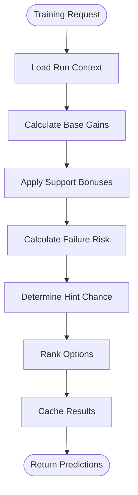

### 2.4 Race Management [FR-04]

**Description:** Race definitions, results, and strategy recommendations.

**Related Artifacts:**

- PRD: [PRD-003](../prds/PRD-003_Race_Strategy.md)
- SPEC: [SPEC-003](../specs/SPEC-003_Race_Strategy_Technical.md)
- Flow: [FLOW-003](../flows/FLOW-003_Race_Strategy_System.md)
- Sequence: [SEQ-004](../sequences/SEQ-004_Race_Registration_and_Outcome.md)

| ID | Requirement | Priority | Status |
| -- | ----------- | -------- | ------ |
| FR-04.1 | Store race definitions with grade, distance, surface, and requirements | P0 | Complete |
| FR-04.2 | Track race results with placement and rewards | P0 | Complete |
| FR-04.3 | Provide race detail views and analytics | P0 | Complete |
| FR-04.4 | Support race strategy recommendations via AI services | P1 | Complete |
| FR-04.5 | Calculate readiness score based on stats/skills/aptitudes | P1 | Complete |
| FR-04.6 | Generate win probability predictions | P1 | Complete |
| FR-04.7 | Recommend optimal running style per race | P1 | Complete |

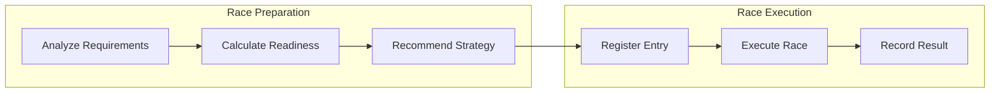

### 2.5 Skill Management [FR-05]

**Description:** Skill catalog, acquisition tracking, and SP optimization.

**Related Artifacts:**

- PRD: [PRD-004](../prds/PRD-004_Skill_Management.md)
- SPEC: [SPEC-004](../specs/SPEC-004_Skill_Management_Technical.md)
- Flow: [FLOW-004](../flows/FLOW-004_Skill_Management_System.md)
- Wireframe: [WF-008](../wireframes/WF-008_Skill_Shop_Interface.md)

| ID | Requirement | Priority | Status |
| -- | ----------- | -------- | ------ |
| FR-05.1 | Maintain skill catalog with categories (Normal, Rare, Unique) | P0 | Complete |
| FR-05.2 | Track skill acquisitions per character | P0 | Complete |
| FR-05.3 | Track hints and SP cost reductions (5 levels: 10%/20%/30%/35%/40% max) | P0 | Complete |
| FR-05.4 | Support skill evolution paths (Normal → Rare) | P1 | Complete |
| FR-05.5 | Provide skill recommendations based on race targets | P1 | Complete |
| FR-05.6 | Calculate SP budget optimization | P1 | Complete |
| FR-05.7 | Support skill loadout management | P1 | Complete |

### 2.6 Support Card Management [FR-06]

**Description:** Support card inventory, deck building, and meta rankings.

**Related Artifacts:**

- PRD: [PRD-005](../prds/PRD-005_Support_Card_Management.md)
- SPEC: [SPEC-005](../specs/SPEC-005_Support_Card_Management_Technical.md)
- Flow: [FLOW-005](../flows/FLOW-005_Support_Card_Management_System.md)
- Wireframe: [WF-011](../wireframes/WF-011_Support_Deck_Builder.md)

| ID | Requirement | Priority | Status |
| -- | ----------- | -------- | ------ |
| FR-06.1 | Maintain support card inventory (200+ cards) | P0 | Complete |
| FR-06.2 | Build and validate 6-card decks (5 owned + 1 borrowed) | P0 | Complete |
| FR-06.3 | Track limit break levels and bond progression | P0 | Complete |
| FR-06.4 | Provide synergy scoring and deck recommendations | P1 | Complete |
| FR-06.5 | Sync meta tier rankings from external sources | P1 | Complete |
| FR-06.6 | Support deck comparison and optimization | P1 | Complete |

### 2.7 AI Advisory [FR-07]

**Description:** AI-powered recommendations using hybrid local/cloud providers.

**Related Artifacts:**

- PRD: [PRD-006](../prds/PRD-006_AI_Advisory.md)
- SPEC: [SPEC-006](../specs/SPEC-006_AI_Advisory_Technical.md)
- Flow: [FLOW-006](../flows/FLOW-006_AI_Advisory_System.md)
- Sequence: [SEQ-006](../sequences/SEQ-006_AI_Advice_Generation.md)

| ID | Requirement | Priority | Status |
| -- | ----------- | -------- | ------ |
| FR-07.1 | Provide training advice via Neuron agents | P0 | Complete |
| FR-07.2 | Provide race strategy recommendations | P0 | Complete |
| FR-07.3 | Provide skill build recommendations | P0 | Complete |
| FR-07.4 | Track AI conversations and context | P1 | Complete |
| FR-07.5 | Track AI costs and performance metrics | P1 | Complete |
| FR-07.6 | Support hybrid AI providers (Ollama local + AWS Bedrock fallback) | P1 | Complete |
| FR-07.7 | Provide confidence scoring for recommendations | P2 | Complete |

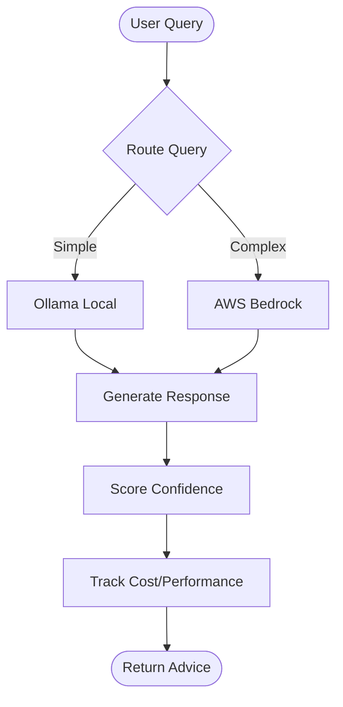

### 2.8 External Integration [FR-08]

**Description:** Integration with external APIs, OCR processing, and real-time updates.

**Related Artifacts:**

- PRD: [PRD-007](../prds/PRD-007_External_Integration.md)
- SPEC: [SPEC-007](../specs/SPEC-007_External_Integration_Technical.md)
- Flow: [FLOW-007](../flows/FLOW-007_External_Integration_System.md)
- Sequence: [SEQ-007](../sequences/SEQ-007_External_Data_Sync.md)

| ID | Requirement | Priority | Status |
| -- | ----------- | -------- | ------ |
| FR-08.1 | Integrate with umapyoi.net API for game data | P0 | Complete |
| FR-08.2 | Implement circuit breaker pattern for API resilience | P0 | Complete |
| FR-08.3 | Support fallback to UmamusumeDB.com | P1 | Complete |
| FR-08.4 | Process screenshots via OCR (Tesseract + OpenCV) | P1 | Complete |
| FR-08.5 | Provide WebSocket real-time updates via Laravel Reverb | P1 | Complete |
| FR-08.6 | Cache external API responses (24-hour TTL) | P1 | Complete |

### 2.9 Data Import/Export [FR-09]

**Description:** Import/export workflows with format detection and migration.

| ID | Requirement | Priority | Status |
| -- | ----------- | -------- | ------ |
| FR-09.1 | Export plans to JSON format with schema versioning | P0 | Complete |
| FR-09.2 | Export plans to Excel format (.xlsx) | P1 | Complete |
| FR-09.3 | Import from JSON with format detection | P0 | Complete |
| FR-09.4 | Support legacy format migration | P1 | Complete |
| FR-09.5 | Provide import preview and conflict resolution | P1 | Complete |
| FR-09.6 | Support backup and restore workflows | P1 | Complete |

### 2.10 Local Storage Mode [FR-10]

**Description:** Browser-based storage for offline functionality.

| ID | Requirement | Priority | Status |
| -- | ----------- | -------- | ------ |
| FR-10.1 | Support Local storage mode using browser localStorage | P0 | Complete |
| FR-10.2 | Support Account storage mode using database | P0 | Complete |
| FR-10.3 | Display clear storage mode indicator (badge) | P0 | Complete |
| FR-10.4 | Enable full offline functionality for Local runs | P0 | Complete |
| FR-10.5 | Support conversion from Local to Account mode | P0 | Complete |
| FR-10.6 | Provide local data management interface | P1 | Complete |
| FR-10.7 | Implement draft auto-save every 30 seconds | P0 | Complete |
| FR-10.8 | Handle connection state with graceful degradation | P0 | Complete |

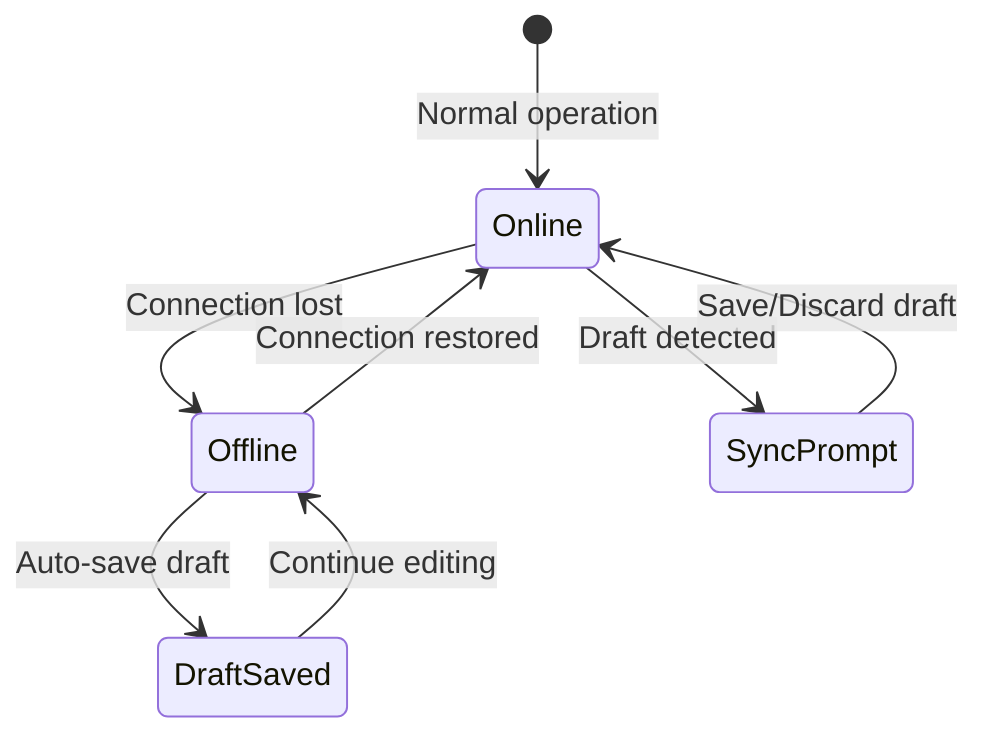

### 2.11 Dashboard and Navigation [FR-11]

**Description:** Main landing page with overview and quick access.

| ID | Requirement | Priority | Status |
| -- | ----------- | -------- | ------ |
| FR-11.1 | Display aggregate statistics (total, active, completed plans) | P0 | Complete |
| FR-11.2 | Display all plans with filtering and sorting | P0 | Complete |
| FR-11.3 | Display recent activity log | P0 | Complete |
| FR-11.4 | Provide visible "Create Plan" button | P0 | Complete |
| FR-11.5 | Responsive single-column layout on mobile | P0 | Complete |
| FR-11.6 | Display AI advisor quick access card | P1 | Complete |

### 2.12 Analytics and Reporting [FR-12]

**Description:** Performance analysis and statistical insights.

| ID | Requirement | Priority | Status |
| -- | ----------- | -------- | ------ |
| FR-12.1 | Provide career analytics dashboard | P1 | Complete |
| FR-12.2 | Generate performance comparison charts | P1 | Complete |
| FR-12.3 | Track training efficiency metrics | P1 | Complete |
| FR-12.4 | Provide race history analysis | P1 | Complete |
| FR-12.5 | Support stat progression visualization | P0 | Complete |

---

## 3. Non-Functional Requirements

### 3.1 Performance Requirements [NFR-01]

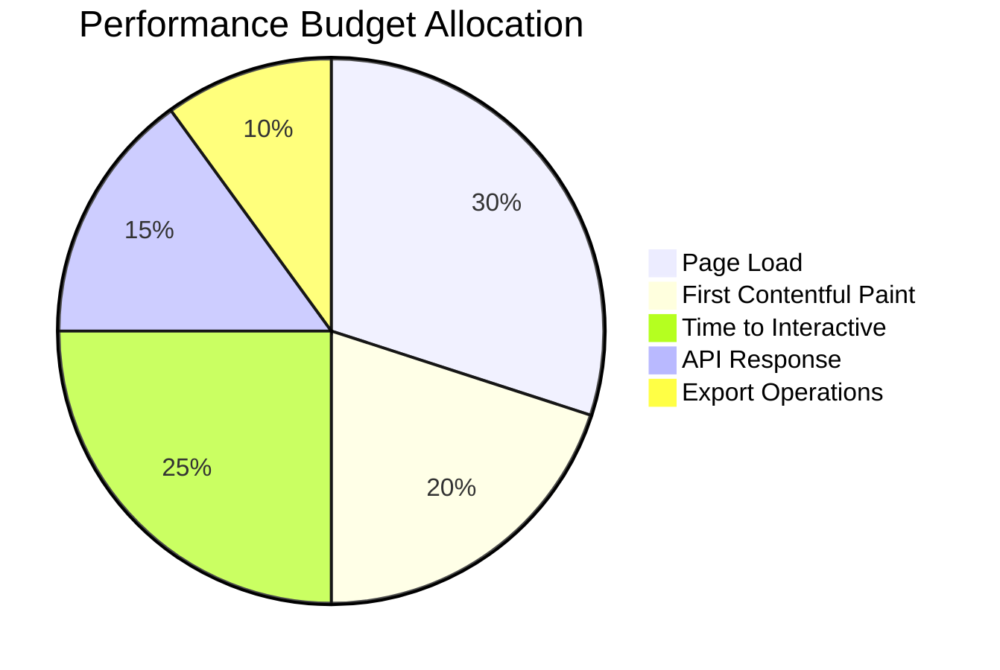

| ID | Requirement | Target | Status |
| -- | ----------- | ------ | ------ |
| NFR-01.1 | Page load time | < 2 seconds | Monitored |
| NFR-01.2 | First Contentful Paint | < 1.5 seconds | Monitored |
| NFR-01.3 | Time to Interactive | < 3 seconds | Monitored |
| NFR-01.4 | Largest Contentful Paint | < 2.5 seconds | Monitored |
| NFR-01.5 | Training prediction response | < 1.2 seconds (p95) | Complete |
| NFR-01.6 | AI advisory response | < 2.5 seconds (with AI) | Complete |
| NFR-01.7 | Export 50k rows | < 60 seconds | Complete |
| NFR-01.8 | Autocomplete response | < 200ms | Complete |

### 3.2 Security Requirements [NFR-02]

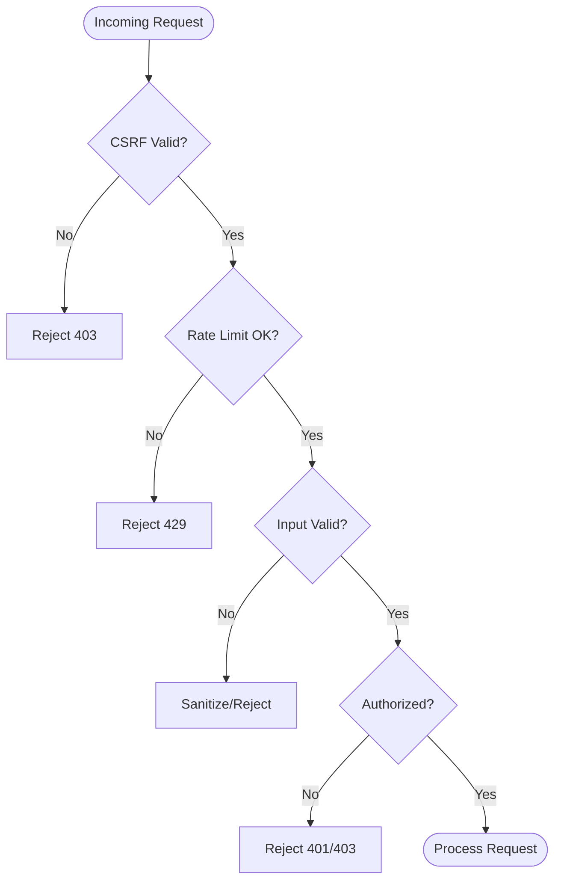

| ID | Requirement | Status |
| -- | ----------- | ------ |
| NFR-02.1 | CSRF protection on all form submissions | Complete |
| NFR-02.2 | Image upload content-type sniffing validation | Complete |
| NFR-02.3 | Image upload size limit (2MB max) | Complete |
| NFR-02.4 | XSS prevention through input sanitization | Complete |
| NFR-02.5 | Rate limiting (100 requests/minute per IP) | Complete |
| NFR-02.6 | Per-user data isolation for Account runs | Complete |
| NFR-02.7 | AI API key protection and rotation | Complete |

### 3.3 Accessibility Requirements [NFR-03]

| ID | Requirement | WCAG Reference | Status |
| -- | ----------- | -------------- | ------ |
| NFR-03.1 | Alt text for all images | 1.1.1 | Complete |
| NFR-03.2 | Color info available via text | 1.4.1 | Complete |
| NFR-03.3 | Skip-to-main link | 2.4.1 | Complete |
| NFR-03.4 | Semantic HTML elements | 4.1.2 | Complete |
| NFR-03.5 | 4.5:1 contrast ratio for normal text | 1.4.3 | Complete |
| NFR-03.6 | 400% zoom reflow support | 1.4.10 | In Progress |
| NFR-03.7 | Focus always visible | 2.4.7 | Complete |
| NFR-03.8 | Keyboard navigation for all elements | 2.1.1 | Complete |
| NFR-03.9 | Focus trap for modals | 2.4.3 | Complete |
| NFR-03.10 | Reduced motion support | 2.3.3 | Complete |

### 3.4 Compatibility Requirements [NFR-04]

| ID | Requirement | Status |
| -- | ----------- | ------ |
| NFR-04.1 | PHP 8.2+ support | Complete |
| NFR-04.2 | MySQL/MariaDB/SQLite database support | Complete |
| NFR-04.3 | Chrome (last 2 versions) | Complete |
| NFR-04.4 | Firefox (last 2 versions) | Complete |
| NFR-04.5 | Safari (last 2 versions) | Complete |
| NFR-04.6 | Edge (last 2 versions) | Complete |
| NFR-04.7 | iOS Safari support | Complete |
| NFR-04.8 | Chrome Android support | Complete |

### 3.5 Maintainability Requirements [NFR-05]

| ID | Requirement | Status |
| -- | ----------- | ------ |
| NFR-05.1 | PSR-12 coding standards | Complete |
| NFR-05.2 | Test coverage > 80% | In Progress |
| NFR-05.3 | Documentation for public APIs | Complete |
| NFR-05.4 | data-testid attributes on interactive elements | Complete |
| NFR-05.5 | Consistent naming: `data-testid="[component]-[action]-[context]"` | Complete |
| NFR-05.6 | Service layer abstraction for business logic | Complete |

### 3.6 Responsive Design Requirements [NFR-06]

| ID | Requirement | Breakpoint | Status |
| -- | ----------- | ---------- | ------ |
| NFR-06.1 | Mobile layout | < 640px | Complete |
| NFR-06.2 | Tablet layout | 640px - 1024px | Complete |
| NFR-06.3 | Desktop layout | > 1024px | Complete |
| NFR-06.4 | Touch targets 44px minimum | All mobile | Complete |
| NFR-06.5 | Usable viewport range | 320px - 2560px | Complete |

### 3.7 Observability Requirements [NFR-07]

| ID | Requirement | Status |
| -- | ----------- | ------ |
| NFR-07.1 | APM integration for performance monitoring | Complete |
| NFR-07.2 | Error logging with trace IDs | Complete |
| NFR-07.3 | AI cost tracking and budgeting | Complete |
| NFR-07.4 | Cache hit/miss monitoring | Complete |
| NFR-07.5 | External API health monitoring | Complete |

---

## 4. Interface Requirements

### 4.1 User Interface Components

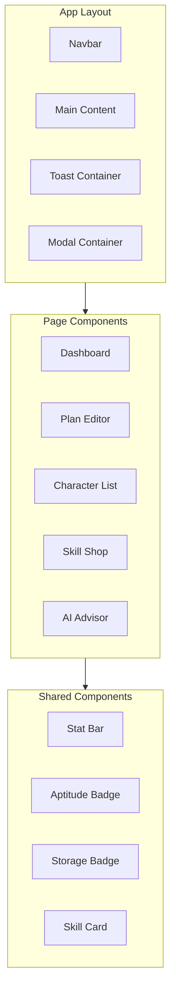

#### 4.1.1 Navigation Components

| Component | Description | Status |
| --------- | ----------- | ------ |
| Navbar | App branding, navigation links, dark mode toggle, user menu | Complete |
| Sidebar | Secondary navigation for desktop | Complete |
| Breadcrumbs | Context navigation path | Complete |
| Mobile Nav | Hamburger menu for mobile | Complete |

#### 4.1.2 Form Components

| Component | Description | Status |
| --------- | ----------- | ------ |
| Input | Text input with label and validation | Complete |
| Select | Dropdown selector with search | Complete |
| Textarea | Multi-line text input | Complete |
| Checkbox | Boolean toggle | Complete |
| File Upload | Image upload with preview | Complete |
| Autocomplete | Searchable dropdown (skills, characters) | Complete |

#### 4.1.3 Display Components

| Component | Description | Status |
| --------- | ----------- | ------ |
| Plan Card | Plan summary with actions | Complete |
| Stat Bar | Visual stat indicator with color | Complete |
| Circular Progress | Game-inspired stat display | Complete |
| Skill Badge | Skill status indicator | Complete |
| Storage Badge | Local/Account indicator | Complete |
| Toast | Notification messages | Complete |
| Modal | Dialog overlay | Complete |

### 4.2 API Endpoints

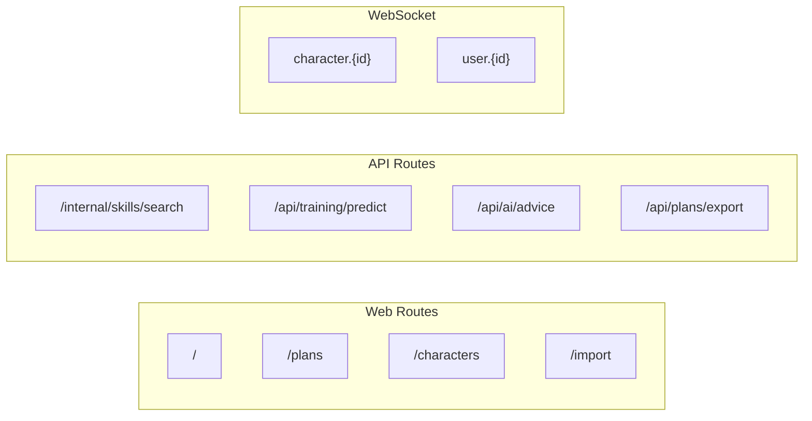

#### 4.2.1 Core API Endpoints

| Endpoint | Method | Description | Status |
| -------- | ------ | ----------- | ------ |
| `/api/v1/plans` | GET/POST | List/Create plans | Complete |
| `/api/v1/plans/{id}` | GET/PUT/DELETE | Plan CRUD | Complete |
| `/api/v1/characters` | GET/POST | List/Create characters | Complete |
| `/api/v1/characters/{id}` | GET/PUT/DELETE | Character CRUD | Complete |
| `/api/v1/skills` | GET | List skills | Complete |
| `/api/v1/support-cards` | GET | List support cards | Complete |
| `/internal/skills/search` | GET | Skill autocomplete | Complete |

#### 4.2.2 AI Advisory Endpoints

| Endpoint | Method | Description | Status |
| -------- | ------ | ----------- | ------ |
| `/api/ai/training` | POST | Training advice | Complete |
| `/api/ai/race` | POST | Race strategy | Complete |
| `/api/ai/skills` | POST | Skill recommendations | Complete |
| `/api/ai/conversation` | POST | Interactive chat | Complete |

#### 4.2.3 Integration Endpoints

| Endpoint | Method | Description | Status |
| -------- | ------ | ----------- | ------ |
| `/api/external/sync` | POST | Sync external data | Complete |
| `/api/ocr/process` | POST | OCR screenshot | Complete |
| `/api/plans/import` | POST | Import plans | Complete |
| `/api/plans/export` | GET | Export plans | Complete |

---

## 5. Data Requirements

### 5.1 Data Entities

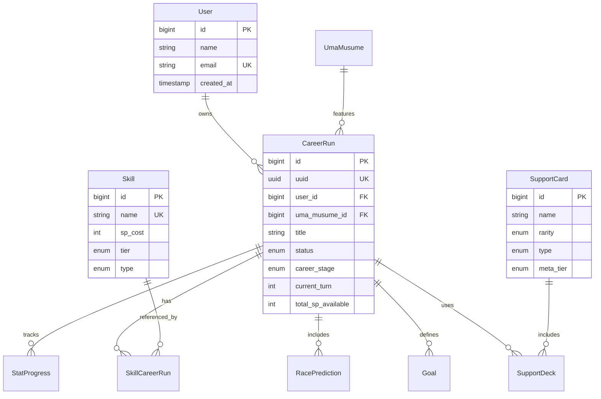

### 5.2 Data Validation Rules

| Field | Rule | Error Message |
| ----- | ---- | ------------- |
| plan.title | Required, max 255 chars | "Title is required and must be under 255 characters" |
| plan.status | Enum: in_progress, completed, archived | "Invalid status value" |
| plan.career_stage | Enum: junior, classic, senior | "Invalid career stage" |
| stat.* | Integer, soft cap 1200 (50% effectiveness above), practical max ~1600 | "Stat values have soft cap at 1200" |
| skill.status | Enum: acquired, skipped, suggested | "Invalid skill status" |
| skill.turn_acquired | Required if status=acquired, 1-78 | "Turn number required for acquired skills" |
| energy | Integer, 0-100 | "Energy must be between 0 and 100" |
| support_deck | Exactly 6 cards | "Deck must contain exactly 6 cards" |

### 5.3 Data Retention

| Data Type | Retention | Notes |
| --------- | --------- | ----- |
| Local runs | Until user clears or browser storage cleared | localStorage |
| Account runs | Until user deletes (30-day soft delete recovery) | Database |
| Drafts | 7 days | Auto-cleanup |
| Activity logs | Indefinite | Audit trail |
| AI conversations | 90 days | Cost tracking |
| External API cache | 24 hours | Refresh on expiry |
| Training predictions | 5 minutes | Short-term cache |

### 5.4 Canonical Field Names

| UI Label | Canonical Field | Table | Notes |
| -------- | --------------- | ----- | ----- |
| SP Balance | `total_sp_available` | career_runs | Use canonical in code |
| Stamina % | `stamina_percentage` | career_runs | |
| Turn | `turn_number` | stat_progress | In history tables |
| Current Turn | `current_turn` | career_runs | In main table |
| Plan ID | `career_run_id` | (foreign keys) | |

---

## 6. System Constraints

### 6.1 Technical Constraints

1. **localStorage limit**: Approximately 5-10MB per domain
2. **Livewire requirements**: PHP server required for Account operations
3. **Real-time limitations**: WebSocket via Laravel Reverb (no third-party)
4. **AI model constraints**: Ollama local models have hardware requirements
5. **AWS Bedrock**: Requires AWS account and API keys for cloud AI

### 6.2 Business Constraints

1. **Language**: English primary interface, Japanese skill names supported
2. **Game data**: Dependent on external API availability (umapyoi.net)
3. **No game integration**: No direct integration with game servers
4. **Privacy**: User data stored locally or in private database only

### 6.3 Deployment Constraints

1. **PHP version**: 8.2+ required for Laravel 12
2. **Database**: MySQL 8.0+, MariaDB 10.5+, or SQLite for development
3. **Cache**: Redis recommended for production
4. **Queue**: Redis or database for background jobs

---

## 7. Traceability Matrix

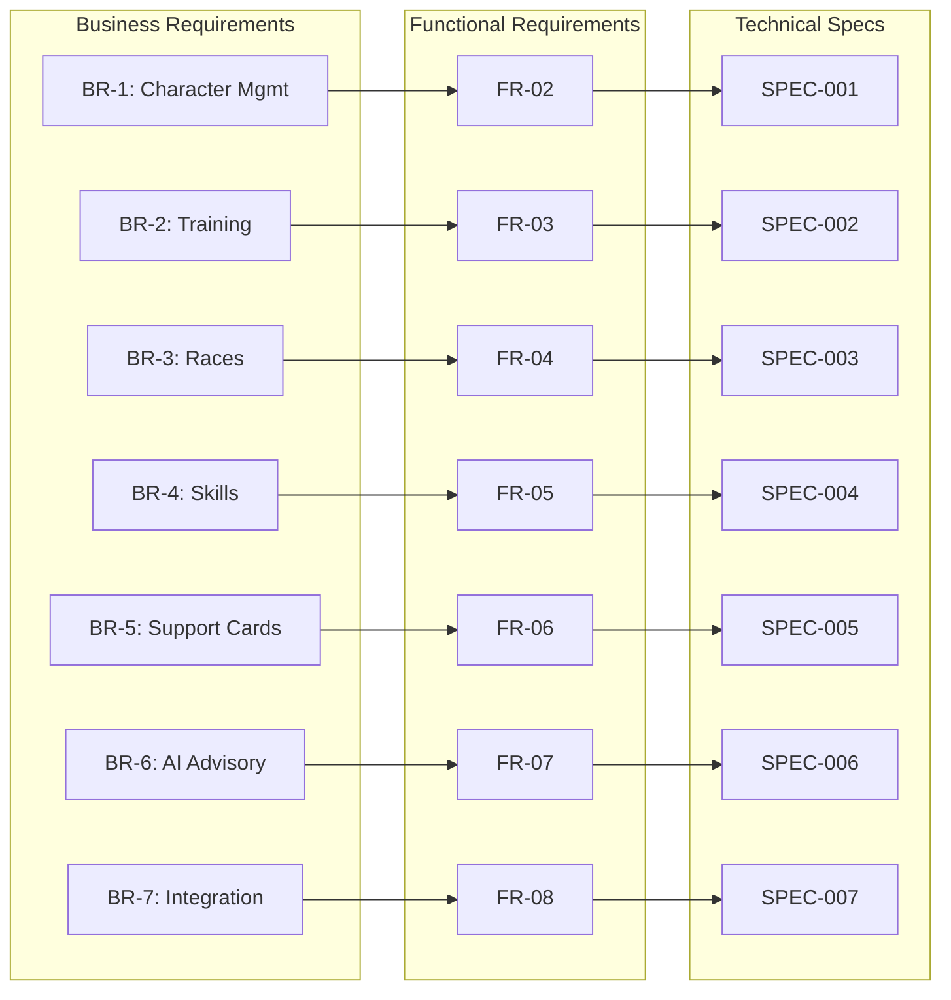

### 7.1 Requirements to Specifications Mapping

| Business Req | Functional Req | SPEC | PRD | Priority |
| ------------ | -------------- | ---- | --- | -------- |
| BR-1 Character Management | FR-02 | SPEC-001 | PRD-001 | P0 |
| BR-2 Training Optimization | FR-03 | SPEC-002 | PRD-002 | P0 |
| BR-3 Race Strategy | FR-04 | SPEC-003 | PRD-003 | P0 |
| BR-4 Skill Management | FR-05 | SPEC-004 | PRD-004 | P0 |
| BR-5 Support Card Management | FR-06 | SPEC-005 | PRD-005 | P0 |
| BR-6 AI Advisory | FR-07 | SPEC-006 | PRD-006 | P1 |
| BR-7 External Integration | FR-08 | SPEC-007 | PRD-007 | P1 |
| BR-8 Authentication | FR-01 | - | - | P0 |
| BR-9 Data Import/Export | FR-09 | - | - | P0 |
| BR-10 Storage Modes | FR-10 | - | - | P0 |

---

## 8. Appendices

### 8.1 Test Data Requirements

| Data Set | Purpose | Volume |
| -------- | ------- | ------ |
| Characters | Test character CRUD | 50+ records |
| Career Runs | Test plan operations | 100+ records |
| Skills | Test autocomplete and catalog | 500+ records |
| Support Cards | Test deck building | 200+ records |
| Turns | Test stat tracking | 78 per run |

### 8.2 Technology Stack Summary

| Layer | Technology | Version |
| ----- | ---------- | ------- |
| Backend Framework | Laravel | 12+ |
| Frontend Reactivity | Livewire | 4 |
| Client Interactivity | Alpine.js | 3 |
| Styling | TailwindCSS | v4 |
| Build Tool | Vite | 7 |
| Charts | Chart.js | 4 |
| PHP Runtime | PHP | 8.2+ (runtime 8.4.11) |
| Database | MySQL/MariaDB/SQLite | - |
| Cache | Redis | Via WSL |
| AI Framework | Neuron AI | v2.11 |
| AI (Local) | Ollama | Latest |
| AI (Cloud) | AWS Bedrock | Claude 4.5 |
| Testing | Pest / PHPUnit | v4 / v12 |
| Browser Testing | pest-plugin-browser | 4.0 |
| E2E Testing | Playwright | 1.58 |
| Code Quality | Larastan | v3 |
| Code Formatting | Laravel Pint | v1 |
| Dev Tools | Laravel Boost | v1.8 |

### 8.3 Related Documents

- D01_System_Development_Plan
- D02_Business_Requirements_Specifications
- D04_System_Design_Specifications
- D05_Data_Migration_Plan
- SPEC-001 through SPEC-007 (Technical Specifications)
- PRD-001 through PRD-007 (Product Requirements)
- FLOW-001 through FLOW-007 (System Flows)

---

## Document Control

| Version | Date | Author | Changes |
| ------- | ---- | ------ | ------- |
| 2.3.0 | 2026-02-21 | Development Team | Updated tech stack versions (Livewire 4, Pest v4, PHPUnit v12, PHP 8.4.11); added Chart.js, Neuron AI, Playwright, Larastan, Pint, Laravel Boost references |
| 2.2.0 | 2026-01-28 | Development Team | Aligned with codebase v2.2.0 |
| 2.1.0 | 2026-01-23 | Development Team | Updated to align with current implementation, added AI and integration requirements |
| 2.0.0 | 2026-01-14 | Development Team | Major revision with Mermaid diagrams |
| 1.0.0 | 2026-01-03 | System | Initial draft |

---

*This SRS reflects the current implementation status as of February 21, 2026 and serves as the authoritative reference for system requirements.*
