# Software Design Specification (SDS)

## Umamusume Pretty Derby Career Planner

**Document Version**: 2.4.0
**Date**: February 22, 2026
**Project**: UmamusumeCareerPlanner
**Author**: Development Team
**Status**: Current - Aligned to codebase v2.4.0 and game-accurate mechanics

---

## Table of Contents

1. [Introduction](#1-introduction)
2. [System Architecture](#2-system-architecture)
3. [Component Design](#3-component-design)
4. [Data Models](#4-data-models)
5. [Service Layer Design](#5-service-layer-design)
6. [AI and MCP Integration](#6-ai-and-mcp-integration)
7. [OCR Pipeline](#7-ocr-pipeline)
8. [API Design](#8-api-design)
9. [Data Management Design](#9-data-management-design)
10. [UI/UX Design](#10-uiux-design)

---

## 1. Introduction

This SDS describes the implemented architecture and design of the Laravel 12 application, focusing on services, data flow, and integration points. The document reflects the current state of the codebase and serves as the authoritative reference for system design decisions.

### 1.1 Purpose

This document provides detailed system design specifications for the Umamusume Career Planner application. It describes the architecture, components, data models, and implementation patterns that have been realized in the production system.

### 1.2 Scope

This specification covers:

- System architecture and technology stack
- Component design and hierarchy
- Data models and schemas
- Service layer design
- AI integration architecture
- OCR processing pipeline
- API design patterns
- Data management workflows

### 1.3 Referenced Documents

| Document | Description |
|----------|-------------|
| PRD-001 through PRD-007 | Product Requirement Documents |
| SPEC-001 through SPEC-007 | Technical Specifications |
| FLOW-001 through FLOW-007 | System Flow Documents |
| TECH-FLOW-001 through TECH-FLOW-007 | Technical Flow Documents |

---

## 2. System Architecture

### 2.1 Layered Design

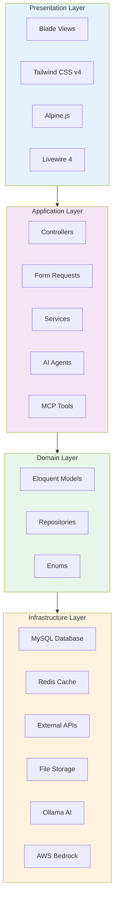

### 2.2 Key Directories

```text
app/
├── Collections/                # Custom collection classes
├── Console/Commands/           # Artisan commands
├── Enums/                      # PHP 8.2+ enums (8 enums)
├── Events/                     # Event classes
├── Helpers/                    # Helper utilities
├── Http/
│   ├── Controllers/            # Web (20+), API (29+), Admin (5), Auth (2)
│   ├── Middleware/             # Request middleware
│   └── Requests/               # Form request validation
├── Jobs/                       # Queue jobs
├── Listeners/                  # Event listeners
├── Livewire/                   # Livewire components (AdvisoryPanel)
├── MCP/                        # MCP tools and handlers
├── Models/                     # Eloquent models (30 models)
├── Neuron/                     # AI agent definitions (6 agents, 3 tools, 4 responses)
├── Notifications/              # Notification classes
├── Policies/                   # Authorization policies
├── Providers/                  # Service providers
├── Repositories/               # Data access layer
├── Services/                   # Business logic (166 service files)
│   ├── Admin/                  # Admin panel services (3)
│   ├── Agents/                 # Agent services (1)
│   ├── AI/                     # AI services - Ollama, Bedrock, Dashboard (20)
│   ├── ExternalAPI/            # External API integrations (25)
│   ├── MCP/                    # MCP orchestration, monitoring, tools (42)
│   ├── Neuron/                 # Neuron AI agent services (5)
│   ├── OCR/                    # OCR processing (12)
│   └── Training/               # Training prediction services (3)
├── ValueObjects/               # Value objects
└── View/                       # View composers and components
```

### 2.3 Technology Stack

| Layer | Technology | Version | Purpose |
|-------|------------|---------|---------|
| Framework | Laravel | 12+ | Backend framework |
| Frontend Reactivity | Livewire | 4 | Server-driven UI |
| Client Interactivity | Alpine.js | 3 | Client-side interactions |
| Styling | TailwindCSS | v4 | Utility-first CSS |
| Build Tool | Vite | 7 | Asset compilation |
| PHP Runtime | PHP | 8.2+ (runtime 8.4.11) | Server runtime |
| Database | MySQL/MariaDB | 8.0+ | Primary data store (30 models, 52 migrations) |
| Cache | Redis | 7+ (via WSL) | Caching and queues |
| AI Framework | Neuron AI / neuron-laravel | v2.11 / v0.3.4 | AI agent framework |
| AI (Local) | Ollama | Latest | Local AI inference |
| AI (Cloud) | AWS Bedrock | Claude 4.5 | Cloud AI fallback |
| MCP | Laravel MCP | v0 | Agent orchestration |
| Testing | Pest / PHPUnit | v4 / v12 | 3,316+ tests, 11,563+ assertions |
| Browser Testing | pest-plugin-browser | 4.0 | Browser testing |
| Code Quality | Larastan | v3 | Static analysis |

---

## 3. Component Design

### 3.1 Controller Architecture

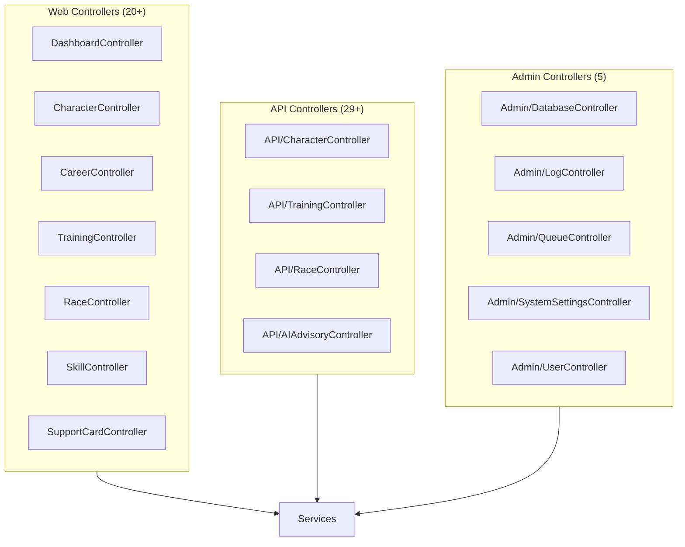

### 3.2 Livewire Components

| Component | Namespace | Description |
|-----------|-----------|-------------|
| `AdvisoryPanel` | `App\Livewire` | AI advisory chat panel with real-time recommendations |

### 3.3 Component Hierarchy

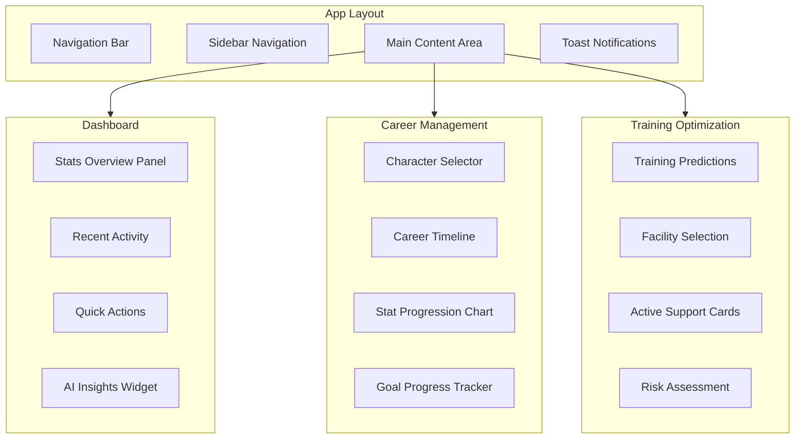

---

## 4. Data Models

### 4.1 Entity Relationship Diagram

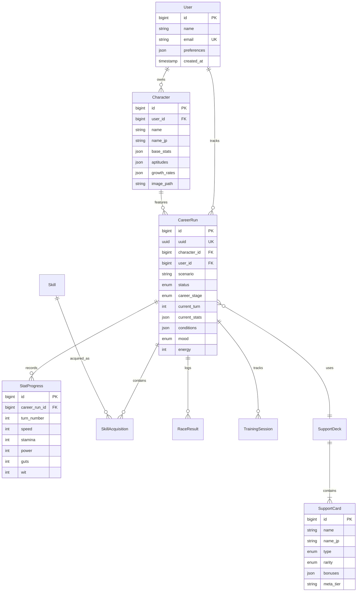

### 4.2 Core Model Definitions

#### 4.2.1 Character Model

```php
class Character extends Model
{
    use SoftDeletes, HasFactory;
    
    protected $fillable = [
        'user_id', 'name', 'name_jp', 'image_path',
        'base_speed', 'base_stamina', 'base_power', 'base_guts', 'base_wit',
        'growth_speed', 'growth_stamina', 'growth_power', 'growth_guts', 'growth_wit',
        'aptitude_turf', 'aptitude_dirt',
        'aptitude_sprint', 'aptitude_mile', 'aptitude_medium', 'aptitude_long',
        'aptitude_nige', 'aptitude_senkou', 'aptitude_sashi', 'aptitude_oikomi',
    ];
    
    protected $casts = [
        'aptitude_turf' => AptitudeGrade::class,
        'aptitude_dirt' => AptitudeGrade::class,
        // ... additional casts
    ];
    
    public function careerRuns(): HasMany
    {
        return $this->hasMany(CareerRun::class);
    }
    
    public function user(): BelongsTo
    {
        return $this->belongsTo(User::class);
    }
}
```

#### 4.2.2 CareerRun Model

```php
class CareerRun extends Model
{
    use SoftDeletes, HasFactory, HasUuids;
    
    protected $fillable = [
        'uuid', 'character_id', 'user_id', 'scenario',
        'status', 'career_stage', 'current_turn',
        'speed', 'stamina', 'power', 'guts', 'wit',
        'energy', 'mood', 'conditions',
        'total_sp_available', 'support_deck_id',
    ];
    
    protected $casts = [
        'status' => RunStatus::class,
        'career_stage' => CareerStage::class,
        'mood' => Mood::class,
        'conditions' => 'array',
    ];
    
    public function character(): BelongsTo
    {
        return $this->belongsTo(Character::class);
    }
    
    public function statProgress(): HasMany
    {
        return $this->hasMany(StatProgress::class);
    }
    
    public function skills(): BelongsToMany
    {
        return $this->belongsToMany(Skill::class, 'skill_acquisitions')
            ->withPivot('status', 'turn_acquired', 'sp_cost_paid')
            ->withTimestamps();
    }
    
    public function supportDeck(): BelongsTo
    {
        return $this->belongsTo(SupportDeck::class);
    }
}
```

### 4.3 Enum Definitions

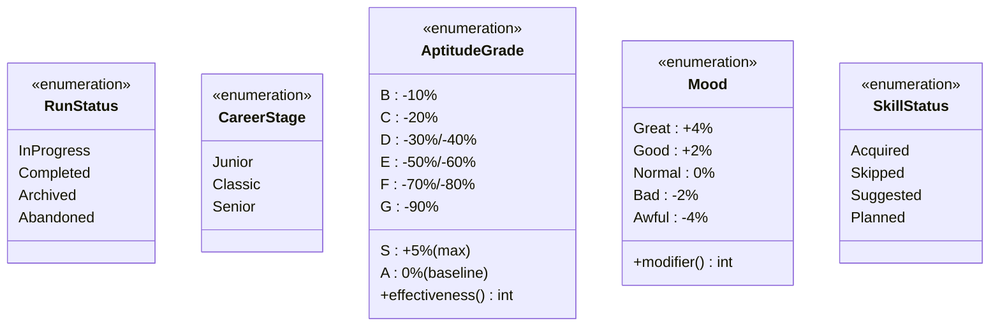

#### 4.3.1 Implemented Enum Files (8)

| Enum | File | Description |
|------|------|-------------|
| `AlertType` | `app/Enums/AlertType.php` | Alert/notification type classification |
| `CareerPhase` | `app/Enums/CareerPhase.php` | Career progression phases |
| `Mood` | `app/Enums/Mood.php` | Character mood states with stat modifiers |
| `Priority` | `app/Enums/Priority.php` | Task/requirement priority levels |
| `RaceDistance` | `app/Enums/RaceDistance.php` | Race distance categories |
| `RecommendationType` | `app/Enums/RecommendationType.php` | AI recommendation type classification |
| `RunningStyle` | `app/Enums/RunningStyle.php` | Running style aptitudes (Nige, Senkou, Sashi, Oikomi) |
| `StorageMode` | `app/Enums/StorageMode.php` | Storage mode (Local vs Account) |

> **Note**: The domain model diagram above shows conceptual enums (RunStatus, CareerStage, AptitudeGrade, SkillStatus) used across the domain. The actual PHP enum files listed here implement the core typed enumerations.

---

## 5. Service Layer Design

### 5.1 Service Architecture

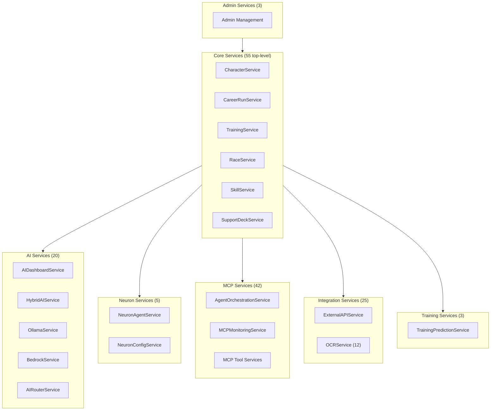

### 5.2 Core Service Implementations

#### 5.2.1 TrainingService

```php
class TrainingService
{
    public function __construct(
        private StatCalculator $statCalculator,
        private BonusCalculator $bonusCalculator,
        private RiskCalculator $riskCalculator,
        private CacheManager $cache,
    ) {}
    
    public function predictTrainingOutcome(
        CareerRun $run,
        string $facility,
        ?SupportDeck $deck = null
    ): TrainingPrediction {
        $cacheKey = "training_prediction:{$run->id}:{$facility}";
        
        return $this->cache->remember($cacheKey, 300, function () use ($run, $facility, $deck) {
            $baseGains = $this->statCalculator->calculateBaseGains($facility, $run);
            $bonuses = $this->bonusCalculator->calculateDeckBonuses($deck, $facility);
            $risk = $this->riskCalculator->calculateFailureRisk($run);
            
            return new TrainingPrediction(
                facility: $facility,
                statGains: $baseGains->applyBonuses($bonuses),
                riskLevel: $risk,
                bondGains: $this->calculateBondGains($deck, $facility),
                hintChances: $this->calculateHintChances($deck, $facility),
            );
        });
    }
    
    public function executeTraining(
        CareerRun $run,
        string $facility
    ): TrainingResult {
        $prediction = $this->predictTrainingOutcome($run, $facility, $run->supportDeck);
        
        DB::transaction(function () use ($run, $prediction) {
            $run->update([
                'speed' => $run->speed + $prediction->statGains->speed,
                'stamina' => $run->stamina + $prediction->statGains->stamina,
                'power' => $run->power + $prediction->statGains->power,
                'guts' => $run->guts + $prediction->statGains->guts,
                'wit' => $run->wit + $prediction->statGains->wit,
                'current_turn' => $run->current_turn + 1,
            ]);
            
            StatProgress::create([
                'career_run_id' => $run->id,
                'turn_number' => $run->current_turn,
                'speed' => $run->speed,
                'stamina' => $run->stamina,
                'power' => $run->power,
                'guts' => $run->guts,
                'wit' => $run->wit,
            ]);
        });
        
        event(new TrainingCompleted($run, $prediction));
        
        return new TrainingResult($run->fresh(), $prediction);
    }
}
```

#### 5.2.2 AIAdvisoryService

```php
class AIAdvisoryService
{
    public function __construct(
        private AIRouterService $router,
        private ContextBuilder $contextBuilder,
        private CostTracker $costTracker,
    ) {}
    
    public function getAdvice(
        CareerRun $run,
        string $topic,
        ?string $userQuery = null
    ): AIAdvice {
        $context = $this->contextBuilder->build($run, $topic);
        
        $provider = $this->router->selectProvider($topic, $context->complexity);
        
        try {
            $response = $provider->generate($context->prompt, $context->systemPrompt);
            
            $this->costTracker->record($provider->getName(), $response->tokenUsage);
            
            return new AIAdvice(
                content: $response->content,
                confidence: $response->confidence,
                provider: $provider->getName(),
                reasoning: $response->reasoning,
            );
        } catch (AIProviderException $e) {
            return $this->router->fallback($context, $e);
        }
    }
}
```

---

## 6. AI and MCP Integration

### 6.1 AI Architecture

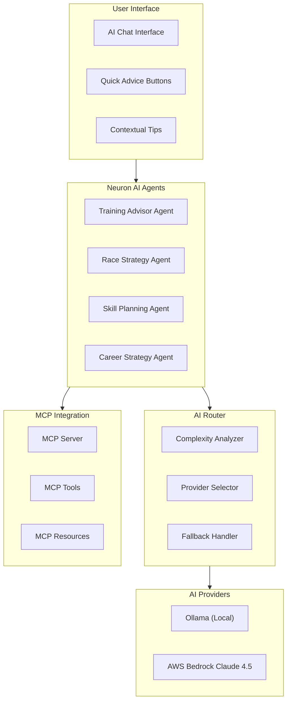

### 6.2 Neuron Agent Configuration

The application defines 6 Neuron agents in `app/Neuron/Agents/`:

| Agent | Description |
|-------|-------------|
| `BaseAgent` | Abstract base agent with shared configuration |
| `TrainingAdvisorAgent` | Training recommendations based on career state |
| `RaceStrategyAgent` | Race preparation and strategy advice |
| `SkillRecommendationAgent` | Skill acquisition and SP optimization advice |
| `CareerPlanningAgent` | Overall career planning and goal setting |
| `McpDemoAgent` | MCP integration demonstration agent |

Supporting infrastructure:

- **3 Agent Tools**: `CharacterStatsTool`, `RaceDataTool`, `SkillDataTool`
- **4 Response Types**: `CareerPlanningResponse`, `RaceStrategyResponse`, `SkillRecommendationResponse`, `TrainingAdviceResponse`
- **1 Support Class**: `McpConnectorFactory`

```php
// app/Neuron/TrainingAdvisorAgent.php
class TrainingAdvisorAgent extends Agent
{
    protected string $name = 'Training Advisor';
    
    protected string $description = 'Provides training recommendations based on current career state';
    
    protected array $tools = [
        TrainingPredictionTool::class,
        StatAnalysisTool::class,
        GoalProgressTool::class,
    ];
    
    public function systemPrompt(): string
    {
        return <<<PROMPT
        You are an expert Umamusume training advisor. Analyze the current career state
        and provide actionable training recommendations. Consider:
        - Current stat distribution and goals
        - Support card synergies
        - Risk factors (energy, mood, conditions)
        - Upcoming race requirements
        PROMPT;
    }
}
```

### 6.3 MCP Tools Integration

The MCP subsystem includes 42 service files in `app/Services/MCP/` and 1 handler in `app/MCP/`, providing:

- Full agent orchestration with `AgentOrchestrationService`
- Monitoring and health dashboards via `MCPMonitoringService`
- Tool registration and execution

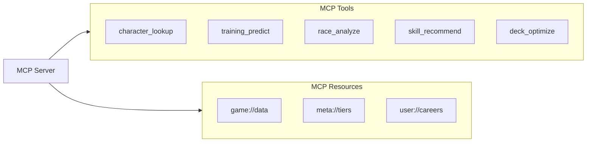

### 6.4 AI Cost Management

| Provider | Model | Input Cost | Output Cost | Use Case |
|----------|-------|------------|-------------|----------|
| Ollama | Local Models | Free | Free | Simple queries, high volume |
| Bedrock | Claude 3.5 Haiku | $0.25/1M | $1.25/1M | Standard recommendations |
| Bedrock | Claude 3.5 Sonnet | $3/1M | $15/1M | Complex strategy analysis |
| Bedrock | Claude 4.5 | $5/1M | $25/1M | Advanced reasoning (fallback) |

---

## 7. OCR Pipeline

### 7.1 OCR Processing Flow

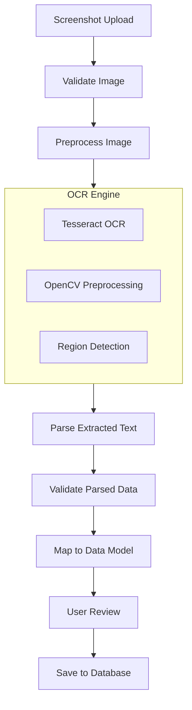

### 7.2 OCR Service Implementation

```php
class OCRService
{
    public function __construct(
        private ImagePreprocessor $preprocessor,
        private TesseractEngine $tesseract,
        private DataParser $parser,
        private ValidationService $validator,
    ) {}
    
    public function processScreenshot(UploadedFile $file): OCRResult
    {
        // Validate and preprocess
        $image = $this->preprocessor->prepare($file);
        
        // Detect regions of interest
        $regions = $this->detectRegions($image);
        
        // Extract text from each region
        $extractions = collect($regions)->map(function ($region) use ($image) {
            return $this->tesseract->extractFromRegion($image, $region);
        });
        
        // Parse extracted text into structured data
        $parsed = $this->parser->parse($extractions);
        
        // Validate against game data
        $validation = $this->validator->validate($parsed);
        
        return new OCRResult(
            data: $parsed,
            confidence: $validation->confidence,
            warnings: $validation->warnings,
            requiresReview: $validation->confidence < 0.85,
        );
    }
}
```

---

## 8. API Design

### 8.1 API Structure

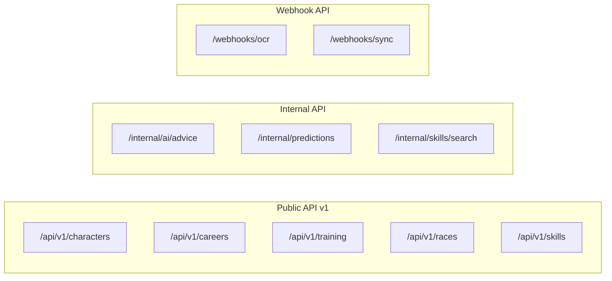

### 8.2 API Endpoints

| Endpoint | Method | Description | Auth |
|----------|--------|-------------|------|
| `/api/v1/characters` | GET | List characters | Required |
| `/api/v1/characters/{id}` | GET | Get character details | Required |
| `/api/v1/careers` | GET | List career runs | Required |
| `/api/v1/careers/{id}` | GET | Get career details | Required |
| `/api/v1/training/predict` | POST | Get training predictions | Required |
| `/api/v1/training/execute` | POST | Execute training | Required |
| `/api/v1/races/{id}/analyze` | GET | Analyze race requirements | Required |
| `/api/v1/skills/search` | GET | Search skill database | Optional |
| `/internal/ai/advice` | POST | Get AI recommendations | Required |

### 8.3 Response Format

```json
{
  "success": true,
  "data": {
    "id": 1,
    "type": "career_run",
    "attributes": {
      "current_turn": 45,
      "stats": {
        "speed": 850,
        "stamina": 720,
        "power": 680,
        "guts": 550,
        "wit": 620
      }
    },
    "relationships": {
      "character": { "id": 1, "name": "Special Week" },
      "support_deck": { "id": 3 }
    }
  },
  "meta": {
    "timestamp": "2026-01-23T10:00:00Z",
    "version": "2.1"
  }
}
```

---

## 9. Data Management Design

### 9.1 Data Flow Overview

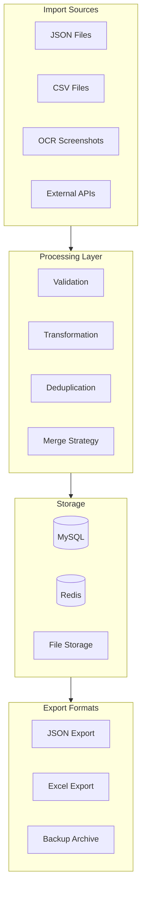

### 9.2 Import/Export Service

```php
class DataManagementService
{
    public function import(
        UploadedFile $file,
        ImportOptions $options
    ): ImportResult {
        $format = $this->detectFormat($file);
        $adapter = $this->getAdapter($format);
        
        $data = $adapter->parse($file);
        $validated = $this->validator->validate($data);
        
        if ($validated->hasErrors() && !$options->skipErrors) {
            return ImportResult::failed($validated->errors);
        }
        
        $duplicates = $this->duplicateDetector->find($validated->data);
        $resolved = $this->resolveDuplicates($duplicates, $options->duplicateStrategy);
        
        DB::transaction(function () use ($resolved) {
            foreach ($resolved as $record) {
                $this->persistRecord($record);
            }
        });
        
        return ImportResult::success($resolved->count(), $validated->warnings);
    }
    
    public function export(
        ExportOptions $options
    ): ExportResult {
        $query = $this->buildExportQuery($options);
        $data = $query->get();
        
        return match ($options->format) {
            'json' => $this->exportJson($data, $options),
            'excel' => $this->exportExcel($data, $options),
            'csv' => $this->exportCsv($data, $options),
        };
    }
}
```

### 9.3 Backup and Migration

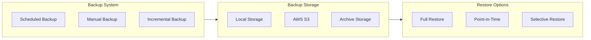

---

## 10. UI/UX Design

### 10.1 Design System

| Token | Light Mode | Dark Mode | Usage |
|-------|------------|-----------|-------|
| `--color-primary` | `#3b82f6` | `#60a5fa` | Primary actions |
| `--color-stat-speed` | `#3399ff` | `#66b3ff` | Speed indicators |
| `--color-stat-stamina` | `#33cc99` | `#66d9b8` | Stamina indicators |
| `--color-stat-power` | `#ff4d4d` | `#ff7373` | Power indicators |
| `--color-stat-guts` | `#ffa500` | `#ffb733` | Guts indicators |
| `--color-stat-wit` | `#9933ff` | `#b366ff` | Wit indicators |

### 10.2 Responsive Breakpoints

| Breakpoint | Width | Layout |
|------------|-------|--------|
| Mobile | < 640px | Single column, bottom nav |
| Tablet | 640px - 1024px | Two column where appropriate |
| Desktop | > 1024px | Full layout with sidebar |
| Wide | > 1280px | Maximum content width applied |

### 10.3 Accessibility Standards

| Requirement | Implementation | WCAG Reference |
|-------------|----------------|----------------|
| Color contrast | 4.5:1 minimum for text | 1.4.3 |
| Keyboard navigation | All interactive elements focusable | 2.1.1 |
| Screen reader support | ARIA labels on all controls | 4.1.2 |
| Focus visibility | Visible focus indicators | 2.4.7 |
| Reduced motion | Respects prefers-reduced-motion | 2.3.3 |

---

## Document Control

| Version | Date | Author | Changes |
|---------|------|--------|---------|
| 2.4.0 | 2026-02-22 | Development Team | Updated directory structure to match codebase (166 services, 30 models, 52 migrations, 585 routes); corrected Livewire to single AdvisoryPanel component; expanded service architecture with Neuron (5), MCP (42), Training (3), Admin (3) breakdowns; updated admin controllers to actual 5 (Database, Log, Queue, SystemSettings, User); added Neuron agent inventory; updated tech stack with test metrics (3,316+ tests) |
| 2.3.0 | 2026-02-21 | Development Team | Prior version aligned to v2.3.0 |
| 2.1.0 | 2026-01-23 | Development Team | Updated to reflect current implementation including AI, MCP, OCR, and data management systems |
| 2.0.0 | 2026-01-14 | Development Team | Prior comprehensive revision |
| 1.0.0 | 2026-01-03 | Development Team | Initial draft |

---

*This SDS reflects the current system architecture and design patterns implemented in the production codebase as of February 22, 2026.*
