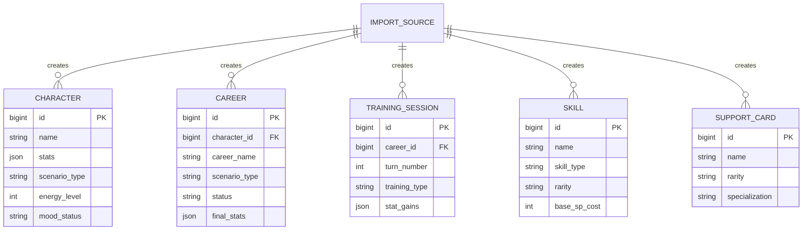
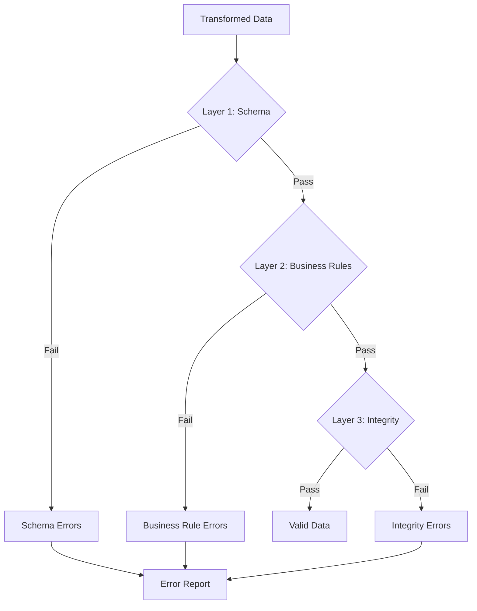
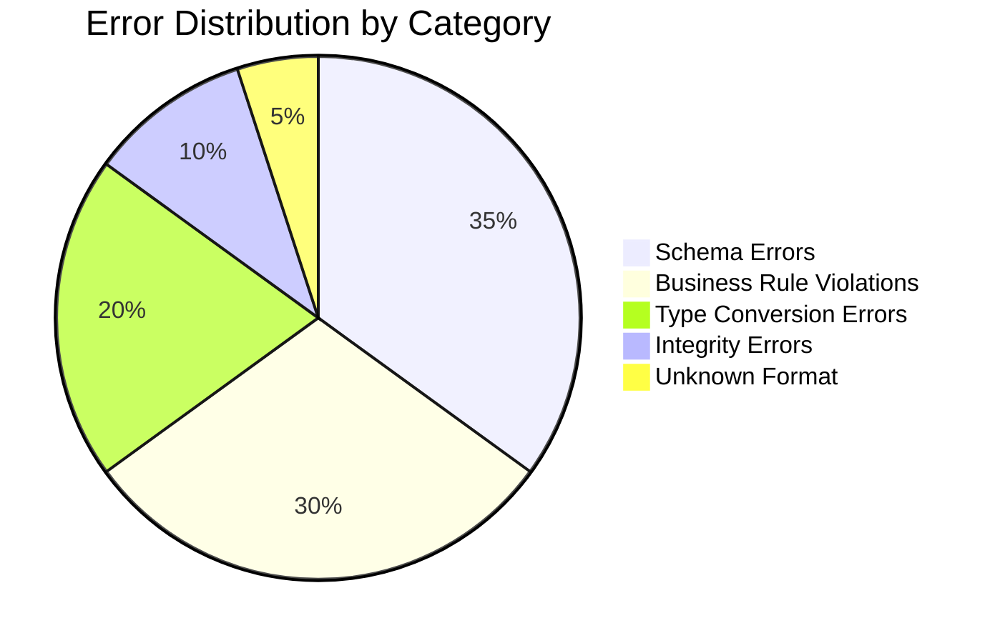
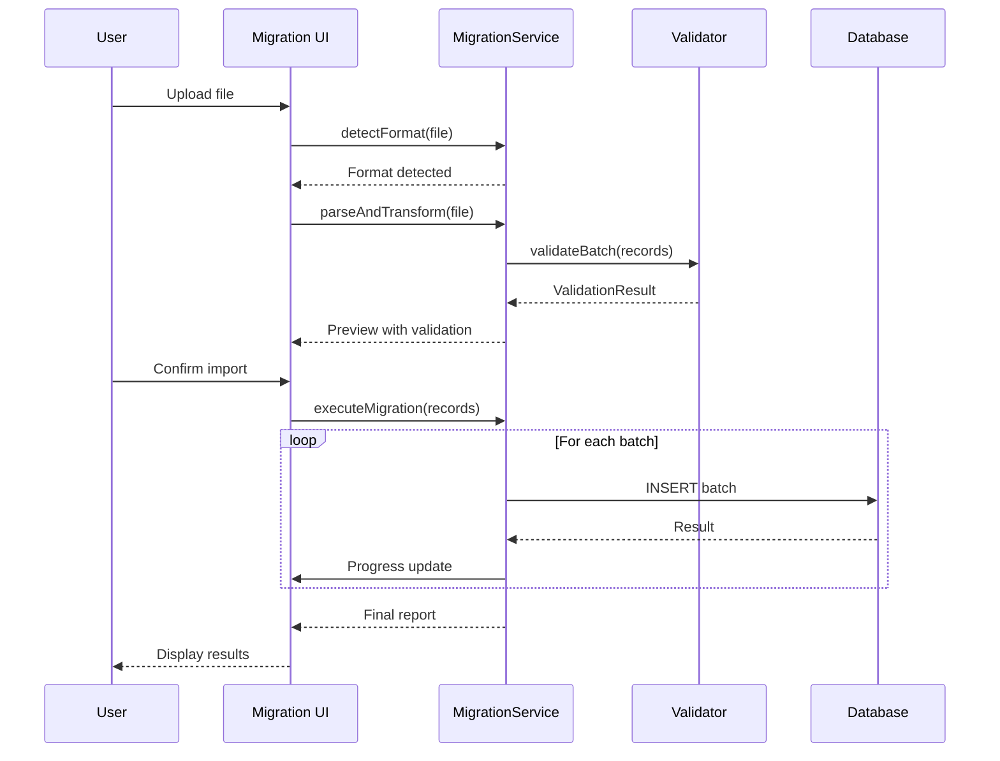

# Data Migration Specifications (DMS)

## Umamusume Pretty Derby Career Planner

**Document Version**: 2.4.0
**Date**: February 22, 2026
**Project**: UmamusumeCareerPlanner
**Author**: Development Team
**Status**: Current - Aligned to codebase v2.4.0, 40 models, 67 migrations

---

## Table of Contents

1. [Introduction](#1-introduction)
2. [Supported Formats](#2-supported-formats)
3. [Target Entities](#3-target-entities)
4. [Field Normalization](#4-field-normalization)
5. [Schema Version Management](#5-schema-version-management)
6. [Transformation Pipeline](#6-transformation-pipeline)
7. [Validation Rules](#7-validation-rules)
8. [Error Handling](#8-error-handling)
9. [Migration Scripts](#9-migration-scripts)

---

## 1. Introduction

This document provides technical specifications for data migration into the Umamusume Career Planner
system. It covers format detection, field mapping, validation, and transformation rules implemented
in the current codebase.

### 1.1 Scope

```mermaid
mindmap
  root((Data Migration))
    Format Detection
      Legacy JSON
      Legacy CSV
      Google Sheets
      Excel Export
      Custom/Heuristic
    Transformation
      Field Mapping
      Type Conversion
      Enum Normalization
      Default Values
    Validation
      Schema Compliance
      Business Rules
      Integrity Checks
    Storage
      Characters
      Careers
      Training Sessions
      Skills
      Support Cards
```text

### 1.2 Source References

- **Service Layer**: `app/Services/DataMigrationService.php`, `app/Services/DataImportService.php`,
`app/Services/DataExportService.php`, `app/Services/DataOperationHistoryService.php`,
`app/Services/BackupService.php`, `app/Services/SnapshotService.php`
- **Related PRDs**: [PRD-001](../prds/PRD-001_Character_Management.md),
[PRD-007](../prds/PRD-007_External_Integration.md)
- **Related Specs**: [SPEC-001](../specs/SPEC-001_Character_Management_Technical.md),
[SPEC-007](../specs/SPEC-007_External_Integration_Technical.md)
- **Related Flows**: [FLOW-001](../flows/FLOW-001_Character_Management_System.md),
[SEQ-015](../sequences/SEQ-015_Data_Migration_Snapshot_to_Live.md)

---

## 2. Supported Formats

### 2.1 Format Detection Overview

```mermaid
flowchart TD
    Input[Uploaded File]

    Input --> Detect{Format Detection}

    Detect -->|JSON Structure| JSON{JSON Type}
    Detect -->|CSV/TSV| CSV[CSV Adapter]
    Detect -->|Unknown| Heuristic[Heuristic Parser]

    JSON -->|trainee_name, stat_speed| V1JSON[v1_json Adapter]
    JSON -->|career_run, scenario| V1JSON
    JSON -->|schema_version present| Standard[Standard JSON]

    CSV -->|Header mapping| CSVParse[CSV Parser]

    V1JSON --> Transform[Transformation Pipeline]
    Standard --> Transform
    CSVParse --> Transform
    Heuristic --> Transform
```

### 2.2 Format Specifications

| Format | Identifier | Detection Criteria | Notes |
| --- | --- | --- | --- |
| Legacy JSON v1 | `v1_json` | Contains `trainee_name`, `stat_speed`, or `career_run` fields | Primary legacy format |
| Legacy CSV | `v1_csv` | CSV with recognized headers | Header-driven field mapping |
| Google Sheets | `google_sheets` | TSV content structure | Parsed as CSV variant |
| Excel Export | `excel` | TSV/CSV from Excel | Parsed as CSV variant |
| Custom | `custom` | Heuristic detection | Fallback for unknown formats |

### 2.3 Format Detection Implementation

```php
// DataMigrationService::detectLegacyFormat()
public function detectLegacyFormat(array $data): string
{
    // Check for v1 JSON indicators
    if (isset($data['trainee_name']) || isset($data['stat_speed'])) {
        return 'v1_json';
    }

    if (isset($data['career_run']) || isset($data['scenario'])) {
        return 'v1_json';
    }

    if (isset($data['schema_version'])) {
        return 'standard_json';
    }

    return 'custom';
}
```text

---

## 3. Target Entities

### 3.1 Entity Mapping Overview



### 3.2 Target Table Specifications

| Import Type | Target Table | Key Fields | Constraints |
| --- | --- | --- | --- |
| character | `ucp_characters` | name, stats, scenario_type, energy_level, mood_status | name required |
| career | `ucp_careers` | career_name, scenario_type, status, final_stats | character_id FK |
| training_session | `ucp_training_sessions` | turn_number, training_type, stat_gains | career_id FK, turn 1-78 |
| skill | `ucp_skills` | name, skill_type, rarity, base_sp_cost | name unique |
| skill_hint | `ucp_skill_hints` | skill_id, hint_level, sp_discount | Max 5 levels, 40% max |
| skill_acquisition | `ucp_skill_acquisitions` | career_id, skill_id, turn_acquired | career_id FK |
| skill_build | `ucp_skill_builds` | name, skills list, total_sp | Named template |
| support_card | `ucp_support_cards` | name, rarity, specialization | name required |
| support_card_definition | `ucp_support_card_definitions` | external_id, card_data | External ref |
| support_deck | `ucp_support_decks` | deck_name, card_ids | Max 6 cards |
| aptitude | `ucp_aptitudes` | character_id, aptitude_type, grade | Valid grade enum |
| factor | `ucp_factors` | career_id, factor_type, star_level | factor_type enum |
| race | `ucp_races` | name, distance, surface | distance > 0 |
| event | `ucp_events` | event_type, career_id | event_type enum |
| ocr_extraction | `ucp_ocr_extractions` | image_path, confidence | confidence 0-100 |
| run_snapshot | `ucp_run_snapshots` | career_id, snapshot_data | Point-in-time |
| external_data | `ucp_external_data` | source, data_type, payload | source enum |

---

## 4. Field Normalization

### 4.1 Field Mapping Rules

```mermaid
flowchart LR
    subgraph Legacy[Legacy Fields]
        L1[spd / speed]
        L2[sta / stamina]
        L3[pow / power]
        L4[gut / guts]
        L5[int / wis / wit]
        L6[sp / total_sp]
        L7[turn / current_turn]
    end

    subgraph Canonical[Canonical Fields]
        C1[speed]
        C2[stamina]
        C3[power]
        C4[guts]
        C5[wit]
        C6[total_sp_available]
        C7[turn_number]
    end

    L1 --> C1
    L2 --> C2
    L3 --> C3
    L4 --> C4
    L5 --> C5
    L6 --> C6
    L7 --> C7
```text

### 4.2 Stat Value Normalization

| Rule | Description | Implementation |
| --- | --- | --- |
| Range Clamping | Stats clamped to 0-1200 | `max(0, min(1200, $value))` |
| Type Coercion | String to integer conversion | `(int) $value` |
| Null Handling | Null values default to 0 | `$value ?? 0` |
| Negative Handling | Negative values set to 0 | `max(0, $value)` |

### 4.3 Scenario Type Normalization

| Legacy Value | Canonical Value |
| --- | --- |
| `ura`, `URA`, `ura_finale` | `ura_finale` |
| `unity`, `UNITY`, `unity_cup` | `unity_cup` |
| `climax`, `CLIMAX` | `climax` |
| `grand_live`, `grandlive` | `grand_live` |
| (empty/null) | `ura_finale` (default) |

### 4.4 Status Normalization

| Legacy Value | Canonical Value |
| --- | --- |
| `ongoing`, `active`, `in_progress` | `in_progress` |
| `done`, `finished`, `completed` | `completed` |
| `archived`, `old` | `archived` |
| (empty/null) | `in_progress` (default) |

---

## 5. Schema Version Management

### 5.1 Version Detection Flow

```mermaid
flowchart TD
    Data[Import Data]

    Data --> Check{schema_version present?}

    Check -->|Yes| Parse[Parse Version]
    Check -->|No| Legacy[Assume v1.0]

    Parse --> Compare{Version < Current?}
    Legacy --> Migrate

    Compare -->|Yes| Migrate[Apply Migrations]
    Compare -->|No| Valid[Validate Schema]

    Migrate --> Valid
    Valid --> Import[Execute Import]
```

### 5.2 Schema Versions

| Version | Date | Changes |
| --- | --- | --- |
| 1.0 | 2025-01-01 | Initial schema |
| 1.1 | 2025-06-01 | Added scenario_type enum |
| 2.0 | 2026-01-14 | Unified canonical field names |
| 2.4 | 2026-02-22 | 40 models, 67 migrations, extended target entities |

### 5.3 Migration Rules by Version

```php
// Version migration logic
private function migrateSchema(array $data, string $fromVersion): array
{
    if (version_compare($fromVersion, '1.1', '<')) {
        // Add scenario_type if missing
        $data['scenario_type'] = $data['scenario_type'] ?? 'ura_finale';
    }

    if (version_compare($fromVersion, '2.0', '<')) {
        // Rename legacy fields to canonical
        $data = $this->applyCanonicalFieldNames($data);
    }

    return $data;
}
```text

---

## 6. Transformation Pipeline

### 6.1 Pipeline Stages

```mermaid
flowchart LR
    Raw[Raw Data]

    Raw --> S1[1. Format Detection]
    S1 --> S2[2. Schema Migration]
    S2 --> S3[3. Field Mapping]
    S3 --> S4[4. Type Conversion]
    S4 --> S5[5. Enum Normalization]
    S5 --> S6[6. Default Values]
    S6 --> S7[7. Relationship Linking]
    S7 --> Transformed[Transformed Data]
```



### 6.2 Stage Specifications

| Stage | Purpose | Implementation |
| --- | --- | --- |
| Format Detection | Identify source format | `detectLegacyFormat()` |
| Schema Migration | Apply version upgrades | `migrateSchema()` |
| Field Mapping | Rename legacy fields | `applyCanonicalFieldNames()` |
| Type Conversion | Convert data types | Type casting per field |
| Enum Normalization | Standardize enum values | Lookup tables |
| Default Values | Fill missing required fields | Default constants |
| Relationship Linking | Resolve foreign keys | ID lookups |

### 6.3 Transformation Example

```php
// Complete transformation pipeline
public function transform(array $rawData): array
{
    // 1. Detect format
    $format = $this->detectLegacyFormat($rawData);

    // 2. Apply schema migrations
    $version = $rawData['schema_version'] ?? '1.0';
    $data = $this->migrateSchema($rawData, $version);

    // 3-4. Field mapping and type conversion
    $data = [
        'name' => (string) ($data['name'] ?? $data['trainee_name'] ?? ''),
        'speed' => (int) ($data['speed'] ?? $data['spd'] ?? 0),
        'stamina' => (int) ($data['stamina'] ?? $data['sta'] ?? 0),
        'power' => (int) ($data['power'] ?? $data['pow'] ?? 0),
        'guts' => (int) ($data['guts'] ?? $data['gut'] ?? 0),
        'wit' => (int) ($data['wit'] ?? $data['int'] ?? $data['wis'] ?? 0),
    ];

    // 5. Normalize enums
    $data['scenario_type'] = $this->normalizeScenarioType($data['scenario_type'] ?? null);
    $data['status'] = $this->normalizeStatus($data['status'] ?? null);

    // 6. Apply defaults
    $data = array_merge($this->getDefaults(), $data);

    // 7. Clamp stat values
    foreach (['speed', 'stamina', 'power', 'guts', 'wit'] as $stat) {
        $data[$stat] = max(0, min(1200, $data[$stat]));
    }

    return $data;
}
```text

---

## 7. Validation Rules

### 7.1 Validation Layers



### 7.2 Schema Validation Rules

| Field | Rule | Error Message |
| --- | --- | --- |
| name | Required, max 255 chars | "Name is required and must be under 255 characters" |
| scenario_type | Enum: ura_finale, unity_cup, climax, grand_live | "Invalid scenario type" |
| status | Enum: in_progress, completed, archived | "Invalid status value" |
| turn_number | Integer, 1-78 | "Turn must be between 1 and 78" |
| stats.* | Integer, 0-1200 | "Stat values must be between 0 and 1200" |

### 7.3 Business Rule Validation

| Rule | Description | Implementation |
| --- | --- | --- |
| Turn-Stage Consistency | Turn number matches career stage | Junior: 1-24, Classic: 25-48, Senior: 49-72, URA Finals: 73-78 |
| Skill Prerequisites | Required skills acquired first | Check acquisition order |
| SP Budget | Total SP spent ≤ available | Sum validation |
| Unique Constraints | No duplicate names/keys | Database unique checks |

### 7.4 Validation Implementation

```php
// DataImportService::validateRecord()
public function validateRecord(array $record): ValidationResult
{
    $errors = [];
    $warnings = [];

    // Schema validation
    if (empty($record['name'])) {
        $errors[] = ['field' => 'name', 'message' => 'Name is required'];
    }

    // Stat range validation
    foreach (['speed', 'stamina', 'power', 'guts', 'wit'] as $stat) {
        $value = $record[$stat] ?? 0;
        if ($value < 0 || $value > 1200) {
            $errors[] = [
                'field' => $stat,
                'message' => "Stat {$stat} must be between 0 and 1200",
                'value' => $value
            ];
        }
    }

    // Scenario type validation
    $validScenarios = ['ura_finale', 'unity_cup', 'climax', 'grand_live'];
    if (!in_array($record['scenario_type'] ?? '', $validScenarios)) {
        $warnings[] = [
            'field' => 'scenario_type',
            'message' => 'Unknown scenario type, defaulting to ura_finale'
        ];
    }

    return new ValidationResult($errors, $warnings);
}
```text

---

## 8. Error Handling

### 8.1 Error Categories



### 8.2 Recovery Strategies

| Error Type | Strategy | Action |
| --- | --- | --- |
| Missing optional field | Use default | Apply default value, log warning |
| Invalid enum value | Map to default | Use default enum, log warning |
| Out of range number | Clamp | Clamp to valid range, log warning |
| Invalid date format | Multiple parse | Try common formats, fail if none match |
| Duplicate key | Generate new | Create new UUID/ID, log warning |
| Missing required field | Reject | Skip record, add to error report |

### 8.3 Error Reporting Format

```json
{
    "success": false,
    "summary": {
        "total_records": 50,
        "successful": 45,
        "failed": 3,
        "warnings": 12
    },
    "errors": [
        {
            "record_index": 5,
            "field": "name",
            "value": null,
            "rule": "required",
            "message": "Name is required"
        }
    ],
    "warnings": [
        {
            "record_index": 8,
            "field": "scenario_type",
            "original": "unknown",
            "resolved": "ura_finale",
            "message": "Unknown scenario type, defaulted to ura_finale"
        }
    ]
}
```text

---

## 9. Migration Scripts

### 9.1 Migration Workflow



### 9.2 Batch Processing

| Configuration | Value | Notes |
| --- | --- | --- |
| Default batch size | 50 | Configurable per migration |
| Transaction scope | Per batch | Rollback on batch failure |
| Progress tracking | Per record | Stored in cache |
| Retry limit | 3 | Per failed batch |

### 9.3 Rollback Support

```mermaid
flowchart TD
    Migration[Migration Execution]

    Migration --> Track[Track batch IDs]
    Track --> Execute[Execute batches]

    Execute --> Success{All successful?}

    Success -->|Yes| Complete[Complete migration]
    Success -->|No| Rollback[Rollback by batch ID]

    Rollback --> Delete[DELETE WHERE batch_id = ?]
    Delete --> Report[Generate rollback report]
```text

### 9.4 CLI Commands

```bash
# Detect format of a file
php artisan migrate:detect storage/imports/data.json

# Validate without importing
php artisan migrate:validate storage/imports/data.json

# Execute migration with preview
php artisan migrate:execute storage/imports/data.json --preview

# Execute migration
php artisan migrate:execute storage/imports/data.json --batch-size=100

# Rollback a migration by ID
php artisan migrate:rollback {migration_id}
```

---

## Document Control

| Version | Date | Author | Changes |
| --- | --- | --- | --- |
| 2.4.0 | 2026-02-22 | Development Team | Extended target entities (17 types), schema v2.4, added BackupService/SnapshotService refs, 40 models |
| 2.3.0 | 2026-02-21 | Development Team | Version alignment, date update, codebase v2.3.0 sync |
| 2.1.0 | 2026-01-23 | Development Team | Updated to match current codebase implementation |
| 2.0.0 | 2026-01-14 | Development Team | Prior revision with canonical field names |
| 1.0.0 | 2025-06-01 | Development Team | Initial specification |

---

## Related Documents

- [005_DMP_Data_Migration_Plan.md](005_DMP_Data_Migration_Plan.md) - Migration strategy and workflow
- [SPEC-001](../specs/SPEC-001_Character_Management_Technical.md) - Character data specifications
- [SPEC-007](../specs/SPEC-007_External_Integration_Technical.md) - External integration specifications
- [SEQ-015](../sequences/SEQ-015_Data_Migration_Snapshot_to_Live.md) - Migration sequence diagram

---

*This specification reflects current migration capabilities in the codebase.*
