# Software Integration Plan (SIP)

## Umamusume Pretty Derby Career Planner

**Document Version**: 2.3.0
**Date**: February 21, 2026
**Project**: UmamusumeCareerPlanner
**Author**: Development Team
**Status**: Current - Aligned to codebase v2.3.0 and game-accurate mechanics

---

## Table of Contents

1. [Purpose](#1-purpose)
2. [Integration Targets](#2-integration-targets)
3. [Integration Architecture](#3-integration-architecture)
4. [Integration Strategy](#4-integration-strategy)
5. [Integration Points](#5-integration-points)
6. [Data Flow Integration](#6-data-flow-integration)
7. [Integration Test Environment](#7-integration-test-environment)
8. [Integration Scenarios](#8-integration-scenarios)
9. [Integration Management](#9-integration-management)
10. [Sign-off Criteria](#10-sign-off-criteria)

---

## 1. Purpose

This Software Integration Plan defines the integration strategy for external services, internal subsystems, and AI components within the Umamusume Pretty Derby Career Planner. It ensures seamless coordination between the Laravel 12 backend, Neuron AI agents, MCP servers, external APIs, and the OCR pipeline.

---

## 2. Integration Targets

### 2.1 AI Providers

| Provider | Type | Purpose | Status |
|----------|------|---------|--------|
| Ollama | Local | Primary AI recommendations | Implemented |
| AWS Bedrock | Cloud | Fallback AI (Claude models) | Implemented |
| Neuron AI | Framework | Agent orchestration | Implemented |

### 2.2 MCP Servers

| Server | Type | Purpose | Status |
|--------|------|---------|--------|
| Memory MCP | Local | Conversation context | Implemented |
| Filesystem MCP | Local | File operations | Implemented |
| Fetch MCP | Local | HTTP requests | Implemented |
| Custom MCP | Remote | Domain-specific tools | Optional |

### 2.3 External APIs

| API | Purpose | Status |
|-----|---------|--------|
| umapyoi.net | Character and support card data | Implemented |
| umamusumedb.com | Skill and race data | Implemented |

### 2.4 OCR Engine

| Component | Technology | Purpose | Status |
|-----------|------------|---------|--------|
| OCR Service | Tesseract + GD | Screenshot parsing | Implemented |
| Preprocessing | GD Library | Image enhancement | Implemented |
| Parser | Custom | Data extraction | Implemented |

---

## 3. Integration Architecture

### 3.1 System Architecture Overview

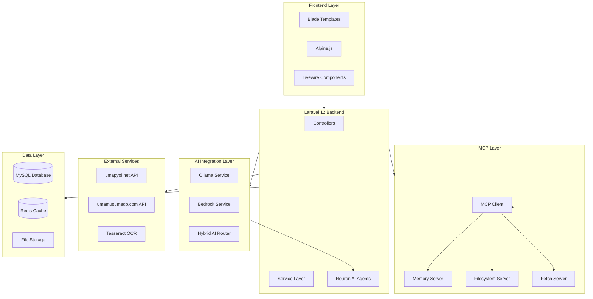

### 3.2 Component Dependencies

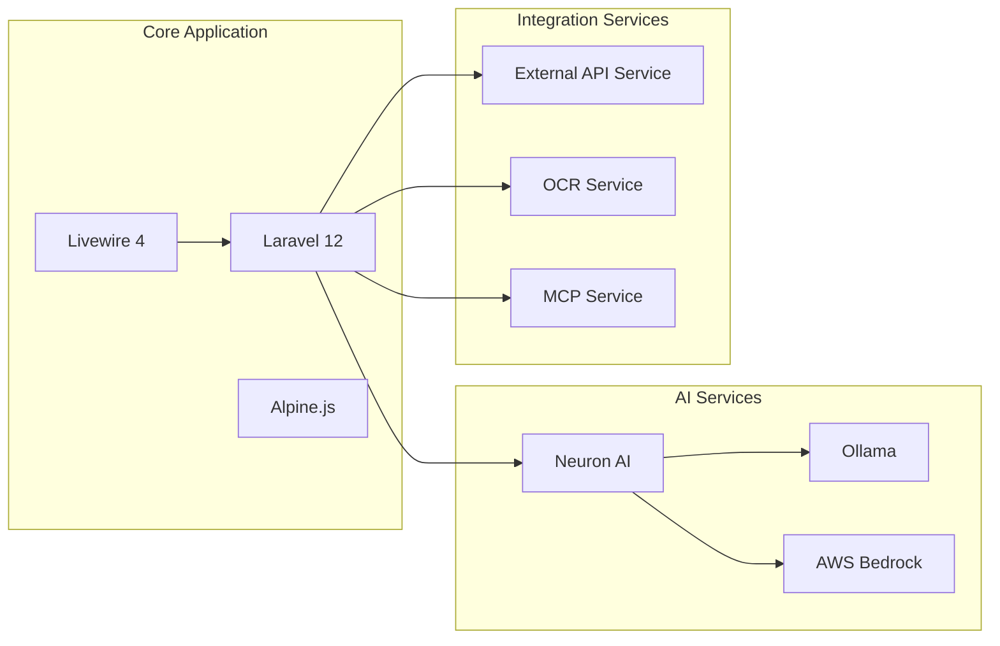

---

## 4. Integration Strategy

### 4.1 Integration Phases

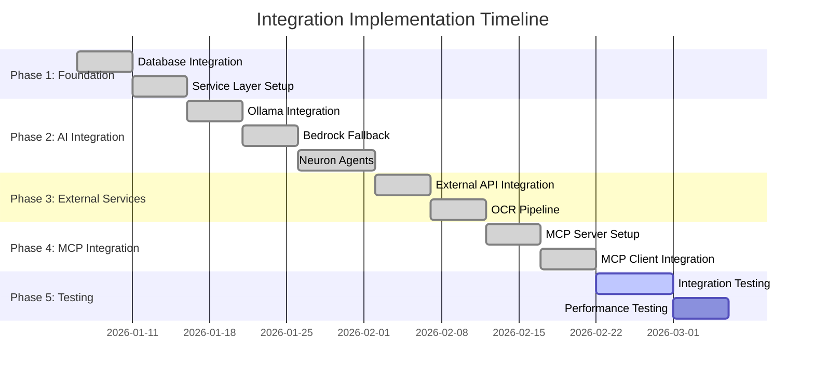

### 4.2 Integration Approach

| Phase | Focus | Deliverables |
|-------|-------|--------------|
| Phase 1 | Foundation | Database, models, repositories |
| Phase 2 | AI Integration | Ollama, Bedrock, Neuron agents |
| Phase 3 | External Services | API clients, OCR pipeline |
| Phase 4 | MCP Integration | MCP servers, client integration |
| Phase 5 | Testing | Integration and performance tests |

---

## 5. Integration Points

### 5.1 AI Provider Integration

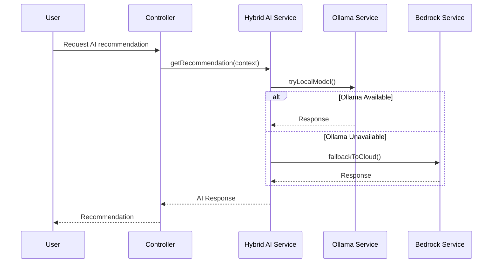

### 5.2 Neuron AI Agent Integration

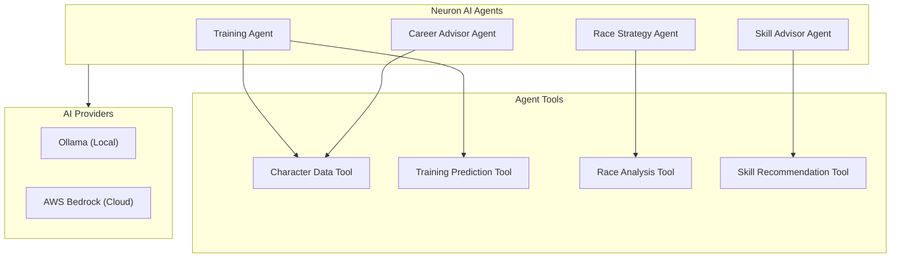

### 5.3 MCP Server Integration

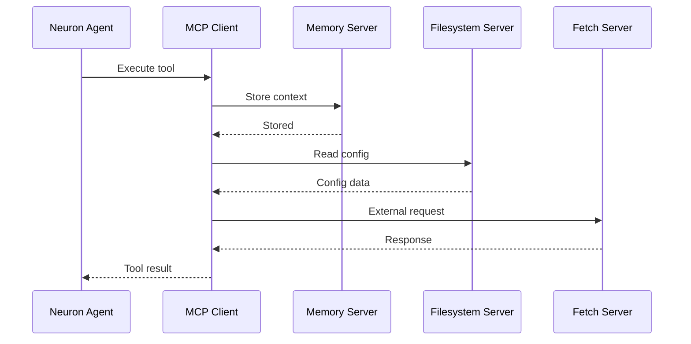

### 5.4 External API Integration

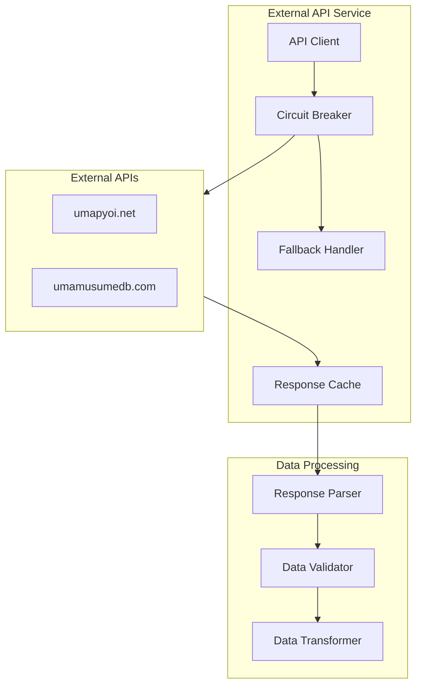

### 5.5 OCR Pipeline Integration

```mermaid
flowchart LR
    subgraph Upload["Upload Phase"]
        Image["Screenshot Upload"]
        Validation["File Validation"]
    end

    subgraph Processing["Processing Phase"]
        Preprocessing["GD Preprocessing"]
        OCR["Tesseract OCR"]
        Extraction["Text Extraction"]
    end

    subgraph Parsing["Parsing Phase"]
        Parser["Data Parser"]
        Validator["Validation"]
        Mapper["Field Mapper"]
    end

    subgraph Output["Output Phase"]
        Preview["User Preview"]
        Confirmation["Confirmation"]
        Import["Data Import"]
    end

    Upload --> Processing
    Processing --> Parsing
    Parsing --> Output
```

---

## 6. Data Flow Integration

### 6.1 AI Recommendation Flow

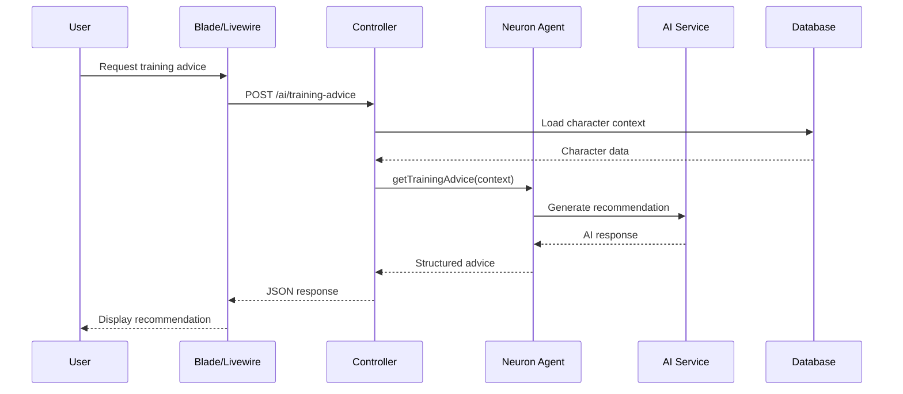

### 6.2 External Data Sync Flow

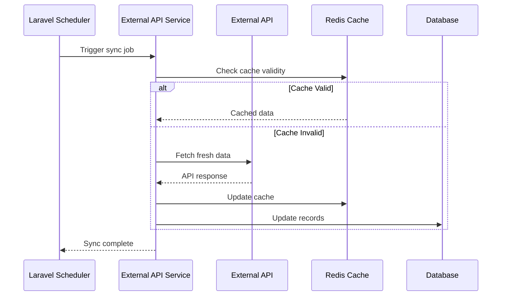

### 6.3 OCR Import Flow

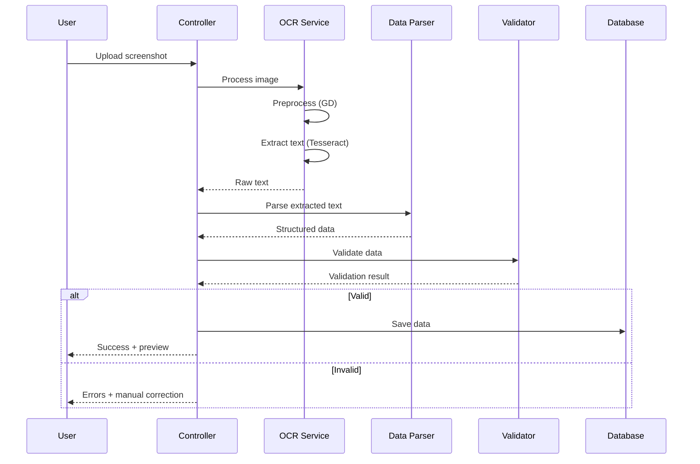

---

## 7. Integration Test Environment

### 7.1 Environment Configuration

| Environment | Database | Cache | AI Provider | Purpose |
|-------------|----------|-------|-------------|---------|
| Local Dev | SQLite | Array | Ollama Mock | Developer testing |
| CI/CD | MySQL 8.0 | Redis | Mocked | Automated testing |
| Staging | MySQL 8.0 | Redis | Ollama | UAT testing |
| Production | MySQL 8.0 | Redis | Ollama + Bedrock | Live system |

### 7.2 Test Architecture

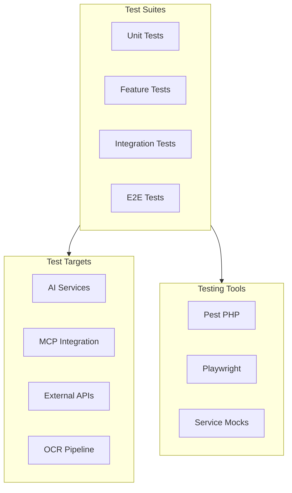

### 7.3 Mock Strategy

| Service | Mock Approach | Test Data |
|---------|---------------|-----------|
| Ollama | Response fixtures | Predefined recommendations |
| Bedrock | AWS SDK mock | Sample completions |
| External APIs | HTTP mock | Golden file responses |
| OCR | Image fixtures | Known text outputs |
| MCP Servers | In-memory mock | Test context data |

---

## 8. Integration Scenarios

### 8.1 AI Fallback Scenario

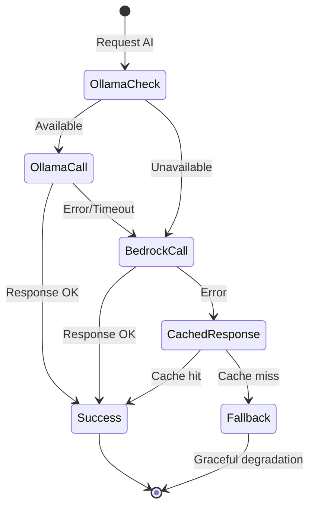

### 8.2 MCP Tool Execution Scenario

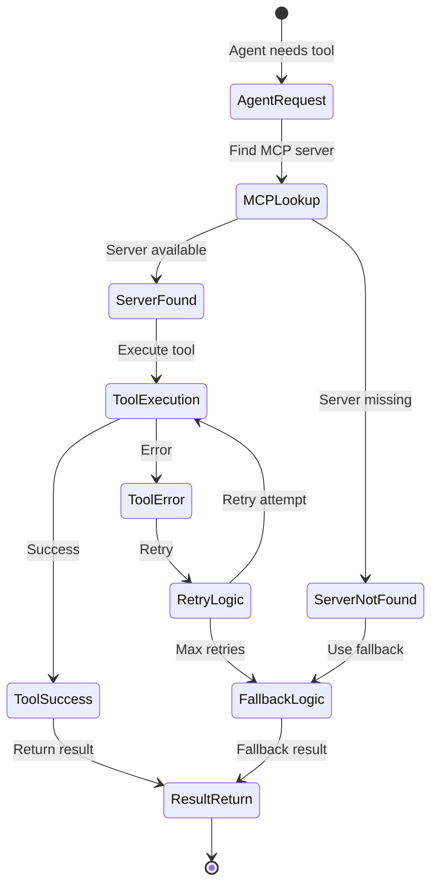

### 8.3 External API Resilience Scenario

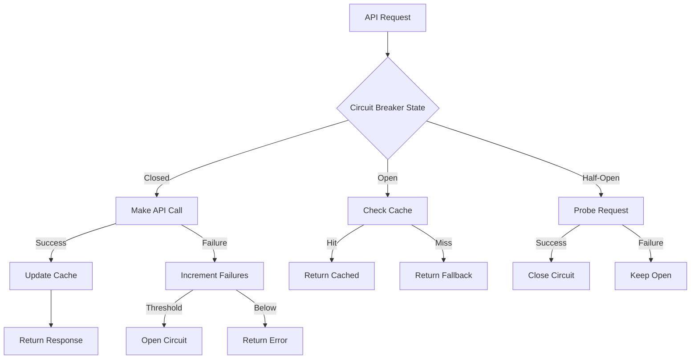

---

## 9. Integration Management

### 9.1 Dependency Management

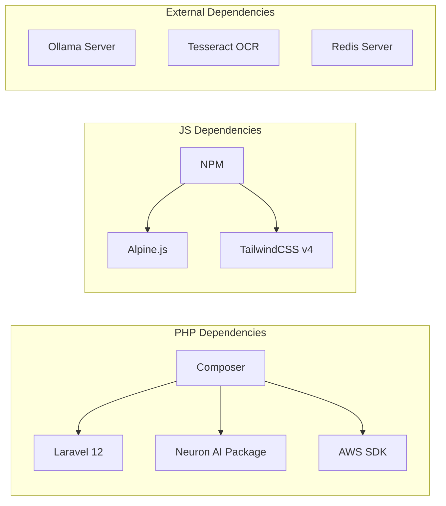

### 9.2 Configuration Management

| Configuration | Location | Purpose |
|---------------|----------|---------|
| AI Settings | `config/ai.php` | Provider selection, model config |
| Neuron Config | `config/neuron.php` | Agent definitions, tools |
| MCP Config | `config/mcp.php` | Server definitions, connections |
| External APIs | `config/external-api.php` | API endpoints, credentials |
| OCR Settings | `config/ocr.php` | Tesseract paths, options |

### 9.3 Monitoring and Observability

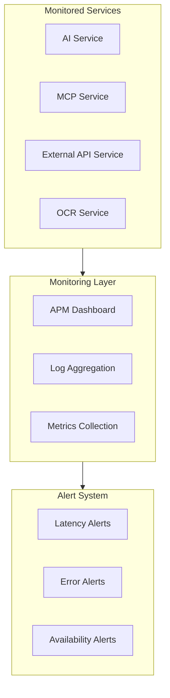

---

## 10. Sign-off Criteria

### 10.1 Integration Checklist

| Category | Criterion | Status |
|----------|-----------|--------|
| AI Integration | Ollama service operational | ✅ Complete |
| AI Integration | Bedrock fallback functional | ✅ Complete |
| AI Integration | Neuron agents responding | ✅ Complete |
| MCP Integration | Memory server connected | ✅ Complete |
| MCP Integration | Filesystem server connected | ✅ Complete |
| MCP Integration | Fetch server connected | ✅ Complete |
| External APIs | umapyoi.net integration | ✅ Complete |
| External APIs | umamusumedb.com integration | ✅ Complete |
| External APIs | Circuit breaker functional | ✅ Complete |
| OCR Pipeline | Image upload working | ✅ Complete |
| OCR Pipeline | Text extraction accurate | ✅ Complete |
| OCR Pipeline | Data parsing validated | ✅ Complete |
| Testing | Unit tests passing | ✅ Complete |
| Testing | Integration tests passing | 🔄 In Progress |
| Testing | E2E tests passing | 🔄 In Progress |

### 10.2 Acceptance Criteria

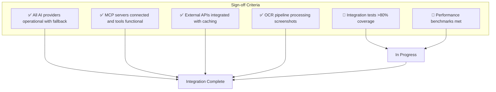

---

## Document Control

| Version | Date | Author | Changes |
|---------|------|--------|---------|| 2.3.0 | 2026-02-21 | Development Team | Updated Livewire 3→4, version alignment, codebase v2.3.0 sync || 2.1.0 | 2026-01-23 | Development Team | Updated to reflect current AI, MCP, and external integrations |
| 2.0.0 | 2026-01-14 | Development Team | Prior revision with initial integration plan |

---

## Related Documents

- [PRD-006: AI Advisory](./prds/PRD-006_AI_Advisory.md)
- [PRD-007: External Integration](./prds/PRD-007_External_Integration.md)
- [SPEC-006: AI Advisory Technical](./specs/SPEC-006_AI_Advisory_Technical.md)
- [SPEC-007: External Integration Technical](./specs/SPEC-007_External_Integration_Technical.md)
- [FLOW-006: AI Advisory System](./flows/FLOW-006_AI_Advisory_System.md)
- [FLOW-007: External Integration System](./flows/FLOW-007_External_Integration_System.md)
- [TECH-FLOW-006: AI Advisory Flow](./tech-flow/TECH-FLOW-006_AI_Advisory_Flow.md)
- [TECH-FLOW-007: External Integration Flow](./tech-flow/TECH-FLOW-007_External_Integration_Flow.md)
- [SEQ-006: AI Advice Generation](./sequences/SEQ-006_AI_Advice_Generation.md)
- [SEQ-007: External Data Sync](./sequences/SEQ-007_External_Data_Sync.md)

---

*This plan reflects current integration architecture and implementation status.*
