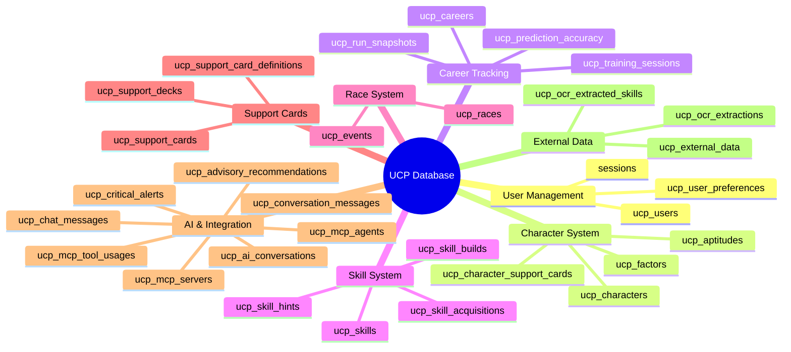
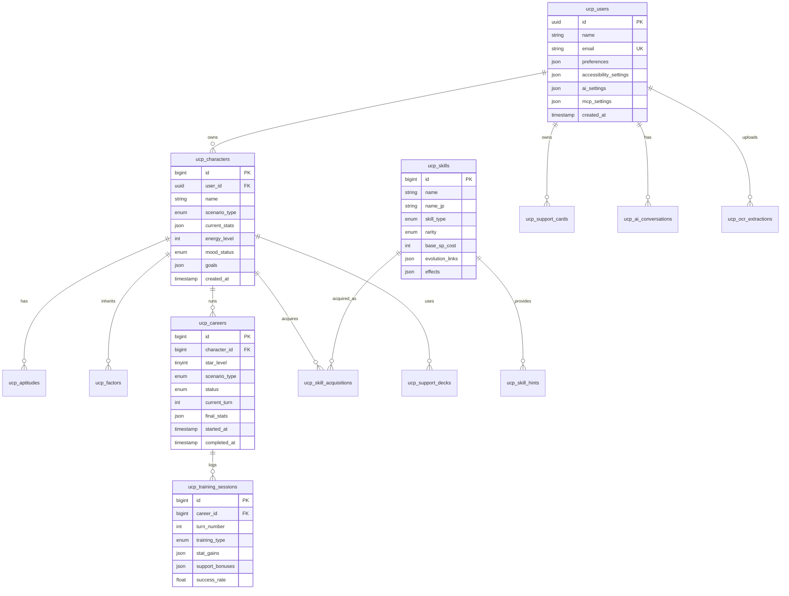
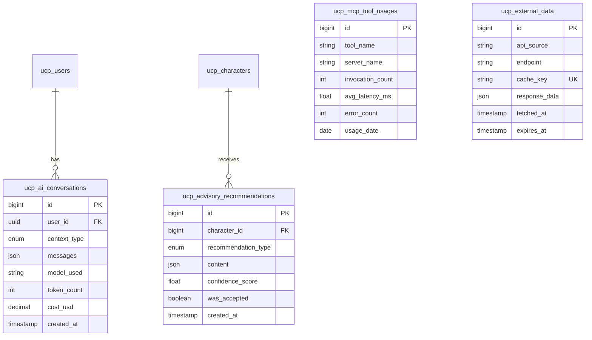
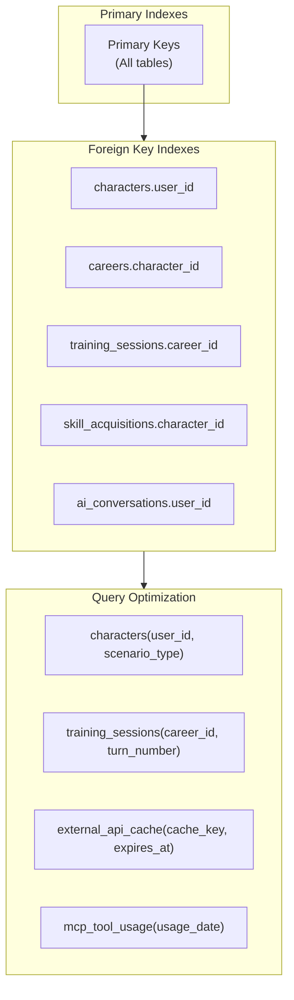
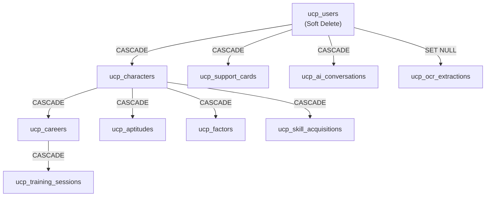
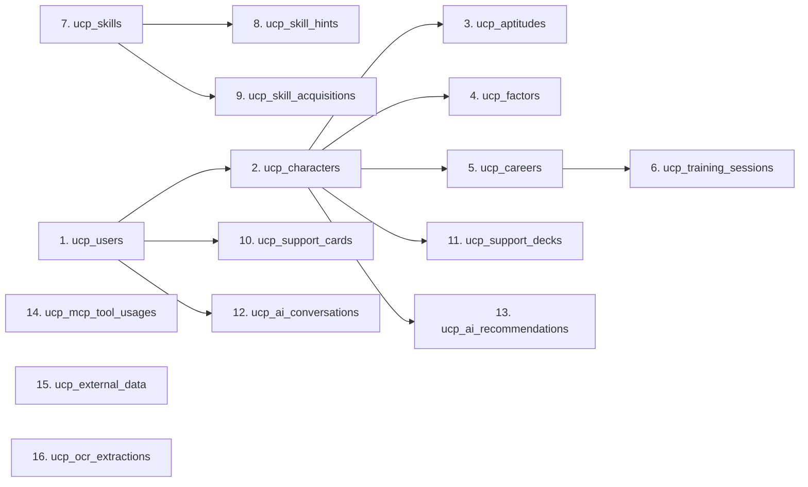

# Database Documentation (DBD)

## Umamusume Pretty Derby Career Planner

**Document Version**: 2.4.0
**Date**: February 22, 2026
**Project**: UmamusumeCareerPlanner
**Author**: Development Team
**Status**: Current - Aligned to codebase v2.4.0 with game-accurate mechanics

---

## Table of Contents

1. [Overview](#1-overview)
2. [Schema Catalog](#2-schema-catalog)
3. [Entity Relationship Diagram](#3-entity-relationship-diagram)
4. [Table Definitions](#4-table-definitions)
5. [Indexes and Performance](#5-indexes-and-performance)
6. [Data Relationships](#6-data-relationships)
7. [Migration Strategy](#7-migration-strategy)

---

## 1. Overview

### 1.1 Database Configuration

- **Property**: **Primary Database**; **Value**: MySQL 8.0+ (InnoDB)
- **Property**: **Cache/Queues**; **Value**: Redis
- **Property**: **ORM**; **Value**: Laravel Eloquent
- **Property**: **Charset**; **Value**: `utf8mb4`
- **Property**: **Collation**; **Value**: `utf8mb4_unicode_ci`
- **Property**: **Table Prefix**; **Value**: `ucp_`

### 1.2 Schema Overview



---

## 2. Schema Catalog

### 2.1 Domain Tables (UCP Prefix) — 30 Tables

- **Table**: `ucp_users`; **Purpose**: Application users; **Key Columns**: uuid, name, email, preferences, accessibility_settings, ai_settings, mcp_settings
- **Table**: `ucp_characters`; **Purpose**: Character state; **Key Columns**: user_id, name, scenario_type, current_stats, energy_level, mood_status, goals
- **Table**: `ucp_aptitudes`; **Purpose**: Aptitude grades; **Key Columns**: character_id, distance_type, surface_type, running_style, grade
- **Table**: `ucp_factors`; **Purpose**: Inheritance factors; **Key Columns**: character_id, factor_type, star_level, source_parent
- **Table**: `ucp_skills`; **Purpose**: Skill catalog; **Key Columns**: skill_type, rarity, base_sp_cost, evolution_links, effects, status, name_en
- **Table**: `ucp_skill_hints`; **Purpose**: Hint tracking; **Key Columns**: character_id, skill_id, source_type, discount_percentage, is_used
- **Table**: `ucp_skill_acquisitions`; **Purpose**: Acquisition history; **Key Columns**: character_id, skill_id, career_id, final_sp_cost, is_evolution, is_active, hint_level, hint_count
- **Table**: `ucp_skill_builds`; **Purpose**: Skill build plans; **Key Columns**: user_id, name, skills (JSON), total_sp_cost
- **Table**: `ucp_careers`; **Purpose**: Career runs; **Key Columns**: character_id, star_level, scenario_type, status, current_turn, final_stats
- **Table**: `ucp_training_sessions`; **Purpose**: Training logs; **Key Columns**: career_id, turn_number, training_type, stat_gains, support_bonuses
- **Table**: `ucp_races`; **Purpose**: Race data; **Key Columns**: career_id, race_name, distance, surface, placement, rewards
- **Table**: `ucp_events`; **Purpose**: Game events; **Key Columns**: career_id, event_type, turn_number, choices, outcomes
- **Table**: `ucp_support_cards`; **Purpose**: Support card inventory; **Key Columns**: user_id, card_name, rarity, specialization, limit_break_level, external_source
- **Table**: `ucp_support_card_definitions`; **Purpose**: Canonical card metadata; **Key Columns**: card_name_jp, card_name_en, rarity, support_type, base_stats, skill_effects
- **Table**: `ucp_character_support_cards`; **Purpose**: Character-card pivot; **Key Columns**: character_id, support_card_id, bond_level
- **Table**: `ucp_support_decks`; **Purpose**: Deck configurations; **Key Columns**: user_id, name, description, card_ids (JSON), is_active
- **Table**: `ucp_ai_conversations`; **Purpose**: AI chat history; **Key Columns**: user_id, context_type, messages, model_used
- **Table**: `ucp_conversation_messages`; **Purpose**: Conversation messages; **Key Columns**: ai_conversation_id, role, content, token_count
- **Table**: `ucp_chat_messages`; **Purpose**: Chat messages; **Key Columns**: user_id, message, response, model_used
- **Table**: `ucp_advisory_recommendations`; **Purpose**: AI-generated recommendations; **Key Columns**: character_id, recommendation_type, content, confidence_score
- **Table**: `ucp_mcp_servers`; **Purpose**: MCP server configurations; **Key Columns**: name, command, args, enabled, health_status
- **Table**: `ucp_mcp_agents`; **Purpose**: MCP agent definitions; **Key Columns**: name, type, capabilities, configuration
- **Table**: `ucp_mcp_tool_usages`; **Purpose**: MCP tool tracking; **Key Columns**: tool_name, invocation_count, avg_latency, error_count
- **Table**: `ucp_user_preferences`; **Purpose**: User preferences; **Key Columns**: user_id, key, value, category
- **Table**: `ucp_external_data`; **Purpose**: External API data cache; **Key Columns**: api_source, endpoint, response_data, expires_at
- **Table**: `ucp_ocr_extractions`; **Purpose**: OCR results; **Key Columns**: user_id, image_path, extracted_data, confidence_score
- **Table**: `ucp_ocr_extracted_skills`; **Purpose**: OCR skill detection; **Key Columns**: ocr_extraction_id, skill_id, confidence_score
- **Table**: `ucp_critical_alerts`; **Purpose**: System critical alerts; **Key Columns**: alert_type, severity, message, resolved_at
- **Table**: `ucp_prediction_accuracy`; **Purpose**: Prediction tracking; **Key Columns**: prediction_type, predicted_value, actual_value, accuracy
- **Table**: `ucp_run_snapshots`; **Purpose**: Career run snapshots; **Key Columns**: career_id, turn_number, snapshot_data, created_at

### 2.2 Models (30 Total)

The following Eloquent models map to the domain tables:

- **Model**: `AdvisoryRecommendation`; **Table**: `ucp_advisory_recommendations`; **Purpose**: AI-generated recommendations
- **Model**: `AIConversation`; **Table**: `ucp_ai_conversations`; **Purpose**: AI chat history
- **Model**: `Aptitude`; **Table**: `ucp_aptitudes`; **Purpose**: Aptitude grades
- **Model**: `Career`; **Table**: `ucp_careers`; **Purpose**: Career runs
- **Model**: `Character`; **Table**: `ucp_characters`; **Purpose**: Character state
- **Model**: `CharacterSupportCard`; **Table**: `ucp_character_support_cards`; **Purpose**: Character-card pivot
- **Model**: `ChatMessage`; **Table**: `ucp_chat_messages`; **Purpose**: Chat messages
- **Model**: `ConversationMessage`; **Table**: `ucp_conversation_messages`; **Purpose**: Conversation messages
- **Model**: `CriticalAlert`; **Table**: `ucp_critical_alerts`; **Purpose**: System critical alerts
- **Model**: `Event`; **Table**: `ucp_events`; **Purpose**: Game events
- **Model**: `ExternalData`; **Table**: `ucp_external_data`; **Purpose**: External API data cache
- **Model**: `Factor`; **Table**: `ucp_factors`; **Purpose**: Inheritance factors
- **Model**: `MCPAgent`; **Table**: `ucp_mcp_agents`; **Purpose**: MCP agent definitions
- **Model**: `MCPServer`; **Table**: `ucp_mcp_servers`; **Purpose**: MCP server configurations
- **Model**: `MCPToolUsage`; **Table**: `ucp_mcp_tool_usages`; **Purpose**: MCP tool tracking
- **Model**: `OcrExtractedSkill`; **Table**: `ucp_ocr_extracted_skills`; **Purpose**: OCR skill detection
- **Model**: `OCRExtraction`; **Table**: `ucp_ocr_extractions`; **Purpose**: OCR results
- **Model**: `PredictionAccuracy`; **Table**: `ucp_prediction_accuracy`; **Purpose**: Prediction tracking
- **Model**: `Race`; **Table**: `ucp_races`; **Purpose**: Race data
- **Model**: `RunSnapshot`; **Table**: `ucp_run_snapshots`; **Purpose**: Career run snapshots
- **Model**: `Skill`; **Table**: `ucp_skills`; **Purpose**: Skill catalog
- **Model**: `SkillAcquisition`; **Table**: `ucp_skill_acquisitions`; **Purpose**: Acquisition history
- **Model**: `SkillBuild`; **Table**: `ucp_skill_builds`; **Purpose**: Skill build plans
- **Model**: `SkillHint`; **Table**: `ucp_skill_hints`; **Purpose**: Hint tracking
- **Model**: `SupportCard`; **Table**: `ucp_support_cards`; **Purpose**: Support card inventory
- **Model**: `SupportCardDefinition`; **Table**: `ucp_support_card_definitions`; **Purpose**: Canonical card metadata
- **Model**: `SupportDeck`; **Table**: `ucp_support_decks`; **Purpose**: Deck configurations
- **Model**: `TrainingSession`; **Table**: `ucp_training_sessions`; **Purpose**: Training logs
- **Model**: `User`; **Table**: `ucp_users`; **Purpose**: Application users
- **Model**: `UserPreference`; **Table**: `ucp_user_preferences`; **Purpose**: User preferences

### 2.3 Supporting Tables

- **Table**: `sessions`; **Purpose**: Laravel session storage
- **Table**: `cache`; **Purpose**: Laravel cache storage
- **Table**: `jobs`; **Purpose**: Queue job storage
- **Table**: `failed_jobs`; **Purpose**: Failed queue jobs
- **Table**: `activity_log`; **Purpose**: Audit trail (Spatie)

---

## 3. Entity Relationship Diagram

### 3.1 Core Domain Relationships



### 3.2 AI and Integration Relationships



---

## 4. Table Definitions

### 4.1 `ucp_users`

Extended user table with application-specific settings.

- **Column**: `id`; **Type**: UUID; **Constraints**: PK; **Description**: Primary key
- **Column**: `name`; **Type**: String(255); **Constraints**: Not Null; **Description**: Display name
- **Column**: `email`; **Type**: String(255); **Constraints**: Unique, Not Null; **Description**: Login email
- **Column**: `password`; **Type**: String(255); **Constraints**: Not Null; **Description**: Hashed password
- **Column**: `preferences`; **Type**: JSON; **Constraints**: Nullable; **Description**: UI preferences (dark_mode, language)
- **Column**: `accessibility_settings`; **Type**: JSON; **Constraints**: Nullable; **Description**: A11y settings (reduced_motion, font_size)
- **Column**: `ai_settings`; **Type**: JSON; **Constraints**: Nullable; **Description**: AI preferences (provider, model, cost_limit)
- **Column**: `mcp_settings`; **Type**: JSON; **Constraints**: Nullable; **Description**: MCP server preferences
- **Column**: `email_verified_at`; **Type**: Timestamp; **Constraints**: Nullable; **Description**: Verification timestamp
- **Column**: `created_at`; **Type**: Timestamp; **Constraints**: -; **Description**: Creation timestamp
- **Column**: `updated_at`; **Type**: Timestamp; **Constraints**: -; **Description**: Last update timestamp

### 4.2 `ucp_characters`

Character state tracking with stats and goals.

- **Column**: `id`; **Type**: BigInt; **Constraints**: PK, Auto; **Description**: Primary key
- **Column**: `user_id`; **Type**: UUID; **Constraints**: FK → ucp_users; **Description**: Owner
- **Column**: `name`; **Type**: String(255); **Constraints**: Not Null; **Description**: Character name
- **Column**: `scenario_type`; **Type**: Enum; **Constraints**: Not Null; **Description**: `ura_finale`, `unity_cup`
- **Column**: `current_stats`; **Type**: JSON; **Constraints**: Not Null; **Description**: {speed, stamina, power, guts, wit}
- **Column**: `energy_level`; **Type**: Int; **Constraints**: 0-100; **Description**: Current energy
- **Column**: `mood_status`; **Type**: Enum; **Constraints**: Not Null; **Description**: `great`, `good`, `normal`, `bad`, `awful`
- **Column**: `goals`; **Type**: JSON; **Constraints**: Nullable; **Description**: Active goals array
- **Column**: `conditions`; **Type**: JSON; **Constraints**: Nullable; **Description**: Active conditions array
- **Column**: `created_at`; **Type**: Timestamp; **Constraints**: -; **Description**: Creation timestamp
- **Column**: `updated_at`; **Type**: Timestamp; **Constraints**: -; **Description**: Last update timestamp
- **Column**: `deleted_at`; **Type**: Timestamp; **Constraints**: Nullable; **Description**: Soft delete

**Stat Range**: 0-1200 (hard cap)

### 4.3 `ucp_skills`

Skill catalog with evolution tracking.

- **Column**: `id`; **Type**: BigInt; **Constraints**: PK, Auto; **Description**: Primary key
- **Column**: `name`; **Type**: String(255); **Constraints**: Not Null; **Description**: English name
- **Column**: `name_jp`; **Type**: String(255); **Constraints**: Nullable; **Description**: Japanese name
- **Column**: `skill_type`; **Type**: Enum; **Constraints**: Not Null; **Description**: `speed`, `stamina`, `power`, `guts`, `wit`, `unique`, `recovery`
- **Column**: `rarity`; **Type**: Enum; **Constraints**: Not Null; **Description**: `normal`, `rare`, `unique`
- **Column**: `base_sp_cost`; **Type**: Int; **Constraints**: Not Null; **Description**: Base SP cost
- **Column**: `evolution_from_id`; **Type**: BigInt; **Constraints**: FK → ucp_skills, Nullable; **Description**: Source skill for evolution
- **Column**: `evolution_links`; **Type**: JSON; **Constraints**: Nullable; **Description**: Evolution path data
- **Column**: `effects`; **Type**: JSON; **Constraints**: Nullable; **Description**: Skill effects description
- **Column**: `activation_conditions`; **Type**: JSON; **Constraints**: Nullable; **Description**: Trigger conditions

### 4.4 `ucp_training_sessions`

Training session logs with predictions.

- **Column**: `id`; **Type**: BigInt; **Constraints**: PK, Auto; **Description**: Primary key
- **Column**: `career_id`; **Type**: BigInt; **Constraints**: FK → ucp_careers; **Description**: Parent career
- **Column**: `turn_number`; **Type**: Int; **Constraints**: 1-78; **Description**: Turn number
- **Column**: `training_type`; **Type**: Enum; **Constraints**: Not Null; **Description**: `speed`, `stamina`, `power`, `guts`, `wit`, `rest`
- **Column**: `stat_gains`; **Type**: JSON; **Constraints**: Not Null; **Description**: {speed, stamina, power, guts, wit}
- **Column**: `support_bonuses`; **Type**: JSON; **Constraints**: Nullable; **Description**: Applied support card bonuses
- **Column**: `skill_hints_gained`; **Type**: JSON; **Constraints**: Nullable; **Description**: Hints received
- **Column**: `success_rate`; **Type**: Float; **Constraints**: 0-100; **Description**: Predicted success rate
- **Column**: `was_successful`; **Type**: Boolean; **Constraints**: Default true; **Description**: Actual outcome
- **Column**: `energy_delta`; **Type**: Int; **Constraints**: -; **Description**: Energy change
- **Column**: `mood_change`; **Type**: Enum; **Constraints**: Nullable; **Description**: Mood transition
- **Column**: `created_at`; **Type**: Timestamp; **Constraints**: -; **Description**: Session timestamp

### 4.5 `ucp_ai_conversations`

AI conversation history for context persistence.

- **Column**: `id`; **Type**: BigInt; **Constraints**: PK, Auto; **Description**: Primary key
- **Column**: `user_id`; **Type**: UUID; **Constraints**: FK → ucp_users; **Description**: Owner
- **Column**: `context_type`; **Type**: Enum; **Constraints**: Not Null; **Description**: `training`, `race`, `skill`, `career`, `general`
- **Column**: `context_id`; **Type**: BigInt; **Constraints**: Nullable; **Description**: Related entity ID
- **Column**: `messages`; **Type**: JSON; **Constraints**: Not Null; **Description**: Conversation messages array
- **Column**: `model_used`; **Type**: String(100); **Constraints**: Not Null; **Description**: AI model identifier
- **Column**: `provider`; **Type**: Enum; **Constraints**: Not Null; **Description**: `ollama`, `bedrock`
- **Column**: `token_count`; **Type**: Int; **Constraints**: Default 0; **Description**: Total tokens used
- **Column**: `cost_usd`; **Type**: Decimal(10,6); **Constraints**: Default 0; **Description**: Estimated cost
- **Column**: `created_at`; **Type**: Timestamp; **Constraints**: -; **Description**: Start timestamp
- **Column**: `updated_at`; **Type**: Timestamp; **Constraints**: -; **Description**: Last message timestamp

### 4.6 `ucp_mcp_tool_usages`

MCP tool usage metrics for monitoring.

- **Column**: `id`; **Type**: BigInt; **Constraints**: PK, Auto; **Description**: Primary key
- **Column**: `tool_name`; **Type**: String(100); **Constraints**: Not Null; **Description**: Tool identifier
- **Column**: `server_name`; **Type**: String(100); **Constraints**: Not Null; **Description**: MCP server name
- **Column**: `invocation_count`; **Type**: Int; **Constraints**: Default 0; **Description**: Daily invocation count
- **Column**: `success_count`; **Type**: Int; **Constraints**: Default 0; **Description**: Successful invocations
- **Column**: `error_count`; **Type**: Int; **Constraints**: Default 0; **Description**: Failed invocations
- **Column**: `avg_latency_ms`; **Type**: Float; **Constraints**: Nullable; **Description**: Average response time
- **Column**: `total_tokens`; **Type**: Int; **Constraints**: Default 0; **Description**: Tokens consumed
- **Column**: `usage_date`; **Type**: Date; **Constraints**: Not Null; **Description**: Aggregation date

**Index**: `UNIQUE(tool_name, server_name, usage_date)`

---

## 5. Indexes and Performance

### 5.1 Index Strategy



### 5.2 Index Definitions

- **Table**: `ucp_characters`; **Index Name**: `idx_user_scenario`; **Columns**: `user_id`, `scenario_type`; **Purpose**: User character filtering
- **Table**: `ucp_careers`; **Index Name**: `idx_character_status`; **Columns**: `character_id`, `status`; **Purpose**: Career lookup
- **Table**: `ucp_training_sessions`; **Index Name**: `idx_career_turn`; **Columns**: `career_id`, `turn_number`; **Purpose**: Turn history
- **Table**: `ucp_skill_acquisitions`; **Index Name**: `idx_character_active`; **Columns**: `character_id`, `is_active`; **Purpose**: Active skills
- **Table**: `ucp_ai_conversations`; **Index Name**: `idx_user_context`; **Columns**: `user_id`, `context_type`; **Purpose**: Conversation lookup
- **Table**: `ucp_external_data`; **Index Name**: `idx_cache_expiry`; **Columns**: `cache_key`, `expires_at`; **Purpose**: Cache retrieval
- **Table**: `ucp_mcp_tool_usages`; **Index Name**: `idx_tool_date`; **Columns**: `tool_name`, `usage_date`; **Purpose**: Usage aggregation

### 5.3 Query Performance Targets

- **Operation**: Character list (paginated); **Target**: < 100ms; **Notes**: User-scoped with eager loading
- **Operation**: Training prediction; **Target**: < 200ms; **Notes**: With caching
- **Operation**: AI conversation load; **Target**: < 150ms; **Notes**: Last 10 messages
- **Operation**: External API cache hit; **Target**: < 50ms; **Notes**: Redis-backed
- **Operation**: MCP tool lookup; **Target**: < 30ms; **Notes**: In-memory after first load

---

## 6. Data Relationships

### 6.1 Cascade Rules



### 6.2 Relationship Summary

- **Parent**: `ucp_users`; **Child**: `ucp_characters`; **On Delete**: CASCADE; **Notes**: User deletion removes characters
- **Parent**: `ucp_users`; **Child**: `ucp_ai_conversations`; **On Delete**: CASCADE; **Notes**: Conversations tied to user
- **Parent**: `ucp_characters`; **Child**: `ucp_careers`; **On Delete**: CASCADE; **Notes**: Character deletion removes careers
- **Parent**: `ucp_characters`; **Child**: `ucp_skill_acquisitions`; **On Delete**: CASCADE; **Notes**: Skills tied to character
- **Parent**: `ucp_careers`; **Child**: `ucp_training_sessions`; **On Delete**: CASCADE; **Notes**: Sessions tied to career
- **Parent**: `ucp_skills`; **Child**: `ucp_skill_acquisitions`; **On Delete**: RESTRICT; **Notes**: Cannot delete referenced skills
- **Parent**: `ucp_support_cards`; **Child**: `ucp_support_decks`; **On Delete**: RESTRICT; **Notes**: Cannot delete cards in use

---

## 7. Migration Strategy

### 7.1 Migration Naming Convention

```text
YYYY_MM_DD_HHMMSS_create_ucp_table_name.php
YYYY_MM_DD_HHMMSS_add_column_to_ucp_table.php
YYYY_MM_DD_HHMMSS_modify_column_in_ucp_table.php
```

### 7.2 Migration Order



### 7.3 Rollback Considerations

- All migrations include `down()` methods
- Foreign key constraints dropped before table drops
- JSON columns use `->nullable()` for backward compatibility
- Soft deletes preserve data for 30-day recovery window

---

## Document Control

- **Version**: 2.4.0; **Date**: 2026-02-22; **Author**: Development Team; **Changes**: Corrected all 30 table names to match actual migrations (ucp_mcp_tool_usages, ucp_advisory_recommendations, ucp_external_data, ucp_critical_alerts, ucp_prediction_accuracy, ucp_run_snapshots), added missing tables to Section 2.1, 51 migrations total
- **Version**: 2.3.0; **Date**: 2026-02-21; **Author**: Development Team; **Changes**: Added complete 30-model catalog, updated schema mindmap with all tables, version alignment to v2.3.0
- **Version**: 2.1.0; **Date**: 2026-01-23; **Author**: Development Team; **Changes**: Updated schema to match current implementation, added AI/MCP tables
- **Version**: 2.0.0; **Date**: 2026-01-14; **Author**: Development Team; **Changes**: Prior revision with base schema

---

### This document reflects the current database schema across 51 migrations and is aligned with the 30 Eloquent models
