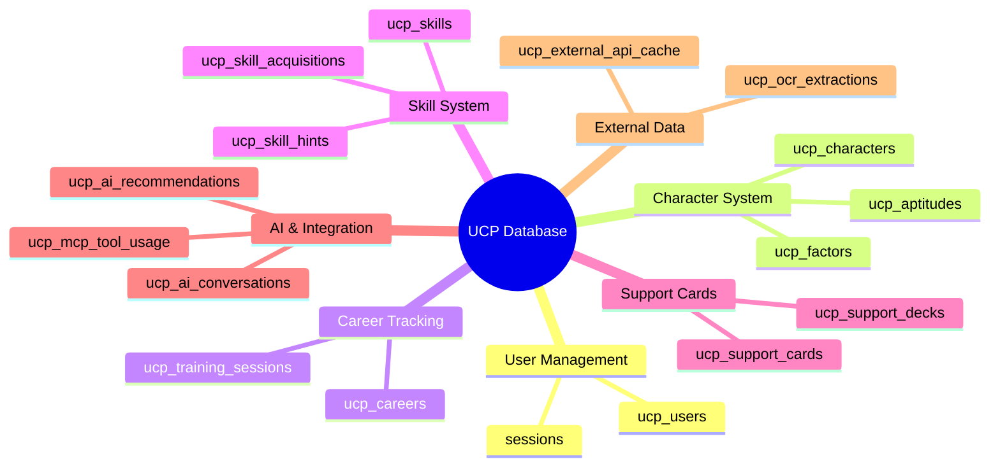
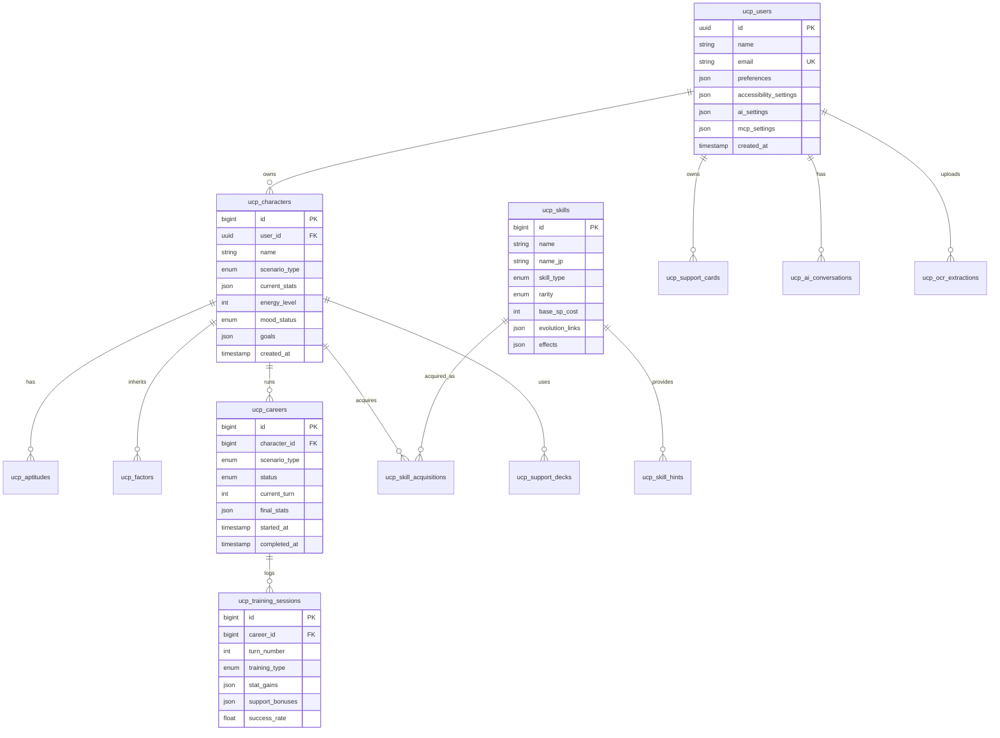
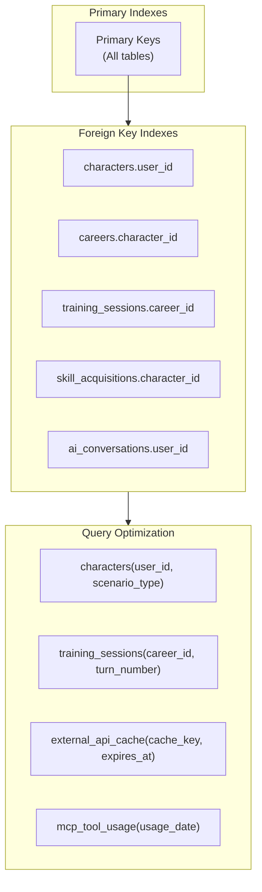
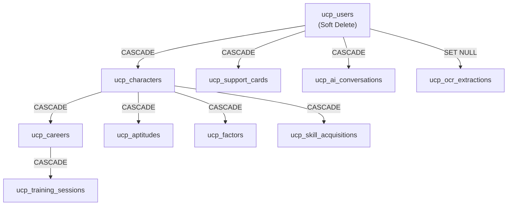
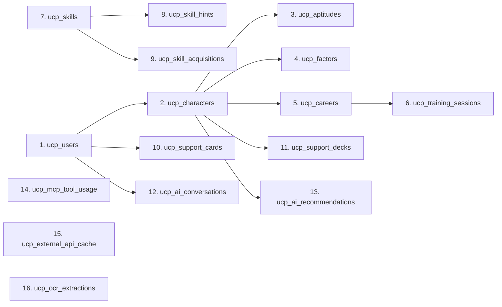

# Database Documentation (DBD)

## Umamusume Pretty Derby Career Planner

**Document Version**: 2.1.0
**Date**: January 23, 2026
**Project**: UmamusumeCareerPlanner
**Author**: Development Team
**Status**: Current - Aligned to codebase

---

## Table of Contents

1. [Overview](#1-overview)
2. [Schema Catalog](#2-schema-catalog)
3. [Entity Relationship Diagram](#3-entity-relationship-diagram)
4. [Table Definitions](#4-table-definitions)
5. [Indexes and Performance](#5-indexes-and-performance)
6. [Data Relationships](#6-data-relationships)
7. [Migration Strategy](#7-migration-strategy)

---

## 1. Overview

### 1.1 Database Configuration

| Property | Value |
|----------|-------|
| **Primary Database** | MySQL 8.0+ (InnoDB) |
| **Cache/Queues** | Redis |
| **ORM** | Laravel Eloquent |
| **Charset** | `utf8mb4` |
| **Collation** | `utf8mb4_unicode_ci` |
| **Table Prefix** | `ucp_` |

### 1.2 Schema Overview



---

## 2. Schema Catalog

### 2.1 Domain Tables (UCP Prefix)

| Table | Purpose | Key Columns |
|-------|---------|-------------|
| `ucp_users` | Application users | uuid, name, email, preferences, accessibility_settings, ai_settings, mcp_settings |
| `ucp_characters` | Character state | user_id, name, scenario_type, current_stats, energy_level, mood_status, goals |
| `ucp_aptitudes` | Aptitude grades | character_id, distance_type, surface_type, running_style, grade |
| `ucp_factors` | Inheritance factors | character_id, factor_type, star_level, source_parent |
| `ucp_skills` | Skill catalog | skill_type, rarity, base_sp_cost, evolution_links, effects |
| `ucp_skill_hints` | Hint tracking | character_id, skill_id, source_type, discount_percentage, is_used |
| `ucp_skill_acquisitions` | Acquisition history | character_id, skill_id, career_id, final_sp_cost, is_evolution, is_active |
| `ucp_careers` | Career runs | character_id, scenario_type, status, current_turn, final_stats |
| `ucp_training_sessions` | Training logs | career_id, turn_number, training_type, stat_gains, support_bonuses |
| `ucp_support_cards` | Support card inventory | user_id, card_name, rarity, specialization, limit_break_level |
| `ucp_support_decks` | Deck configurations | character_id, card_ids, synergy_score |
| `ucp_ai_conversations` | AI chat history | user_id, context_type, messages, model_used |
| `ucp_ai_recommendations` | AI recommendations | character_id, recommendation_type, content, confidence_score |
| `ucp_mcp_tool_usage` | MCP tool tracking | tool_name, invocation_count, avg_latency, error_count |
| `ucp_external_api_cache` | API response cache | api_source, endpoint, response_data, expires_at |
| `ucp_ocr_extractions` | OCR results | user_id, image_path, extracted_data, confidence_score |

### 2.2 Supporting Tables

| Table | Purpose |
|-------|---------|
| `sessions` | Laravel session storage |
| `cache` | Laravel cache storage |
| `jobs` | Queue job storage |
| `failed_jobs` | Failed queue jobs |
| `activity_log` | Audit trail (Spatie) |

---

## 3. Entity Relationship Diagram

### 3.1 Core Domain Relationships



### 3.2 AI and Integration Relationships


---

## 4. Table Definitions

### 4.1 `ucp_users`

Extended user table with application-specific settings.

| Column | Type | Constraints | Description |
|--------|------|-------------|-------------|
| `id` | UUID | PK | Primary key |
| `name` | String(255) | Not Null | Display name |
| `email` | String(255) | Unique, Not Null | Login email |
| `password` | String(255) | Not Null | Hashed password |
| `preferences` | JSON | Nullable | UI preferences (dark_mode, language) |
| `accessibility_settings` | JSON | Nullable | A11y settings (reduced_motion, font_size) |
| `ai_settings` | JSON | Nullable | AI preferences (provider, model, cost_limit) |
| `mcp_settings` | JSON | Nullable | MCP server preferences |
| `email_verified_at` | Timestamp | Nullable | Verification timestamp |
| `created_at` | Timestamp | - | Creation timestamp |
| `updated_at` | Timestamp | - | Last update timestamp |

### 4.2 `ucp_characters`

Character state tracking with stats and goals.

| Column | Type | Constraints | Description |
|--------|------|-------------|-------------|
| `id` | BigInt | PK, Auto | Primary key |
| `user_id` | UUID | FK → ucp_users | Owner |
| `name` | String(255) | Not Null | Character name |
| `scenario_type` | Enum | Not Null | `ura_finale`, `unity_cup` |
| `current_stats` | JSON | Not Null | {speed, stamina, power, guts, wit} |
| `energy_level` | Int | 0-100 | Current energy |
| `mood_status` | Enum | Not Null | `great`, `good`, `normal`, `bad`, `awful` |
| `goals` | JSON | Nullable | Active goals array |
| `conditions` | JSON | Nullable | Active conditions array |
| `created_at` | Timestamp | - | Creation timestamp |
| `updated_at` | Timestamp | - | Last update timestamp |
| `deleted_at` | Timestamp | Nullable | Soft delete |

**Stat Range**: 0-1200 (hard cap)

### 4.3 `ucp_skills`

Skill catalog with evolution tracking.

| Column | Type | Constraints | Description |
|--------|------|-------------|-------------|
| `id` | BigInt | PK, Auto | Primary key |
| `name` | String(255) | Not Null | English name |
| `name_jp` | String(255) | Nullable | Japanese name |
| `skill_type` | Enum | Not Null | `speed`, `stamina`, `power`, `guts`, `wit`, `unique`, `recovery` |
| `rarity` | Enum | Not Null | `normal`, `rare`, `unique` |
| `base_sp_cost` | Int | Not Null | Base SP cost |
| `evolution_from_id` | BigInt | FK → ucp_skills, Nullable | Source skill for evolution |
| `evolution_links` | JSON | Nullable | Evolution path data |
| `effects` | JSON | Nullable | Skill effects description |
| `activation_conditions` | JSON | Nullable | Trigger conditions |

### 4.4 `ucp_training_sessions`

Training session logs with predictions.

| Column | Type | Constraints | Description |
|--------|------|-------------|-------------|
| `id` | BigInt | PK, Auto | Primary key |
| `career_id` | BigInt | FK → ucp_careers | Parent career |
| `turn_number` | Int | 1-78 | Turn number |
| `training_type` | Enum | Not Null | `speed`, `stamina`, `power`, `guts`, `wit`, `rest` |
| `stat_gains` | JSON | Not Null | {speed, stamina, power, guts, wit} |
| `support_bonuses` | JSON | Nullable | Applied support card bonuses |
| `skill_hints_gained` | JSON | Nullable | Hints received |
| `success_rate` | Float | 0-100 | Predicted success rate |
| `was_successful` | Boolean | Default true | Actual outcome |
| `energy_delta` | Int | - | Energy change |
| `mood_change` | Enum | Nullable | Mood transition |
| `created_at` | Timestamp | - | Session timestamp |

### 4.5 `ucp_ai_conversations`

AI conversation history for context persistence.

| Column | Type | Constraints | Description |
|--------|------|-------------|-------------|
| `id` | BigInt | PK, Auto | Primary key |
| `user_id` | UUID | FK → ucp_users | Owner |
| `context_type` | Enum | Not Null | `training`, `race`, `skill`, `career`, `general` |
| `context_id` | BigInt | Nullable | Related entity ID |
| `messages` | JSON | Not Null | Conversation messages array |
| `model_used` | String(100) | Not Null | AI model identifier |
| `provider` | Enum | Not Null | `ollama`, `bedrock` |
| `token_count` | Int | Default 0 | Total tokens used |
| `cost_usd` | Decimal(10,6) | Default 0 | Estimated cost |
| `created_at` | Timestamp | - | Start timestamp |
| `updated_at` | Timestamp | - | Last message timestamp |

### 4.6 `ucp_mcp_tool_usage`

MCP tool usage metrics for monitoring.

| Column | Type | Constraints | Description |
|--------|------|-------------|-------------|
| `id` | BigInt | PK, Auto | Primary key |
| `tool_name` | String(100) | Not Null | Tool identifier |
| `server_name` | String(100) | Not Null | MCP server name |
| `invocation_count` | Int | Default 0 | Daily invocation count |
| `success_count` | Int | Default 0 | Successful invocations |
| `error_count` | Int | Default 0 | Failed invocations |
| `avg_latency_ms` | Float | Nullable | Average response time |
| `total_tokens` | Int | Default 0 | Tokens consumed |
| `usage_date` | Date | Not Null | Aggregation date |

**Index**: `UNIQUE(tool_name, server_name, usage_date)`

---

## 5. Indexes and Performance

### 5.1 Index Strategy



### 5.2 Index Definitions

| Table | Index Name | Columns | Purpose |
|-------|------------|---------|---------|
| `ucp_characters` | `idx_user_scenario` | `user_id`, `scenario_type` | User character filtering |
| `ucp_careers` | `idx_character_status` | `character_id`, `status` | Career lookup |
| `ucp_training_sessions` | `idx_career_turn` | `career_id`, `turn_number` | Turn history |
| `ucp_skill_acquisitions` | `idx_character_active` | `character_id`, `is_active` | Active skills |
| `ucp_ai_conversations` | `idx_user_context` | `user_id`, `context_type` | Conversation lookup |
| `ucp_external_api_cache` | `idx_cache_expiry` | `cache_key`, `expires_at` | Cache retrieval |
| `ucp_mcp_tool_usage` | `idx_tool_date` | `tool_name`, `usage_date` | Usage aggregation |

### 5.3 Query Performance Targets

| Operation | Target | Notes |
|-----------|--------|-------|
| Character list (paginated) | < 100ms | User-scoped with eager loading |
| Training prediction | < 200ms | With caching |
| AI conversation load | < 150ms | Last 10 messages |
| External API cache hit | < 50ms | Redis-backed |
| MCP tool lookup | < 30ms | In-memory after first load |

---

## 6. Data Relationships

### 6.1 Cascade Rules



### 6.2 Relationship Summary

| Parent | Child | On Delete | Notes |
|--------|-------|-----------|-------|
| `ucp_users` | `ucp_characters` | CASCADE | User deletion removes characters |
| `ucp_users` | `ucp_ai_conversations` | CASCADE | Conversations tied to user |
| `ucp_characters` | `ucp_careers` | CASCADE | Character deletion removes careers |
| `ucp_characters` | `ucp_skill_acquisitions` | CASCADE | Skills tied to character |
| `ucp_careers` | `ucp_training_sessions` | CASCADE | Sessions tied to career |
| `ucp_skills` | `ucp_skill_acquisitions` | RESTRICT | Cannot delete referenced skills |
| `ucp_support_cards` | `ucp_support_decks` | RESTRICT | Cannot delete cards in use |

---

## 7. Migration Strategy

### 7.1 Migration Naming Convention

```
YYYY_MM_DD_HHMMSS_create_ucp_table_name.php
YYYY_MM_DD_HHMMSS_add_column_to_ucp_table.php
YYYY_MM_DD_HHMMSS_modify_column_in_ucp_table.php
```

### 7.2 Migration Order



### 7.3 Rollback Considerations

- All migrations include `down()` methods
- Foreign key constraints dropped before table drops
- JSON columns use `->nullable()` for backward compatibility
- Soft deletes preserve data for 30-day recovery window

---

## Document Control

| Version | Date | Author | Changes |
|---------|------|--------|---------|
| 2.1.0 | 2026-01-23 | Development Team | Updated schema to match current implementation, added AI/MCP tables |
| 2.0.0 | 2026-01-14 | Development Team | Prior revision with base schema |

---

*This document reflects the current database schema and is aligned with the implemented Laravel migrations.*
