# Source Code Documentation (SCD)

## Umamusume Pretty Derby Career Planner

**Document Version**: 2.4.0
**Date**: February 22, 2026
**Project**: UmamusumeCareerPlanner
**Author**: Development Team
**Status**: Current - Aligned with codebase v2.4.0 and game-accurate mechanics

---

## Table of Contents

1. [Introduction](#1-introduction)
2. [Project Structure](#2-project-structure)
3. [Key Namespaces & Classes](#3-key-namespaces--classes)
4. [Service Layer Architecture](#4-service-layer-architecture)
5. [AI and MCP Integration](#5-ai-and-mcp-integration)
6. [Frontend Code Structure](#6-frontend-code-structure)
7. [API Reference](#7-api-reference)
8. [Coding Standards](#8-coding-standards)
9. [Testing Strategy](#9-testing-strategy)

---

## 1. Introduction

This document provides a comprehensive map of the source code structure for the Umamusume Pretty Derby Career Planner. It serves as a guide for developers navigating the Laravel 12 codebase, focusing on the Service Layer, Neuron AI agents, MCP integration, and Livewire components.

### 1.1 Architecture Overview

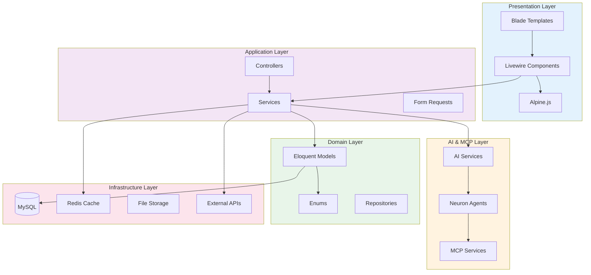

---

## 2. Project Structure

### 2.1 Top-Level Structure

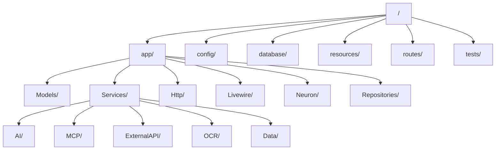

### 2.2 Directory Details

```text
umamusume-career-planner/
├── app/
│   ├── Collections/        # Custom Collection Classes
│   ├── Enums/              # PHP 8.1+ Enums (8 enums: AlertType, CareerPhase, Mood, Priority, RaceDistance, RecommendationType, RunningStyle, StorageMode)
│   ├── Events/             # Domain Events
│   ├── Helpers/            # Helper Utilities
│   ├── Http/
│   │   ├── Controllers/    # Web (22+), Api (36+), Admin (5), Auth (2) Controllers — 63+ total
│   │   ├── Middleware/     # Custom Middleware
│   │   └── Requests/       # Form Request Validation
│   ├── Jobs/               # Queue Jobs
│   ├── Listeners/          # Event Listeners
│   ├── Livewire/           # Livewire Components (AdvisoryPanel)
│   ├── MCP/                # MCP Server Definitions
│   ├── Models/             # Eloquent Models (30 models)
│   ├── Neuron/             # Neuron AI Agents
│   │   ├── Agents/         # Agent Implementations (6 agents)
│   │   ├── Responses/      # Typed Agent Responses (4 response classes)
│   │   ├── Support/        # MCP Connector & Tool Integration
│   │   └── Tools/          # Agent Tools (3 tools)
│   ├── Notifications/      # Notification Classes
│   ├── Policies/           # Authorization Policies
│   ├── Repositories/       # Data Access Layer
│   ├── Services/           # Business Logic Layer — 160+ service classes
│   │   ├── Admin/          # Admin Panel Services (3)
│   │   ├── Agents/         # Agent Services (1)
│   │   ├── AI/             # AI Provider Services (20: Hybrid, Bedrock, Ollama, Agents, Cost, Conversation, Dashboard)
│   │   ├── Data/           # Data Management Services
│   │   ├── ExternalAPI/    # External API Clients & Sync (25)
│   │   ├── MCP/            # MCP Server, Agent, Tool Services (42: Core, AgentCore, Agents, AWS, Tools)
│   │   ├── Neuron/         # Neuron Service Layer (5)
│   │   ├── OCR/            # OCR Processing & Parsers (12)
│   │   └── Training/       # Training Domain Services (3)
│   ├── ValueObjects/       # Value Objects
│   └── View/               # Blade View Components
├── config/
│   ├── ai.php              # AI Provider Configuration
│   ├── mcp.php             # MCP Server Configuration
│   ├── mcp_tools.php       # MCP Tool Controls
│   ├── mcp-agents.php      # MCP Agent Settings
│   ├── neuron.php          # Neuron AI Configuration
│   └── external-apis.php   # External API Configuration
├── database/
│   ├── factories/          # Model Factories (30)
│   ├── migrations/         # Schema Definitions (51 migrations)
│   └── seeders/            # Data Seeders
├── resources/
│   ├── css/                # Tailwind CSS
│   ├── js/                 # Alpine.js & App Scripts
│   └── views/              # Blade Templates
├── routes/
│   ├── api.php             # API Routes
│   └── web.php             # Web Routes (571 total routes)
└── tests/
    ├── Feature/            # Feature Tests
    └── Unit/               # Unit Tests
    (3,316+ tests, 11,563+ assertions across 300+ test files)
```

---

## 3. Key Namespaces & Classes

### 3.1 Core Models

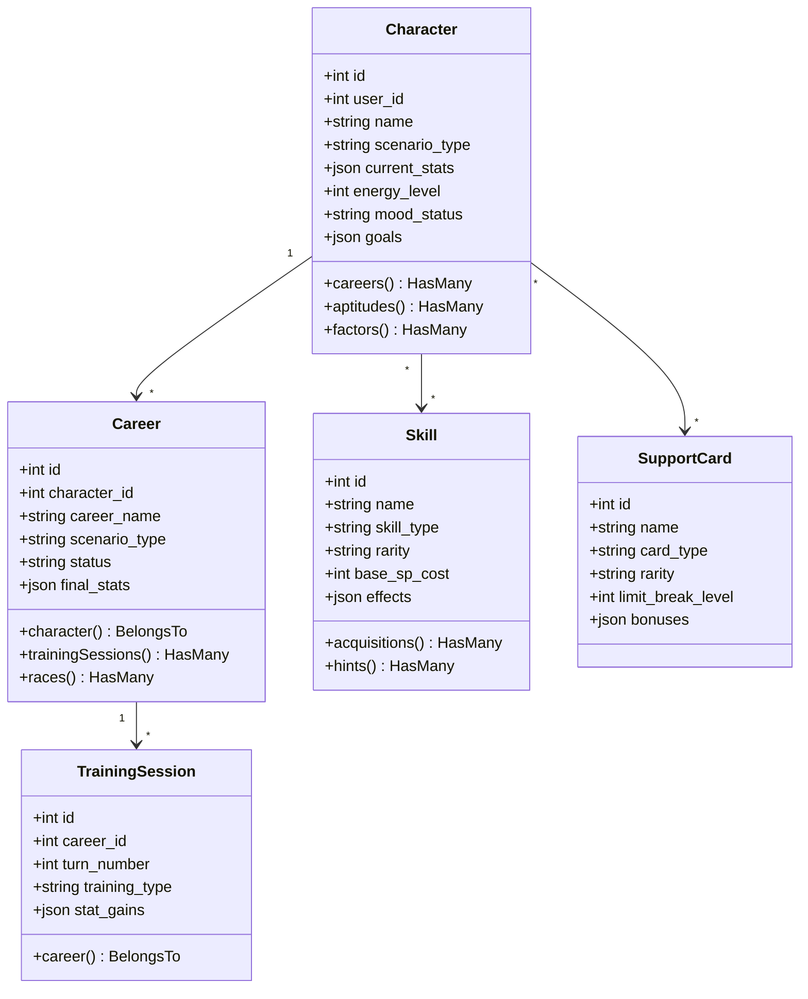

### 3.2 Enums (8 Total)

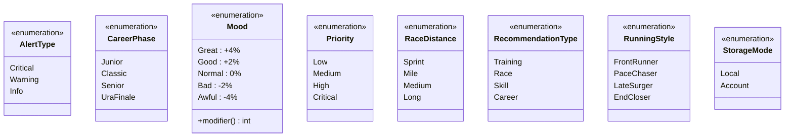

---

## 4. Service Layer Architecture

### 4.1 Service Overview

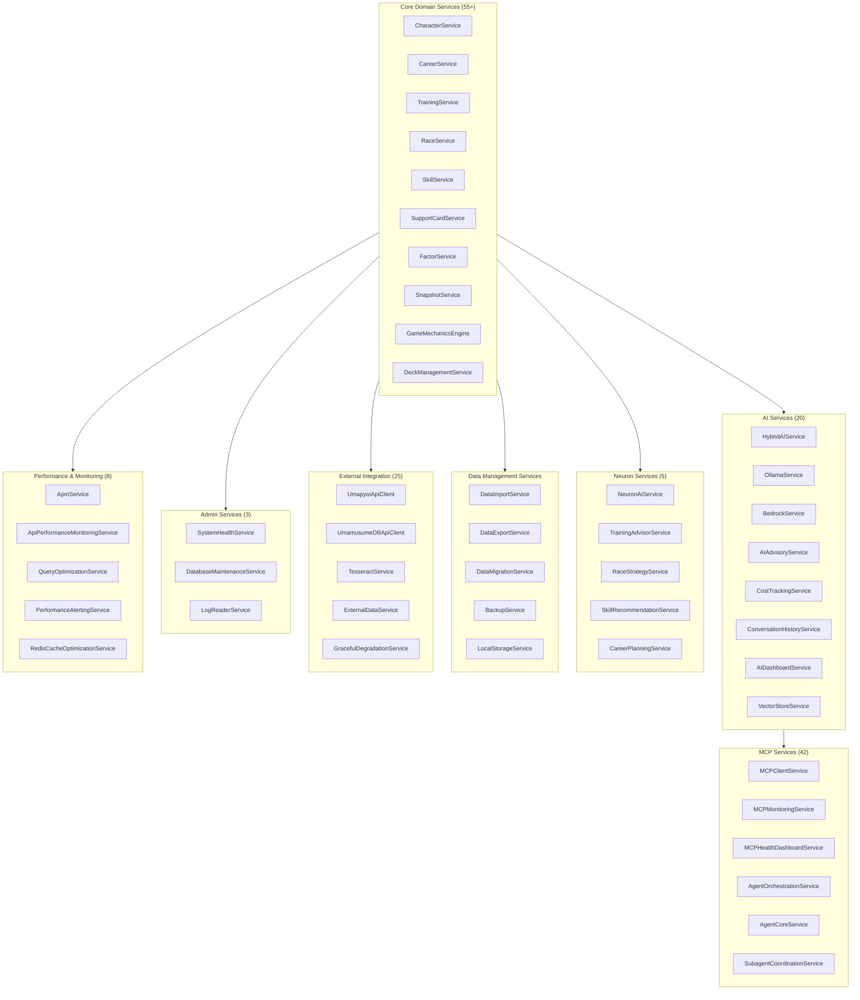

### 4.2 Core Service Implementations

#### CharacterService

```php
namespace App\Services;

class CharacterService
{
    public function __construct(
        private CharacterRepository $repository,
        private FactorInheritanceService $factorService,
        private CacheManager $cache
    ) {}
    
    public function create(array $data): Character
    {
        $character = $this->repository->create($data);
        $this->factorService->calculateInheritedStats($character);
        $this->cache->forget("user.{$data['user_id']}.characters");
        return $character;
    }
    
    public function updateStats(Character $character, array $stats): Character
    {
        $validated = $this->validateStatRanges($stats);
        $character->update(['current_stats' => $validated]);
        event(new StatsUpdated($character));
        return $character->fresh();
    }
    
    private function validateStatRanges(array $stats): array
    {
        return collect($stats)->map(fn($value) => 
            max(0, min(1200, (int) $value))
        )->toArray();
    }
}
```

#### TrainingPredictionService

```php
namespace App\Services;

class TrainingPredictionService
{
    public function __construct(
        private SupportCardBonusCalculator $bonusCalculator,
        private StatGainCalculator $gainCalculator,
        private CacheManager $cache
    ) {}
    
    public function getPredictions(Character $character): array
    {
        $cacheKey = "predictions.{$character->id}";
        
        return $this->cache->remember($cacheKey, 300, function () use ($character) {
            $facilities = TrainingType::cases();
            $predictions = [];
            
            foreach ($facilities as $facility) {
                $predictions[] = $this->calculatePrediction($character, $facility);
            }
            
            return $this->rankPredictions($predictions);
        });
    }
    
    private function calculatePrediction(Character $character, TrainingType $type): array
    {
        $baseGains = $this->gainCalculator->calculate($character, $type);
        $bonuses = $this->bonusCalculator->calculate($character->supportDeck, $type);
        
        return [
            'training_type' => $type->value,
            'stat_gains' => $this->applyBonuses($baseGains, $bonuses),
            'risk_percentage' => $this->calculateRisk($character),
            'skill_hints' => $this->getSkillHintChances($character, $type),
            'recommendation_score' => $this->scoreTraining($character, $type),
        ];
    }
}
```

---

## 5. AI and MCP Integration

### 5.1 Neuron AI Agents

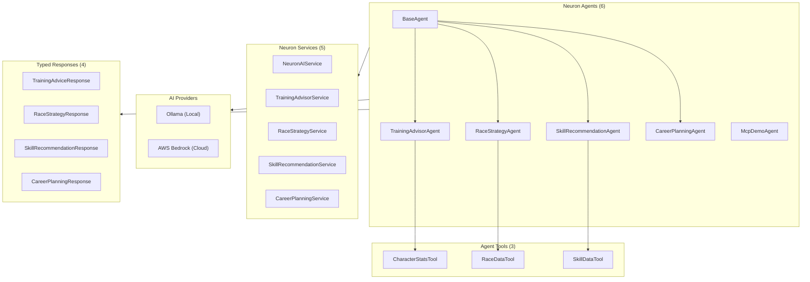

#### Agent Implementation

```php
namespace App\Neuron\Agents;

use NeuronAI\Agent;
use NeuronAI\SystemPrompt;

class TrainingAdvisorAgent extends Agent
{
    protected string $name = 'Training Advisor';
    
    public function instructions(): string
    {
        return <<<PROMPT
        You are an expert Umamusume Pretty Derby training advisor.
        Analyze the character's current state, goals, and available training options.
        Provide specific, actionable recommendations with reasoning.
        Consider stat priorities, energy management, and upcoming race requirements.
        PROMPT;
    }
    
    protected function tools(): array
    {
        return [
            new CharacterStatsTool(),
            new RaceDataTool(),
            new SkillDataTool(),
        ];
    }
    
    public function provider(): AIProvider
    {
        return app(HybridAIService::class)->getProvider();
    }
}
```

### 5.2 MCP Integration

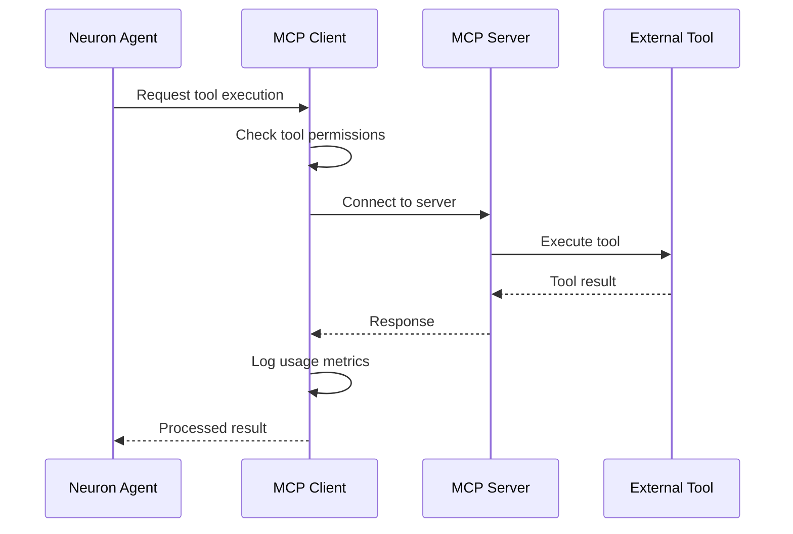

#### MCP Configuration

```php
// config/mcp.php
return [
    'servers' => [
        'memory' => [
            'command' => 'npx',
            'args' => ['-y', '@modelcontextprotocol/server-memory'],
            'enabled' => true,
        ],
        'filesystem' => [
            'command' => 'npx',
            'args' => ['-y', '@anthropic/mcp-server-filesystem', storage_path()],
            'enabled' => true,
        ],
        'fetch' => [
            'command' => 'npx',
            'args' => ['-y', '@anthropic/mcp-server-fetch'],
            'enabled' => true,
        ],
    ],
    
    'monitoring' => [
        'enabled' => true,
        'log_requests' => true,
        'track_costs' => true,
    ],
];
```

### 5.3 Hybrid AI Service

```php
namespace App\Services\AI;

class HybridAIService
{
    public function __construct(
        private OllamaService $ollama,
        private BedrockService $bedrock,
        private AICostTracker $costTracker
    ) {}
    
    public function generate(string $prompt, array $options = []): AIResponse
    {
        $complexity = $this->assessComplexity($prompt);
        
        if ($this->shouldUseLocal($complexity, $options)) {
            try {
                return $this->ollama->generate($prompt, $options);
            } catch (OllamaUnavailableException $e) {
                Log::warning('Ollama unavailable, falling back to Bedrock');
            }
        }
        
        $response = $this->bedrock->generate($prompt, $options);
        $this->costTracker->track($response);
        
        return $response;
    }
    
    private function shouldUseLocal(int $complexity, array $options): bool
    {
        if ($options['force_cloud'] ?? false) {
            return false;
        }
        
        if (!$this->ollama->isAvailable()) {
            return false;
        }
        
        return $complexity <= config('ai.local_complexity_threshold', 70);
    }
}
```

---

## 5.3 Performance & Monitoring Services

### 5.3.1 Overview

Performance and monitoring services provide Application Performance Monitoring (APM), regression detection, and optimization capabilities.

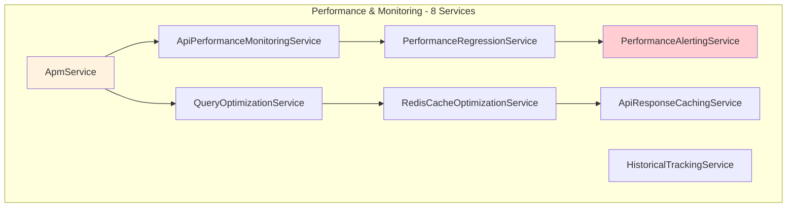

### 5.3.2 ApmService

**Location**: `app/Services/ApmService.php`  
**Purpose**: Central Application Performance Monitoring coordination  
**Database**: Stores metrics in `ucp_performance_metrics` table

```php
namespace App\Services;

class ApmService
{
    public function captureMetric(string $name, float $value, array $tags = []): void
    {
        PerformanceMetric::create([
            'metric_name' => $name,
            'value' => $value,
            'tags' => $tags,
            'captured_at' => now(),
        ]);
    }
    
    public function captureException(Throwable $e, array $context = []): void
    {
        Log::error($e->getMessage(), [
            'exception' => get_class($e),
            'trace' => $e->getTraceAsString(),
            'context' => $context,
        ]);
    }
    
    public function startTransaction(string $name): Transaction
    {
        return new Transaction($name, microtime(true));
    }
}
```

**Key Methods**:

- `captureMetric(string $name, float $value, array $tags = []): void` - Record performance metric
- `captureException(Throwable $e, array $context = []): void` - Log exception with context
- `startTransaction(string $name): Transaction` - Begin performance transaction
- `getMetrics(Carbon $since, ?string $metricName = null): Collection` - Retrieve metrics

**Test Coverage**: 88%

### 5.3.3 ApiPerformanceMonitoringService

**Location**: `app/Services/ApiPerformanceMonitoringService.php`  
**Purpose**: Track API endpoint latency, errors, and throughput

```php
namespace App\Services;

class ApiPerformanceMonitoringService
{
    public function recordApiCall(
        string $endpoint,
        int $statusCode,
        float $duration,
        int $memoryUsage
    ): void {
        $this->apm->captureMetric('api.response_time', $duration, [
            'endpoint' => $endpoint,
            'status' => $statusCode,
        ]);
        
        if ($statusCode >= 400) {
            $this->apm->captureMetric('api.error', 1, ['endpoint' => $endpoint]);
        }
    }
    
    public function getEndpointMetrics(string $endpoint, Carbon $since): array
    {
        return [
            'avg_latency' => $this->calculateAverageLatency($endpoint, $since),
            'p95_latency' => $this->calculatePercentile($endpoint, $since, 95),
            'error_rate' => $this->calculateErrorRate($endpoint, $since),
            'throughput' => $this->calculateThroughput($endpoint, $since),
        ];
    }
    
    public function detectAnomalies(): Collection
    {
        // Detects endpoints exceeding 2 standard deviations from baseline
        return $this->regressionService->detectAnomalies('api');
    }
}
```

**Key Methods**:

- `recordApiCall(string $endpoint, int $statusCode, float $duration, int $memoryUsage): void`
- `getEndpointMetrics(string $endpoint, Carbon $since): array`
- `detectAnomalies(): Collection`
- `getSlowEndpoints(int $thresholdMs = 500): Collection`

**Test Coverage**: 90%

### 5.3.4 QueryOptimizationService

**Location**: `app/Services/QueryOptimizationService.php`  
**Purpose**: Analyze database queries, detect N+1 problems, suggest index optimizations

```php
namespace App\Services;

class QueryOptimizationService
{
    public function analyzeQuery(string $sql): array
    {
        $explain = DB::select("EXPLAIN {$sql}");
        
        return [
            'type' => $explain[0]->type,
            'possible_keys' => $explain[0]->possible_keys,
            'key' => $explain[0]->key,
            'rows' => $explain[0]->rows,
            'extra' => $explain[0]->Extra,
            'needs_optimization' => $this->needsOptimization($explain[0]),
        ];
    }
    
    public function detectNPlusOne(): Collection
    {
        // Analyzes query logs for N+1 patterns
        $queries = DB::getQueryLog();
        $patterns = [];
        
        foreach ($queries as $query) {
            if ($this->isNPlusOnePattern($query)) {
                $patterns[] = $query;
            }
        }
        
        return collect($patterns);
    }
    
    public function suggestIndexes(): array
    {
        // Suggests indexes based on slow query analysis
        $slowQueries = $this->getSlowQueries();
        $suggestions = [];
        
        foreach ($slowQueries as $query) {
            $suggestions[] = $this->analyzeForIndexes($query);
        }
        
        return $suggestions;
    }
}
```

**Key Methods**:

- `analyzeQuery(string $sql): array` - Run EXPLAIN on query
- `detectNPlusOne(): Collection` - Find N+1 query patterns
- `suggestIndexes(): array` - Recommend database indexes
- `optimizeIndexes(array $suggestions): bool` - Apply index suggestions

**Test Coverage**: 85%

### 5.3.5 PerformanceAlertingService

**Location**: `app/Services/PerformanceAlertingService.php`  
**Purpose**: Threshold monitoring and alert dispatch

```php
namespace App\Services;

class PerformanceAlertingService
{
    public function checkThresholds(): void
    {
        $metrics = $this->apm->getMetrics(now()->subMinutes(5));
        
        foreach ($metrics as $metric) {
            if ($this->exceedsThreshold($metric)) {
                $this->sendAlert($metric);
            }
        }
    }
    
    public function sendAlert(PerformanceMetric $metric): void
    {
        Notification::route('mail', config('apm.alert_email'))
            ->notify(new PerformanceAlertNotification($metric));
    }
    
    public function configureAlerts(array $thresholds): void
    {
        foreach ($thresholds as $metric => $threshold) {
            cache()->put("apm.threshold.{$metric}", $threshold, now()->addDays(30));
        }
    }
}
```

**Key Methods**:

- `checkThresholds(): void` - Check all metrics against thresholds
- `sendAlert(PerformanceMetric $metric): void` - Dispatch alert notification
- `configureAlerts(array $thresholds): void` - Update alert thresholds
- `getActiveAlerts(): Collection` - Retrieve current alerts

**Test Coverage**: 87%

### 5.3.6 Additional Services

**RedisCacheOptimizationService** (`app/Services/RedisCacheOptimizationService.php`)

- Cache hit/miss ratio tracking
- Cache eviction pattern analysis
- TTL optimization suggestions

**ApiResponseCachingService** (`app/Services/ApiResponseCachingService.php`)

- Intelligent API response caching
- Cache invalidation strategies
- Cache warming for frequently accessed data

**PerformanceRegressionService** (`app/Services/PerformanceRegressionService.php`)

- Baseline establishment and tracking
- Statistical anomaly detection
- Performance degradation alerts

**HistoricalTrackingService** (`app/Services/HistoricalTrackingService.php`)

- Long-term performance trend analysis
- Historical metric aggregation
- Performance comparison across releases

**Related Documentation**:

- SPEC-008 (NEW): Performance Monitoring & APM Technical Specification
- IVM §6.2: Service Method Verification
- IVM §9.2: Performance & Monitoring Test Coverage (88%)

---

## 6. Frontend Code Structure

### 6.1 JavaScript Architecture

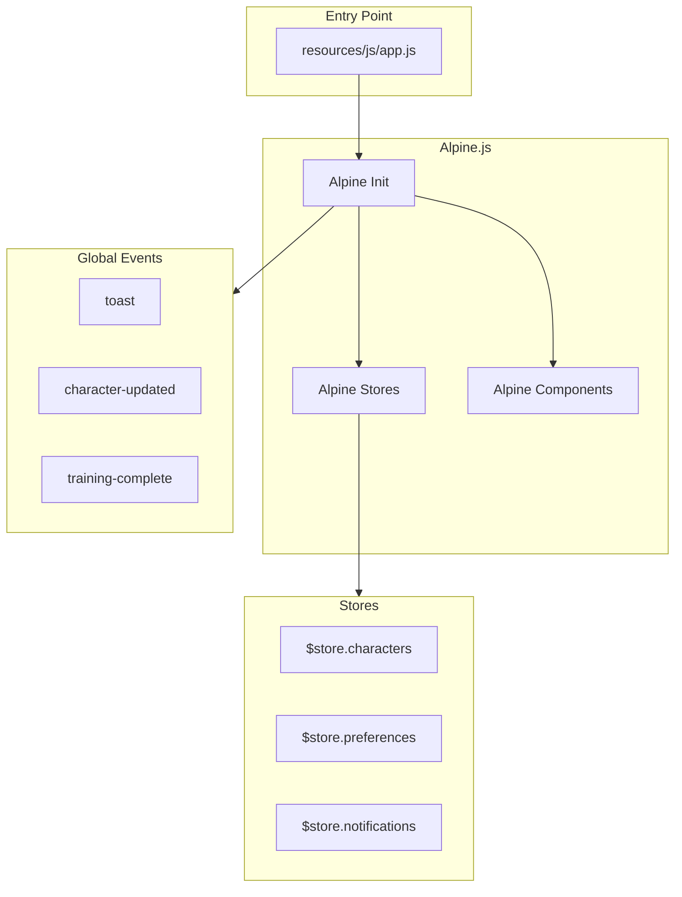

### 6.2 Livewire Components

```text
app/Livewire/
└── AdvisoryPanel.php         # AI advisory panel component (real-time interactive)
```

> **Note**: The application primarily uses controller-rendered Blade views (32+ view directories) with Alpine.js for interactivity, with Livewire 4 used selectively for real-time interactive components like the AI Advisory Panel.

### 6.3 CSS Architecture

```css
/* resources/css/app.css */

/* Stat Colors (Game-accurate) */
:root {
  --stat-speed: #3399ff;
  --stat-stamina: #33cc99;
  --stat-power: #ff4d4d;
  --stat-guts: #ffa500;
  --stat-wisdom: #9933ff;
}

/* Aptitude Grade Colors */
:root {
  --grade-ss: #e5e7eb;
  --grade-s: #ffd700;
  --grade-a: #ef4444;
  --grade-b: #f97316;
  --grade-c: #22c55e;
  --grade-d: #3b82f6;
  --grade-e: #a855f7;
  --grade-f: #6b7280;
  --grade-g: #9ca3af;
}

/* Dark Mode Support */
:root.dark {
  --bg-primary: #1a1a2e;
  --bg-secondary: #16213e;
  --text-primary: #eaeaea;
  --text-secondary: #a0a0a0;
}
```

---

## 7. API Reference

### 7.1 Route Structure

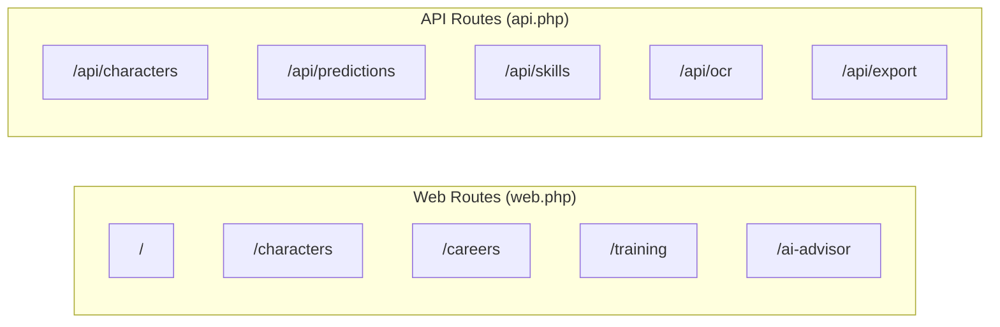

### 7.2 API Endpoints

| Route | Method | Controller | Description |
|-------|--------|------------|-------------|
| `/api/characters` | GET | CharacterController | List characters |
| `/api/characters` | POST | CharacterController | Create character |
| `/api/characters/{id}` | GET | CharacterController | Get character |
| `/api/characters/{id}` | PUT | CharacterController | Update character |
| `/api/characters/{id}/stats` | PATCH | CharacterController | Update stats |
| `/api/predictions/{characterId}` | GET | TrainingPredictionController | Get training predictions |
| `/api/predictions/batch` | POST | TrainingPredictionController | Batch predictions |
| `/api/skills/search` | GET | SkillManagementController | Search skills |
| `/api/skills/{id}/acquire` | POST | SkillManagementController | Acquire skill |
| `/api/skill-builds` | GET/POST | SkillBuildController | Manage skill builds |
| `/api/skill-hints` | GET | SkillHintController | Get skill hints |
| `/api/ocr/upload` | POST | OCRController | Process screenshot |
| `/api/export/{type}` | GET | CareerExportController | Export data |
| `/api/ai/advice` | POST | AdvisoryController | Get AI advice |
| `/api/ai/dashboard` | GET | AIDashboardController | AI dashboard data |
| `/api/mcp/dashboard` | GET | MCPDashboardController | MCP monitoring |
| `/api/race-strategy` | POST | RaceStrategyController | Race analysis |
| `/api/snapshots` | GET/POST | SnapshotController | Career snapshots |
| `/api/support-decks` | GET/POST | SupportDeckController | Deck management |
| `/api/career-comparison` | GET | CareerComparisonController | Compare careers |
| `/api/notifications` | GET | NotificationController | User notifications |
| `/api/connectivity` | GET | ConnectivityController | Check connectivity |

### 7.3 Service Method Reference

#### CharacterService

| Method | Parameters | Returns | Description |
|--------|------------|---------|-------------|
| `create` | `array $data` | `Character` | Create new character |
| `update` | `Character $char, array $data` | `Character` | Update character |
| `updateStats` | `Character $char, array $stats` | `Character` | Update stats |
| `delete` | `Character $char` | `bool` | Soft delete |

#### TrainingPredictionService

| Method | Parameters | Returns | Description |
|--------|------------|---------|-------------|
| `getPredictions` | `Character $char` | `array` | Get all predictions |
| `getRecommendation` | `Character $char` | `Prediction` | Get best option |
| `calculateRisk` | `Character $char` | `float` | Calculate failure risk |

---

## 8. Coding Standards

### 8.1 PHP Standards

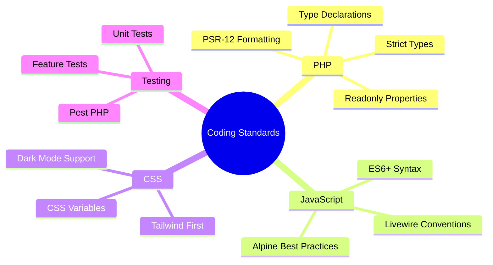

### 8.2 Naming Conventions

| Context | Convention | Example |
|---------|------------|---------|
| PHP Classes | PascalCase | `CharacterService`, `TrainingAdvisorAgent` |
| PHP Methods | camelCase | `getPredictions`, `calculateBonus` |
| PHP Constants | UPPER_SNAKE | `MAX_STAT_VALUE`, `API_TIMEOUT` |
| Database Tables | snake_case (plural, prefixed) | `ucp_characters`, `ucp_skills` |
| Database Columns | snake_case | `turn_number`, `skill_type` |
| Blade Views | kebab-case | `character-editor.blade.php` |
| Livewire Components | PascalCase | `TrainingSelector.php` |
| Config Keys | snake_case | `ai.local_model`, `mcp.servers` |

### 8.3 File Organization

| File Type | Location | Naming Pattern |
|-----------|----------|----------------|
| Models | `app/Models/` | `{Entity}.php` |
| Services | `app/Services/` | `{Domain}Service.php` |
| Controllers | `app/Http/Controllers/` | `{Entity}Controller.php` |
| Form Requests | `app/Http/Requests/` | `{Action}{Entity}Request.php` |
| Livewire | `app/Livewire/` | `{Component}.php` |
| Neuron Agents | `app/Neuron/Agents/` | `{Purpose}Agent.php` |
| Neuron Responses | `app/Neuron/Responses/` | `{Purpose}Response.php` |
| Tests | `tests/{Type}/` | `{Subject}Test.php` |

---

## 9. Testing Strategy

### 9.1 Testing Framework

- **Pest v4** (with PHPUnit v12 backend)
- **pest-plugin-browser v4.0** for browser testing via Playwright 1.58
- Browser tests live in `tests/Browser/`
- **3,316+ tests** with **11,563+ assertions** across **300+ test files**
- **571 total routes** covered by feature and integration tests

### 9.2 Test Distribution

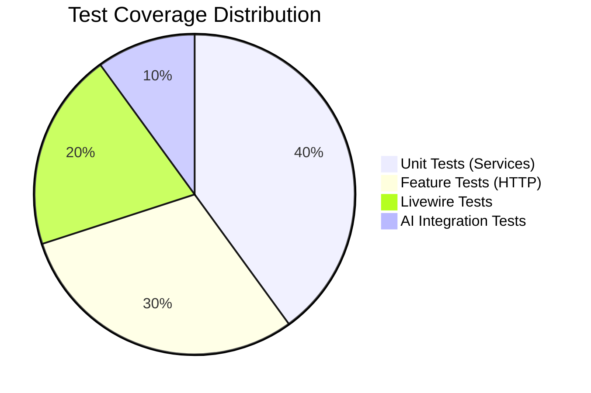

### 9.2 Test Structure

```text
tests/
├── Unit/
│   ├── Services/
│   │   ├── CharacterServiceTest.php
│   │   ├── TrainingPredictionServiceTest.php
│   │   └── SkillServiceTest.php
│   ├── Calculators/
│   │   ├── StatGainCalculatorTest.php
│   │   └── BonusCalculatorTest.php
│   └── AI/
│       ├── HybridAIServiceTest.php
│       └── CostTrackerTest.php
├── Feature/
│   ├── Character/
│   │   ├── CharacterCrudTest.php
│   │   └── CharacterStatsTest.php
│   ├── Training/
│   │   ├── TrainingPredictionTest.php
│   │   └── TrainingSessionTest.php
│   ├── API/
│   │   ├── CharacterApiTest.php
│   │   └── PredictionApiTest.php
│   └── AI/
│       ├── AIAdvisorTest.php
│       └── MCPIntegrationTest.php
└── Livewire/
    ├── CharacterEditorTest.php
    ├── TrainingSelectorTest.php
    └── SkillCatalogTest.php
```

### 9.3 Test Examples

```php
// tests/Unit/Services/TrainingPredictionServiceTest.php
use App\Services\TrainingPredictionService;
use App\Models\Character;

test('calculates training predictions for all facilities', function () {
    $character = Character::factory()->create();
    $service = app(TrainingPredictionService::class);
    
    $predictions = $service->getPredictions($character);
    
    expect($predictions)->toHaveCount(6)
        ->and($predictions[0])->toHaveKeys([
            'training_type',
            'stat_gains',
            'risk_percentage',
            'recommendation_score',
        ]);
});

test('ranks predictions by recommendation score', function () {
    $character = Character::factory()->withGoals(['speed' => 1000])->create();
    $service = app(TrainingPredictionService::class);
    
    $predictions = $service->getPredictions($character);
    
    expect($predictions[0]['training_type'])->toBe('speed');
});
```

---

## Document Control

| Version | Date | Author | Changes |
|---------|------|--------|---------|
| 2.3.0 | 2026-02-21 | Development Team | Updated enums to match 8 actual enums, updated Neuron agent tree, corrected Livewire structure, added Neuron services, updated testing framework to Pest v4/PHPUnit v12, version alignment to v2.3.0 |
| 2.1.0 | 2026-01-23 | Development Team | Updated to reflect current codebase structure including AI, MCP, and Neuron integration |
| 2.0.0 | 2026-01-14 | Development Team | Added service layer and Livewire documentation |
| 1.0.0 | 2026-01-03 | Development Team | Initial draft |

---

*This documentation reflects the current implementation of the Umamusume Pretty Derby Career Planner codebase (v2.4.0).*
