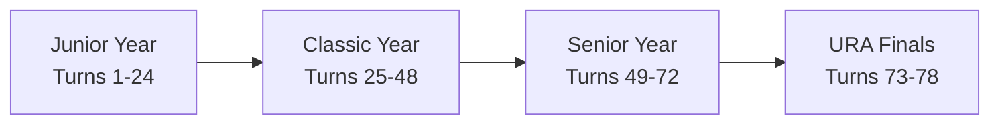
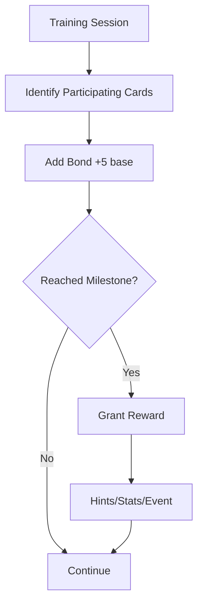
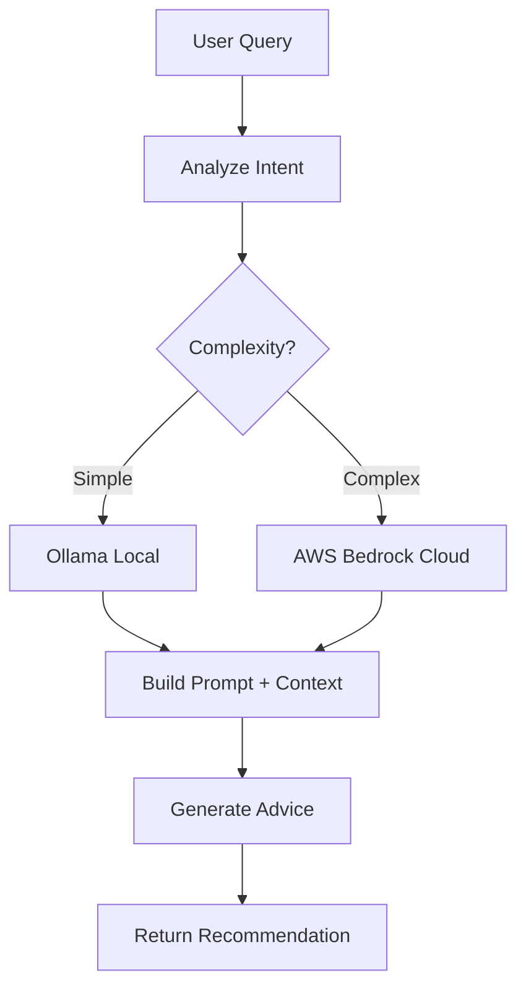

# Software User Manual (SUM)

## Umamusume Pretty Derby Career Planner

**Document Version**: 2.4.1
**Date**: March 10, 2026
**Project**: UmamusumeCareerPlanner
**Author**: Development Team
**Status**: Current - Aligned with codebase v2.4.0 and Global English server gameplay scope

---

## Table of Contents

1. [Introduction](#1-introduction)
2. [Getting Started](#2-getting-started)
3. [Dashboard Overview](#3-dashboard-overview)
4. [Character Management](#4-character-management)
5. [Career Run Management](#5-career-run-management)
6. [Training System](#6-training-system)
7. [Race Strategy](#7-race-strategy)
8. [Skill Management](#8-skill-management)
9. [Support Card & Deck Management](#9-support-card--deck-management)
10. [AI Advisory System](#10-ai-advisory-system)
11. [Data Import & Export](#11-data-import--export)
12. [Storage Modes](#12-storage-modes)
13. [Settings & Preferences](#13-settings--preferences)
14. [Troubleshooting](#14-troubleshooting)
15. [Keyboard Shortcuts](#15-keyboard-shortcuts)
16. [Glossary](#16-glossary)
17. [Support & Resources](#17-support--resources)

---

## 1. Introduction

### 1.1 Welcome

Welcome to the **Umamusume Pretty Derby Career Planner**, your comprehensive tool for planning,
tracking, and optimizing your training runs in *Uma Musume: Pretty Derby*. This application
consolidates features from multiple legacy tracking tools into a unified, modern platform.

### 1.2 Application Overview

```mermaid
mindmap
  root((Uma Musume<br/>Career Planner))
    Character Management
      Create Characters
      Track Stats
      Manage Aptitudes
      Factor Inheritance
    Training Optimization
      Stat Predictions
      Risk Assessment
      Skill Hints
      Recommendations
    Race Strategy
      Race Calendar
      Readiness Scoring
      Win Probability
      Strategy Optimization
    Skill Management
      Skill Catalog
      SP Tracking
      Evolution Paths
      Build Planning
    Support Cards
      Deck Building
      Bond Tracking
      Meta Tiers
      Synergy Analysis
    AI Advisory
      Training Advice
      Race Strategy
      Career Planning
      Intelligent Recommendations
    Data Features
      Import/Export
      Dual Storage
      OCR Processing
      External API Sync
```text

### 1.3 Key Features

- **Feature**: **Character State Management**; **Description**: Complete tracking of Speed, Stamina,
Power, Guts, and Wit stats with aptitude grades and factor inheritance
- **Feature**: **Training Prediction Engine**; **Description**: AI-powered predictions for stat
gains, risk assessment, and optimal training recommendations
- **Feature**: **Race Preparation & Strategy**; **Description**: Comprehensive race planning with
readiness scores, win probability, and running style optimization
- **Feature**: **Skill Management**; **Description**: Full skill catalog with hint tracking, SP cost
reduction, and evolution path planning
- **Feature**: **Support Card Configuration**; **Description**: 6-card deck building with synergy
analysis, bond tracking, and meta tier integration
- **Feature**: **AI Advisory System**; **Description**: Hybrid AI using local Ollama and AWS Bedrock
Claude models for intelligent recommendations
- **Feature**: **Dual Storage Modes**; **Description**: Flexible storage with Local (browser) or Account (cloud) options
- **Feature**: **External Integration**; **Description**: Real-time data sync with umapyoi.net, OCR
screenshot processing, and community tools

### 1.4 System Requirements

- **Component**: **Browser**; **Requirement**: Chrome, Firefox, Safari, or Edge (last 2 versions)
- **Component**: **Screen Resolution**; **Requirement**: Minimum 320px width, optimized up to 2560px
- **Component**: **JavaScript**; **Requirement**: Enabled
- **Component**: **localStorage**; **Requirement**: 5-10MB available for Local mode
- **Component**: **Internet**; **Requirement**: Required for Account mode; optional for Local mode

---

## 2. Getting Started

### 2.1 First Launch

When you first access the application:

1. **Welcome Screen** - View introduction and tutorial toggle
2. **Account Creation** (Optional) - Register for cloud sync features
3. **Career Configuration** - Set up your first character and goals
4. **Dashboard Orientation** - Interactive tutorial for key features

### 2.2 New Player Onboarding Flow

```mermaid
flowchart TD
    A[Launch App] --> B{First Time?}
    B -->|No| C[Dashboard]
    B -->|Yes| D[Welcome Screen]
    D --> E[Tutorial Toggle]
    E --> F{Create Account?}
    F -->|Yes| G[Account Setup]
    F -->|No| H[Continue as Guest]
    G --> I[Career Configuration]
    H --> I
    I --> J[Select Trainee]
    J --> K[Choose Scenario]
    K --> L[Set Goals]
    L --> M[Dashboard Tour]
    M --> C
```

### 2.3 Storage Mode Selection

Choose how your data is stored:

```mermaid
flowchart TB
    subgraph Local["🟠 Local Mode"]
        L1["No login required"]
        L2["Data in browser only"]
        L3["Works offline"]
        L4["Risk: Browser cache clear"]
    end

    subgraph Account["🟣 Account Mode"]
        A1["Login required"]
        A2["Cloud sync"]
        A3["Access anywhere"]
        A4["Secure backup"]
    end

    Local -->|"Convert"| Account
```text

- **Mode**: **Local**; **Pros**: Instant start, no account needed, works offline; **Cons**: Data
stays on this browser/device only; **Best For**: Quick tests, anonymous usage
- **Mode**: **Account**; **Pros**: Cross-device sync, secure cloud backup; **Cons**: Requires
internet connection; **Best For**: Long-term tracking, multi-device access

> **Tip:** You can start in Local Mode and convert your plans to Account Mode later!

---

## 3. Dashboard Overview

### 3.1 Dashboard Layout

```text
┌──────────────────────���─────────────────────────────────────────┐
│  App Header: Logo | Run Selector | Notifications 🔔 | User Menu │
├────────────────────────────────────────────────────────────────┤
│ Sidebar              │ Main Content                            │
│ - Dashboard (active) │ ┌─────────────────┬─────────────────┐   │
│ - Character          │ │ Current Goals   │ Stat Snapshot   │   │
│ - Training           │ │ - Short-term    │ Speed  A (980)  │   │
│ - Races              │ │ - Long-term     │ Stamina B+(820) │   │
│ - Skills             │ │ Progress bars   │ Power  B (780)  │   │
│ - Support Cards      │ ├─────────────────┼─────────────────┤   │
│ - AI Advisor         │ │ Upcoming Races  │ Mood/Energy     │   │
│ - MCP Monitoring     │ │ [Date][Race]    │ Good | 72/100   │   │
│ - Performance        │ ├─────────────────┼─────────────────┤   │
│ - Admin Panel        │ │ Training Suggest│ AI Advisor Card │   │
│ - Settings           │ │ [Action][Gains] │ Last tip + CTA  │   │
│                      │ └─────────────────┴─────────────────┘   │
└────────────────────────────────────────────────────────────────┘
```

### 3.2 Dashboard Components

- **Component**: **Stats Panel**; **Description**: Current character stats with grade indicators
(Speed, Stamina, Power, Guts, Wit)
- **Component**: **Goals Progress**; **Description**: Active goals with progress bars and completion status
- **Component**: **Upcoming Races**; **Description**: Next 3 races with date, grade, and readiness percentage
- **Component**: **Training Suggestions**; **Description**: Top 3 recommended training options with gains and risk
- **Component**: **Mood/Energy Widget**; **Description**: Current mood status and energy level
- **Component**: **AI Advisor Card**; **Description**: Latest AI recommendation with quick action buttons

### 3.3 Navigation

- **Navigation Item**: Dashboard; **Route**: `/dashboard`; **Description**: Main overview and stats
- **Navigation Item**: Character; **Route**: `/characters`; **Description**: Character management
- **Navigation Item**: Training; **Route**: `/characters/{id}/training`; **Description**: Training
selection and predictions
- **Navigation Item**: Races; **Route**: `/races`; **Description**: Race calendar and strategy
- **Navigation Item**: Skills; **Route**: `/skills`; **Description**: Skill catalog and management
- **Navigation Item**: Support Cards; **Route**: `/support-cards`; **Description**: Card collection and deck building
- **Navigation Item**: AI Advisor; **Route**: `/ai-advisor`; **Description**: AI-powered recommendations
- **Navigation Item**: MCP Monitoring; **Route**: `/mcp-monitoring`; **Description**: MCP server and agent monitoring
- **Navigation Item**: Performance; **Route**: `/performance`; **Description**: System performance dashboard
- **Navigation Item**: Admin Panel; **Route**: `/admin`; **Description**: System administration (admin users)
- **Navigation Item**: OCR Upload; **Route**: `/ocr`; **Description**: Screenshot data extraction
- **Navigation Item**: Data Management; **Route**: `/data-management`; **Description**: Import,
export, backup, and migration
- **Navigation Item**: Settings; **Route**: `/settings`; **Description**: User preferences and configuration

---

## 4. Character Management

### 4.1 Character Creation Wizard

Create a new character through the step-by-step wizard:

```mermaid
flowchart LR
    A[Step 1: Select Trainee] --> B[Step 2: Choose Parents]
    B --> C[Step 3: Build Support Deck]
    C --> D[Step 4: Review & Confirm]
    D --> E[Character Created]
```text

#### Step 1: Select Trainee & Scenario

```text
┌────────────────────────────────────────────────────────────┐
│  Create New Character - Step 1 of 4                        │
├──────────────────────────────────────────────��─────────────┤
│  Select Trainee                                            │
│  ┌──────────────────────────────────────────────────┐     │
│  │ 🔍 Search trainees...                             │     │
│  └──────────────────────────────────────────────────┘     │
│                                                            │
│  Rarity Filter: [ ]SSR  [ ]SR  [ ]R                        │
│                                                            │
│  ┌─────────────────┬─────────────────┬─────────────────┐  │
│  │ Mejiro Ardan    │ Kitasan Black   │ Tokai Teio      │  │
│  │ SSR · Speed     │ SSR · Power     │ SSR · Stamina   │  │
│  │ [SELECT]        │ [SELECT]        │ [SELECT]        │  │
│  └─────────────────┴─────────────────┴─────────────────┘  │
│                                                            │
│  Scenario: [URA Finals / Unity Cup ▼]                      │
│                          [← BACK]  [NEXT →]                │
└────────────────────────────────────────────────────────────┘
```

- **Available Scenarios**: URA Finals for the standard championship route, or Unity Cup for the
team-based Global English server scenario

#### Step 2: Parent Selection & Factor Inheritance

- Select Parent A and Parent B
- Preview inherited stat bonuses and factor ratings
- View growth rate projections

### Factor Ratings

- **Rating**: ★☆☆; **Stat Bonus**: +5
- **Rating**: ★★☆; **Stat Bonus**: +12
- **Rating**: ★★★; **Stat Bonus**: +21

#### Step 3: Support Deck Configuration

- Build your 6-card support deck
- Validate type distribution
- Preview deck synergy score

#### Step 4: Review & Confirm

- Review all selections
- Confirm character creation
- Initialize starting stats, mood, and energy

### 4.2 Character Dashboard

View and manage your character's current state:

```text
┌────────────────────────────────────────────────────────────┐
│  Mejiro Ardan (Turn 45)                       [Edit] [≡]   │
├────────────────────────────────────────────────────────────┤
│  Status Bar                                                │
│  Energy: ████████░ 78%  | Mood: ◐ Good  | Race in: 15 d   │
│                                                            │
│  ┌────────────────────────────────────────────────────────┐│
│  │ Stats Overview         │  Goals Progress              ││
│  ├────────────────────────┼──────────────────────────────┤│
│  │ Speed      520 ★★★★★  │  Speed Goal: 800  ███░░ 65%  ││
│  │ Stamina    480 ★★★★░  │  Stamina: 600  ███░░░░ 45%   ││
│  │ Power      440 ★★★░░  │  Race Goal: G1  ◐ Upcoming   ││
│  │ Guts       460 ★★★★░  │                              ││
│  │ Wit        450 ★★★░░  │  [+ Add Goal]                ││
│  │                        │                              ││
│  │ Aptitudes              │  Recent Turns                ││
│  │ • Mile:  A+  ◎         │  Turn 44: Speed +48          ││
│  │ • Turf:  A             │  Turn 43: Stamina +42        ││
│  │ • Late Surger: S       │  Turn 42: Power +35          ││
│  └────────────────────────┴──────────────────────────────┘│
└────────────────────────────────────────────────────────────┘
```text

### 4.3 Stat System

### Stat Types and Ranges

- **Stat**: Speed; **Description**: Maximum running speed and top-end race pace; **Range**: 0-1200;
**Priority**: Varies by race type
- **Stat**: Stamina; **Description**: Effective endurance for distance racing and race events;
**Range**: 0-1200; **Priority**: Varies by race type
- **Stat**: Power; **Description**: Acceleration, lane-changing, and pace transitions; **Range**:
0-1200; **Priority**: Varies by race type
- **Stat**: Guts; **Description**: Position holding, late-race resilience, and final-phase
performance; **Range**: 0-1200; **Priority**: Varies by race type
- **Stat**: Wit; **Description**: Skill activation reliability, kakari avoidance, and race
stability; **Range**: 0-1200; **Priority**: Varies by race type

### Grade Scale

- **Grade**: S; **Value Range**: 1000+
- **Grade**: A; **Value Range**: 800-999
- **Grade**: B; **Value Range**: 600-799
- **Grade**: C; **Value Range**: 400-599
- **Grade**: D; **Value Range**: 200-399
- **Grade**: E; **Value Range**: 100-199
- **Grade**: F; **Value Range**: 0-99
- **Grade**: G; **Value Range**: Lowest tier

> **Note**: These grade bands are planner-facing approximations for quick reading, not official in-game stat grades. For Global English server competitive play, many builds aim to reach 1200 in their primary stat, especially Speed.

### 4.4 Stat Priorities by Race Type

- **Sprint / Mile**: Prioritize Speed first, then Power, then Wit for reliable skill activation.
- **Medium**: Prioritize Speed and Stamina together, with Power and Wit supporting consistency.
- **Long**: Prioritize Stamina and Speed first, then Guts for stronger late-race performance.
- **Champions Meeting / PvP**: Aim for 1200 Speed whenever the build allows, meet the distance-
appropriate Stamina requirement, and push Wit toward 800+ for skill reliability.

> **Note**: These are community-derived guidelines for the Global English server meta and will shift with race conditions, deck quality, and event rotations.

### 4.5 Aptitude System

### Aptitude Categories

- **Category**: Distance; **Types**: Sprint (1000-1400m), Mile (1401-1800m), Medium (1801-2400m), Long (2401m+)
- **Category**: Surface; **Types**: Turf, Dirt
- **Category**: Running Style; **Types**: Front Runner (Nige), Pace Chaser (Senkou), Late Surger
(Sashi), End Closer (Oikomi)

### Aptitude Ratings & Effectiveness

- **Rating**: S; **Effectiveness**: +5%; **Notes**: Maximum grade (provides positive bonus)
- **Rating**: A; **Effectiveness**: 0%; **Notes**: Baseline (no bonus/penalty)
- **Rating**: B; **Effectiveness**: -10%; **Notes**: Slight penalty
- **Rating**: C; **Effectiveness**: -20%; **Notes**: Moderate penalty
- **Rating**: D; **Effectiveness**: -30%/-40%; **Notes**: Significant penalty (varies by category)
- **Rating**: E; **Effectiveness**: -50%/-60%; **Notes**: Major penalty
- **Rating**: F; **Effectiveness**: -70%/-80%; **Notes**: Severe penalty
- **Rating**: G; **Effectiveness**: -90%; **Notes**: Minimum grade

> **Note**: S is the maximum aptitude grade. SS does NOT exist for aptitudes in the current game version. Only S-rank provides positive bonuses; A-rank is the baseline with no bonus or penalty.

---

## 5. Career Run Management

### 5.1 Career Stages



- **Stage**: Junior; **Turn Range**: 1-24; **Description**: Early training and foundation building
- **Stage**: Classic; **Turn Range**: 25-48; **Description**: Competitive racing and skill development
- **Stage**: Senior; **Turn Range**: 49-72; **Description**: Peak performance and championship preparation
- **Stage**: URA Finals; **Turn Range**: 73-78; **Description**: Final championship races

> **Scenario Support:** The planner currently documents two Global English server scenarios: **URA Finals** and **Unity Cup**. Both share the same early Junior / Classic / Senior planning structure, but Unity Cup adds team-based scenario mechanics and scenario-specific endgame events.

### 5.2 Turn Progression

Each turn follows this flow:

```mermaid
flowchart TD
    A[Begin Turn] --> B{Phase?}
    B -->|Training| C[Training Actions]
    B -->|Race Week| D[Race Preparation]
    C --> E[Process Events]
    D --> F[Execute Race]
    E --> G[Update Stats/Mood/Condition]
    F --> G
    G --> H[Advance Turn]
    H --> I[Next Turn]
```text

### 5.3 Goal Management

Set and track training objectives:

- **Goal Type**: Stat Target; **Description**: Reach specific stat value; **Example**: Speed ≥ 800
- **Goal Type**: Race Win; **Description**: Achieve placement in race; **Example**: Win G1 Race
- **Goal Type**: Skill Acquisition; **Description**: Obtain specific skills; **Example**: Acquire 9 skills

### Goal Status

- ✅ **Completed** - Goal achieved
- 🟡 **On Track** - Progress within expected range
- 🔴 **At Risk** - Behind schedule, intervention needed

---

## 6. Training System

### 6.1 Training Selection Interface

```text
┌────────────────────────────────────────────────────────────┐
│  Select Training (Turn 46)                            [≡]   │
├────────────────────────────────────────────────────────────┤
│  🚨 Status: Good | Energy: 78% | Mood: Good (+0%)          │
│                                                            │
│  ┌─────────────────────────────────────────────────────────┐
│  │ RECOMMENDED: Speed Training                  Rank: 1    │
│  │ Alignment: High | Score: 92.5/100           [AI] (new)  │
│  │                                                         │
│  │ Predicted Gains:                                        │
│  │ Speed: +45  Stamina: +5  Power: +3  Guts: +2  Wit: +1  │
│  │ Efficiency: ★★★★★ Excellent                            │
│  │                                                         │
│  │ Skill Hints:                                            │
│  │ • Lane Guidance (Guaranteed ✓ - Mejiro Dober red !)    │
│  │ • Going Strong (25% chance)                            │
│  │                                                         │
│  │ Support Cards Active:                                   │
│  │ • Mejiro Dober (Power Spec, +12) ← Red Exclamation     │
│  │ • Tokai Teio (Speed Spec, +8)                          │
│  │                                                         │
│  │ Mood Prediction: Good → Normal (-1) ⚠️                  │
│  │                                                         │
│  │                          [SELECT THIS] [SHOW MORE]      │
│  └─────────────────────────────────────────────────────────┘
│                                                            │
│  Other Training Options:                                   │
│  ┌──────────────────┬──────────────────┬──────────────────┐
│  │ 2. Stamina       │ 3. Power         │ 4. Guts          │
│  │ Rank: 2 (88.3)   │ Rank: 3 (82.1)   │ Rank: 4 (71.5)   │
│  │ Gains: +42       │ Gains: +38       │ Gains: +35       │
│  │ [SELECT]         │ [SELECT]         │ [SELECT]         │
│  └──────────────────┴──────────────────┴──────────────────┘
└────────────────────────────────────────────────────────────┘
```

### 6.2 Training Types

- **Training**: Speed; **Primary Stat**: Speed; **Secondary Stats**: Stamina; **Energy Cost**: 20-30%
- **Training**: Stamina; **Primary Stat**: Stamina; **Secondary Stats**: Guts; **Energy Cost**: 20-30%
- **Training**: Power; **Primary Stat**: Power; **Secondary Stats**: Stamina; **Energy Cost**: 20-30%
- **Training**: Guts; **Primary Stat**: Guts; **Secondary Stats**: Power; **Energy Cost**: 20-30%
- **Training**: Wisdom; **Primary Stat**: Wit; **Secondary Stats**: Skill Points; **Energy Cost**: 15-25%
- **Training**: Rest; **Primary Stat**: -; **Secondary Stats**: Energy Recovery; **Energy Cost**: -50%

### 6.3 Training Predictions

The Training Prediction Engine calculates:

```mermaid
flowchart TD
    A[Load Run Context] --> B[Calculate Base Gains]
    B --> C[Apply Support Card Bonuses]
    C --> D[Calculate Failure Risk]
    D --> E[Determine Hint Chance]
    E --> F[Build Prediction]
    F --> G[Rank Options]
    G --> H[Return to UI]
```text

### Prediction Components

- **Component**: Base Gains; **Description**: Raw stat increases from training type
- **Component**: Support Bonuses; **Description**: Multipliers from active support cards
- **Component**: Failure Risk; **Description**: Chance of training failure (0-90%)
- **Component**: Hint Chance; **Description**: Probability of receiving skill hints
- **Component**: Bond Gains; **Description**: Friendship points with support cards

### 6.4 Risk Assessment

Risk levels are color-coded:

- **Risk Level**: Low; **Percentage**: <15%; **Indicator**: 🟢 Green
- **Risk Level**: Moderate; **Percentage**: 15-40%; **Indicator**: 🟡 Amber
- **Risk Level**: High; **Percentage**: >40%; **Indicator**: 🔴 Red

### Risk Factors

- Low energy level
- Bad/Awful mood
- Active condition debuffs
- High training difficulty

### 6.5 Friendship Training

When support cards build bond, each card becomes rainbow-ready at bond 80+. In this application's
planner logic, Friendship Training is treated as active once 3 or more cards simultaneously reach
bond 80+:

```mermaid
flowchart TD
    A[Check all support cards] --> B{3 or more cards at bond 80+?}
    B -->|No| C[Normal training + bond building]
    B -->|Yes| D[Apply friendship multiplier]
    D --> E[Use 1.2x friendship state in planner]
    E --> F[Update gains and recommendation priority]
    C --> F
```

- **Bond Gain**: Matching training actions raise participating card bond by 5 per session in the planner
- **Rainbow-Ready State**: Individual card reaches bond 80+
- **Active Friendship Training**: Planner marks it active at 3 cards with bond 80+
- **UI Surface**: Training predictions display friendship status, cards at threshold, and estimated
turns until activation

---

## 7. Race Strategy

### 7.1 Race Calendar

The planner models a full **72-turn** career structure with two turns per month across three in-game
years. Stage planning follows Pre-Debut, Junior, Classic, and Senior. Mandatory races, fan
thresholds, and the late-March Inspiration Events are surfaced as planning constraints.

```text
┌────────────────────────────────────────────────────────────┐
│  Race Calendar | Filter: [All Grades ▼] [All Distances ▼]  │
├────────────────────────────────────────────────────────────┤
│  January 2026                                              │
│  ┌─────┬─────┬─────┬─────┬─────┬─────┬─────┐              │
│  │ Sun │ Mon │ Tue │ Wed │ Thu │ Fri │ Sat │              │
│  ├─────┼─────┼─────┼─────┼─────┼─────┼─────┤              │
│  │  5  │  6  │  7  │  8  │  9  │ 10  │ 11  │              │
│  │     │     │     │     │     │G1🟢 │     │              │
│  │     │     │     │     │     │85%  │     │              │
│  └─────┴─────┴─────┴─────┴─────┴─────┴─────┘              │
│                                                            │
│  Selected: Kanto Okami Cup (G1)                           │
│  Distance: Medium (2400m) | Surface: Turf                 │
│  Readiness: 85% | Win Probability: 35%                    │
│                                                            │
│  [VIEW DETAILS] [ENTER RACE]                              │
└────────────────────────────────────────────────────────────┘
```text

### 7.2 Race Preparation

```text
┌────────────────────────────────────────────────────────────┐
│  Upcoming Race: Kanto Okami Cup                       [≡]   │
├────────────────────────────────────────────────────────────┤
│  Grade: G1 | Track: Tokyo | Distance: Medium (2400m)      │
│  Surface: Turf | Weather: Sunny | Turn: 85 | Days: 8      │
│                                                            │
│  Stat Requirements                 Running Style           │
│  ┌─────────────────────────┐       ┌──────────────────────┐│
│  │ Speed      520 ○ ADEQUATE│      │ RECOMMENDED:         ││
│  │ Stamina    480 × INADEQUATE     │ Late Surger          ││
│  │ Power      440 ⦾ BORDERLINE│    │ Score: 85.3/100      ││
│  │ Guts       460 ○ ADEQUATE│      │                      ││
│  │ Wit        450 ⦾ BORDERLINE│    │ Reasoning:           ││
│  │                         │       │ • High Power aptitude││
│  │ Readiness: ⦾ BORDERLINE │       │ • Strong in Guts     ││
│  └─────────────────────────┘       └──────────────────────┘│
│                                                            │
│  Performance Forecast                                      │
│  1st Place: 35% | 2nd: 40% | 3rd: 20% | 4th+: 5%          │
│                                                            │
│  [PREPARE] [RUN SIMULATION] [AI DETAILED ANALYSIS]        │
└────────────────────────────────────────────────────────────┘
```

### 7.3 Readiness Calculation

```mermaid
flowchart TD
    A[Compute Readiness] --> B[Gather Inputs]
    B --> C[Score Stat Fit vs Race]
    C --> D[Score Aptitudes]
    D --> E[Score Active Skills]
    E --> F[Score Mood/Condition]
    F --> G[Aggregate Score]
    G --> H{Classify Tier}
    H -->|>=85| I[Excellent]
    H -->|70-84| J[Good]
    H -->|55-69| K[Fair]
    H -->|<55| L[Poor]
```text

### 7.4 Running Styles

- **Style**: Front Runner; **Japanese**: 逃げ (Nige); **Best For**: Early lead, consistent pace
- **Style**: Pace Chaser; **Japanese**: 先行 (Senkou); **Best For**: Close pursuit, mid-race positioning
- **Style**: Late Surger; **Japanese**: 差し (Sashi); **Best For**: Final stretch acceleration
- **Style**: End Closer; **Japanese**: 追込 (Oikomi); **Best For**: Maximum end-game burst

### 7.5 Win Probability Factors

- **Factor**: Race Grade; **Impact**: Higher grades reduce probability
- **Factor**: Aptitude Match; **Impact**: Better aptitude = higher probability
- **Factor**: Stat Comparison; **Impact**: Stat advantage increases probability
- **Factor**: Skill Synergy; **Impact**: Matching skills boost probability
- **Factor**: Competitor Strength; **Impact**: Stronger field reduces probability

### 7.6 Competitive PvP - Champions Meeting

Champions Meeting is a competitive 3v3 game mode where race outcomes are heavily influenced by stat
caps, running-style coverage, and skill reliability. This planner does not treat Champions Meeting
as a dedicated application module yet, but the normal race-planning tools are still useful for
preparing PvP builds.

- **Stat Caps**: Speed should be as close to 1200 as possible for most PvP builds, with Stamina
adjusted to the target race distance.
- **Wit Reliability**: Aim for 800+ Wit when possible so key acceleration and positioning skills trigger consistently.
- **Team Composition**: Build complementary styles rather than three copies of the same role unless
the event meta specifically rewards it.
- **Skill Selection**: Prioritize acceleration, recovery, and positioning skills that fit the race
distance and the runner's style.
- **Debuff Planning**: Red debuff skills can matter in PvP, but they should support an overall team
plan rather than replace core stat coverage.

---

## 8. Skill Management

### 8.1 Skill Shop Interface

```text
┌────────────────────────────────────────────────────────────┐
│  Skill Management                                     [≡]   │
├────────────────────────────────────────────────────────────┤
│  Current SP: 450 | Total SP Earned: 2400 | Used: 1950      │
│                                                            │
│  Filter: [Owned] [Available] [All]  |  Sort: [Cost] [Name] │
│                                                            │
│  ┌────────────────────────────────────────────────────────┐│
│  │ OWNED SKILLS (22)                                      ││
│  ├────────────────────────────────────────────────────────┤│
│  │ ✓ Predator's Instinct     [Unique] SP: 180             ││
│  │   Late Surger enhancement, inherited from legacy       ││
│  │                                                        ││
│  │ ✓ Go with the Flow → Lane Legerdemain [EVOLVED]       ││
│  │   Base: 120 SP | Evolved to: 180 SP | Hint: 1 (-10%)  ││
│  └────────────────────────────────────────────────────────┘│
│                                                            │
│  ┌────────────────────────────────────────────────────────┐│
│  │ AVAILABLE SKILLS (128)                                 ││
│  ├────────────────────────────────────────────────────────┤│
│  │ ⚡ Going Strong [Normal] 120 SP (5 hints available)    ││
│  │   Recommended for build | Cost with 5 hints: 72 SP    ││
│  │   [ACQUIRE] [MORE INFO]                               ││
│  └────────────────────────────────────────────────────────┘│
└────────────────────────────────────────────────────────────┘
```

### 8.2 Skill Categories

- **Category**: Normal; **Description**: Standard skills, can evolve to Rare
- **Category**: Rare; **Description**: Enhanced skills with stronger effects
- **Category**: Unique; **Description**: Character-specific inherited skills

### 8.3 Skill Hint System

Hints reduce SP cost progressively:

- **Hint Level**: 0 Hints; **Discount**: 0% (Base cost)
- **Hint Level**: 1 Hint; **Discount**: 10% discount
- **Hint Level**: 2 Hints; **Discount**: 20% discount
- **Hint Level**: 3 Hints; **Discount**: 30% discount
- **Hint Level**: 4 Hints; **Discount**: 35% discount
- **Hint Level**: 5 Hints; **Discount**: 40% discount (maximum)

### Hint Sources

- Training sessions
- Race rewards
- Support card events
- Inheritance / Inspiration Events

### 8.4 Skill Reliability and Wit

- **Wit Function**: Wit controls skill activation reliability and reduces the risk of race mishaps such as kakari
- **Planner Threshold**: 400+ Wit is treated as the reliable floor for most builds
- **API Surface**: Training predictions expose a `wit_adequacy` block with current Wit, estimated
activation chance, status text, and whether the 400+ threshold is met
- **Advisory Behavior**: AI advice calls out low-Wit runs when phase-critical skills are likely to misfire

### 8.5 Skill Evolution

Some Normal skills can evolve to Rare versions:

```mermaid
flowchart LR
    A[Normal Skill] --> B{Requirements Met?}
    B -->|Yes| C[Evolve to Rare]
    B -->|No| D[Show Requirements]
    C --> E[Replace Skill]
    E --> F[Log History]
```text

### Example Evolution

- **Normal Skill**: Go with the Flow; **Rare Evolution**: Lane Legerdemain
- **Normal Skill**: Stamina Boost; **Rare Evolution**: Endurance Master

### 8.6 Skill Status Types

- **Status**: Acquired; **Icon**: ✅; **Description**: Skill purchased and owned
- **Status**: Skipped; **Icon**: ❌; **Description**: Decided not to acquire
- **Status**: Suggested; **Icon**: 💭; **Description**: Recommended by AI or planning

### 8.7 Skill Colors and Strategy

- **Yellow (Buff)**: Improve speed, acceleration, or positioning and form the backbone of most builds.
- **Blue (Recovery)**: Restore stamina and are especially important for longer races.
- **Red (Debuff)**: Interfere with rivals and are most useful in dedicated PvP strategies.
- **Green (Adaptivity)**: Grant situational bonuses tied to weather, track, season, or other conditions.

> **Note**: These functional color groupings are common community shorthand. They are separate from rarity colors such as Normal (white), Rare (gold), and Unique (rainbow).

---

## 9. Support Card & Deck Management

### 9.1 Support Card Collection

```text
┌────────────────────────────────────────────────────────────┐
│  Support Card Collection                              [≡]   │
├────────────────────────────────────────────────────────────┤
│  Total: 156 Cards | SSR: 24 | SR: 48 | R: 84              │
│                                                            │
│  Filter: [All Types ▼] [All Rarity ▼] | Sort: [Meta Tier] │
│                                                            │
│  ┌─────────────────┬─────────────────┬─────────────────┐  │
│  │ Mejiro Dober    │ Tokai Teio      │ Kitasan Black   │  │
│  │ SSR · Power     │ SSR · Speed     │ SSR · Stamina   │  │
│  │ Meta: S Tier    │ Meta: SS Tier   │ Meta: S Tier    │  │
│  │ LB: 4/4 ★★★★   │ LB: 2/4 ★★☆☆   │ LB: 4/4 ★★★★   │  │
│  │ [VIEW] [DECK]   │ [VIEW] [DECK]   │ [VIEW] [DECK]   │  │
│  └─────────────────┴─────────────────┴─────────────────┘  │
└────────────────────────────────────────────────────────────┘
```

### 9.2 Deck Building

Build your 6-card support deck:

```text
┌────────────────────────────────────────────────────────────┐
│  Configure Support Deck (6 Cards)                     [≡]   │
├─────────────────────────────────────────────��──────────────┤
│  Current Deck Power: S Tier | Meta Score: 92/100           │
│                                                            │
│  DECK COMPOSITION (6 of 6)                                 │
│  ┌─────────────────┬─────────────────┬─────────────────┐  │
│  │ 1. Mejiro Dober │ 2. Tokai Teio   │ 3. Kitasan Black│  │
│  │ SSR · Power     │ SSR · Speed     │ SSR · Stamina   │  │
│  │ LB: 4★★★★★     │ LB: 2★★☆☆☆     │ LB: 4★★★★★     │  │
│  │ Bond: 90%       │ Bond: 75%       │ Bond: 85%       │  │
│  └─────────────────┴─────────────────┴─────────────────┘  │
│  ┌─────────────────┬─────────────────┬─────────────────┐  │
│  │ 4. Narita Brian │ 5. Symboli Rudolf│ 6. [BORROWED]  │  │
│  │ SSR · Wit       │ SSR · Guts      │ SR · Friend     │  │
│  │ LB: 3★★★☆☆     │ LB: 2���★☆☆☆     │ LB: 1★☆☆☆☆     │  │
│  │ Bond: 80%       │ Bond: 70%       │ Bond: 60%       │  │
│  └─────────────────┴─────────────────┴─────────────────┘  │
│                                                            │
│  Deck Analysis:                                            │
│  • Speed: 2 cards ✓                                        │
│  • Power: 1 card ✓                                         │
│  • Stamina: 1 card ✓                                       │
│  • Good diversity ✓                                        │
│                                                            │
│                          [SAVE DECK] [RECOMMEND OPTIMAL]   │
└────────────────────────────────────────────────────────────┘
```text

### 9.3 Deck Rules

- **Rule**: Deck Size; **Description**: Exactly 6 cards
- **Rule**: Ownership; **Description**: 5 owned + 1 borrowed allowed
- **Rule**: Type Balance; **Description**: Recommended mix of stat types
- **Rule**: Synergy; **Description**: Cards should complement training goals and bond-building plans
- **Rule**: Friendship Planning; **Description**: Planner highlights when 3 cards are approaching the bond-80 threshold

### 9.4 Meta Tiers

Cards are rated by the community:

- **Tier**: SS; **Description**: Top-tier, essential for meta builds
- **Tier**: S; **Description**: Excellent choice, highly recommended
- **Tier**: A; **Description**: Good card, situationally valuable
- **Tier**: B; **Description**: Average card, viable in specific builds

### 9.5 Bond Progression



### Bond Milestones

- **Level**: 0-79%; **Reward**: Standard card bonuses and bond-building events
- **Level**: 80%+; **Reward**: Card becomes rainbow-ready
- **Deck Threshold**: 3 cards at 80%+; **Reward**: Friendship Training status becomes active in
predictions and AI advice

---

## 10. AI Advisory System

### 10.1 AI Advisor Interface

```text
┌────────────────────────────────────────────────────────────┐
│  AI Advisor                                           [≡]   │
├────────────────────────────────────────────────────────────┤
│  ┌────────────────────────────────────────────────────────┐│
│  │ 💡 Current Recommendation                              ││
│  │                                                        ││
│  │ Based on your current stats and upcoming G1 race,      ││
│  │ I recommend focusing on Speed training for the next    ││
│  │ 3 turns. Your stamina is adequate for the race         ││
│  │ distance, but speed needs +150 to reach competitive    ││
│  │ levels.                                                ││
│  │                                                        ││
│  │ Confidence: 85%                                        ││
│  │ Risk Assessment: Low                                   ││
│  │                                                        ││
│  │ [APPLY SUGGESTION] [ASK FOLLOW-UP] [DISMISS]          ││
│  └────────────────────────────────────────────────────────┘│
│                                                            │
│  Quick Topics:                                             │
│  [Training Advice] [Race Strategy] [Skill Build] [Career] │
│                                                            │
│  ┌────────────────────────────────────────────────────────┐│
│  │ Ask AI Advisor...                                      ││
│  │ ┌──────────────────────────────────────────────────┐  ││
│  │ │ Type your question here...                       │  ││
│  │ └──────────────────────────────────────────────────┘  ││
│  │                                         [Send] 📤     ││
│  └────────────────────────────────────────────────────────┘│
└────────────────────────────────────────────────────────────┘
```text

### 10.2 AI System Architecture



### 10.3 Advisory Topics

- **Topic**: Training; **Description**: Optimal training selection; **Example Questions**: "What should I train next?"
- **Topic**: Race Strategy; **Description**: Pre-race preparation; **Example Questions**: "Am I
ready for the upcoming G1?"
- **Topic**: Skill Build; **Description**: Skill acquisition planning; **Example Questions**: "Which
skills should I prioritize?"
- **Topic**: Career Planning; **Description**: Long-term strategy with inheritance timing and
calendar awareness; **Example Questions**: "How can I reach A+ grade by turn 60?"

### 10.4 AI Response Components

- **Component**: Recommendation; **Description**: Clear action to take
- **Component**: Reasoning; **Description**: Explanation of why
- **Component**: Confidence; **Description**: AI's certainty level (0-100%)
- **Component**: Risks; **Description**: Potential downsides
- **Component**: Alternatives; **Description**: Other options to consider
- **Component**: Friendship Status; **Description**: Whether friendship training is active or how
many turns remain until activation
- **Component**: Wit Adequacy; **Description**: Current Wit reliability for skill activation
- **Component**: Calendar / Inheritance Context; **Description**: Upcoming races, seasonal camp
windows, and late-March Inspiration Events when relevant

### 10.5 AI Providers

- **Provider**: Ollama (Local); **Usage**: Primary; **Best For**: Quick responses, privacy
- **Provider**: AWS Bedrock Claude; **Usage**: Fallback; **Best For**: Complex analysis, detailed planning

---

## 11. Data Import & Export

### 11.1 Export Formats

- **Format**: JSON; **Extension**: .json; **Use Case**: Full data backup, import/export
- **Format**: Excel; **Extension**: .xlsx; **Use Case**: Spreadsheet analysis
- **Format**: Markdown; **Extension**: .md; **Use Case**: Documentation, sharing
- **Format**: CSV; **Extension**: .csv; **Use Case**: Data processing

### 11.2 Export Process

```mermaid
flowchart LR
    A[Click Export] --> B[Select Format]
    B --> C{Format}
    C -->|JSON| D[Generate JSON]
    C -->|Excel| E[Generate XLSX]
    C -->|Markdown| F[Generate MD]
    D --> G[Preview]
    E --> G
    F --> G
    G --> H{Action}
    H -->|Download| I[Download File]
    H -->|Copy| J[Copy to Clipboard]
```text

### 11.3 Import Wizard

```text
┌────────────────────────────────────────────────────────────┐
│  Import Data - Step 2 of 4: Preview                   [≡]   │
├────────────────────────────────────────────────────────────┤
│  File: my_career_data.json                                 │
│  Format: JSON (Version 1.0)                                │
│  Plans Found: 5                                            │
│                                                            │
│  ┌────────────────────────────────────────────────────────┐│
│  │ ☑ Speed Build Attempt          Status: In Progress    ││
│  │   Character: Special Week | Turn: 45 | Stats: 2850    ││
│  │                                                        ││
│  │ ☑ Stamina Focus Run            Status: Completed      ││
│  │   Character: Silence Suzuka | Turn: 72 | Stats: 3200  ││
│  │                                                        ││
│  │ ☐ Test Run (skip)              Status: Archived       ││
│  │   Character: Tokai Teio | Turn: 12 | Stats: 450       ││
│  └────────────────────────────────────────────────────────┘│
│                                                            │
│  Import Target: [Local Storage ▼]                         │
│                                                            │
│  Conflict Resolution:                                      │
│  ○ Skip duplicates                                         │
│  ○ Overwrite existing                                      │
│  ● Import as copy                                          │
│                                                            │
│                          [← Back] [Import Selected →]      │
└────────────────────────────────────────────────────────────┘
```

### 11.4 Import Conflict Resolution

- **Option**: Skip; **Description**: Don't import if duplicate exists
- **Option**: Overwrite; **Description**: Replace existing with imported data
- **Option**: Import as Copy; **Description**: Create new entry with modified title
- **Option**: Merge; **Description**: Combine data (future feature)

### 11.5 OCR Screenshot Import

Upload game screenshots for automatic data extraction:

```mermaid
flowchart TD
    A[Upload Screenshot] --> B[Image Preprocessing]
    B --> C[OCR Processing]
    C --> D[Text Extraction]
    D --> E[Parse Game Data]
    E --> F[Validate Results]
    F --> G{Accurate?}
    G -->|Yes| H[Apply to Character]
    G -->|No| I[Manual Correction]
    I --> H
```text

### Supported Data

- Current stats
- Skill inventory
- Aptitude grades
- Support card bonds

---

## 12. Storage Modes

### 12.1 Local Mode

### Features

- No login required
- Data stored in browser localStorage
- Works completely offline
- UUID-based identification

### Routes

- View: `/plans/local/{uuid}`
- Edit: `/plans/local/{uuid}/edit`

### Limitations

- Data tied to single browser/device
- Risk of data loss if browser cache cleared
- Limited storage (5-10MB typical)

### 12.2 Account Mode

### Features - Account Mode

- Cloud-synced data
- Access from any device
- Secure backup
- Integer ID identification

### Routes - Account Mode

- View: `/plans/{id}`
- Edit: `/plans/{id}/edit`

### Requirements

- User account
- Internet connection for sync

### 12.3 Converting Local to Account

```mermaid
sequenceDiagram
    participant User
    participant LocalData as Local Data Page
    participant Server
    participant Database
    participant LocalStorage

    User->>User: Log in
    User->>LocalData: Find local plan
    User->>LocalData: Click "Convert to Account"
    LocalData->>Server: Upload plan data
    Server->>Database: Save to database
    Database-->>Server: New ID assigned
    Server-->>LocalData: Success
    LocalData->>LocalStorage: Remove local copy
    LocalData-->>User: Redirect to /plans/{id}
```

### Steps

1. Log in to your account
2. Go to **Local Data** management
3. Select plans to convert
4. Click **"Convert to Account"**
5. Choose whether to keep local copy
6. Confirm conversion

### 12.4 Draft Auto-Save

Unsaved work is automatically preserved:

- **Feature**: Auto-save interval; **Behavior**: Every 30 seconds
- **Feature**: Draft versions; **Behavior**: Last 3 versions kept
- **Feature**: Draft expiration; **Behavior**: Prompt after 7 days
- **Feature**: Clear on save; **Behavior**: Drafts removed after successful save

---

## 13. Settings & Preferences

### 13.1 Display Settings

- **Setting**: Theme; **Options**: Light / Dark / System; **Default**: System
- **Setting**: Language; **Options**: English / Japanese; **Default**: English
- **Setting**: Stat Display; **Options**: Numeric / Circular / Bars; **Default**: Circular
- **Setting**: Compact View; **Options**: On / Off; **Default**: Off

### 13.2 Accessibility Settings

- **Setting**: Reduced Motion; **Description**: Minimize animations
- **Setting**: High Contrast; **Description**: Enhanced visibility
- **Setting**: Screen Reader; **Description**: ARIA optimizations
- **Setting**: Keyboard Navigation; **Description**: Tab order and shortcuts

### 13.3 AI Settings

- **Setting**: AI Provider; **Options**: Local Only / Cloud / Hybrid; **Default**: Hybrid
- **Setting**: Auto-suggest; **Options**: On / Off; **Default**: On
- **Setting**: Suggestion Frequency; **Options**: Always / Important / Never; **Default**: Important

### 13.4 Notification Settings

- **Setting**: Race Reminders; **Options**: On / Off; **Default**: On
- **Setting**: Training Suggestions; **Options**: On / Off; **Default**: On
- **Setting**: Goal Alerts; **Options**: On / Off; **Default**: On

---

## 14. Troubleshooting

### 14.1 Common Issues

```mermaid
flowchart TD
    Issue[Issue Encountered]

    Issue --> Type{What type?}

    Type -->|Connection| Conn[Connection Lost]
    Type -->|Data| Data[Missing Data]
    Type -->|Search| Search[Skill Not Found]
    Type -->|Performance| Perf[Slow Loading]

    Conn --> ConnFix[Wait for reconnect<br/>Draft auto-saved]
    Data --> DataFix[Check browser<br/>Same browser?<br/>Incognito?]
    Search --> SearchFix[Try Japanese name<br/>Check spelling]
    Perf --> PerfFix[Clear cache<br/>Archive old plans]
```text

### 14.2 Issue Solutions

- **Issue**: **Connection Lost**; **Cause**: Internet dropped; **Solution**: App enters Offline
Mode. Changes saved as draft. Reconnect to sync.
- **Issue**: **Missing Local Data**; **Cause**: Different browser or cleared cache; **Solution**:
Ensure same browser. Incognito mode deletes data when closed.
- **Issue**: **Skill Not Found**; **Cause**: Name mismatch; **Solution**: Try Japanese name. Check spelling.
- **Issue**: **Stats Not Saving**; **Cause**: Form not submitted; **Solution**: Click "Save" after
changes. Check for validation errors.
- **Issue**: **Slow Performance**; **Cause**: Too many plans; **Solution**: Archive old completed
plans. Clear browser cache.
- **Issue**: **AI Not Responding**; **Cause**: Local AI unavailable; **Solution**: System falls back
to cloud AI. Check Ollama installation.
- **Issue**: **Export Failed**; **Cause**: Large data set; **Solution**: Try exporting fewer plans.
Check browser memory.

### 14.3 Connection State Management

```mermaid
stateDiagram-v2
    [*] --> Online: Normal operation
    Online --> Offline: Connection lost
    Offline --> DraftSaved: Auto-save draft
    DraftSaved --> Offline: Continue editing
    Offline --> Online: Connection restored
    Online --> SyncPrompt: Draft detected
    SyncPrompt --> Online: Save draft
    SyncPrompt --> Online: Discard draft
```

### 14.4 Error Messages

- **Error Code**: E001; **Message**: Validation failed; **Action**: Check required fields
- **Error Code**: E002; **Message**: Stat out of range; **Action**: Values must be 0-1200
- **Error Code**: E003; **Message**: Network timeout; **Action**: Check internet connection
- **Error Code**: E004; **Message**: Storage quota exceeded; **Action**: Clear old data or use Account mode
- **Error Code**: E005; **Message**: Import format invalid; **Action**: Check file format and version

---

## 15. Keyboard Shortcuts

### 15.1 Global Shortcuts

- **Shortcut**: `Ctrl + S`; **Action**: Save current plan
- **Shortcut**: `Ctrl + N`; **Action**: Create new plan
- **Shortcut**: `Ctrl + D`; **Action**: Toggle dark mode
- **Shortcut**: `Esc`; **Action**: Close modal/dialog
- **Shortcut**: `/`; **Action**: Focus search
- **Shortcut**: `?`; **Action**: Show keyboard shortcuts

### 15.2 Navigation Shortcuts

- **Shortcut**: `G then D`; **Action**: Go to Dashboard
- **Shortcut**: `G then C`; **Action**: Go to Characters
- **Shortcut**: `G then T`; **Action**: Go to Training
- **Shortcut**: `G then R`; **Action**: Go to Races
- **Shortcut**: `G then S`; **Action**: Go to Skills
- **Shortcut**: `G then A`; **Action**: Go to AI Advisor

### 15.3 Editor Shortcuts

- **Shortcut**: `Tab`; **Action**: Next field
- **Shortcut**: `Shift + Tab`; **Action**: Previous field
- **Shortcut**: `Enter`; **Action**: Confirm selection
- **Shortcut**: `↑ / ↓`; **Action**: Navigate dropdown options
- **Shortcut**: `Ctrl + Z`; **Action**: Undo last change

---

## 16. Glossary

### 16.1 Game Terms

- **Term**: Speed; **Japanese**: スピード; **Definition**: Determines maximum running speed
- **Term**: Stamina; **Japanese**: スタミナ; **Definition**: Determines HP/effective stamina
- **Term**: Power; **Japanese**: パワー; **Definition**: Affects acceleration and lane-changing
- **Term**: Guts; **Japanese**: 根性; **Definition**: Affects last spurt and stamina consumption
- **Term**: Wit; **Japanese**: 賢さ; **Definition**: Affects skill activation rate
- **Term**: Nige; **Japanese**: 逃げ; **Definition**: Front Runner running style
- **Term**: Senkou; **Japanese**: 先行; **Definition**: Pace Chaser running style
- **Term**: Sashi; **Japanese**: 差し; **Definition**: Late Surger running style
- **Term**: Oikomi; **Japanese**: 追込; **Definition**: End Closer running style
- **Term**: SP; **Japanese**: スキルポイント; **Definition**: Skill Points for purchasing skills
- **Term**: URA; **Japanese**: URAファイナルズ; **Definition**: Final race series

### 16.2 Application Terms

- **Term**: Career Run; **Definition**: A complete training progression from Junior to URA Finals
- **Term**: Turn; **Definition**: A single training/action period in the game
- **Term**: Factor; **Definition**: Inherited stat bonus from parent characters
- **Term**: Hint; **Definition**: Discount on skill SP cost from training/events
- **Term**: Bond; **Definition**: Friendship level with support card characters
- **Term**: Meta Tier; **Definition**: Community ranking of support card effectiveness
- **Term**: Draft; **Definition**: Auto-saved unsaved work

### 16.3 Status Icons

- **Icon**: 🟠; **Meaning**: Local Mode
- **Icon**: 🟣; **Meaning**: Account Mode
- **Icon**: 🟢; **Meaning**: In Progress / Good
- **Icon**: ✅; **Meaning**: Completed / Acquired
- **Icon**: 📦; **Meaning**: Archived
- **Icon**: ⚠️; **Meaning**: Warning / Unsaved Changes
- **Icon**: 🔴; **Meaning**: At Risk / High Risk
- **Icon**: 💭; **Meaning**: Suggested
- **Icon**: ❌; **Meaning**: Skipped

---

## 17. Support & Resources

### 17.1 Getting Help

```mermaid
flowchart LR
    Help[Need Help?]

    Help --> Docs[📚 Documentation<br/>Read the docs]
    Help --> FAQ[❓ FAQ<br/>Common questions]
    Help --> GitHub[🐙 GitHub<br/>Report bugs]
    Help --> Contact[📧 Contact<br/>Email support]
```text

### 17.2 Resources

- **Resource**: **Documentation**; **Description**: Full system documentation; **Location**: `/docs` folder
- **Resource**: **FAQ**; **Description**: Frequently asked questions; **Location**: Help page
- **Resource**: **GitHub**; **Description**: Bug reports and feature requests; **Location**: Repository Issues
- **Resource**: **Community**; **Description**: User discussions and tips; **Location**: Community forums

### 17.3 Reporting Bugs

When reporting a bug, please include:

1. What you were trying to do
2. What happened instead
3. Steps to reproduce
4. Your browser and device
5. Screenshots if possible
6. Console errors (if technical user)

### 17.4 External Data Sources

- **Source**: umapyoi.net; **Data Provided**: Characters, support cards, news; **Status**: Active
- **Source**: UmamusumeDB.com; **Data Provided**: Skill data, race info; **Status**: Verification pending
- **Source**: Community Tools; **Data Provided**: Meta rankings, strategies; **Status**: Active

---

## Document History

- **Version**: 2.4.1; **Date**: 2026-03-10; **Author**: Development Team; **Changes**: Normalized
stat-grade wording to planner-facing approximations; clarified that S is the maximum aptitude grade;
added Global English server Unity Cup references; added race-type stat priorities, Champions Meeting
guidance, and skill-color strategy notes
- **Version**: 2.3.0; **Date**: 2026-02-21; **Author**: Development Team; **Changes**: Updated
version alignment to v2.3.0, refreshed technology references (Livewire 4, Pest v4, PHPUnit v12),
dated February 2026
- **Version**: 2.1.0; **Date**: 2026-01-23; **Author**: Development Team; **Changes**: Comprehensive
update aligned with v2.0.0 codebase, integrated PRD/SPEC/Flow documentation, added AI Advisory, OCR,
and detailed feature documentation
- **Version**: 2.0.0; **Date**: 2026-01-03; **Author**: Development Team; **Changes**: Added Mermaid
diagrams, expanded content
- **Version**: 1.0.0; **Date**: 2026-01-03; **Author**: Development Team; **Changes**: Initial draft

---

## Related Documents

- [PRD-001: Character Management](../prds/PRD-001_Character_Management.md)
- [PRD-002: Training Optimization](../prds/PRD-002_Training_Optimization.md)
- [PRD-003: Race Strategy](../prds/PRD-003_Race_Strategy.md)
- [PRD-004: Skill Management](../prds/PRD-004_Skill_Management.md)
- [PRD-005: Support Card Management](../prds/PRD-005_Support_Card_Management.md)
- [PRD-006: AI Advisory](../prds/PRD-006_AI_Advisory.md)
- [PRD-007: External Integration](../prds/PRD-007_External_Integration.md)
- [SPEC Index](../specs/000_SPECS_INDEX.md)
- [User Flow Diagrams](../user-flows/000_USER_FLOW_DIAGRAMS_INDEX.md)
- [Wireframes](../wireframes/000_WIREFRAMES_INDEX.md)

---

### This manual reflects the current implementation of Umamusume Career Planner v2.4.0. For the
latest updates, please refer to the online documentation
