# Software User Manual (SUM)

## Umamusume Pretty Derby Career Planner

**Document Version**: 2.4.0  
**Date**: February 22, 2026  
**Project**: UmamusumeCareerPlanner  
**Author**: Development Team  
**Status**: Current - Aligned with codebase v2.4.0 and game-accurate mechanics

---

## Table of Contents

1. [Introduction](#1-introduction)
2. [Getting Started](#2-getting-started)
3. [Dashboard Overview](#3-dashboard-overview)
4. [Character Management](#4-character-management)
5. [Career Run Management](#5-career-run-management)
6. [Training System](#6-training-system)
7. [Race Strategy](#7-race-strategy)
8. [Skill Management](#8-skill-management)
9. [Support Card & Deck Management](#9-support-card--deck-management)
10. [AI Advisory System](#10-ai-advisory-system)
11. [Data Import & Export](#11-data-import--export)
12. [Storage Modes](#12-storage-modes)
13. [Settings & Preferences](#13-settings--preferences)
14. [Troubleshooting](#14-troubleshooting)
15. [Keyboard Shortcuts](#15-keyboard-shortcuts)
16. [Glossary](#16-glossary)
17. [Support & Resources](#17-support--resources)

---

## 1. Introduction

### 1.1 Welcome

Welcome to the **Umamusume Pretty Derby Career Planner**, your comprehensive tool for planning, tracking, and optimizing your training runs in *Uma Musume: Pretty Derby*. This application consolidates features from multiple legacy tracking tools into a unified, modern platform.

### 1.2 Application Overview

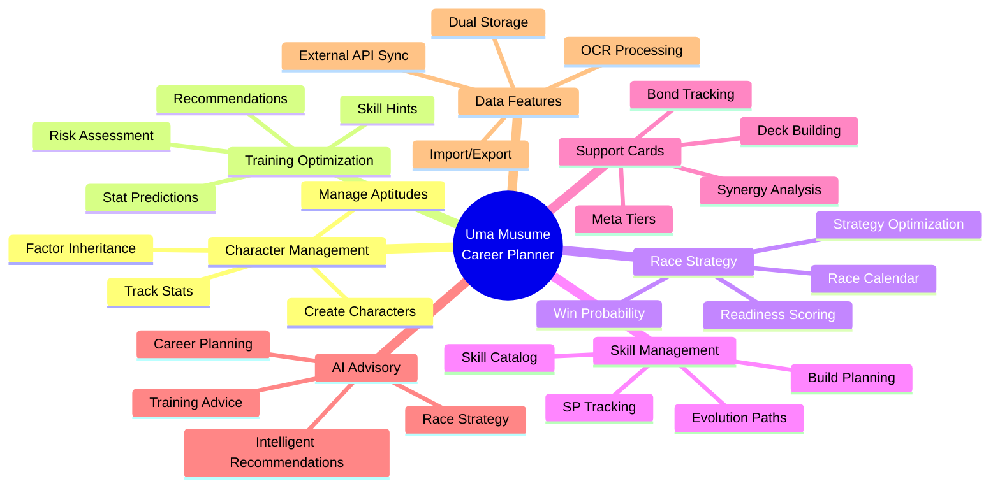

### 1.3 Key Features

| Feature | Description |
|---------|-------------|
| **Character State Management** | Complete tracking of Speed, Stamina, Power, Guts, and Wit stats with aptitude grades and factor inheritance |
| **Training Prediction Engine** | AI-powered predictions for stat gains, risk assessment, and optimal training recommendations |
| **Race Preparation & Strategy** | Comprehensive race planning with readiness scores, win probability, and running style optimization |
| **Skill Management** | Full skill catalog with hint tracking, SP cost reduction, and evolution path planning |
| **Support Card Configuration** | 6-card deck building with synergy analysis, bond tracking, and meta tier integration |
| **AI Advisory System** | Hybrid AI using local Ollama and AWS Bedrock Claude models for intelligent recommendations |
| **Dual Storage Modes** | Flexible storage with Local (browser) or Account (cloud) options |
| **External Integration** | Real-time data sync with umapyoi.net, OCR screenshot processing, and community tools |

### 1.4 System Requirements

| Component | Requirement |
|-----------|-------------|
| **Browser** | Chrome, Firefox, Safari, or Edge (last 2 versions) |
| **Screen Resolution** | Minimum 320px width, optimized up to 2560px |
| **JavaScript** | Enabled |
| **localStorage** | 5-10MB available for Local mode |
| **Internet** | Required for Account mode; optional for Local mode |

---

## 2. Getting Started

### 2.1 First Launch

When you first access the application:

1. **Welcome Screen** - View introduction and tutorial toggle
2. **Account Creation** (Optional) - Register for cloud sync features
3. **Career Configuration** - Set up your first character and goals
4. **Dashboard Orientation** - Interactive tutorial for key features

### 2.2 New Player Onboarding Flow

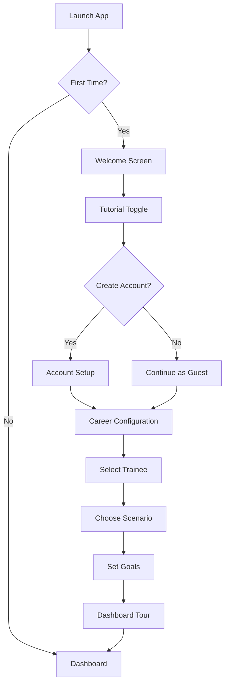

### 2.3 Storage Mode Selection

Choose how your data is stored:

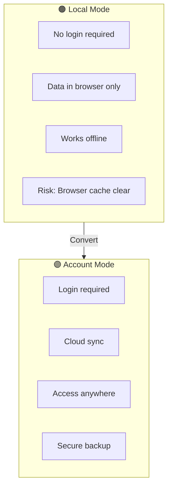

| Mode | Pros | Cons | Best For |
|------|------|------|----------|
| **Local** | Instant start, no account needed, works offline | Data stays on this browser/device only | Quick tests, anonymous usage |
| **Account** | Cross-device sync, secure cloud backup | Requires internet connection | Long-term tracking, multi-device access |

> **Tip:** You can start in Local Mode and convert your plans to Account Mode later!

---

## 3. Dashboard Overview

### 3.1 Dashboard Layout

```
┌──────────────────────���─────────────────────────────────────────┐
│  App Header: Logo | Run Selector | Notifications 🔔 | User Menu │
├────────────────────────────────────────────────────────────────┤
│ Sidebar              │ Main Content                            │
│ - Dashboard (active) │ ┌─────────────────┬─────────────────┐   │
│ - Character          │ │ Current Goals   │ Stat Snapshot   │   │
│ - Training           │ │ - Short-term    │ Speed  A (980)  │   │
│ - Races              │ │ - Long-term     │ Stamina B+(820) │   │
│ - Skills             │ │ Progress bars   │ Power  B (780)  │   │
│ - Support Cards      │ ├─────────────────┼─────────────────┤   │
│ - AI Advisor         │ │ Upcoming Races  │ Mood/Energy     │   │
│ - MCP Monitoring     │ │ [Date][Race]    │ Good | 72/100   │   │
│ - Performance        │ ├─────────────────┼─────────────────┤   │
│ - Admin Panel        │ │ Training Suggest│ AI Advisor Card │   │
│ - Settings           │ │ [Action][Gains] │ Last tip + CTA  │   │
│                      │ └─────────────────┴─────────────────┘   │
└────────────────────────────────────────────────────────────────┘
```

### 3.2 Dashboard Components

| Component | Description |
|-----------|-------------|
| **Stats Panel** | Current character stats with grade indicators (Speed, Stamina, Power, Guts, Wit) |
| **Goals Progress** | Active goals with progress bars and completion status |
| **Upcoming Races** | Next 3 races with date, grade, and readiness percentage |
| **Training Suggestions** | Top 3 recommended training options with gains and risk |
| **Mood/Energy Widget** | Current mood status and energy level |
| **AI Advisor Card** | Latest AI recommendation with quick action buttons |

### 3.3 Navigation

| Navigation Item | Route | Description |
|-----------------|-------|-------------|
| Dashboard | `/dashboard` | Main overview and stats |
| Character | `/characters` | Character management |
| Training | `/characters/{id}/training` | Training selection and predictions |
| Races | `/races` | Race calendar and strategy |
| Skills | `/skills` | Skill catalog and management |
| Support Cards | `/support-cards` | Card collection and deck building |
| AI Advisor | `/ai-advisor` | AI-powered recommendations |
| MCP Monitoring | `/mcp-monitoring` | MCP server and agent monitoring |
| Performance | `/performance` | System performance dashboard |
| Admin Panel | `/admin` | System administration (admin users) |
| OCR Upload | `/ocr` | Screenshot data extraction |
| Data Management | `/data-management` | Import, export, backup, and migration |
| Settings | `/settings` | User preferences and configuration |

---

## 4. Character Management

### 4.1 Character Creation Wizard

Create a new character through the step-by-step wizard:

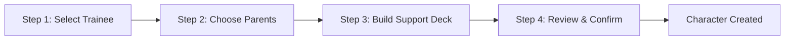

#### Step 1: Select Trainee & Scenario

```
┌────────────────────────────────────────────────────────────┐
│  Create New Character - Step 1 of 4                        │
├──────────────────────────────────────────────��─────────────┤
│  Select Trainee                                            │
│  ┌──────────────────────────────────────────────────┐     │
│  │ 🔍 Search trainees...                             │     │
│  └──────────────────────────────────────────────────┘     │
│                                                            │
│  Rarity Filter: [ ]SSR  [ ]SR  [ ]R                        │
│                                                            │
│  ┌─────────────────┬─────────────────┬─────────────────┐  │
│  │ Mejiro Ardan    │ Kitasan Black   │ Tokai Teio      │  │
│  │ SSR · Speed     │ SSR · Power     │ SSR · Stamina   │  │
│  │ [SELECT]        │ [SELECT]        │ [SELECT]        │  │
│  └─────────────────┴─────────────────┴─────────────────┘  │
│                                                            │
│  Scenario: [URA Finals ▼]                                  │
│                          [← BACK]  [NEXT →]                │
└────────────────────────────────────────────────────────────┘
```

#### Step 2: Parent Selection & Factor Inheritance

- Select Parent A and Parent B
- Preview inherited stat bonuses and factor ratings
- View growth rate projections

**Factor Ratings:**

| Rating | Stat Bonus |
|--------|------------|
| ★☆☆ | +5 |
| ★★☆ | +12 |
| ★★★ | +21 |

#### Step 3: Support Deck Configuration

- Build your 6-card support deck
- Validate type distribution
- Preview deck synergy score

#### Step 4: Review & Confirm

- Review all selections
- Confirm character creation
- Initialize starting stats, mood, and energy

### 4.2 Character Dashboard

View and manage your character's current state:

```
┌────────────────────────────────────────────────────────────┐
│  Mejiro Ardan (Turn 45)                       [Edit] [≡]   │
├────────────────────────────────────────────────────────────┤
│  Status Bar                                                │
│  Energy: ████████░ 78%  | Mood: ◐ Good  | Race in: 15 d   │
│                                                            │
│  ┌────────────────────────────────────────────────────────┐│
│  │ Stats Overview         │  Goals Progress              ││
│  ├────────────────────────┼──────────────────────────────┤│
│  │ Speed      520 ★★★★★  │  Speed Goal: 800  ███░░ 65%  ││
│  │ Stamina    480 ★★★★░  │  Stamina: 600  ███░░░░ 45%   ││
│  │ Power      440 ★★★░░  │  Race Goal: G1  ◐ Upcoming   ││
│  │ Guts       460 ★★★★░  │                              ││
│  │ Wit        450 ★★★░░  │  [+ Add Goal]                ││
│  │                        │                              ││
│  │ Aptitudes              │  Recent Turns                ││
│  │ • Mile:  A+  ◎         │  Turn 44: Speed +48          ││
│  │ • Turf:  A             │  Turn 43: Stamina +42        ││
│  │ • Late Surger: S       │  Turn 42: Power +35          ││
│  └────────────────────────┴──────────────────────────────┘│
└────────────────────────────────────────────────────────────┘
```

### 4.3 Stat System

**Stat Types and Ranges:**

| Stat | Description | Range | Priority |
|------|-------------|-------|----------|
| Speed | Maximum running speed | 0-1200 | ★★★★★ |
| Stamina | HP and effective stamina | 0-1200 | ★★★★ |
| Power | Acceleration and lane-changing | 0-1200 | ★★★ |
| Guts | Last spurt and stamina consumption | 0-1200 | ★ |
| Wit | Skill activation rate | 0-1200 | ★★ |

**Grade Scale:**

| Grade | Value Range |
|-------|-------------|
| SS | 1100+ |
| S | 950-1099 |
| A | 850-949 |
| B+ | 750-849 |
| B | 650-749 |
| C+ | 550-649 |
| C | 450-549 |
| D+ | 350-449 |
| D | 250-349 |
| E | 150-249 |
| F | 0-149 |

### 4.4 Aptitude System

**Aptitude Categories:**

| Category | Types |
|----------|-------|
| Distance | Sprint (1000-1400m), Mile (1401-1800m), Medium (1801-2400m), Long (2401m+) |
| Surface | Turf, Dirt |
| Running Style | Front Runner (Nige), Pace Chaser (Senkou), Late Surger (Sashi), End Closer (Oikomi) |

**Aptitude Ratings & Effectiveness:**

| Rating | Effectiveness | Notes |
|--------|---------------|-------|
| S | +5% | Maximum grade (provides positive bonus) |
| A | 0% | Baseline (no bonus/penalty) |
| B | -10% | Slight penalty |
| C | -20% | Moderate penalty |
| D | -30%/-40% | Significant penalty (varies by category) |
| E | -50%/-60% | Major penalty |
| F | -70%/-80% | Severe penalty |
| G | -90% | Minimum grade |

> **Note**: S is the maximum aptitude grade. SS does NOT exist in the current game version. Only S-rank provides positive bonuses; all grades below A incur penalties.

---

## 5. Career Run Management

### 5.1 Career Stages

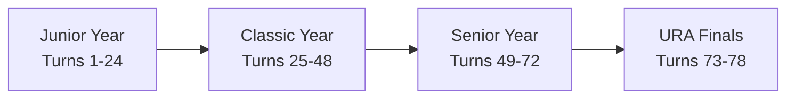

| Stage | Turn Range | Description |
|-------|------------|-------------|
| Junior | 1-24 | Early training and foundation building |
| Classic | 25-48 | Competitive racing and skill development |
| Senior | 49-72 | Peak performance and championship preparation |
| URA Finals | 73-78 | Final championship races |

### 5.2 Turn Progression

Each turn follows this flow:

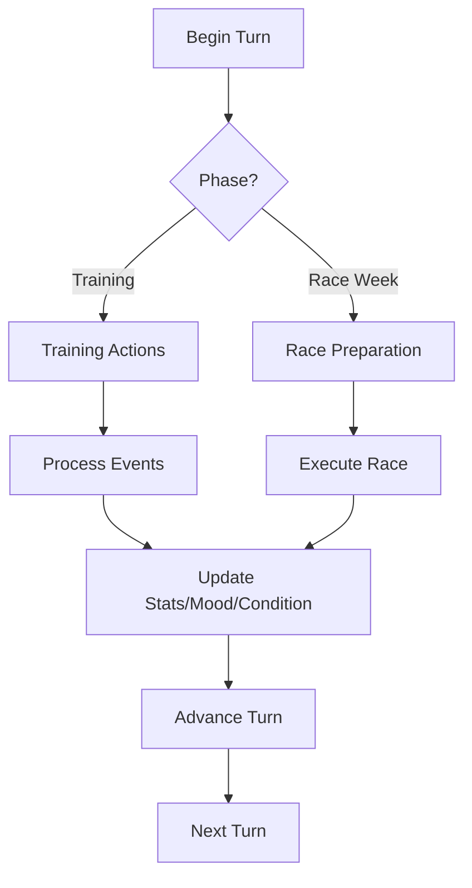

### 5.3 Goal Management

Set and track training objectives:

| Goal Type | Description | Example |
|-----------|-------------|---------|
| Stat Target | Reach specific stat value | Speed ≥ 800 |
| Race Win | Achieve placement in race | Win G1 Race |
| Skill Acquisition | Obtain specific skills | Acquire 9 skills |

**Goal Status:**

- ✅ **Completed** - Goal achieved
- 🟡 **On Track** - Progress within expected range
- 🔴 **At Risk** - Behind schedule, intervention needed

---

## 6. Training System

### 6.1 Training Selection Interface

```
┌────────────────────────────────────────────────────────────┐
│  Select Training (Turn 46)                            [≡]   │
├────────────────────────────────────────────────────────────┤
│  🚨 Status: Good | Energy: 78% | Mood: Good (+0%)          │
│                                                            │
│  ┌─────────────────────────────────────────────────────────┐
│  │ RECOMMENDED: Speed Training                  Rank: 1    │
│  │ Alignment: High | Score: 92.5/100           [AI] (new)  │
│  │                                                         │
│  │ Predicted Gains:                                        │
│  │ Speed: +45  Stamina: +5  Power: +3  Guts: +2  Wit: +1  │
│  │ Efficiency: ★★★★★ Excellent                            │
│  │                                                         │
│  │ Skill Hints:                                            │
│  │ • Lane Guidance (Guaranteed ✓ - Mejiro Dober red !)    │
│  │ • Going Strong (25% chance)                            │
│  │                                                         │
│  │ Support Cards Active:                                   │
│  │ • Mejiro Dober (Power Spec, +12) ← Red Exclamation     │
│  │ • Tokai Teio (Speed Spec, +8)                          │
│  │                                                         │
│  │ Mood Prediction: Good → Normal (-1) ⚠️                  │
│  │                                                         │
│  │                          [SELECT THIS] [SHOW MORE]      │
│  └─────────────────────────────────────────────────────────┘
│                                                            │
│  Other Training Options:                                   │
│  ┌──────────────────┬──────────────────┬──────────────────┐
│  │ 2. Stamina       │ 3. Power         │ 4. Guts          │
│  │ Rank: 2 (88.3)   │ Rank: 3 (82.1)   │ Rank: 4 (71.5)   │
│  │ Gains: +42       │ Gains: +38       │ Gains: +35       │
│  │ [SELECT]         │ [SELECT]         │ [SELECT]         │
│  └──────────────────┴──────────────────┴──────────────────┘
└────────────────────────────────────────────────────────────┘
```

### 6.2 Training Types

| Training | Primary Stat | Secondary Stats | Energy Cost |
|----------|--------------|-----------------|-------------|
| Speed | Speed | Stamina | 20-30% |
| Stamina | Stamina | Guts | 20-30% |
| Power | Power | Stamina | 20-30% |
| Guts | Guts | Power | 20-30% |
| Wisdom | Wit | Skill Points | 15-25% |
| Rest | - | Energy Recovery | -50% |

### 6.3 Training Predictions

The Training Prediction Engine calculates:

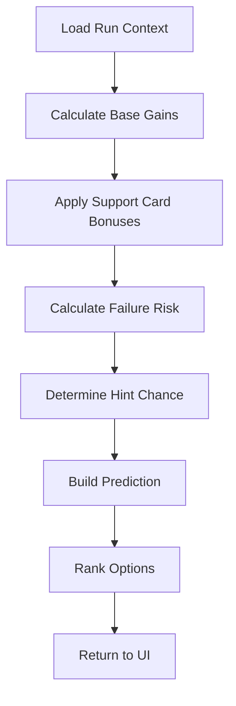

**Prediction Components:**

| Component | Description |
|-----------|-------------|
| Base Gains | Raw stat increases from training type |
| Support Bonuses | Multipliers from active support cards |
| Failure Risk | Chance of training failure (0-90%) |
| Hint Chance | Probability of receiving skill hints |
| Bond Gains | Friendship points with support cards |

### 6.4 Risk Assessment

Risk levels are color-coded:

| Risk Level | Percentage | Indicator |
|------------|------------|-----------|
| Low | <15% | 🟢 Green |
| Moderate | 15-40% | 🟡 Amber |
| High | >40% | 🔴 Red |

**Risk Factors:**

- Low energy level
- Bad/Awful mood
- Active condition debuffs
- High training difficulty

### 6.5 Friendship Training

When bond level reaches 80%+, Friendship Training activates:

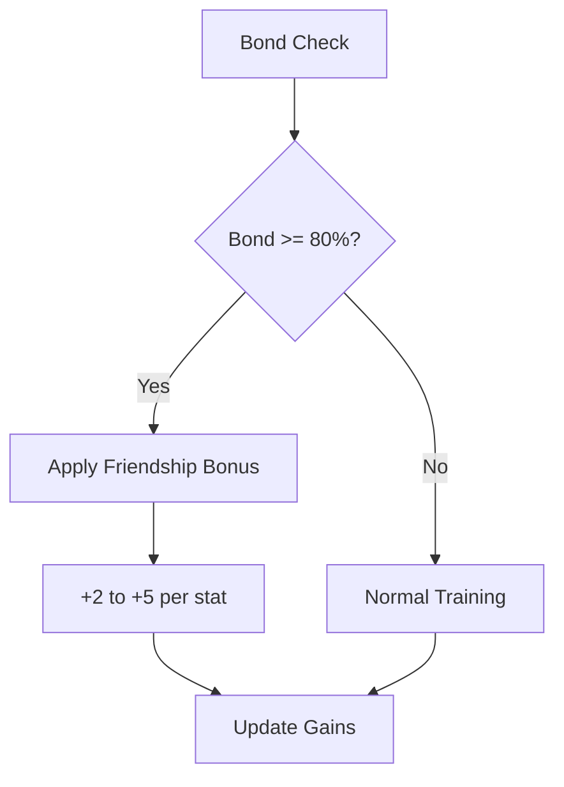

---

## 7. Race Strategy

### 7.1 Race Calendar

```
┌────────────────────────────────────────────────────────────┐
│  Race Calendar | Filter: [All Grades ▼] [All Distances ▼]  │
├────────────────────────────────────────────────────────────┤
│  January 2026                                              │
│  ┌─────┬─────┬─────┬─────┬─────┬─────┬─────┐              │
│  │ Sun │ Mon │ Tue │ Wed │ Thu │ Fri │ Sat │              │
│  ├─────┼─────┼─────┼─────┼─────┼─────┼─────┤              │
│  │  5  │  6  │  7  │  8  │  9  │ 10  │ 11  │              │
│  │     │     │     │     │     │G1🟢 │     │              │
│  │     │     │     │     │     │85%  │     │              │
│  └─────┴─────┴─────┴─────┴─────┴─────┴─────┘              │
│                                                            │
│  Selected: Kanto Okami Cup (G1)                           │
│  Distance: Medium (2400m) | Surface: Turf                 │
│  Readiness: 85% | Win Probability: 35%                    │
│                                                            │
│  [VIEW DETAILS] [ENTER RACE]                              │
└────────────────────────────────────────────────────────────┘
```

### 7.2 Race Preparation

```
┌────────────────────────────────────────────────────────────┐
│  Upcoming Race: Kanto Okami Cup                       [≡]   │
├────────────────────────────────────────────────────────────┤
│  Grade: G1 | Track: Tokyo | Distance: Medium (2400m)      │
│  Surface: Turf | Weather: Sunny | Turn: 85 | Days: 8      │
│                                                            │
│  Stat Requirements                 Running Style           │
│  ┌─────────────────────────┐       ┌──────────────────────┐│
│  │ Speed      520 ○ ADEQUATE│      │ RECOMMENDED:         ││
│  │ Stamina    480 × INADEQUATE     │ Late Surger          ││
│  │ Power      440 ⦾ BORDERLINE│    │ Score: 85.3/100      ││
│  │ Guts       460 ○ ADEQUATE│      │                      ││
│  │ Wit        450 ⦾ BORDERLINE│    │ Reasoning:           ││
│  │                         │       │ • High Power aptitude││
│  │ Readiness: ⦾ BORDERLINE │       │ • Strong in Guts     ││
│  └─────────────────────────┘       └──────────────────────┘│
│                                                            │
│  Performance Forecast                                      │
│  1st Place: 35% | 2nd: 40% | 3rd: 20% | 4th+: 5%          │
│                                                            │
│  [PREPARE] [RUN SIMULATION] [AI DETAILED ANALYSIS]        │
└────────────────────────────────────────────────────────────┘
```

### 7.3 Readiness Calculation

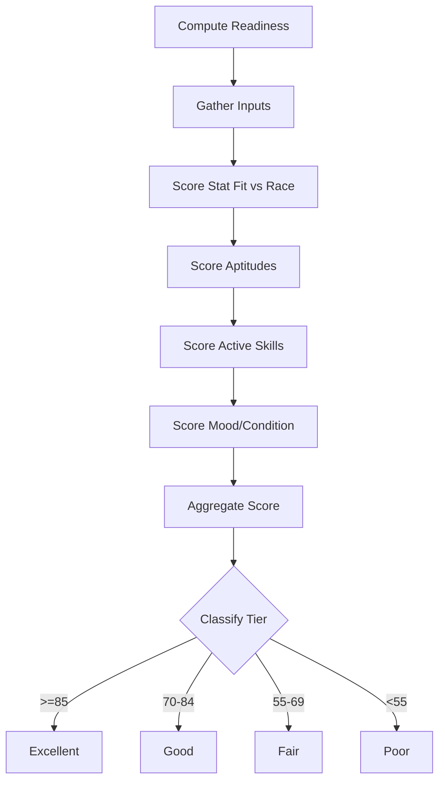

### 7.4 Running Styles

| Style | Japanese | Best For |
|-------|----------|----------|
| Front Runner | 逃げ (Nige) | Early lead, consistent pace |
| Pace Chaser | 先行 (Senkou) | Close pursuit, mid-race positioning |
| Late Surger | 差し (Sashi) | Final stretch acceleration |
| End Closer | 追込 (Oikomi) | Maximum end-game burst |

### 7.5 Win Probability Factors

| Factor | Impact |
|--------|--------|
| Race Grade | Higher grades reduce probability |
| Aptitude Match | Better aptitude = higher probability |
| Stat Comparison | Stat advantage increases probability |
| Skill Synergy | Matching skills boost probability |
| Competitor Strength | Stronger field reduces probability |

---

## 8. Skill Management

### 8.1 Skill Shop Interface

```
┌────────────────────────────────────────────────────────────┐
│  Skill Management                                     [≡]   │
├────────────────────────────────────────────────────────────┤
│  Current SP: 450 | Total SP Earned: 2400 | Used: 1950      │
│                                                            │
│  Filter: [Owned] [Available] [All]  |  Sort: [Cost] [Name] │
│                                                            │
│  ┌────────────────────────────────────────────────────────┐│
│  │ OWNED SKILLS (22)                                      ││
│  ├────────────────────────────────────────────────────────┤│
│  │ ✓ Predator's Instinct     [Unique] SP: 180             ││
│  │   Late Surger enhancement, inherited from legacy       ││
│  │                                                        ││
│  │ ✓ Go with the Flow → Lane Legerdemain [EVOLVED]       ││
│  │   Base: 120 SP | Evolved to: 180 SP | Hint: 1 (-10%)  ││
│  └────────────────────────────────────────────────────────┘│
│                                                            │
│  ┌────────────────────────────────────────────────────────┐│
│  │ AVAILABLE SKILLS (128)                                 ││
│  ├────────────────────────────────────────────────────────┤│
│  │ ⚡ Going Strong [Normal] 120 SP (5 hints available)    ││
│  │   Recommended for build | Cost with 5 hints: 72 SP    ││
│  │   [ACQUIRE] [MORE INFO]                               ││
│  └────────────────────────────────────────────────────────┘│
└────────────────────────────────────────────────────────────┘
```

### 8.2 Skill Categories

| Category | Description |
|----------|-------------|
| Normal | Standard skills, can evolve to Rare |
| Rare | Enhanced skills with stronger effects |
| Unique | Character-specific inherited skills |

### 8.3 Skill Hint System

Hints reduce SP cost progressively:

| Hint Level | Discount |
|------------|----------|
| 0 Hints | 0% (Base cost) |
| 1 Hint | 10% discount |
| 2 Hints | 20% discount |
| 3 Hints | 30% discount |
| 4 Hints | 35% discount |
| 5 Hints | 40% discount (maximum) |

**Hint Sources:**

- Training sessions
- Race rewards
- Support card events

### 8.4 Skill Evolution

Some Normal skills can evolve to Rare versions:

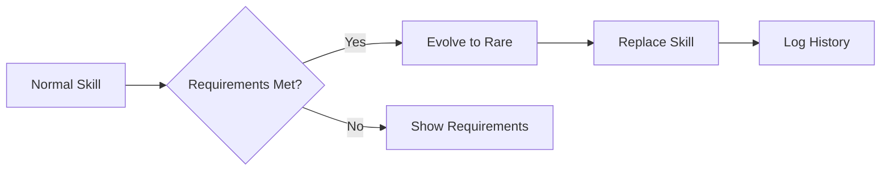

**Example Evolution:**

| Normal Skill | Rare Evolution |
|--------------|----------------|
| Go with the Flow | Lane Legerdemain |
| Stamina Boost | Endurance Master |

### 8.5 Skill Status Types

| Status | Icon | Description |
|--------|------|-------------|
| Acquired | ✅ | Skill purchased and owned |
| Skipped | ❌ | Decided not to acquire |
| Suggested | 💭 | Recommended by AI or planning |

---

## 9. Support Card & Deck Management

### 9.1 Support Card Collection

```
┌────────────────────────────────────────────────────────────┐
│  Support Card Collection                              [≡]   │
├────────────────────────────────────────────────────────────┤
│  Total: 156 Cards | SSR: 24 | SR: 48 | R: 84              │
│                                                            │
│  Filter: [All Types ▼] [All Rarity ▼] | Sort: [Meta Tier] │
│                                                            │
│  ┌─────────────────┬─────────────────┬─────────────────┐  │
│  │ Mejiro Dober    │ Tokai Teio      │ Kitasan Black   │  │
│  │ SSR · Power     │ SSR · Speed     │ SSR · Stamina   │  │
│  │ Meta: S Tier    │ Meta: SS Tier   │ Meta: S Tier    │  │
│  │ LB: 4/4 ★★★★   │ LB: 2/4 ★★☆☆   │ LB: 4/4 ★★★★   │  │
│  │ [VIEW] [DECK]   │ [VIEW] [DECK]   │ [VIEW] [DECK]   │  │
│  └─────────────────┴─────────────────┴─────────────────┘  │
└────────────────────────────────────────────────────────────┘
```

### 9.2 Deck Building

Build your 6-card support deck:

```
┌────────────────────────────────────────────────────────────┐
│  Configure Support Deck (6 Cards)                     [≡]   │
├─────────────────────────────────────────────��──────────────┤
│  Current Deck Power: S Tier | Meta Score: 92/100           │
│                                                            │
│  DECK COMPOSITION (6 of 6)                                 │
│  ┌─────────────────┬─────────────────┬─────────────────┐  │
│  │ 1. Mejiro Dober │ 2. Tokai Teio   │ 3. Kitasan Black│  │
│  │ SSR · Power     │ SSR · Speed     │ SSR · Stamina   │  │
│  │ LB: 4★★★★★     │ LB: 2★★☆☆☆     │ LB: 4★★★★★     │  │
│  │ Bond: 90%       │ Bond: 75%       │ Bond: 85%       │  │
│  └─────────────────┴─────────────────┴─────────────────┘  │
│  ┌─────────────────┬─────────────────┬─────────────────┐  │
│  │ 4. Narita Brian │ 5. Symboli Rudolf│ 6. [BORROWED]  │  │
│  │ SSR · Wit       │ SSR · Guts      │ SR · Friend     │  │
│  │ LB: 3★★★☆☆     │ LB: 2���★☆☆☆     │ LB: 1★☆☆☆☆     │  │
│  │ Bond: 80%       │ Bond: 70%       │ Bond: 60%       │  │
│  └─────────────────┴─────────────────┴─────────────────┘  │
│                                                            │
│  Deck Analysis:                                            │
│  • Speed: 2 cards ✓                                        │
│  • Power: 1 card ✓                                         │
│  • Stamina: 1 card ✓                                       │
│  • Good diversity ✓                                        │
│                                                            │
│                          [SAVE DECK] [RECOMMEND OPTIMAL]   │
└────────────────────────────────────────────────────────────┘
```

### 9.3 Deck Rules

| Rule | Description |
|------|-------------|
| Deck Size | Exactly 6 cards |
| Ownership | 5 owned + 1 borrowed allowed |
| Type Balance | Recommended mix of stat types |
| Synergy | Cards should complement training goals |

### 9.4 Meta Tiers

Cards are rated by the community:

| Tier | Description |
|------|-------------|
| SS | Top-tier, essential for meta builds |
| S | Excellent choice, highly recommended |
| A | Good card, situationally valuable |
| B | Average card, viable in specific builds |

### 9.5 Bond Progression


**Bond Milestones:**

| Level | Reward |
|-------|--------|
| 20% | Small stat bonus |
| 40% | Skill hint |
| 60% | Special event |
| 80% | Friendship Training unlocked |

---

## 10. AI Advisory System

### 10.1 AI Advisor Interface

```
┌────────────────────────────────────────────────────────────┐
│  AI Advisor                                           [≡]   │
├────────────────────────────────────────────────────────────┤
│  ┌────────────────────────────────────────────────────────┐│
│  │ 💡 Current Recommendation                              ││
│  │                                                        ││
│  │ Based on your current stats and upcoming G1 race,      ││
│  │ I recommend focusing on Speed training for the next    ││
│  │ 3 turns. Your stamina is adequate for the race         ││
│  │ distance, but speed needs +150 to reach competitive    ││
│  │ levels.                                                ││
│  │                                                        ││
│  │ Confidence: 85%                                        ││
│  │ Risk Assessment: Low                                   ││
│  │                                                        ││
│  │ [APPLY SUGGESTION] [ASK FOLLOW-UP] [DISMISS]          ││
│  └────────────────────────────────────────────────────────┘│
│                                                            │
│  Quick Topics:                                             │
│  [Training Advice] [Race Strategy] [Skill Build] [Career] │
│                                                            │
│  ┌────────────────────────────────────────────────────────┐│
│  │ Ask AI Advisor...                                      ││
│  │ ┌──────────────────────────────────────────────────┐  ││
│  │ │ Type your question here...                       │  ││
│  │ └──────────────────────────────────────────────────┘  ││
│  │                                         [Send] 📤     ││
│  └────────────────────────────────────────────────────────┘│
└────────────────────────────────────────────────────────────┘
```

### 10.2 AI System Architecture

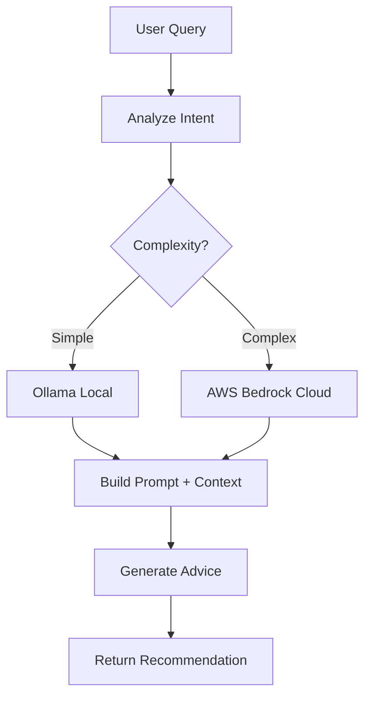

### 10.3 Advisory Topics

| Topic | Description | Example Questions |
|-------|-------------|-------------------|
| Training | Optimal training selection | "What should I train next?" |
| Race Strategy | Pre-race preparation | "Am I ready for the upcoming G1?" |
| Skill Build | Skill acquisition planning | "Which skills should I prioritize?" |
| Career Planning | Long-term strategy | "How can I reach A+ grade by turn 60?" |

### 10.4 AI Response Components

| Component | Description |
|-----------|-------------|
| Recommendation | Clear action to take |
| Reasoning | Explanation of why |
| Confidence | AI's certainty level (0-100%) |
| Risks | Potential downsides |
| Alternatives | Other options to consider |

### 10.5 AI Providers

| Provider | Usage | Best For |
|----------|-------|----------|
| Ollama (Local) | Primary | Quick responses, privacy |
| AWS Bedrock Claude | Fallback | Complex analysis, detailed planning |

---

## 11. Data Import & Export

### 11.1 Export Formats

| Format | Extension | Use Case |
|--------|-----------|----------|
| JSON | .json | Full data backup, import/export |
| Excel | .xlsx | Spreadsheet analysis |
| Markdown | .md | Documentation, sharing |
| CSV | .csv | Data processing |

### 11.2 Export Process

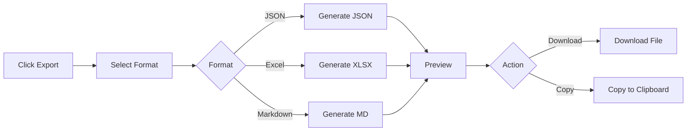

### 11.3 Import Wizard

```
┌────────────────────────────────────────────────────────────┐
│  Import Data - Step 2 of 4: Preview                   [≡]   │
├────────────────────────────────────────────────────────────┤
│  File: my_career_data.json                                 │
│  Format: JSON (Version 1.0)                                │
│  Plans Found: 5                                            │
│                                                            │
│  ┌────────────────────────────────────────────────────────┐│
│  │ ☑ Speed Build Attempt          Status: In Progress    ││
│  │   Character: Special Week | Turn: 45 | Stats: 2850    ││
│  │                                                        ││
│  │ ☑ Stamina Focus Run            Status: Completed      ││
│  │   Character: Silence Suzuka | Turn: 72 | Stats: 3200  ││
│  │                                                        ││
│  │ ☐ Test Run (skip)              Status: Archived       ││
│  │   Character: Tokai Teio | Turn: 12 | Stats: 450       ││
│  └────────────────────────────────────────────────────────┘│
│                                                            │
│  Import Target: [Local Storage ▼]                         │
│                                                            │
│  Conflict Resolution:                                      │
│  ○ Skip duplicates                                         │
│  ○ Overwrite existing                                      │
│  ● Import as copy                                          │
│                                                            │
│                          [← Back] [Import Selected →]      │
└────────────────────────────────────────────────────────────┘
```

### 11.4 Import Conflict Resolution

| Option | Description |
|--------|-------------|
| Skip | Don't import if duplicate exists |
| Overwrite | Replace existing with imported data |
| Import as Copy | Create new entry with modified title |
| Merge | Combine data (future feature) |

### 11.5 OCR Screenshot Import

Upload game screenshots for automatic data extraction:

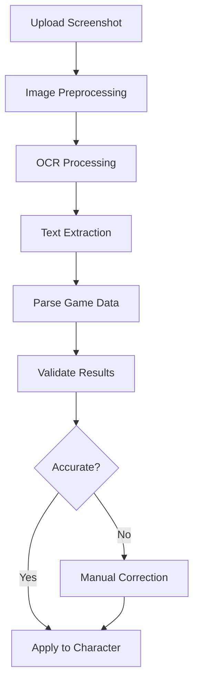

**Supported Data:**

- Current stats
- Skill inventory
- Aptitude grades
- Support card bonds

---

## 12. Storage Modes

### 12.1 Local Mode

**Features:**

- No login required
- Data stored in browser localStorage
- Works completely offline
- UUID-based identification

**Routes:**

- View: `/plans/local/{uuid}`
- Edit: `/plans/local/{uuid}/edit`

**Limitations:**

- Data tied to single browser/device
- Risk of data loss if browser cache cleared
- Limited storage (5-10MB typical)

### 12.2 Account Mode

**Features:**

- Cloud-synced data
- Access from any device
- Secure backup
- Integer ID identification

**Routes:**

- View: `/plans/{id}`
- Edit: `/plans/{id}/edit`

**Requirements:**

- User account
- Internet connection for sync

### 12.3 Converting Local to Account

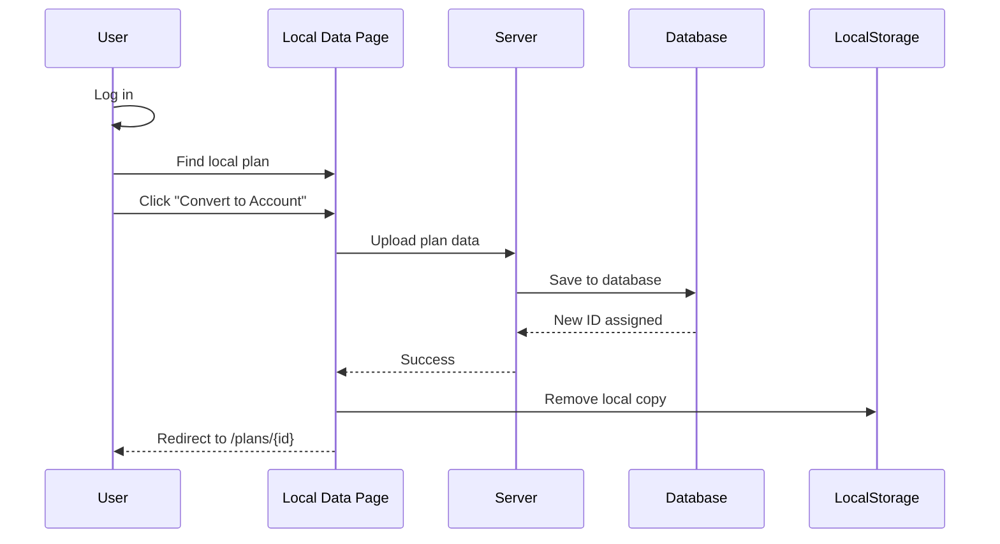

**Steps:**

1. Log in to your account
2. Go to **Local Data** management
3. Select plans to convert
4. Click **"Convert to Account"**
5. Choose whether to keep local copy
6. Confirm conversion

### 12.4 Draft Auto-Save

Unsaved work is automatically preserved:

| Feature | Behavior |
|---------|----------|
| Auto-save interval | Every 30 seconds |
| Draft versions | Last 3 versions kept |
| Draft expiration | Prompt after 7 days |
| Clear on save | Drafts removed after successful save |

---

## 13. Settings & Preferences

### 13.1 Display Settings

| Setting | Options | Default |
|---------|---------|---------|
| Theme | Light / Dark / System | System |
| Language | English / Japanese | English |
| Stat Display | Numeric / Circular / Bars | Circular |
| Compact View | On / Off | Off |

### 13.2 Accessibility Settings

| Setting | Description |
|---------|-------------|
| Reduced Motion | Minimize animations |
| High Contrast | Enhanced visibility |
| Screen Reader | ARIA optimizations |
| Keyboard Navigation | Tab order and shortcuts |

### 13.3 AI Settings

| Setting | Options | Default |
|---------|---------|---------|
| AI Provider | Local Only / Cloud / Hybrid | Hybrid |
| Auto-suggest | On / Off | On |
| Suggestion Frequency | Always / Important / Never | Important |

### 13.4 Notification Settings

| Setting | Options | Default |
|---------|---------|---------|
| Race Reminders | On / Off | On |
| Training Suggestions | On / Off | On |
| Goal Alerts | On / Off | On |

---

## 14. Troubleshooting

### 14.1 Common Issues

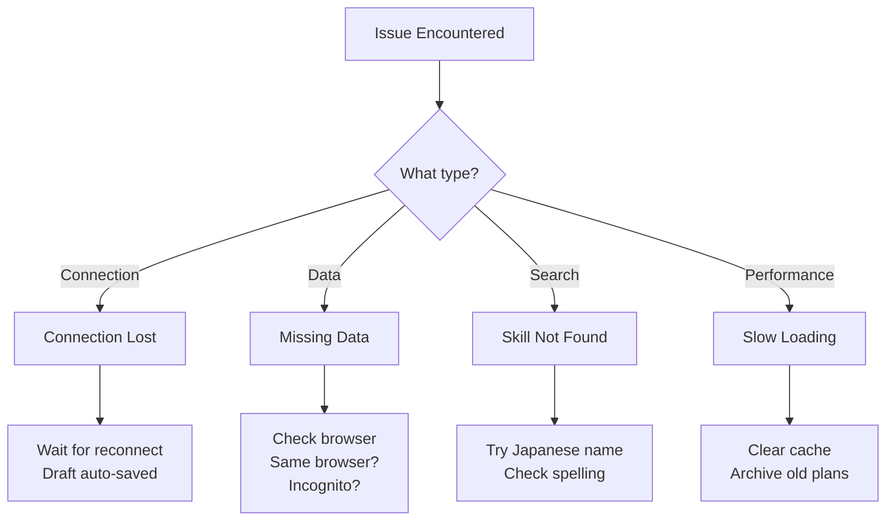

### 14.2 Issue Solutions

| Issue | Cause | Solution |
|-------|-------|----------|
| **Connection Lost** | Internet dropped | App enters Offline Mode. Changes saved as draft. Reconnect to sync. |
| **Missing Local Data** | Different browser or cleared cache | Ensure same browser. Incognito mode deletes data when closed. |
| **Skill Not Found** | Name mismatch | Try Japanese name. Check spelling. |
| **Stats Not Saving** | Form not submitted | Click "Save" after changes. Check for validation errors. |
| **Slow Performance** | Too many plans | Archive old completed plans. Clear browser cache. |
| **AI Not Responding** | Local AI unavailable | System falls back to cloud AI. Check Ollama installation. |
| **Export Failed** | Large data set | Try exporting fewer plans. Check browser memory. |

### 14.3 Connection State Management

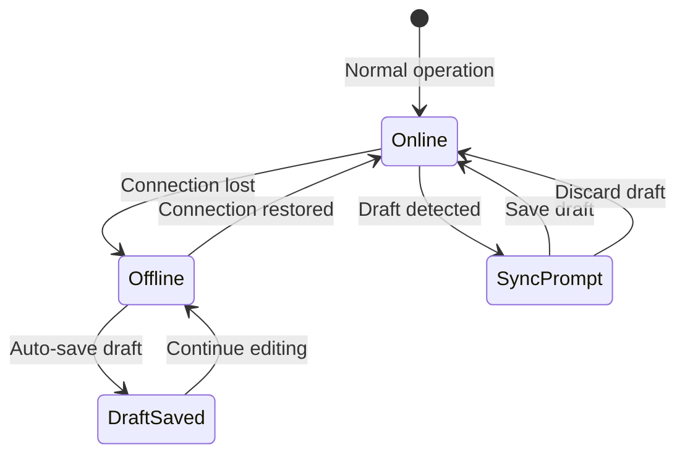

### 14.4 Error Messages

| Error Code | Message | Action |
|------------|---------|--------|
| E001 | Validation failed | Check required fields |
| E002 | Stat out of range | Values must be 0-1200 |
| E003 | Network timeout | Check internet connection |
| E004 | Storage quota exceeded | Clear old data or use Account mode |
| E005 | Import format invalid | Check file format and version |

---

## 15. Keyboard Shortcuts

### 15.1 Global Shortcuts

| Shortcut | Action |
|----------|--------|
| `Ctrl + S` | Save current plan |
| `Ctrl + N` | Create new plan |
| `Ctrl + D` | Toggle dark mode |
| `Esc` | Close modal/dialog |
| `/` | Focus search |
| `?` | Show keyboard shortcuts |

### 15.2 Navigation Shortcuts

| Shortcut | Action |
|----------|--------|
| `G then D` | Go to Dashboard |
| `G then C` | Go to Characters |
| `G then T` | Go to Training |
| `G then R` | Go to Races |
| `G then S` | Go to Skills |
| `G then A` | Go to AI Advisor |

### 15.3 Editor Shortcuts

| Shortcut | Action |
|----------|--------|
| `Tab` | Next field |
| `Shift + Tab` | Previous field |
| `Enter` | Confirm selection |
| `↑ / ↓` | Navigate dropdown options |
| `Ctrl + Z` | Undo last change |

---

## 16. Glossary

### 16.1 Game Terms

| Term | Japanese | Definition |
|------|----------|------------|
| Speed | スピード | Determines maximum running speed |
| Stamina | スタミナ | Determines HP/effective stamina |
| Power | パワー | Affects acceleration and lane-changing |
| Guts | 根性 | Affects last spurt and stamina consumption |
| Wit | 賢さ | Affects skill activation rate |
| Nige | 逃げ | Front Runner running style |
| Senkou | 先行 | Pace Chaser running style |
| Sashi | 差し | Late Surger running style |
| Oikomi | 追込 | End Closer running style |
| SP | スキルポイント | Skill Points for purchasing skills |
| URA | URAファイナルズ | Final race series |

### 16.2 Application Terms

| Term | Definition |
|------|------------|
| Career Run | A complete training progression from Junior to URA Finals |
| Turn | A single training/action period in the game |
| Factor | Inherited stat bonus from parent characters |
| Hint | Discount on skill SP cost from training/events |
| Bond | Friendship level with support card characters |
| Meta Tier | Community ranking of support card effectiveness |
| Draft | Auto-saved unsaved work |

### 16.3 Status Icons

| Icon | Meaning |
|------|---------|
| 🟠 | Local Mode |
| 🟣 | Account Mode |
| 🟢 | In Progress / Good |
| ✅ | Completed / Acquired |
| 📦 | Archived |
| ⚠️ | Warning / Unsaved Changes |
| 🔴 | At Risk / High Risk |
| 💭 | Suggested |
| ❌ | Skipped |

---

## 17. Support & Resources

### 17.1 Getting Help

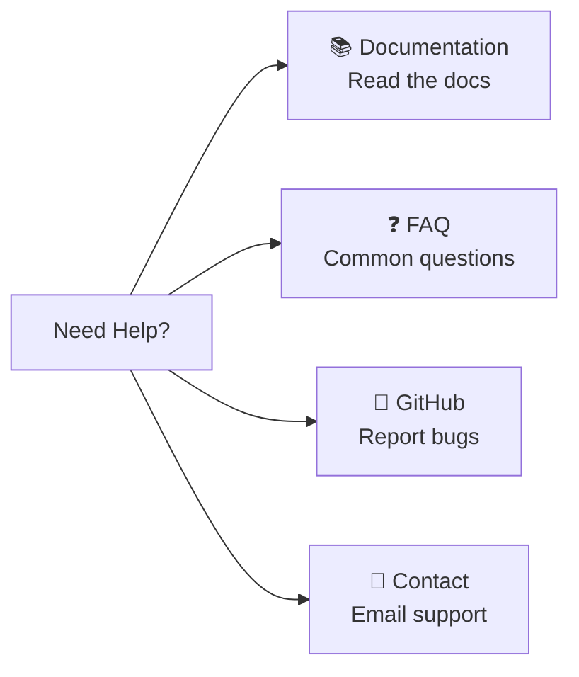

### 17.2 Resources

| Resource | Description | Location |
|----------|-------------|----------|
| **Documentation** | Full system documentation | `/docs` folder |
| **FAQ** | Frequently asked questions | Help page |
| **GitHub** | Bug reports and feature requests | Repository Issues |
| **Community** | User discussions and tips | Community forums |

### 17.3 Reporting Bugs

When reporting a bug, please include:

1. What you were trying to do
2. What happened instead
3. Steps to reproduce
4. Your browser and device
5. Screenshots if possible
6. Console errors (if technical user)

### 17.4 External Data Sources

| Source | Data Provided | Status |
|--------|---------------|--------|
| umapyoi.net | Characters, support cards, news | Active |
| UmamusumeDB.com | Skill data, race info | Verification pending |
| Community Tools | Meta rankings, strategies | Active |

---

## Document History

| Version | Date | Author | Changes |
|---------|------|--------|---------|
| 2.3.0 | 2026-02-21 | Development Team | Updated version alignment to v2.3.0, refreshed technology references (Livewire 4, Pest v4, PHPUnit v12), dated February 2026 |
| 2.1.0 | 2026-01-23 | Development Team | Comprehensive update aligned with v2.0.0 codebase, integrated PRD/SPEC/Flow documentation, added AI Advisory, OCR, and detailed feature documentation |
| 2.0.0 | 2026-01-03 | Development Team | Added Mermaid diagrams, expanded content |
| 1.0.0 | 2026-01-03 | Development Team | Initial draft |

---

## Related Documents

- [PRD-001: Character Management](../prds/PRD-001_Character_Management.md)
- [PRD-002: Training Optimization](../prds/PRD-002_Training_Optimization.md)
- [PRD-003: Race Strategy](../prds/PRD-003_Race_Strategy.md)
- [PRD-004: Skill Management](../prds/PRD-004_Skill_Management.md)
- [PRD-005: Support Card Management](../prds/PRD-005_Support_Card_Management.md)
- [PRD-006: AI Advisory](../prds/PRD-006_AI_Advisory.md)
- [PRD-007: External Integration](../prds/PRD-007_External_Integration.md)
- [SPEC Index](../specs/000_SPECS_INDEX.md)
- [User Flow Diagrams](../user-flows/000_USER_FLOW_DIAGRAMS_INDEX.md)
- [Wireframes](../wireframes/000_WIREFRAMES_INDEX.md)

---

*This manual reflects the current implementation of Umamusume Career Planner v2.4.0. For the latest updates, please refer to the online documentation.*
