# D09 - Database Documentation

## Uma Musume Career Planner

**Document Version:** 2.0  
**Date:** 2026-01-03  
**Status:** Draft

---

## Table of Contents

1. [Overview](#1-overview)
2. [Schema Diagram](#2-schema-diagram)
3. [Table Definitions](#3-table-definitions)
4. [Indexes and Performance](#4-indexes-and-performance)
5. [Canonical Naming Conventions](#5-canonical-naming-conventions)
6. [Data Relationships](#6-data-relationships)

---

## 1. Overview

This document details the database schema for the Uma Musume Career Planner. The schema is designed to be canonical, meaning it standardizes naming conventions across all legacy sources. It supports the "Account Mode" of the application.

### 1.1 Database Configuration

| Property | Value |
|----------|-------|
| **Database Engine** | MySQL 8.0 / MariaDB 10.5+ / SQLite (Dev) |
| **Charset** | `utf8mb4` |
| **Collation** | `utf8mb4_unicode_ci` |

### 1.2 Schema Overview

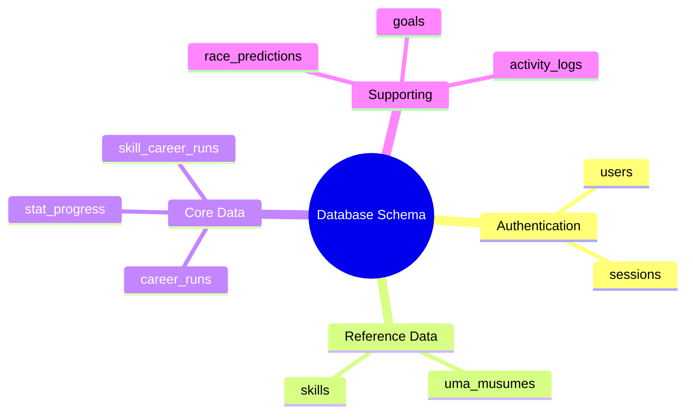

---

## 2. Schema Diagram

### 2.1 Entity Relationship Diagram

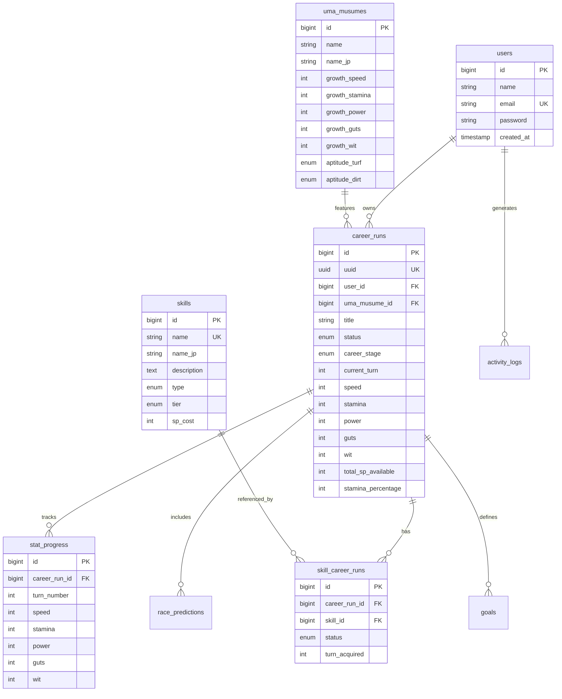

### 2.2 Table Categories

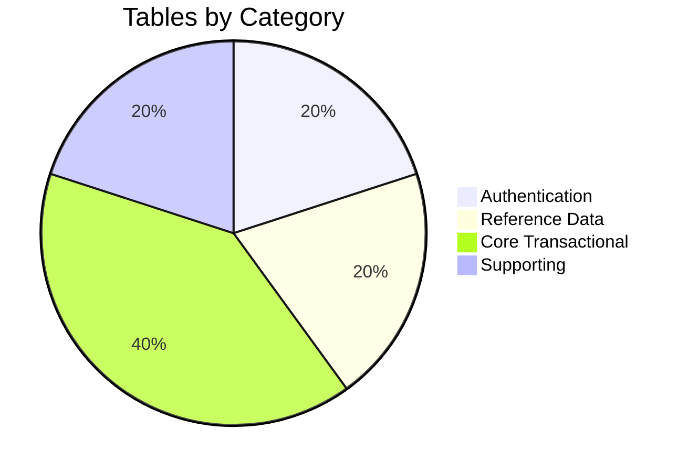

---

## 3. Table Definitions

### 3.1 `users` (Standard Laravel)

Standard authentication table.

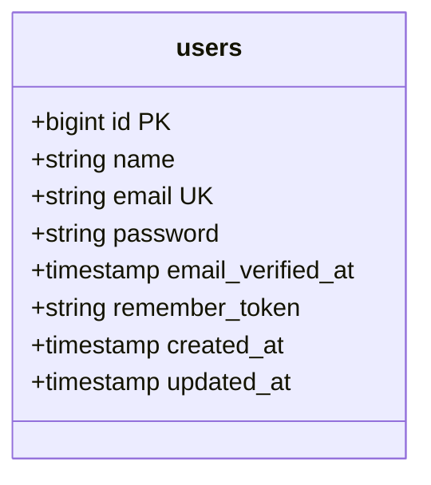

| Column | Type | Constraints | Description |
|--------|------|-------------|-------------|
| `id` | BigInt | PK, Auto | Primary key |
| `name` | String(255) | Not Null | User display name |
| `email` | String(255) | Unique, Not Null | Login email |
| `password` | String(255) | Not Null | Hashed password |
| `email_verified_at` | Timestamp | Nullable | Verification timestamp |
| `remember_token` | String(100) | Nullable | Session token |
| `created_at` | Timestamp | - | Creation timestamp |
| `updated_at` | Timestamp | - | Last update timestamp |

### 3.2 `uma_musumes` (Reference Data)

Stores static character data.

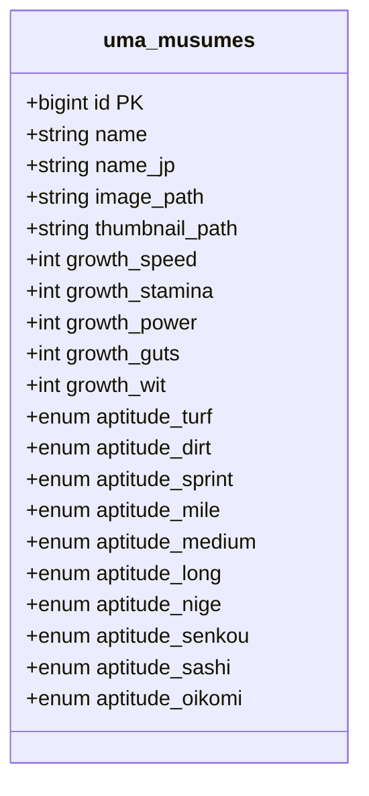

| Column | Type | Constraints | Description |
|--------|------|-------------|-------------|
| `id` | BigInt | PK | Primary key |
| `name` | String(255) | Not Null | English name (e.g., "Special Week") |
| `name_jp` | String(255) | Nullable | Japanese name |
| `image_path` | String(255) | Nullable | Path to full artwork |
| `thumbnail_path` | String(255) | Nullable | Path to icon |
| `growth_speed` | Int | Default 0 | Speed growth rate (e.g., 20) |
| `growth_stamina` | Int | Default 0 | Stamina growth rate |
| `growth_power` | Int | Default 0 | Power growth rate |
| `growth_guts` | Int | Default 0 | Guts growth rate |
| `growth_wit` | Int | Default 0 | Wit growth rate |
| `aptitude_*` | Enum | SS-G | Various aptitude grades |

**Aptitude Enum Values:** `SS`, `S`, `A`, `B`, `C`, `D`, `E`, `F`, `G`

### 3.3 `skills` (Reference Data)

Stores static skill data.

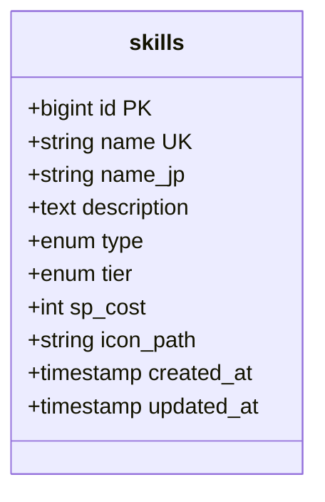

| Column | Type | Constraints | Description |
|--------|------|-------------|-------------|
| `id` | BigInt | PK | Primary key |
| `name` | String(255) | Unique, Not Null | English skill name |
| `name_jp` | String(255) | Nullable | Japanese skill name |
| `description` | Text | Nullable | Skill effect description |
| `type` | Enum | Not Null | Skill category |
| `tier` | Enum | Not Null | Skill rarity tier |
| `sp_cost` | Int | Not Null | SP cost to acquire |
| `icon_path` | String(255) | Nullable | Path to skill icon |

**Type Enum:** `speed`, `stamina`, `power`, `guts`, `wit`, `debuff`

**Tier Enum:** `G-`, `G`, `G+`, `F-`, `F`, `F+`, `E-`, `E`, `E+`, `D-`, `D`, `D+`, `C-`, `C`, `C+`, `B-`, `B`, `B+`, `A-`, `A`, `A+`, `S-`, `S`, `S+`, `SS`

### 3.4 `career_runs` (Core Transactional)

Represents a single training run (Plan).

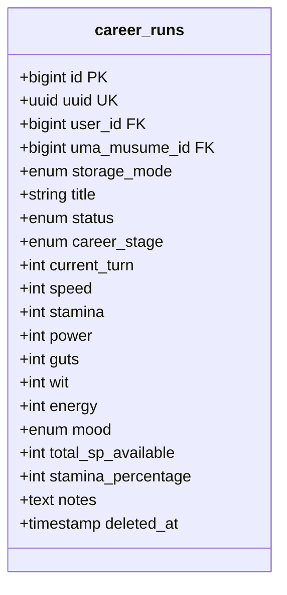

| Column | Type | Constraints | Description |
|--------|------|-------------|-------------|
| `id` | BigInt | PK | Primary key |
| `uuid` | UUID | Unique | Global identifier (aligns with localStorage) |
| `user_id` | BigInt | FK → users, Nullable | Owner user |
| `uma_musume_id` | BigInt | FK → uma_musumes | Selected character |
| `storage_mode` | Enum | Default 'account' | Storage type |
| `title` | String(255) | Not Null | Plan title |
| `status` | Enum | Not Null | Current status |
| `career_stage` | Enum | Not Null | Current career stage |
| `current_turn` | Int | 1-78 | Current turn number |
| `speed` | Int | Default 0 | Current speed stat |
| `stamina` | Int | Default 0 | Current stamina stat |
| `power` | Int | Default 0 | Current power stat |
| `guts` | Int | Default 0 | Current guts stat |
| `wit` | Int | Default 0 | Current wit stat |
| `energy` | Int | 0-100 | Current energy level |
| `mood` | Enum | Default 'normal' | Current mood |
| `total_sp_available` | Int | Default 0 | **Canonical:** Available SP |
| `stamina_percentage` | Int | 0-100 | **Canonical:** Stamina % |
| `notes` | Text | Nullable | User notes |
| `deleted_at` | Timestamp | Nullable | Soft delete timestamp |

**Status Enum:** `in_progress`, `completed`, `archived`

**Career Stage Enum:** `junior`, `classic`, `senior`

**Mood Enum:** `great`, `good`, `normal`, `bad`, `awful`

### 3.5 `stat_progress` (History)

Turn-by-turn log of stats.

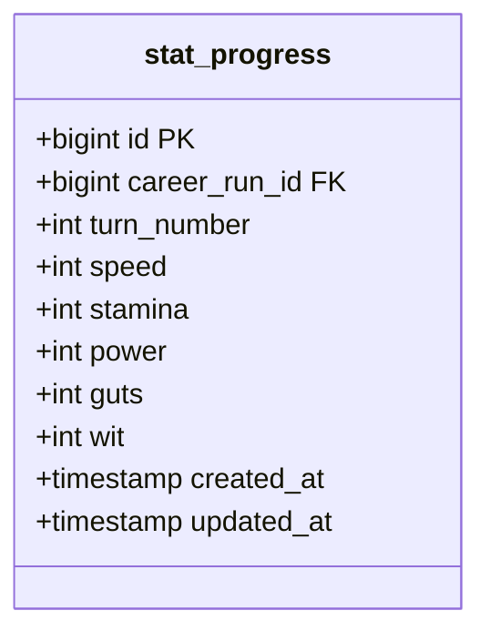

| Column | Type | Constraints | Description |
|--------|------|-------------|-------------|
| `id` | BigInt | PK | Primary key |
| `career_run_id` | BigInt | FK → career_runs | Parent plan |
| `turn_number` | Int | **Canonical** | Turn number (1-78) |
| `speed` | Int | Not Null | Speed at this turn |
| `stamina` | Int | Not Null | Stamina at this turn |
| `power` | Int | Not Null | Power at this turn |
| `guts` | Int | Not Null | Guts at this turn |
| `wit` | Int | Not Null | Wit at this turn |

**Constraint:** `UNIQUE(career_run_id, turn_number)`

### 3.6 `skill_career_runs` (Pivot)

Skills attached to a plan.

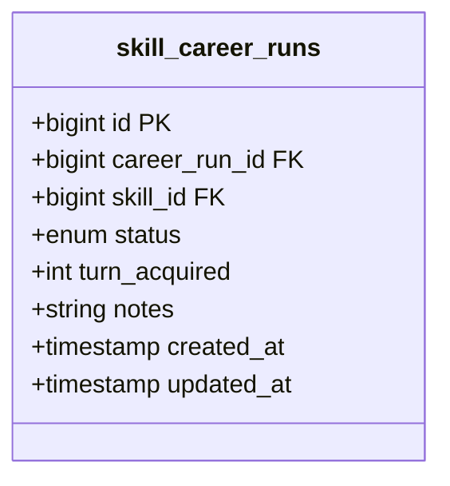

| Column | Type | Constraints | Description |
|--------|------|-------------|-------------|
| `id` | BigInt | PK | Primary key |
| `career_run_id` | BigInt | FK → career_runs | Parent plan |
| `skill_id` | BigInt | FK → skills | Referenced skill |
| `status` | Enum | Not Null | Skill status |
| `turn_acquired` | Int | Nullable | Turn when acquired (required if status='acquired') |
| `notes` | String(255) | Nullable | User notes |

**Status Enum:** `acquired`, `skipped`, `suggested`

### 3.7 `race_predictions`

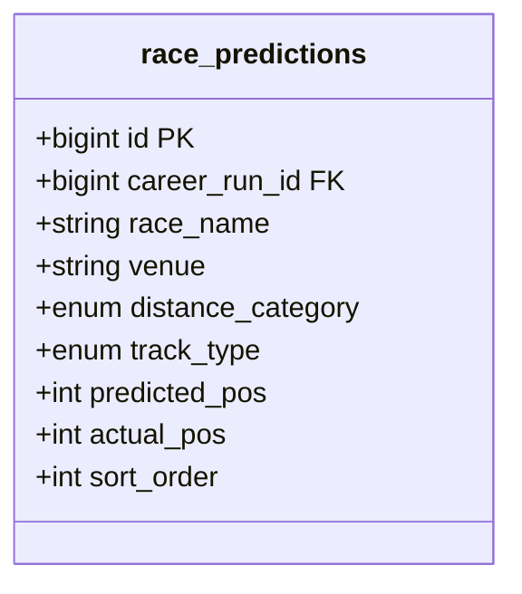

| Column | Type | Constraints | Description |
|--------|------|-------------|-------------|
| `id` | BigInt | PK | Primary key |
| `career_run_id` | BigInt | FK → career_runs | Parent plan |
| `race_name` | String(255) | Not Null | Race name |
| `venue` | String(255) | Nullable | Race venue |
| `distance_category` | Enum | Not Null | Distance type |
| `track_type` | Enum | Not Null | Track surface |
| `predicted_pos` | Int | Nullable | Predicted placement |
| `actual_pos` | Int | Nullable | Actual placement |
| `sort_order` | Int | Default 0 | Display order |

**Distance Category Enum:** `sprint`, `mile`, `medium`, `long`

**Track Type Enum:** `turf`, `dirt`

### 3.8 `goals`

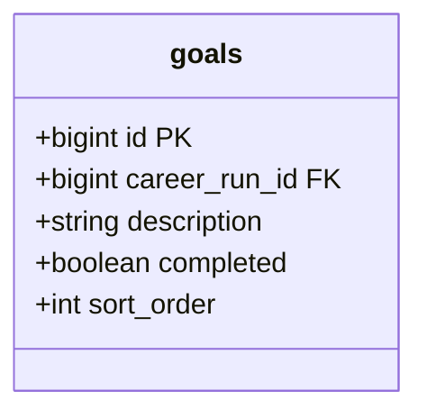

| Column | Type | Constraints | Description |
|--------|------|-------------|-------------|
| `id` | BigInt | PK | Primary key |
| `career_run_id` | BigInt | FK → career_runs | Parent plan |
| `description` | String(255) | Not Null | Goal description |
| `completed` | Boolean | Default false | Completion status |
| `sort_order` | Int | Default 0 | Display order |

### 3.9 `activity_logs`

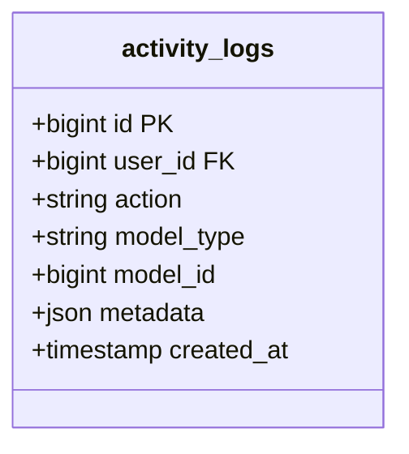

| Column | Type | Constraints | Description |
|--------|------|-------------|-------------|
| `id` | BigInt | PK | Primary key |
| `user_id` | BigInt | FK → users, Nullable | Acting user |
| `action` | String(50) | Not Null | Action type (create, update, delete) |
| `model_type` | String(100) | Not Null | Model class name |
| `model_id` | BigInt | Not Null | Affected model ID |
| `metadata` | JSON | Nullable | Change details |
| `created_at` | Timestamp | Not Null | Action timestamp |

---

## 4. Indexes and Performance

### 4.1 Index Strategy

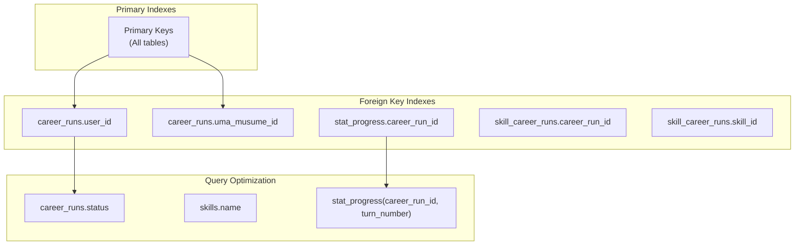

### 4.2 Index Definitions

| Table | Index | Columns | Purpose |
|-------|-------|---------|---------|
| `career_runs` | `idx_user_id` | `user_id` | Filtering plans by user |
| `career_runs` | `idx_status` | `status` | Dashboard filtering |
| `career_runs` | `idx_uuid` | `uuid` | UUID lookups |
| `stat_progress` | `idx_run_turn` | `career_run_id`, `turn_number` | Chart data retrieval |
| `skill_career_runs` | `idx_career_run` | `career_run_id` | Skill list retrieval |
| `skills` | `idx_name` | `name` | Autocomplete performance |
| `skills` | `idx_type` | `type` | Type filtering |
| `activity_logs` | `idx_model` | `model_type`, `model_id` | Audit trail lookup |

### 4.3 Query Performance Targets

```mermaid
gantt
    title Query Performance Targets
    dateFormat X
    axisFormat %L ms
    
    section Read Operations
    Plan List (paginated)    :0, 100
    Plan Detail              :0, 50
    Skill Search             :0, 30
    Turn History             :0, 80
    
    section Write Operations
    Create Plan              :0, 150
    Update Plan              :0, 100
    Add Skill                :0, 50
```

---

## 5. Canonical Naming Conventions

### 5.1 Mandatory Field Names

The following field names are **MANDATORY** and override any legacy naming:

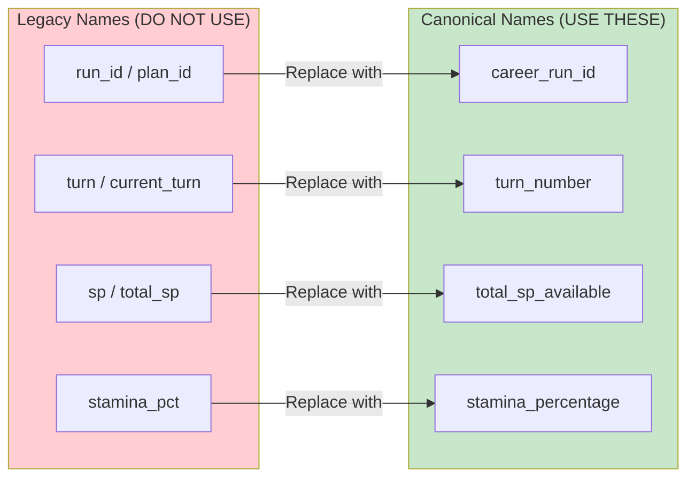

| Legacy Name | Canonical Name | Context |
|-------------|----------------|---------|
| `run_id`, `plan_id` | `career_run_id` | Foreign key references |
| `turn`, `current_turn` | `turn_number` | In history/progress tables |
| `sp`, `total_sp` | `total_sp_available` | SP tracking |
| `stamina_pct` | `stamina_percentage` | Stamina tracking |

### 5.2 Naming Convention Rules

1. **Tables:** Plural, snake_case (e.g., `career_runs`, `skill_career_runs`)
2. **Columns:** Singular, snake_case (e.g., `turn_number`, `sp_cost`)
3. **Foreign Keys:** `{singular_table}_id` (e.g., `career_run_id`, `skill_id`)
4. **Timestamps:** `created_at`, `updated_at`, `deleted_at`
5. **Booleans:** Positive form (e.g., `completed`, not `is_completed`)

---

## 6. Data Relationships

### 6.1 Relationship Diagram

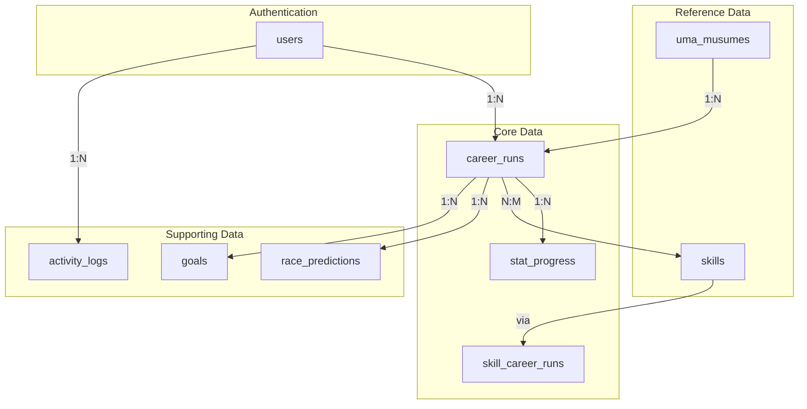

### 6.2 Relationship Summary

| Relationship | Type | Description |
|--------------|------|-------------|
| User → CareerRuns | One-to-Many | User owns multiple plans |
| UmaMusume → CareerRuns | One-to-Many | Character featured in plans |
| CareerRun → StatProgress | One-to-Many | Turn-by-turn history |
| CareerRun ↔ Skills | Many-to-Many | Skills attached to plans |
| CareerRun → RacePredictions | One-to-Many | Race predictions per plan |
| CareerRun → Goals | One-to-Many | Goals per plan |
| User → ActivityLogs | One-to-Many | User activity audit |

### 6.3 Cascade Rules

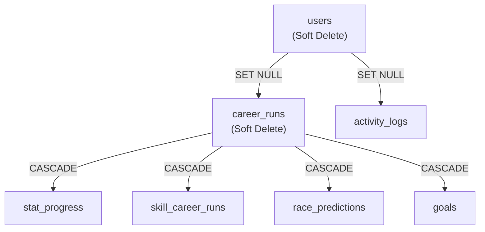

| Parent | Child | On Delete |
|--------|-------|-----------|
| `career_runs` | `stat_progress` | CASCADE |
| `career_runs` | `skill_career_runs` | CASCADE |
| `career_runs` | `race_predictions` | CASCADE |
| `career_runs` | `goals` | CASCADE |
| `users` | `career_runs` | SET NULL |
| `users` | `activity_logs` | SET NULL |
| `uma_musumes` | `career_runs` | RESTRICT |
| `skills` | `skill_career_runs` | RESTRICT |

---

## Document History

| Version | Date | Author | Changes |
|---------|------|--------|---------|
| 1.0 | 2026-01-03 | Development Team | Initial draft |
| 2.0 | 2026-01-03 | Development Team | Added Mermaid diagrams, expanded documentation |
