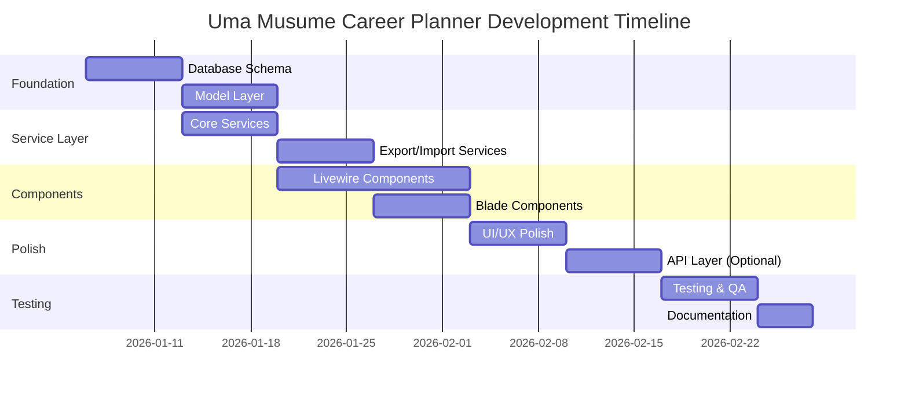

# D01 - System Development Plan

## Uma Musume Career Planner

**Document Version:** 2.0
**Date:** 2026-01-03
**Status:** Active

---

## 1. Executive Summary

This System Development Plan outlines the approach for consolidating five legacy Uma Musume tracking
applications into a unified, feature-rich platform called the **Uma Musume Career Planner**. The
system enables players of Uma Musume: Pretty Derby to track, manage, and analyze their career
progression through a modern web application built on Laravel 12+, Livewire 3, Alpine.js, and
TailwindCSS v4.

### 1.1 Project Objectives

- Consolidate features from six application versions into a single platform
- Implement dual storage modes (Local/Account) for flexible user experience
- Achieve WCAG AA accessibility compliance
- Deliver a responsive, mobile-first design with dark mode support
- Provide comprehensive data import/export capabilities

### 1.2 Source Applications

| Application | Stack | Key Features |
| --- | --- | --- |
| uma_musume_race_planner | PHP + MySQL + Bootstrap | Most feature-complete |
| umamusume-tracker | Laravel 12 + React | Best API design |
| uma-tracker | Laravel 11 + Blade | Closest to target stack |
| uma-run-tracker | Static HTML + JS | Best accessibility |
| uma-tracker-form | Native PHP + MVC | Simplest implementation |
| uma-musume-planner-laravel | Laravel | Target repository |

---

## 2. Project Scope

### 2.1 MVP Scope (P0 + P1)

The MVP implements Requirements 1-79, covering:

- Core functionality including dual storage modes
- Plan CRUD operations (Create, Read, Update, Delete)
- All editor tabs (General, Attributes, Aptitudes, Skills, Race Predictions, Goals, Turns)
- Export/Import functionality
- Accessibility compliance (WCAG AA)
- E2E testing with Playwright

### 2.2 Post-MVP Scope (P2/P3)

Requirements 80-87 are tracked separately:

- Optional authentication and cloud sync
- Scheduled backups
- Skill presets
- Visual regression testing
- Event logging and metrics
- Demo mode
- Game mode support (Champions Meeting)

### 2.3 Out of Scope

- Native mobile applications
- Real-time multiplayer features
- Integration with game servers
- Machine learning recommendations

---

## 3. Technology Stack

### 3.1 Backend

| Component | Technology | Version |
| --- | --- | --- |
| Framework | Laravel | 12+ |
| Frontend Reactivity | Livewire | 3 |
| PHP Version | PHP | 8.2+ |
| Database | MySQL/MariaDB/SQLite | - |

### 3.2 Frontend

| Component | Technology | Version |
| --- | --- | --- |
| Client Interactivity | Alpine.js | Latest |
| Styling | TailwindCSS | v4 |
| Build Tool | Vite | Latest |

### 3.3 Testing

| Type | Tool |
| --- | --- |
| Backend Unit/Feature | Pest |
| JavaScript Unit | Vitest |
| E2E | Playwright |
| Accessibility | axe-core |

### 3.4 Storage

| Mode | Technology |
| --- | --- |
| Local Runs (MVP) | localStorage |
| Local Runs (Target) | IndexedDB via localforage |
| Account Runs | MySQL/MariaDB/SQLite |

---

## 4. Development Phases

### Phase 1: Foundation (Week 1-2)

**Objectives:**

- Database schema consolidation
- Model layer implementation
- Enums and constants definition

**Key Deliverables:**

- Unified database migrations
- Eloquent models with relationships
- Schema canonicalization verification

**Tasks:**

- [ ] 1.1 Database Schema Consolidation
- [ ] 1.2 Model Layer
- [ ] 1.3 Enums and Constants

### Phase 2: Service Layer (Week 2-3)

**Objectives:**

- Core business logic services
- Export/Import adapters
- Authentication and local data management

**Key Deliverables:**

- Service classes for all domain operations
- Import format adapters
- LocalRunStorageService

**Tasks:**

- [ ] 2.1 Core Services
- [ ] 2.2 Export Services
- [ ] 2.3 Import Services
- [ ] 2B.1 Optional Authentication
- [ ] 2B.2 Local Data Management
- [ ] 2B.3 Convert Local Runs to Account

### Phase 3: Livewire Components (Week 3-5)

**Objectives:**

- Dashboard components
- Character and Career Run management
- Stats, Skills, and Racing components

**Key Deliverables:**

- All Livewire components
- Dual editing modes (Inline/Fullscreen)
- Accessible autocomplete

**Tasks:**

- [ ] 3.1 Dashboard Components
- [ ] 3.2 Character Components
- [ ] 3.3 Career Run Components
- [ ] 3.4 Stats Components
- [ ] 3.5 Skills Components
- [ ] 3.6 Export/Import Components

### Phase 4: Blade Components (Week 4-5)

**Objectives:**

- Reusable UI components
- Uma-specific components
- Layout components

**Key Deliverables:**

- Form components
- Stat visualization components
- Layout templates

### Phase 5: UI/UX Polish (Week 5-6)

**Objectives:**

- Theming (Dark/Light mode)
- Accessibility compliance
- Responsive design
- Animations

**Key Deliverables:**

- WCAG AA compliant interface
- Responsive layouts (320px-2560px)
- Reduced motion support

### Phase 6: API Layer (Week 6-7) - Optional

**Objectives:**

- RESTful API endpoints
- API authentication
- API documentation

### Phase 7: Testing (Week 7-8)

**Objectives:**

- Unit test coverage >80%
- Feature test coverage >80%
- E2E test suite
- Accessibility testing

**Key Deliverables:**

- Comprehensive test suite
- Playwright E2E tests
- axe-core accessibility reports

### Phase 8: Documentation & Deployment (Week 8)

**Objectives:**

- Documentation completion
- Data migration execution
- Production deployment

---

## 5. Project Timeline

### 5.1 Gantt Chart (ASCII)

```text
Week 1-2:   ████████ Phase 1: Foundation
Week 2-3:  ████████ Phase 2: Service Layer
Week 3-5:  ████████████████ Phase 3: Livewire Components
Week 4-5:  ████████ Phase 4: Blade Components
Week 5-6:  ████████ Phase 5: UI/UX Polish
Week 6-7:  ████████ Phase 6: API Layer (Optional)
Week 7-8:  ████████ Phase 7: Testing
Week 8:    ████ Phase 8: Documentation & Deployment
```text

### 5.2 Gantt Chart (Mermaid)



---

## 6. Team Structure & Responsibilities

### 6.1 Roles

| Role | Responsibilities |
| --- | --- |
| Project Lead | Overall coordination, stakeholder communication |
| Backend Developer | Laravel, Livewire, database, services |
| Frontend Developer | Alpine.js, TailwindCSS, Blade components |
| QA Engineer | Testing, accessibility verification |
| DevOps | CI/CD, deployment, monitoring |

---

## 7. Development Standards

### 7.1 Coding Standards

- PSR-12 for PHP code
- ESLint for JavaScript
- Prettier for formatting

### 7.2 Git Workflow

- Feature branches from `main`
- Pull requests require review
- Squash merge to main
- Semantic versioning for releases

### 7.3 Definition of Done

Each task is complete when:

- [ ] Code follows PSR-12 standards
- [ ] Unit/feature tests pass with >80% coverage
- [ ] All interactive elements have `data-testid` attributes
- [ ] Playwright E2E coverage exists for key actions
- [ ] axe-core accessibility scan passes
- [ ] Code follows Livewire 3 + Alpine.js best practices
- [ ] TailwindCSS classes use design tokens
- [ ] Documentation is updated
- [ ] Works in both dark and light modes
- [ ] Responsive on mobile devices

---

## 8. Risk Management

### 8.1 Identified Risks

| Risk | Probability | Impact | Mitigation |
| --- | --- | --- | --- |
| localStorage quota limits | Medium | High | Implement quota warnings, plan IndexedDB migration |
| Legacy data incompatibility | Medium | Medium | Version exports, implement migration adapters |
| Accessibility regression | Low | High | Automated axe-core tests in CI |
| Performance degradation | Low | Medium | Lazy loading, virtualization for large lists |
| Browser compatibility | Low | Low | Target modern browsers, progressive enhancement |

### 8.2 Risk Matrix (Mermaid)

```mermaid
quadrantChart
    title Risk Assessment Matrix
    x-axis Low Probability --> High Probability
    y-axis Low Impact --> High Impact
    quadrant-1 Monitor
    quadrant-2 Critical
    quadrant-3 Low Priority
    quadrant-4 Moderate
    localStorage quota: [0.5, 0.8]
    Legacy data: [0.5, 0.5]
    Accessibility: [0.2, 0.8]
    Performance: [0.3, 0.5]
    Browser compat: [0.2, 0.3]
```text

### 8.3 Contingency Plans

1. **Storage Migration**: If localStorage proves insufficient, accelerate IndexedDB migration
2. **Data Import Failures**: Provide manual data entry as fallback
3. **Performance Issues**: Implement server-side pagination earlier than planned

---

## 9. Quality Assurance

### 9.1 Testing Strategy

| Test Type | Tool | Coverage Target |
|-----------|------|-----------------|
| Unit Tests | Pest | 90%+ |
| Feature Tests | Pest | 80%+ |
| E2E Tests | Playwright | Critical paths 100% |
| Accessibility | axe-core | WCAG AA 100% |
| Visual Regression | Playwright | Key pages |

### 9.2 Critical User Flows

1. Create character → upload image → save
2. Create run via quick create → add stat turns → chart renders
3. Add skill via autocomplete → keyboard navigate → set status + turn acquired
4. Export Excel/CSV/Markdown with preview
5. Import JSON → preview → confirm → verify data
6. Dark mode toggle → refresh → persists
7. Convert local run to account after login

### 9.3 Testing Flow (Mermaid)

```mermaid
flowchart LR
    A[Unit Tests] --> B[Feature Tests]
    B --> C[Integration Tests]
    C --> D[E2E Tests]
    D --> E[Accessibility Tests]
    E --> F[Visual Regression]
    F --> G[UAT]
    G --> H[Production]
```text

---

## 10. Deployment Strategy

### 10.1 Environments

| Environment | Purpose |
|-------------|---------|
| Development | Local development |
| Staging | Pre-production testing |
| Production | Live application |

### 10.2 Deployment Pipeline (Mermaid)

```mermaid
flowchart TD
    A[Code Push] --> B[CI Pipeline]
    B --> C{Tests Pass?}
    C -->|Yes| D[Build Assets]
    C -->|No| E[Notify Developer]
    D --> F[Deploy to Staging]
    F --> G{UAT Pass?}
    G -->|Yes| H[Deploy to Production]
    G -->|No| E
    H --> I[Health Check]
    I --> J[Monitor]
```text

### 10.3 Deployment Checklist

- [ ] Database migrations executed
- [ ] Environment variables configured
- [ ] Cache cleared and rebuilt
- [ ] Assets compiled
- [ ] Health checks passing
- [ ] Monitoring configured

---

## 11. Success Criteria

### 11.1 MVP Launch Criteria

- [ ] All P0 requirements implemented
- [ ] Selected P1 requirements implemented
- [ ] E2E tests pass for critical flows
- [ ] WCAG AA compliance verified
- [ ] Performance targets met (FCP < 1.5s, TTI < 3s)
- [ ] Documentation complete

### 11.2 Key Performance Indicators

| Metric | Target |
|--------|--------|
| Page Load Time | < 2 seconds |
| First Contentful Paint | < 1.5 seconds |
| Time to Interactive | < 3 seconds |
| Accessibility Score | 100% WCAG AA |
| Test Coverage | > 80% |

---

## 12. Appendices

### 12.1 Related Documents

- D02_Business_Requirements_Specifications
- D03_System_Requirements_Specifications
- D04_System_Design_Specifications
- D05_Data_Migration_Plan
- D09_Database_Documentation

### 12.2 Canonical Field Names Reference

| Entity | Canonical Fields |
|--------|------------------|
| CareerRun | `career_run_id`, `total_sp_available`, `stamina_percentage`, `current_turn` |
| StatProgress | `career_run_id`, `turn_number` |
| SkillCareerRun | `career_run_id`, `skill_id`, `status`, `turn_acquired` |

### 12.3 Revision History

| Version | Date | Author | Changes |
|---------|------|--------|---------|
| 1.0 | 2026-01-03 | System | Initial draft |
| 2.0 | 2026-01-03 | System | Added Mermaid diagrams, updated structure |
