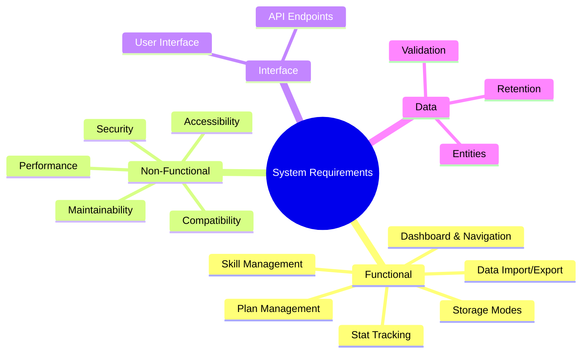
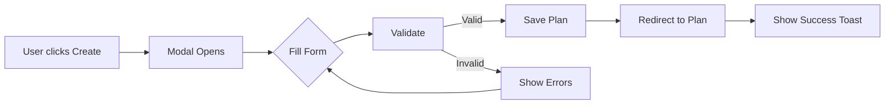
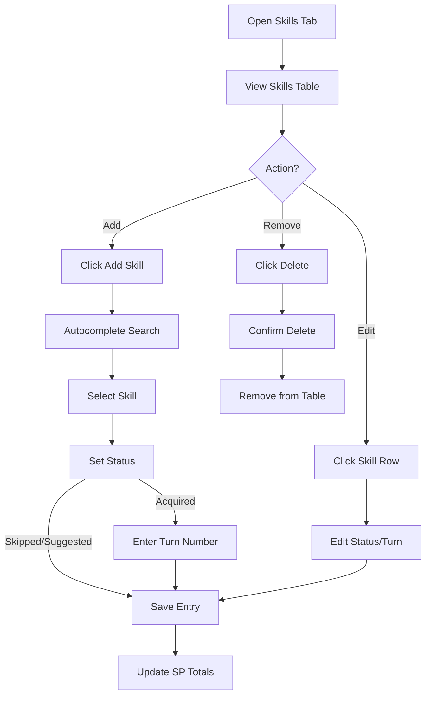
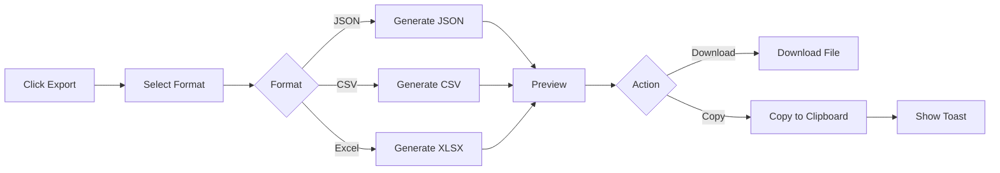
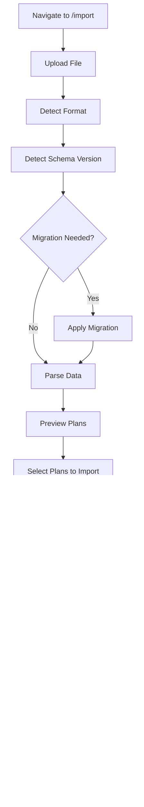
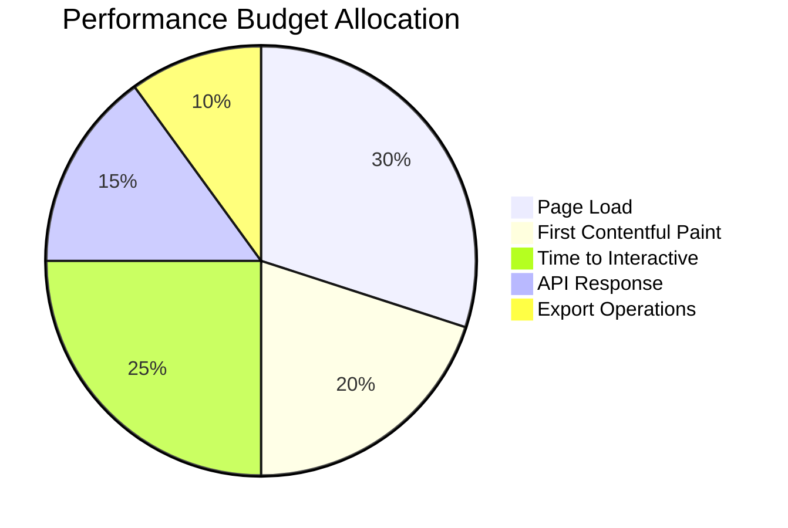
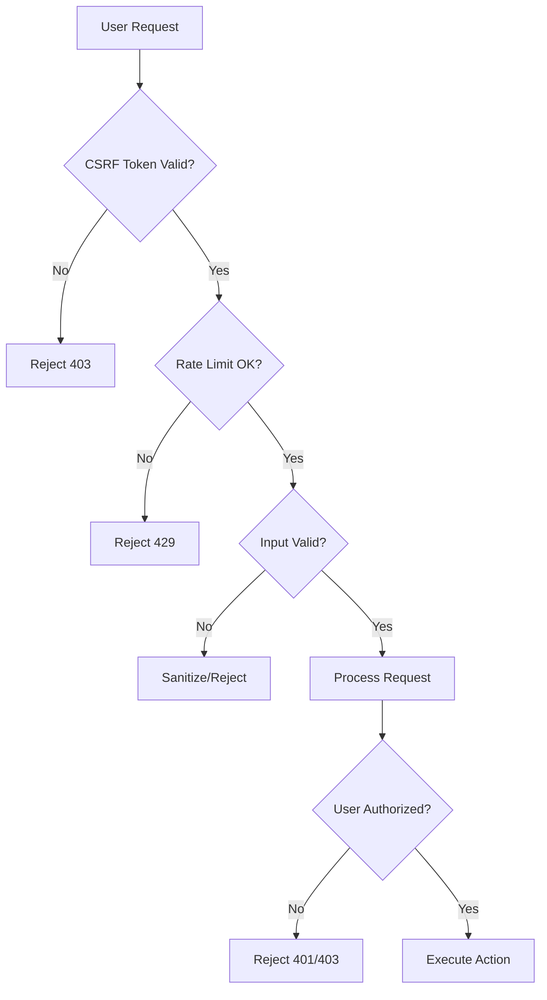
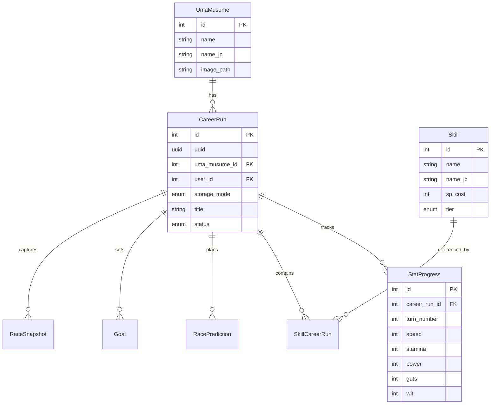
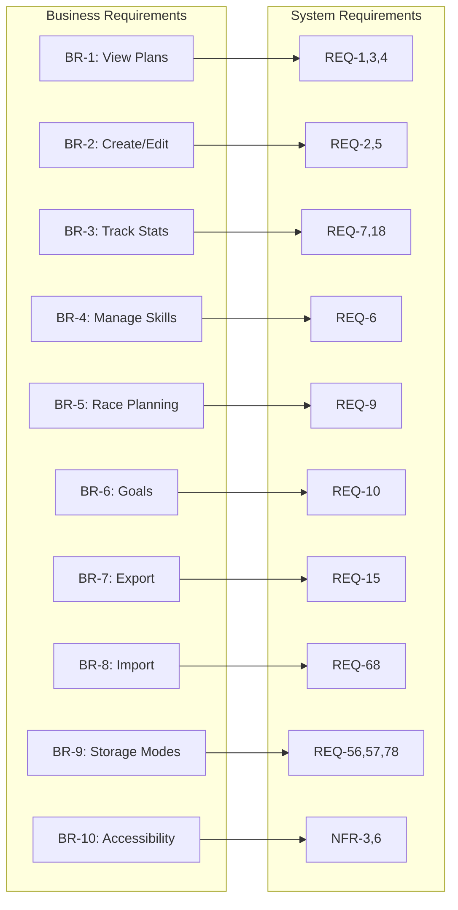

# D03 - System Requirements Specifications

## Uma Musume Career Planner

**Document Version:** 2.0
**Date:** 2026-01-03
**Status:** Active
**Last Updated:** 2026-01-03

---

## Table of Contents

1. [Introduction](#1-introduction)
2. [Functional Requirements](#2-functional-requirements)
3. [Non-Functional Requirements](#3-non-functional-requirements)
4. [Interface Requirements](#4-interface-requirements)
5. [Data Requirements](#5-data-requirements)
6. [System Constraints](#6-system-constraints)
7. [Traceability Matrix](#7-traceability-matrix)
8. [Appendices](#8-appendices)

---

## 1. Introduction

### 1.1 Purpose

This document provides detailed system requirements for the Uma Musume Career Planner application. It translates business requirements into specific, testable technical requirements.

### 1.2 Scope

This specification covers:

- Functional requirements for all system features
- Non-functional requirements (performance, security, accessibility)
- Interface requirements
- Data requirements

### 1.3 Requirement Priorities

| Priority | Description |
| --- | --- |
| P0 (Critical) | Core functionality required for MVP launch |
| P1 (High) | Important features for complete user experience |
| P2 (Medium) | Enhanced features for power users |
| P3 (Low) | Future enhancements |

### 1.4 Requirements Overview



**ASCII Diagram:**

```text
                    ┌─────────────────────────────────────┐
                    │       SYSTEM REQUIREMENTS           │
                    └─────────────────┬───────────────────┘
           ┌──────────────┬───────────┴───────────┬──────────────┐
           ▼              ▼                       ▼              ▼
    ┌─────────────┐ ┌─────────────┐       ┌─────────────┐ ┌─────────────┐
    │ Functional  │ │Non-Functional│       │  Interface  │ │    Data     │
    └──────┬──────┘ └──────┬──────┘       └──────┬──────┘ └──────┬──────┘
           │               │                     │               │
    ┌──────┴──────┐ ┌──────┴──────┐       ┌──────┴──────┐ ┌──────┴──────┐
    │• Dashboard  │ │• Performance│       │• UI Comps   │ │• Entities   │
    │• Plans      │ │• Security   │       │• API        │ │• Validation │
    │• Skills     │ │• A11y       │       │             │ │• Retention  │
    │• Stats      │ │• Compat     │       │             │ │             │
    │• Import/Exp │ │• Maintain   │       │             │ │             │
    │• Storage    │ │             │       │             │ │             │
    └─────────────┘ └─────────────┘       └─────────────┘ └─────────────┘
```

---

## 2. Functional Requirements

### 2.1 Dashboard Navigation and Overview [REQ-1] - P0

**Description:** Main landing page with plan overview and quick access.

| ID | Requirement | Acceptance Criteria |
| -- | ----------- | ------------------- |
| REQ-1.1 | Display header banner with app branding | Banner visible on dashboard load |
| REQ-1.2 | Display aggregate statistics (total, active, completed plans) | Stats panel shows correct counts |
| REQ-1.3 | Display all plans with title, character, status | Plan list renders all existing plans |
| REQ-1.4 | Display recent activity log | Activity entries show in reverse chronological order |
| REQ-1.5 | Provide visible "Create Plan" button | Button accessible and prominent |
| REQ-1.6 | Responsive single-column layout on mobile | Layout adapts below 768px |

### 2.2 Plan Creation Flow [REQ-2] - P0

**Description:** Quick plan creation with minimal friction.



**ASCII Diagram:**

```text
User clicks "Create Plan"
         │
         ▼
┌─────────────────────┐
│ Quick Create Modal  │
│ Opens               │
└──────────┬──────────┘
           │
           ▼
┌─────────────────────┐
│ User fills form:    │
│ • Title (required)  │
│ • Character         │
│ • Storage Mode      │
└──────────┬──────────┘
           │
           ▼
    ┌──────┴──────┐
    │  Validate   │
    └──────┬──────┘
     Valid │ Invalid
    ┌──────┴──────┐
    ▼             ▼
┌───────┐   ┌─────────┐
│ Save  │   │ Show    │
│ Plan  │   │ Errors  │
└───┬───┘   └────┬────┘
    │            │
    ▼            └──► (back to form)
┌─────────────────────┐
│ Redirect to Plan    │
│ Show Success Toast  │
└─────────────────────┘
```

| ID | Requirement | Acceptance Criteria |
| -- | ----------- | ------------------- |
| REQ-2.1 | Quick Create Modal opens on button click | Modal visible with form fields |
| REQ-2.2 | Pre-populate optional fields with defaults | Default values applied |
| REQ-2.3 | Redirect to plan details after creation | Navigation to correct route |
| REQ-2.4 | Validate empty plan title | Error message displayed |
| REQ-2.5 | Close modal on Escape or outside click | Modal dismisses without saving |
| REQ-2.6 | Display success notification on creation | Toast notification visible |

### 2.3 Plan List Interaction [REQ-3] - P0

**Description:** Browse, filter, and manage plans from list view.

| ID | Requirement | Acceptance Criteria |
| -- | ----------- | ------------------- |
| REQ-3.1 | Expand inline details on plan row click | Details panel visible |
| REQ-3.2 | Navigate to view mode via "View" button | Route: `/plans/{id}` or `/plans/local/{uuid}` |
| REQ-3.3 | Navigate to edit mode via "Edit" button | Route: `/plans/{id}/edit` or `/plans/local/{uuid}/edit` |
| REQ-3.4 | Confirm before deleting plan | Confirmation prompt shown |
| REQ-3.5 | Soft-delete and remove from list on confirm | Plan removed from view |
| REQ-3.6 | Display empty state when no plans | Call-to-action visible |

### 2.4 Plan Details Viewing [REQ-4] - P0

**Description:** Read-only view of complete plan details.

| ID | Requirement | Acceptance Criteria |
| -- | ----------- | ------------------- |
| REQ-4.1 | Display plan at `/plans/{id}` or `/plans/local/{uuid}` | Page renders in view mode |
| REQ-4.2 | Organize content into tabs | All tabs accessible |
| REQ-4.3 | Display general info (title, character, career stage, mood, conditions) | All fields visible |
| REQ-4.4 | Display stats with visual bars (max 1200) | Stats render with colors |
| REQ-4.5 | Display skills with SP cost, tier, status | Skills table populated |
| REQ-4.6 | Provide navigation back to dashboard | Back link functional |

### 2.5 Plan Details Editing [REQ-5] - P0

**Description:** Comprehensive form for plan modifications.

| ID | Requirement | Acceptance Criteria |
| -- | ----------- | ------------------- |
| REQ-5.1 | Display editable form at `/plans/{id}/edit` | Form fields editable |
| REQ-5.2 | Preserve state when switching tabs | Data not lost on tab change |
| REQ-5.3 | Track dirty state and warn before navigation | Warning prompt shown |
| REQ-5.4 | Validate all fields on save | Inline errors for invalid fields |
| REQ-5.5 | Display inline validation errors | Errors below respective fields |
| REQ-5.6 | Show success notification on save | Toast notification visible |

### 2.6 Skill Management [REQ-6] - P0

**Description:** Add, edit, and remove skills from plans.



| ID | Requirement | Acceptance Criteria |
| -- | ----------- | ------------------- |
| REQ-6.1 | Display skills table with columns | Table shows all skill data |
| REQ-6.2 | Add new skill row on button click | Empty row appended |
| REQ-6.3 | Autocomplete suggestions from skill database | Dropdown shows matches |
| REQ-6.4 | Three-state status selector | Acquired/Skipped/Suggested selectable |
| REQ-6.5 | Require turn_acquired when Acquired | Validation error if missing |
| REQ-6.6 | Remove skill on delete button click | Row removed from table |
| REQ-6.7 | Calculate and display SP totals | Totals update automatically |

### 2.7 Attribute and Stat Tracking [REQ-7] - P0

**Description:** Record and visualize stat progression.

| ID | Requirement | Acceptance Criteria |
| -- | ----------- | ------------------- |
| REQ-7.1 | Display all five stats with current values | Stats visible |
| REQ-7.2 | Validate stat range (0-1200 hard max) | Error for out-of-range |
| REQ-7.3 | Color-coded visual indicators | Correct colors applied |
| REQ-7.4 | Display growth rate percentages | Rates visible |
| REQ-7.5 | Reject values above 1200 | Validation error shown |
| REQ-7.6 | Calculate total stat sum | Calculation correct |

### 2.8 Aptitude Grade Management [REQ-8] - P0

**Description:** Track terrain, distance, and style aptitudes.

| ID | Requirement | Acceptance Criteria |
| -- | ----------- | ------------------- |
| REQ-8.1 | Display terrain grades (Turf, Dirt) | Grades visible |
| REQ-8.2 | Display distance grades (Sprint, Mile, Medium, Long) | Grades visible |
| REQ-8.3 | Display style grades (Nige, Senkou, Sashi, Oikomi) | Grades visible |
| REQ-8.4 | Dropdown with grades SS-G and percentages | All options available |
| REQ-8.5 | Game-accurate grade colors | Correct colors applied |

### 2.9 Race Predictions [REQ-9] - P1

**Description:** Plan race schedule and track predictions.

| ID | Requirement | Acceptance Criteria |
| -- | ----------- | ------------------- |
| REQ-9.1 | Display race prediction entries | List renders |
| REQ-9.2 | Capture race details (name, venue, distance, track) | All fields editable |
| REQ-9.3 | Support add/remove/reorder predictions | All actions functional |
| REQ-9.4 | Display recommended stamina thresholds | Thresholds shown |

### 2.10 Goals Management [REQ-10] - P1

**Description:** Set and track training goals.

| ID | Requirement | Acceptance Criteria |
| -- | ----------- | ------------------- |
| REQ-10.1 | Display goals list | Goals visible |
| REQ-10.2 | Add goal with description | Goal created |
| REQ-10.3 | Toggle completion status | Status updates |
| REQ-10.4 | Remove goal | Goal deleted |
| REQ-10.5 | Visual distinction for completed goals | Different styling |

### 2.11 Turn-by-Turn Tracking [REQ-18] - P0

**Description:** Log stats at each turn.

| ID | Requirement | Acceptance Criteria |
| -- | ----------- | ------------------- |
| REQ-18.1 | Display turn entries by career year | Organized list visible |
| REQ-18.2 | Add turn entry with next sequential number | Turn appended |
| REQ-18.3 | Edit all five stats per turn | Fields editable |
| REQ-18.4 | Validate stats within 0-1200 range | Validation active |
| REQ-18.5 | Delete turn with renumber option | Turn removed |
| REQ-18.6 | Highlight milestone turns | Visual distinction |

### 2.12 Dark Mode [REQ-12] - P0

**Description:** Theme toggle for user preference.

| ID | Requirement | Acceptance Criteria |
| -- | ----------- | ------------------- |
| REQ-12.1 | Visible toggle in navbar | Toggle accessible |
| REQ-12.2 | Immediate theme switch | No page reload |
| REQ-12.3 | Persist preference to localStorage | Preference saved |
| REQ-12.4 | Restore preference on load | Preference applied |
| REQ-12.5 | Meet WCAG AA contrast in dark mode | Contrast verified |

### 2.13 Data Export [REQ-15] - P0

**Description:** Export plan data in multiple formats.



| ID | Requirement | Acceptance Criteria |
| -- | ----------- | ------------------- |
| REQ-15.1 | Export action button on plan view | Button visible |
| REQ-15.2 | Generate downloadable file | Download triggers |
| REQ-15.3 | Include all plan data in export | Complete data exported |
| REQ-15.4 | Include schema_version in exports | Version field present |

### 2.14 Import Wizard [REQ-68] - P1

**Description:** Guided import of external data.



| ID | Requirement | Acceptance Criteria |
| -- | ----------- | ------------------- |
| REQ-68.1 | Import page at `/import` | Page accessible |
| REQ-68.2 | File upload with format detection | Format identified |
| REQ-68.3 | Schema version detection and migration | Migration applied |
| REQ-68.4 | Preview importable plans | Preview visible |
| REQ-68.5 | Selective import option | Checkboxes functional |
| REQ-68.6 | Conflict resolution options | Skip/Overwrite/Copy available |
| REQ-68.7 | Import target selection (Local/Account) | Option available |
| REQ-68.8 | Results report on completion | Report displayed |

### 2.15 Local Storage Mode [REQ-56] - P0

**Description:** Browser-based storage for offline use.

```mermaid
flowchart TD
    A[User Action] --> B{Authenticated?}
    B -->|No| C[Local Mode Only]
    B -->|Yes| D{Choose Mode}
    D -->|Local| E[Store in localStorage]
    D -->|Account| F[Store in Database]
    C --> E
    E --> G[UUID-based Routes]
    F --> H[ID-based Routes]
    G --> I[/plans/local/uuid]
    H --> J[/plans/id]
```

**ASCII Diagram:**

```text
┌─────────────────────────────────────────────────────────────────┐
│                     Storage Mode Decision                        │
├─────────────────────────────────────────────────────────────────┤
│   User Authenticated?                                            │
│         │                                                        │
│    ┌────┴────┐                                                   │
│    │         │                                                   │
│   No        Yes                                                  │
│    │         │                                                   │
│    ▼         ▼                                                   │
│ Local_Run  Choose Mode                                           │
│ (localStorage)  │                                                │
│              ┌──┴──┐                                             │
│              │     │                                             │
│           Local  Account                                         │
│              │     │                                             │
│              ▼     ▼                                             │
│         localStorage  Database                                   │
└─────────────────────────────────────────────────────────────────┘
```

| ID | Requirement | Acceptance Criteria |
| -- | ----------- | ------------------- |
| REQ-56.1 | Support Local and Account storage modes | Both modes functional |
| REQ-56.2 | Create Local runs for unauthenticated users | Runs created in localStorage |
| REQ-56.3 | Allow authenticated users to choose storage mode | Option in create modal |
| REQ-56.4 | Display storage mode badge on plan cards | Badge visible |
| REQ-56.5 | Indicate "Stored locally" on Local runs | Indicator visible |
| REQ-56.6 | Disable editing for Account runs when offline | Edit disabled |
| REQ-56.7 | Offer "Claim Plans" flow on login | Modal appears |
| REQ-56.8 | Support Move or Keep local copy | Options available |
| REQ-56.9 | Export Local runs to JSON | Export functional |
| REQ-56.10 | Full offline functionality for Local runs | All operations work |
| REQ-56.11 | Versioned schema for local storage | Version field present |

### 2.16 Local Data Management [REQ-56B] - P1

**Description:** Interface for managing local data.

| ID | Requirement | Acceptance Criteria |
| -- | ----------- | ------------------- |
| REQ-56B.1 | Access from Dashboard or navigation | Entry point visible |
| REQ-56B.2 | Display all Local runs with storage info | List with sizes |
| REQ-56B.3 | Export All action | JSON file generated |
| REQ-56B.4 | Import action with conflict resolution | Import works |
| REQ-56B.5 | Purge All with double-confirmation | Confirmation required |
| REQ-56B.6 | Convert All to Account (authenticated) | Bulk conversion works |
| REQ-56B.7 | Display storage statistics | Stats visible |
| REQ-56B.8 | Selective export | Checkboxes functional |

### 2.17 Draft Auto-Save [REQ-57] - P0

**Description:** Automatic preservation of unsaved work.

| ID | Requirement | Acceptance Criteria |
| -- | ----------- | ------------------- |
| REQ-57.1 | Auto-save to localStorage every 30 seconds | Drafts saved |
| REQ-57.2 | Display "Restore Draft" modal on return | Modal appears |
| REQ-57.3 | Provide "Discard Draft" action | Draft cleared |
| REQ-57.4 | Maintain last 3 draft versions | Timeline available |
| REQ-57.5 | Prompt for drafts older than 7 days | Prompt shown |
| REQ-57.6 | Clear drafts after successful save | Drafts removed |

### 2.18 Connection State Management [REQ-78] - P0

**Description:** Handle Livewire connection issues gracefully.

| ID | Requirement | Acceptance Criteria |
| -- | ----------- | ------------------- |
| REQ-78.1 | Display "Connection Lost" banner | Banner visible |
| REQ-78.2 | Auto-retry every 5 seconds (max 5 attempts) | Retry behavior |
| REQ-78.3 | Display "Reconnected" on success | Message shown |
| REQ-78.4 | Disable save for Account runs when offline | Save disabled |
| REQ-78.5 | Preserve draft in localStorage during disconnect | Draft saved |
| REQ-78.6 | Prompt to save on reconnection | Prompt shown |
| REQ-78.7 | Offer "Retry Now" and "Work Offline" options | Options available |

---

## 3. Non-Functional Requirements

### 3.1 Performance Requirements [NFR-1]



| ID | Requirement | Target |
| -- | ----------- | ------ |
| NFR-1.1 | Page load time | < 2 seconds |
| NFR-1.2 | First Contentful Paint | < 1.5 seconds |
| NFR-1.3 | Time to Interactive | < 3 seconds |
| NFR-1.4 | Largest Contentful Paint | < 2.5 seconds |
| NFR-1.5 | Autocomplete response time | < 200ms |
| NFR-1.6 | Export 50k rows | < 60 seconds |

### 3.2 Security Requirements [NFR-2]



| ID | Requirement |
| -- | ----------- |
| NFR-2.1 | CSRF protection on all form submissions |
| NFR-2.2 | Image upload content-type sniffing validation |
| NFR-2.3 | Image upload size limit (2MB max) |
| NFR-2.4 | XSS prevention through input sanitization |
| NFR-2.5 | Rate limiting (100 requests/minute per IP) |
| NFR-2.6 | Per-user data isolation for Account runs |

### 3.3 Accessibility Requirements [NFR-3]

| ID | Requirement | WCAG Reference |
| -- | ----------- | -------------- |
| NFR-3.1 | Alt text for all images | 1.1.1 |
| NFR-3.2 | Color info available via text | 1.4.1 |
| NFR-3.3 | Skip-to-main link | 2.4.1 |
| NFR-3.4 | Semantic HTML elements | 4.1.2 |
| NFR-3.5 | 4.5:1 contrast ratio for normal text | 1.4.3 |
| NFR-3.6 | 400% zoom reflow support | 1.4.10 |
| NFR-3.7 | Focus always visible | 2.4.7 |
| NFR-3.8 | Keyboard navigation for all elements | 2.1.1 |
| NFR-3.9 | Focus trap for modals | 2.4.3 |
| NFR-3.10 | Reduced motion support | 2.3.3 |

### 3.4 Compatibility Requirements [NFR-4]

| ID | Requirement |
| -- | ----------- |
| NFR-4.1 | PHP 8.2+ support |
| NFR-4.2 | MySQL/MariaDB/SQLite database support |
| NFR-4.3 | Chrome (last 2 versions) |
| NFR-4.4 | Firefox (last 2 versions) |
| NFR-4.5 | Safari (last 2 versions) |
| NFR-4.6 | Edge (last 2 versions) |
| NFR-4.7 | iOS Safari support |
| NFR-4.8 | Chrome Android support |

### 3.5 Maintainability Requirements [NFR-5]

| ID | Requirement |
| -- | ----------- |
| NFR-5.1 | PSR-12 coding standards |
| NFR-5.2 | Test coverage > 80% |
| NFR-5.3 | Documentation for public APIs |
| NFR-5.4 | data-testid attributes on interactive elements |
| NFR-5.5 | Consistent naming: `data-testid="[component]-[action]-[context]"` |

### 3.6 Responsive Design Requirements [NFR-6]

| ID | Requirement | Breakpoint |
| -- | ----------- | ---------- |
| NFR-6.1 | Mobile layout | < 768px |
| NFR-6.2 | Hamburger menu navigation | < 768px |
| NFR-6.3 | Touch targets 44px minimum | All mobile |
| NFR-6.4 | Usable viewport range | 320px - 2560px |

---

## 4. Interface Requirements

### 4.1 User Interface Components

#### 4.1.1 Navigation

| Component | Description |
| --------- | ----------- |
| Navbar | App branding, navigation links, dark mode toggle, user menu |
| Sidebar | (Optional) Secondary navigation |
| Breadcrumbs | Dashboard > Plans > Plan Name |

#### 4.1.2 Forms

| Component | Description |
| --------- | ----------- |
| Input | Text input with label and validation |
| Select | Dropdown selector |
| Textarea | Multi-line text input |
| Checkbox | Boolean toggle |
| File Upload | Image upload with preview |

#### 4.1.3 Display Components

| Component | Description |
| --------- | ----------- |
| Plan Card | Plan summary with actions |
| Stat Bar | Visual stat indicator with color |
| Circular Progress | Game-inspired stat display |
| Skill Badge | Skill status indicator |
| Storage Badge | Local/Account indicator |
| Toast | Notification messages |

### 4.2 API Interfaces (Optional)

```mermaid
flowchart LR
    subgraph Client
        A[Browser/App]
    end
    subgraph API
        B[/api/v1/plans]
        C[/api/v1/autosuggest/skills]
        D[/api/v1/plans/export]
    end
    subgraph Backend
        E[(Database)]
    end
    A -->|GET/POST/PUT/DELETE| B
    A -->|GET| C
    A -->|GET| D
    B --> E
    C --> E
    D --> E
```

| Endpoint | Method | Description |
| -------- | ------ | ----------- |
| /api/v1/plans | GET | List plans |
| /api/v1/plans | POST | Create plan |
| /api/v1/plans/{id} | GET | Get plan |
| /api/v1/plans/{id} | PUT | Update plan |
| /api/v1/plans/{id} | DELETE | Delete plan |
| /api/v1/plans/import | POST | Import plans |
| /api/v1/plans/export | GET | Export plans |
| /api/v1/autosuggest/skills | GET | Search skills |
| /api/v1/autosuggest/characters | GET | Search characters |

---

## 5. Data Requirements

### 5.1 Data Entities



**ASCII Diagram:**

```text
┌─────────────────┐       ┌─────────────────┐
│   UmaMusume     │       │     Skill       │
├─────────────────┤       ├─────────────────┤
│ id              │       │ id              │
│ name            │       │ name            │
│ name_jp         │       │ name_jp         │
│ image_path      │       │ sp_cost         │
│ aptitude_*      │       │ tier            │
│ growth_*        │       │ type            │
└────────┬────────┘       └────────┬────────┘
         │                         │
         │ 1:N                     │ N:M
         ▼                         │
┌─────────────────────┐            │
│     CareerRun       │◄───────────┘
├─────────────────────┤     (via SkillCareerRun)
│ id                  │
│ uuid                │
│ uma_musume_id       │
│ user_id (nullable)  │
│ storage_mode        │
│ title               │
│ status              │
│ total_sp_available  │
│ stamina_percentage  │
└────────┬────────────┘
         │
    ┌────┴────┬───────┬────────┐
    │         │       │        │
    ▼         ▼       ▼        ▼
┌───────────┐ ┌─────────────┐ ┌─────────┐
│StatProgress│ │SkillCareerRun│ │  Goal   │
└───────────┘ └─────────────┘ └─────────┘
```

| Entity | Description |
| ------ | ----------- |
| UmaMusume | Character records |
| CareerRun | Career run tracking |
| StatProgress | Turn-by-turn stats |
| Skill | Skill reference data |
| SkillCareerRun | Skill acquisition records |
| RacePrediction | Race planning entries |
| Goal | Training objectives |
| RaceSnapshot | Race-day captures |
| ActivityLog | User action history |

### 5.2 Data Validation Rules

| Field | Rule |
| ----- | ---- |
| plan.title | Required, max 255 characters |
| plan.status | Enum: in_progress, completed, archived |
| plan.career_stage | Enum: junior, classic, senior |
| stat.* | Integer, 0-1200 (hard max) |
| skill.status | Enum: acquired, skipped, suggested |
| skill.turn_acquired | Required if status=acquired, 1-78 |
| energy | Integer, 0-100 |

### 5.3 Data Retention

| Data Type | Retention |
| --------- | --------- |
| Local runs | Until user clears or browser storage cleared |
| Account runs | Until user deletes (30-day soft delete recovery) |
| Drafts | 7 days |
| Activity logs | Indefinite |

---

## 6. System Constraints

### 6.1 Technical Constraints

1. localStorage limit approximately 5-10MB per domain
2. Livewire requires PHP server for Account operations
3. Real-time sync not supported (no WebSocket)
4. No native mobile app (web-only)

### 6.2 Business Constraints

1. English primary interface language
2. Japanese skill names as secondary
3. No integration with game servers
4. No user-to-user sharing in MVP

---

## 7. Traceability Matrix



| Business Req | System Req | Priority |
| ------------ | ---------- | -------- |
| BR-1 | REQ-1, REQ-3, REQ-4 | P0 |
| BR-2 | REQ-2, REQ-5 | P0 |
| BR-3 | REQ-7, REQ-18 | P0 |
| BR-4 | REQ-6, REQ-25 | P0 |
| BR-5 | REQ-9 | P1 |
| BR-6 | REQ-10 | P1 |
| BR-7 | REQ-15, REQ-22, REQ-24 | P0/P1 |
| BR-8 | REQ-68 | P1 |
| BR-9 | REQ-56, REQ-56B, REQ-57, REQ-78 | P0/P1 |
| BR-10 | REQ-12, REQ-14, NFR-3, NFR-6 | P0 |
| BR-11 | REQ-80 | P2 |

---

## 8. Appendices

### 8.1 Test Data Requirements

| Data Set | Purpose | Volume |
| -------- | ------- | ------ |
| Characters | Test character CRUD | 10 records |
| Career Runs | Test plan operations | 50 records |
| Skills | Test autocomplete | 500+ records |
| Turns | Test stat tracking | 78 per run |

### 8.2 Canonical Field Names Reference

| UI Label | Canonical Field | Table |
| -------- | --------------- | ----- |
| SP Balance | `total_sp_available` | career_runs |
| Stamina % | `stamina_percentage` | career_runs |
| Turn | `turn_number` | stat_progress |
| Current Turn | `current_turn` | career_runs |
| Plan ID | `career_run_id` | (foreign keys) |

### 8.3 Related Documents

- D01_System_Development_Plan
- D02_Business_Requirements_Specifications
- D04_System_Design_Specifications

### 8.4 Revision History

| Version | Date | Author | Changes |
| ------- | ---- | ------ | ------- |
| 1.0 | 2026-01-03 | System | Initial draft |
| 2.0 | 2026-01-03 | System | Added Mermaid diagrams, standardized formatting, added canonical field names reference |
