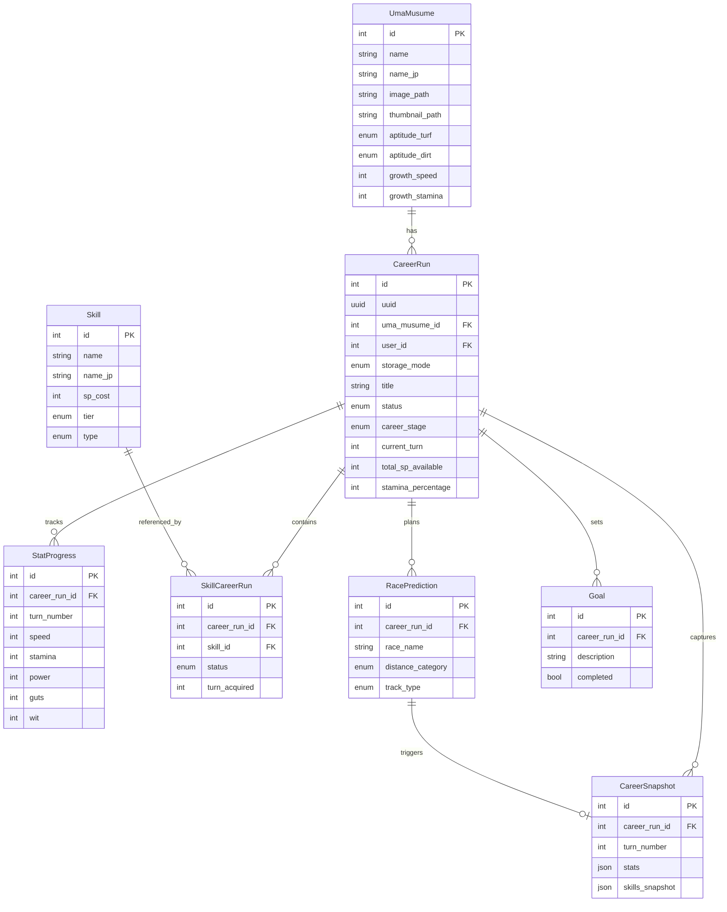
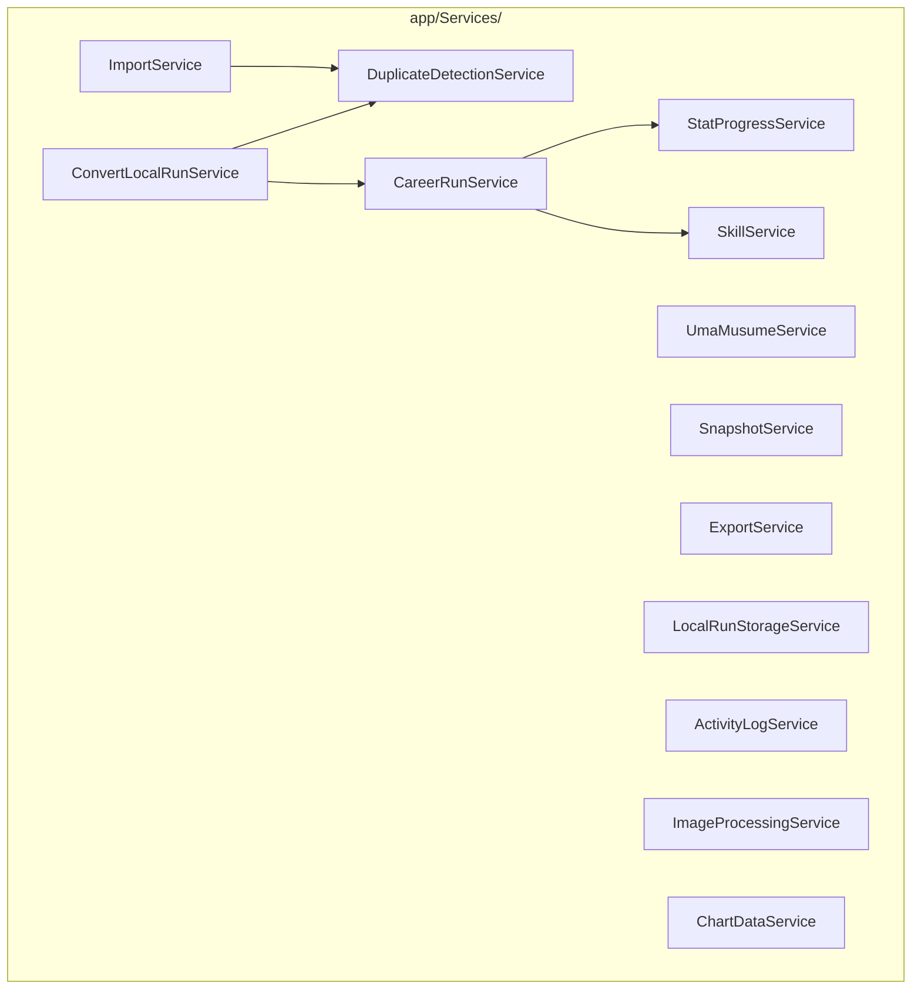

# D04 - System Design Specifications

## Uma Musume Career Planner

**Document Version:** 2.0
**Date:** 2026-01-03
**Status:** Active
**Last Updated:** 2026-01-03

---

## Table of Contents

1. [Introduction](#1-introduction)
2. [System Architecture](#2-system-architecture)
3. [Component Design](#3-component-design)
4. [Data Models](#4-data-models)
5. [Service Layer Design](#5-service-layer-design)
6. [UI/UX Design Specifications](#6-uiux-design-specifications)
7. [Data Flow Specifications](#7-data-flow-specifications)
8. [Appendices](#8-appendices)

---

## 1. Introduction

### 1.1 Purpose

This document provides detailed system design specifications for the Uma Musume Career Planner application. It describes the architecture, components, data models, and implementation patterns.

### 1.2 Scope

This specification covers:

- System architecture and technology stack
- Component design and hierarchy
- Data models and schemas
- Service layer design
- UI/UX specifications

### 1.3 Referenced Documents

- D01_System_Development_Plan
- D02_Business_Requirements_Specifications
- D03_System_Requirements_Specifications

---

## 2. System Architecture

### 2.1 Architecture Overview

```mermaid
flowchart TB
    subgraph Browser["Browser Layer"]
        Alpine["Alpine.js Components<br/>Dropdowns, Modals, Tabs"]
        LWClient["Livewire Client<br/>PlanList, PlanEditor"]
        LocalStorage["localStorage<br/>Local_Runs, Drafts, Prefs"]
    end
    
    subgraph Server["Laravel Backend"]
        LWServer["Livewire Server"]
        Services["Services Layer"]
        Models["Eloquent Models"]
    end
    
    subgraph Data["Data Layer"]
        DB[(MySQL/MariaDB/SQLite)]
    end
    
    Alpine <--> LWClient
    LWClient <--> LocalStorage
    LWClient <-->|Wire Protocol| LWServer
    LWServer --> Services
    Services --> Models
    Models --> DB
```text

**ASCII Diagram:**

```text
┌─────────────────────────────────────────────────────────────────┐
│                        Browser Layer                             │
├─────────────────────────────────────────────────────────────────┤
│  Alpine.js Components          │  Livewire Components           │
│  - Dropdowns, Modals           │  - PlanList, PlanEditor        │
│  - Tabs, Tooltips              │  - SkillsEditor, TurnsEditor   │
│  - Dark Mode Toggle            │  - Dashboard, CharacterList    │
│  - Client-side validation      │  - ImportWizard, ExportPreview │
├─────────────────────────────────────────────────────────────────┤
│                     localStorage Layer                           │
│  - Local_Runs (full plan data)                                  │
│  - Draft autosave (form state)                                  │
│  - User preferences (dark mode, dismissed tooltips)             │
├─────────────────────────────────────────────────────────────────┤
│                     Livewire Wire Protocol                       │
├─────────────────────────────────────────────────────────────────┤
│                        Laravel Backend                           │
│  - Controllers (API routes)                                     │
│  - Livewire Components (server-side)                            │
│  - Services (CareerRunService, SkillService)                    │
│  - Models (CareerRun, Skill, Character, Turn)                   │
├─────────────────────────────────────────────────────────────────┤
│                     Database (MySQL/MariaDB/SQLite)              │
│  - Account_Runs (career_runs table)                             │
│  - Reference data (characters, skills)                          │
└─────────────────────────────────────────────────────────────────┘
```

### 2.2 Technology Stack

| Layer | Technology | Version |
| ----- | ---------- | ------- |
| Backend Framework | Laravel | 12+ |
| Frontend Reactivity | Livewire | 3 |
| Client Interactivity | Alpine.js | Latest |
| Styling | TailwindCSS | v4 |
| Build Tool | Vite | Latest |
| PHP Runtime | PHP | 8.2+ |
| Database | MySQL/MariaDB/SQLite | - |

### 2.3 Storage Mode Architecture

```mermaid
flowchart TD
    A[User Action] --> B{Authenticated?}
    B -->|No| C[Local Mode Only]
    B -->|Yes| D{Choose Mode}
    C --> E[localStorage]
    D -->|Local| E
    D -->|Account| F[(Database)]
    E --> G[UUID Routes<br/>/plans/local/uuid]
    F --> H[ID Routes<br/>/plans/id]
```text

**ASCII Diagram:**

```text
┌─────────────────────────────────────────────────────────────────┐
│                     Storage Mode Decision                        │
├─────────────────────────────────────────────────────────────────┤
│   User Authenticated?                                            │
│         │                                                        │
│    ┌────┴────┐                                                   │
│    │         │                                                   │
│   No        Yes                                                  │
│    │         │                                                   │
│    ▼         ▼                                                   │
│ Local_Run  Choose Mode                                           │
│ (localStorage)  │                                                │
│              ┌──┴──┐                                             │
│              │     │                                             │
│           Local  Account                                         │
│              │     │                                             │
│              ▼     ▼                                             │
│         localStorage  Database                                   │
└─────────────────────────────────────────────────────────────────┘
```

### 2.4 Request Flow Architecture

```mermaid
sequenceDiagram
    participant U as User/Browser
    participant L as Livewire Component
    participant S as Service Layer
    participant D as Database/Store
    
    U->>L: User Action
    L->>S: Call Service
    S->>D: Query/Persist
    D-->>S: Return Data
    S-->>L: Return Result
    L-->>U: DOM Update
```text

**ASCII Diagram:**

```text
┌──────────┐    ┌──────────┐    ┌──────────┐    ┌──────────┐
│  Browser │───▶│ Livewire │───▶│ Service  │───▶│ Database │
│  (User)  │    │Component │    │  Layer   │    │  /Store  │
└──────────┘    └──────────┘    └──────────┘    └──────────┘
      │               │               │               │
      │  User Action  │               │               │
      │──────────────▶│               │               │
      │               │  Call Service │               │
      │               │──────────────▶│               │
      │               │               │  Query/Persist│
      │               │               │──────────────▶│
      │               │               │◀──────────────│
      │               │◀──────────────│  Return Data  │
      │◀──────────────│  Update View  │               │
      │  DOM Update   │               │               │
```

---

## 3. Component Design

### 3.1 Page Components (Livewire Full-Page)

| Component | Route | Description |
| --------- | ----- | ----------- |
| `Dashboard` | `/`, `/dashboard` | Main landing with plan list, stats, activity |
| `PlanView` | `/plans/{id}` | Read-only plan details (Account) |
| `PlanEdit` | `/plans/{id}/edit` | Full editor (Account) |
| `LocalPlanView` | `/plans/local/{uuid}` | Read-only plan details (Local) |
| `LocalPlanEdit` | `/plans/local/{uuid}/edit` | Full editor (Local) |
| `CharacterList` | `/characters` | Character roster with filtering |
| `GuidePage` | `/guide` | Usage guide with navigation |
| `ImportWizard` | `/import` | Multi-step import flow |
| `LocalDataManager` | `/local-data` | Local storage management |

### 3.2 Reusable Livewire Components

| Component | Purpose | Key Props |
| --------- | ------- | --------- |
| `PlanList` | Filterable plan cards | `filters`, `sortBy`, `storageMode` |
| `PlanCard` | Plan summary display | `plan`, `expanded`, `storageMode` |
| `InlineEditor` | Quick-edit panel | `planId`, `storageMode` |
| `SkillsEditor` | Skill table with autocomplete | `skills`, `totalSpAvailable` |
| `TurnsEditor` | Turn-by-turn entry | `turns`, `careerStage` |
| `AttributesDisplay` | Stat visualization | `stats`, `showCircular` |
| `AptitudeGrades` | Grade selector grid | `aptitudes`, `editable` |
| `RacePredictions` | Race planning table | `predictions`, `snapshots` |
| `GoalsEditor` | Goal checklist | `goals` |
| `LocalRunList` | List local runs with storage info | `runs`, `selectable` |
| `StorageStats` | Display localStorage usage | `stats`, `showWarning` |
| `ConvertModal` | Convert Local→Account flow | `runs`, `bulkMode` |

### 3.3 Alpine.js Components

| Component | Purpose | State |
| --------- | ------- | ----- |
| `x-dropdown` | Generic dropdown menu | `open` |
| `x-modal` | Modal dialog wrapper | `show`, `onClose` |
| `x-tabs` | Tab navigation | `activeTab` |
| `x-tooltip` | Hover/click tooltips | `visible`, `content` |
| `x-dark-mode` | Theme toggle | `dark` (persisted) |
| `x-toast` | Notification stack | `toasts[]` |
| `x-confirm` | Confirmation dialog | `show`, `message`, `onConfirm` |

### 3.4 Component Hierarchy

```mermaid
flowchart TD
    subgraph AppLayout["App Layout"]
        Navbar
        MainContent["Main Content"]
        ToastContainer["Toast Container"]
        ModalContainer["Modal Container"]
    end
    
    subgraph NavbarComponents["Navbar"]
        Logo
        NavLinks["Navigation Links"]
        GlobalSearch["Global Search"]
        DarkModeToggle["Dark Mode Toggle"]
        UserMenu["User Menu"]
    end
    
    subgraph DashboardPage["Dashboard"]
        StatsPanel["Stats Panel"]
        PlanList["Plan List"]
        ActivityLog["Activity Log"]
        QuickCreateModal["Quick Create Modal"]
    end
    
    subgraph PlanEditorPage["Plan Editor"]
        Header["Header"]
        FormTabs["Form Tabs"]
        ActionBar["Action Bar"]
        UnsavedIndicator["Unsaved Changes"]
    end
    
    Navbar --> NavbarComponents
    MainContent --> DashboardPage
    MainContent --> PlanEditorPage
```text

**ASCII Diagram:**

```text
App Layout
├── Navbar
│   ├── Logo
│   ├── Navigation Links
│   ├── Global Search (x-dropdown)
│   ├── Dark Mode Toggle (x-dark-mode)
│   └── User Menu (x-dropdown)
├── Main Content
│   └── [Page Component]
├── Toast Container (x-toast)
└── Modal Container (x-modal)

Dashboard
├── Stats Panel
├── Plan List (Livewire)
│   ├── Filters Bar
│   ├── Plan Cards[]
│   │   └── Inline Editor (expandable)
│   └── Pagination
├── Activity Log
└── Quick Create Modal (x-modal)

Plan Editor
├── Header (title, status, storage badge)
├── Form Tabs (x-tabs)
│   ├── General Tab
│   ├── Attributes Tab
│   │   └── Circular Progress[]
│   ├── Aptitude Grades Tab
│   ├── Skills Tab
│   │   └── Skills Editor (Livewire)
│   ├── Race Predictions Tab
│   │   └── Snapshots Timeline
│   ├── Goals Tab
│   └── Turns Tab
│       └── Turns Editor (Livewire)
├── Action Bar (Save, Export, Duplicate)
└── Unsaved Changes Indicator
```

### 3.5 Blade Component Library

```text
resources/views/components/
├── layout/
│   ├── app.blade.php             # Main layout
│   ├── navigation.blade.php      # Nav bar
│   ├── sidebar.blade.php         # Side navigation
│   └── footer.blade.php          # Footer
├── forms/
│   ├── input.blade.php           # Text input
│   ├── select.blade.php          # Select dropdown
│   ├── textarea.blade.php        # Textarea
│   ├── checkbox.blade.php        # Checkbox
│   └── file-upload.blade.php     # File upload
├── buttons/
│   ├── primary.blade.php         # Primary button
│   ├── secondary.blade.php       # Secondary button
│   ├── danger.blade.php          # Danger button
│   └── icon.blade.php            # Icon button
├── umamusume/
│   ├── stat-bar.blade.php        # Stat progress bar
│   ├── aptitude-badge.blade.php  # Aptitude grade badge
│   ├── skill-card.blade.php      # Skill display card
│   ├── stamina-gauge.blade.php   # Stamina indicator
│   ├── circular-progress.blade.php # Circular stat display
│   └── storage-badge.blade.php   # Local/Account indicator
└── common/
    ├── card.blade.php            # Card container
    ├── modal.blade.php           # Modal dialog
    ├── table.blade.php           # Data table
    ├── badge.blade.php           # Status badge
    ├── toast.blade.php           # Notification toast
    └── empty-state.blade.php     # Empty state display
```text

---

## 4. Data Models

### 4.1 Entity Relationship Diagram



**ASCII Diagram:**

```text
┌─────────────────┐       ┌─────────────────┐
│   UmaMusume     │       │     Skill       │
├─────────────────┤       ├─────────────────┤
│ id              │       │ id              │
│ name            │       │ name            │
│ name_jp         │       │ name_jp         │
│ image_path      │       │ description     │
│ thumbnail_path  │       │ type            │
│ aptitude_*      │       │ sp_cost         │
│ growth_*        │       │ tier            │
└────────┬────────┘       └────────┬────────┘
         │                         │
         │ 1:N                     │ N:M
         ▼                         │
┌─────────────────────┐            │
│     CareerRun       │◄───────────┘
├─────────────────────┤     (via SkillCareerRun)
│ id                  │
│ uuid                │
│ uma_musume_id       │
│ user_id (nullable)  │
│ storage_mode        │
│ title               │
│ status              │
│ career_stage        │
│ current_turn        │
│ total_sp_available  │
│ stamina_percentage  │
└────────┬────────────┘
         │
    ┌────┴────┬───────┬────────┐
    │         │       │        │
    ▼         ▼       ▼        ▼
┌───────────┐ ┌─────────────┐ ┌─────────┐
│StatProgress│ │SkillCareerRun│ │  Goal   │
├───────────┤ ├─────────────┤ ├─────────┤
│ turn_number│ │ status      │ │description│
│ speed     │ │ turn_acquired│ │completed│
│ stamina   │ └─────────────┘ └─────────┘
│ power     │
│ guts      │
│ wit       │
└───────────┘
```text

### 4.2 Model Definitions

#### 4.2.1 UmaMusume Model

```php
class UmaMusume extends Model
{
    use SoftDeletes;
    
    protected $fillable = [
        'name', 'name_jp', 'image_path', 'thumbnail_path',
        'turf_aptitude', 'dirt_aptitude',
        'sprint_aptitude', 'mile_aptitude', 'medium_aptitude', 'long_aptitude',
        'nige_aptitude', 'senkou_aptitude', 'sashi_aptitude', 'oikomi_aptitude',
        'speed_growth', 'stamina_growth', 'power_growth', 'guts_growth', 'wit_growth',
    ];
    
    protected $casts = [
        'turf_aptitude' => AptitudeGrade::class,
        'dirt_aptitude' => AptitudeGrade::class,
        // ... other aptitudes
        'speed_growth' => 'integer',
        'stamina_growth' => 'integer',
        'power_growth' => 'integer',
        'guts_growth' => 'integer',
        'wit_growth' => 'integer',
    ];
    
    public function careerRuns(): HasMany
    {
        return $this->hasMany(CareerRun::class);
    }
}
```

#### 4.2.2 CareerRun Model

```php
class CareerRun extends Model
{
    use SoftDeletes;
    
    protected $fillable = [
        'uuid', 'uma_musume_id', 'user_id', 'storage_mode',
        'title', 'status', 'career_stage', 'current_turn',
        'speed', 'stamina', 'power', 'guts', 'wit',
        'mood', 'conditions', 'energy',
        'total_sp_available', 'stamina_percentage',
        'strategy', 'notes', 'image_path',
    ];
    
    protected $casts = [
        'storage_mode' => StorageMode::class,
        'status' => RunStatus::class,
        'career_stage' => CareerStage::class,
        'mood' => Mood::class,
        'conditions' => 'array',
        'current_turn' => 'integer',
        'total_sp_available' => 'integer',
        'stamina_percentage' => 'integer',
    ];
    
    public function getRunKey(): string
    {
        return $this->storage_mode === StorageMode::Local
            ? "local:{$this->uuid}"
            : "account:{$this->id}";
    }
    
    public function getRunRoute(string $action = 'view'): string
    {
        $suffix = $action === 'edit' ? '/edit' : '';
        return $this->storage_mode === StorageMode::Local
            ? "/plans/local/{$this->uuid}{$suffix}"
            : "/plans/{$this->id}{$suffix}";
    }
}
```text

#### 4.2.3 SkillCareerRun Pivot Model

```php
class SkillCareerRun extends Pivot
{
    protected $table = 'skill_career_runs';
    
    protected $fillable = [
        'career_run_id', 'skill_id', 'status', 'turn_acquired', 'notes',
    ];
    
    protected $casts = [
        'status' => SkillStatus::class,
        'turn_acquired' => 'integer',
    ];
    
    // Validation: turn_acquired required when status=acquired
    public static function rules(): array
    {
        return [
            'status' => ['required', Rule::enum(SkillStatus::class)],
            'turn_acquired' => [
                'nullable', 'integer', 'min:1', 'max:78',
                Rule::requiredIf(fn($input) => 
                    $input->status === SkillStatus::Acquired->value
                ),
            ],
        ];
    }
}
```

### 4.3 Enum Definitions

```mermaid
classDiagram
    class StorageMode {
        <<enumeration>>
        Local
        Account
    }
    
    class RunStatus {
        <<enumeration>>
        InProgress
        Completed
        Archived
    }
    
    class CareerStage {
        <<enumeration>>
        Junior
        Classic
        Senior
    }
    
    class SkillStatus {
        <<enumeration>>
        Acquired
        Skipped
        Suggested
    }
    
    class AptitudeGrade {
        <<enumeration>>
        SS : 120%
        S : 110%
        A : 100%
        A : 100%
        B : 90%
        C : 80%
        D : 70%
        E : 60%
        F : 50%
        G : 40%
        +effectiveness() int
    }
    
    class Mood {
        <<enumeration>>
        Great : +4%
        Good : +2%
        Normal : 0%
        Bad : -2%
        Awful : -4%
        +modifier() int
    }
```text

```php
enum StorageMode: string {
    case Local = 'local';
    case Account = 'account';
}

enum RunStatus: string {
    case InProgress = 'in_progress';
    case Completed = 'completed';
    case Archived = 'archived';
}

enum CareerStage: string {
    case Junior = 'junior';
    case Classic = 'classic';
    case Senior = 'senior';
}

enum SkillStatus: string {
    case Acquired = 'acquired';
    case Skipped = 'skipped';
    case Suggested = 'suggested';
}

enum AptitudeGrade: string {
    case SS = 'SS'; // 120%
    case S = 'S';  // 110%
    case A = 'A';  // 100%
    case B = 'B';  // 90%
    case C = 'C';  // 80%
    case D = 'D';  // 70%
    case E = 'E';  // 60%
    case F = 'F';  // 50%
    case G = 'G';  // 40%
    
    public function effectiveness(): int {
        return match($this) {
            self::SS => 120, self::S => 110, self::A => 100, self::B => 90, self::C => 80,
            self::D => 70, self::E => 60, self::F => 50, self::G => 40,
        };
    }
}

enum Mood: string {
    case Great = 'great';    // +4%
    case Good = 'good';      // +2%
    case Normal = 'normal';  // 0%
    case Bad = 'bad';        // -2%
    case Awful = 'awful';    // -4%
    
    public function modifier(): int {
        return match($this) {
            self::Great => 4, self::Good => 2, self::Normal => 0,
            self::Bad => -2, self::Awful => -4,
        };
    }
}
```

### 4.4 TypeScript Interfaces (Frontend)

```typescript
interface CareerRun {
  id: number | null;
  uuid: string;
  title: string;
  character_id: number | null;
  character_name: string;
  storage_mode: 'local' | 'account';
  status: 'in_progress' | 'completed' | 'archived';
  career_stage: 'junior' | 'classic' | 'senior';
  current_turn: number;
  
  // Stats
  speed: number;
  stamina: number;
  power: number;
  guts: number;
  wit: number;
  
  // Growth rates
  speed_growth: number;
  stamina_growth: number;
  power_growth: number;
  guts_growth: number;
  wit_growth: number;
  
  // Aptitudes
  turf_aptitude: AptitudeGrade;
  dirt_aptitude: AptitudeGrade;
  // ... other aptitudes
  
  // Status
  mood: Mood;
  conditions: Condition[];
  energy: number;
  total_sp_available: number;
  stamina_percentage: number;
  
  // Relations
  skills: SkillEntry[];
  turns: TurnEntry[];
  goals: Goal[];
  race_predictions: RacePrediction[];
  snapshots: RaceSnapshot[];
  
  // Metadata
  strategy: Strategy | null;
  notes: string;
  image_path: string | null;
  created_at: string;
  updated_at: string;
}

interface SkillEntry {
  id: string;
  name: string;
  name_jp: string | null;
  sp_cost: number;
  tier: 'G-' | 'G' | 'G+' | 'F-' | 'F' | 'F+' | 'E-' | 'E' | 'E+' | 'D-' | 'D' | 'D+' | 'C-' | 'C' | 'C+' | 'B-' | 'B' | 'B+' | 'A-' | 'A' | 'A+' | 'S-' | 'S' | 'S+' | 'SS';
  type: 'speed' | 'stamina' | 'power' | 'guts' | 'wit' | 'debuff';
  status: 'acquired' | 'skipped' | 'suggested';
  turn_acquired: number | null;
  notes: string;
}

interface TurnEntry {
  id: string;
  turn_number: number;
  career_year: 'junior' | 'classic' | 'senior';
  speed: number;
  stamina: number;
  power: number;
  guts: number;
  wit: number;
  energy: number;
  notes: string;
  is_milestone: boolean;
  milestone_name: string | null;
}

// localStorage Schema
interface LocalRunsStore {
  schema_version: string;  // e.g., "1.0"
  runs: CareerRun[];
  last_modified: string;
}

type RunKey = `local:${string}` | `account:${number}`;
```text

---

## 5. Service Layer Design

### 5.1 Service Architecture



**Directory Structure:**

```text
app/Services/
├── CareerRunService.php          # Career run business logic
├── UmaMusumeService.php          # Character management
├── SkillService.php              # Skill search and management
├── StatProgressService.php       # Stat tracking and calculations
├── SnapshotService.php           # Race-day snapshot creation
├── ExportService.php             # Export generation
├── ImportService.php             # Data import handling
├── LocalRunStorageService.php    # localStorage coordination
├── ConvertLocalRunService.php    # Local to Account conversion
├── DuplicateDetectionService.php # Duplicate detection
├── ActivityLogService.php        # Activity logging
├── ImageProcessingService.php    # Image upload handling
└── ChartDataService.php          # Chart data preparation
```text

### 5.2 Core Service Implementations

#### 5.2.1 CareerRunService

```php
class CareerRunService
{
    public function create(array $data): CareerRun
    {
        $data['uuid'] = Str::uuid()->toString();
        return CareerRun::create($data);
    }
    
    public function updateStats(CareerRun $run, array $stats): CareerRun
    {
        $run->update([
            'speed' => $stats['speed'],
            'stamina' => $stats['stamina'],
            'power' => $stats['power'],
            'guts' => $stats['guts'],
            'wit' => $stats['wit'],
        ]);
        return $run->fresh();
    }
    
    public function calculateEffectiveStats(CareerRun $run): array
    {
        $softCap = 1200;
        $stats = ['speed', 'stamina', 'power', 'guts', 'wit'];
        $effective = [];
        
        foreach ($stats as $stat) {
            $raw = $run->$stat;
            $effective[$stat] = $raw <= $softCap 
                ? $raw 
                : $softCap + floor(($raw - $softCap) * 0.5);
        }
        
        $effective['total'] = array_sum($effective);
        return $effective;
    }
    
    public function calculateAcquiredSP(CareerRun $run): int
    {
        return $run->skills()
            ->wherePivot('status', SkillStatus::Acquired)
            ->sum('sp_cost');
    }
}
```

#### 5.2.2 LocalRunStorageService

```php
class LocalRunStorageService
{
    private const STORAGE_KEY = 'uma_local_runs';
    private const SCHEMA_VERSION = '1.0';
    
    public function serialize(CareerRun $run): array
    {
        return [
            'schema_version' => self::SCHEMA_VERSION,
            'id' => $run->uuid,
            'created_at' => $run->created_at->toIsoString(),
            'updated_at' => now()->toIsoString(),
            'career_run' => $run->toArray(),
            'stat_progress' => $run->statProgress->toArray(),
            'skills' => $run->skills->map(fn($s) => [
                'skill_id' => $s->id,
                'status' => $s->pivot->status,
                'turn_acquired' => $s->pivot->turn_acquired,
                'notes' => $s->pivot->notes,
            ])->toArray(),
            'goals' => $run->goals->toArray(),
            'race_predictions' => $run->racePredictions->toArray(),
            'snapshots' => $run->snapshots->toArray(),
        ];
    }
    
    public function deserialize(array $data): CareerRun
    {
        $data = $this->migrateSchema($data);
        $run = new CareerRun($data['career_run']);
        $run->uuid = $data['id'];
        $run->storage_mode = StorageMode::Local;
        return $run;
    }
    
    private function migrateSchema(array $data): array
    {
        $version = $data['schema_version'] ?? '1.0';
        // Future migrations go here
        return $data;
    }
}
```text

#### 5.2.3 ImportService

```php
class ImportService
{
    public function __construct(
        private FormatDetector $formatDetector,
        private DuplicateDetectionService $duplicateDetector,
    ) {}
    
    public function import(
        UploadedFile $file, 
        ImportTarget $target,
        ?User $user = null
    ): ImportResult {
        $format = $this->formatDetector->detect($file);
        $adapter = $this->getAdapter($format);
        
        $plans = $adapter->parse($file);
        $result = new ImportResult();
        
        foreach ($plans as $planData) {
            try {
                $duplicate = $this->duplicateDetector->find($planData, $user);
                
                if ($duplicate) {
                    $result->addDuplicate($planData, $duplicate);
                    continue;
                }
                
                $plan = $this->createPlan($planData, $target, $user);
                $result->addCreated($plan);
                
            } catch (ValidationException $e) {
                $result->addError($planData, $e->errors());
            }
        }
        
        return $result;
    }
    
    private function getAdapter(ImportFormat $format): ImportAdapterInterface
    {
        return match($format) {
            ImportFormat::Json => new JsonImportAdapter(),
            ImportFormat::Csv => new CsvImportAdapter(),
        };
    }
}
```

---

## 6. UI/UX Design Specifications

### 6.1 Color System


### 6.2 Dark Mode Implementation

```css
/* Light Mode (default) */
:root {
  --bg-primary: #ffffff;
  --bg-secondary: #f8fafc;
  --bg-card: #ffffff;
  --text-primary: #1e293b;
  --text-secondary: #64748b;
  --border-color: #e2e8f0;
}

/* Dark Mode */
:root.dark {
  --bg-primary: #1a1a2e;
  --bg-secondary: #16213e;
  --bg-card: #0f3460;
  --text-primary: #eaeaea;
  --text-secondary: #a0a0a0;
  --border-color: #334155;
}
```text

### 6.3 Responsive Breakpoints

| Breakpoint | Width | Layout |
| ---------- | ----- | ------ |
| Mobile | < 640px | Single column, hamburger nav |
| Tablet | 640px - 1024px | Two column where appropriate |
| Desktop | > 1024px | Full layout with sidebar |
| Wide | > 1280px | Maximum content width applied |

### 6.4 Component Specifications

#### 6.4.1 Circular Progress Component

```html
<div class="relative w-32 h-32" data-testid="circular-progress-{{ $stat }}">
  <svg class="transform -rotate-90 w-32 h-32">
    <!-- Background circle -->
    <circle cx="64" cy="64" r="56" stroke="currentColor" stroke-width="12"
      fill="transparent" class="text-gray-200 dark:text-gray-700" />
    <!-- Progress circle -->
    <circle cx="64" cy="64" r="56" stroke="currentColor" stroke-width="12"
      fill="transparent" stroke-dasharray="{{ $circumference }}"
      stroke-dashoffset="{{ $offset }}"
      class="text-stat-{{ $stat }} transition-all duration-500"
      @if($reducedMotion) style="transition: none" @endif />
    <!-- Overflow indicator (for values > 1200) -->
    @if($value > 1200)
    <circle cx="64" cy="64" r="48" stroke="currentColor" stroke-width="4"
      fill="transparent" class="text-stat-{{ $stat }} opacity-50" />
    @endif
  </svg>
  <!-- Center text -->
  <div class="absolute inset-0 flex flex-col items-center justify-center">
    <span class="text-2xl font-bold">{{ $value }}</span>
    <span class="text-xs text-gray-500">{{ $label }}</span>
  </div>
</div>
```

#### 6.4.2 Storage Badge Component

```html
<span class="inline-flex items-center px-2 py-1 rounded-full text-xs font-medium
       {{ $mode === 'local' ? 'bg-storage-local/20 text-storage-local' : 
          'bg-storage-account/20 text-storage-account' }}"
  data-testid="storage-badge-{{ $mode }}">
  @if($mode === 'local')
    <svg class="w-3 h-3 mr-1"><!-- device icon --></svg>
    {{ __('Local') }}
  @else
    <svg class="w-3 h-3 mr-1"><!-- cloud icon --></svg>
    {{ __('Account') }}
  @endif
</span>
```text

#### 6.4.3 Skill Status Badge

```html
@php
$styles = [
  'acquired' => 'bg-green-100 text-green-800 dark:bg-green-900/30 dark:text-green-400',
  'skipped' => 'bg-gray-100 text-gray-800 dark:bg-gray-700 dark:text-gray-300',
  'suggested' => 'bg-blue-100 text-blue-800 dark:bg-blue-900/30 dark:text-blue-400',
];
@endphp

<span class="px-2 py-0.5 rounded text-xs font-medium {{ $styles[$status] }}"
  data-testid="skill-status-{{ $status }}">
  {{ ucfirst($status) }}
</span>
```

---

## 7. Data Flow Specifications

### 7.1 Plan Creation Flow

```mermaid
flowchart TD
    A[User clicks Create Plan] --> B[Quick Create Modal Opens]
    B --> C[User enters: Title, Character, Storage Mode]
    C --> D{Authenticated?}
    D -->|No| E[Local Mode Only]
    D -->|Yes| F{Choose Mode}
    E --> G[Generate UUID]
    F -->|Local| G
    F -->|Account| H[Save to Database]
    G --> I[Save to localStorage]
    I --> J[Navigate to /plans/local/uuid/edit]
    H --> K[Navigate to /plans/id/edit]
```text

**ASCII Diagram:**

```text
User clicks "Create Plan"
        │
        ▼
┌─────────────────┐
│ Quick Create    │
│ Modal Opens     │
└────────┬────────┘
         │
         ▼
User enters: Title, Character, Storage Mode
         │
         ▼
    Authenticated? 
    ┌────┴────┐
   No        Yes
    │         │
    ▼         ▼
Local Mode  Choose Mode
Only        (Local/Account)
    │              │
    ▼              ▼
┌──────────┐  ┌──────────┐
│ Generate │  │ Save to  │
│ UUID     │  │ Database │
│ Save to  │  │          │
│localStorage│ └────┬─────┘
└────┬─────┘       │
     │             │
     ▼             ▼
/plans/local/   /plans/{id}
{uuid}/edit     /edit
```

### 7.2 Local to Account Conversion Flow

```mermaid
flowchart TD
    A[User logs in with Local_Runs] --> B[Claim Plans Modal Shows]
    B --> C[User selects plans to convert]
    C --> D[Optional: Keep local copy checkbox]
    D --> E{For each plan}
    E --> F[Validate data]
    F --> G[Check duplicates]
    G --> H{Duplicate found?}
    H -->|Yes| I[Add to duplicates list]
    H -->|No| J[Create in DB]
    J --> K[Copy relations]
    K --> L{Keep local?}
    L -->|No| M[Delete local copy]
    L -->|Yes| N[Keep local copy]
    M --> O[Results Report]
    N --> O
    I --> O
```text

**ASCII Diagram:**

```text
User logs in with existing Local_Runs
        │
        ▼
┌─────────────────────┐
│ "Claim Plans" Modal │
│ Shows local plans   │
└────────┬────────────┘
         │
         ▼
User selects plans to convert
☐ Keep local copy (optional)
         │
         ▼
For each selected plan:
┌─────────────────────┐
│ 1. Validate data    │
│ 2. Check duplicates │
│ 3. Create in DB     │
│ 4. Copy relations   │
│ 5. Delete local     │
│    (unless keep)    │
└────────┬────────────┘
         │
         ▼
┌─────────────────────┐
│ Results Report:     │
│ - Converted: N      │
│ - Failed: M         │
│ - Kept local: K     │
└─────────────────────┘
```

### 7.3 Skill Autocomplete Flow

```mermaid
sequenceDiagram
    participant U as User
    participant A as Alpine.js
    participant L as Livewire
    participant S as SkillService
    participant C as Cache
    participant D as Database
    
    U->>A: Types in skill field
    A->>A: Debounce 300ms
    A->>L: wire:model.live
    L->>S: search(query)
    S->>C: Check cache
    alt Cache hit
        C-->>S: Return cached results
    else Cache miss
        S->>D: Query skills table
        D-->>S: Return matches
        S->>C: Store in cache (5min TTL)
    end
    S-->>L: Return results
    L-->>A: Update dropdown
    A-->>U: Display matches with keyboard nav
```text

**ASCII Diagram:**

```text
User types in skill field
        │
        ▼
Debounce 300ms (wire:model.debounce)
        │
        ▼
┌─────────────────┐
│ Query skills    │
│ table (cached)  │
└────────┬────────┘
         │
         ▼
Return matches:
- name (EN)
- name_jp (JP)
- sp_cost
- tier
- type
- description
         │
         ▼
┌─────────────────┐
│ Display dropdown│
│ with keyboard   │
│ navigation      │
│ (↑/↓/Enter/Esc) │
└────────┬────────┘
         │
User selects skill
```

---

## 8. Appendices

### 8.1 Canonical Field Names Reference

| UI Label | Canonical Field | Table |
| -------- | --------------- | ----- |
| SP Balance | `total_sp_available` | career_runs |
| Stamina % | `stamina_percentage` | career_runs |
| Turn | `turn_number` | stat_progress |
| Current Turn | `current_turn` | career_runs |
| Plan ID | `career_run_id` | (foreign keys) |

### 8.2 Related Documents

- D01_System_Development_Plan
- D02_Business_Requirements_Specifications
- D03_System_Requirements_Specifications
- D05_Data_Migration_Plan
- D06_Data_Migration_Specifications

### 8.3 Revision History

| Version | Date | Author | Changes |
| ------- | ---- | ------ | ------- |
| 1.0 | 2026-01-03 | System | Initial draft |
| 2.0 | 2026-01-03 | System | Converted to markdown, added Mermaid diagrams, standardized formatting |
