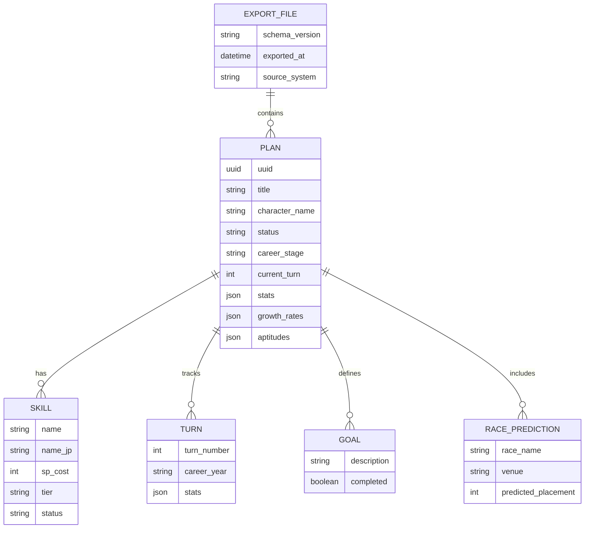
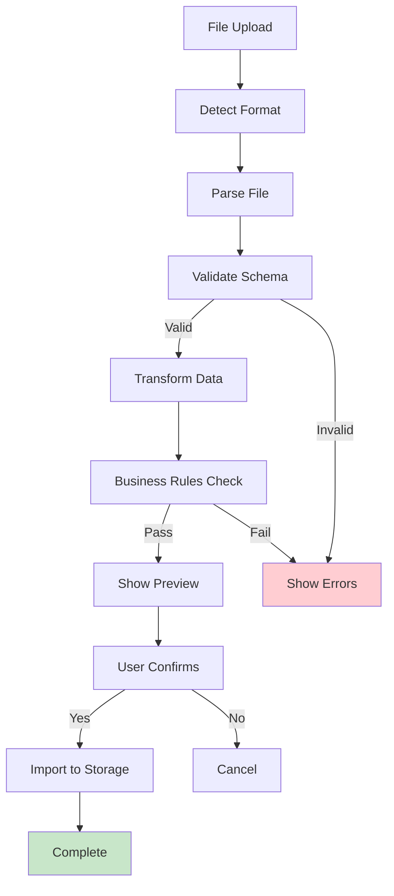
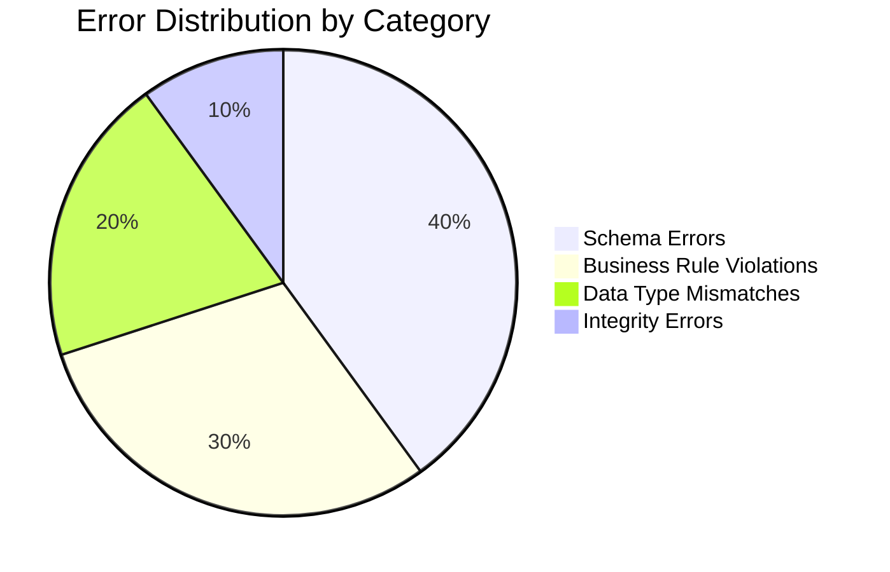
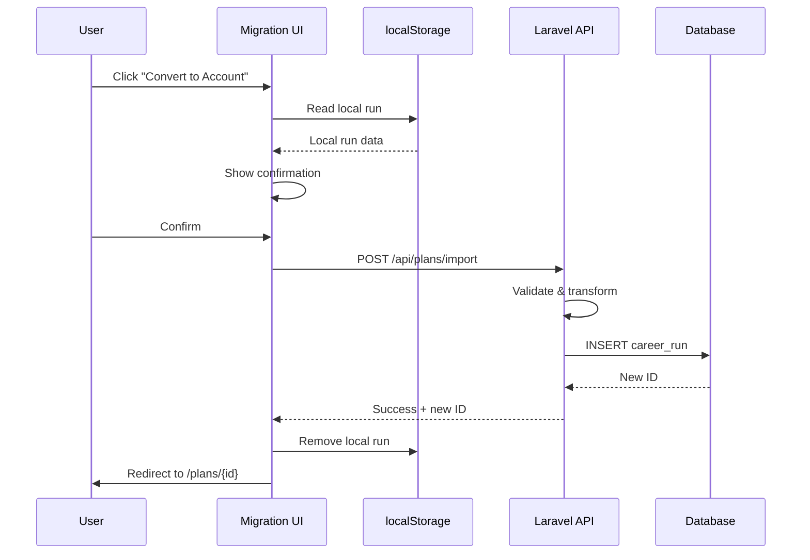

# D06 - Data Migration Specifications

## Uma Musume Career Planner

**Document Version:** 2.0  
**Date:** 2026-01-03  
**Status:** Draft

---

## Table of Contents

1. [Introduction](#1-introduction)
2. [Export Specifications](#2-export-specifications)
3. [Import Specifications](#3-import-specifications)
4. [Transformation Rules](#4-transformation-rules)
5. [Validation Procedures](#5-validation-procedures)
6. [Error Handling](#6-error-handling)
7. [Migration Scripts](#7-migration-scripts)

---

## 1. Introduction

This document provides technical specifications for data migration, including export scripts, import adapters, transformation rules, and validation procedures.

### 1.1 Scope

```mermaid
mindmap
  root((Data Migration))
    Export
      JSON Format
      CSV Format
      Backup Files
    Import
      Legacy Systems
      File Upload
      Bulk Import
    Transform
      Field Mapping
      Data Normalization
      Type Conversion
    Validate
      Schema Validation
      Business Rules
      Integrity Checks
```text

### 1.2 Canonical Field Names Reference

| Canonical Name | Description | Type |
| --- | --- | --- |
| `career_run_id` | Primary identifier for career runs | integer |
| `turn_number` | Current turn in the career | integer (1-78) |
| `total_sp_available` | Available skill points | integer |
| `stamina_percentage` | Current stamina level | integer (0-100) |

---

## 2. Export Specifications

### 2.1 Export Format Overview

```mermaid
flowchart LR
    subgraph Sources["Data Sources"]
        DB[(Database)]
        LS[(localStorage)]
    end
    
    subgraph Formats["Export Formats"]
        JSON["JSON<br/>(Full Data)"]
        CSV["CSV<br/>(Summary)"]
    end
    
    subgraph Output["Output"]
        File["Download File"]
        Clipboard["Clipboard"]
    end
    
    DB --> JSON
    DB --> CSV
    LS --> JSON
    
    JSON --> File
    CSV --> File
    JSON --> Clipboard
```

### 2.2 JSON Export Format (Standard)

```json
{
  "schema_version": "1.0",
  "exported_at": "2026-01-03T10:00:00Z",
  "source_system": "uma-musume-career-tracker",
  "plans": [
    {
      "uuid": "550e8400-e29b-41d4-a716-446655440000",
      "title": "Speed Build Attempt",
      "character_name": "Special Week",
      "character_id": null,
      "status": "in_progress",
      "career_stage": "senior",
      "current_turn": 65,
      "stats": {
        "speed": 1150,
        "stamina": 800,
        "power": 750,
        "guts": 600,
        "wit": 700
      },
      "growth_rates": {
        "speed": 20,
        "stamina": 10,
        "power": 10,
        "guts": 0,
        "wit": 10
      },
      "aptitudes": {
        "turf": "A",
        "dirt": "G",
        "sprint": "B",
        "mile": "A",
        "medium": "A",
        "long": "B",
        "nige": "A",
        "senkou": "B",
        "sashi": "C",
        "oikomi": "D"
      },
      "mood": "good",
      "conditions": ["charming"],
      "energy": 75,
      "total_sp_available": 450,
      "stamina_percentage": 100,
      "notes": "Focusing on speed for mile races",
      "skills": [...],
      "turns": [...],
      "goals": [...],
      "race_predictions": [...],
      "created_at": "2025-12-15T08:00:00Z",
      "updated_at": "2026-01-02T15:30:00Z"
    }
  ]
}
```text

### 2.3 JSON Schema Structure



### 2.4 CSV Export Format

```csv
title,character_name,status,career_stage,current_turn,speed,stamina,power,guts,wit,mood,energy,total_sp_available,notes,created_at
"Speed Build Attempt","Special Week","in_progress","senior",65,1150,800,750,600,700,"good",75,450,"Focusing on speed","2025-12-15T08:00:00Z"
```text

| Column | Type | Required | Description |
| --- | --- | --- | --- |
| title | string | Yes | Plan title |
| character_name | string | Yes | Uma Musume character name |
| status | enum | Yes | draft, in_progress, completed, abandoned |
| career_stage | enum | Yes | junior, classic, senior |
| current_turn | integer | Yes | 1-78 |
| speed | integer | Yes | Speed stat value |
| stamina | integer | Yes | Stamina stat value |
| power | integer | Yes | Power stat value |
| guts | integer | Yes | Guts stat value |
| wit | integer | Yes | Wit stat value |
| mood | enum | Yes | very_bad, bad, normal, good, very_good |
| energy | integer | Yes | 0-100 |
| total_sp_available | integer | Yes | Available SP |
| notes | string | No | User notes |
| created_at | datetime | Yes | ISO 8601 format |

---

## 3. Import Specifications

### 3.1 Import Flow Overview



### 3.2 Supported Import Sources


### 3.4 Import Process Sequence

```mermaid
sequenceDiagram
    participant User
    participant UI as Import UI
    participant Adapter as Import Adapter
    participant Validator
    participant Storage
    
    User->>UI: Upload file
    UI->>Adapter: detect(content)
    Adapter-->>UI: Format detected
    UI->>Adapter: parse(content)
    Adapter-->>UI: Parsed data
    UI->>Validator: validate(data)
    Validator-->>UI: Validation result
    
    alt Valid
        UI->>UI: Show preview
        User->>UI: Confirm import
        UI->>Adapter: transform(data)
        Adapter-->>UI: Transformed plans
        UI->>Storage: save(plans)
        Storage-->>UI: Success
        UI->>User: Import complete
    else Invalid
        UI->>User: Show errors
    end
```text

---

## 4. Transformation Rules

### 4.1 Field Mapping Overview

```mermaid
flowchart LR
    subgraph Legacy["Legacy Fields"]
        L1["spd"]
        L2["sta"]
        L3["pow"]
        L4["gut"]
        L5["int"]
    end
    
    subgraph Canonical["Canonical Fields"]
        C1["speed"]
        C2["stamina"]
        C3["power"]
        C4["guts"]
        C5["wit"]
    end
    
    L1 --> C1
    L2 --> C2
    L3 --> C3
    L4 --> C4
    L5 --> C5
```

### 4.2 Legacy Field Mapping Table

| Legacy Field | Canonical Field | Transformation |
| --- | --- | --- |
| `spd` | `speed` | Direct mapping |
| `sta` | `stamina` | Direct mapping |
| `pow` | `power` | Direct mapping |
| `gut` | `guts` | Direct mapping |
| `int` / `wis` | `wit` | Direct mapping |
| `sp` / `skill_points` | `total_sp_available` | Direct mapping |
| `hp` / `health` | `stamina_percentage` | Normalize to 0-100 |
| `turn` / `current_turn` | `turn_number` | Direct mapping |
| `id` | `career_run_id` | Generate new if importing |

### 4.3 Data Type Conversions

```mermaid
flowchart TD
    subgraph Input["Input Types"]
        S["String"]
        N["Number"]
        B["Boolean"]
        A["Array"]
        O["Object"]
    end
    
    subgraph Rules["Conversion Rules"]
        R1["Parse integers"]
        R2["Normalize enums"]
        R3["Convert dates"]
        R4["Flatten nested"]
    end
    
    subgraph Output["Output Types"]
        INT["Integer"]
        ENUM["Enum Value"]
        DATE["ISO DateTime"]
        JSON["JSON Column"]
    end
    
    S --> R1 --> INT
    S --> R2 --> ENUM
    S --> R3 --> DATE
    O --> R4 --> JSON
    A --> R4 --> JSON
```text

### 4.4 Enum Normalization

| Field | Valid Values | Default |
| --- | --- | --- |
| status | draft, in_progress, completed, abandoned | draft |
| career_stage | junior, classic, senior | junior |
| mood | very_bad, bad, normal, good, very_good | normal |
| aptitude grades | SS, S, A, B, C, D, E, F, G | G |
| skill tier | G-, G, G+, F-, F, F+, E-, E, E+, D-, D, D+, C-, C, C+, B-, B, B+, A-, A, A+, S-, S, S+, SS | G |
| skill status | planned, acquired, skipped | planned |

### 4.5 Transformation Pipeline

```mermaid
flowchart LR
    Raw["Raw Data"]
    
    subgraph Pipeline["Transformation Pipeline"]
        T1["1. Field Mapping"]
        T2["2. Type Conversion"]
        T3["3. Enum Normalization"]
        T4["4. Default Values"]
        T5["5. Relationship Linking"]
    end
    
    Transformed["Transformed Data"]
    
    Raw --> T1 --> T2 --> T3 --> T4 --> T5 --> Transformed
```

---

## 5. Validation Procedures

### 5.1 Validation Layers

```mermaid
flowchart TD
    Data["Input Data"]
    
    subgraph L1["Layer 1: Schema Validation"]
        S1["Required fields present"]
        S2["Data types correct"]
        S3["Format compliance"]
    end
    
    subgraph L2["Layer 2: Business Rules"]
        B1["Value ranges valid"]
        B2["Enum values valid"]
        B3["Relationships valid"]
    end
    
    subgraph L3["Layer 3: Integrity Checks"]
        I1["No duplicates"]
        I2["References exist"]
        I3["Consistency checks"]
    end
    
    Data --> L1
    L1 -->|"Pass"| L2
    L2 -->|"Pass"| L3
    L3 -->|"Pass"| Valid["✅ Valid"]
    
    L1 -->|"Fail"| Invalid["❌ Invalid"]
    L2 -->|"Fail"| Invalid
    L3 -->|"Fail"| Invalid
```text

### 5.2 Schema Validation Rules

| Field | Rule | Error Message |
| --- | --- | --- |
| title | Required, max 255 chars | "Title is required and must be under 255 characters" |
| character_name | Required | "Character name is required" |
| current_turn | Integer, 1-78 | "Turn must be between 1 and 78" |
| stats.* | Integer, 0-1200 | "Stat values must be between 0 and 1200" |
| energy | Integer, 0-100 | "Energy must be between 0 and 100" |
| total_sp_available | Integer, >= 0 | "SP must be a non-negative integer" |

### 5.3 Business Rule Validation

```mermaid
flowchart TD
    subgraph Rules["Business Rules"]
        R1["Turn number matches career stage"]
        R2["Stats within reasonable bounds"]
        R3["Skills have valid SP costs"]
        R4["Turn history is sequential"]
        R5["Goals have descriptions"]
    end
    
    R1 --> Check1{"Junior: 1-24<br/>Classic: 25-48<br/>Senior: 49-78"}
    R2 --> Check2{"0 ≤ stat ≤ 2000"}
    R3 --> Check3{"sp_cost > 0"}
    R4 --> Check4{"No gaps in turns"}
    R5 --> Check5{"description not empty"}
```

### 5.4 Validation Result Structure

```json
{
  "valid": false,
  "errors": [
    {
      "field": "plans[0].current_turn",
      "value": 85,
      "rule": "range",
      "message": "Turn must be between 1 and 78"
    },
    {
      "field": "plans[0].skills[2].sp_cost",
      "value": -50,
      "rule": "min",
      "message": "SP cost must be a positive integer"
    }
  ],
  "warnings": [
    {
      "field": "plans[0].stats.speed",
      "value": 1800,
      "message": "Unusually high speed value - please verify"
    }
  ],
  "summary": {
    "total_plans": 5,
    "valid_plans": 3,
    "invalid_plans": 2,
    "total_errors": 4,
    "total_warnings": 2
  }
}
```text

---

## 6. Error Handling

### 6.1 Error Categories



### 6.2 Error Handling Strategy

```mermaid
flowchart TD
    Error["Error Detected"]
    
    Error --> Type{"Error Type?"}
    
    Type -->|"Recoverable"| Recover["Attempt Recovery"]
    Type -->|"Non-recoverable"| Reject["Reject Record"]
    
    Recover --> Success{"Success?"}
    Success -->|"Yes"| Continue["Continue Import"]
    Success -->|"No"| Reject
    
    Reject --> Log["Log Error"]
    Log --> Report["Add to Report"]
    Report --> Next["Process Next Record"]
    
    Continue --> Next
```text

### 6.3 Recovery Strategies

| Error Type | Recovery Strategy |
| --- | --- |
| Missing optional field | Use default value |
| Invalid enum value | Map to closest valid value or default |
| Out of range number | Clamp to valid range |
| Invalid date format | Attempt multiple format parsing |
| Duplicate UUID | Generate new UUID |
| Missing relationship | Create placeholder or skip |

### 6.4 Error Reporting

```mermaid
sequenceDiagram
    participant Import as Import Process
    participant Logger as Error Logger
    participant Report as Report Generator
    participant User
    
    Import->>Logger: Log error details
    Logger->>Logger: Store in error collection
    
    loop For each error
        Logger->>Report: Add error to report
    end
    
    Report->>Report: Generate summary
    Report->>User: Display error report
    
    User->>User: Review errors
    User->>Import: Decide: Retry/Skip/Abort
```

---

## 7. Migration Scripts

### 7.1 Export Script (PHP)

```php
<?php

namespace App\Services\Migration;

class ExportService
{
    public function exportToJson(Collection $plans): string
    {
        $export = [
            'schema_version' => '1.0',
            'exported_at' => now()->toIso8601String(),
            'source_system' => 'uma-musume-career-tracker',
            'plans' => $plans->map(fn($plan) => $this->transformPlan($plan))->toArray(),
        ];
        
        return json_encode($export, JSON_PRETTY_PRINT | JSON_UNESCAPED_UNICODE);
    }
    
    private function transformPlan(CareerRun $plan): array
    {
        return [
            'uuid' => $plan->uuid ?? Str::uuid()->toString(),
            'title' => $plan->title,
            'character_name' => $plan->character_name,
            // ... additional fields
        ];
    }
}
```text

### 7.2 Import Script (PHP)

```php
<?php

namespace App\Services\Migration;

class ImportService
{
    public function importFromJson(string $content): ImportResult
    {
        $data = json_decode($content, true);
        
        // Validate schema
        $validation = $this->validator->validate($data);
        if (!$validation->valid) {
            return ImportResult::failed($validation->errors);
        }
        
        // Transform and import
        $imported = [];
        $errors = [];
        
        foreach ($data['plans'] as $planData) {
            try {
                $plan = $this->transformer->transform($planData);
                $plan->save();
                $imported[] = $plan;
            } catch (Exception $e) {
                $errors[] = new ImportError($planData, $e->getMessage());
            }
        }
        
        return new ImportResult($imported, $errors);
    }
}
```

### 7.3 Migration Script Workflow

```mermaid
flowchart TD
    subgraph Export["Export Phase"]
        E1["Select Plans"]
        E2["Transform to JSON"]
        E3["Generate File"]
        E4["Download"]
    end
    
    subgraph Import["Import Phase"]
        I1["Upload File"]
        I2["Parse & Validate"]
        I3["Transform Data"]
        I4["Preview Changes"]
        I5["Confirm Import"]
        I6["Save to Storage"]
    end
    
    E1 --> E2 --> E3 --> E4
    E4 -.->|"File Transfer"| I1
    I1 --> I2 --> I3 --> I4 --> I5 --> I6
```text

### 7.4 Batch Import Process

```mermaid
gantt
    title Batch Import Timeline
    dateFormat  HH:mm
    section Preparation
    File Upload           :a1, 00:00, 1m
    Format Detection      :a2, after a1, 1m
    section Validation
    Schema Validation     :b1, after a2, 2m
    Business Rules        :b2, after b1, 2m
    section Processing
    Data Transformation   :c1, after b2, 3m
    Relationship Linking  :c2, after c1, 2m
    section Completion
    Database Insert       :d1, after c2, 5m
    Report Generation     :d2, after d1, 1m
```

---

## 8. localStorage Migration

### 8.1 localStorage Schema

```json
{
  "uma_local_runs": {
    "schema_version": "1.0",
    "runs": [...],
    "last_modified": "2026-01-03T10:00:00Z"
  },
  "uma_drafts": {
    "plan_draft_123": {...},
    "plan_draft_456": {...}
  },
  "uma_preferences": {
    "dark_mode": true,
    "default_storage_mode": "local"
  }
}
```text

### 8.2 Local to Account Migration



---

## Document History

| Version | Date | Author | Changes |
| --- | --- | --- | --- |
| 1.0 | 2026-01-03 | Development Team | Initial draft |
| 2.0 | 2026-01-03 | Development Team | Added Mermaid diagrams, expanded specifications |
