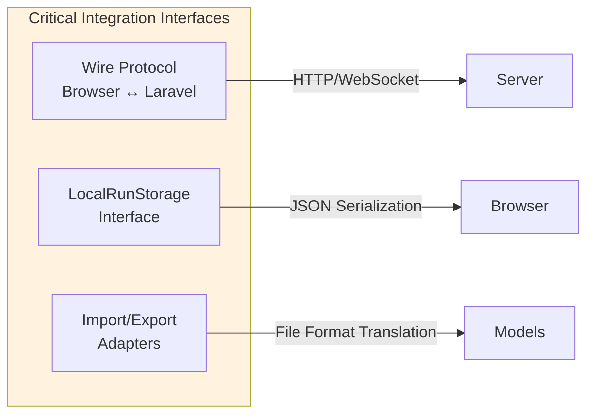
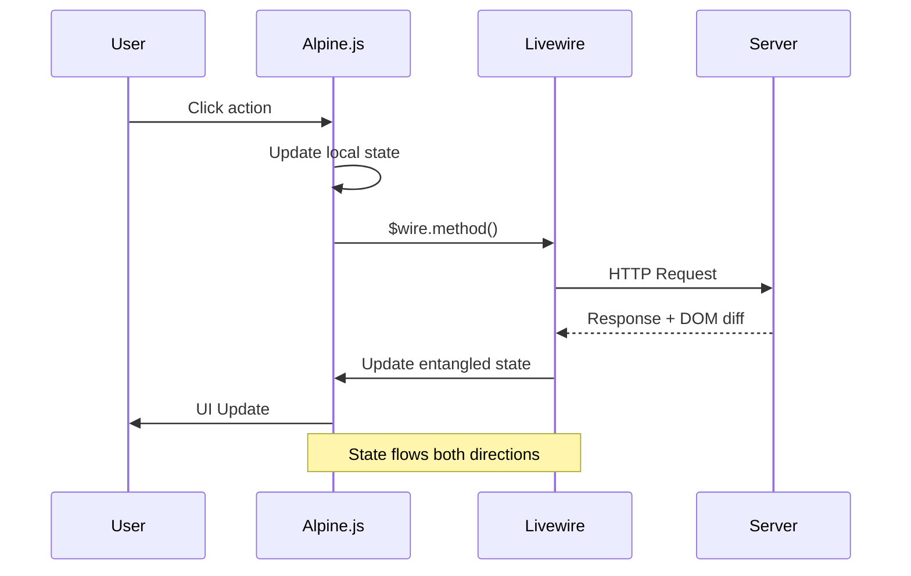
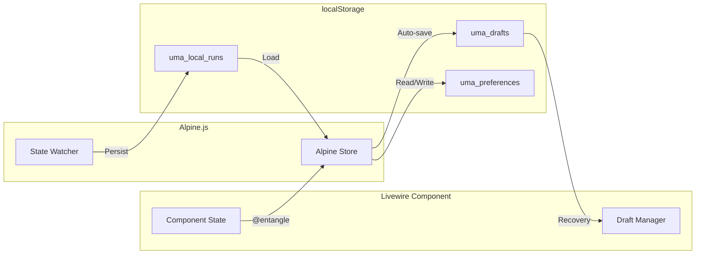
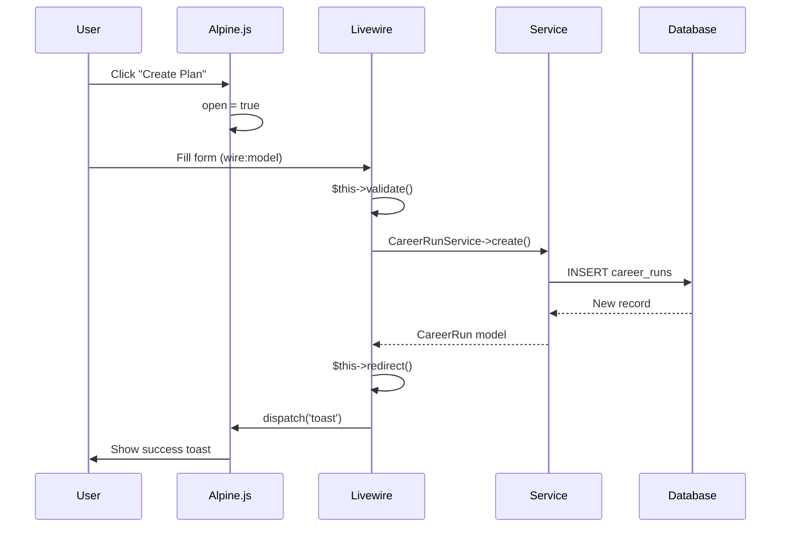
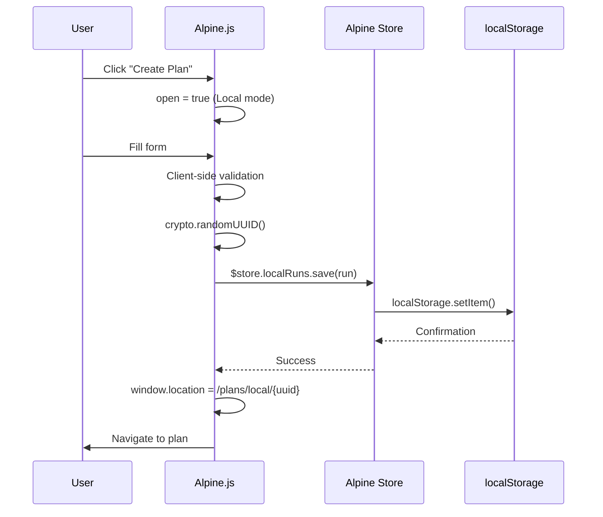
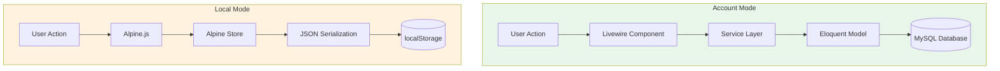

# D07 - System Integration Plan

## Uma Musume Career Planner

**Document Version:** 2.0
**Date:** 2026-01-03
**Status:** Draft

---

## Table of Contents

1. [Executive Summary](#1-executive-summary)
2. [System Components & Boundaries](#2-system-components--boundaries)
3. [Integration Strategy](#3-integration-strategy)
4. [Integration Points](#4-integration-points)
5. [Data Flow Integration](#5-data-flow-integration)
6. [Integration Test Environment](#6-integration-test-environment)
7. [Specific Integration Scenarios](#7-specific-integration-scenarios)
8. [Integration Management](#8-integration-management)
9. [Sign-off Criteria](#9-sign-off-criteria)

---

## 1. Executive Summary

This System Integration Plan outlines the strategy for integrating the disparate components of the
Uma Musume Career Planner—specifically the convergence of the Laravel backend, Livewire server-side
reactivity, Alpine.js client-side interactivity, and dual-mode storage (Database vs.
LocalStorage)—into a unified, stable application.

### 1.1 Integration Objectives

1. **Unified Reactivity:** Ensure seamless state synchronization between Livewire (server) and Alpine.js (client)
2. **Storage Abstraction:** Validate that the application behaves identically whether data is stored
in MySQL (Account Mode) or LocalStorage (Local Mode)
3. **Legacy Consolidation:** Successfully integrate business logic from legacy systems (calculators,
datasets) into the new Service Layer
4. **Resilience:** Ensure the system handles connection loss gracefully, preserving user data via local drafts
5. **Proper coordination** between browser storage and server database

### 1.2 Integration Overview Diagram

```mermaid
mindmap
  root((System Integration))
    Frontend
      Alpine.js Components
      Livewire Client
      localStorage
      TailwindCSS
    Backend
      Laravel Framework
      Livewire Server
      Service Layer
      Eloquent Models
    Storage
      MySQL/MariaDB
      SQLite Testing
      Browser Storage
    Build Tools
      Vite
      NPM
      Composer
```text

---

## 2. System Components & Boundaries

### 2.1 Component Architecture

| Component | Type | Responsibility | Integration Point |
| --- | --- | --- | --- |
| **Laravel Framework** | Backend | Routing, Auth, DB Access | `web.php`, Service Classes |
| **Service Layer** | Business Logic | Calculations, Data Persistence | Controllers, Livewire Components |
| **Livewire** | Full-Stack | Server-driven UI updates | Blade Templates, Alpine `x-data` |
| **Alpine.js** | Frontend | Instant UI interaction, LocalStorage | `x-on`, `x-model`, `$wire` |
| **MySQL/MariaDB** | Database | Account Mode Storage | Eloquent Models |
| **LocalStorage** | Browser | Local Mode Storage, Drafts | `LocalRunStorageService` (JS) |

### 2.2 Component Dependencies Diagram

```mermaid
flowchart TB
    subgraph Browser["🌐 Browser Layer"]
        Alpine["Alpine.js<br/>Components"]
        LWClient["Livewire<br/>Client"]
        LS["localStorage"]

        Alpine <--> LWClient
        Alpine <--> LS
    end

    LWClient <-->|"Wire Protocol"| LWServer

    subgraph Server["🖥️ Server Layer"]
        LWServer["Livewire<br/>Server"]
        Services["Service<br/>Layer"]
        Models["Eloquent<br/>Models"]

        LWServer <--> Services
        Services <--> Models
    end

    Models <--> DB[(Database)]

    style Browser fill:#e1f5fe
    style Server fill:#f3e5f5
```

**ASCII Diagram:**

```text
┌─────────────────────────────────────────────────────────────────┐
│                     Browser                                      │
├─────────────────────────────────────────────────────────────────┤
│                                                                  │
│  ┌─────────────┐    ┌─────────────┐    ┌─────────────┐         │
│  │  Alpine.js  │◄──►│  Livewire   │◄──►│ localStorage│         │
│  │  Components │    │  (Client)   │    │             │         │
│  └─────────────┘    └──────┬──────┘    └─────────────┘         │
│                            │                                     │
│                     Wire Protocol                                │
│                            │                                     │
└────────────────────────────┼────────────────────────────────────┘
                             │
                             ▼
┌─────────────────────────────────────────────────────────────────┐
│                     Server                                       │
├─────────────────────────────────────────────────────────────────┤
│                                                                  │
│  ┌─────────────┐    ┌─────────────┐    ┌─────────────┐         │
│  │  Livewire   │◄──►│  Services   │◄──►│  Database   │         │
│  │  (Server)   │    │             │    │             │         │
│  └─────────────┘    └─────────────┘    └─────────────┘         │
│                                                                  │
└─────────────────────────────────────────────────────────────────┘
```text

### 2.3 Critical Integration Interfaces



1. **Wire Protocol:** The communication channel between the browser and Laravel/Livewire
2. **LocalRunStorage Interface:** The contract allowing the frontend to read/write complex object
graphs to browser storage
3. **Import/Export Adapters:** The translation layer between external file formats (JSON/CSV) and internal models

---

## 3. Integration Strategy

### 3.1 Integration Phases

We employ a **Bottom-Up Integration Strategy**, starting with the data layer and moving up to the user interface.

```mermaid
flowchart TB
    P1["Phase 1: Data & Service Integration<br/>Week 1-2"]
    P2["Phase 2: Component Integration<br/>Week 3-4"]
    P3["Phase 3: Client-Server Bridge<br/>Week 4-5"]
    P4["Phase 4: Storage Mode Unification<br/>Week 5-6"]
    P5["Phase 5: E2E Testing & Polish<br/>Week 6-7"]

    P1 --> P2 --> P3 --> P4 --> P5

    style P1 fill:#c8e6c9
    style P2 fill:#bbdefb
    style P3 fill:#f8bbd9
    style P4 fill:#ffe0b2
    style P5 fill:#e1bee7
```text

**ASCII Diagram:**

```text
Week 1-2: Database + Models
    │
    ▼
Week 2-3: Services + Business Logic
    │
    ▼
Week 3-4: Livewire Components
    │
    ▼
Week 4-5: Alpine.js + Full Page Integration
    │
    ▼
Week 5-6: Cross-cutting Concerns (Auth, Storage Modes)
    │
    ▼
Week 6-7: E2E Testing + Polish
```

### 3.2 Phase Details

#### Phase 1: Data & Service Integration (Week 1-2)

- **Goal:** Ensure Models and Services function correctly independent of the UI
- **Activities:**
  - Integrate Eloquent models with the Database Schema
  - Integrate `LocalRunStorageService` (PHP serialization logic) with schema definitions
  - Test Service methods (`CareerRunService`, `SkillService`) with Unit Tests

#### Phase 2: Component Integration (Week 3-4)

- **Goal:** Ensure Livewire components can correctly invoke Services and update View state
- **Activities:**
  - Bind Livewire properties to Model fields
  - Test `wire:model` syncing
  - Test `wire:click` actions invoking Service methods
  - Validate Validation logic integration (Real-time feedback)

#### Phase 3: Client-Server Bridge (Week 4-5)

- **Goal:** Seamless interaction between Alpine.js and Livewire
- **Activities:**
  - Integrate `x-data` with `@entangle` for shared state
  - Implement "Dirty State" warnings logic (JS listening to Livewire state)
  - Implement Connection State handling (JS detecting Livewire hooks)

#### Phase 4: Storage Mode Unification (Week 5-6)

- **Goal:** Ensure the UI is agnostic to the underlying storage
- **Activities:**
  - Test the "Create Plan" flow for both Local and Account modes
  - Test the "Edit Plan" flow for both modes using the Unified Interface (`PlanEdit`)
  - Validate the "Convert to Account" integration flow

### 3.3 Integration Timeline

```mermaid
gantt
    title System Integration Timeline
    dateFormat  YYYY-MM-DD
    section Phase 1
    Database Integration       :p1a, 2026-01-06, 5d
    Service Layer Testing      :p1b, after p1a, 5d
    section Phase 2
    Livewire Components        :p2a, after p1b, 5d
    Model Binding              :p2b, after p2a, 5d
    section Phase 3
    Alpine-Livewire Bridge     :p3a, after p2b, 5d
    State Management           :p3b, after p3a, 5d
    section Phase 4
    Storage Mode Testing       :p4a, after p3b, 5d
    Mode Unification           :p4b, after p4a, 5d
    section Phase 5
    E2E Testing                :p5a, after p4b, 5d
    Polish & Documentation     :p5b, after p5a, 5d
```text

---

## 4. Integration Points

### 4.1 Livewire ↔ Database

```mermaid
sequenceDiagram
    participant LW as Livewire Component
    participant SVC as Service Layer
    participant MDL as Eloquent Model
    participant DB as Database

    LW->>SVC: Request data
    SVC->>MDL: Query with scopes
    MDL->>DB: SQL Query
    DB-->>MDL: Result set
    MDL-->>SVC: Hydrated models
    SVC-->>LW: Processed data

    Note over LW,DB: Model Loading Flow

    LW->>SVC: Save changes
    SVC->>MDL: Update attributes
    MDL->>DB: INSERT/UPDATE
    DB-->>MDL: Confirmation
    MDL-->>SVC: Saved model
    SVC-->>LW: Success response

    Note over LW,DB: Model Persistence Flow
```

| Integration Point | Direction | Description |
| --- | --- | --- |
| Model Loading | DB → Livewire | Load plans, characters, skills |
| Model Persistence | Livewire → DB | Save plan changes |
| Relationship Hydration | DB → Livewire | Load related data |
| Query Scoping | Livewire → DB | User-scoped data access |

**Integration Pattern:**

```php
// Livewire component
class PlanEdit extends Component
{
    public CareerRun $plan;

    public function mount(int $id): void
    {
        $this->plan = CareerRun::with(['skills', 'turns', 'goals'])
            ->findOrFail($id);
    }

    public function save(): void
    {
        $this->validate();
        $this->plan->save();
        $this->dispatch('plan-saved');
    }
}
```text

### 4.2 Livewire ↔ Alpine.js



| Integration Point | Direction | Description |
| --- | --- | --- |
| State Sharing | Livewire → Alpine | Pass data via entangle/wire |
| Event Dispatch | Alpine → Livewire | Trigger server actions |
| DOM Updates | Livewire → Alpine | Morphdom reconciliation |
| Loading States | Livewire → Alpine | wire:loading indicators |

**Integration Pattern:**

```html
<!-- Livewire + Alpine integration -->
<div
    x-data="{ open: false, dirty: @entangle('isDirty') }"
    x-on:plan-saved.window="open = false"
>
    <button x-on:click="open = true">Edit</button>

    <div x-show="open" x-cloak>
        <form wire:submit="save">
            <input wire:model.blur="plan.title" x-on:input="dirty = true">

            <button
                type="submit"
                wire:loading.attr="disabled"
                x-bind:disabled="!dirty"
            >
                <span wire:loading.remove>Save</span>
                <span wire:loading>Saving...</span>
            </button>
        </form>
    </div>
</div>
```text

### 4.3 Livewire ↔ localStorage



| Integration Point | Direction | Description |
| --- | --- | --- |
| Draft Auto-save | Livewire → Storage | Save form state periodically |
| Draft Recovery | Storage → Livewire | Restore on page load |
| Local Runs | Both | Full CRUD for local storage mode |
| Preferences | Storage → Livewire | Load user preferences |

**Integration Pattern:**

```javascript
// Alpine store for localStorage coordination
document.addEventListener('alpine:init', () => {
    Alpine.store('localRuns', {
        runs: JSON.parse(localStorage.getItem('uma_local_runs') || '{"runs":[]}').runs,

        save(run) {
            const index = this.runs.findIndex(r => r.uuid === run.uuid);
            if (index >= 0) {
                this.runs[index] = run;
            } else {
                this.runs.push(run);
            }
            this.persist();
        },

        persist() {
            localStorage.setItem('uma_local_runs', JSON.stringify({
                schema_version: '1.0',
                runs: this.runs,
                last_modified: new Date().toISOString(),
            }));
        },
    });
});
```text

### 4.4 Alpine.js ↔ localStorage

| Integration Point | Direction | Description |
| --- | --- | --- |
| Dark Mode | Both | Read/write preference |
| Draft State | Both | Temporary form data |
| Local Runs | Both | Full plan data |
| Toast Queue | Alpine | Notification management |

---

## 5. Data Flow Integration

### 5.1 Plan Creation Flow (Account Mode)



**ASCII Diagram:**

```text
User clicks "Create Plan"
         │
         ▼
┌─────────────────────┐
│ Alpine: Open Modal  │
│ x-on:click="open=true"
└──────────┬──────────┘
           │
           ▼
┌─────────────────────┐
│ User fills form     │
│ wire:model bindings │
└──────────┬──────────┘
           │
           ▼
┌─────────────────────┐
│ Livewire: validate  │
│ $this->validate()   │
└──────────┬──────────┘
           │
           ▼
┌─────────────────────┐
│ Service: create     │
│ CareerRunService    │
└──────────┬──────────┘
           │
           ▼
┌─────────────────────┐
│ Database: INSERT    │
│ career_runs table   │
└──────────┬──────────┘
           │
           ▼
┌─────────────────────┐
│ Livewire: redirect  │
│ $this->redirect()   │
└──────────┬──────────┘
           │
           ▼
┌─────────────────────┐
│ Alpine: toast       │
│ dispatch('toast')   │
└─────────────────────┘
```text

### 5.2 Plan Creation Flow (Local Mode)



**ASCII Diagram:**

```text
User clicks "Create Plan"
         │
         ▼
┌─────────────────────┐
│ Alpine: Open Modal  │
│ Storage mode: Local │
└──────────┬──────────┘
           │
           ▼
┌─────────────────────┐
│ Alpine: Validate    │
│ Client-side checks  │
└──────────┬──────────┘
           │
           ▼
┌─────────────────────┐
│ Alpine: Generate UUID
│ crypto.randomUUID() │
└──────────┬──────────┘
           │
           ▼
┌─────────────────────┐
│ Alpine Store: save  │
│ $store.localRuns    │
└──────────┬──────────┘
           │
           ▼
┌─────────────────────┐
│ localStorage.setItem│
│ uma_local_runs      │
└──────────┬──────────┘
           │
           ▼
┌─────────────────────┐
│ Alpine: Navigate    │
│ window.location     │
└─────────────────────┘
```text

### 5.3 Storage Mode Comparison



---

## 6. Integration Test Environment

### 6.1 Environment Setup

| Environment | Database | Cache | Queue | Purpose |
| --- | --- | --- | --- | --- |
| **Local Dev** | SQLite/MySQL | Array | Sync | Developer integration testing |
| **CI (GitHub)** | MySQL 8.0 | Redis | Redis | Automated regression testing |
| **Staging** | MySQL 8.0 | Redis | Redis | UAT and E2E testing |

### 6.2 Environment Architecture

```mermaid
flowchart TB
    subgraph Dev["Local Development"]
        DevApp["Laravel App"]
        DevDB[(SQLite)]
        DevCache["Array Cache"]
    end

    subgraph CI["GitHub Actions CI"]
        CIApp["Laravel App"]
        CIDB[(MySQL 8.0)]
        CICache["Redis"]
    end

    subgraph Staging["Staging Environment"]
        StagingApp["Laravel App"]
        StagingDB[(MySQL 8.0)]
        StagingCache["Redis"]
    end

    Dev -->|"Push"| CI
    CI -->|"Deploy"| Staging

    style Dev fill:#e3f2fd
    style CI fill:#f3e5f5
    style Staging fill:#e8f5e9
```text

### 6.3 Test Data Strategy

- **Seeding:** Use Laravel Seeders to populate `uma_musumes` and `skills` reference tables
- **Factories:** Use Model Factories to generate synthetic `CareerRun` data for load testing
- **Golden Files:** Use pre-defined JSON exports from legacy apps to test Import Integration

```mermaid
pie title Test Data Distribution
    "Reference Data (Seeds)" : 30
    "Synthetic Data (Factories)" : 50
    "Golden Files (Legacy)" : 20
```

---

## 7. Specific Integration Scenarios

### 7.1 Storage Mode Transparency

**Requirement:** The `PlanEditor` component must handle both `CareerRun` (Eloquent) and `LocalCareerRun` (JSON).

```mermaid
flowchart TD
    Start["PlanEditor receives ID"]
    Check{ID Type?}

    Start --> Check
    Check -->|"Numeric"| Account["CareerRun::find(id)"]
    Check -->|"UUID"| Local["LocalRunStorageService->find(uuid)"]

    Account --> Unified["Unified Plan Interface"]
    Local --> Unified

    Unified --> Editor["Render Editor UI"]

    style Account fill:#e8f5e9
    style Local fill:#fff3e0
```text

**Integration Logic:**

- The `PlanEditor` component accepts an ID
- If ID is numeric: Resolves via `CareerRun::find($id)`
- If ID is UUID: Resolves via `LocalRunStorageService->find($uuid)`
- **Verification:** E2E test creating a plan in both modes and verifying data persistence

### 7.2 Livewire & Alpine Handshake

**Requirement:** Modal visibility and complex UI states (Tabs) must sync without server roundtrips
where possible, but sync when data changes.

```mermaid
sequenceDiagram
    participant User
    participant Alpine as Alpine.js
    participant LW as Livewire

    User->>Alpine: Click Tab 2
    Alpine->>Alpine: activeTab = 2
    Note right of Alpine: No server request

    User->>Alpine: Click Tab 3
    Alpine->>Alpine: activeTab = 3
    Note right of Alpine: No server request

    User->>Alpine: Click "Save"
    Alpine->>LW: $wire.save()
    LW->>LW: Process & persist
    LW-->>Alpine: Update entangled state

    Note over Alpine,LW: Server only contacted on data changes
```

**Integration Logic:**

- Use `x-data="{ activeTab: @entangle('tab') }"` for tab state
- Use events (`$dispatch`) to trigger Livewire updates only on "Save"
- **Verification:** Browser test clicking tabs and verifying no network request is sent until "Save" is clicked

### 7.3 Offline Draft Integration

**Requirement:** Unsaved changes must persist locally if the connection drops.

```mermaid
sequenceDiagram
    participant User
    participant Alpine as Alpine.js
    participant LS as localStorage
    participant LW as Livewire

    User->>Alpine: Edit form data
    Alpine->>Alpine: Watcher detects change
    Alpine->>LS: Save to localStorage.drafts

    Note over User,LW: Connection drops

    User->>User: Reload page
    LW->>LW: Component hydrates
    LW->>LS: Check localStorage.drafts
    LS-->>LW: Draft data found
    LW->>LW: Populate properties
    LW->>User: Show recovered data

    Note over User,LW: Data preserved!
```text

**Integration Logic:**

- Alpine.js watcher observes form data
- On change, write to `localStorage.drafts`
- On Livewire re-hydration (page load), check `localStorage.drafts` and populate Livewire properties if draft exists
- **Verification:** Simulate network offline, edit form, reload page, verify data restore

### 7.4 Skill Autocomplete Integration

```mermaid
sequenceDiagram
    participant User
    participant Alpine as Alpine.js
    participant LW as Livewire
    participant SVC as SkillService
    participant DB as Database

    User->>Alpine: Type "Speed"
    Alpine->>Alpine: Debounce 300ms
    Alpine->>LW: wire:model.live
    LW->>SVC: searchSkills("Speed")
    SVC->>DB: SELECT * FROM skills WHERE name LIKE '%Speed%'
    DB-->>SVC: Results
    SVC-->>LW: Skill collection
    LW-->>Alpine: Update suggestions
    Alpine->>User: Show dropdown
```

---

## 8. Integration Management

### 8.1 Dependency Management

```mermaid
flowchart LR
    subgraph PHP["PHP Dependencies"]
        Composer["Composer"]
        Laravel["Laravel 12"]
        Livewire["Livewire 3"]
    end

    subgraph JS["JS Dependencies"]
        NPM["NPM"]
        Alpine["Alpine.js"]
        Tailwind["TailwindCSS v4"]
        Vite["Vite"]
    end

    subgraph VCS["Version Control"]
        Git["Git"]
        GitHub["GitHub"]
        CI["GitHub Actions"]
    end

    Composer --> Laravel --> Livewire
    NPM --> Alpine
    NPM --> Tailwind
    NPM --> Vite

    Git --> GitHub --> CI
```text

- **Composer:** Manage PHP dependencies (Laravel, Livewire)
- **NPM:** Manage JS dependencies (Alpine, Tailwind)
- **Version Control:** Git feature branches merged to `main` only after passing CI integration tests

### 8.2 Defect Tracking

Integration defects will be tracked via GitHub Issues with the label `integration-bug`.

```mermaid
flowchart TD
    Bug["Integration Bug Found"]

    Bug --> S1{"Severity?"}

    S1 -->|"Data corruption/loss"| Sev1["🔴 Severity 1<br/>Critical"]
    S1 -->|"UI State desync"| Sev2["🟠 Severity 2<br/>High"]
    S1 -->|"Visual glitches"| Sev3["🟡 Severity 3<br/>Medium"]

    Sev1 --> Fix1["Immediate fix required"]
    Sev2 --> Fix2["Fix in current sprint"]
    Sev3 --> Fix3["Fix in next sprint"]

    style Sev1 fill:#ffcdd2
    style Sev2 fill:#ffe0b2
    style Sev3 fill:#fff9c4
```

| Severity | Description | Response Time |
| --- | --- | --- |
| **Severity 1** | Data corruption or loss (Local/Account mismatch) | Immediate |
| **Severity 2** | UI State desync (Alpine shows X, Server has Y) | Within 24 hours |
| **Severity 3** | Visual glitches | Next sprint |

### 8.3 Integration Workflow

```mermaid
flowchart LR
    Dev["Developer"]
    Branch["Feature Branch"]
    PR["Pull Request"]
    CI["CI Tests"]
    Review["Code Review"]
    Main["Main Branch"]
    Deploy["Deploy"]

    Dev --> Branch --> PR --> CI
    CI -->|"Pass"| Review
    CI -->|"Fail"| Dev
    Review -->|"Approved"| Main
    Review -->|"Changes"| Dev
    Main --> Deploy
```text

---

## 9. Sign-off Criteria

Integration is considered complete when:

```mermaid
flowchart TD
    subgraph Criteria["Sign-off Checklist"]
        C1["✅ P0 User Flows pass E2E tests<br/>in both Storage Modes"]
        C2["✅ Import/Export works seamlessly<br/>between JSON and Database"]
        C3["✅ Connection loss does not<br/>result in data loss"]
        C4["✅ UI components render correctly<br/>with data from both sources"]
    end

    C1 --> Complete
    C2 --> Complete
    C3 --> Complete
    C4 --> Complete

    Complete["🎉 Integration Complete"]

    style Complete fill:#c8e6c9
```

### 9.1 Acceptance Checklist

| # | Criterion | Status |
| --- | --- | --- |
| 1 | All P0 User Flows (Create, Edit, Save) pass E2E tests in both Storage Modes | ⬜ Pending |
| 2 | Import/Export works seamlessly between JSON format and Database | ⬜ Pending |
| 3 | Connection loss does not result in data loss (Draft system verified) | ⬜ Pending |
| 4 | UI components render correctly with data from both sources | ⬜ Pending |
| 5 | All Severity 1 and 2 integration bugs resolved | ⬜ Pending |
| 6 | Performance benchmarks met (page load < 2s, save < 500ms) | ⬜ Pending |

---

## Document History

| Version | Date | Author | Changes |
| --- | --- | --- | --- |
| 1.0 | 2026-01-03 | Development Team | Initial draft |
| 2.0 | 2026-01-03 | Development Team | Added Mermaid diagrams, standardized formatting |
