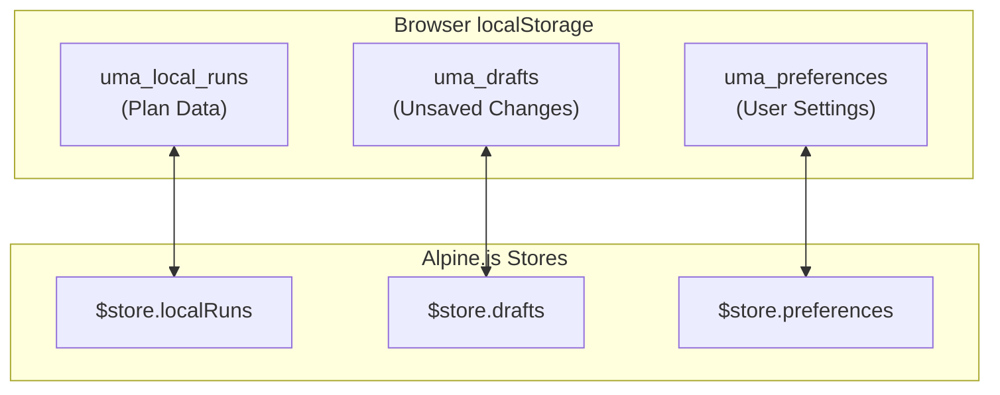
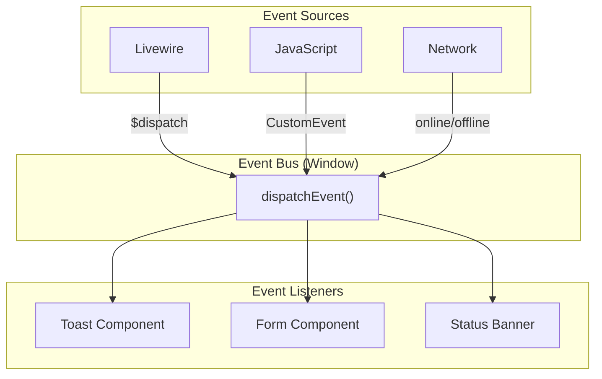

# D08 - System Integration Specifications

## Uma Musume Career Planner

**Document Version:** 2.0  
**Date:** 2026-01-03  
**Status:** Draft

---

## Table of Contents

1. [Introduction](#1-introduction)
2. [Internal API Specifications](#2-internal-api-specifications)
3. [Local Storage Data Specifications](#3-local-storage-data-specifications)
4. [Event Specifications](#4-event-specifications)
5. [Security Specifications](#5-security-specifications)
6. [Integration Patterns](#6-integration-patterns)

---

## 1. Introduction

This document details the technical specifications for the interfaces and data exchange formats used to integrate the components of the Uma Musume Career Planner. It serves as the reference for developers implementing the interaction between the Frontend (Alpine/Livewire) and Backend (Laravel/MySQL).

### 1.1 Integration Architecture Overview

```mermaid
flowchart TB
    subgraph Frontend["Frontend Layer"]
        Alpine["Alpine.js"]
        LWClient["Livewire Client"]
        LS["localStorage"]
    end
    
    subgraph Transport["Transport Layer"]
        Wire["Wire Protocol"]
        HTTP["HTTP/JSON API"]
        Events["Browser Events"]
    end
    
    subgraph Backend["Backend Layer"]
        LWServer["Livewire Server"]
        API["Internal API"]
        Services["Service Layer"]
    end
    
    subgraph Storage["Storage Layer"]
        DB[(MySQL)]
        Cache["Redis Cache"]
    end
    
    Alpine <--> Events
    Alpine <--> HTTP
    LWClient <--> Wire
    Alpine <--> LS
    
    Wire <--> LWServer
    HTTP <--> API
    
    LWServer <--> Services
    API <--> Services
    Services <--> DB
    Services <--> Cache
    
    style Frontend fill:#e3f2fd
    style Backend fill:#f3e5f5
    style Storage fill:#e8f5e9
```text

---

## 2. Internal API Specifications

### 2.1 Livewire Wire Protocol

While Livewire handles the transport layer transparently, the structure of the data payloads is critical for performance and security.

```mermaid
sequenceDiagram
    participant Browser
    participant LWClient as Livewire Client
    participant Server as Laravel Server
    participant LWServer as Livewire Server
    
    Browser->>LWClient: User action
    LWClient->>LWClient: Serialize state
    LWClient->>Server: POST /livewire/update
    Server->>LWServer: Hydrate component
    LWServer->>LWServer: Execute method
    LWServer->>Server: Dehydrate state
    Server-->>LWClient: JSON response + DOM diff
    LWClient->>Browser: Morph DOM
```

### 2.2 Component Payloads

#### 2.2.1 PlanEditor Component

```mermaid
classDiagram
    class PlanEditor {
        +int|string id
        +string mode
        +CareerRun plan
        +Collection skills
        +array form
        +bool isDirty
        +mount(id, mode)
        +save()
        +addSkill(skillId)
        +removeSkill(skillId)
    }
    
    class CareerRun {
        +int id
        +string title
        +string character_name
        +int current_turn
        +json stats
        +json aptitudes
    }
    
    PlanEditor --> CareerRun : manages
```text

| Property | Type | Description |
| --- | --- | --- |
| `id` | `int\|string` | Plan ID (numeric for Account, UUID for Local) |
| `mode` | string | 'edit' or 'view' |
| `plan` | `CareerRun\|Array` | Model or array for Local mode |
| `skills` | Collection | Skill models collection |
| `form` | array | Input field mirror |
| `isDirty` | bool | Unsaved changes flag |

**Dehydration Rules:**

- Exclude heavy relationship data (`uma_musume` reference data) to keep payload light
- Use `wire:key` to track dynamic lists (skills, turns)

### 2.3 Internal JSON API

Used for cached read-only data to avoid heavy Livewire roundtrips for autocomplete.

```mermaid
flowchart LR
    subgraph Client["Client Side"]
        Alpine["Alpine.js"]
        Input["Search Input"]
    end
    
    subgraph API["Internal API"]
        Endpoint["/internal/skills/search"]
        Cache["Redis Cache"]
        DB[(Database)]
    end
    
    Input -->|"debounce 300ms"| Alpine
    Alpine -->|"GET ?q=..."| Endpoint
    Endpoint --> Cache
    Cache -->|"miss"| DB
    DB --> Cache
    Cache --> Endpoint
    Endpoint -->|"JSON"| Alpine
```

#### 2.3.1 Skill Search Endpoint

| Property | Value |
| --- | --- |
| **Endpoint** | `/internal/skills/search` |
| **Method** | `GET` |
| **Cache** | 1 hour |

**Parameters:**

| Parameter | Type | Required | Default | Description |
| --- | --- | --- | --- | --- |
| `q` | string | Yes | - | Search query |
| `limit` | int | No | 10 | Max results |
| `type` | string | No | - | Filter by skill type |

**Response Format:**

```json
{
  "data": [
    {
      "id": 101,
      "name": "Concentration",
      "name_jp": "コンセントレーション",
      "sp_cost": 140,
      "type": "wit",
      "tier": "B",
      "description": "Start slightly better..."
    }
  ],
  "meta": {
    "total": 1,
    "query": "concentration"
  }
}
```text

---

## 3. Local Storage Data Specifications

To ensure the "Local Mode" works seamlessly and can be converted to "Account Mode" later, the LocalStorage schema must strictly mirror the Database Schema concepts.

### 3.1 Storage Architecture



### 3.2 Storage Key: `uma_local_runs`

This key holds all local plans.

```mermaid
erDiagram
    LOCAL_STORAGE ||--o{ RUN : contains
    RUN ||--o{ SKILL : has
    RUN ||--o{ TURN : tracks
    
    LOCAL_STORAGE {
        string schema_version
        datetime last_modified
    }
    
    RUN {
        uuid uuid PK
        string title
        int character_id
        string character_name
        string storage_mode
        string status
        string career_stage
        int current_turn
        json stats
        json aptitudes
    }
    
    SKILL {
        int id
        string name
        string status
        int turn_acquired
    }
    
    TURN {
        int turn_number
        json stats
    }
```text

**JSON Schema:**

```json
{
  "schema_version": "1.0",
  "last_modified": "2026-01-03T12:00:00Z",
  "runs": [
    {
      "uuid": "550e8400-e29b-41d4-a716-446655440000",
      "title": "Speed Build",
      "character_id": 4,
      "character_name": "Silence Suzuka",
      "storage_mode": "local",
      "status": "in_progress",
      "career_stage": "senior",
      "current_turn": 45,
      "stats": {
        "speed": 800,
        "stamina": 400,
        "power": 600,
        "guts": 300,
        "wit": 400
      },
      "aptitudes": {
        "turf": "A",
        "dist_mile": "S",
        "style_nige": "S"
      },
      "skills": [...],
      "turns": [...],
      "created_at": "2026-01-01T10:00:00Z",
      "updated_at": "2026-01-03T12:00:00Z"
    }
  ]
}
```

### 3.3 Storage Key: `uma_drafts`

Holds unsaved form states for recovery after connection loss or page reload.

```mermaid
flowchart LR
    subgraph Form["Form State"]
        Input["User Input"]
        Dirty["Dirty Flag"]
    end
    
    subgraph Draft["Draft System"]
        Watcher["Change Watcher"]
        Serialize["Serialize State"]
        Store["localStorage.drafts"]
    end
    
    subgraph Recovery["Recovery"]
        Load["Page Load"]
        Check["Check Drafts"]
        Restore["Restore State"]
    end
    
    Input --> Watcher
    Dirty --> Watcher
    Watcher -->|"debounce 1s"| Serialize
    Serialize --> Store
    
    Load --> Check
    Check --> Store
    Store --> Restore
```text

**JSON Schema:**

```json
{
  "local:550e8400-e29b-41d4-a716-446655440000": {
    "timestamp": 1704283200,
    "formData": {
      "speed": 805,
      "notes": "Just added a turn"
    }
  },
  "account:123": {
    "timestamp": 1704283100,
    "formData": {
      "title": "Updated title"
    }
  }
}
```

### 3.4 Storage Key: `uma_preferences`

```json
{
  "dark_mode": true,
  "default_storage_mode": "local",
  "auto_save_interval": 30,
  "show_japanese_names": true,
  "compact_view": false
}
```text

---

## 4. Event Specifications

### 4.1 Event Flow Overview



### 4.2 Browser Events (Window Level)

These events define the contract between different frontend components.

```mermaid
sequenceDiagram
    participant Source as Event Source
    participant Window as Window
    participant Toast as Toast Component
    participant Form as Form Component
    
    Source->>Window: dispatch('toast', {type, message})
    Window->>Toast: Event received
    Toast->>Toast: Show notification
    
    Source->>Window: dispatch('plan-saved', {id, mode})
    Window->>Form: Event received
    Form->>Form: Clear dirty state
    Form->>Form: Update UI
```text

| Event Name | Payload | Source | Target | Description |
| --- | --- | --- | --- | --- |
| `toast` | `{ type, message }` | Livewire/JS | Alpine Toast | Triggers a popup notification |
| `plan-saved` | `{ id, mode }` | Livewire | Alpine | Signals form save success, clears dirty state |
| `plan-deleted` | `{ id }` | Livewire | Alpine | Signals plan deletion |
| `connection-lost` | `null` | Network | UI | Triggers offline warning banner |
| `connection-restored` | `null` | Network | UI | Triggers re-sync prompt |
| `draft-recovered` | `{ planId }` | Alpine | Form | Notifies draft was restored |

### 4.3 Livewire Events

```mermaid
flowchart LR
    subgraph Components["Livewire Components"]
        QuickCreate["QuickCreate"]
        PlanList["PlanList"]
        SkillsEditor["SkillsEditor"]
        SPCounter["SP Counter"]
    end
    
    QuickCreate -->|"refreshPlanList"| PlanList
    SkillsEditor -->|"skillAdded"| SPCounter
    SkillsEditor -->|"skillRemoved"| SPCounter
```

| Event Name | Payload | Listener | Description |
| --- | --- | --- | --- |
| `refreshPlanList` | `null` | PlanList | Reloads the list (e.g., after Quick Create) |
| `skillAdded` | `{ skill_id, sp_cost }` | SkillsEditor | Updates SP totals |
| `skillRemoved` | `{ skill_id, sp_cost }` | SkillsEditor | Updates SP totals |
| `turnUpdated` | `{ turn_number }` | TurnTracker | Refreshes turn display |

### 4.4 Event Implementation Examples

**Dispatching from Livewire:**

```php
// In Livewire component
public function save(): void
{
    $this->plan->save();
    $this->dispatch('plan-saved', id: $this->plan->id, mode: 'account');
    $this->dispatch('toast', type: 'success', message: 'Plan saved!');
}
```text

**Listening in Alpine:**

```html
<div x-data="{ dirty: false }"
     x-on:plan-saved.window="dirty = false">
    <!-- Form content -->
</div>
```

---

## 5. Security Specifications

### 5.1 Security Architecture

```mermaid
flowchart TD
    subgraph Request["Incoming Request"]
        CSRF["CSRF Token"]
        Auth["Auth Session"]
        Input["User Input"]
    end
    
    subgraph Validation["Security Layers"]
        CSRFCheck["CSRF Middleware"]
        AuthCheck["Auth Middleware"]
        Sanitize["Input Sanitization"]
        CSP["CSP Headers"]
    end
    
    subgraph Protected["Protected Resources"]
        API["API Endpoints"]
        LW["Livewire Actions"]
        DB["Database"]
    end
    
    CSRF --> CSRFCheck
    Auth --> AuthCheck
    Input --> Sanitize
    
    CSRFCheck --> API
    AuthCheck --> API
    Sanitize --> LW
    CSP --> Protected
```text

### 5.2 CSRF Protection

All non-GET requests (including Livewire interactions and File Uploads) must include the `X-CSRF-TOKEN` header derived from the meta tag.

```mermaid
sequenceDiagram
    participant Browser
    participant Meta as Meta Tag
    participant Request as HTTP Request
    participant Server as Laravel
    
    Browser->>Meta: Read csrf-token
    Meta-->>Browser: Token value
    Browser->>Request: Add X-CSRF-TOKEN header
    Request->>Server: POST with token
    Server->>Server: Validate token
    Server-->>Browser: Response
```

**Implementation:**

```html
<meta name="csrf-token" content="{{ csrf_token() }}">
```text

```javascript
// Automatic for Livewire
// Manual for fetch:
fetch('/api/endpoint', {
    method: 'POST',
    headers: {
        'X-CSRF-TOKEN': document.querySelector('meta[name="csrf-token"]').content
    }
});
```

### 5.3 Content Security Policy (CSP)

Integration must function within strict CSP headers:

```mermaid
flowchart LR
    subgraph CSP["Content Security Policy"]
        Script["script-src"]
        Connect["connect-src"]
        Style["style-src"]
        Img["img-src"]
    end
    
    subgraph Allowed["Allowed Sources"]
        Self["'self'"]
        Eval["'unsafe-eval'"]
        Inline["'unsafe-inline'"]
    end
    
    Script --> Self
    Script --> Eval
    Script --> Inline
    Connect --> Self
    Style --> Self
    Style --> Inline
    Img --> Self
```text

| Directive | Value | Reason |
| --- | --- | --- |
| `script-src` | 'self', 'unsafe-eval', 'unsafe-inline' | Required for Alpine/Livewire |
| `connect-src` | 'self' | No external API calls allowed |
| `style-src` | 'self', 'unsafe-inline' | TailwindCSS inline styles |
| `img-src` | 'self', data: | Local images and data URIs |

### 5.4 Input Sanitization

```mermaid
flowchart TD
    subgraph Sources["Input Sources"]
        LWInput["Livewire Input"]
        LSInput["localStorage Data"]
        FileInput["File Upload"]
    end
    
    subgraph Sanitization["Sanitization Layer"]
        Eloquent["Eloquent Escaping"]
        Manual["Manual Sanitization"]
        Validation["Laravel Validation"]
    end
    
    subgraph Output["Safe Output"]
        DB["Database"]
        View["Blade View"]
    end
    
    LWInput --> Eloquent --> DB
    LSInput --> Manual --> Validation --> DB
    FileInput --> Validation --> DB
    
    DB --> View
```

| Source | Sanitization Method | Notes |
| --- | --- | --- |
| Livewire | Automatic via Eloquent | Built-in protection |
| localStorage | Manual sanitization required | Treat as untrusted |
| File Upload | Validation + virus scan | Strict file type checking |

---

## 6. Integration Patterns

### 6.1 State Synchronization Pattern

```mermaid
stateDiagram-v2
    [*] --> Clean: Page Load
    Clean --> Dirty: User Edit
    Dirty --> Saving: Save Action
    Saving --> Clean: Success
    Saving --> Dirty: Error
    Dirty --> DraftSaved: Auto-save
    DraftSaved --> Dirty: Continue Editing
    DraftSaved --> Clean: Manual Save
```text

### 6.2 Offline-First Pattern

```mermaid
flowchart TD
    Action["User Action"]
    
    Action --> Check{"Online?"}
    
    Check -->|"Yes"| Server["Send to Server"]
    Check -->|"No"| Queue["Queue Locally"]
    
    Server --> Success{"Success?"}
    Success -->|"Yes"| Done["Complete"]
    Success -->|"No"| Queue
    
    Queue --> Store["Store in localStorage"]
    Store --> Watch["Watch for Connection"]
    Watch --> Online{"Online?"}
    Online -->|"Yes"| Sync["Sync to Server"]
    Online -->|"No"| Watch
    Sync --> Done
```

### 6.3 Component Communication Pattern

```mermaid
flowchart TB
    subgraph Parent["Parent Component"]
        State["Shared State"]
    end
    
    subgraph Children["Child Components"]
        C1["SkillsEditor"]
        C2["StatsDisplay"]
        C3["TurnTracker"]
    end
    
    State -->|"@entangle"| C1
    State -->|"@entangle"| C2
    State -->|"@entangle"| C3
    
    C1 -->|"$dispatch"| State
    C2 -->|"$dispatch"| State
    C3 -->|"$dispatch"| State
```text

---

## Document History

| Version | Date | Author | Changes |
| --- | --- | --- | --- |
| 1.0 | 2026-01-03 | Development Team | Initial draft |
| 2.0 | 2026-01-03 | Development Team | Added Mermaid diagrams, expanded specifications |
