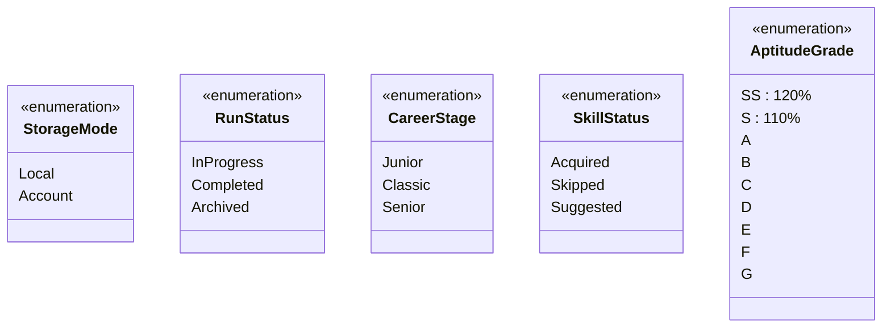
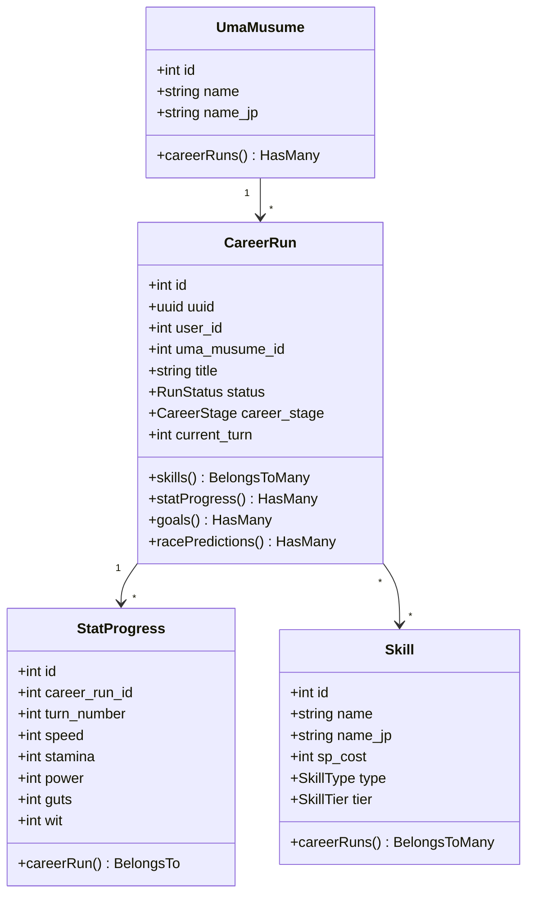
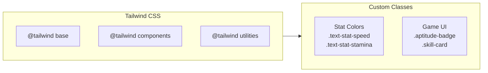

# D10 - Source Code Documentation

## Uma Musume Career Planner

**Document Version:** 2.0  
**Date:** 2026-01-03  
**Status:** Draft

---

## Table of Contents

1. [Introduction](#1-introduction)
2. [Directory Structure](#2-directory-structure)
3. [Key Namespaces & Classes](#3-key-namespaces--classes)
4. [Frontend Code Structure](#4-frontend-code-structure)
5. [API Reference](#5-api-reference)
6. [Coding Standards](#6-coding-standards)

---

## 1. Introduction

This document provides a map of the source code structure for the Uma Musume Career Planner. It serves as a guide for developers navigating the Laravel codebase, specifically focusing on the new Service Layer and Livewire components implementation.

### 1.1 Architecture Overview

```mermaid
flowchart TB
    subgraph Presentation["Presentation Layer"]
        Blade["Blade Templates"]
        Livewire["Livewire Components"]
        Alpine["Alpine.js"]
    end
    
    subgraph Application["Application Layer"]
        Controllers["Controllers"]
        Services["Services"]
        Actions["Actions"]
    end
    
    subgraph Domain["Domain Layer"]
        Models["Eloquent Models"]
        Enums["Enums"]
    end
    
    subgraph Infrastructure["Infrastructure Layer"]
        Database[(Database)]
        Cache["Cache"]
        Storage["File Storage"]
    end
    
    Blade --> Livewire
    Livewire --> Alpine
    Livewire --> Services
    Controllers --> Services
    Services --> Models
    Models --> Enums
    Models --> Database
    Services --> Cache
    
    style Presentation fill:#e3f2fd
    style Application fill:#f3e5f5
    style Domain fill:#e8f5e9
    style Infrastructure fill:#fff3e0
```text

---

## 2. Directory Structure

### 2.1 Top-Level Structure

```mermaid
flowchart TD
    Root["/"]
    
    Root --> App["app/"]
    Root --> Database["database/"]
    Root --> Resources["resources/"]
    Root --> Routes["routes/"]
    Root --> Tests["tests/"]
    
    App --> Actions["Actions/"]
    App --> Enums["Enums/"]
    App --> Http["Http/"]
    App --> Livewire["Livewire/"]
    App --> Models["Models/"]
    App --> Services["Services/"]
    App --> View["View/"]
    
    Database --> Factories["factories/"]
    Database --> Migrations["migrations/"]
    Database --> Seeders["seeders/"]
    
    Resources --> CSS["css/"]
    Resources --> JS["js/"]
    Resources --> Views["views/"]
```

### 2.2 Directory Details

```text
/
├── app/
│   ├── Actions/        # Fortify/Jetstream Actions (Auth)
│   ├── Enums/          # PHP 8.1 Enums (Status, Types)
│   ├── Exports/        # Excel Export Classes
│   ├── Http/           # Controllers (API), Middleware
│   ├── Livewire/       # Livewire Components (Logic)
│   ├── Models/         # Eloquent Models
│   ├── Services/       # Business Logic Layer
│   └── View/           # Blade View Components
├── database/
│   ├── factories/      # Model Factories
│   ├── migrations/     # Schema Definitions
│   └── seeders/        # Initial Data Population
├── resources/
│   ├── css/            # Tailwind CSS
│   ├── js/             # Alpine.js & App Scripts
│   └── views/          # Blade Templates
├── routes/
│   ├── api.php         # API Routes
│   └── web.php         # Web Routes
└── tests/
    ├── Feature/        # Feature Tests
    └── Unit/           # Unit Tests
```text

---

## 3. Key Namespaces & Classes

### 3.1 `App\Enums`

Strict typing for domain concepts using PHP 8.1 Enums.



| Enum | Values | Usage |
| --- | --- | --- |
| `StorageMode` | Local, Account | Determines data storage location |
| `RunStatus` | InProgress, Completed, Archived | Plan lifecycle status |
| `CareerStage` | Junior, Classic, Senior | Training phase |
| `SkillStatus` | Acquired, Skipped, Suggested | Skill tracking status |
| `AptitudeGrade` | SS, S, A, B, C, D, E, F, G | Character aptitude ratings |

### 3.2 `App\Services`

The core business logic, decoupled from HTTP/UI.

```mermaid
classDiagram
    class CareerRunService {
        +create(array data) CareerRun
        +update(CareerRun run, array data) CareerRun
        +updateStats(CareerRun run, array stats) CareerRun
        +delete(CareerRun run) bool
        +calculateEffectiveStats(int rawValue) int
    }
    
    class SkillService {
        +search(string query) Collection
        +getByType(string type) Collection
        +attachToRun(CareerRun run, Skill skill) void
    }
    
    class LocalRunStorageService {
        +validateSchema(array json) bool
        +generateUuid() string
        +convertToAccount(array localRun) CareerRun
    }
    
    class ImportService {
        +import(UploadedFile file, StorageMode target) ImportResult
        +detectFormat(UploadedFile file) ImportFormat
        +validate(array data) ValidationResult
    }
    
    CareerRunService --> SkillService : uses
    ImportService --> LocalRunStorageService : uses
    ImportService --> CareerRunService : uses
```text

#### Service Descriptions

| Service | Responsibility |
| --- | --- |
| `CareerRunService` | Handles creation, updates, and soft-deletes of plans. Calculates aggregates. |
| `SkillService` | Manages skill catalog and search functionality. |
| `LocalRunStorageService` | Handles logic for LocalStorage data structures (Schema validation, UUID generation). Used for Import/Convert logic. |
| `ImportService` | Orchestrates the import process from various file formats. |

### 3.3 `App\Livewire`

UI Components with server-side logic.

```mermaid
flowchart TD
    subgraph CareerRun["App\Livewire\CareerRun"]
        PlanList["PlanList<br/>Filterable list"]
        PlanForm["PlanForm<br/>Shared form logic"]
        PlanEditor["PlanEditor<br/>Main editor"]
        QuickCreate["QuickCreate<br/>Modal form"]
    end
    
    subgraph Skills["App\Livewire\Skills"]
        SkillSearch["SkillSearch<br/>Autocomplete"]
        SkillList["SkillList<br/>Attached skills"]
    end
    
    subgraph Stats["App\Livewire\Stats"]
        StatsDisplay["StatsDisplay<br/>Current stats"]
        StatsChart["StatsChart<br/>Progress chart"]
    end
    
    PlanEditor --> SkillList
    PlanEditor --> StatsDisplay
    PlanEditor --> StatsChart
    PlanList --> QuickCreate
```

| Component | Namespace | Description |
| --- | --- | --- |
| `PlanList` | `App\Livewire\CareerRun` | Filterable list of plans with pagination |
| `PlanForm` | `App\Livewire\CareerRun` | Shared form logic for create/edit |
| `PlanEditor` | `App\Livewire\CareerRun` | Main monolithic editor managing tabs |
| `QuickCreate` | `App\Livewire\CareerRun` | Modal form for quick plan creation |
| `SkillSearch` | `App\Livewire\Skills` | Autocomplete skill search |
| `SkillList` | `App\Livewire\Skills` | Display attached skills |

### 3.4 `App\Models`

Eloquent ORM definitions.



### 4.2 `resources/js/app.js`

Entry point for JavaScript.

```javascript
// Initialization flow
import Alpine from 'alpinejs';

// Register stores
Alpine.store('localRuns', { /* ... */ });
Alpine.store('preferences', { /* ... */ });
Alpine.store('drafts', { /* ... */ });

// Global event listeners
window.addEventListener('toast', (e) => { /* ... */ });
window.addEventListener('connection-lost', () => { /* ... */ });

Alpine.start();
```text

### 4.3 `resources/css/app.css`



| Custom Class | Purpose |
| --- | --- |
| `.text-stat-speed` | Speed stat color (blue) |
| `.text-stat-stamina` | Stamina stat color (orange) |
| `.text-stat-power` | Power stat color (red) |
| `.text-stat-guts` | Guts stat color (pink) |
| `.text-stat-wit` | Wit stat color (green) |
| `.aptitude-badge` | Aptitude grade badge styling |
| `.skill-card` | Skill display card styling |

---

## 5. API Reference

### 5.1 Service Layer Methods

#### `CareerRunService::calculateEffectiveStats`

```mermaid
flowchart TD
    Input["Raw Stat Value"]
    Check{"> 1200?"}
    
    Input --> Check
    Check -->|"No"| Return1["Return raw value"]
    Check -->|"Yes"| Calculate["1200 + floor((raw - 1200) / 2)"]
    Calculate --> Return2["Return calculated value"]
```text

| Property | Value |
| --- | --- |
| **Description** | Validates stat value is within 0-1200 range (hard max) |
| **Signature** | `public function validateStat(int $rawValue): bool` |
| **Logic** | `return $raw >= 0 && $raw <= 1200;` |

#### `ImportService::detectFormat`

```mermaid
flowchart TD
    File["Uploaded File"]
    
    File --> Ext{"Extension?"}
    Ext -->|".json"| JSON["Check JSON structure"]
    Ext -->|".csv"| CSV["Return CSV format"]
    Ext -->|"other"| Unknown["Return Unknown"]
    
    JSON --> Schema{"Has schema_version?"}
    Schema -->|"Yes"| Standard["Return Standard JSON"]
    Schema -->|"No"| Legacy["Return Legacy JSON"]
```

| Property | Value |
| --- | --- |
| **Description** | Analyzes an uploaded file to determine if it is a JSON export, CSV, or legacy format |
| **Signature** | `public function detectFormat(UploadedFile $file): ImportFormat` |
| **Returns** | `ImportFormat` enum (StandardJson, LegacyJson, Csv, Unknown) |

### 5.2 Route Reference

```mermaid
flowchart LR
    subgraph Web["Web Routes (web.php)"]
        Home["/"]
        Plans["/plans"]
        PlansLocal["/plans/local/{uuid}"]
        PlansId["/plans/{id}"]
    end
    
    subgraph API["API Routes (api.php)"]
        SkillSearch["/internal/skills/search"]
        Import["/api/plans/import"]
        Export["/api/plans/export"]
    end
```text

| Route | Method | Controller/Component | Description |
| --- | --- | --- | --- |
| `/` | GET | `HomeController` | Dashboard |
| `/plans` | GET | `PlanList` (Livewire) | Plan listing |
| `/plans/{id}` | GET | `PlanEditor` (Livewire) | Edit account plan |
| `/plans/local/{uuid}` | GET | `PlanEditor` (Livewire) | Edit local plan |
| `/internal/skills/search` | GET | `SkillController` | Skill autocomplete |
| `/api/plans/import` | POST | `ImportController` | Import plans |
| `/api/plans/export` | GET | `ExportController` | Export plans |

---

## 6. Coding Standards

### 6.1 Standards Overview

```mermaid
mindmap
  root((Coding Standards))
    PHP
      PSR-12
      Strict Types
      Type Hints
    JavaScript
      ESLint Standard
      ES6+ Syntax
    CSS
      Tailwind First
      BEM for Custom
    Testing
      Pest PHP
      Vitest
```

### 6.2 Naming Conventions

```mermaid
flowchart LR
    subgraph PHP["PHP Naming"]
        Classes["Classes: PascalCase<br/>CareerRun"]
        Methods["Methods: camelCase<br/>calculateStats()"]
        Properties["Properties: camelCase<br/>$currentTurn"]
    end
    
    subgraph JS["JavaScript Naming"]
        Functions["Functions: camelCase<br/>handleSubmit()"]
        Variables["Variables: camelCase<br/>isLoading"]
        Constants["Constants: UPPER_SNAKE<br/>MAX_TURNS"]
    end
    
    subgraph DB["Database Naming"]
        Tables["Tables: snake_case plural<br/>career_runs"]
        Columns["Columns: snake_case<br/>turn_number"]
    end
```text

| Context | Convention | Example |
| --- | --- | --- |
| PHP Classes | PascalCase | `CareerRun`, `SkillService` |
| PHP Methods/Variables | camelCase | `calculateStats`, `$currentTurn` |
| JavaScript Functions | camelCase | `handleSubmit`, `fetchData` |
| JavaScript Constants | UPPER_SNAKE_CASE | `MAX_TURNS`, `API_URL` |
| Database Tables | snake_case (plural) | `career_runs`, `skill_career_runs` |
| Database Columns | snake_case | `turn_number`, `total_sp_available` |
| CSS Classes | kebab-case | `skill-card`, `stat-display` |

### 6.3 File Organization

| File Type | Location | Naming |
| --- | --- | --- |
| Livewire Components | `app/Livewire/` | PascalCase (e.g., `PlanEditor.php`) |
| Services | `app/Services/` | PascalCase + Service (e.g., `CareerRunService.php`) |
| Models | `app/Models/` | PascalCase singular (e.g., `CareerRun.php`) |
| Enums | `app/Enums/` | PascalCase (e.g., `RunStatus.php`) |
| Blade Views | `resources/views/` | kebab-case (e.g., `plan-editor.blade.php`) |
| Tests | `tests/` | PascalCase + Test (e.g., `CareerRunServiceTest.php`) |

### 6.4 Testing Standards

```mermaid
pie title Test Distribution
    "Unit Tests" : 40
    "Feature Tests" : 35
    "Browser Tests" : 15
    "E2E Tests" : 10
```

| Test Type | Framework | Location | Purpose |
| --- | --- | --- | --- |
| Unit | Pest PHP | `tests/Unit/` | Service methods, helpers |
| Feature | Pest PHP | `tests/Feature/` | HTTP endpoints, Livewire |
| Browser | Laravel Dusk | `tests/Browser/` | UI interactions |
| E2E | Playwright | `tests/e2e/` | Full user flows |

---

## Document History

| Version | Date | Author | Changes |
| --- | --- | --- | --- |
| 1.0 | 2026-01-03 | Development Team | Initial draft |
| 2.0 | 2026-01-03 | Development Team | Added Mermaid diagrams, expanded documentation |
