# D17 - System User Manual

## Uma Musume Career Planner

**Document Version:** 2.0  
**Date:** 2026-01-03  
**Status:** Draft

---

## Table of Contents

1. [Introduction](#1-introduction)
2. [Getting Started](#2-getting-started)
3. [Managing Career Plans](#3-managing-career-plans)
4. [Data Features](#4-data-features)
5. [Troubleshooting](#5-troubleshooting)
6. [Support](#6-support)

---

## 1. Introduction

Welcome to the **Uma Musume Career Planner**, your comprehensive tool for planning, tracking, and analyzing your training runs in *Uma Musume: Pretty Derby*.

This manual guides you through using the application, managing your training plans, and understanding the data provided.

### 1.1 Application Overview

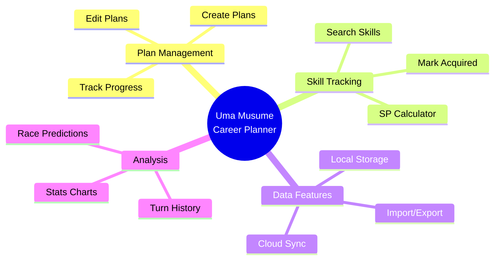

### 1.2 Key Features

| Feature | Description |
| --- | --- |
| **Dual Storage Modes** | Choose between Local (browser) or Account (cloud) storage |
| **Skill Management** | Search, track, and manage skills with SP calculations |
| **Turn Tracking** | Log stats turn-by-turn with visual progress charts |
| **Import/Export** | Backup and restore your data in JSON format |
| **Offline Support** | Continue working even without internet connection |

---

## 2. Getting Started

### 2.1 Storage Modes: Local vs. Account

The tracker supports two ways to save your data:

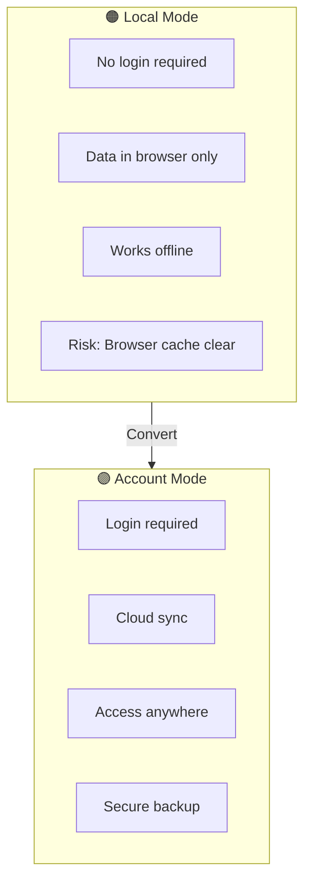

#### Local Mode (No Login Required)

| Aspect | Details |
| --- | --- |
| **Pros** | Instant start, no account needed, works offline |
| **Cons** | Data stays on this browser/device only. If you clear browser cache, data is lost |
| **Best for** | Quick tests, anonymous usage |
| **Indicator** | Orange "Local" badge |

#### Account Mode (Login Required)

| Aspect | Details |
| --- | --- |
| **Pros** | Data syncs across devices, secure cloud backup, never lost |
| **Cons** | Requires internet connection |
| **Best for** | Long-term tracking, accessing data on phone and PC |
| **Indicator** | Purple "Account" badge |

> **Tip:** You can start in Local Mode and convert your plans to Account Mode later by signing up!

### 2.2 Dashboard Overview

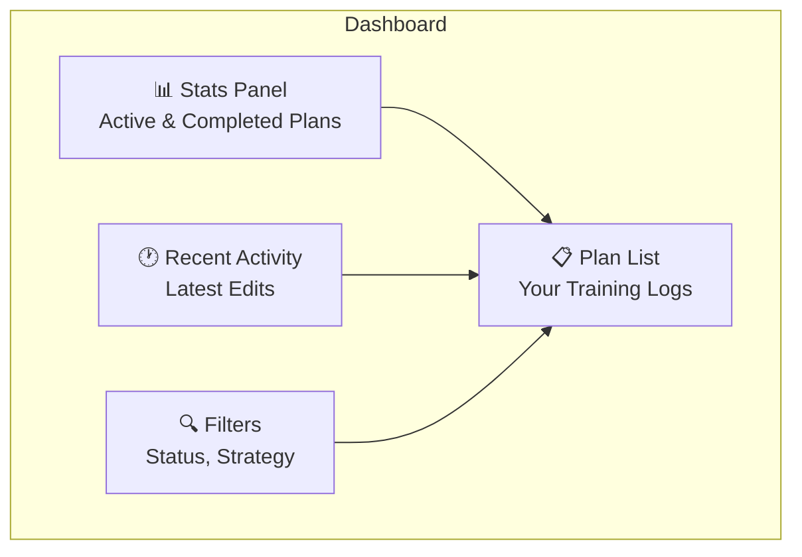

The **Dashboard** is your home base:

| Section | Description |
| --- | --- |
| **Stats Panel** | Shows how many active and completed plans you have |
| **Recent Activity** | Shows your latest edits |
| **Plan List** | Your training logs with filtering options |
| **Filters** | Sort by Status (In Progress/Completed) or Strategy |

---

## 3. Managing Career Plans

### 3.1 Creating a Plan

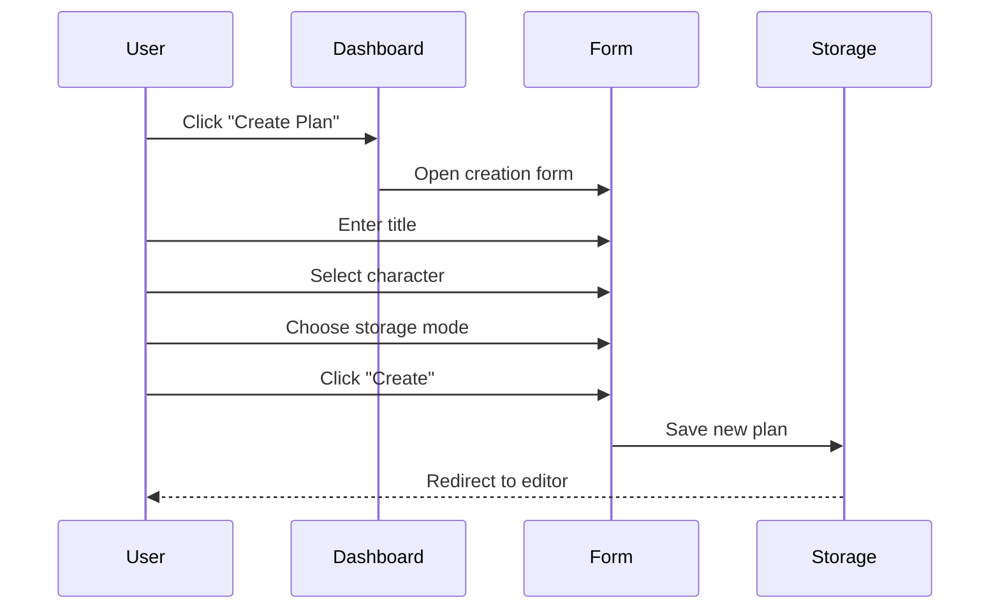

**Steps:**

1. Click the **"Create Plan"** button on the Dashboard
2. **Title:** Give your run a name (e.g., "Speed Suzuka V1")
3. **Character:** Select the Uma Musume you are training
4. **Mode:** Choose "Local" or "Account"
5. Click **Create**

### 3.2 Editing a Plan

The Plan Editor has several tabs:

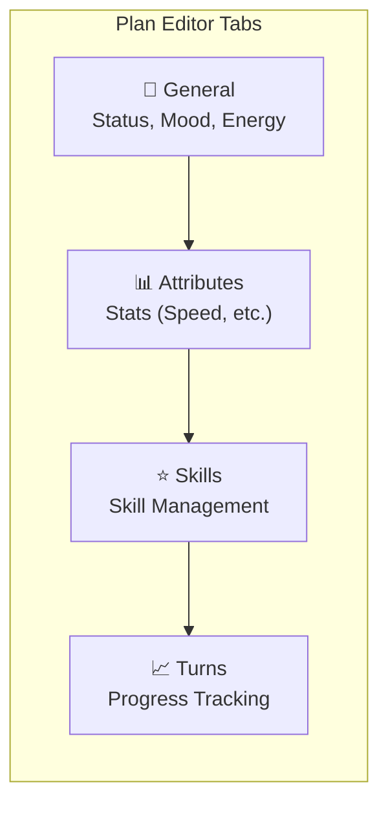

| Tab | Purpose |
| --- | --- |
| **General** | Update status (Junior/Classic/Senior), Mood, and Energy |
| **Attributes** | Enter your current Speed, Stamina, Power, Guts, and Wit. The circle fills up to 1200 (max) |
| **Skills** | Search and add skills. Mark them as "Acquired" when you buy them in-game |
| **Turns** | Log your stats turn-by-turn to see a progress chart |

### 3.3 Skill Management

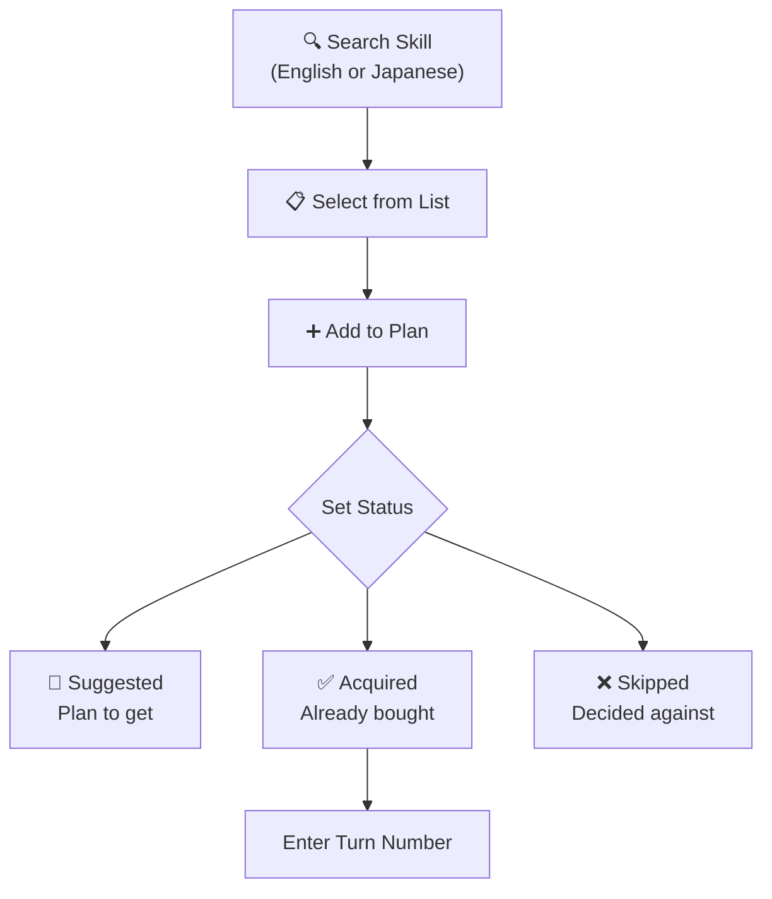

**How to manage skills:**

| Action | Steps |
| --- | --- |
| **Add Skill** | Type the skill name (English or Japanese). Select from the list |
| **Set Status** | Choose Suggested, Acquired, or Skipped |
| **Track Acquisition** | When marking as "Acquired", enter the turn number |

**Skill Status Types:**

| Status | Meaning |
| --- | --- |
| 💭 **Suggested** | You plan to get this skill |
| ✅ **Acquired** | You bought it (enter the turn number!) |
| ❌ **Skipped** | You decided against it |

**SP Calculator:** The bottom of the Skills tab shows how much SP you have spent vs. how much you need.

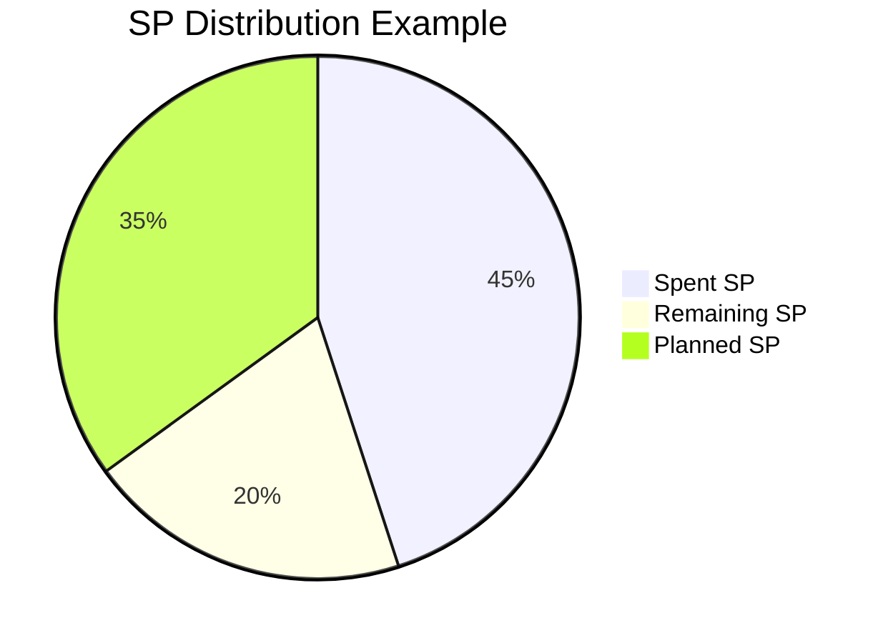

---

## 4. Data Features

### 4.1 Import / Export

Back up your data or move it between devices.

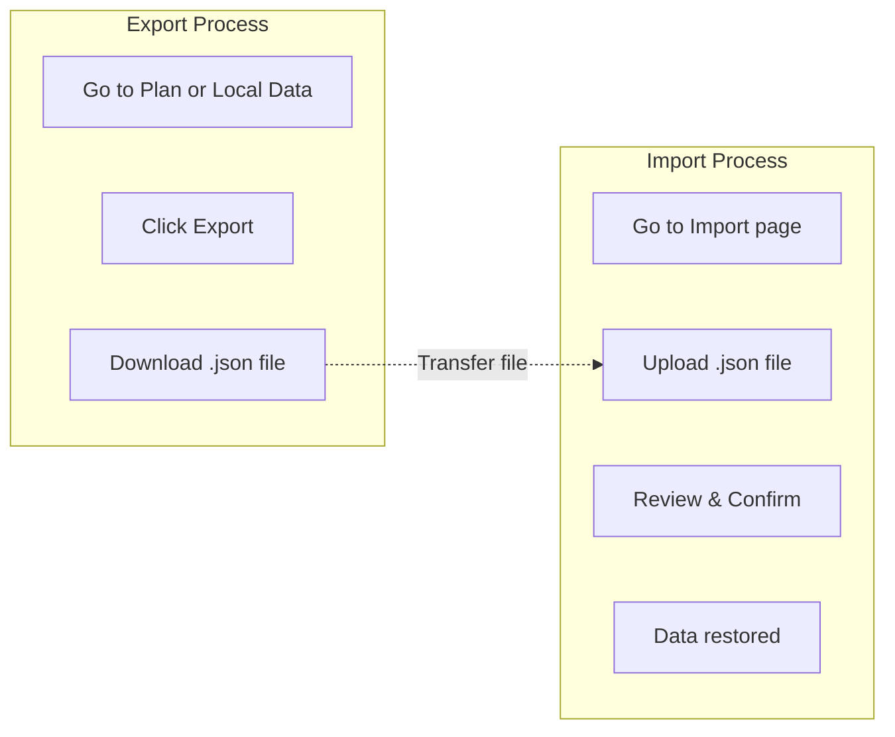

**Export Steps:**

1. Go to a Plan or the **Local Data** page
2. Click **Export**
3. Download the `.json` file

**Import Steps:**

1. Go to the Import page
2. Upload a `.json` file
3. Review the preview
4. Confirm to restore plans

### 4.2 Converting Local to Account

If you have Local plans and want to save them to the cloud:

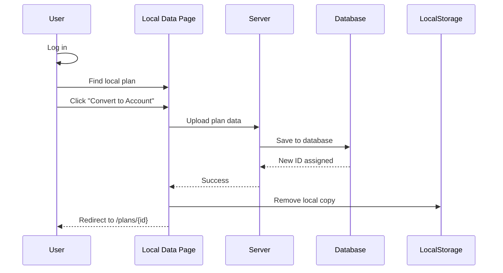

**Steps:**

1. Log in to your account
2. Go to **Local Data** or find the plan in the list
3. Click **"Convert to Account"**
4. The plan is uploaded to the database and removed from Local storage (unless you check "Keep local copy")

---

## 5. Troubleshooting

### 5.1 Common Issues

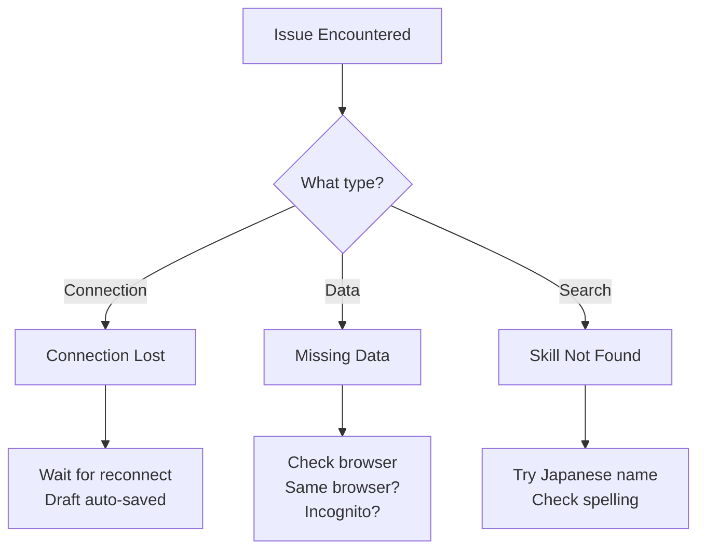

### 5.2 Issue Solutions

| Issue | Cause | Solution |
| --- | --- | --- |
| **"Connection Lost"** | Internet dropped while editing Account plan | App enters Offline Mode. Changes saved as "Draft" on device. When internet returns, you'll be asked to save the draft |
| **Missing Local Data** | Different browser or cleared cache | Ensure you're using the same browser. Incognito mode deletes data when closed |
| **Skill Not Found** | Name mismatch | Try typing part of the Japanese name if the English name isn't working |
| **Stats Not Saving** | Form not submitted | Make sure to click "Save" after making changes |
| **Slow Performance** | Too many plans | Archive old completed plans to improve loading speed |

### 5.3 Offline Mode

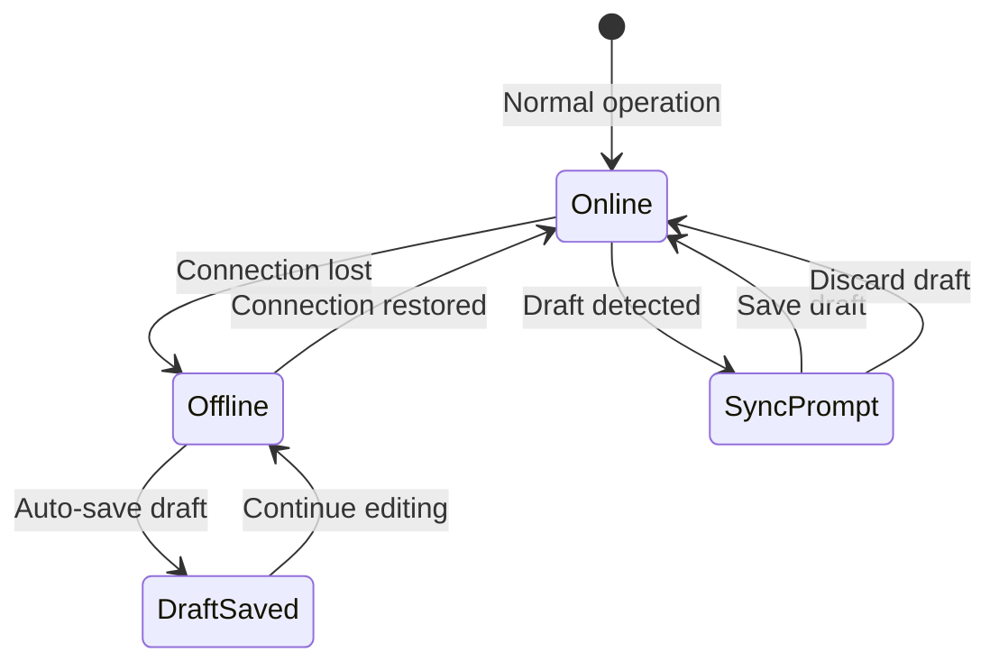

When your internet connection drops:

1. The app automatically enters **Offline Mode**
2. Your changes are saved as a **Draft** in your browser
3. When connection returns, you'll see a prompt to save or discard the draft
4. Your data is never lost!

---

## 6. Support

### 6.1 Getting Help

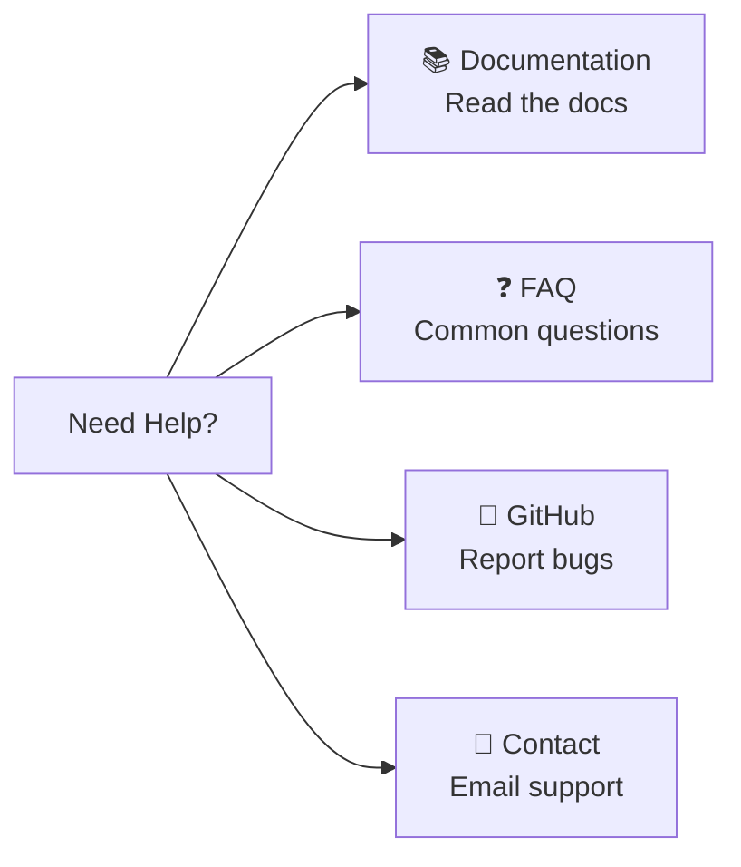

| Resource | Description |
| --- | --- |
| **Documentation** | Full system documentation in the `/docs` folder |
| **FAQ** | Frequently asked questions on the Help page |
| **GitHub** | Report bugs or request features |
| **Contact** | Email support for urgent issues |

### 6.2 Reporting Bugs

When reporting a bug, please include:

- What you were trying to do
- What happened instead
- Your browser and device
- Screenshots if possible

---

## Quick Reference

### Keyboard Shortcuts

| Shortcut | Action |
| --- | --- |
| `Ctrl + S` | Save current plan |
| `Ctrl + N` | Create new plan |
| `Esc` | Close modal/dialog |

### Status Icons

| Icon | Meaning |
| --- | --- |
| 🟠 | Local Mode |
| 🟣 | Account Mode |
| 🟢 | In Progress |
| ✅ | Completed |
| 📦 | Archived |
| ⚠️ | Unsaved Changes |

---

## Document History

| Version | Date | Author | Changes |
| --- | --- | --- | --- |
| 1.0 | 2026-01-03 | Development Team | Initial draft |
| 2.0 | 2026-01-03 | Development Team | Added Mermaid diagrams, expanded content |
