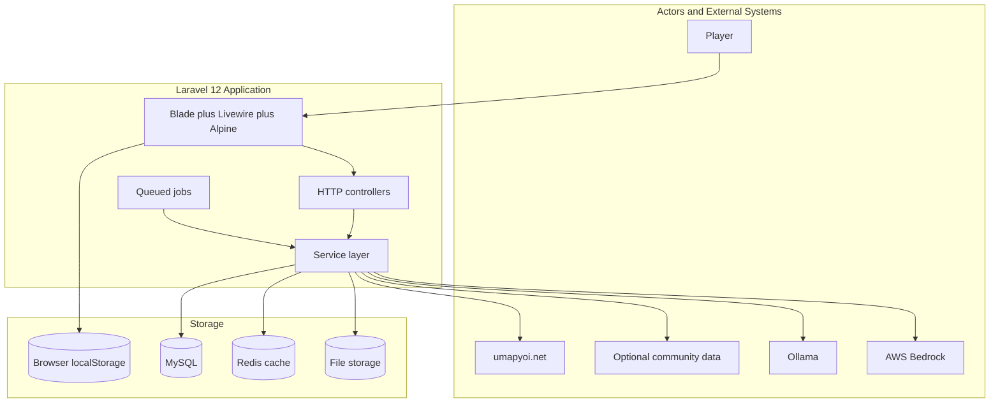
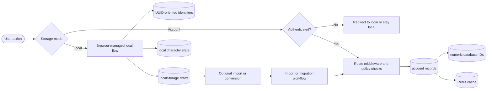
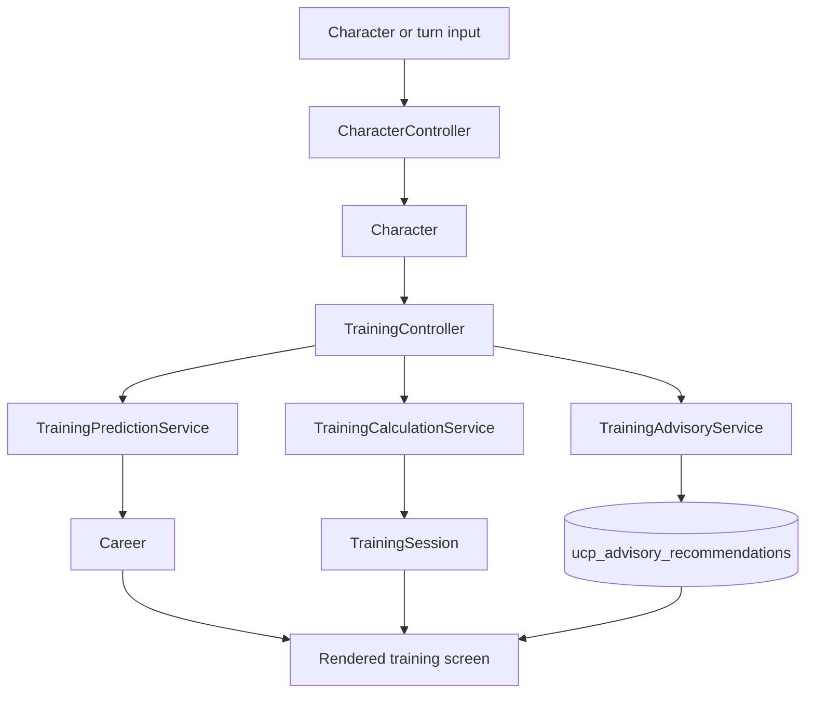
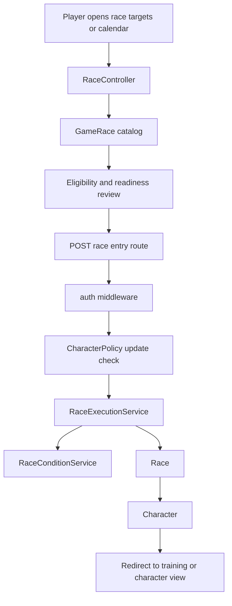
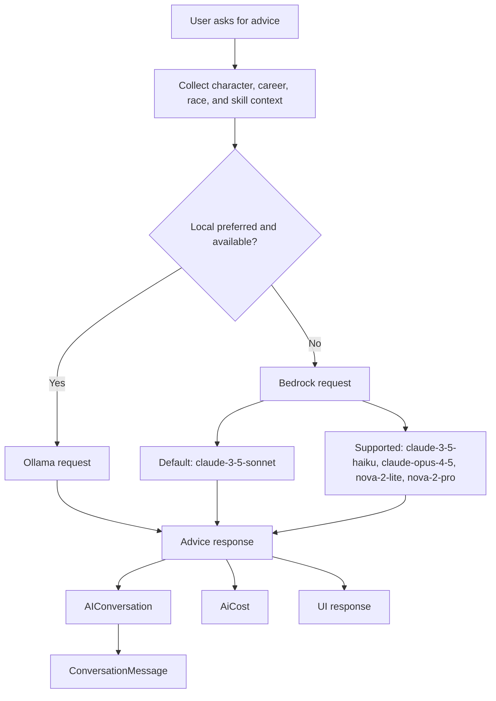
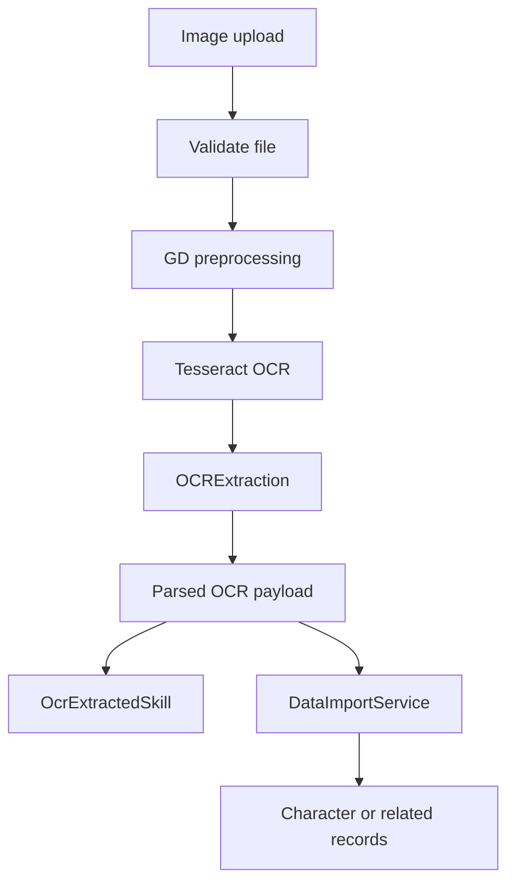

# Umamusume Pretty Derby Career Planner - Data Flow Diagram

**Document Version**: 2.4.2
**Date**: April 7, 2026
**Project**: Umamusume Pretty Derby Career Planner
**Author**: Development Team
**Status**: Current - repository-aligned diagrams using implemented routes, services, and storage patterns

---

## 1. Overview

> **Diagram scope**: Repository-aligned implementation reference. Flow labels match the current Laravel application where practical; some arrows are representative rather than exhaustive.

This document describes how data moves through the current application for character planning,
training, race entry, AI advisory, OCR, and import/export.

### 1.1 Implementation Anchors

- **Controllers**: `CharacterController`, `TrainingController`, `RaceController`,
`AIChatController`, `ImportController`, `ExportController`, `OCRUploadController`
- **Core Services**: `TrainingPredictionService`, `TrainingCalculationService`,
`TrainingAdvisoryService`, `RaceExecutionService`, `RaceConditionService`, `SkillService`,
`DataImportService`, `DataExportService`
- **Core Models**: `User`, `Character`, `Career`, `Race`, `GameRace`, `Skill`, `SkillHint`,
`SkillAcquisition`, `SupportDeck`, `AIConversation`, `ConversationMessage`, `OCRExtraction`
- **Storage Modes**: Browser local storage for local-first state and MySQL-backed persistence for
authenticated account mode

### 1.2 Documentation Rule for AI Models

The diagram set distinguishes between:

- **Configured defaults**: Current config defaults in `config/ai.php` and `config/neuron.php`
- **Supported providers/models**: Additional Bedrock and Ollama models available in configuration

This avoids mixing default and supported model references into a single inaccurate label.

### 1.3 Current Defaults and Supported Models

| Category | Current Default | Supported Alternatives |
| --- | --- | --- |
| Local AI | `llama3.3` via Ollama | `llama3`, `mistral`, `deepseek-r1`, `gemma3` |
| Bedrock default | `claude-3-5-sonnet` | `claude-3-5-haiku`, `claude-opus-4-5`, `nova-2-lite`, `nova-2-pro` |
| Neuron default provider | `anthropic` | `ollama`, `openai`, `gemini`, `mistral`, `deepseek`, others configured in `config/neuron.php` |

---

## 2. Context DFD



```text
[Player] --> [Blade plus Livewire plus Alpine] --> [HTTP controllers] --> [Service layer]
                                                                     |--> [MySQL]
                                                                     |--> [Redis cache]
                                                                     |--> [File storage]
                                                                     |--> [Ollama]
                                                                     |--> [AWS Bedrock]
                                                                     |--> [umapyoi.net]
                                                                     \--> [Optional community data]

[Blade plus Livewire plus Alpine] --> [Browser localStorage]

[Queued jobs] --> [Service layer]
```

### 2.1 Notes

- **Local mode** uses browser persistence for drafts and local-first planning state.
- **Account mode** uses authenticated routes and persistent relational data.
- **Status updates** are driven by jobs, cache state, and normal page refresh or polling-friendly UI
behavior, not a dedicated realtime transport layer.
- **External API usage** is implementation-backed for `umapyoi.net`; community and fallback sources
should be treated as optional or secondary.
- **External API resilience**: `umapyoi.net` fetch failures fall back to cached data; the
integration is wrapped in resilience handling. Refer to the System Integration Specification
(`008_SIS.md`) for circuit-breaker documentation.
- **Optional community data**: The `Optional community data` actor represents configurable secondary
sources. These are not hardcoded and are treated as optional augmentation, not authoritative
fallback.

---

## 3. Dual Storage DFD



```text
[User action] --> [Storage mode]
                  | local                                      | account
                  v                                            v
     [Browser-managed local flow]                  [Authenticated?]
         |        |        \                              | no              | yes
         v        v         v                             v                 v
 [UUID-oriented identifiers] [localStorage drafts] [local character state] [Redirect to login or stay
 local] [Route middleware and policy checks]
           |
           v                                                                                 v
 [Optional import or conversion] --> [Import or migration workflow] ----------------> [account
 records] --> [numeric database IDs] --> [Redis cache]
```

---

## 4. Character and Training Flow



```text
[Character or turn input] --> [CharacterController] --> [Character]
                                                      |
                                                      v
                                             [TrainingController]
                                              |        |        |
                                              v        v        v
                           [TrainingPredictionService] [TrainingCalculationService] [TrainingAdvisoryService]
                                              |        |        |
                                              v        v        v
                                          [Career] [TrainingSession] [ucp_advisory_recommendations]
                                                    \       |       /
                                                     \      |      /
                                                      v     v     v
                                                 [Rendered training screen]
```

---

## 5. Race Planning and Entry Flow



```text
[Player opens race targets or calendar] --> [RaceController] --> [GameRace catalog] --> [Eligibility
and readiness review]
                                                                                                                                                                                 |
                                                                                                                                                                                 v
                                                                                                                                                        [POST race entry route]
                                                                                                                                                                                 |
                                                                                                                                                                                 v
                                                                                                                                                                [auth middleware]
                                                                                                                                                                                 |
                                                                                                                                                                                 v
                                                                                                                                                            [CharacterPolicy update check]
                                                                                                                                                                                 |
                                                                                                                                                                                 v
                                                                                                                                             [RaceExecutionService] --> [RaceConditionService]
                                                                                                                                                                 |
                                                                                                                                                                 v
                                                                                                                                                             [Race] --> [Character] --> [Redirect to training or character view]
```

### 5.1 Route Reference

- `POST /characters/{character}/races/{gameRace}/enter`

---

## 6. AI Advisory Flow



```text
[User asks for advice] --> [Collect character, career, race, and skill context] --> [Local preferred and available?]
                                                                               | yes                         | no
                                                                               v                             v
                                                                  [Ollama request]          [Bedrock request] --> [Default: claude-3-5-sonnet]
                                                                                                               \--> [Supported: claude-3-5-haiku, claude-opus-4-5, nova-2-lite, nova-2-pro]

All model paths --> [Advice response] --> [AIConversation] --> [ConversationMessage]
                                         \--> [AiCost]
                                         \--> [UI response]
```

---

## 7. OCR and Import Flow



```text
[Image upload] --> [Validate file] --> [GD preprocessing] --> [Tesseract OCR] --> [OCRExtraction]
--> [Parsed OCR payload]
                                                                                                         |                     \
                                                                                                         v                      v
                                                                                              [OcrExtractedSkill]      [DataImportService] --> [Character or related records]
```

---

## 8. Performance and Monitoring Flow

| Area | Status | Implementation Anchor |
| --- | --- | --- |
| Application performance metrics | Implemented | `ApmService`, `PerformanceController` |
| API performance monitoring | Implemented | `ApiPerformanceMonitoringService` |
| AI cost tracking | Implemented | `AiCost`, `CostTrackingService` |
| Prediction accuracy tracking | Implemented | `PredictionAccuracy` |
| MCP tool usage tracking | Implemented | `MCPToolUsage` |
| Alert fan-out channels | Partial | alert breadth should not be overstated |
| Regression automation windows | Partial | `PerformanceRegressionService` exists; avoid exact unsupported claims |

---

## 9. Related Documents

- [SPEC-006 - AI Advisory Technical Specification](../02-specs/SPEC-006_AI_Advisory_Technical.md)
- [SPEC-007 - External Integration Technical Specification](../02-specs/SPEC-007_External_Integration_Technical.md)
- [FLOW-003 - Race Strategy System Flow](../01-flows/FLOW-003_Race_Strategy_System.md)
- [FLOW-006 - AI Advisory System Flow](../01-flows/FLOW-006_AI_Advisory_System.md)
- [FLOW-007 - External Integration System Flow](../01-flows/FLOW-007_External_Integration_System.md)
