# Umamusume Career Planner - Data Flow Diagram (DFD)

**Document Version**: 2.4.0  
**Date**: February 22, 2026  
**Project**: UmamusumeCareerPlanner  
**Author**: Development Team  
**Status**: Current - Aligned with codebase v2.4.0 (571 routes, 3,316+ tests, 11,563+ assertions)

---

## Table of Contents

1. [Overview](#1-overview)
2. [Context Diagram (Level 0)](#2-context-diagram-level-0)
3. [Level 1 DFD - Major System Processes](#3-level-1-dfd---major-system-processes)
4. [Level 2 DFD - Training Optimization Engine](#4-level-2-dfd---training-optimization-engine)
5. [Level 2 DFD - AI Advisory System](#5-level-2-dfd---ai-advisory-system)
6. [Level 2 DFD - External Integration](#6-level-2-dfd---external-integration)
7. [Level 2 DFD - Data Management](#7-level-2-dfd---data-management)
8. [Level 2 DFD - Performance Monitoring (NEW)](#8-level-2-dfd---performance-monitoring-new)
9. [Data Store Specifications](#9-data-store-specifications)
10. [Data Flow Summary](#10-data-flow-summary)

---

## 1. Overview

### 1.1 Purpose

This document presents the Data Flow Diagrams for the Umamusume Pretty Derby Career Planner application, showing how data flows through the system from external sources, user inputs, and internal processes to provide optimization recommendations and analytics.

### 1.2 System Architecture

The system is built with:

- **Backend**: Laravel 12 (PHP 8.2+)
- **Frontend**: Livewire 4, Alpine.js 3, TailwindCSS v4
- **AI Integration**: Neuron AI v2.11 agents, Ollama (local), AWS Bedrock (cloud)
- **MCP Integration**: Model Context Protocol servers (30+ services)
- **Admin Panel**: Database, Log, Queue, SystemSettings, User controllers
- **External APIs**: umapyoi.net (primary), GameTora (scraping)
- **OCR Processing**: Tesseract with GD preprocessing

### 1.3 DFD Notation

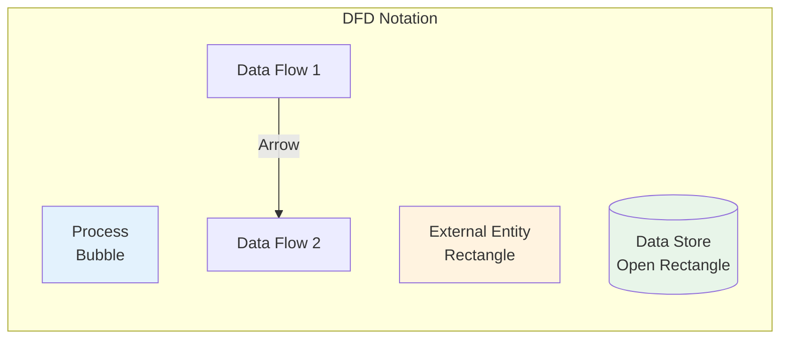

| Symbol | Meaning |
|--------|---------|
| Circle/Bubble | Process that transforms data |
| Rectangle | External entity (source/destination) |
| Open Rectangle | Data store (database, cache, file) |
| Arrow | Data flow direction |

---

## 2. Context Diagram (Level 0)

### 2.1 System Boundary

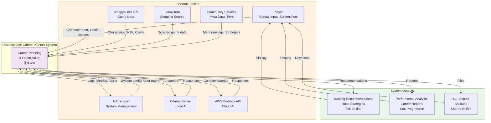

### 2.2 External Entity Descriptions

| Entity | Type | Description | Data Flow |
|--------|------|-------------|-----------|
| **Player** | Human | End user interacting with system | Input: Manual data, Screenshots, Goals Output: Recommendations, Analytics |
| **Admin** | Human | System administrator managing application | Input: Config changes, User management Output: Logs, Metrics, Alerts |
| **umapyoi.net API** | System | Primary external game data source | Input: Character catalog, Skills, Support cards |
| **GameTora** | System | Secondary data source (scraping) | Input: Scraped game data |
| **Community Sources** | System | Meta rankings and strategies | Input: Tier lists, Meta data |
| **Ollama Server** | System | Local AI inference engine | Input: AI queries Output: Recommendations |
| **AWS Bedrock API** | System | Cloud AI fallback | Input: Complex queries Output: Recommendations |

---

## 3. Level 1 DFD - Major System Processes

### 3.1 Top-Level Processes

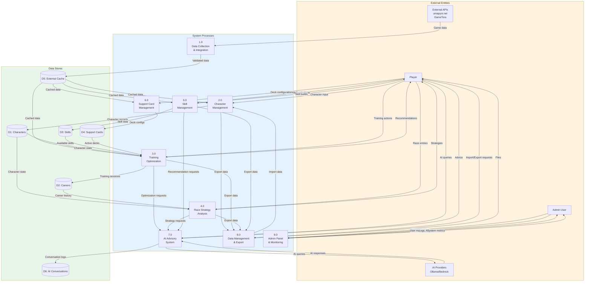

### 3.2 Process Descriptions

| Process | Name | Description | Key Inputs | Key Outputs |
|---------|------|-------------|------------|-------------|
| **1.0** | Data Collection & Integration | Aggregates external game data with caching and circuit breaker | External API responses | Validated, cached game data |
| **2.0** | Character Management | Manages character lifecycle, stats, aptitudes | User input, imported data | Character records |
| **3.0** | Training Optimization | Predicts stat gains, calculates bonuses, provides recommendations | Character state, support deck | Training predictions, recommendations |
| **4.0** | Race Strategy Analysis | Analyzes race requirements, calculates readiness, recommends strategies | Character stats, race data | Race strategies, win probabilities |
| **5.0** | Skill Management | Manages skill catalog, tracks hints, optimizes SP budget | Available skills, character SP | Skill recommendations, acquisition tracking |
| **6.0** | Support Card Management | Manages card inventory, builds decks, calculates synergy | Card collection, deck configs | Optimized decks, synergy scores |
| **7.0** | AI Advisory System | Provides intelligent recommendations via hybrid AI | User queries, context data | AI-powered advice, confidence scores |
| **8.0** | Data Management & Export | Handles import, export, backup, migration | User files, system data | Exported files, imported records |
| **9.0** | Admin Panel & Monitoring | System administration, user management, log viewing, queue monitoring | Admin requests, system metrics | Dashboard views, alerts, system config |

---

## 4. Level 2 DFD - Training Optimization Engine

### 4.1 Training Optimization Decomposition

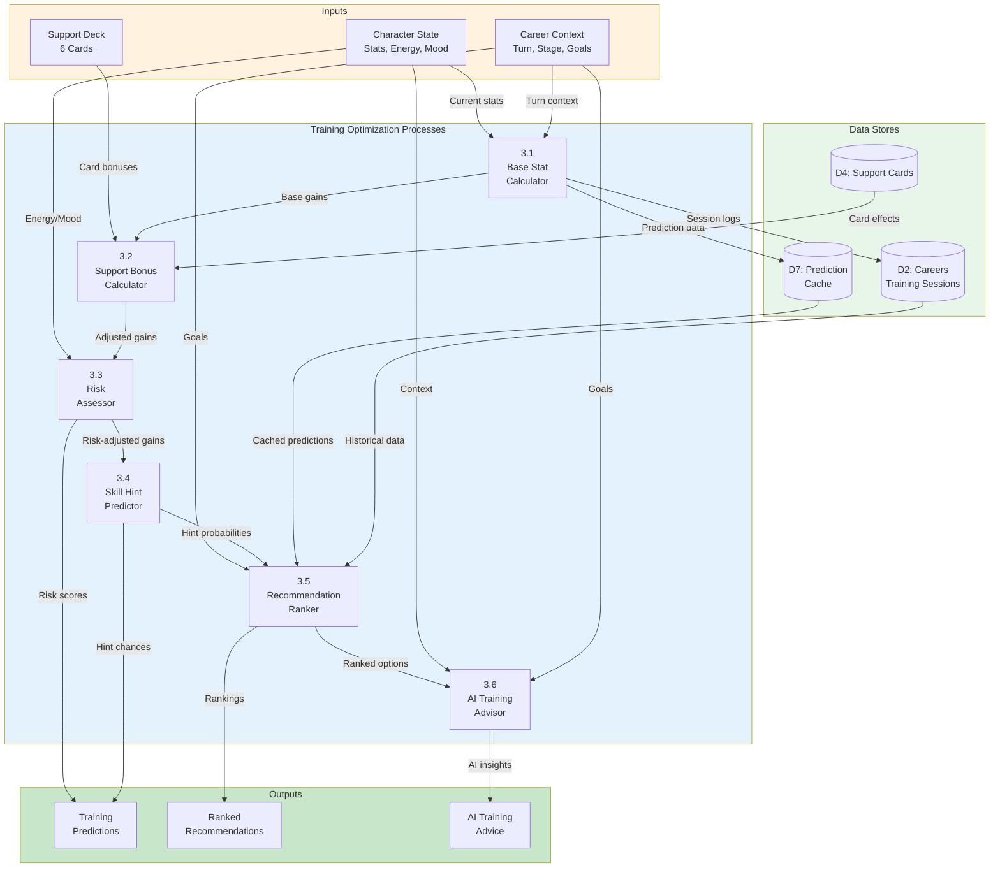

### 4.2 Training Process Details

| Sub-Process | Description | Algorithm | Caching |
|-------------|-------------|-----------|---------|
| **3.1 Base Stat Calculator** | Calculates raw stat gains per facility | Growth rates × Facility multipliers | No |
| **3.2 Support Bonus Calculator** | Applies support card bonuses and friendship multipliers | Bonus stacking with friendship thresholds | No |
| **3.3 Risk Assessor** | Calculates failure probability based on energy/mood/conditions | Risk score = f(energy, mood, conditions) | No |
| **3.4 Skill Hint Predictor** | Determines probability of skill hints per facility | Hint chance based on support participation | No |
| **3.5 Recommendation Ranker** | Ranks training options by expected value and alignment with goals | Multi-criteria scoring | 5 min TTL |
| **3.6 AI Training Advisor** | Provides intelligent training recommendations via Neuron agents | Neuron AI + Ollama/Bedrock | Session-based |

---

## 5. Level 2 DFD - AI Advisory System

### 5.1 AI Advisory Decomposition

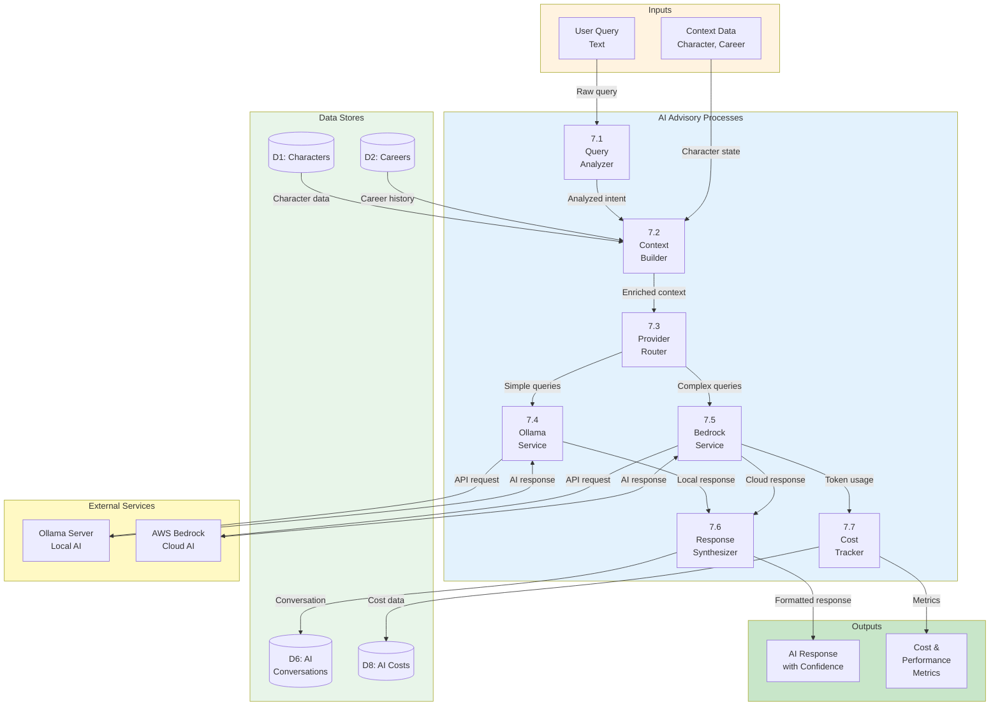

### 5.2 AI Advisory Process Details

| Sub-Process | Description | Implementation |
|-------------|-------------|----------------|
| **7.1 Query Analyzer** | Analyzes user query intent and complexity | Pattern matching, keyword extraction |
| **7.2 Context Builder** | Enriches query with character and career context | Data aggregation from multiple stores |
| **7.3 Provider Router** | Routes query to appropriate AI provider based on complexity | Ollama (simple) vs Bedrock (complex) |
| **7.4 Ollama Service** | Processes queries using local Ollama models | HTTP API client, timeout 30s |
| **7.5 Bedrock Service** | Processes queries using AWS Bedrock Claude models | AWS SDK, Claude Sonnet/Haiku |
| **7.6 Response Synthesizer** | Formats and enriches AI responses with confidence scores | JSON formatting, confidence calculation |
| **7.7 Cost Tracker** | Tracks token usage and calculates costs for cloud AI | Database persistence, budget monitoring |

---

## 6. Level 2 DFD - External Integration

### 6.1 External Integration Decomposition

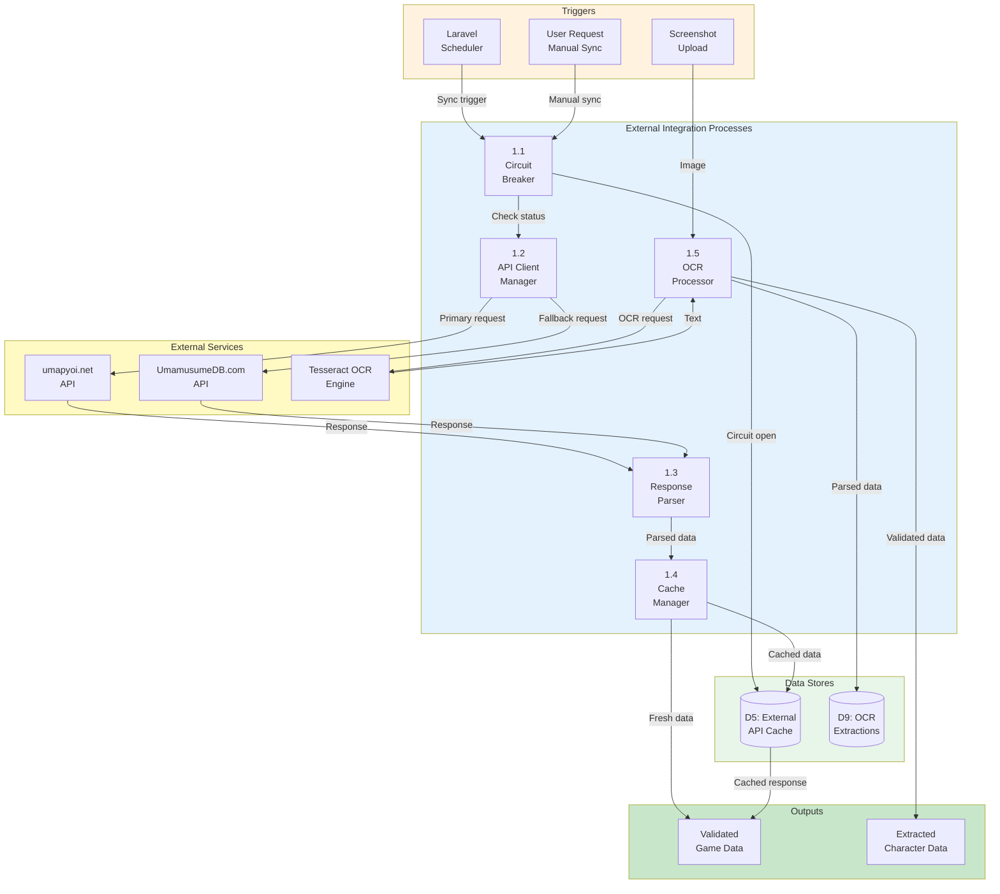

### 6.2 Integration Process Details

| Sub-Process | Description | Resilience Pattern |
|-------------|-------------|--------------------|
| **1.1 Circuit Breaker** | Monitors API health and opens circuit on failure threshold | Open after 5 failures in 120s window |
| **1.2 API Client Manager** | Manages connections to external APIs with fallback logic | Primary → Fallback → Cached |
| **1.3 Response Parser** | Parses and validates API responses against schema | JSON schema validation |
| **1.4 Cache Manager** | Stores and retrieves cached responses with TTL management | 24-hour TTL, Redis-backed |
| **1.5 OCR Processor** | Processes screenshots with GD preprocessing and Tesseract OCR | GD grayscale → threshold → OCR |

---

## 7. Level 2 DFD - Data Management

### 7.1 Data Management Decomposition

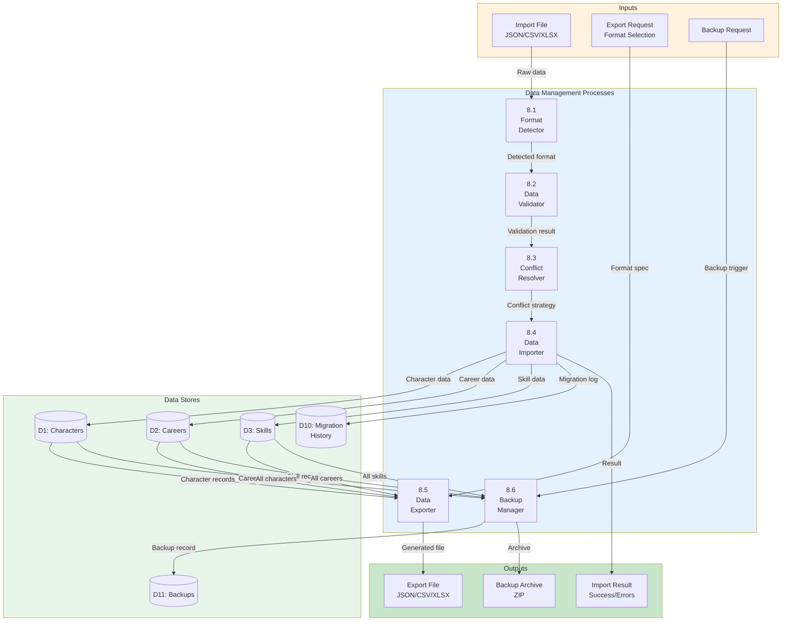

### 7.2 Data Management Process Details

| Sub-Process | Description | Supported Formats |
|-------------|-------------|-------------------|
| **8.1 Format Detector** | Detects import file format and schema version | JSON v1.0, CSV, XLSX, Legacy formats |
| **8.2 Data Validator** | Validates imported data against business rules | Stat ranges, enum values, relationships |
| **8.3 Conflict Resolver** | Resolves duplicate/conflict records using user strategy | Skip, Overwrite, Merge, Rename |
| **8.4 Data Importer** | Imports validated records into database with transaction management | Batch processing, rollback on error |
| **8.5 Data Exporter** | Exports data to requested format with schema versioning | JSON, CSV, XLSX with metadata |
| **8.6 Backup Manager** | Creates full backup archives with restore capability | ZIP with manifest, incremental support |

---

## 8. Level 2 DFD - Performance Monitoring (NEW)

### 8.1 Overview

The Performance Monitoring subsystem collects, aggregates, and analyzes application performance metrics to enable proactive optimization and alerting.

### 8.2 APM Data Flow Diagram

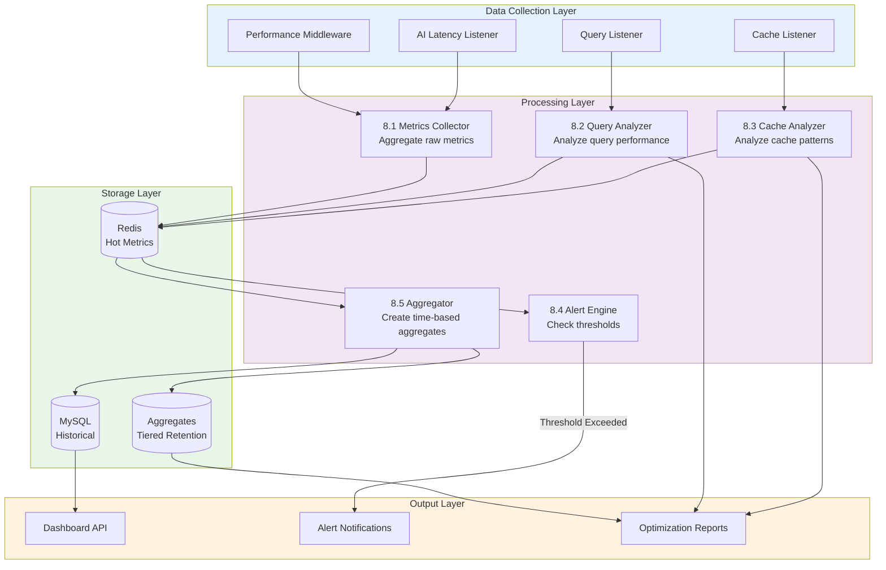

### 8.3 Process Specifications

| Process | Description | Key Inputs | Key Outputs |
|---------|-------------|------------|-------------|
| **8.1 Metrics Collector** | Collects request-level metrics from middleware | HTTP request data, timing info | Raw metrics records |
| **8.2 Query Analyzer** | Analyzes database queries for optimization | SQL queries, EXPLAIN plans | Query scores, suggestions |
| **8.3 Cache Analyzer** | Analyzes cache hit/miss patterns | Cache operations | Hit rates, TTL suggestions |
| **8.4 Alert Engine** | Compares metrics against thresholds | Aggregated metrics, thresholds | Alert notifications |
| **8.5 Aggregator** | Creates time-based metric aggregates | Raw metrics | Minute/hour/day aggregates |

### 8.4 Data Flows

| Flow | Source → Destination | Data Content |
|------|---------------------|--------------|
| **DF8.1** | Middleware → Metrics Collector | Request ID, endpoint, start time |
| **DF8.2** | Query Listener → Query Analyzer | SQL, duration, bindings |
| **DF8.3** | Cache Listener → Cache Analyzer | Key, operation, hit/miss, latency |
| **DF8.4** | Metrics Collector → Redis | JSON metrics record |
| **DF8.5** | Query Analyzer → Redis | Query performance score |
| **DF8.6** | Redis → Alert Engine | Aggregated metrics |
| **DF8.7** | Alert Engine → Notifications | Alert payload (Slack, Email) |
| **DF8.8** | Aggregator → MySQL | Minute/hour/day aggregates |

### 8.5 Performance Monitoring Services

| Service | Function |
|---------|----------|
| `ApmService` | Core APM coordination and metrics storage |
| `ApiPerformanceMonitoringService` | API endpoint performance tracking |
| `QueryOptimizationService` | Database query analysis |
| `PerformanceAlertingService` | Alert generation and delivery |
| `RedisCacheOptimizationService` | Cache analytics and optimization |
| `ApiResponseCachingService` | Response caching strategies |
| `PerformanceRegressionService` | Regression detection |
| `HistoricalTrackingService` | Long-term metrics storage |

---

## 9. Data Store Specifications

### 9.1 Primary Data Stores

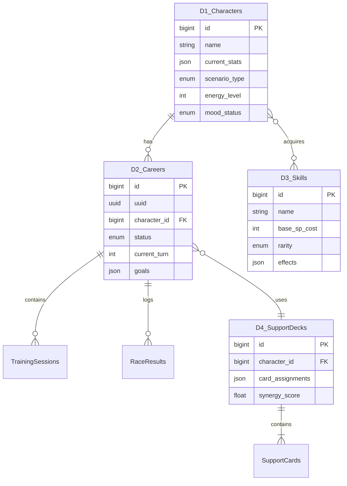

### 8.2 Data Store Catalog

| Store ID | Name | Type | Persistence | Description |
|----------|------|------|-------------|-------------|
| **D1** | Characters | MySQL | Permanent | Character records with stats and aptitudes |
| **D2** | Careers | MySQL | Permanent | Career run tracking and progression |
| **D3** | Skills | MySQL | Permanent | Skill catalog and acquisition history |
| **D4** | Support Cards | MySQL | Permanent | Support card inventory and deck configurations |
| **D5** | External API Cache | Redis | 24h TTL | Cached responses from external APIs |
| **D6** | AI Conversations | MySQL | 90 days | AI conversation history and context |
| **D7** | Prediction Cache | Redis | 5 min TTL | Training prediction results |
| **D8** | AI Costs | MySQL | Permanent | Token usage and cost tracking |
| **D9** | OCR Extractions | MySQL | Permanent | OCR processing results |
| **D10** | Migration History | MySQL | Permanent | Data migration audit trail |
| **D11** | Backups | File System | User-managed | Backup archives |

### 8.3 Cache Strategy

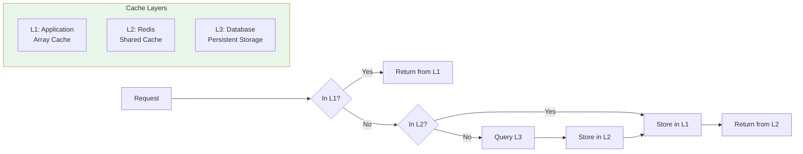

| Cache Level | Technology | Use Case | TTL |
|-------------|-----------|----------|-----|
| **L1 Application** | PHP Array | Request-scoped data | Request lifetime |
| **L2 Shared** | Redis | Cross-request data, predictions | 5 min - 24 hours |
| **L3 Database** | MySQL | Persistent data | Permanent |

---

## 10. Data Flow Summary

### 9.1 Critical Data Flows

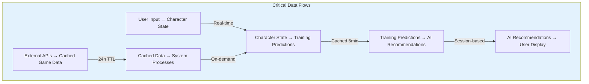

### 9.2 Data Flow Volumes

| Flow | Volume | Frequency | Latency Target |
|------|--------|-----------|----------------|
| User input → Character update | 1 record | Per action | < 200ms |
| Training predictions request | 6-8 options | Per turn | < 1.2s |
| AI advisory request | 1 query | As needed | < 2.5s |
| External API sync | 100-500 records | Daily | < 30s |
| OCR processing | 1 image | Manual | < 10s |
| Data export | 1-100 careers | Manual | < 60s |

### 9.3 Data Transformation Points

| Transformation | Input Format | Output Format | Process |
|----------------|--------------|---------------|---------|
| **External API Response** | JSON (external schema) | JSON (internal schema) | Schema mapping, validation |
| **OCR Text Extraction** | Image (PNG/JPG) | Structured text | GD preprocessing → Tesseract → Parsing |
| **Training Calculation** | Character state + Deck | Prediction array | Multi-step calculation pipeline |
| **AI Query** | Natural language | Structured response | Context enrichment → LLM → Formatting |
| **Export** | Database records | JSON/CSV/XLSX | Serialization with schema versioning |

### 9.4 Data Quality Controls

| Control Point | Validation | Error Handling |
|---------------|------------|----------------|
| **User Input** | Laravel validation rules | Return 422 with errors |
| **External API** | JSON schema validation | Fallback to cache or alternate API |
| **OCR Extraction** | Confidence threshold ≥ 80% | Manual correction UI |
| **AI Response** | Format and content validation | Retry with fallback provider |
| **Import Data** | Business rule validation | Preview + error report |

---

## Document Control

| Version | Date | Author | Changes |
|---------|------|--------|---------|
| 2.4.0 | 2026-02-22 | Development Team | Added Admin Panel data paths; updated external API references (GameTora); added Neuron AI v2.11 version; updated stats (571 routes, 3,316+ tests) |
| 2.3.0 | 2026-02-21 | Development Team | Updated version/date metadata; Livewire 3→4, Alpine.js→Alpine.js 3; aligned with 30 current Eloquent models |
| 2.2.0 | 2026-01-27 | Development Team | Added §8 Level 2 DFD - Performance Monitoring with 8 APM services; renumbered sections |
| 2.0.0 | 2026-01-23 | Development Team | Complete rewrite aligned with v2.0.0 implementation; added AI, MCP, external integration, and OCR flows; updated all diagrams and specifications |
| 1.0.0 | 2026-01-03 | Development Team | Initial draft |

---

## Related Documents

- [002_BRS - Business Requirements Specifications](002_BRS_Business_Requirements_Specifications.md)
- [003_SRS - Software Requirements Specifications](003_SRS_Software_Requirement_Specifications.md)
- [004_SDS - Software Design Specifications](004_SDS_Software_Design_Specifications.md)
- [007_SIP - Software Integration Plan](007_SIP_Software_Integration_Plan.md)
- [008_SIS - Software Integration Specifications](008_SIS_Software_Integration_Specifications.md)
- [009_DBD - Database Documentation](009_DBD_Database_Documentation.md)
- [SPEC-006 - AI Advisory Technical Specification](../specs/SPEC-006_AI_Advisory_Technical.md)
- [SPEC-007 - External Integration Technical Specification](../specs/SPEC-007_External_Integration_Technical.md)
- [FLOW-006 - AI Advisory System Flow](../flows/FLOW-006_AI_Advisory_System.md)
- [FLOW-007 - External Integration System Flow](../flows/FLOW-007_External_Integration_System.md)

---

*This DFD document provides comprehensive data flow analysis for the Umamusume Pretty Derby Career Planner v2.4.0, reflecting the current implementation architecture and integration patterns.*
