# Umamusume Career Planner - Data Flow Diagram (DFD)

**Document Version**: 2.4.0
**Date**: February 22, 2026
**Project**: UmamusumeCareerPlanner
**Author**: Development Team
**Status**: Current - Aligned with codebase v2.4.0 (571 routes, 3,316+ tests, 11,563+ assertions)

---

## Table of Contents

1. [Overview](#1-overview)
2. [Context Diagram (Level 0)](#2-context-diagram-level-0)
3. [Level 1 DFD - Major System Processes](#3-level-1-dfd---major-system-processes)
4. [Level 2 DFD - Training Optimization Engine](#4-level-2-dfd---training-optimization-engine)
5. [Level 2 DFD - AI Advisory System](#5-level-2-dfd---ai-advisory-system)
6. [Level 2 DFD - External Integration](#6-level-2-dfd---external-integration)
7. [Level 2 DFD - Data Management](#7-level-2-dfd---data-management)
8. [Level 2 DFD - Performance Monitoring (NEW)](#8-level-2-dfd---performance-monitoring-new)
9. [Data Store Specifications](#9-data-store-specifications)
10. [Data Flow Summary](#10-data-flow-summary)

---

## 1. Overview

### 1.1 Purpose

This document presents the Data Flow Diagrams for the Umamusume Pretty Derby Career Planner application, showing how data flows through the system from external sources, user inputs, and internal processes to provide optimization recommendations and analytics.

### 1.2 System Architecture

The system is built with:

- **Backend**: Laravel 12 (PHP 8.2+)
- **Frontend**: Livewire 4, Alpine.js 3, TailwindCSS v4
- **AI Integration**: Neuron AI v2.11 agents, Ollama (local), AWS Bedrock (cloud)
- **MCP Integration**: Model Context Protocol servers (30+ services)
- **Admin Panel**: Database, Log, Queue, SystemSettings, User controllers
- **External APIs**: umapyoi.net (primary), GameTora (scraping)
- **OCR Processing**: Tesseract with GD preprocessing

### 1.3 DFD Notation

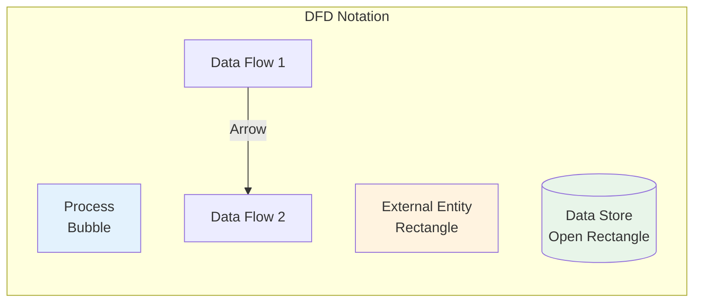

- **Symbol**: Circle/Bubble; **Meaning**: Process that transforms data
- **Symbol**: Rectangle; **Meaning**: External entity (source/destination)
- **Symbol**: Open Rectangle; **Meaning**: Data store (database, cache, file)
- **Symbol**: Arrow; **Meaning**: Data flow direction

---

## 2. Context Diagram (Level 0)

### 2.1 System Boundary

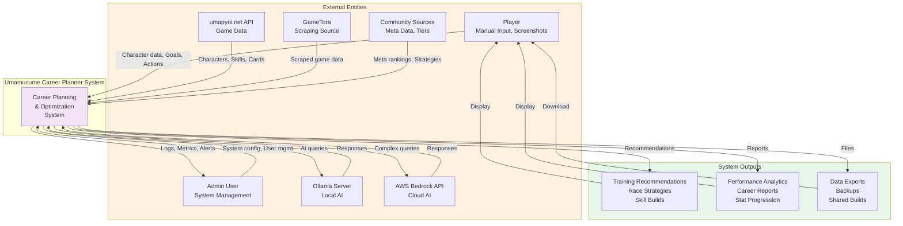

### 2.2 External Entity Descriptions

- **Entity**: **Player**; **Type**: Human; **Description**: End user interacting with system; **Data Flow**: Input: Manual data, Screenshots, Goals Output: Recommendations, Analytics
- **Entity**: **Admin**; **Type**: Human; **Description**: System administrator managing application; **Data Flow**: Input: Config changes, User management Output: Logs, Metrics, Alerts
- **Entity**: **umapyoi.net API**; **Type**: System; **Description**: Primary external game data source; **Data Flow**: Input: Character catalog, Skills, Support cards
- **Entity**: **GameTora**; **Type**: System; **Description**: Secondary data source (scraping); **Data Flow**: Input: Scraped game data
- **Entity**: **Community Sources**; **Type**: System; **Description**: Meta rankings and strategies; **Data Flow**: Input: Tier lists, Meta data
- **Entity**: **Ollama Server**; **Type**: System; **Description**: Local AI inference engine; **Data Flow**: Input: AI queries Output: Recommendations
- **Entity**: **AWS Bedrock API**; **Type**: System; **Description**: Cloud AI fallback; **Data Flow**: Input: Complex queries Output: Recommendations

---

## 3. Level 1 DFD - Major System Processes

### 3.1 Top-Level Processes

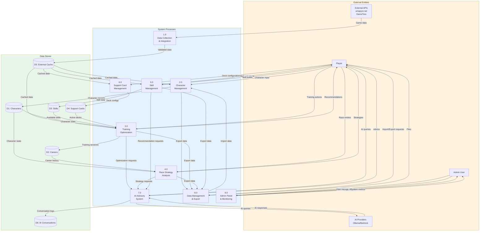

### 3.2 Process Descriptions

- **Process**: **1.0**; **Name**: Data Collection & Integration; **Description**: Aggregates external game data with caching and circuit breaker; **Key Inputs**: External API responses; **Key Outputs**: Validated, cached game data
- **Process**: **2.0**; **Name**: Character Management; **Description**: Manages character lifecycle, stats, aptitudes; **Key Inputs**: User input, imported data; **Key Outputs**: Character records
- **Process**: **3.0**; **Name**: Training Optimization; **Description**: Predicts stat gains, calculates bonuses, provides recommendations; **Key Inputs**: Character state, support deck; **Key Outputs**: Training predictions, recommendations
- **Process**: **4.0**; **Name**: Race Strategy Analysis; **Description**: Analyzes race requirements, calculates readiness, recommends strategies; **Key Inputs**: Character stats, race data; **Key Outputs**: Race strategies, win probabilities
- **Process**: **5.0**; **Name**: Skill Management; **Description**: Manages skill catalog, tracks hints, optimizes SP budget; **Key Inputs**: Available skills, character SP; **Key Outputs**: Skill recommendations, acquisition tracking
- **Process**: **6.0**; **Name**: Support Card Management; **Description**: Manages card inventory, builds decks, calculates synergy; **Key Inputs**: Card collection, deck configs; **Key Outputs**: Optimized decks, synergy scores
- **Process**: **7.0**; **Name**: AI Advisory System; **Description**: Provides intelligent recommendations via hybrid AI; **Key Inputs**: User queries, context data; **Key Outputs**: AI-powered advice, confidence scores
- **Process**: **8.0**; **Name**: Data Management & Export; **Description**: Handles import, export, backup, migration; **Key Inputs**: User files, system data; **Key Outputs**: Exported files, imported records
- **Process**: **9.0**; **Name**: Admin Panel & Monitoring; **Description**: System administration, user management, log viewing, queue monitoring; **Key Inputs**: Admin requests, system metrics; **Key Outputs**: Dashboard views, alerts, system config

---

## 4. Level 2 DFD - Training Optimization Engine

### 4.1 Training Optimization Decomposition

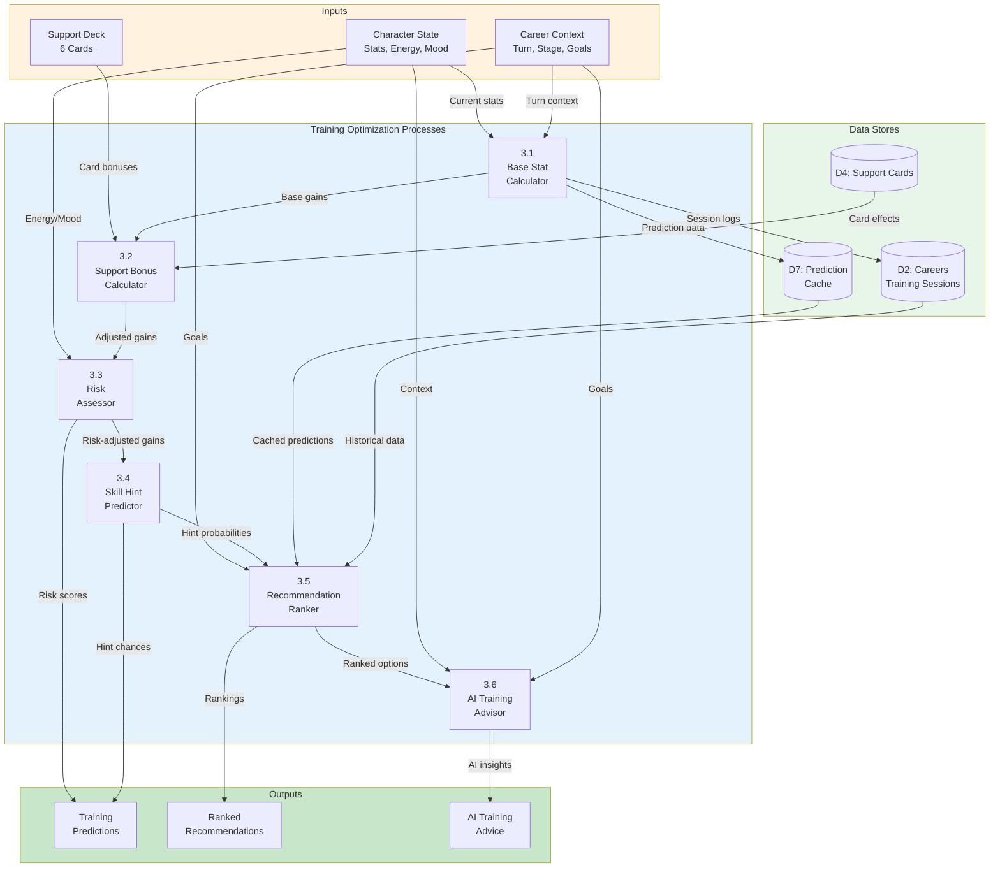

### 4.2 Training Process Details

- **Sub-Process**: **3.1 Base Stat Calculator**; **Description**: Calculates raw stat gains per facility; **Algorithm**: Growth rates × Facility multipliers; **Caching**: No
- **Sub-Process**: **3.2 Support Bonus Calculator**; **Description**: Applies support card bonuses and friendship multipliers; **Algorithm**: Bonus stacking with friendship thresholds; **Caching**: No
- **Sub-Process**: **3.3 Risk Assessor**; **Description**: Calculates failure probability based on energy/mood/conditions; **Algorithm**: Risk score = f(energy, mood, conditions); **Caching**: No
- **Sub-Process**: **3.4 Skill Hint Predictor**; **Description**: Determines probability of skill hints per facility; **Algorithm**: Hint chance based on support participation; **Caching**: No
- **Sub-Process**: **3.5 Recommendation Ranker**; **Description**: Ranks training options by expected value and alignment with goals; **Algorithm**: Multi-criteria scoring; **Caching**: 5 min TTL
- **Sub-Process**: **3.6 AI Training Advisor**; **Description**: Provides intelligent training recommendations via Neuron agents; **Algorithm**: Neuron AI + Ollama/Bedrock; **Caching**: Session-based

---

## 5. Level 2 DFD - AI Advisory System

### 5.1 AI Advisory Decomposition

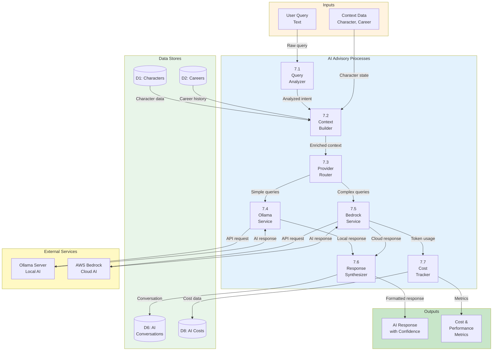

### 5.2 AI Advisory Process Details

- **Sub-Process**: **7.1 Query Analyzer**; **Description**: Analyzes user query intent and complexity; **Implementation**: Pattern matching, keyword extraction
- **Sub-Process**: **7.2 Context Builder**; **Description**: Enriches query with character and career context; **Implementation**: Data aggregation from multiple stores
- **Sub-Process**: **7.3 Provider Router**; **Description**: Routes query to appropriate AI provider based on complexity; **Implementation**: Ollama (simple) vs Bedrock (complex)
- **Sub-Process**: **7.4 Ollama Service**; **Description**: Processes queries using local Ollama models; **Implementation**: HTTP API client, timeout 30s
- **Sub-Process**: **7.5 Bedrock Service**; **Description**: Processes queries using AWS Bedrock Claude models; **Implementation**: AWS SDK, Claude Sonnet/Haiku
- **Sub-Process**: **7.6 Response Synthesizer**; **Description**: Formats and enriches AI responses with confidence scores; **Implementation**: JSON formatting, confidence calculation
- **Sub-Process**: **7.7 Cost Tracker**; **Description**: Tracks token usage and calculates costs for cloud AI; **Implementation**: Database persistence, budget monitoring

---

## 6. Level 2 DFD - External Integration

### 6.1 External Integration Decomposition

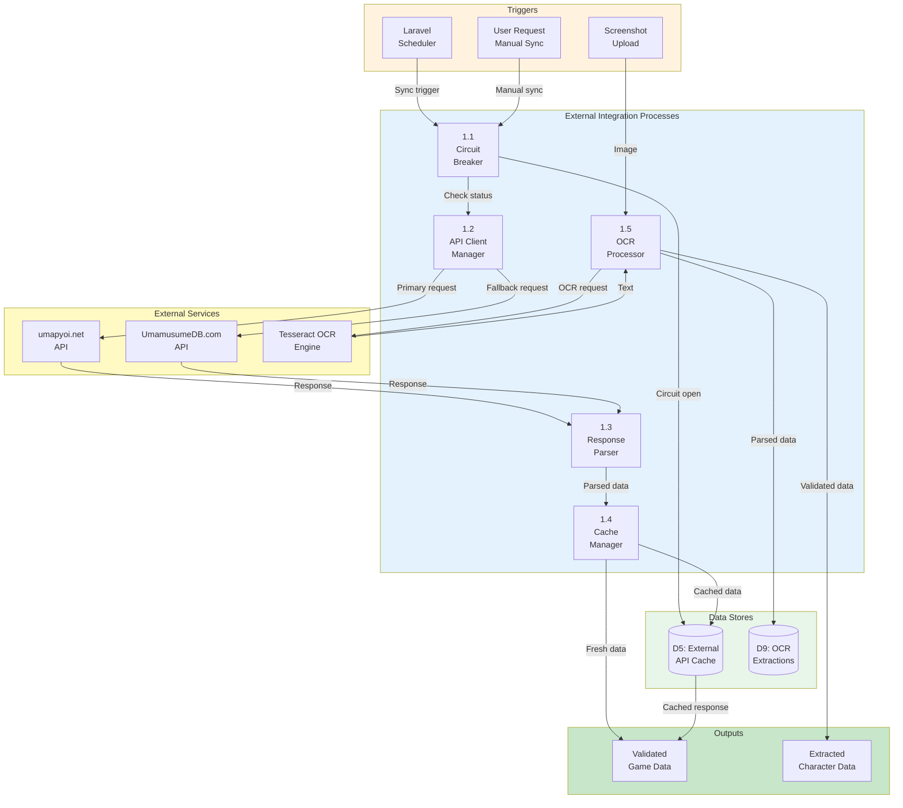

### 6.2 Integration Process Details

- **Sub-Process**: **1.1 Circuit Breaker**; **Description**: Monitors API health and opens circuit on failure threshold; **Resilience Pattern**: Open after 5 failures in 120s window
- **Sub-Process**: **1.2 API Client Manager**; **Description**: Manages connections to external APIs with fallback logic; **Resilience Pattern**: Primary → Fallback → Cached
- **Sub-Process**: **1.3 Response Parser**; **Description**: Parses and validates API responses against schema; **Resilience Pattern**: JSON schema validation
- **Sub-Process**: **1.4 Cache Manager**; **Description**: Stores and retrieves cached responses with TTL management; **Resilience Pattern**: 24-hour TTL, Redis-backed
- **Sub-Process**: **1.5 OCR Processor**; **Description**: Processes screenshots with GD preprocessing and Tesseract OCR; **Resilience Pattern**: GD grayscale → threshold → OCR

---

## 7. Level 2 DFD - Data Management

### 7.1 Data Management Decomposition

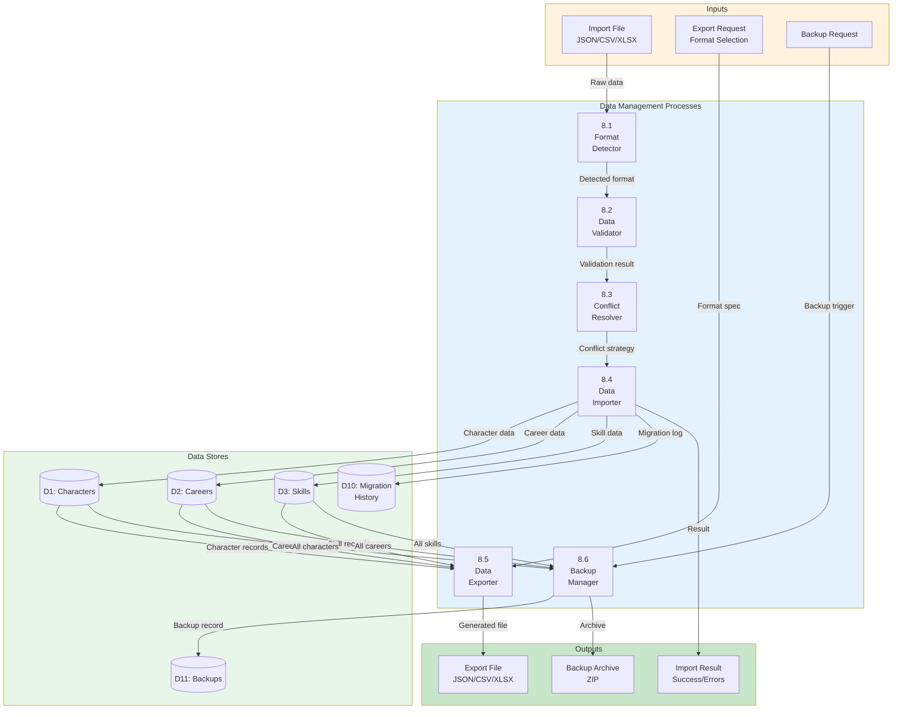

### 7.2 Data Management Process Details

- **Sub-Process**: **8.1 Format Detector**; **Description**: Detects import file format and schema version; **Supported Formats**: JSON v1.0, CSV, XLSX, Legacy formats
- **Sub-Process**: **8.2 Data Validator**; **Description**: Validates imported data against business rules; **Supported Formats**: Stat ranges, enum values, relationships
- **Sub-Process**: **8.3 Conflict Resolver**; **Description**: Resolves duplicate/conflict records using user strategy; **Supported Formats**: Skip, Overwrite, Merge, Rename
- **Sub-Process**: **8.4 Data Importer**; **Description**: Imports validated records into database with transaction management; **Supported Formats**: Batch processing, rollback on error
- **Sub-Process**: **8.5 Data Exporter**; **Description**: Exports data to requested format with schema versioning; **Supported Formats**: JSON, CSV, XLSX with metadata
- **Sub-Process**: **8.6 Backup Manager**; **Description**: Creates full backup archives with restore capability; **Supported Formats**: ZIP with manifest, incremental support

---

## 8. Level 2 DFD - Performance Monitoring (NEW)

### 8.1 Overview

The Performance Monitoring subsystem collects, aggregates, and analyzes application performance metrics to enable proactive optimization and alerting.

### 8.2 APM Data Flow Diagram

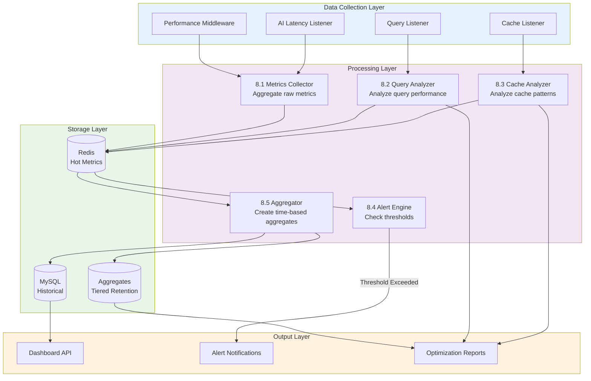

### 8.3 Process Specifications

- **Process**: **8.1 Metrics Collector**; **Description**: Collects request-level metrics from middleware; **Key Inputs**: HTTP request data, timing info; **Key Outputs**: Raw metrics records
- **Process**: **8.2 Query Analyzer**; **Description**: Analyzes database queries for optimization; **Key Inputs**: SQL queries, EXPLAIN plans; **Key Outputs**: Query scores, suggestions
- **Process**: **8.3 Cache Analyzer**; **Description**: Analyzes cache hit/miss patterns; **Key Inputs**: Cache operations; **Key Outputs**: Hit rates, TTL suggestions
- **Process**: **8.4 Alert Engine**; **Description**: Compares metrics against thresholds; **Key Inputs**: Aggregated metrics, thresholds; **Key Outputs**: Alert notifications
- **Process**: **8.5 Aggregator**; **Description**: Creates time-based metric aggregates; **Key Inputs**: Raw metrics; **Key Outputs**: Minute/hour/day aggregates

### 8.4 Data Flows

- **Flow**: **DF8.1**; **Source → Destination**: Middleware → Metrics Collector; **Data Content**: Request ID, endpoint, start time
- **Flow**: **DF8.2**; **Source → Destination**: Query Listener → Query Analyzer; **Data Content**: SQL, duration, bindings
- **Flow**: **DF8.3**; **Source → Destination**: Cache Listener → Cache Analyzer; **Data Content**: Key, operation, hit/miss, latency
- **Flow**: **DF8.4**; **Source → Destination**: Metrics Collector → Redis; **Data Content**: JSON metrics record
- **Flow**: **DF8.5**; **Source → Destination**: Query Analyzer → Redis; **Data Content**: Query performance score
- **Flow**: **DF8.6**; **Source → Destination**: Redis → Alert Engine; **Data Content**: Aggregated metrics
- **Flow**: **DF8.7**; **Source → Destination**: Alert Engine → Notifications; **Data Content**: Alert payload (Slack, Email)
- **Flow**: **DF8.8**; **Source → Destination**: Aggregator → MySQL; **Data Content**: Minute/hour/day aggregates

### 8.5 Performance Monitoring Services

- **Service**: `ApmService`; **Function**: Core APM coordination and metrics storage
- **Service**: `ApiPerformanceMonitoringService`; **Function**: API endpoint performance tracking
- **Service**: `QueryOptimizationService`; **Function**: Database query analysis
- **Service**: `PerformanceAlertingService`; **Function**: Alert generation and delivery
- **Service**: `RedisCacheOptimizationService`; **Function**: Cache analytics and optimization
- **Service**: `ApiResponseCachingService`; **Function**: Response caching strategies
- **Service**: `PerformanceRegressionService`; **Function**: Regression detection
- **Service**: `HistoricalTrackingService`; **Function**: Long-term metrics storage

---

## 9. Data Store Specifications

### 9.1 Primary Data Stores

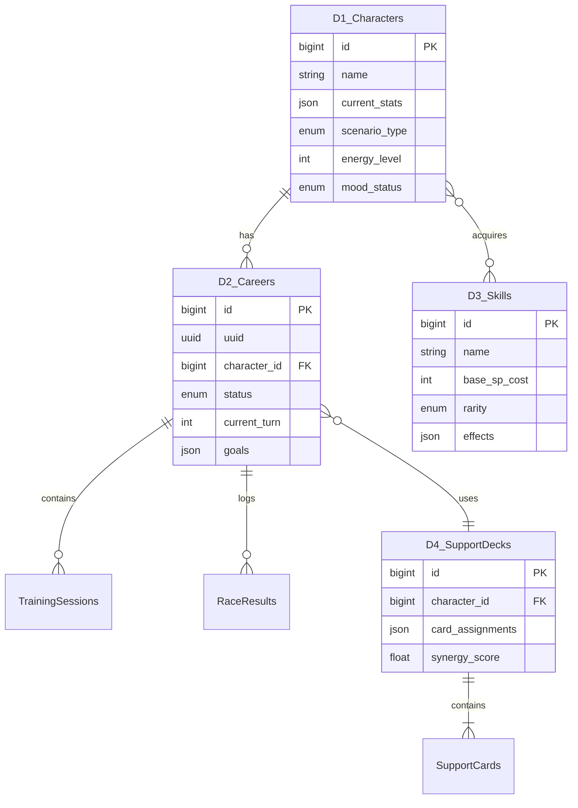

### 8.2 Data Store Catalog

- **Store ID**: **D1**; **Name**: Characters; **Type**: MySQL; **Persistence**: Permanent; **Description**: Character records with stats and aptitudes
- **Store ID**: **D2**; **Name**: Careers; **Type**: MySQL; **Persistence**: Permanent; **Description**: Career run tracking and progression
- **Store ID**: **D3**; **Name**: Skills; **Type**: MySQL; **Persistence**: Permanent; **Description**: Skill catalog and acquisition history
- **Store ID**: **D4**; **Name**: Support Cards; **Type**: MySQL; **Persistence**: Permanent; **Description**: Support card inventory and deck configurations
- **Store ID**: **D5**; **Name**: External API Cache; **Type**: Redis; **Persistence**: 24h TTL; **Description**: Cached responses from external APIs
- **Store ID**: **D6**; **Name**: AI Conversations; **Type**: MySQL; **Persistence**: 90 days; **Description**: AI conversation history and context
- **Store ID**: **D7**; **Name**: Prediction Cache; **Type**: Redis; **Persistence**: 5 min TTL; **Description**: Training prediction results
- **Store ID**: **D8**; **Name**: AI Costs; **Type**: MySQL; **Persistence**: Permanent; **Description**: Token usage and cost tracking
- **Store ID**: **D9**; **Name**: OCR Extractions; **Type**: MySQL; **Persistence**: Permanent; **Description**: OCR processing results
- **Store ID**: **D10**; **Name**: Migration History; **Type**: MySQL; **Persistence**: Permanent; **Description**: Data migration audit trail
- **Store ID**: **D11**; **Name**: Backups; **Type**: File System; **Persistence**: User-managed; **Description**: Backup archives

### 8.3 Cache Strategy

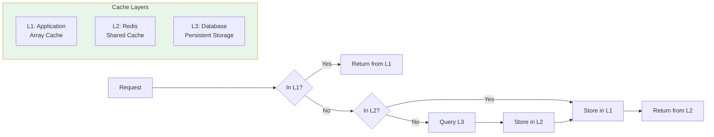

- **Cache Level**: **L1 Application**; **Technology**: PHP Array; **Use Case**: Request-scoped data; **TTL**: Request lifetime
- **Cache Level**: **L2 Shared**; **Technology**: Redis; **Use Case**: Cross-request data, predictions; **TTL**: 5 min - 24 hours
- **Cache Level**: **L3 Database**; **Technology**: MySQL; **Use Case**: Persistent data; **TTL**: Permanent

---

## 10. Data Flow Summary

### 9.1 Critical Data Flows

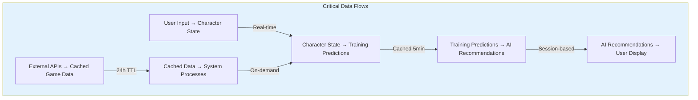

### 9.2 Data Flow Volumes

- **Flow**: User input → Character update; **Volume**: 1 record; **Frequency**: Per action; **Latency Target**: < 200ms
- **Flow**: Training predictions request; **Volume**: 6-8 options; **Frequency**: Per turn; **Latency Target**: < 1.2s
- **Flow**: AI advisory request; **Volume**: 1 query; **Frequency**: As needed; **Latency Target**: < 2.5s
- **Flow**: External API sync; **Volume**: 100-500 records; **Frequency**: Daily; **Latency Target**: < 30s
- **Flow**: OCR processing; **Volume**: 1 image; **Frequency**: Manual; **Latency Target**: < 10s
- **Flow**: Data export; **Volume**: 1-100 careers; **Frequency**: Manual; **Latency Target**: < 60s

### 9.3 Data Transformation Points

- **Transformation**: **External API Response**; **Input Format**: JSON (external schema); **Output Format**: JSON (internal schema); **Process**: Schema mapping, validation
- **Transformation**: **OCR Text Extraction**; **Input Format**: Image (PNG/JPG); **Output Format**: Structured text; **Process**: GD preprocessing → Tesseract → Parsing
- **Transformation**: **Training Calculation**; **Input Format**: Character state + Deck; **Output Format**: Prediction array; **Process**: Multi-step calculation pipeline
- **Transformation**: **AI Query**; **Input Format**: Natural language; **Output Format**: Structured response; **Process**: Context enrichment → LLM → Formatting
- **Transformation**: **Export**; **Input Format**: Database records; **Output Format**: JSON/CSV/XLSX; **Process**: Serialization with schema versioning

### 9.4 Data Quality Controls

- **Control Point**: **User Input**; **Validation**: Laravel validation rules; **Error Handling**: Return 422 with errors
- **Control Point**: **External API**; **Validation**: JSON schema validation; **Error Handling**: Fallback to cache or alternate API
- **Control Point**: **OCR Extraction**; **Validation**: Confidence threshold ≥ 80%; **Error Handling**: Manual correction UI
- **Control Point**: **AI Response**; **Validation**: Format and content validation; **Error Handling**: Retry with fallback provider
- **Control Point**: **Import Data**; **Validation**: Business rule validation; **Error Handling**: Preview + error report

---

## Document Control

- **Version**: 2.4.0; **Date**: 2026-02-22; **Author**: Development Team; **Changes**: Added Admin Panel data paths; updated external API references (GameTora); added Neuron AI v2.11 version; updated stats (571 routes, 3,316+ tests)
- **Version**: 2.3.0; **Date**: 2026-02-21; **Author**: Development Team; **Changes**: Updated version/date metadata; Livewire 3→4, Alpine.js→Alpine.js 3; aligned with 30 current Eloquent models
- **Version**: 2.2.0; **Date**: 2026-01-27; **Author**: Development Team; **Changes**: Added §8 Level 2 DFD - Performance Monitoring with 8 APM services; renumbered sections
- **Version**: 2.0.0; **Date**: 2026-01-23; **Author**: Development Team; **Changes**: Complete rewrite aligned with v2.0.0 implementation; added AI, MCP, external integration, and OCR flows; updated all diagrams and specifications
- **Version**: 1.0.0; **Date**: 2026-01-03; **Author**: Development Team; **Changes**: Initial draft

---

## Related Documents

- [002_BRS - Business Requirements Specifications](002_BRS_Business_Requirements_Specifications.md)
- [003_SRS - Software Requirements Specifications](003_SRS_Software_Requirement_Specifications.md)
- [004_SDS - Software Design Specifications](004_SDS_Software_Design_Specifications.md)
- [007_SIP - Software Integration Plan](007_SIP_Software_Integration_Plan.md)
- [008_SIS - Software Integration Specifications](008_SIS_Software_Integration_Specifications.md)
- [009_DBD - Database Documentation](009_DBD_Database_Documentation.md)
- [SPEC-006 - AI Advisory Technical Specification](../specs/SPEC-006_AI_Advisory_Technical.md)
- [SPEC-007 - External Integration Technical Specification](../specs/SPEC-007_External_Integration_Technical.md)
- [FLOW-006 - AI Advisory System Flow](../flows/FLOW-006_AI_Advisory_System.md)
- [FLOW-007 - External Integration System Flow](../flows/FLOW-007_External_Integration_System.md)

---

### This DFD document provides comprehensive data flow analysis for the Umamusume Pretty Derby Career Planner v2.4.0, reflecting the current implementation architecture and integration patterns