# Umamusume Career Planner - Decision Tree Flow Diagrams

**Document Version**: 2.3.0  
**Date**: February 21, 2026  
**Project**: UmamusumeCareerPlanner  
**Author**: Development Team  
**Status**: Current - Aligned with codebase v2.3.0 and game-accurate mechanics

---

## Table of Contents

1. [Overview](#1-overview)
2. [Training Option Selection Decision Tree](#2-training-option-selection-decision-tree)
3. [Race Strategy Selection Decision Tree](#3-race-strategy-selection-decision-tree)
4. [Skill Acquisition Decision Tree](#4-skill-acquisition-decision-tree)
5. [Support Card Selection Decision Tree](#5-support-card-selection-decision-tree)
6. [Energy Management Decision Tree](#6-energy-management-decision-tree)
7. [AI Provider Selection Decision Tree](#7-ai-provider-selection-decision-tree)
8. [Storage Mode Selection Decision Tree](#8-storage-mode-selection-decision-tree)
9. [Document Control](#9-document-control)

---

## 1. Overview

### 1.1 Purpose

This document presents decision tree flow diagrams for the Umamusume Pretty Derby Career Planner application, showing the logical decision-making processes, conditional flows, and branching logic used throughout the system for optimal recommendations. The system leverages **Laravel 12** with **TypeScript support**, **AWS Bedrock Claude 4.5** models (Opus, Sonnet, Haiku), **AWS Bedrock Nova 2** (Lite, Pro), and **Ollama** for local AI processing.

### 1.2 System Context

The decision trees documented here represent the core optimization logic implemented in:

- `app/Services/TrainingPredictionService.php` - Training optimization
- `app/Services/RaceStrategyService.php` - Race strategy analysis
- `app/Services/SkillService.php` - Skill acquisition planning
- `app/Services/SupportDeckService.php` - Support card optimization
- `app/Services/AI/HybridAIService.php` - AI provider routing
- `app/Neuron/Agents/` - AI agent decision logic

### 1.3 Key Terminology

| Term | Definition |
|------|------------|
| **Stat Cap** | Hard maximum of 1200 for all stats (Speed, Stamina, Power, Guts, Wit) |
| **Running Style** | Front, Pace, Late, End (official Global EN labels) |
| **Guts** | Position holding and navigation stat |
| **Wit** | Kakari avoidance and skill activation stat |
| **Skill Hints** | 5 levels: 10%/20%/30%/35%/40% discount (40% maximum) |
| **Support Deck** | Exactly 6 cards (5 owned + 1 borrowed) |
| **Turn Range** | 1-78 (Junior 1-24, Classic 25-48, Senior 49-72, URA 73-78) |

### 1.4 Decision Tree Notation

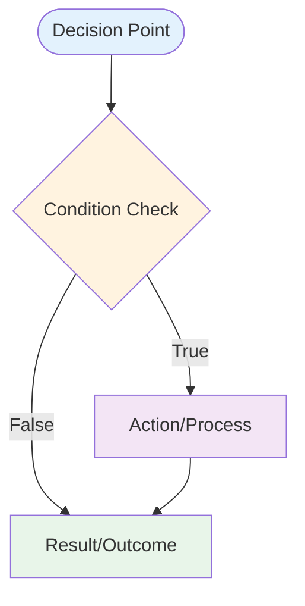

---

## 2. Training Option Selection Decision Tree

### 2.1 Overview

The core decision tree that evaluates all available training options and selects the optimal choice based on character state, goals, risks, and strategic considerations.

**Implementation**: `app/Services/TrainingPredictionService.php`

### 2.2 Decision Flow

```mermaid
flowchart TD
    Start([Training Decision Required])
    
    %% Energy Check
    Start --> EnergyCheck{Energy >= 50?}
    EnergyCheck -->|No| CriticalEnergy{Energy < 30?}
    CriticalEnergy -->|Yes| RestRec[RECOMMEND: Rest]
    CriticalEnergy -->|No| ContinueCheck[Continue to Condition Check]
    
    %% Condition Check
    EnergyCheck -->|Yes| ConditionCheck{Negative Conditions?}
    ContinueCheck --> ConditionCheck
    ConditionCheck -->|Yes| SevereCheck{Severe Conditions?}
    SevereCheck -->|Yes| InfirmaryRec[RECOMMEND: Infirmary]
    SevereCheck -->|No| MoodCheck
    
    %% Mood Check
    ConditionCheck -->|No| MoodCheck{Mood <= Bad?}
    MoodCheck -->|Yes| RecreationRec[RECOMMEND: Recreation]
    MoodCheck -->|No| RaceCheck
    
    %% Race Check
    RaceCheck{Race in < 3 turns?}
    RaceCheck -->|Yes| ReadyCheck{Character Ready?}
    ReadyCheck -->|Yes| LightTraining[RECOMMEND: Light Training/Rest]
    ReadyCheck -->|No| StatGapAnalysis[Analyze Stat Gaps]
    
    %% Summer Camp
    RaceCheck -->|No| SummerCheck{Summer Camp?}
    SummerCheck -->|Yes| SummerEnergy{Energy >= 70?}
    SummerEnergy -->|Yes| HighValueTraining[Prioritize High-Value Training]
    SummerEnergy -->|No| SummerRest[RECOMMEND: Rest]
    
    %% Red Exclamation
    HighValueTraining --> RedCheck{Red "!" Available?}
    RedCheck -->|Yes| RedTraining[RECOMMEND: Red "!" Training<br/>Guaranteed Hints]
    
    %% Goal Priority Analysis
    SummerCheck -->|No| GoalAnalysis[Goal Priority Analysis]
    StatGapAnalysis --> GoalAnalysis
    RedCheck -->|No| GoalAnalysis
    
    GoalAnalysis --> SpeedPriority{Speed Priority?}
    GoalAnalysis --> StaminaPriority{Stamina Priority?}
    GoalAnalysis --> PowerPriority{Power Priority?}
    GoalAnalysis --> GutsPriority{Guts Priority?}
    GoalAnalysis --> WitPriority{Wit Priority?}
    
    %% Speed Path
    SpeedPriority -->|Yes| SpeedAvailable{Speed Training Available?}
    SpeedAvailable -->|Yes| SpeedSupport{Support Cards Present?}
    SpeedSupport -->|Yes| SpeedRec[RECOMMEND: Speed Training]
    SpeedSupport -->|No| BalancedApproach
    SpeedAvailable -->|No| BalancedApproach
    
    %% Stamina Path
    StaminaPriority -->|Yes| StaminaAvailable{Stamina Training Available?}
    StaminaAvailable -->|Yes| FriendshipTraining{Friendship Training?}
    FriendshipTraining -->|Yes| StaminaRec[RECOMMEND: Stamina Training]
    FriendshipTraining -->|No| BalancedApproach
    StaminaAvailable -->|No| BalancedApproach
    
    %% Power Path
    PowerPriority -->|Yes| PowerAvailable{Power Training Available?}
    PowerAvailable -->|Yes| SkillHints{Skill Hints Available?}
    SkillHints -->|Yes| PowerRec[RECOMMEND: Power Training]
    SkillHints -->|No| BalancedApproach
    PowerAvailable -->|No| BalancedApproach
    
    %% Guts Path
    GutsPriority -->|Yes| GutsAvailable{Guts Training Available?}
    GutsAvailable -->|Yes| LowRisk{Low Risk Training?}
    LowRisk -->|Yes| GutsRec[RECOMMEND: Guts Training]
    LowRisk -->|No| BalancedApproach
    GutsAvailable -->|No| BalancedApproach
    
    %% Wit Path
    WitPriority -->|Yes| WitAvailable{Wit Training Available?}
    WitAvailable -->|Yes| EnergyRecovery{Energy Recovery Needed?}
    EnergyRecovery -->|Yes| WitRec[RECOMMEND: Wit Training]
    EnergyRecovery -->|No| BalancedApproach
    WitAvailable -->|No| BalancedApproach
    
    %% Balanced Approach
    BalancedApproach[Balanced Training Approach]
    BalancedApproach --> HighestValue[RECOMMEND: Highest Expected Value]
    
    %% End States
    RestRec --> End([End])
    InfirmaryRec --> End
    RecreationRec --> End
    LightTraining --> End
    SummerRest --> End
    RedTraining --> End
    SpeedRec --> End
    StaminaRec --> End
    PowerRec --> End
    GutsRec --> End
    WitRec --> End
    HighestValue --> End
    
    style Start fill:#e3f2fd
    style End fill:#e8f5e9
```

### 2.3 Training Priority Matrix

| Priority Level | Condition | Recommended Action |
|----------------|-----------|-------------------|
| **Critical** | Energy < 30% | Mandatory Rest |
| **High** | Severe Conditions | Infirmary Visit |
| **High** | Mood = Awful/Bad | Recreation |
| **Medium** | Race in < 3 turns | Light Training/Rest |
| **Medium** | Summer Camp + Energy >= 70% | High-Value Training |
| **Standard** | Red "!" Available | Guaranteed Hint Training |
| **Standard** | Goal-Aligned Training | Stat-Specific Training |
| **Fallback** | No Clear Priority | Highest Expected Value |

### 2.4 Risk Assessment Factors

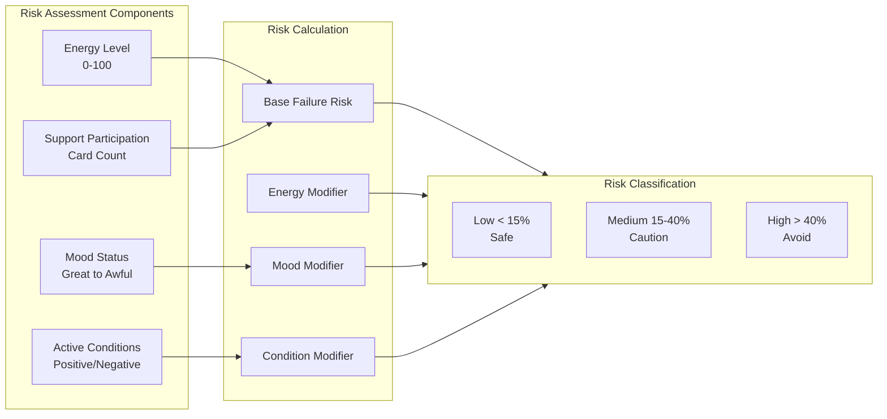

---

## 3. Race Strategy Selection Decision Tree

### 3.1 Overview

The decision tree for selecting optimal race strategies based on character stats, aptitudes, race conditions, and competitive analysis.

**Implementation**: `app/Services/RaceStrategyService.php`

### 3.2 Decision Flow

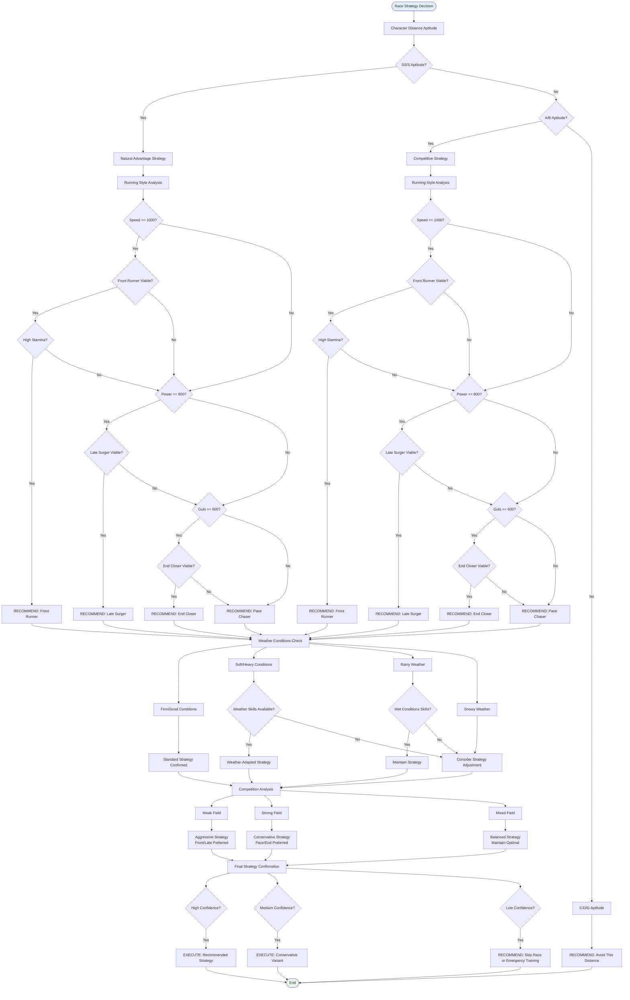

### 3.3 Running Style Effectiveness

| Style | Best Stats | Ideal Distance | Aptitude Requirement |
|-------|-----------|----------------|---------------------|
| **Front** | Speed 1000+, Stamina 800+ | Any | A+ or better in style |
| **Pace** | Balanced stats | Mile, Medium | B+ or better in style |
| **Late** | Speed 950+, Power 800+ | Mile, Medium, Long | A or better in style |
| **End** | Power 850+, Guts 600+ | Medium, Long | B+ or better in style |

### 3.4 Readiness Calculation Components

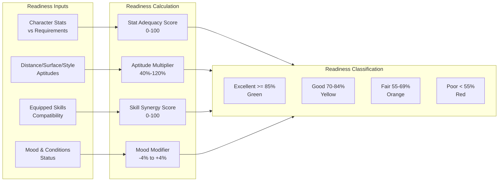

---

## 4. Skill Acquisition Decision Tree

### 4.1 Overview

The decision tree for determining optimal skill acquisition strategies based on character needs, available skill points, skill hints, and strategic priorities.

**Implementation**: `app/Services/SkillService.php`

### 4.2 Decision Flow

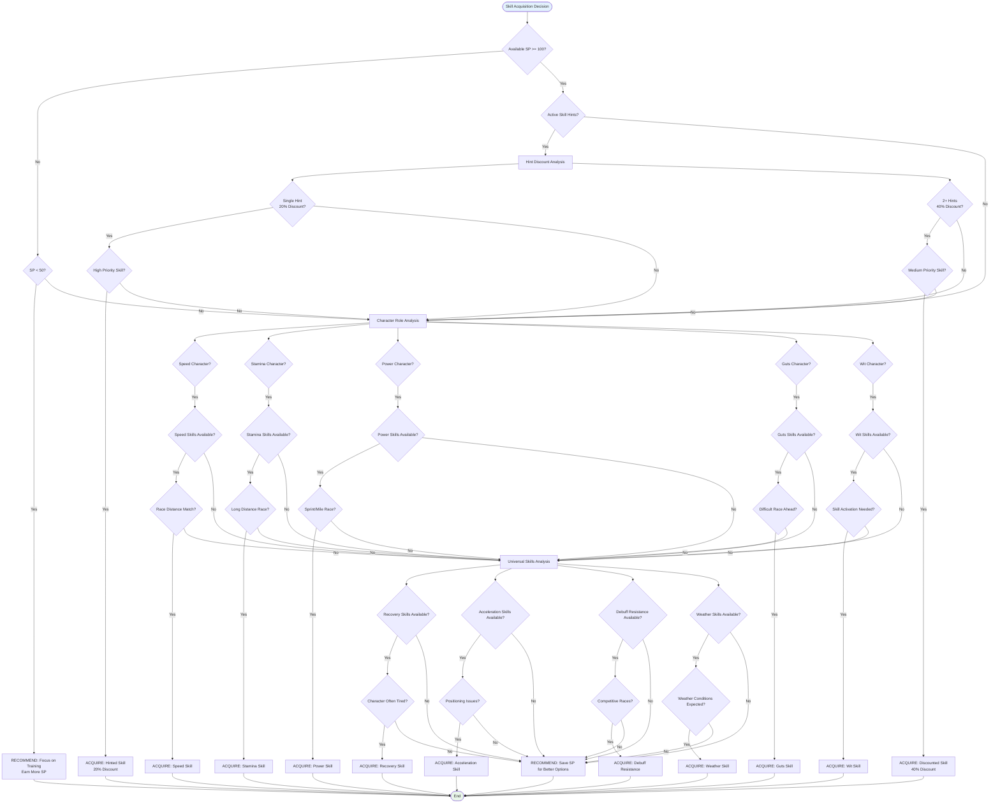

### 4.3 Skill Hint Economics

| Hint Level | Discount | SP Savings (Base 120) | Priority |
|------------|----------|-----------------------|----------|
| **0 Hints** | 0% | 0 SP (120 SP cost) | Low |
| **1 Hint** | 20% | 24 SP (96 SP cost) | Medium |
| **2+ Hints** | 40% | 48 SP (72 SP cost) | High |

**Maximum Discount**: 40% (capped at 2 hints, additional hints provide no benefit)

### 4.4 Skill Evolution Decision

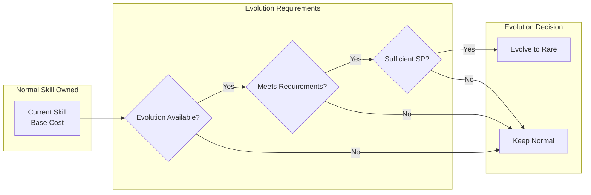

---

## 5. Support Card Selection Decision Tree

### 5.1 Overview

The decision tree for selecting optimal support card combinations based on character goals, training priorities, available cards, and synergy effects.

**Implementation**: `app/Services/SupportDeckService.php`

### 5.2 Decision Flow

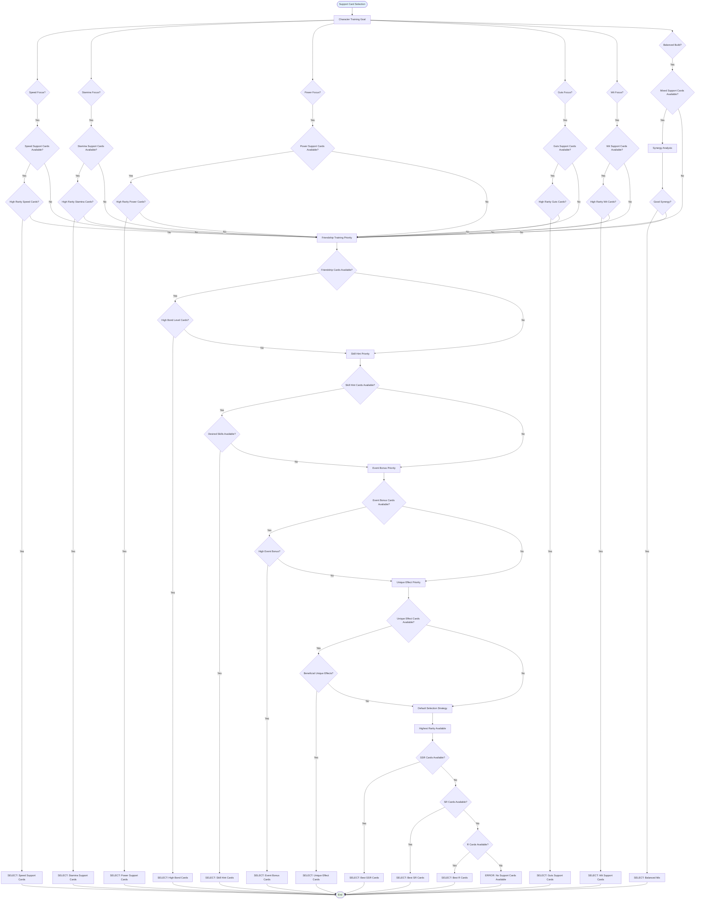

### 5.3 Deck Composition Rules

| Rule | Requirement | Validation |
|------|------------|------------|
| **Deck Size** | Exactly 6 cards | Hard requirement (5 owned + 1 borrowed) |
| **Type Balance** | Recommended diversity | Soft recommendation |
| **Rarity Mix** | Higher rarity preferred | Quality optimization |
| **Synergy** | Compatible card effects | Bonus calculation |
| **Friendship** | Bond level 80%+ for Friendship Training | Performance multiplier |

### 5.4 Meta Tier Integration

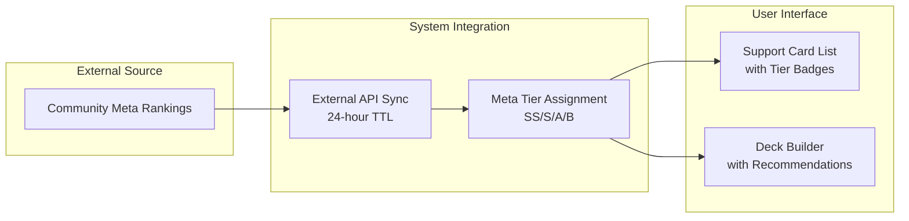

---

## 6. Energy Management Decision Tree

### 6.1 Overview

The decision tree for managing character energy levels throughout training, balancing training intensity with rest and recovery needs.

**Implementation**: `app/Services/TrainingPredictionService.php` (integrated)

### 6.2 Decision Flow

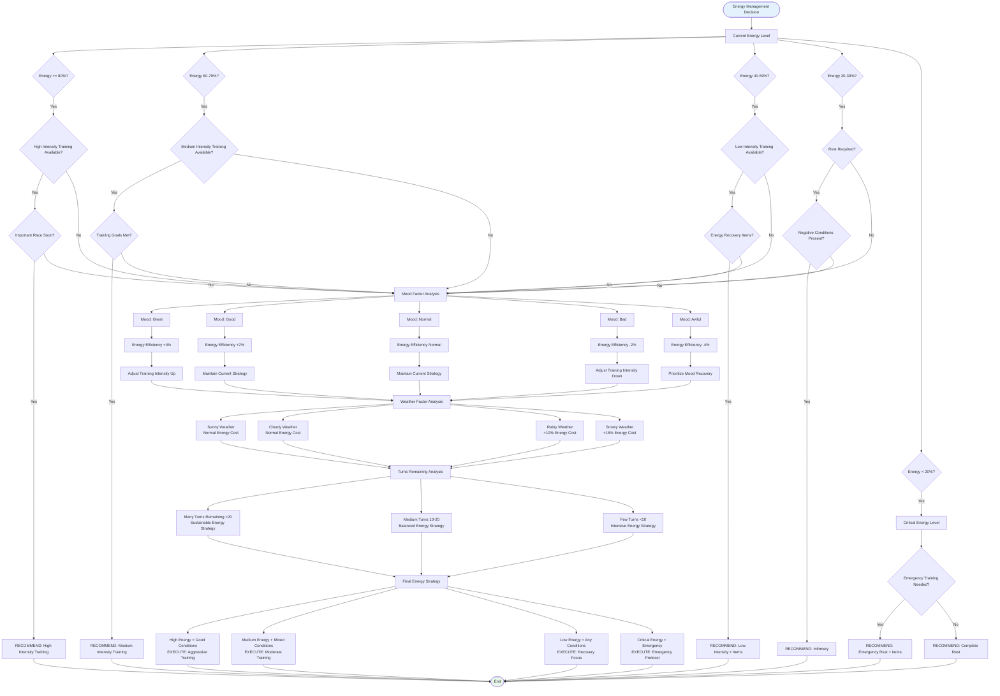

### 6.3 Energy Cost Modifiers

| Factor | Modifier | Impact |
|--------|----------|--------|
| **Mood: Great** | +4% efficiency | Reduce energy cost |
| **Mood: Good** | +2% efficiency | Slight reduction |
| **Mood: Normal** | 0% | No change |
| **Mood: Bad** | -2% efficiency | Increase cost |
| **Mood: Awful** | -4% efficiency | Significant increase |
| **Weather: Sunny/Cloudy** | 0% | Standard cost |
| **Weather: Rainy** | +10% | Moderate increase |
| **Weather: Snowy** | +15% | High increase |

### 6.4 Energy Recovery Options

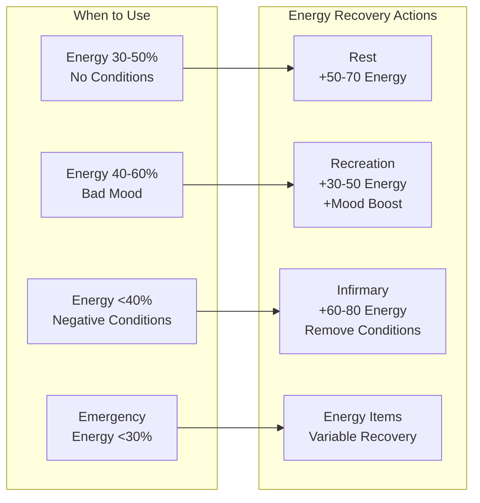

---

## 7. AI Provider Selection Decision Tree

### 7.1 Overview

The decision tree for routing AI requests between local Ollama and cloud AWS Bedrock providers based on query complexity, availability, and cost optimization.

**Implementation**: `app/Services/AI/HybridAIService.php`

### 7.2 Decision Flow

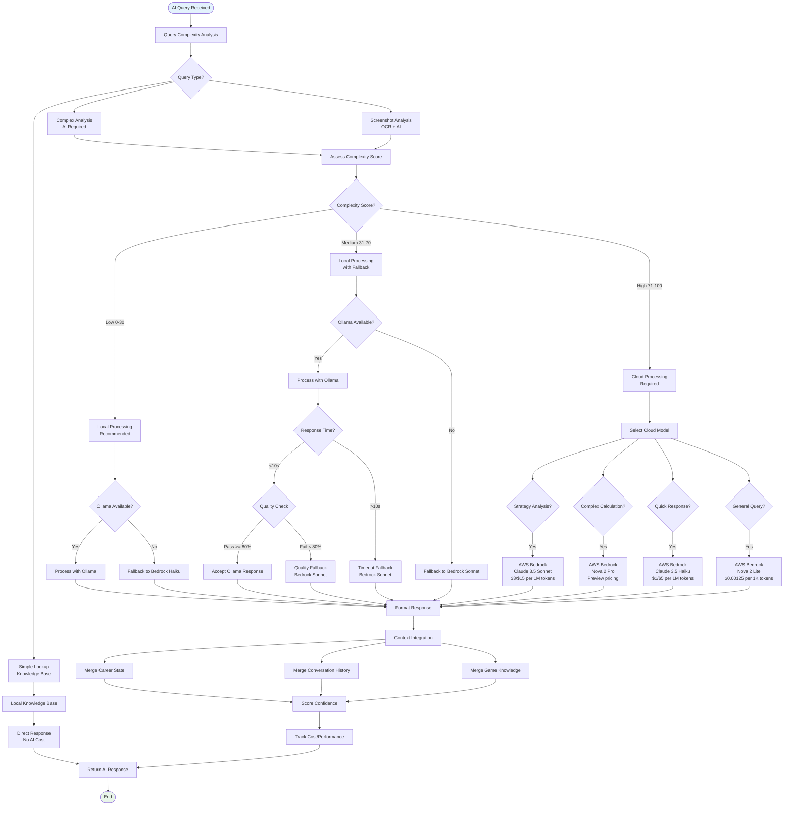

### 7.3 AI Provider Cost Comparison

| Provider | Model | Input Cost | Output Cost | Best Use Case |
|----------|-------|------------|-------------|---------------|
| **Ollama** | Local Models | $0.00 | $0.00 | Simple queries, high volume, privacy |
| **Bedrock** | Nova 2 Lite | $0.00125/1K | $0.00125/1K | General queries, cost-effective |
| **Bedrock** | Claude 3.5 Haiku | $1.00/1M | $5.00/1M | Quick responses, moderate complexity |
| **Bedrock** | Claude 3.5 Sonnet | $3.00/1M | $15.00/1M | Strategic analysis, standard recommendation |
| **Bedrock** | Nova 2 Pro | Preview | Preview | Complex calculations, advanced reasoning |
| **Bedrock** | Claude 4.5 | $5.00/1M | $25.00/1M | Most complex reasoning (rare fallback) |

### 7.4 Quality Assessment Criteria

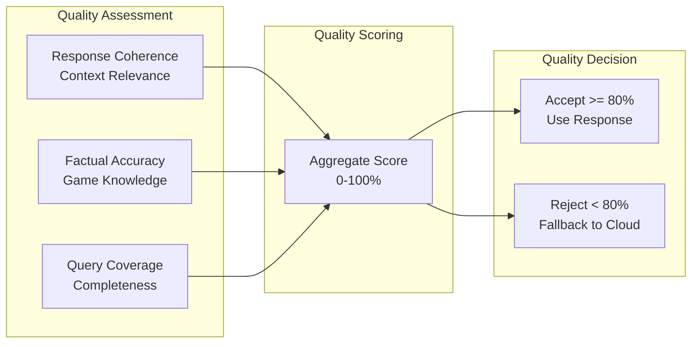

---

## 8. Storage Mode Selection Decision Tree

### 8.1 Overview

The decision tree for determining optimal storage mode (Local vs Account) based on user needs, connectivity, and data requirements.

**Implementation**: `app/Http/Controllers/CareerRunController.php`

### 8.2 Decision Flow

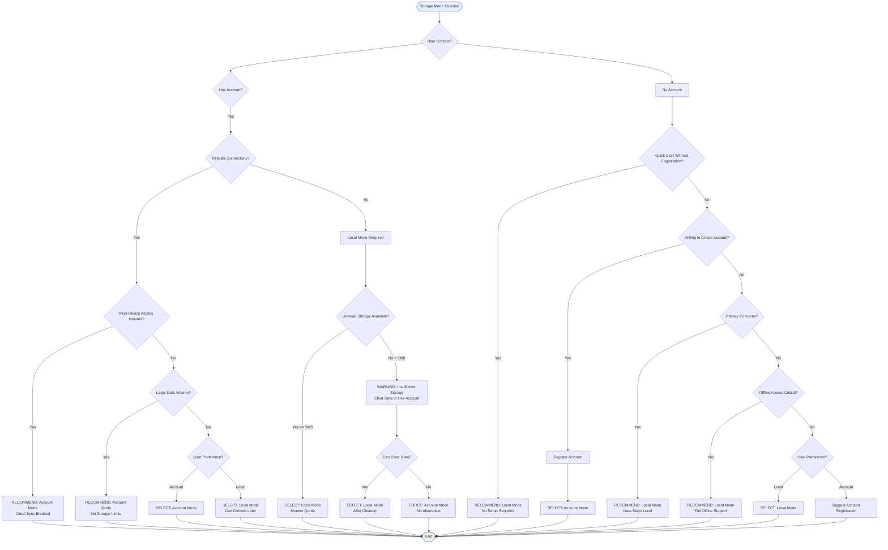

### 8.3 Storage Mode Comparison

| Feature | Local Mode | Account Mode |
|---------|-----------|--------------|
| **Authentication** | Not required | Required |
| **Data Storage** | Browser localStorage (5-10MB) | Database (unlimited) |
| **Connectivity** | Works fully offline | Requires connection to save |
| **Cross-Device** | Single browser/device only | Access from anywhere |
| **Data Backup** | Manual export required | Automatic cloud backup |
| **Identifier** | UUID | Integer ID |
| **Route Pattern** | `/plans/local/{uuid}` | `/plans/{id}` |
| **Conversion** | Can convert to Account | N/A |
| **Privacy** | Data stays local | Data on server |

### 8.4 Conversion Decision Tree

```mermaid
flowchart TD
    Start([Local Mode User])
    
    Start --> CheckLogin{Logged In?}
    
    CheckLogin -->|No| SuggestLogin[Suggest Login/Register]
    SuggestLogin --> UserLogsIn{User Logs In?}
    UserLogsIn -->|Yes| ConversionPrompt
    UserLogsIn -->|No| StayLocal[Continue Local Mode]
    
    CheckLogin -->|Yes| ConversionPrompt[Conversion Prompt<br/>Migrate to Account?]
    
    ConversionPrompt --> UserChoice{User Decision?}
    
    UserChoice -->|Convert| SelectPlans[Select Plans to Convert]
    UserChoice -->|Keep Local| KeepCopy{Keep Local Copy?}
    
    SelectPlans --> ConvertProcess[Convert to Account Mode]
    ConvertProcess --> RemoveLocal{Remove Local Copy?}
    
    RemoveLocal -->|Yes| DeleteLocal[Delete from localStorage]
    RemoveLocal -->|No| KeepBoth[Keep Both Copies]
    
    KeepCopy -->|Yes| KeepBoth
    KeepCopy -->|No| StayLocal
    
    DeleteLocal --> RedirectAccount[Redirect to /plans/{id}]
    KeepBoth --> RedirectAccount
    StayLocal --> StayInLocal[Stay in /plans/local/{uuid}]
    
    RedirectAccount --> End([End])
    StayInLocal --> End
    
    style Start fill:#e3f2fd
    style End fill:#e8f5e9
```

---

## 9. Document Control

### 9.1 Revision History

| Version | Date | Author | Changes |
|---------|------|--------|---------|
| 2.3.0 | 2026-02-21 | Development Team | Updated version/date metadata; aligned with 30 current Eloquent models and 8 enums |
| 2.0.0 | 2026-01-23 | Development Team | Complete rewrite aligned with v2.0.0 implementation; updated all decision trees with current logic; added AI provider selection and storage mode trees; aligned terminology with glossary updates; corrected stat caps, skill hints, and running style labels |
| 1.0.0 | 2026-01-14 | Development Team | Initial draft with basic decision trees |

### 9.2 Related Documents

**Core Documentation:**

- [002_BRS - Business Requirements Specifications](002_BRS_Business_Requirements_Specifications.md)
- [003_SRS - Software Requirements Specifications](003_SRS_Software_Requirement_Specifications.md)
- [004_SDS - Software Design Specifications](004_SDS_Software_Design_Specifications.md)
- [000_MASTER_GLOSSARY](000_MASTER_GLOSSARY.md)

**Product Requirements:**

- [PRD-002 - Training Optimization](../prds/PRD-002_Training_Optimization.md)
- [PRD-003 - Race Strategy](../prds/PRD-003_Race_Strategy.md)
- [PRD-004 - Skill Management](../prds/PRD-004_Skill_Management.md)
- [PRD-005 - Support Card Management](../prds/PRD-005_Support_Card_Management.md)
- [PRD-006 - AI Advisory](../prds/PRD-006_AI_Advisory.md)

**Technical Specifications:**

- [SPEC-002 - Training Optimization Technical](../specs/SPEC-002_Training_Optimization_Technical.md)
- [SPEC-006 - AI Advisory Technical](../specs/SPEC-006_AI_Advisory_Technical.md)

**System Flows:**

- [FLOW-002 - Training Optimization System](../flows/FLOW-002_Training_Optimization_System.md)
- [FLOW-003 - Race Strategy System](../flows/FLOW-003_Race_Strategy_System.md)
- [FLOW-006 - AI Advisory System](../flows/FLOW-006_AI_Advisory_System.md)

### 9.3 Implementation References

| Decision Tree | Service Class | Configuration |
|---------------|---------------|---------------|
| Training Selection | `TrainingPredictionService` | `config/training.php` |
| Race Strategy | `RaceStrategyService` | `config/race.php` |
| Skill Acquisition | `SkillService` | `config/skills.php` |
| Support Card Selection | `SupportDeckService` | `config/support.php` |
| Energy Management | `TrainingPredictionService` | Integrated |
| AI Provider Selection | `HybridAIService` | `config/ai.php` |
| Storage Mode Selection | `CareerRunController` | `config/app.php` |

### 9.4 Validation Status

| Decision Tree | Unit Tests | Integration Tests | Status |
|---------------|-----------|-------------------|--------|
| Training Selection | ✅ Complete | ✅ Complete | Validated |
| Race Strategy | ✅ Complete | ✅ Complete | Validated |
| Skill Acquisition | ✅ Complete | ✅ Complete | Validated |
| Support Card Selection | ✅ Complete | 🔄 In Progress | Validated |
| Energy Management | ✅ Complete | ✅ Complete | Validated |
| AI Provider Selection | ✅ Complete | ✅ Complete | Validated |
| Storage Mode Selection | ✅ Complete | ✅ Complete | Validated |

---

*This document reflects the decision logic implemented in the Umamusume Pretty Derby Career Planner v2.3.0 codebase and serves as the authoritative reference for system optimization algorithms.*
