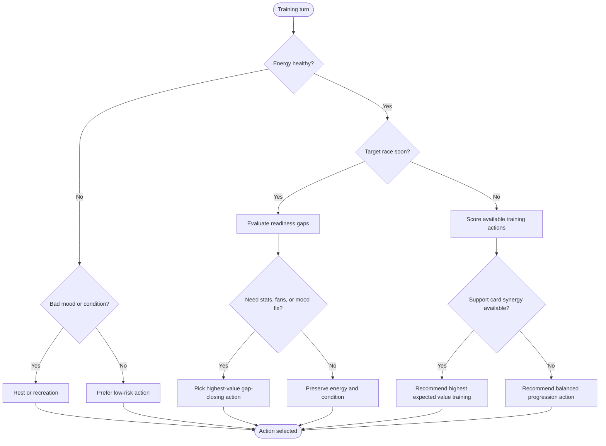
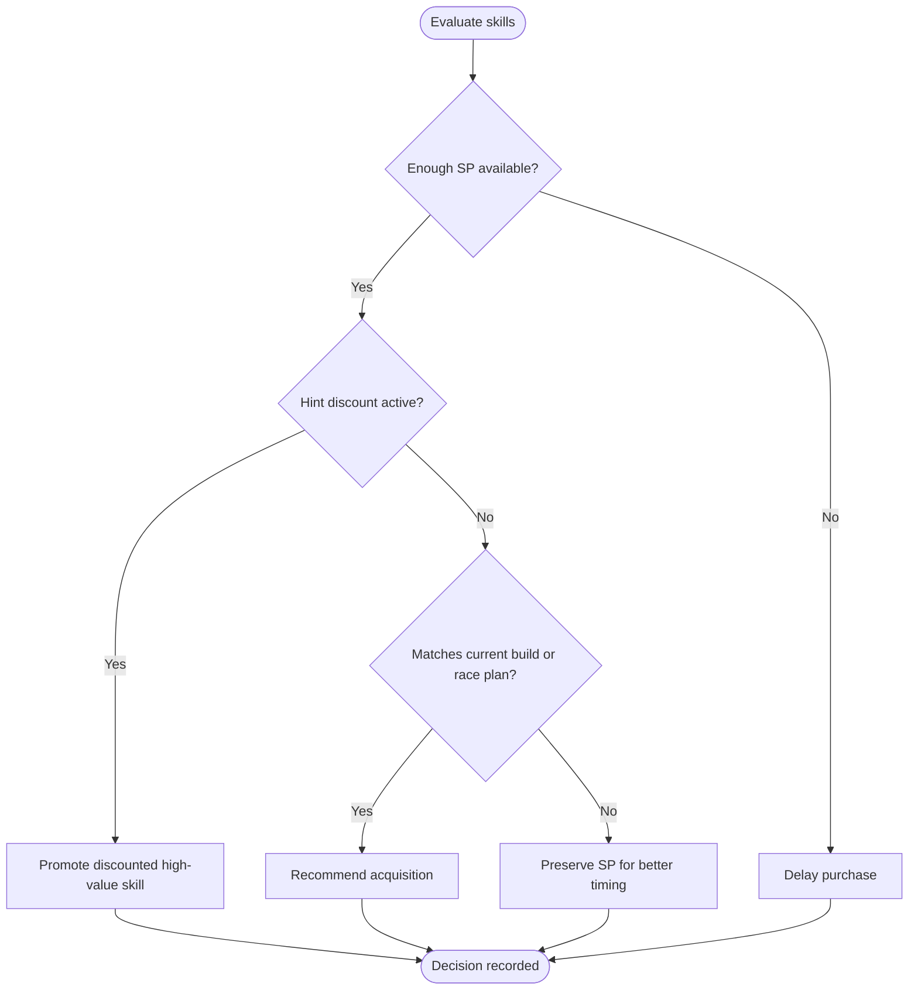
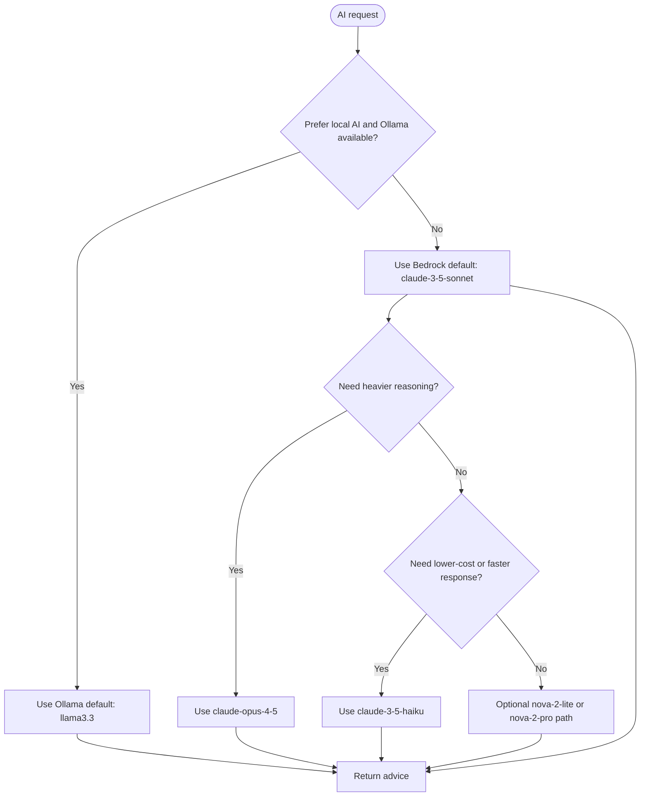
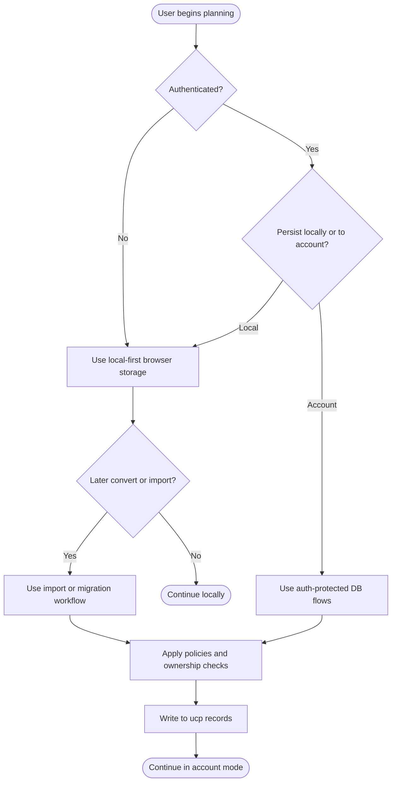

# Umamusume Career Planner - Decision Tree Flow Diagrams

**Document Version**: 2.4.1
**Date**: March 10, 2026
**Project**: UmamusumeCareerPlanner
**Author**: Development Team
**Status**: Current - repository-aligned decision trees using implemented service and route names

---

## 1. Overview

> **Diagram scope**: Mixed implementation and conceptual decision logic. Real classes and routes are named explicitly where they exist; optimization branches are representative rather than exhaustive.

### 1.1 Current Implementation Anchors

- `TrainingPredictionService`
- `TrainingCalculationService`
- `TrainingAdvisoryService`
- `App\Services\Neuron\RaceStrategyService`
- `SkillService`
- `SupportDeckService`
- `HybridAIService`
- `LocalStorageService`

### 1.2 Normalized Terminology

| Category | Standard Vocabulary |
| --- | --- |
| Career phase | `junior`, `classic`, `senior`, `ura_finale` via `CareerPhase` |
| Mood | `very_bad`, `bad`, `normal`, `good`, `very_good` via `Mood` |
| Running style enum | `Nige`, `Senkou`, `Sashi`, `Oikomi` |
| UI running style labels | Front, Pace, Late, End |
| Distance enum | Sprint, Mile, Medium, Long via `RaceDistance` |
| Surface (race track type) | Turf, Dirt — stored in a `surface` column on `ucp_game_races`; not a `RaceDistance` value |
| Aptitude grades | Maximum is `S`; `SS` does not exist for aptitude |
| Stat grades | `SS` may exist for stats only |

### 1.3 AI Model Documentation Rule

- **Configured defaults** are shown as the standard branch.
- **Supported alternatives** are shown as optional or fallback branches.

---

## 2. Training Action Decision Tree



```text
[Training turn] --> [Energy healthy?]
                    | no                                      | yes
                    v                                         v
          [Bad mood or condition?]                    [Target race soon?]
              | yes              | no                 | yes                     | no
              v                  v                    v                         v
   [Rest or recreation] [Prefer low-risk action] [Evaluate readiness gaps] [Score available training actions]
                                                        |                         |
                                                        v                         v
                                           [Need stats, fans, or mood fix?]   [Support card synergy available?]
                                                 | yes             | no          | yes                      | no
                                                 v                 v             v                          v
                                [Pick highest-value gap-closing action] [Preserve energy and condition] [Recommend highest expected
                                value training] [Recommend balanced progression action]
```

### 2.1 Implementation Reference

- Prediction and valuation are service-backed by `TrainingPredictionService` and `TrainingCalculationService`.
- Recommendation formatting is handled by `TrainingAdvisoryService`.

---

## 3. Race Readiness and Entry Decision Tree

```mermaid
flowchart TD
    Start([Player selects target race]) --> Mode{Storage mode}
    Mode -->|Local| LocalReview[Review locally stored character state]
    Mode -->|Account| Auth[auth middleware]

    LocalReview --> Ready
    Auth --> Ownership{Character ownership or seeded access?}
    Ownership -->|Denied| Stop[Block entry]
    Ownership -->|Allowed| Ready[Readiness review]

    Ready --> Eligibility{Meets race requirements?}
    Eligibility -->|No| Improve[Recommend training, fans, or mood recovery]
    Eligibility -->|Yes| Enter{Submit entry route?}

    Enter -->|Yes| Route[POST /characters/{character}/races/{gameRace}/enter]
    Route --> Policy[CharacterPolicy update check]
    Policy --> Execute[RaceExecutionService]
    Execute --> Outcome[Persist Race result and update Character]

    Improve --> End([Return guidance])
    Stop --> End
    Outcome --> End
```

```text
[Player selects target race] --> [Storage mode?]
                                                                 | local                           | account
                                                                 v                                 v
                                    [Review locally stored character state]     [auth middleware] --> [Character ownership or seeded
                                    access?]
                                                                                                                                                                             | denied                | allowed
                                                                                                                                                                             v                       v
                                                                                                                                                                    [Block entry]         [Readiness review]
                                                                                                                                                                                                                             |
                                                                                                                                                                                                                             v
                                                                                                                                                                                                     [Meets race requirements?]
                                                                                                                                                                                                         | no                  | yes
                                                                                                                                                                                                         v                     v
                                                                                                                                                                [Recommend training, fans, or mood recovery] [POST /characters/{character}/races/{gameRace}/enter]
                                                                                                                                                                                                                                                                                                                        |
                                                                                                                                                                                                                                                                                                                        v
                                                                                                                                                                                                                                                                                            [CharacterPolicy update check] --> [RaceExecutionService] --> [Persist Race result and update
                                                                                                                                                                                                                                                                                            Character]
```

### 3.1 Flow Notes

- Account-mode race entry is protected by the authenticated web route group.
- `RaceController::enter()` performs authorization before calling `RaceExecutionService`.
- Readiness analysis is a combination of catalog requirements, current character state, and strategic recommendations.

---

## 4. Skill Acquisition Decision Tree



```text
[Evaluate skills] --> [Enough SP available?]
                      | no                    | yes
                      v                       v
              [Delay purchase]      [Hint discount active?]
                                       | yes                    | no
                                       v                       v
                        [Promote discounted high-value skill]  [Matches current build or race plan?]
                                                                          | yes                     | no
                                                                          v                        v
                                                           [Recommend acquisition]      [Preserve SP for better timing]
```

### 4.1 Implementation Reference

- Skill pricing and availability are backed primarily by `SkillService`.
- Acquisitions are recorded through `SkillAcquisition`; hint data is represented by `SkillHint`.
- Hint levels are capped at 5 (40% maximum SP discount). The discount scale is: 1 hint = 10%, 2 =
20%, 3 = 30%, 4 = 35%, 5+ = 40% max.

---

## 5. AI Routing Decision Tree



```text
[AI request] --> [Prefer local AI and Ollama available?]
                 | yes                              | no
                 v                                 v
   [Use Ollama default: llama3.3]     [Use Bedrock default: claude-3-5-sonnet]
                                                   |
                                                   v
                                      [Need heavier reasoning?]
                                         | yes                 | no
                                         v                    v
                              [Use claude-opus-4-5]   [Need lower-cost or faster response?]
                                                           | yes                         | no
                                                           v                            v
                                                [Use claude-3-5-haiku]      [Optional nova-2-lite or nova-2-pro path]

All paths --> [Return advice]
```

### 5.1 Provider Reference Table

| Provider | Model | Role |
| --- | --- | --- |
| Ollama | `llama3.3` | Current local default |
| Bedrock | `claude-3-5-sonnet` | Current cloud default |
| Bedrock | `claude-3-5-haiku` | Faster lower-cost alternative |
| Bedrock | `claude-opus-4-5` | Higher-reasoning fallback |
| Bedrock | `nova-2-lite`, `nova-2-pro` | Supported alternatives for specialized or budget-oriented routing; not part of default advisory paths |

> **Note**: `nova-2-lite` and `nova-2-pro` are configured in `config/ai.php` but are not used in standard advisory flows. They are available for specialized budget or multimodal scenarios only.

---

## 6. Storage Mode Decision Tree



```text
[User begins planning] --> [Authenticated?]
                           | no                             | yes
                           v                                v
           [Use local-first browser storage]     [Persist locally or to account?]
                                                     | local                        | account
                                                     v                              v
                                   [Use local-first browser storage]     [Use auth-protected DB flows]
                                                     |                              |
                                                     v                              v
                                       [Later convert or import?]      [Apply policies and ownership checks] --> [Write to ucp records] -->
                                       [Continue in account mode]
                                          | no              | yes
                                          v                 v
                                [Continue locally]   [Use import or migration workflow] --> [Apply policies and ownership checks]
```

---

## 7. Related Documents

- [PRD-002 - Training Optimization](../02-prds/PRD-002_Training_Optimization.md)
- [PRD-003 - Race Strategy](../02-prds/PRD-003_Race_Strategy.md)
- [PRD-004 - Skill Management](../02-prds/PRD-004_Skill_Management.md)
- [PRD-006 - AI Advisory](../02-prds/PRD-006_AI_Advisory.md)
- [SPEC-002 - Training Optimization Technical](../02-specs/SPEC-002_Training_Optimization_Technical.md)
- [SPEC-006 - AI Advisory Technical](../02-specs/SPEC-006_AI_Advisory_Technical.md)
- [FLOW-002 - Training Optimization System](../01-flows/FLOW-002_Training_Optimization_System.md)
- [FLOW-003 - Race Strategy System](../01-flows/FLOW-003_Race_Strategy_System.md)
- [FLOW-006 - AI Advisory System](../01-flows/FLOW-006_AI_Advisory_System.md)
