# Umamusume Career Planner - Entity Relationship Diagram (ERD)

## Document Information

**Document ID**: entity-relationship-diagram
**Version**: 2.2.0
**Date**: January 27, 2026
**Project**: UmamusumeCareerPlanner
**Author**: Development Team
**Status**: Current - Aligned with codebase v2.0.0 + January 2026 enhancements

---

## Table of Contents

1. [Overview](#1-overview)
2. [High-Level Entity Overview](#2-high-level-entity-overview)
3. [Core Entity Relationships](#3-core-entity-relationships)
4. [Domain Entity Groups](#4-domain-entity-groups)
5. [Extended Entity Relationships](#5-extended-entity-relationships)
6. [Database Schema Specifications](#6-database-schema-specifications)
7. [Data Integrity Constraints](#7-data-integrity-constraints)
8. [Indexing Strategy](#8-indexing-strategy)
9. [Document Control](#9-document-control)

---

## 1. Overview

This document presents the comprehensive Entity Relationship Diagrams for the Umamusume Pretty Derby Career Planner application, showing the data model structure, relationships between entities, and database schema design that supports all **59 requirements**.

### 1.1 Technology Stack

| Component | Technology | Version | Purpose |
|-----------|------------|---------|---------|
| Framework | Laravel | 12+ | Backend framework |
| Database | MySQL/MariaDB | 8.0+ | Primary data store |
| Cache | Redis | 7+ | Caching and queues |
| ORM | Eloquent | Laravel 12 | Object-relational mapping |
| Charset | UTF8MB4 | - | Unicode support |
| Collation | utf8mb4_unicode_ci | - | Case-insensitive sorting |

### 1.2 Schema Naming Conventions

| Convention | Pattern | Example |
|------------|---------|---------|
| Table Prefix | `ucp_` | `ucp_characters`, `ucp_careers` |
| Table Names | snake_case, plural | `ucp_training_sessions` |
| Column Names | snake_case | `turn_number`, `base_sp_cost` |
| Primary Keys | `id` | Standard auto-increment |
| Foreign Keys | `{table}_id` | `character_id`, `career_id` |
| Timestamps | `created_at`, `updated_at` | Laravel standard |

### 1.3 Database Overview

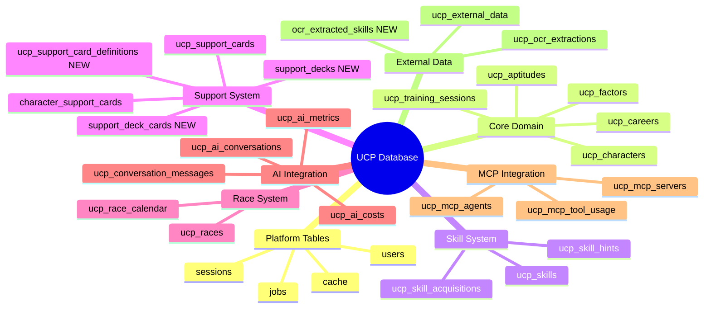

---

## 2. High-Level Entity Overview

### 2.1 Entity Group Classification

The database consists of 15 major entity groups supporting the complete application functionality:

```mermaid
flowchart TD
    subgraph Platform[&#34;Platform Layer&#34;]
        Users[&#34;users&#34;]
        Sessions[&#34;sessions&#34;]
        Cache[&#34;cache&#34;]
    end
    
    subgraph Core[&#34;Core Domain Layer&#34;]
        Characters[&#34;ucp_characters&#34;]
        Careers[&#34;ucp_careers&#34;]
        Training[&#34;ucp_training_sessions&#34;]
    end
    
    subgraph Skills[&#34;Skill System&#34;]
        SkillCatalog[&#34;ucp_skills&#34;]
        SkillHints[&#34;ucp_skill_hints&#34;]
        SkillAcq[&#34;ucp_skill_acquisitions&#34;]
    end
    
    subgraph Support[&#34;Support System&#34;]
        SupportCards[&#34;ucp_support_cards&#34;]
        Decks[&#34;character_support_cards&#34;]
    end
    
    subgraph AI[&#34;AI Integration&#34;]
        AIConv[&#34;ucp_ai_conversations&#34;]
        AIMessages[&#34;ucp_conversation_messages&#34;]
        AICosts[&#34;ucp_ai_costs&#34;]
    end
    
    subgraph MCP[&#34;MCP Integration&#34;]
        MCPServers[&#34;ucp_mcp_servers&#34;]
        MCPAgents[&#34;ucp_mcp_agents&#34;]
        MCPUsage[&#34;ucp_mcp_tool_usage&#34;]
    end
    
    Users --&gt; Characters
    Characters --&gt; Careers
    Careers --&gt; Training
    Characters --&gt; SkillAcq
    Characters --&gt; Decks
    Users --&gt; AIConv
    AIConv --&gt; AIMessages
```

### 2.2 Entity Count Summary

| Group | Table Count | Primary Purpose |
|-------|-------------|-----------------|
| Platform | 8 | Laravel infrastructure (users, sessions, cache, jobs) |
| Core Domain | 6 | Character, career, training tracking |
| Skill System | 3 | Skill catalog and acquisition |
| Support System | 2 | Support card management |
| Race System | 2 | Race calendar and results |
| AI Integration | 5 | AI conversations and metrics |
| MCP Integration | 4 | MCP server and tool management |
| External Data | 4 | External API cache and OCR (includes 1 new table) |

**Total Tables**: 37 (was 33, +4 new tables from January 2026)

---

## 3. Core Entity Relationships

### 3.1 Primary Domain Model

The core domain model centers around Users, Characters, and Careers, with supporting entities for training, skills, and races.

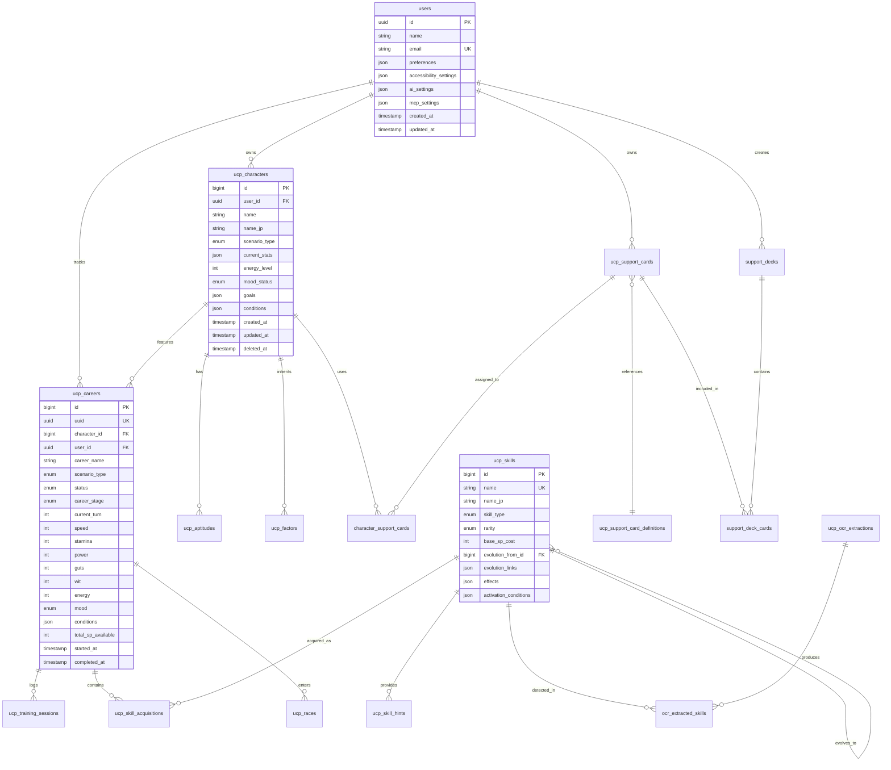

### 3.2 Relationship Cardinality

| Relationship | Cardinality | Description |
|--------------|-------------|-------------|
| users → ucp_characters | 1:N | One user owns many characters |
| users → ucp_careers | 1:N | One user tracks many career runs |
| ucp_characters → ucp_careers | 1:N | One character used in many careers |
| ucp_careers → ucp_training_sessions | 1:N | One career has many training sessions |
| ucp_careers → ucp_skill_acquisitions | 1:N | One career acquires many skills |
| ucp_skills → ucp_skill_acquisitions | 1:N | One skill acquired in many careers |
| ucp_skills → ucp_skills | 1:1 | Self-referential for skill evolution |
| ucp_support_cards → character_support_cards | 1:N | One card used in many decks |
| ucp_characters → character_support_cards | 1:N | One character has 6 support cards |

---

## 4. Domain Entity Groups

### 4.1 User Management Entities

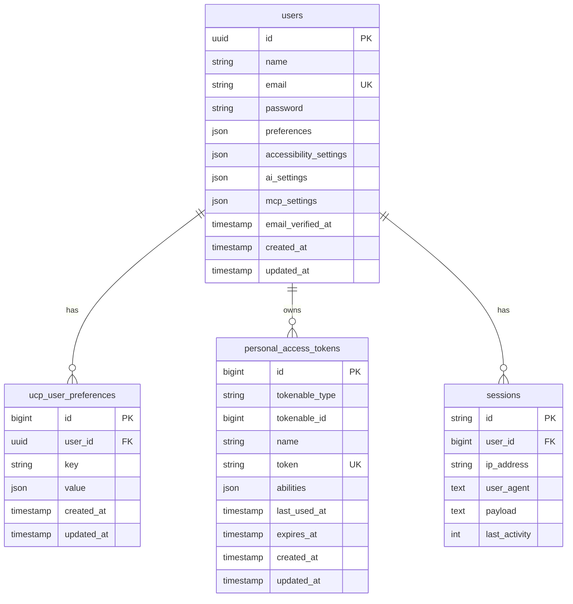

**Key Features:**

- UUID primary keys for users (Laravel 12 default)
- JSON columns for flexible preferences storage
- Sanctum tokens for API authentication
- Session management for web authentication

### 4.2 Character System Entities

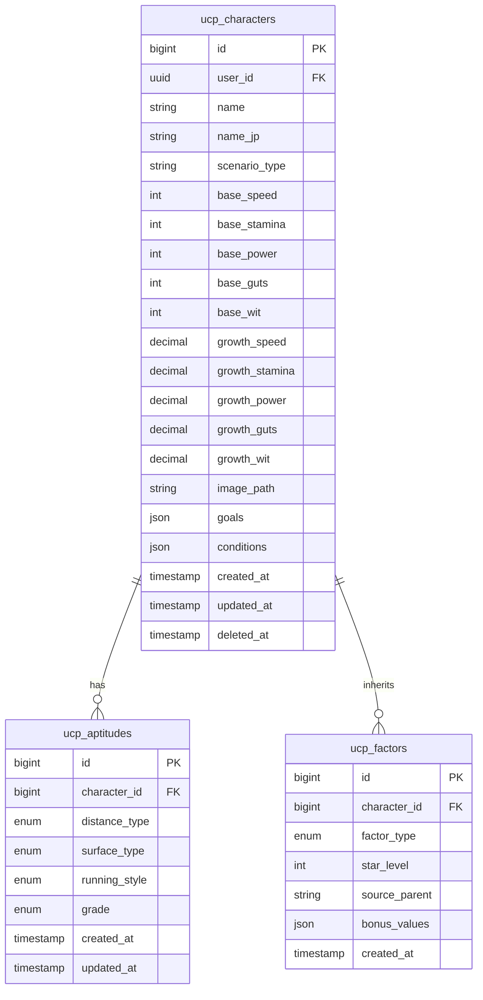

**Aptitude Grades**: SS, S, A, B, C, D, E, F, G (effectiveness: 120% to 40%)

**Factor Star Levels**: ★☆☆ (+5), ★★☆ (+12), ★★★ (+21)

### 4.3 Career Tracking Entities

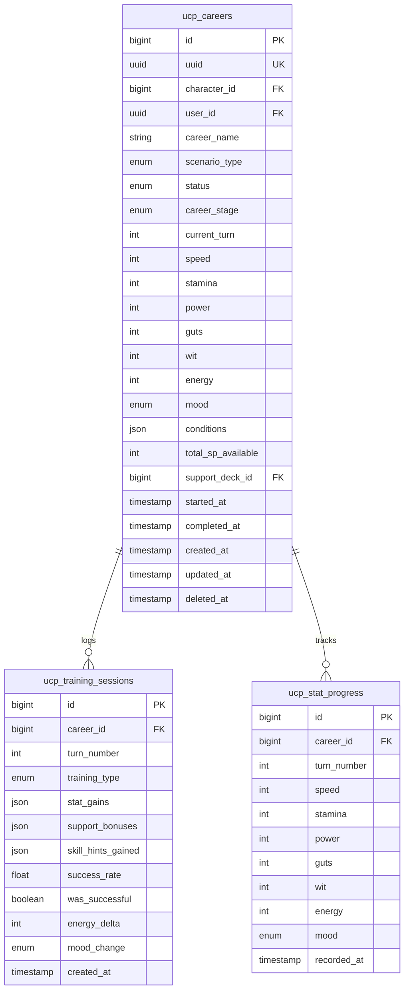

**Training Types**: Speed, Stamina, Power, Guts, Wit, Rest

**Career Stages**: Junior (1-24), Classic (25-48), Senior (49-72), URA Finals (73-78)

**Stat Range**: 0-1200 (hard cap)

### 4.4 Skill System Entities

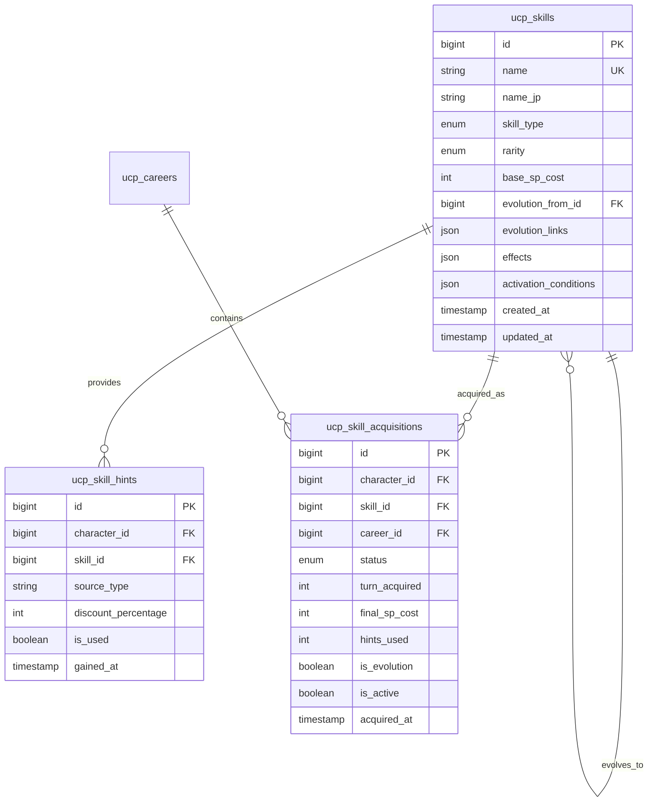

**Skill Types**: Speed, Stamina, Power, Guts, Wit, Unique, Recovery

**Skill Rarity**: Normal, Rare, Unique, Inherited

**Hint Discount**: 20% per hint, maximum 40% (2+ hints)

**Skill Status**: Acquired, Skipped, Suggested, Planned

---

## 5. Extended Entity Relationships

### 5.1 Support Card System

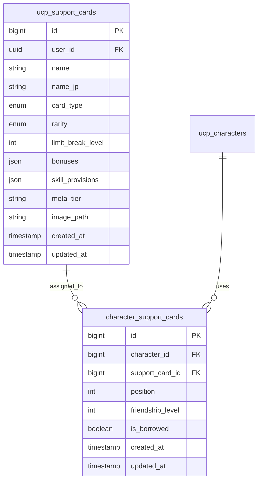

**Card Types**: Speed, Stamina, Power, Guts, Wit, Friend

**Rarity**: SSR, SR, R

**Meta Tiers**: SS, S, A, B, C

**Deck Composition**: 6 cards total (5 owned + 1 borrowed)

**Position**: 1-6 (unique per character)

### 5.2 Race System

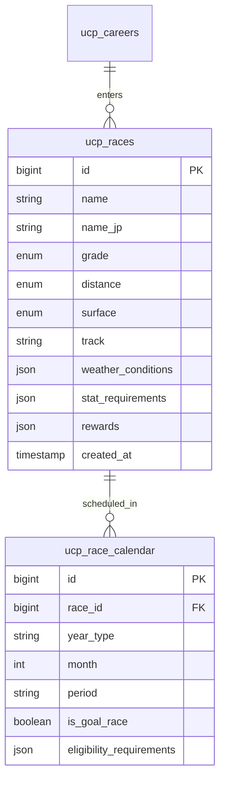

**Race Grades**: G1, G2, G3, OP, Pre-OP

**Distances**: Sprint (1000-1400m), Mile (1401-1800m), Medium (1801-2400m), Long (2401m+)

**Surfaces**: Turf, Dirt

**Running Styles**: Front Runner (Nige), Pace Chaser (Senkou), Late Surger (Sashi), End Closer (Oikomi)

### 5.3 AI Integration System

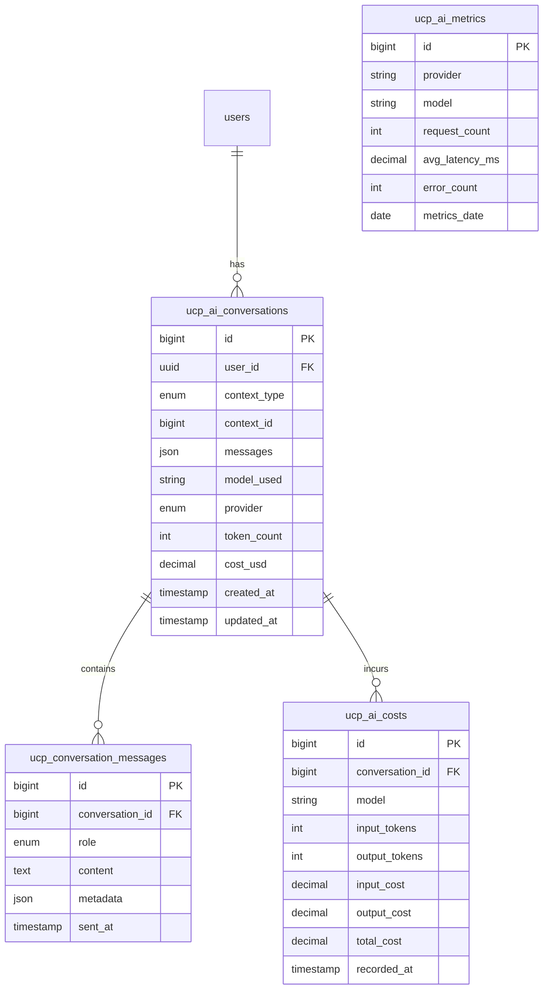

**AI Providers**: Ollama (local), Bedrock (cloud)

**Context Types**: Training, Race, Skill, Career, General

**Message Roles**: User, Assistant, System

**Cost Tracking**: Per-token pricing for AWS Bedrock models

### 5.4 MCP Integration System

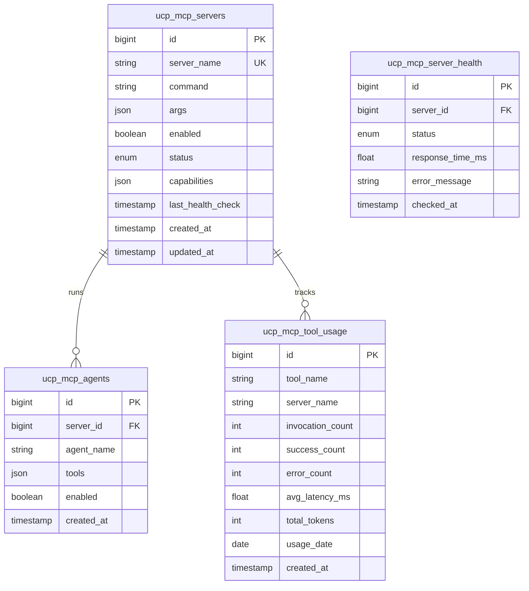

**MCP Servers**: Memory, Filesystem, Fetch, Custom

**Agent Types**: Training Advisor, Race Strategy, Skill Advisor, Career Planner

**Health Status**: Healthy, Degraded, Unhealthy, Offline

### 5.5 External Data Integration

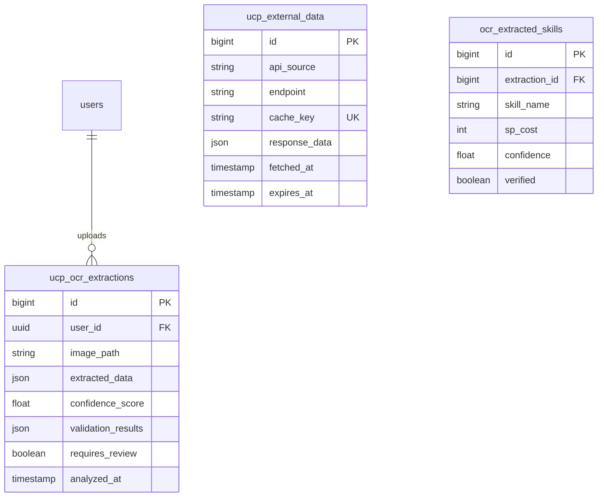

**External APIs**: umapyoi.net, umamusumedb.com

**Cache TTL**: 24 hours (86400 seconds)

**OCR Confidence Threshold**: 85% for auto-import

---

## 6. Database Schema Specifications

### 6.1 Core Table Specifications

#### users

| Column | Type | Constraints | Description |
|--------|------|-------------|-------------|
| `id` | UUID | PK | Primary key |
| `name` | VARCHAR(255) | NOT NULL | Display name |
| `email` | VARCHAR(255) | UNIQUE, NOT NULL | Login email |
| `password` | VARCHAR(255) | NOT NULL | Hashed password |
| `preferences` | JSON | NULLABLE | UI preferences |
| `accessibility_settings` | JSON | NULLABLE | A11y settings |
| `ai_settings` | JSON | NULLABLE | AI preferences |
| `mcp_settings` | JSON | NULLABLE | MCP server preferences |
| `email_verified_at` | TIMESTAMP | NULLABLE | Verification timestamp |
| `created_at` | TIMESTAMP | - | Creation timestamp |
| `updated_at` | TIMESTAMP | - | Last update timestamp |

#### ucp_characters

| Column | Type | Constraints | Description |
|--------|------|-------------|-------------|
| `id` | BIGINT | PK, AUTO_INCREMENT | Primary key |
| `user_id` | UUID | FK → users | Owner |
| `name` | VARCHAR(255) | NOT NULL | Character name |
| `name_jp` | VARCHAR(255) | NULLABLE | Japanese name |
| `scenario_type` | ENUM | NOT NULL | `ura_finale`, `unity_cup` |
| `base_speed` | INT | NOT NULL | Base speed stat |
| `base_stamina` | INT | NOT NULL | Base stamina stat |
| `base_power` | INT | NOT NULL | Base power stat |
| `base_guts` | INT | NOT NULL | Base guts stat |
| `base_wit` | INT | NOT NULL | Base wit stat |
| `growth_speed` | DECIMAL(5,2) | NOT NULL | Growth rate multiplier |
| `growth_stamina` | DECIMAL(5,2) | NOT NULL | Growth rate multiplier |
| `growth_power` | DECIMAL(5,2) | NOT NULL | Growth rate multiplier |
| `growth_guts` | DECIMAL(5,2) | NOT NULL | Growth rate multiplier |
| `growth_wit` | DECIMAL(5,2) | NOT NULL | Growth rate multiplier |
| `image_path` | VARCHAR(500) | NULLABLE | Character image |
| `goals` | JSON | NULLABLE | Active goals |
| `conditions` | JSON | NULLABLE | Active conditions |
| `created_at` | TIMESTAMP | - | Creation timestamp |
| `updated_at` | TIMESTAMP | - | Last update timestamp |
| `deleted_at` | TIMESTAMP | NULLABLE | Soft delete timestamp |

#### ucp_careers

| Column | Type | Constraints | Description |
|--------|------|-------------|-------------|
| `id` | BIGINT | PK, AUTO_INCREMENT | Primary key |
| `uuid` | UUID | UNIQUE | Universal identifier |
| `character_id` | BIGINT | FK → ucp_characters | Character reference |
| `user_id` | UUID | FK → users | Owner |
| `career_name` | VARCHAR(255) | NOT NULL | Career run title |
| `scenario_type` | ENUM | NOT NULL | Scenario type |
| `status` | ENUM | NOT NULL | `in_progress`, `completed`, `abandoned` |
| `career_stage` | ENUM | NOT NULL | `junior`, `classic`, `senior` |
| `current_turn` | INT | NOT NULL | Current turn (1-78) |
| `speed` | INT | NOT NULL | Current speed (0-1200) |
| `stamina` | INT | NOT NULL | Current stamina (0-1200) |
| `power` | INT | NOT NULL | Current power (0-1200) |
| `guts` | INT | NOT NULL | Current guts (0-1200) |
| `wit` | INT | NOT NULL | Current wit (0-1200) |
| `energy` | INT | NOT NULL | Energy level (0-100) |
| `mood` | ENUM | NOT NULL | `great`, `good`, `normal`, `bad`, `awful` |
| `conditions` | JSON | NULLABLE | Active conditions |
| `total_sp_available` | INT | NOT NULL | Total SP earned |
| `support_deck_id` | BIGINT | FK, NULLABLE | Active support deck |
| `started_at` | TIMESTAMP | NULLABLE | Career start time |
| `completed_at` | TIMESTAMP | NULLABLE | Career completion time |
| `created_at` | TIMESTAMP | - | Creation timestamp |
| `updated_at` | TIMESTAMP | - | Last update timestamp |
| `deleted_at` | TIMESTAMP | NULLABLE | Soft delete timestamp |

#### ucp_skills

| Column | Type | Constraints | Description |
|--------|------|-------------|-------------|
| `id` | BIGINT | PK, AUTO_INCREMENT | Primary key |
| `name` | VARCHAR(255) | UNIQUE, NOT NULL | English name |
| `name_jp` | VARCHAR(255) | NULLABLE | Japanese name |
| `skill_type` | ENUM | NOT NULL | `speed`, `stamina`, `power`, `guts`, `wit`, `unique`, `recovery` |
| `rarity` | ENUM | NOT NULL | `normal`, `rare`, `unique`, `inherited` |
| `base_sp_cost` | INT | NOT NULL | Base SP cost |
| `evolution_from_id` | BIGINT | FK → ucp_skills, NULLABLE | Source skill for evolution |
| `evolution_links` | JSON | NULLABLE | Evolution path data |
| `effects` | JSON | NULLABLE | Skill effects |
| `activation_conditions` | JSON | NULLABLE | Trigger conditions |
| `created_at` | TIMESTAMP | - | Creation timestamp |
| `updated_at` | TIMESTAMP | - | Last update timestamp |

### 6.2 Constraint Specifications

#### Business Logic Constraints

```sql
-- Stat value ranges (0-1200 hard cap)
ALTER TABLE ucp_careers ADD CONSTRAINT chk_stat_ranges
    CHECK (speed BETWEEN 0 AND 1200 
       AND stamina BETWEEN 0 AND 1200
       AND power BETWEEN 0 AND 1200 
       AND guts BETWEEN 0 AND 1200
       AND wit BETWEEN 0 AND 1200);

-- Energy level range (0-100)
ALTER TABLE ucp_careers ADD CONSTRAINT chk_energy_range
    CHECK (energy BETWEEN 0 AND 100);

-- Turn number range (1-78)
ALTER TABLE ucp_careers ADD CONSTRAINT chk_turn_range
    CHECK (current_turn BETWEEN 1 AND 78);

-- Support deck size (exactly 6 cards)
ALTER TABLE character_support_cards ADD CONSTRAINT chk_deck_size
    CHECK (position BETWEEN 1 AND 6);

-- Skill hint discount cap (max 40%)
ALTER TABLE ucp_skill_hints ADD CONSTRAINT chk_hint_discount
    CHECK (discount_percentage BETWEEN 0 AND 40);
```

#### Referential Integrity Constraints

```sql
-- Cascade delete for user-owned data
ALTER TABLE ucp_characters ADD CONSTRAINT fk_character_user
    FOREIGN KEY (user_id) REFERENCES users(id) ON DELETE CASCADE;

ALTER TABLE ucp_careers ADD CONSTRAINT fk_career_user
    FOREIGN KEY (user_id) REFERENCES users(id) ON DELETE CASCADE;

-- Cascade delete for career-dependent data
ALTER TABLE ucp_training_sessions ADD CONSTRAINT fk_training_career
    FOREIGN KEY (career_id) REFERENCES ucp_careers(id) ON DELETE CASCADE;

ALTER TABLE ucp_skill_acquisitions ADD CONSTRAINT fk_acquisition_career
    FOREIGN KEY (career_id) REFERENCES ucp_careers(id) ON DELETE CASCADE;

-- Restrict delete for referenced skills
ALTER TABLE ucp_skill_acquisitions ADD CONSTRAINT fk_acquisition_skill
    FOREIGN KEY (skill_id) REFERENCES ucp_skills(id) ON DELETE RESTRICT;

-- Unique constraints
ALTER TABLE character_support_cards ADD CONSTRAINT uk_character_position
    UNIQUE (character_id, position);

ALTER TABLE ucp_external_data ADD CONSTRAINT uk_cache_key
    UNIQUE (cache_key);
```

### 6.3 Cascade Rules Summary

```mermaid
flowchart TD
    users[&#34;users<br/>(Soft Delete)&#34;]
    
    users --&gt;|&#34;CASCADE&#34;| characters[&#34;ucp_characters&#34;]
    users --&gt;|&#34;CASCADE&#34;| careers[&#34;ucp_careers&#34;]
    users --&gt;|&#34;CASCADE&#34;| support_cards[&#34;ucp_support_cards&#34;]
    users --&gt;|&#34;CASCADE&#34;| ai_conv[&#34;ucp_ai_conversations&#34;]
    users --&gt;|&#34;SET NULL&#34;| ocr[&#34;ucp_ocr_extractions&#34;]
    
    characters --&gt;|&#34;CASCADE&#34;| careers
    characters --&gt;|&#34;CASCADE&#34;| aptitudes[&#34;ucp_aptitudes&#34;]
    characters --&gt;|&#34;CASCADE&#34;| factors[&#34;ucp_factors&#34;]
    characters --&gt;|&#34;CASCADE&#34;| deck[&#34;character_support_cards&#34;]
    
    careers --&gt;|&#34;CASCADE&#34;| training[&#34;ucp_training_sessions&#34;]
    careers --&gt;|&#34;CASCADE&#34;| acquisitions[&#34;ucp_skill_acquisitions&#34;]
    
    support_cards --&gt;|&#34;RESTRICT&#34;| deck
    skills[&#34;ucp_skills&#34;] --&gt;|&#34;RESTRICT&#34;| acquisitions
```

---

## 7. Data Integrity Constraints

### 7.1 Data Validation Rules

| Rule | Table | Constraint | Enforcement |
|------|-------|------------|-------------|
| Stat Range | `ucp_careers` | 0-1200 (hard cap) | Database CHECK |
| Energy Range | `ucp_careers` | 0-100 | Database CHECK |
| Turn Range | `ucp_careers`, `ucp_training_sessions` | 1-78 | Database CHECK |
| Deck Size | `character_support_cards` | Position 1-6 | UNIQUE constraint |
| Hint Discount | `ucp_skill_hints` | 0-40% | Database CHECK |
| SP Cost | `ucp_skills` | &gt; 0 | Application validation |

### 7.2 Soft Delete Implementation

Entities supporting soft deletes:

- `users` (via Laravel default)
- `ucp_characters`
- `ucp_careers`
- `ucp_support_cards`

Recovery window: 30 days before permanent deletion (application-level policy)

### 7.3 Data Retention Policies

| Data Type | Retention | Cleanup Method |
|-----------|-----------|----------------|
| Active careers | Indefinite | User-initiated delete |
| Soft-deleted records | 30 days | Scheduled job |
| AI conversations | 90 days | Scheduled job |
| External API cache | 24 hours | TTL expiration |
| Training predictions | 5 minutes | TTL expiration |
| OCR extractions | 7 days | Scheduled job |
| MCP tool usage metrics | 90 days | Scheduled job |

---

## 8. Indexing Strategy

### 8.1 Primary Indexes

All tables include:

- Primary key index (auto-created)
- Foreign key indexes (auto-created on MySQL 8.0+)
- Timestamp indexes where needed for temporal queries

### 8.2 Performance Indexes

```sql
-- User data access
CREATE INDEX idx_characters_user_scenario ON ucp_characters(user_id, scenario_type);
CREATE INDEX idx_careers_user_status ON ucp_careers(user_id, status);

-- Career progression queries
CREATE INDEX idx_training_career_turn ON ucp_training_sessions(career_id, turn_number);
CREATE INDEX idx_stat_progress_career_turn ON ucp_stat_progress(career_id, turn_number);

-- Skill management
CREATE INDEX idx_acquisitions_character ON ucp_skill_acquisitions(character_id, is_active);
CREATE INDEX idx_hints_character ON ucp_skill_hints(character_id, is_used);

-- AI and MCP
CREATE INDEX idx_ai_conv_user_context ON ucp_ai_conversations(user_id, context_type);
CREATE INDEX idx_mcp_usage_date ON ucp_mcp_tool_usage(usage_date, tool_name);

-- External data
CREATE INDEX idx_external_cache_expiry ON ucp_external_data(cache_key, expires_at);
CREATE INDEX idx_ocr_user_date ON ucp_ocr_extractions(user_id, analyzed_at);
```

### 8.3 Query Performance Targets

| Query Type | Target | Index Used |
|------------|--------|------------|
| User character list | &lt; 100ms | `idx_characters_user_scenario` |
| Career list (paginated) | &lt; 100ms | `idx_careers_user_status` |
| Training history | &lt; 150ms | `idx_training_career_turn` |
| Skill search | &lt; 200ms | Full-text index on name fields |
| AI conversation load | &lt; 150ms | `idx_ai_conv_user_context` |
| External API cache hit | &lt; 50ms | `idx_external_cache_expiry` |

### 8.4 Index Maintenance

- **Rebuild schedule**: Weekly during off-peak hours
- **Statistics update**: After bulk imports or migrations
- **Monitoring**: Query execution plan analysis via APM

---

## 9. Document Control

### 9.1 Related Documents

| Document | Description |
|----------|-------------|
| [DBD - Database Documentation](009_DBD_Database_Documentation.md) | Detailed table schemas |
| [SDS - Software Design Specifications](004_SDS_Software_Design_Specifications.md) | System architecture |
| [DMP - Data Migration Plan](005_DMP_Data_Migration_Plan.md) | Migration strategies |
| [DMS - Data Migration Specifications](006_DMS_Data_Migration_Specifications.md) | Migration technical specs |
| [Data Flow Diagram](data-flow-diagram.md) | System data flows |

### 9.2 Revision History

| Version | Date | Author | Changes |
|---------|------|--------|---------|
| 2.1.0 | 2026-01-23 | Development Team | Updated to v2.0.0 implementation; added AI/MCP/OCR entities; aligned with 59 requirements; industry-standard formatting |
| 2.0.0 | 2026-01-14 | Development Team | Major revision with Mermaid diagrams |
| 1.0.0 | 2026-01-03 | Development Team | Initial draft |

### 9.3 Document Status

**Status**: Current - Aligned with codebase v2.0.0

**Next Review**: Upon next major schema change

**Approval**: Technical Lead, Database Administrator

---

*This ERD reflects the current database schema as implemented in the Laravel 12 application, supporting all 59 system requirements with comprehensive data integrity, indexing, and relationship management.*
