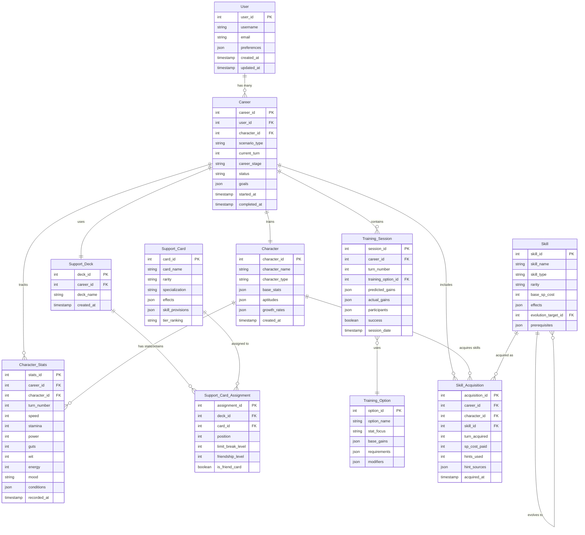
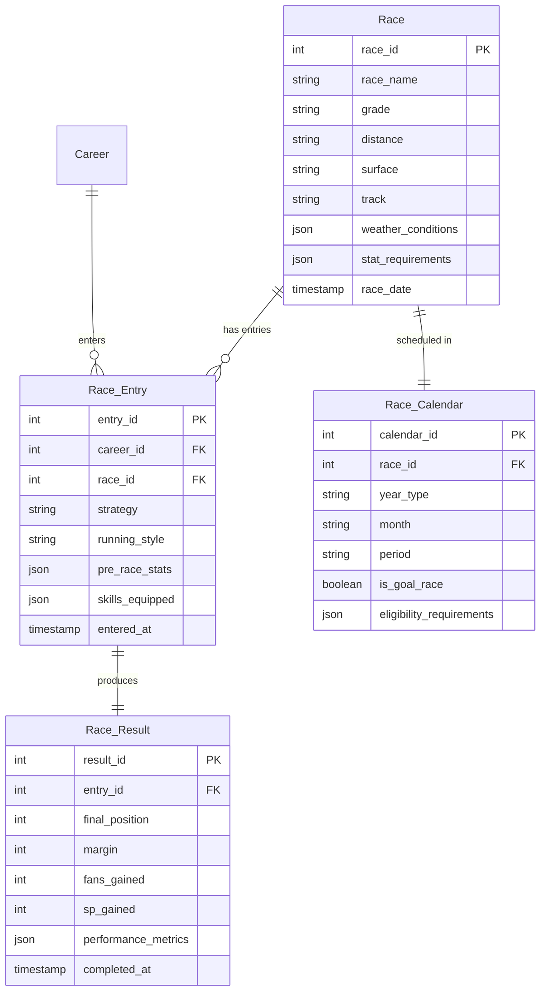
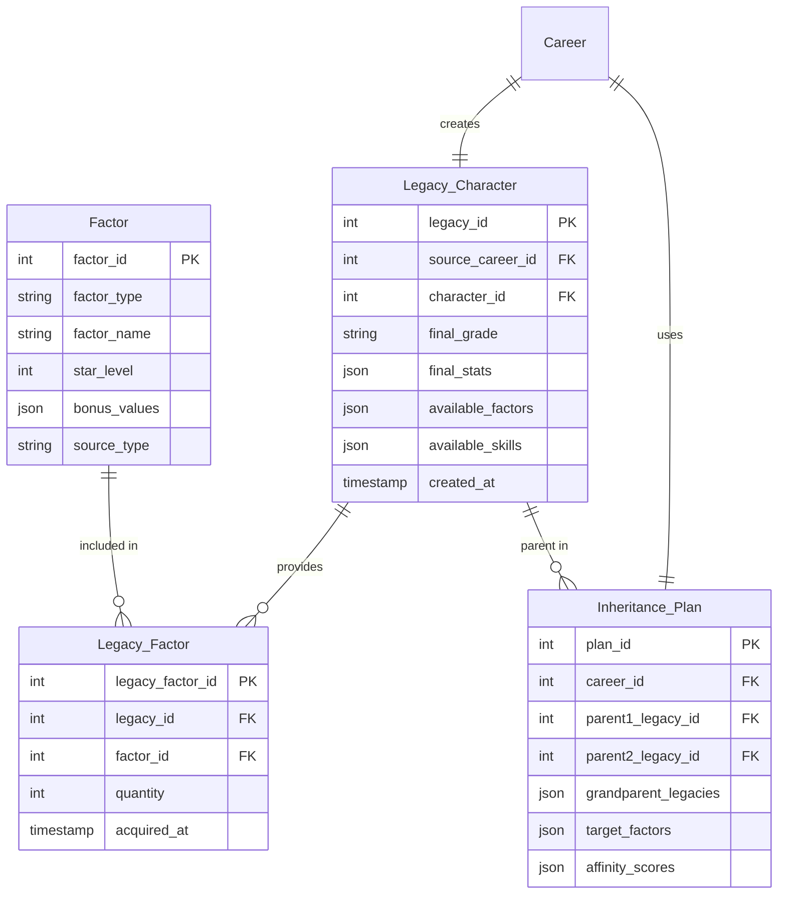
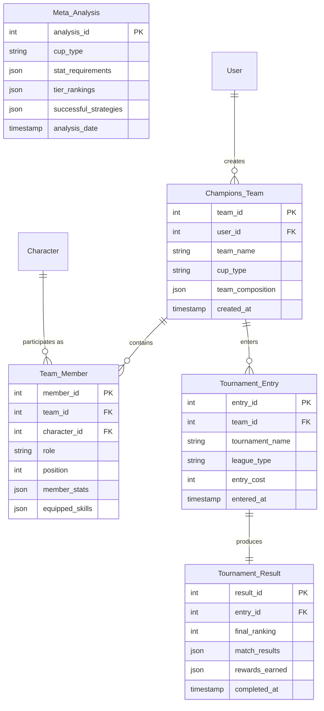
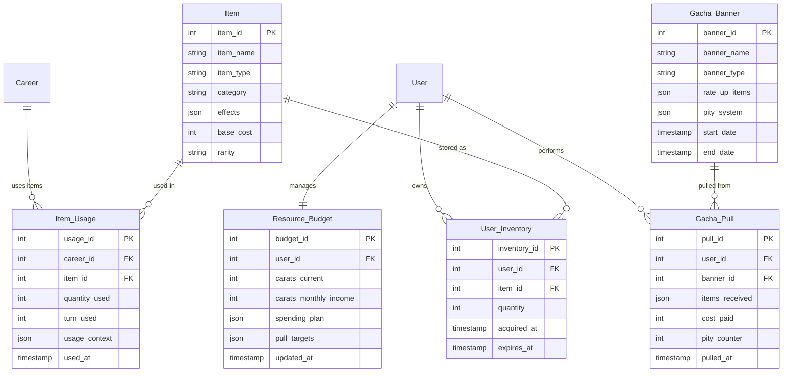
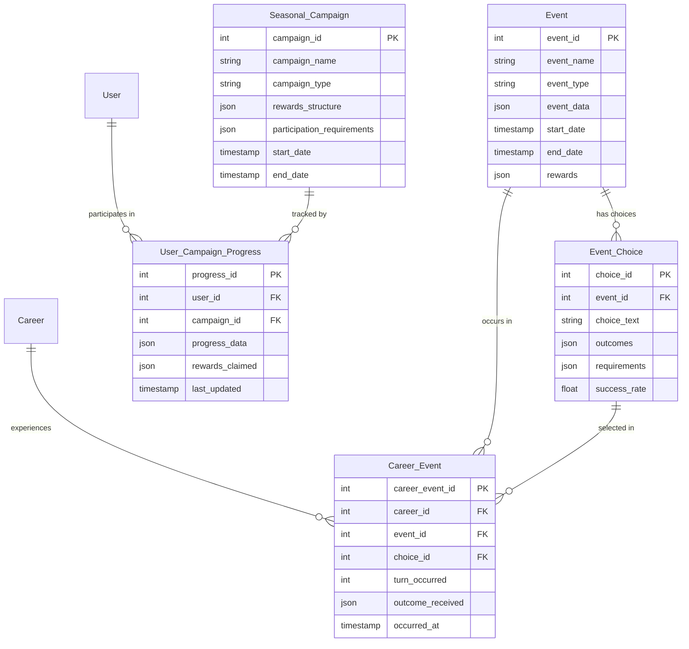
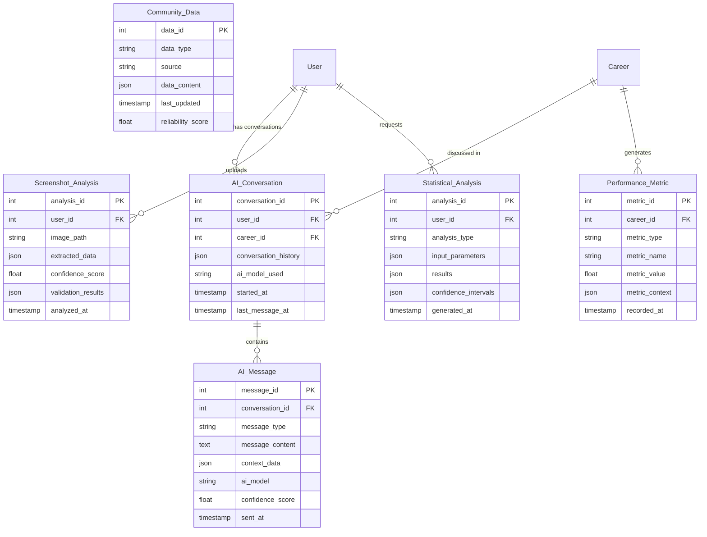

# Umamusume Career Planner - Entity Relationship Diagram (ERD)

## Overview

This document presents the Entity Relationship Diagrams for the Umamusume Pretty Derby Career Planner application, showing the data model structure, relationships between entities, and database schema design that supports all **59 requirements**. The system is built with **Laravel 12** (released February 24, 2025) with **TypeScript support**, **Tailwind CSS v4**, and integrates with **AWS Bedrock** and **Ollama** for AI capabilities.

## High-Level Entity Overview

### Text Description

The database consists of 15 major entity groups:

1. **User Management**: User profiles and preferences
2. **Character System**: Umamusume characters, stats, and aptitudes
3. **Career Management**: Career runs, progression, and historical data
4. **Support Card System**: Support cards, decks, and friendship data
5. **Skill System**: Skills, hints, evolution chains, and acquisition tracking
6. **Training System**: Training sessions, predictions, and outcomes
7. **Race System**: Races, results, and performance analytics
8. **Inheritance System**: Legacy characters, factors, and breeding data
9. **Item System**: Items, inventory, and usage tracking
10. **PvP System**: Champions Meeting teams and tournament data
11. **Event System**: Events, choices, and seasonal content
12. **Meta System**: Community data, tier lists, and competitive analysis
13. **AI System**: Conversation history and AI interaction data
14. **Analytics System**: Performance metrics and statistical analysis
15. **External Integration**: API data synchronization and community connections

### ASCII Entity Overview

```text
[User] ----< [Career] >---- [Character]
  |            |               |
  |            |               |
  v            v               v
[Preferences] [Training]    [Stats]
              [Sessions]    [Aptitudes]
                 |            |
                 |            |
                 v            v
              [Support]    [Skills]
              [Cards]      [Hints]
                 |            |
                 |            |
                 v            v
              [Friendship] [Evolution]
              [Training]   [Chains]
                 |            |
                 |            |
                 v            v
              [Race]       [Items]
              [Results]    [Inventory]
                 |            |
                 |            |
                 v            v
              [PvP]        [Events]
              [Teams]      [Choices]
                 |            |
                 |            |
                 v            v
              [Meta]       [AI]
              [Data]       [Conversations]
```

## Core Entity Relationship Diagram

### Text Description

The core entities and their relationships:

**User (1) ----< Career (M)**

- One user can have many career runs
- Each career belongs to one user

**Career (1) ----< Character (1)**

- Each career focuses on one character
- Character can be used in multiple careers

**Career (1) ----< Support_Deck (1) ----< Support_Card_Assignment (M) >---- Support_Card (1)**

- Each career has one support deck
- Support deck contains 6 card assignments (5 owned + 1 friend)
- Each assignment references one support card

**Character (1) ----< Character_Stats (M)**

- Character has multiple stat records (historical progression)
- Each stat record belongs to one character

**Career (1) ----< Training_Session (M) >---- Training_Option (1)**

- Career contains many training sessions
- Each session uses one training option

**Character (1) ----< Skill_Acquisition (M) >---- Skill (1)**

- Character can acquire many skills
- Each acquisition references one skill

### Mermaid ERD - Core Entities



## Extended Entity Relationships

### Race and Performance System



### Inheritance and Legacy System



### PvP and Champions Meeting System



### Item and Resource Management System



### Event and Seasonal Content System



### AI and Analytics System



## Database Schema Considerations

### Indexing Strategy

```sql
-- Primary performance indexes
CREATE INDEX idx_career_user_id ON Career(user_id);
CREATE INDEX idx_career_character_id ON Career(character_id);
CREATE INDEX idx_training_session_career_turn ON Training_Session(career_id, turn_number);
CREATE INDEX idx_character_stats_career_turn ON Character_Stats(career_id, turn_number);
CREATE INDEX idx_skill_acquisition_career ON Skill_Acquisition(career_id);
CREATE INDEX idx_race_entry_career ON Race_Entry(career_id);

-- Search and filtering indexes
CREATE INDEX idx_support_card_tier ON Support_Card(tier_ranking);
CREATE INDEX idx_skill_type_rarity ON Skill(skill_type, rarity);
CREATE INDEX idx_race_grade_distance ON Race(grade, distance);
CREATE INDEX idx_event_type_date ON Event(event_type, start_date);

-- Analytics indexes
CREATE INDEX idx_performance_metric_type ON Performance_Metric(metric_type, recorded_at);
CREATE INDEX idx_tournament_result_ranking ON Tournament_Result(final_ranking);
CREATE INDEX idx_gacha_pull_banner_date ON Gacha_Pull(banner_id, pulled_at);
```

### Data Integrity Constraints

```sql
-- Referential integrity
ALTER TABLE Career ADD CONSTRAINT fk_career_user
    FOREIGN KEY (user_id) REFERENCES User(user_id) ON DELETE CASCADE;

ALTER TABLE Character_Stats ADD CONSTRAINT fk_stats_career
    FOREIGN KEY (career_id) REFERENCES Career(career_id) ON DELETE CASCADE;

-- Business logic constraints
ALTER TABLE Support_Card_Assignment ADD CONSTRAINT chk_position_range
    CHECK (position BETWEEN 1 AND 6);

ALTER TABLE Character_Stats ADD CONSTRAINT chk_stat_ranges
    CHECK (speed BETWEEN 0 AND 1200 AND stamina BETWEEN 0 AND 1200
           AND power BETWEEN 0 AND 1200 AND guts BETWEEN 0 AND 1200
           AND wit BETWEEN 0 AND 1200);

ALTER TABLE Training_Session ADD CONSTRAINT chk_turn_positive
    CHECK (turn_number > 0);

-- Unique constraints
ALTER TABLE Support_Card_Assignment ADD CONSTRAINT uk_deck_position
    UNIQUE (deck_id, position);

ALTER TABLE Legacy_Factor ADD CONSTRAINT uk_legacy_factor
    UNIQUE (legacy_id, factor_id);
```

### Partitioning Strategy

```sql
-- Partition large tables by date for performance
CREATE TABLE Training_Session (
    -- columns...
) PARTITION BY RANGE (session_date) (
    PARTITION p_2024 VALUES LESS THAN ('2025-01-01'),
    PARTITION p_2025 VALUES LESS THAN ('2026-01-01'),
    PARTITION p_future VALUES LESS THAN MAXVALUE
);

-- Partition analytics tables by metric type
CREATE TABLE Performance_Metric (
    -- columns...
) PARTITION BY LIST (metric_type) (
    PARTITION p_training VALUES IN ('training_efficiency', 'stat_gains'),
    PARTITION p_racing VALUES IN ('race_performance', 'win_rate'),
    PARTITION p_general VALUES IN ('career_progress', 'goal_completion')
);
```

## Entity Relationship Summary

### Key Relationships

1. **User-Centric Design**: All data flows from User entity, enabling multi-user support
2. **Career-Focused Structure**: Career is the central entity connecting all gameplay data
3. **Hierarchical Character Data**: Character → Stats → Skills → Training progression
4. **Flexible Support System**: Support cards with dynamic deck composition
5. **Comprehensive Analytics**: Performance tracking across all game aspects
6. **Community Integration**: External data synchronization and sharing capabilities

### Scalability Considerations

- **Horizontal Partitioning**: Large tables partitioned by date or type
- **Indexing Strategy**: Optimized for common query patterns
- **Data Archival**: Historical data management for long-term analytics
- **Caching Layer**: Frequently accessed data cached for performance
- **API Integration**: External data synchronized with conflict resolution

This comprehensive ERD structure supports all 59 requirements while maintaining data integrity, performance, and scalability for the complete Umamusume optimization system.
