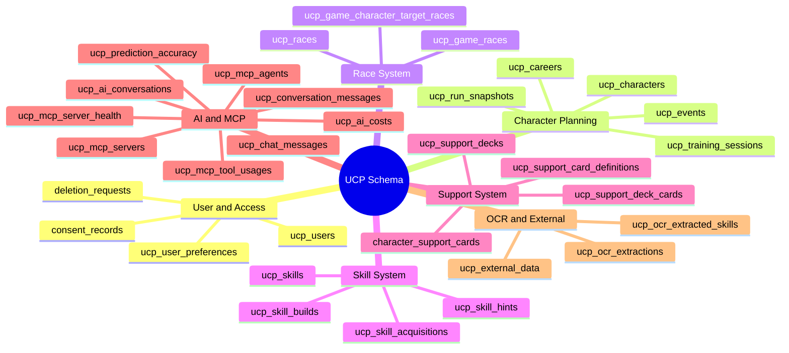
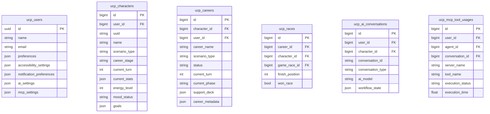

# Umamusume Career Planner - Entity Relationship Diagram

**Document Version**: 2.4.1
**Date**: March 10, 2026
**Project**: UmamusumeCareerPlanner
**Author**: Development Team
**Status**: Current - rebuilt from current model table mappings and migration-backed schema names

---

## 1. Overview

> **Diagram scope**: Repository-aligned implementation reference. This ERD focuses on the current table names used by models and current migrations. It is representative, not an exhaustive dump of every Laravel infrastructure table.

### 1.1 Rebuild Rules

- Prefer actual model table mappings over older documentation labels.
- Keep migration-backed tables without Eloquent models only where they materially affect relationships.
- Preserve mixed naming when that is what the repo currently uses, even if it is not perfectly uniform.

### 1.2 Current Inventory Baseline

| Area | Current Reference |
| --- | --- |
| Eloquent models | 40 model classes in `app/Models` |
| User table | `ucp_users` |
| Core run tables | `ucp_characters`, `ucp_careers`, `ucp_training_sessions`, `ucp_races` |
| Race catalog tables | `ucp_game_races`, `ucp_game_character_target_races` |
| Skill tables | `ucp_skills`, `ucp_skill_hints`, `ucp_skill_acquisitions`, `ucp_skill_builds` |
| Support tables | `ucp_support_decks`, `ucp_support_deck_cards`, `character_support_cards`, `ucp_support_card_definitions` |
| AI tables | `ucp_ai_conversations`, `ucp_conversation_messages`, `ucp_chat_messages`, `ucp_ai_costs`, `ucp_prediction_accuracy` |
| MCP tables | `ucp_mcp_servers`, `ucp_mcp_agents`, `ucp_mcp_tool_usages`, `ucp_mcp_server_health` |
| OCR tables | `ucp_ocr_extractions`, `ucp_ocr_extracted_skills` |

---

## 2. Domain Group Overview



    ```text
    UCP Schema
    |- User and Access
    |  |- ucp_users
    |  |- ucp_user_preferences
    |  |- deletion_requests
    |  \- consent_records
    |- Character Planning
    |  |- ucp_characters
    |  |- ucp_careers
    |  |- ucp_training_sessions
    |  |- ucp_run_snapshots
    |  \- ucp_events
    |- Race System
    |  |- ucp_game_races
    |  |- ucp_game_character_target_races
    |  \- ucp_races
    |- Skill System
    |  |- ucp_skills
    |  |- ucp_skill_hints
    |  |- ucp_skill_acquisitions
    |  \- ucp_skill_builds
    |- Support System
    |  |- ucp_support_card_definitions
    |  |- ucp_support_decks
    |  |- ucp_support_deck_cards
    |  \- character_support_cards
    |- AI and MCP
    |  |- ucp_ai_conversations
    |  |- ucp_conversation_messages
    |  |- ucp_chat_messages
    |  |- ucp_ai_costs
    |  |- ucp_prediction_accuracy
    |  |- ucp_mcp_servers
    |  |- ucp_mcp_agents
    |  |- ucp_mcp_tool_usages
    |  \- ucp_mcp_server_health
    \- OCR and External
       |- ucp_ocr_extractions
       |- ucp_ocr_extracted_skills
       \- ucp_external_data
    ```

---

## 3. Core ERD

```mermaid
erDiagram
    ucp_users ||--o{ ucp_characters : owns
    ucp_users ||--o{ ucp_ai_conversations : starts
    ucp_users ||--o{ ucp_ocr_extractions : uploads
    ucp_users ||--o{ ucp_ai_costs : incurs
    ucp_users ||--o{ ucp_mcp_agents : owns

    ucp_characters ||--o{ ucp_careers : runs
    ucp_characters ||--o{ ucp_aptitudes : has
    ucp_characters ||--o{ ucp_factors : has
    ucp_characters ||--o{ ucp_training_sessions : logs
    ucp_characters ||--o{ ucp_races : enters
    ucp_characters ||--o{ character_support_cards : equips

    ucp_careers ||--o{ ucp_training_sessions : records
    ucp_careers ||--o{ ucp_races : records
    ucp_careers ||--o{ ucp_events : records
    ucp_careers ||--o{ ucp_run_snapshots : snapshots
    ucp_careers ||--o{ ucp_prediction_accuracy : evaluates

    ucp_game_races ||--o{ ucp_races : catalog_for
    ucp_game_races ||--o{ ucp_game_character_target_races : target_map

    ucp_skills ||--o{ ucp_skill_hints : discounts
    ucp_skills ||--o{ ucp_skill_acquisitions : acquired_as
    ucp_skills ||--o{ ucp_ocr_extracted_skills : detected_as

    ucp_support_card_definitions ||--o{ character_support_cards : selected_as
    ucp_support_card_definitions ||--o{ ucp_support_deck_cards : slotted_as
    ucp_support_decks ||--o{ ucp_support_deck_cards : contains

    ucp_ai_conversations ||--o{ ucp_conversation_messages : contains
    ucp_ai_conversations ||--o{ ucp_mcp_tool_usages : drives
    ucp_mcp_agents ||--o{ ucp_mcp_tool_usages : executes
    ucp_mcp_servers ||--o{ ucp_mcp_tool_usages : serves

    ucp_ocr_extractions ||--o{ ucp_ocr_extracted_skills : extracts
```



```text
ucp_users
  |- owns -> ucp_characters

  |- starts -> ucp_ai_conversations
  |- uploads -> ucp_ocr_extractions
  |- incurs -> ucp_ai_costs
  \- owns -> ucp_mcp_agents

ucp_characters
  |- runs -> ucp_careers
  |- has -> ucp_aptitudes
  |- has -> ucp_factors
  |- logs -> ucp_training_sessions
  |- enters -> ucp_races
  |- equips -> character_support_cards


ucp_careers
  |- records -> ucp_training_sessions
  |- records -> ucp_races
  |- records -> ucp_events
  |- snapshots -> ucp_run_snapshots
  \- evaluates -> ucp_prediction_accuracy

ucp_game_races
  |- catalog_for -> ucp_races
  \- target_map -> ucp_game_character_target_races

ucp_skills
  |- discounts -> ucp_skill_hints
  |- acquired_as -> ucp_skill_acquisitions
  \- detected_as -> ucp_ocr_extracted_skills

ucp_support_card_definitions
  |- selected_as -> character_support_cards
  \- slotted_as -> ucp_support_deck_cards

ucp_support_decks
  \- contains -> ucp_support_deck_cards

ucp_ai_conversations
  |- contains -> ucp_conversation_messages
  \- drives -> ucp_mcp_tool_usages

ucp_mcp_agents
  \- executes -> ucp_mcp_tool_usages

ucp_mcp_servers
  \- serves -> ucp_mcp_tool_usages

ucp_ocr_extractions
  \- extracts -> ucp_ocr_extracted_skills
```

### 3.1 Important Corrections From Older ERDs

- The user table is `ucp_users`, not `users`, for the application domain.
- `character_support_cards` is still an actual active table name and should not be silently renamed in docs.
  - The absence of the `ucp_` prefix on this table is **intentional** — it follows the Laravel pivot-
  table convention (alphabetical noun pair) rather than the application prefix convention applied to
  standalone entity tables.
- OCR skill rows are stored in `ucp_ocr_extracted_skills`, not `ocr_extracted_skills`.
- Conversation records are split between `ucp_ai_conversations` and `ucp_conversation_messages`;
`ucp_chat_messages` is documented separately rather than merged into the conversation message table.
- `ucp_careers` carries a direct `user_id` foreign key alongside the `character_id` FK. This is
intentional denormalization for query performance — it allows direct career-to-user lookups without
joining through `ucp_characters`.

---

## 4. Relationship Notes by Subsystem

### 4.1 Character and Career

| Relationship | Meaning |
| --- | --- |
| `ucp_users -> ucp_characters` | Authenticated users own characters |
| `ucp_characters -> ucp_careers` | A character can have many career runs |
| `ucp_careers -> ucp_training_sessions` | Training history is tracked per career |
| `ucp_careers -> ucp_races` | Race outcomes belong to the career timeline |

### 4.2 Race Planning

| Relationship | Meaning |
| --- | --- |
| `ucp_game_races -> ucp_races` | Race catalog entries drive concrete race result rows |
| `ucp_game_races -> ucp_game_character_target_races` | Target-race mapping supports race planning and goal alignment |
| `ucp_characters -> ucp_races` | Race execution updates character progression state |

### 4.3 Skills and Support

| Relationship | Meaning |
| --- | --- |
| `ucp_skills -> ucp_skill_hints` | Skill hints store discount state linked to a skill |
| `ucp_skills -> ucp_skill_acquisitions` | Acquisitions record actual purchase or acquisition timing |
| `ucp_support_decks -> ucp_support_deck_cards` | Deck composition is a separate slotted table |
| `ucp_characters -> character_support_cards` | Character-specific equipped cards remain a distinct table |

### 4.4 AI, MCP, and OCR

| Relationship | Meaning |
| --- | --- |
| `ucp_ai_conversations -> ucp_conversation_messages` | Structured AI chat history |
| `ucp_ai_conversations -> ucp_mcp_tool_usages` | MCP tool calls can be attached to a conversation |
| `ucp_mcp_agents -> ucp_mcp_tool_usages` | Usage records identify executing agents |
| `ucp_ocr_extractions -> ucp_ocr_extracted_skills` | OCR outputs can resolve into skill detection rows |

---

## 5. Representative Table Shapes



```text
Representative table shapes

ucp_users
  id, name, email, preferences, accessibility_settings, notification_preferences, ai_settings, mcp_settings

ucp_characters
  id, user_id, uuid, name, scenario_type, career_stage, current_turn, current_stats, energy_level, mood_status, goals

ucp_careers
  id, character_id, user_id, career_name, scenario_type, status, current_turn, current_phase,
  support_deck, career_metadata

ucp_races
  id, career_id, character_id, game_race_id, finish_position, won_race

ucp_ai_conversations
  id, user_id, character_id, conversation_id, conversation_type, ai_model, workflow_state

ucp_mcp_tool_usages
  id, user_id, agent_id, conversation_id, server_name, tool_name, execution_status, execution_time
```

---

## 6. Storage and Authorization Assumptions

- Local-first planning exists at the application level, but local browser state is not itself a
relational table and therefore is noted as an architectural assumption rather than an ERD entity.
- Account mode persists through authenticated access to `ucp_users`-owned records.
- `CharacterPolicy` and `CareerPolicy` enforce ownership checks for mutable account-mode actions.
- Race entry uses authenticated and authorized `Character` access before persisting `Race` outcomes.

---

## 7. Related Documents

- [Database Documentation](../00-core-docs/009_DBD_Database_Documentation.md)
- [Requirements Traceability Matrix](../00-core-docs/000_REQUIREMENTS_TRACEABILITY_MATRIX.md)
- [FLOW-003 - Race Strategy System Flow](../01-flows/FLOW-003_Race_Strategy_System.md)
- [SPEC-007 - External Integration Technical Specification](../02-specs/SPEC-007_External_Integration_Technical.md)
