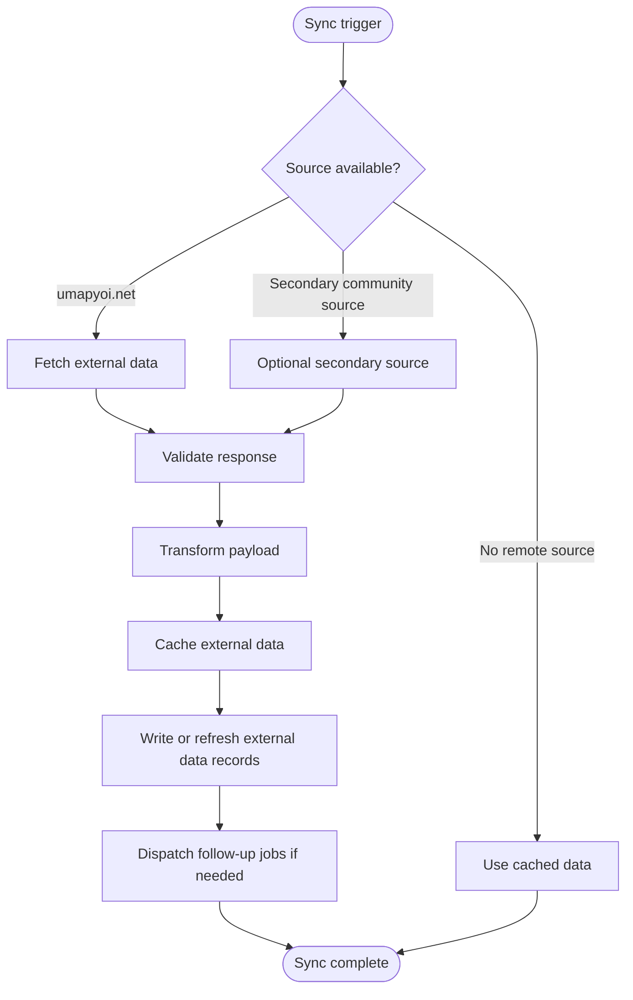
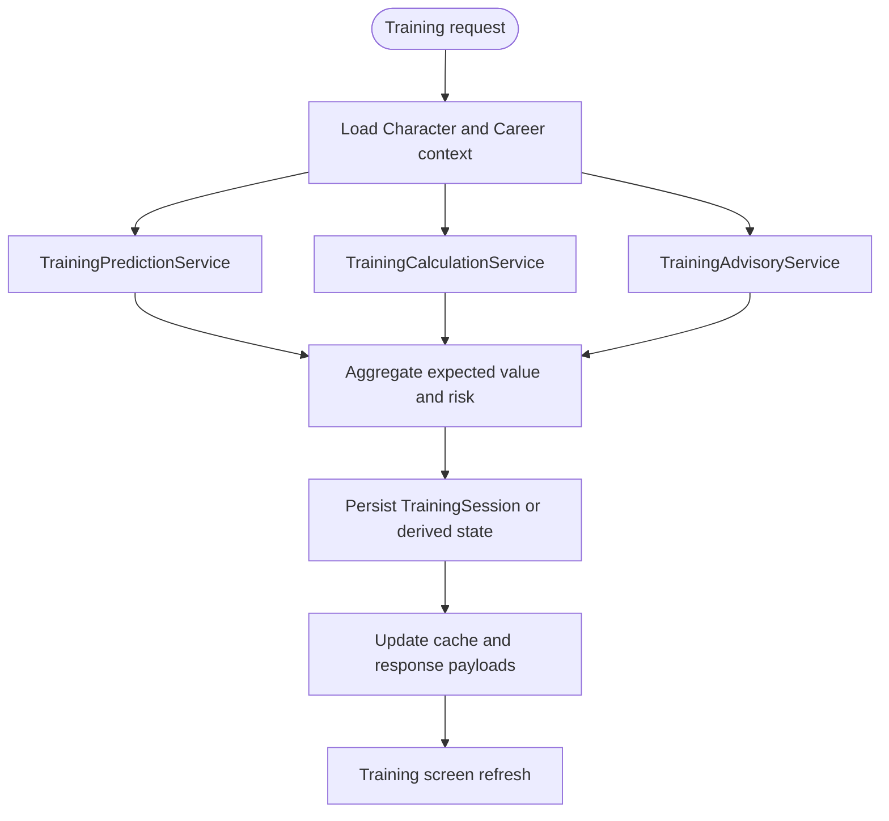
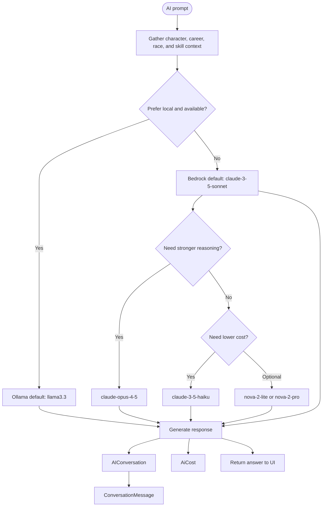
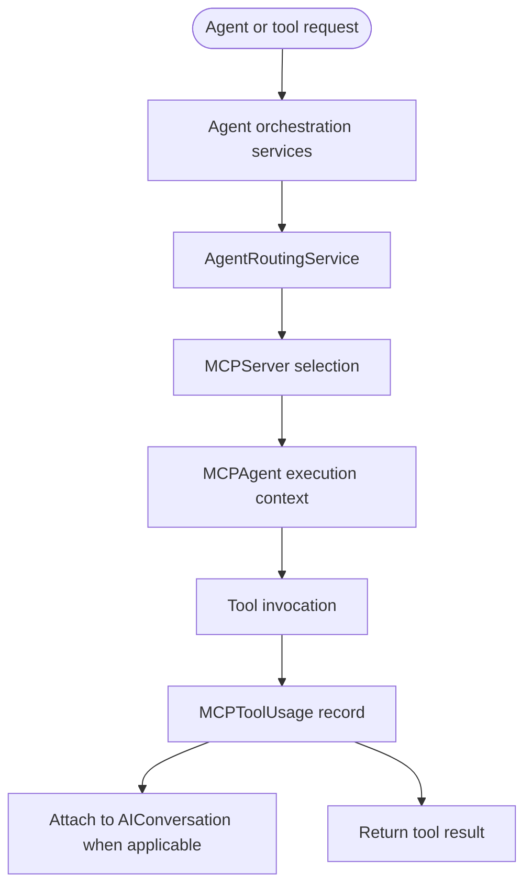
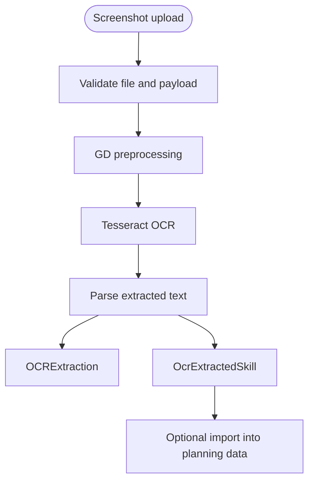
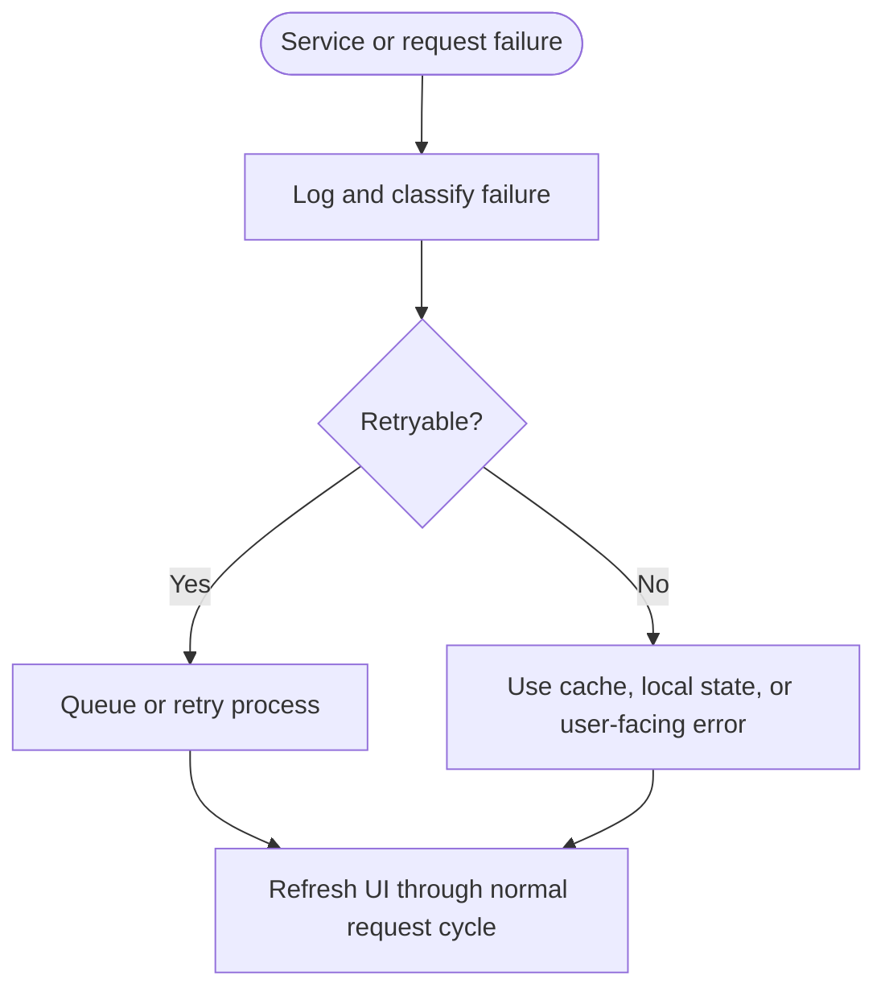
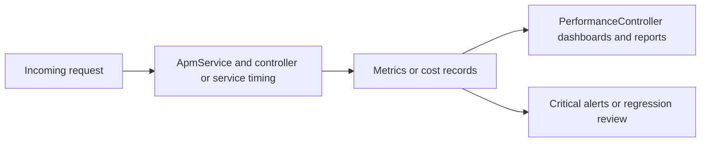

# Umamusume Pretty Derby Career Planner - System Process Flow Diagrams

**Document Version**: 2.4.2
**Date**: April 7, 2026
**Project**: Umamusume Pretty Derby Career Planner
**Author**: Development Team
**Status**: Current - repository-aligned process flows with implemented service, cache, job, and policy boundaries

---

## 1. Introduction

> **Diagram scope**: Implementation-aligned process documentation. Some process boxes summarize multiple services, but route, controller, service, and policy references are kept current.

### 1.1 System Baseline

- **Backend**: Laravel 12
- **Frontend**: Blade, Livewire 4, Alpine.js 3, Tailwind CSS v4
- **AI**: Ollama plus AWS Bedrock via hybrid routing
- **MCP**: MCP server, agent, and tool-usage tracking
- **State propagation**: jobs, cache, redirects, and polling-friendly refresh patterns

### 1.2 Default vs Supported AI References

| Category | Default | Supported Alternatives |
| --- | --- | --- |
| Local AI | `llama3.3` | `llama3`, `mistral`, `deepseek-r1`, `gemma3` |
| Bedrock | `claude-3-5-sonnet` | `claude-3-5-haiku`, `claude-opus-4-5`, `nova-2-lite`, `nova-2-pro` |

---

## 2. External Data Synchronization Flow



```text
[Sync trigger] --> [Source available?]
                   | umapyoi.net                | no remote source      | secondary community source
                   v                            v                       v
          [Fetch external data]        [Use cached data]        [Optional secondary source]
                   \___________________________  ___________________________/
                                               \/
                                    [Validate response] --> [Transform payload] --> [Cache external data] --> [Write or refresh external
                                    data records] --> [Dispatch follow-up jobs if needed] --> [Sync complete]
```

### 2.1 Implementation Notes

- `ExternalAPIService` is the main application-facing integration anchor.
- Secondary community sources should be treated as optional rather than guaranteed-fallback authoritative systems.
- This diagram set treats secondary community data sources as optional, not authoritative fallbacks.

---

## 3. Training Optimization Flow



```text
[Training request] --> [Load Character and Career context]
                          |                 |                  |
                          v                 v                  v
             [TrainingPredictionService] [TrainingCalculationService] [TrainingAdvisoryService]
                          \___________________  |  ___________________/
                                              \/
                              [Aggregate expected value and risk] --> [Persist TrainingSession or derived state] --> [Update cache
                              and response payloads] --> [Training screen refresh]
```

---

## 4. Race Planning and Entry Flow

```mermaid
flowchart TD
    Start([User opens race planning]) --> Catalog[RaceController calendar or targets]
    Catalog --> Select[Choose GameRace]
    Select --> Ready[Readiness analysis]
    Ready --> Submit[POST /characters/{character}/races/{gameRace}/enter]
    Submit --> Auth[auth middleware]
    Auth --> Policy[CharacterPolicy update]
    Policy --> Execute[RaceExecutionService]
    Execute --> Conditions[RaceConditionService]
    Execute --> Persist[Create Race result and update Character]
    Persist --> Redirect[Redirect to training or character page]
```

```text
[User opens race planning] --> [RaceController calendar or targets] --> [Choose GameRace] --> [Readiness analysis]
                                                                                               |
                                                                                               v
                                                                                  [POST /characters/{character}/races/{gameRace}/enter]
                                                                                               |
                                                                                               v
                                                                                     [auth middleware] --> [CharacterPolicy update] --> [RaceExecutionService] --> [RaceConditionService]
                                                                                                                                                  |
                                                                                                                                                  v
                                                                                                                             [Create Race result and update Character] --> [Redirect to training or character page]
```

### 4.1 Authorization Boundary

- Race entry is not a guest flow.
- Account-mode route access requires authentication.
- Ownership is enforced with `CharacterPolicy` before execution.

---

## 5. AI Routing and Conversation Flow



```text
[AI prompt] --> [Gather character, career, race, and skill context] --> [Prefer local and available?]
                                                                          | yes                         | no
                                                                          v                             v
                                                           [Ollama default: llama3.3]   [Bedrock default: claude-3-5-sonnet]
                                                                                                          |
                                                                                                          v
                                                                                           [Need stronger reasoning?]
                                                                                              | yes                   | no
                                                                                              v                      v
                                                                                  [claude-opus-4-5]   [Need lower cost?]
                                                                                                                        | yes                | optional
                                                                                                                        v                    v
                                                                                                            [claude-3-5-haiku]   [nova-2-lite or nova-2-pro]

All paths --> [Generate response] --> [AIConversation] --> [ConversationMessage]
                                  \--> [AiCost]
                                  \--> [Return answer to UI]
```

---

## 6. MCP Orchestration Flow



```text
[Agent or tool request] --> [Agent orchestration services] --> [AgentRoutingService] --> [MCPServer
selection] --> [MCPAgent execution context] --> [Tool invocation]
                                                                                                                                                                   |
                                                                                                                                                                   v
                                                                                                                                                        [MCPToolUsage record]
                                                                                                                                                           |                     \
                                                                                                                                                           v                      v
                                                                                                                                        [Attach to AIConversation when applicable]   [Return tool result]
```

### 6.1 Implementation Anchors

- `App\Services\MCP\AgentOrchestrationService`
- `AgentRoutingService`
- `AgentCommunicationService` — handles inter-agent messaging and communication protocol for MCP
agent coordination (message queuing, priority routing, and handshake between agents)
- `MCPServer`, `MCPAgent`, `MCPToolUsage`

---

## 7. OCR Processing Flow



```text
[Screenshot upload] --> [Validate file and payload] --> [GD preprocessing] --> [Tesseract OCR] -->
[Parse extracted text]
                                                                                                       |                      \
                                                                                                       v                       v
                                                                                               [OCRExtraction]      [OcrExtractedSkill] --> [Optional import into planning data]
```

---

## 8. Error Recovery and Refresh Flow



```text
[Service or request failure] --> [Log and classify failure] --> [Retryable?]
                                                              | yes                          | no
                                                              v                              v
                                                    [Queue or retry process]   [Use cache, local state, or user-facing error]
                                                              \_______________________  _______________________/
                                                                                      \/
                                                                       [Refresh UI through normal request cycle]
```

### 8.1 Correction to Older Wording

This system-process documentation uses jobs plus cache plus redirect, refresh, and polling-friendly
UI patterns. It should not claim a dedicated realtime communication subsystem unless a specific
implementation is being documented.

---

## 9. Performance and APM Flow



```text
[Incoming request] --> [ApmService and controller or service timing] --> [Metrics or cost records]
                                                                              |                     \
                                                                              v                      v
                                                         [PerformanceController dashboards and reports]   [Critical alerts or regression review]
```

### 9.1 Status Matrix

| Capability | Status | Notes |
| --- | --- | --- |
| APM measurement | Implemented | `ApmService` and performance monitoring services exist |
| AI cost tracking | Implemented | `AiCost` model and `CostTrackingService` exist; cost records stored in `ucp_ai_costs` |
| Prediction accuracy tracking | Implemented | `PredictionAccuracy` model exists; records stored in `ucp_prediction_accuracy` |
| Regression analysis | Partial | `PerformanceRegressionService` exists; avoid overstating automation window detail |
| Alert channel breadth | Partial | alerting services exist; exact delivery channels should be documented separately |

---

## 10. Related Documents

- [SPEC-006: AI Advisory Technical](../02-specs/SPEC-006_AI_Advisory_Technical.md)
- [SPEC-007: External Integration Technical](../02-specs/SPEC-007_External_Integration_Technical.md)
- [FLOW-003: Race Strategy System](../01-flows/FLOW-003_Race_Strategy_System.md)
- [FLOW-006: AI Advisory System](../01-flows/FLOW-006_AI_Advisory_System.md)
- [FLOW-007: External Integration System](../01-flows/FLOW-007_External_Integration_System.md)
