# System Process Flow Diagrams

## Umamusume Pretty Derby Career Planner

**Document Version**: 2.4.0  
**Date**: February 22, 2026  
**Project**: UmamusumeCareerPlanner  
**Author**: Development Team  
**Status**: Current - Aligned with codebase v2.4.0 (571 routes, 3,316+ tests, 11,563+ assertions)

---

## Table of Contents

1. [Introduction](#1-introduction)
2. [External Data Integration and Synchronization Flow](#2-external-data-integration-and-synchronization-flow)
3. [Training Optimization Engine Process Flow](#3-training-optimization-engine-process-flow)
4. [AI Model Selection and Fallback Process Flow](#4-ai-model-selection-and-fallback-process-flow)
5. [MCP Integration Process Flow](#5-mcp-integration-process-flow)
6. [Career Data Management and Analytics Process Flow](#6-career-data-management-and-analytics-process-flow)
7. [OCR Processing Pipeline Flow](#7-ocr-processing-pipeline-flow)
8. [Error Handling and Recovery Process Flow](#8-error-handling-and-recovery-process-flow)
9. [Real-Time Communication Flow](#9-real-time-communication-flow)
10. [Process Flow Summary](#10-process-flow-summary)
11. [Performance Monitoring & APM Flow](#11-performance-monitoring--apm-flow)

---

## 1. Introduction

### 1.1 Purpose

This document presents the system-level process flow diagrams for the Umamusume Pretty Derby Career Planner application, showing how internal processes interact, data flows between components, and system-level decision making. The system is built with **Laravel 12** (released February 24, 2025) with **Livewire 4**, **Alpine.js 3**, **Tailwind CSS v4** (released January 22, 2025), **Neuron AI v2.11**, and integrates with **AWS Bedrock** models, **Ollama** for local AI capabilities, and **MCP (Model Context Protocol)** for tool integration.

### 1.2 Scope

This specification covers the following system-level processes:

- External API integration and data synchronization
- Training prediction and optimization engine
- Hybrid AI model routing (Ollama + AWS Bedrock)
- MCP server integration and tool execution
- Admin Panel system management
- Career progression tracking and analytics
- OCR screenshot processing pipeline
- Error handling and recovery mechanisms
- Real-time communication via Laravel Reverb

### 1.3 Architecture Overview

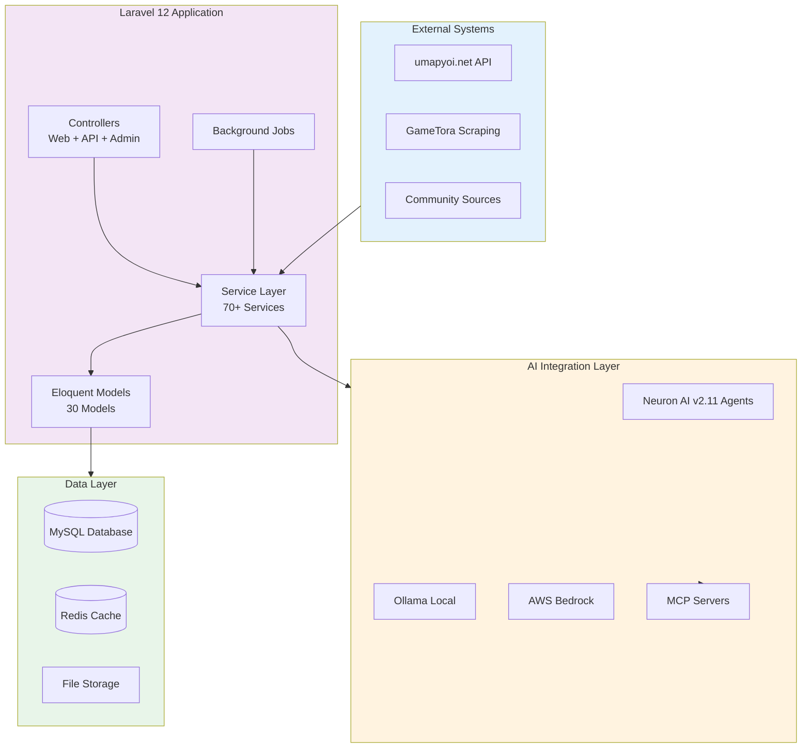
```mermaid
flowchart TB
    subgraph External[External Systems]
        Umapyoi[umapyoi.net API]
        GameTora[GameTora Scraping]
        Community[Community Sources]
    end
    
    subgraph Application[Laravel 12 Application]
        Controllers[Controllers<br/>Web + API + Admin]
        Services[Service Layer<br/>70+ Services]
        Models[Eloquent Models<br/>30 Models]
        Jobs[Background Jobs]
    end
    
    subgraph AI[AI Integration Layer]
        Neuron[Neuron AI v2.11 Agents]
        Ollama[Ollama Local]
        Bedrock[AWS Bedrock]
        MCP[MCP Servers]
    end
    
    subgraph Data[Data Layer]
        MySQL[(MySQL Database)]
        Redis[(Redis Cache)]
        Files[File Storage]
    end
    
    External --> Services
    Controllers --> Services
    Services --> AI
    Services --> Models
    Models --> Data
    Jobs --> Services
    AI --> MCP
    
    style External fill:#e3f2fd
    style Application fill:#f3e5f5
    style AI fill:#fff3e0
    style Data fill:#e8f5e9
```

---

## 2. External Data Integration and Synchronization Flow

### 2.1 Process Overview

The external data integration process manages connections to multiple community APIs, handles data synchronization, caching strategies, and fallback mechanisms when external sources are unavailable.

**Primary APIs:**

- **umapyoi.net** - Primary game data source (character, support card, skill data)
- **GameTora** - Secondary source (scraping for calculator tools and meta information)
- **Community sources** - Meta tier lists, strategy guides, community data

### 2.2 Integration Architecture

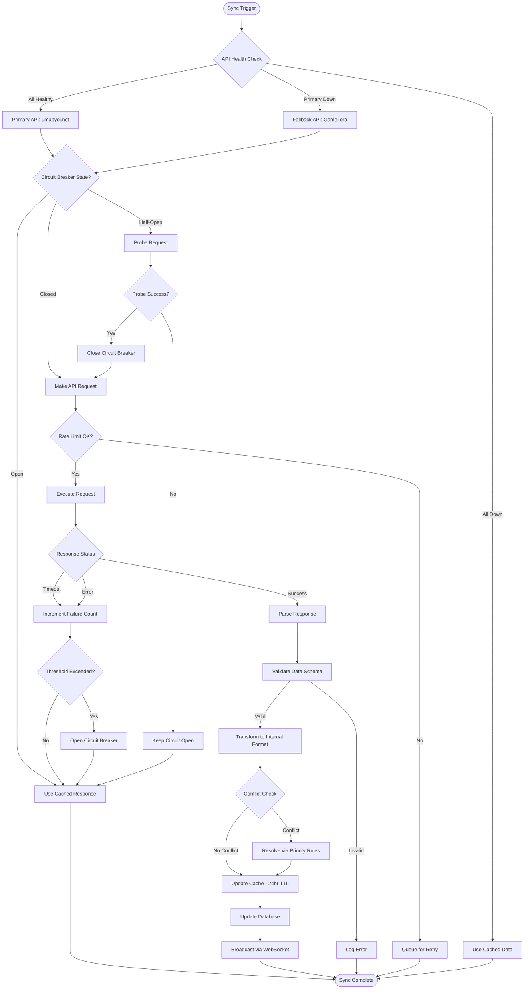
```mermaid
flowchart TD
    Trigger([Sync Trigger]) --> HealthCheck{API Health Check}
    
    HealthCheck -->|All Healthy| Primary[Primary API: umapyoi.net]
    HealthCheck -->|Primary Down| Fallback[Fallback API: GameTora]
    HealthCheck -->|All Down| CachedData[Use Cached Data]
    
    Primary --> CircuitBreaker{Circuit Breaker State?}
    Fallback --> CircuitBreaker
    
    CircuitBreaker -->|Closed| MakeRequest[Make API Request]
    CircuitBreaker -->|Open| UseCached[Use Cached Response]
    CircuitBreaker -->|Half-Open| ProbeRequest[Probe Request]
    
    MakeRequest --> RateLimiter{Rate Limit OK?}
    RateLimiter -->|Yes| Execute[Execute Request]
    RateLimiter -->|No| Queue[Queue for Retry]
    
    Execute --> Response{Response Status}
    Response -->|Success| Parse[Parse Response]
    Response -->|Timeout| IncrementFailure[Increment Failure Count]
    Response -->|Error| IncrementFailure
    
    Parse --> Validate[Validate Data Schema]
    Validate -->|Valid| Transform[Transform to Internal Format]
    Validate -->|Invalid| LogError[Log Error]
    
    Transform --> ConflictCheck{Conflict Check}
    ConflictCheck -->|No Conflict| UpdateCache[Update Cache - 24hr TTL]
    ConflictCheck -->|Conflict| Resolve[Resolve via Priority Rules]
    
    Resolve --> UpdateCache
    UpdateCache --> UpdateDB[Update Database]
    UpdateDB --> Broadcast[Broadcast via WebSocket]
    
    IncrementFailure --> ThresholdCheck{Threshold Exceeded?}
    ThresholdCheck -->|Yes| OpenCircuit[Open Circuit Breaker]
    ThresholdCheck -->|No| UseCached
    
    OpenCircuit --> UseCached
    UseCached --> Complete([Sync Complete])
    Broadcast --> Complete
    LogError --> Complete
    Queue --> Complete
    CachedData --> Complete
    
    ProbeRequest --> ProbeResult{Probe Success?}
    ProbeResult -->|Yes| CloseCircuit[Close Circuit Breaker]
    ProbeResult -->|No| KeepOpen[Keep Circuit Open]
    
    CloseCircuit --> MakeRequest
    KeepOpen --> UseCached
```

### 2.3 Service Implementation

**Service**: `ExternalAPIService`  
**Location**: `app/Services/ExternalAPI/ExternalAPIService.php`

```php
public function syncGameData(string $dataType): SyncResult
{
    $cacheKey = "external_data:{$dataType}";
    
    // Check circuit breaker state
    if ($this->circuitBreaker->isOpen($dataType)) {
        return $this->useCachedData($cacheKey);
    }
    
    try {
        // Attempt primary API
        $response = $this->umapyoiClient->fetch($dataType);
        
        // Validate and transform
        $validated = $this->validator->validate($response);
        $transformed = $this->transformer->transform($validated);
        
        // Update cache and database
        Cache::put($cacheKey, $transformed, now()->addHours(24));
        $this->updateDatabase($dataType, $transformed);
        
        // Broadcast update
        broadcast(new ExternalDataUpdated($dataType, $transformed));
        
        return SyncResult::success($transformed);
        
    } catch (APIException $e) {
        $this->circuitBreaker->recordFailure($dataType);
        
        // Attempt fallback
        return $this->attemptFallback($dataType, $cacheKey);
    }
}
```

### 2.4 Circuit Breaker Configuration

| Parameter | Value | Description |
|-----------|-------|-------------|
| `failure_threshold` | 5 | Number of failures to open circuit |
| `recovery_timeout` | 60 seconds | Time before attempting recovery |
| `sample_window` | 120 seconds | Time window for failure counting |
| `half_open_requests` | 3 | Number of probe requests in half-open state |

---

## 3. Training Optimization Engine Process Flow

### 3.1 Process Overview

The core optimization engine processes character state, analyzes training options, calculates predictions, and generates recommendations using multiple algorithms and data sources. Built with **Laravel 12** backend and enhanced by **Neuron AI v2.11** agents and **AWS Bedrock** AI models for intelligent decision making.

### 3.2 Training Prediction Flow

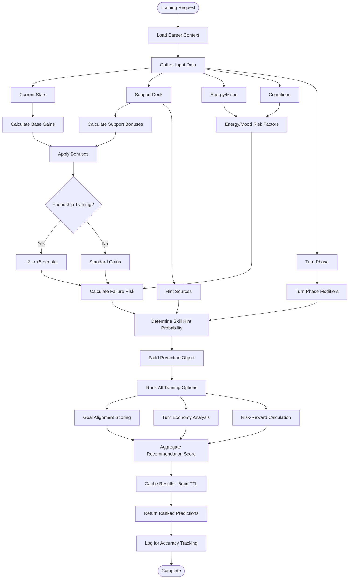
```mermaid
flowchart TD
    Request([Training Request]) --> LoadContext[Load Career Context]
    
    LoadContext --> GatherData[Gather Input Data]
    
    GatherData --> CurrentStats[Current Stats]
    GatherData --> SupportDeck[Support Deck]
    GatherData --> EnergyMood[Energy/Mood]
    GatherData --> Conditions[Conditions]
    GatherData --> TurnPhase[Turn Phase]
    
    CurrentStats --> CalculateBase[Calculate Base Gains]
    SupportDeck --> CalculateBonus[Calculate Support Bonuses]
    
    CalculateBase --> ApplyBonuses[Apply Bonuses]
    CalculateBonus --> ApplyBonuses
    
    ApplyBonuses --> FriendshipCheck{Friendship Training?}
    FriendshipCheck -->|Yes| FriendshipBonus[+2 to +5 per stat]
    FriendshipCheck -->|No| StandardGains[Standard Gains]
    
    FriendshipBonus --> CalculateRisk[Calculate Failure Risk]
    StandardGains --> CalculateRisk
    
    EnergyMood --> RiskFactors[Energy/Mood Risk Factors]
    Conditions --> RiskFactors
    RiskFactors --> CalculateRisk
    
    CalculateRisk --> DetermineHints[Determine Skill Hint Probability]
    
    TurnPhase --> HintModifiers[Turn Phase Modifiers]
    SupportDeck --> HintSources[Hint Sources]
    HintModifiers --> DetermineHints
    HintSources --> DetermineHints
    
    DetermineHints --> BuildPrediction[Build Prediction Object]
    
    BuildPrediction --> RankOptions[Rank All Training Options]
    
    RankOptions --> GoalAlignment[Goal Alignment Scoring]
    RankOptions --> TurnEconomy[Turn Economy Analysis]
    RankOptions --> RiskReward[Risk-Reward Calculation]
    
    GoalAlignment --> AggregateScore[Aggregate Recommendation Score]
    TurnEconomy --> AggregateScore
    RiskReward --> AggregateScore
    
    AggregateScore --> CacheResults[Cache Results - 5min TTL]
    
    CacheResults --> ReturnPredictions[Return Ranked Predictions]
    
    ReturnPredictions --> LogAccuracy[Log for Accuracy Tracking]
    
    LogAccuracy --> Complete([Complete])
```

### 3.3 Training Execution Flow

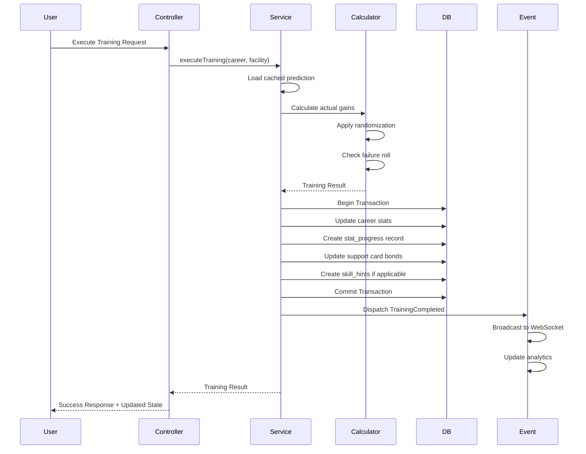
```mermaid
sequenceDiagram
    participant User
    participant Controller
    participant Service
    participant Calculator
    participant DB
    participant Event
    
    User->>Controller: Execute Training Request
    Controller->>Service: executeTraining(career, facility)
    
    Service->>Service: Load cached prediction
    Service->>Calculator: Calculate actual gains
    
    Calculator->>Calculator: Apply randomization
    Calculator->>Calculator: Check failure roll
    Calculator-->>Service: Training Result
    
    Service->>DB: Begin Transaction
    Service->>DB: Update career stats
    Service->>DB: Create stat_progress record
    Service->>DB: Update support card bonds
    Service->>DB: Create skill_hints if applicable
    Service->>DB: Commit Transaction
    
    Service->>Event: Dispatch TrainingCompleted
    Event->>Event: Broadcast to WebSocket
    Event->>Event: Update analytics
    
    Service-->>Controller: Training Result
    Controller-->>User: Success Response + Updated State
```

### 3.4 Optimization Algorithms

| Algorithm | Purpose | Weight |
|-----------|---------|--------|
| Goal Priority Weighting | Align training to character goals | 35% |
| Turn Economy Analysis | Optimize turn usage vs remaining turns | 25% |
| Risk-Reward Calculation | Balance failure risk vs potential gains | 20% |
| Long-term Impact | Project career trajectory | 20% |

### 3.5 Service Implementation

**Service**: `TrainingPredictionService`  
**Location**: `app/Services/TrainingPredictionService.php`

```php
public function getPredictions(Career $career): array
{
    $cacheKey = "predictions:{$career->id}";
    
    return Cache::remember($cacheKey, 300, function () use ($career) {
        $facilities = TrainingType::cases();
        $predictions = [];
        
        foreach ($facilities as $facility) {
            $predictions[] = $this->calculatePrediction($career, $facility);
        }
        
        return $this->rankPredictions($predictions, $career->goals);
    });
}

private function calculatePrediction(Career $career, TrainingType $type): array
{
    // Base stat gains
    $baseGains = $this->statCalculator->calculate($career, $type);
    
    // Support card bonuses
    $supportBonuses = $this->bonusCalculator->calculate(
        $career->supportDeck, 
        $type
    );
    
    // Apply bonuses
    $finalGains = $baseGains->applyBonuses($supportBonuses);
    
    // Friendship training check
    if ($this->friendshipTrainingActive($career->supportDeck, $type)) {
        $finalGains = $finalGains->applyFriendshipBonus();
    }
    
    // Risk calculation
    $risk = $this->riskCalculator->calculate($career, $type);
    
    // Skill hint probability
    $hintChance = $this->hintCalculator->calculate($career, $type);
    
    return [
        'training_type' => $type->value,
        'stat_gains' => $finalGains->toArray(),
        'risk_percentage' => $risk,
        'skill_hints' => $hintChance,
        'support_participation' => $supportBonuses->participants,
        'recommendation_score' => 0, // Calculated during ranking
    ];
}
```

---

## 4. AI Model Selection and Fallback Process Flow

### 4.1 Process Overview

The intelligent AI system manages model selection between local **Ollama** and cloud **AWS Bedrock** services, handles fallback scenarios, and optimizes response quality and performance.

**AI Providers:**

- **Ollama (Local)** - Primary for simple queries, free, privacy-focused
- **AWS Bedrock Claude** - Fallback for complex reasoning
- **AWS Bedrock Nova** - Cost-effective cloud option

### 4.2 AI Routing Flow


```mermaid
flowchart TD
    Query([User Query]) --> AnalyzeIntent[Analyze Query Intent]
    
    AnalyzeIntent --> ClassifyQuery{Query Classification}
    
    ClassifyQuery -->|Simple Lookup| KnowledgeBase[Local Knowledge Base]
    ClassifyQuery -->|Complex Analysis| AIRequired[AI Processing Required]
    ClassifyQuery -->|Screenshot| OCRRequired[OCR + AI Required]
    
    KnowledgeBase --> DirectResponse[Direct Response]
    
    AIRequired --> AssessComplexity[Assess Complexity Score]
    OCRRequired --> AssessComplexity
    
    AssessComplexity --> ComplexityScore{Complexity Score}
    
    ComplexityScore -->|<= 70| TryOllama[Try Ollama Local]
    ComplexityScore -->|> 70| UseBedrock[Use AWS Bedrock]
    
    TryOllama --> OllamaCheck{Ollama Available?}
    
    OllamaCheck -->|No| FallbackBedrock[Fallback to Bedrock]
    OllamaCheck -->|Yes| StartOllama[Start Ollama Processing]
    
    StartOllama --> MonitorResponse[Monitor Response Time]
    
    MonitorResponse --> TimeCheck{Response Time}
    
    TimeCheck -->|< 5 sec| Continue[Continue Processing]
    TimeCheck -->|5-10 sec| QualityPrep[Quality Check Prep]
    TimeCheck -->|> 10 sec| TimeoutFallback[Timeout - Fallback]
    
    Continue --> OllamaResponse[Receive Ollama Response]
    QualityPrep --> OllamaResponse
    
    OllamaResponse --> QualityCheck[Quality Assessment]
    
    QualityCheck --> Coherence[Response Coherence]
    QualityCheck --> Accuracy[Factual Accuracy]
    QualityCheck --> Completeness[Query Coverage]
    
    Coherence --> QualityScore[Calculate Quality Score]
    Accuracy --> QualityScore
    Completeness --> QualityScore
    
    QualityScore --> ScoreThreshold{Score >= 80%?}
    
    ScoreThreshold -->|Yes| AcceptOllama[Accept Ollama Response]
    ScoreThreshold -->|No| QualityFallback[Quality Fallback]
    
    TimeoutFallback --> FallbackBedrock
    QualityFallback --> FallbackBedrock
    
    UseBedrock --> FallbackBedrock
    FallbackBedrock --> AnalyzeQueryType[Analyze Query Type]
    
    AnalyzeQueryType --> ModelSelection{Model Selection}
    
    ModelSelection -->|Strategic| ClaudeSonnet[Claude Sonnet]
    ModelSelection -->|Complex Calc| NovaPro[Nova Pro]
    ModelSelection -->|Quick| ClaudeHaiku[Claude Haiku]
    ModelSelection -->|General| NovaLite[Nova Lite]
    
    ClaudeSonnet --> InvokeBedrock[Invoke Bedrock Model]
    NovaPro --> InvokeBedrock
    ClaudeHaiku --> InvokeBedrock
    NovaLite --> InvokeBedrock
    
    InvokeBedrock --> FormatRequest[Format Request + Context]
    FormatRequest --> BedrockResponse[Receive Bedrock Response]
    
    BedrockResponse --> ValidateResponse[Validate Response]
    
    AcceptOllama --> IntegrateContext[Integrate Career Context]
    ValidateResponse --> IntegrateContext
    
    IntegrateContext --> ScoreConfidence[Score Confidence]
    ScoreConfidence --> GenerateFollowup[Generate Follow-up Suggestions]
    
    GenerateFollowup --> AssembleResponse[Assemble Final Response]
    
    AssembleResponse --> TrackPerformance[Track Performance Metrics]
    
    TrackPerformance --> LogCost[Log Token Usage + Cost]
    LogCost --> UpdateLearning[Update Model Selection Learning]
    
    UpdateLearning --> DeliverResponse[Deliver Response to User]
    
    DirectResponse --> DeliverResponse
    
    DeliverResponse --> Complete([Complete])
```

### 4.3 Model Cost Tracking

| Provider | Model | Input Cost | Output Cost | Use Case |
|----------|-------|------------|-------------|----------|
| Ollama | llama3.2 | $0.00 | $0.00 | Local, privacy-first |
| Bedrock | Claude Haiku | $1.00/1M | $5.00/1M | Quick responses |
| Bedrock | Claude Sonnet | $3.00/1M | $15.00/1M | Strategic advice |
| Bedrock | Claude Opus | $5.00/1M | $25.00/1M | Complex reasoning |
| Bedrock | Nova Lite | $0.00125/1K | $0.00125/1K | Budget-friendly |
| Bedrock | Nova Pro | Preview | Preview | Advanced capabilities |

### 4.4 Service Implementation

**Service**: `HybridAIService`  
**Location**: `app/Services/AI/HybridAIService.php`

```php
public function generate(string $prompt, array $context = []): AIResponse
{
    $complexity = $this->assessComplexity($prompt, $context);
    
    // Try local first if complexity is low
    if ($this->shouldUseLocal($complexity)) {
        try {
            $response = $this->ollama->generate($prompt, $context);
            
            $quality = $this->assessQuality($response);
            
            if ($quality->score >= 80) {
                return $response;
            }
            
            Log::info('Ollama quality below threshold, falling back', [
                'quality_score' => $quality->score,
            ]);
            
        } catch (OllamaException $e) {
            Log::warning('Ollama unavailable, falling back to Bedrock');
        }
    }
    
    // Fallback to Bedrock
    $model = $this->selectBedrockModel($complexity, $context);
    $response = $this->bedrock->generate($prompt, $context, $model);
    
    // Track cost
    $this->costTracker->record([
        'provider' => 'bedrock',
        'model' => $model,
        'input_tokens' => $response->inputTokens,
        'output_tokens' => $response->outputTokens,
        'cost_usd' => $response->calculateCost(),
    ]);
    
    return $response;
}
```

---

## 5. MCP Integration Process Flow

### 5.1 Process Overview

The Model Context Protocol (MCP) integration enables Neuron AI agents to access external tools, resources, and capabilities through a standardized interface.

**MCP Servers:**

- **Memory Server** - Conversation context persistence
- **Filesystem Server** - Document and file access
- **Fetch Server** - HTTP resource retrieval
- **Custom Servers** - Domain-specific tools (optional)

### 5.2 MCP Tool Execution Flow

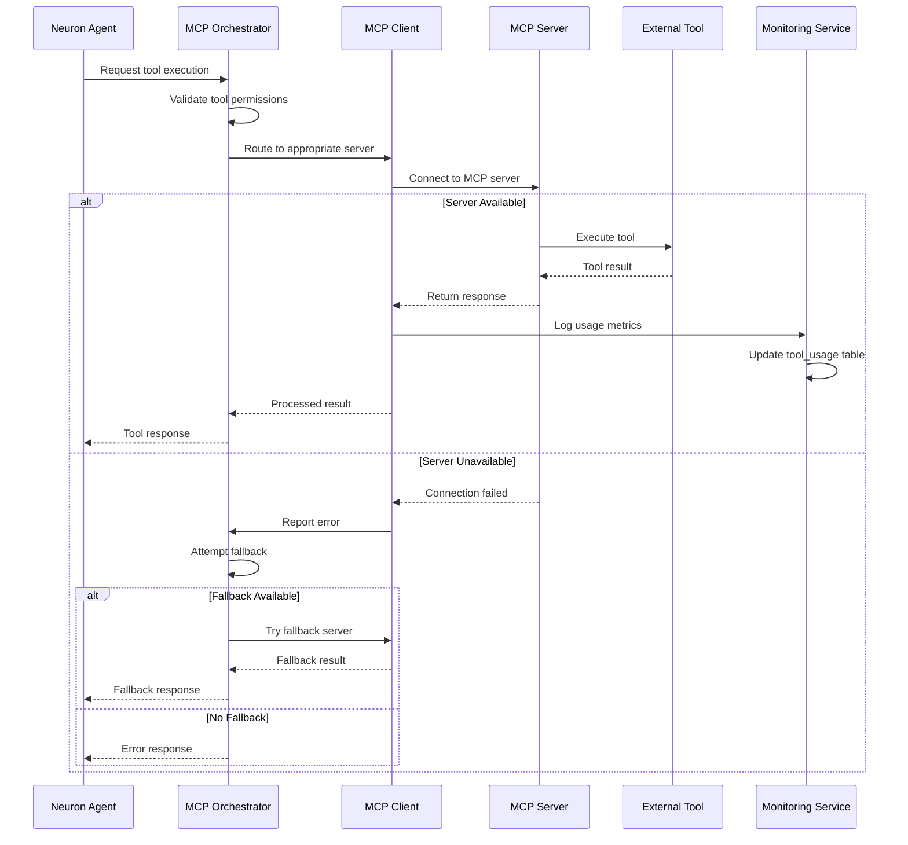
```mermaid
sequenceDiagram
    participant Agent as Neuron Agent
    participant Orchestrator as MCP Orchestrator
    participant Client as MCP Client
    participant Server as MCP Server
    participant Tool as External Tool
    participant Monitor as Monitoring Service
    
    Agent->>Orchestrator: Request tool execution
    Orchestrator->>Orchestrator: Validate tool permissions
    
    Orchestrator->>Client: Route to appropriate server
    Client->>Server: Connect to MCP server
    
    alt Server Available
        Server->>Tool: Execute tool
        Tool-->>Server: Tool result
        Server-->>Client: Return response
        
        Client->>Monitor: Log usage metrics
        Monitor->>Monitor: Update tool_usage table
        
        Client-->>Orchestrator: Processed result
        Orchestrator-->>Agent: Tool response
        
    else Server Unavailable
        Server-->>Client: Connection failed
        Client->>Orchestrator: Report error
        
        Orchestrator->>Orchestrator: Attempt fallback
        
        alt Fallback Available
            Orchestrator->>Client: Try fallback server
            Client-->>Orchestrator: Fallback result
            Orchestrator-->>Agent: Fallback response
        else No Fallback
            Orchestrator-->>Agent: Error response
        end
    end
```

### 5.3 MCP Server Lifecycle

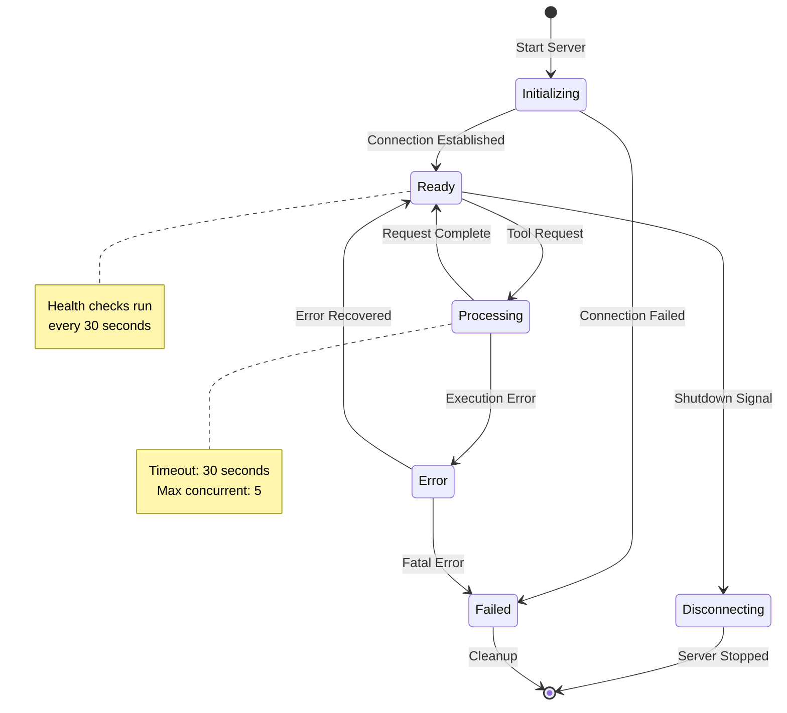
```mermaid
stateDiagram-v2
    [*] --> Initializing: Start Server
    
    Initializing --> Ready: Connection Established
    Initializing --> Failed: Connection Failed
    
    Ready --> Processing: Tool Request
    Processing --> Ready: Request Complete
    Processing --> Error: Execution Error
    
    Error --> Ready: Error Recovered
    Error --> Failed: Fatal Error
    
    Ready --> Disconnecting: Shutdown Signal
    Disconnecting --> [*]: Server Stopped
    
    Failed --> [*]: Cleanup
    
    note right of Ready
        Health checks run
        every 30 seconds
    end note
    
    note right of Processing
        Timeout: 30 seconds
        Max concurrent: 5
    end note
```

### 5.4 Service Implementation

**Service**: `MCPOrchestrator`  
**Location**: `app/Services/MCP/MCPOrchestrator.php`

```php
public function executeTool(
    string $toolName, 
    array $parameters, 
    string $serverName = null
): ToolResult
{
    // Determine server
    $server = $serverName 
        ? $this->getServer($serverName)
        : $this->findServerForTool($toolName);
    
    if (!$server) {
        throw new MCPServerNotFoundException($toolName);
    }
    
    // Check server health
    if (!$this->healthCheck($server)) {
        return $this->attemptFallback($toolName, $parameters);
    }
    
    try {
        $startTime = microtime(true);
        
        // Execute tool
        $result = $this->client->execute($server, $toolName, $parameters);
        
        $duration = (microtime(true) - $startTime) * 1000;
        
        // Log usage
        $this->logToolUsage($toolName, $server->name, $duration, true);
        
        return ToolResult::success($result);
        
    } catch (MCPException $e) {
        $this->logToolUsage($toolName, $server->name, 0, false);
        
        return $this->handleToolError($e, $toolName, $parameters);
    }
}
```

### 5.5 MCP Configuration

**Config File**: `config/mcp.php`

| Server | Type | Purpose | Enabled |
|--------|------|---------|---------|
| `memory` | Local | Conversation context | Yes |
| `filesystem` | Local | File operations | Yes |
| `fetch` | Local | HTTP requests | Yes |
| `umapyoi` | Remote | Game data API (optional) | No (default) |

---

## 6. Career Data Management and Analytics Process Flow

### 6.1 Process Overview

The comprehensive data management system handles career progression tracking, historical analysis, performance metrics calculation, and pattern recognition for optimization improvements.

### 6.2 Career Event Processing Flow

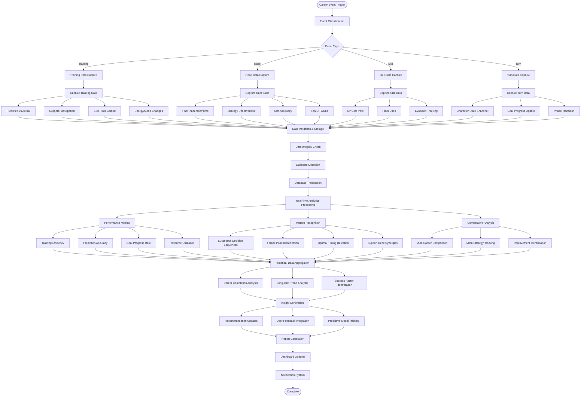
```mermaid
flowchart TD
    EventTrigger([Career Event Trigger]) --> ClassifyEvent[Event Classification]
    
    ClassifyEvent --> EventRouter{Event Type}
    
    EventRouter -->|Training| TrainingCapture[Training Data Capture]
    EventRouter -->|Race| RaceCapture[Race Data Capture]
    EventRouter -->|Skill| SkillCapture[Skill Data Capture]
    EventRouter -->|Turn| TurnCapture[Turn Data Capture]
    
    TrainingCapture --> TrainingData[Capture Training Data]
    TrainingData --> PredictedVsActual[Predicted vs Actual]
    TrainingData --> SupportParticipation[Support Participation]
    TrainingData --> HintsGained[Skill Hints Gained]
    TrainingData --> EnergyChanges[Energy/Mood Changes]
    
    RaceCapture --> RaceData[Capture Race Data]
    RaceData --> Placement[Final Placement/Time]
    RaceData --> StrategyEff[Strategy Effectiveness]
    RaceData --> StatAdequacy[Stat Adequacy]
    RaceData --> Rewards[Fan/SP Gains]
    
    SkillCapture --> SkillData[Capture Skill Data]
    SkillData --> SPCost[SP Cost Paid]
    SkillData --> HintsUsed[Hints Used]
    SkillData --> EvolutionCheck[Evolution Tracking]
    
    TurnCapture --> TurnData[Capture Turn Data]
    TurnData --> StateSnapshot[Character State Snapshot]
    TurnData --> GoalProgress[Goal Progress Update]
    TurnData --> PhaseTransition[Phase Transition]
    
    PredictedVsActual --> ValidateData[Data Validation & Storage]
    SupportParticipation --> ValidateData
    HintsGained --> ValidateData
    EnergyChanges --> ValidateData
    Placement --> ValidateData
    StrategyEff --> ValidateData
    StatAdequacy --> ValidateData
    Rewards --> ValidateData
    SPCost --> ValidateData
    HintsUsed --> ValidateData
    EvolutionCheck --> ValidateData
    StateSnapshot --> ValidateData
    GoalProgress --> ValidateData
    PhaseTransition --> ValidateData
    
    ValidateData --> IntegrityCheck[Data Integrity Check]
    IntegrityCheck --> DuplicateCheck[Duplicate Detection]
    DuplicateCheck --> DBTransaction[Database Transaction]
    
    DBTransaction --> RealtimeAnalytics[Real-time Analytics Processing]
    
    RealtimeAnalytics --> PerfMetrics[Performance Metrics]
    PerfMetrics --> TrainingEff[Training Efficiency]
    PerfMetrics --> PredictionAcc[Prediction Accuracy]
    PerfMetrics --> GoalRate[Goal Progress Rate]
    PerfMetrics --> ResourceUtil[Resource Utilization]
    
    RealtimeAnalytics --> PatternRecog[Pattern Recognition]
    PatternRecog --> SuccessSeq[Successful Decision Sequences]
    PatternRecog --> FailurePoints[Failure Point Identification]
    PatternRecog --> OptimalTiming[Optimal Timing Detection]
    PatternRecog --> DeckSynergy[Support Deck Synergies]
    
    RealtimeAnalytics --> ComparativeAnalysis[Comparative Analysis]
    ComparativeAnalysis --> MultiCareer[Multi-Career Comparison]
    ComparativeAnalysis --> MetaTracking[Meta Strategy Tracking]
    ComparativeAnalysis --> ImprovementID[Improvement Identification]
    
    TrainingEff --> HistoricalAgg[Historical Data Aggregation]
    PredictionAcc --> HistoricalAgg
    GoalRate --> HistoricalAgg
    ResourceUtil --> HistoricalAgg
    SuccessSeq --> HistoricalAgg
    FailurePoints --> HistoricalAgg
    OptimalTiming --> HistoricalAgg
    DeckSynergy --> HistoricalAgg
    MultiCareer --> HistoricalAgg
    MetaTracking --> HistoricalAgg
    ImprovementID --> HistoricalAgg
    
    HistoricalAgg --> CareerCompletion[Career Completion Analysis]
    HistoricalAgg --> TrendAnalysis[Long-term Trend Analysis]
    HistoricalAgg --> SuccessFactors[Success Factor Identification]
    
    CareerCompletion --> InsightGen[Insight Generation]
    TrendAnalysis --> InsightGen
    SuccessFactors --> InsightGen
    
    InsightGen --> RecUpdates[Recommendation Updates]
    InsightGen --> UserFeedback[User Feedback Integration]
    InsightGen --> MLTraining[Predictive Model Training]
    
    RecUpdates --> ReportGen[Report Generation]
    UserFeedback --> ReportGen
    MLTraining --> ReportGen
    
    ReportGen --> DashboardUpdate[Dashboard Updates]
    DashboardUpdate --> NotifyUser[Notification System]
    
    NotifyUser --> Complete([Complete])
```

### 6.3 Analytics Metrics

| Metric Category | Metrics Tracked |
|-----------------|-----------------|
| **Training Efficiency** | Stat gains per turn, training success rate, optimal facility usage |
| **Prediction Accuracy** | Expected vs actual stat gains, risk prediction accuracy |
| **Goal Progress** | Goal completion trajectory, turn-based progress rate |
| **Resource Utilization** | SP efficiency, energy management, item usage optimization |
| **Pattern Recognition** | Successful decision patterns, failure point identification, optimal timing windows |
| **Deck Performance** | Support card synergy scores, friendship training frequency, bond progression |

### 6.4 Service Implementation

**Service**: `CareerAnalyticsService`  
**Location**: `app/Services/CareerAnalyticsService.php`

```php
public function processCareerEvent(CareerEvent $event): void
{
    DB::transaction(function () use ($event) {
        // Store event data
        $this->storeEventData($event);
        
        // Update real-time metrics
        $this->updateMetrics($event);
        
        // Check for pattern recognition
        if ($this->shouldAnalyzePatterns($event)) {
            $this->analyzePatterns($event->career);
        }
        
        // Update predictions model
        if ($event->type === 'training') {
            $this->updatePredictionAccuracy($event);
        }
    });
    
    // Async analytics processing
    dispatch(new ProcessCareerAnalytics($event));
}
```

---

## 7. OCR Processing Pipeline Flow

### 7.1 Process Overview

The OCR integration enables screenshot-based data import for character stats, skill inventory, and support card information. The pipeline uses **Tesseract OCR** with **GD library** preprocessing.

### 7.2 OCR Pipeline Flow

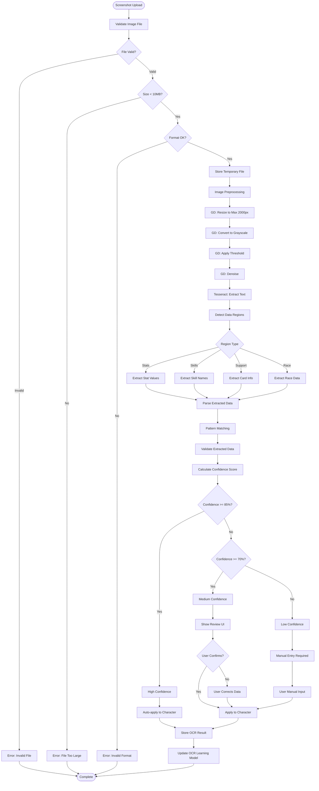
```mermaid
flowchart TD
    Upload([Screenshot Upload]) --> ValidateImage[Validate Image File]
    
    ValidateImage --> FileCheck{File Valid?}
    
    FileCheck -->|Invalid| ErrorInvalidFile[Error: Invalid File]
    FileCheck -->|Valid| CheckSize{Size < 10MB?}
    
    CheckSize -->|No| ErrorSizeTooLarge[Error: File Too Large]
    CheckSize -->|Yes| CheckFormat{Format OK?}
    
    CheckFormat -->|No| ErrorInvalidFormat[Error: Invalid Format]
    CheckFormat -->|Yes| StoreTemp[Store Temporary File]
    
    StoreTemp --> Preprocess[Image Preprocessing]
    
    Preprocess --> GDResize[GD: Resize to Max 2000px]
    GDResize --> GDGrayscale[GD: Convert to Grayscale]
    GDGrayscale --> GDThreshold[GD: Apply Threshold]
    GDThreshold --> GDDenoise[GD: Denoise]
    
    GDDenoise --> TesseractOCR[Tesseract: Extract Text]
    
    TesseractOCR --> DetectRegions[Detect Data Regions]
    
    DetectRegions --> RegionType{Region Type}
    
    RegionType -->|Stats| ExtractStats[Extract Stat Values]
    RegionType -->|Skills| ExtractSkills[Extract Skill Names]
    RegionType -->|Support| ExtractSupport[Extract Card Info]
    RegionType -->|Race| ExtractRace[Extract Race Data]
    
    ExtractStats --> ParseData[Parse Extracted Data]
    ExtractSkills --> ParseData
    ExtractSupport --> ParseData
    ExtractRace --> ParseData
    
    ParseData --> PatternMatch[Pattern Matching]
    
    PatternMatch --> ValidateExtraction[Validate Extracted Data]
    
    ValidateExtraction --> ConfidenceScore[Calculate Confidence Score]
    
    ConfidenceScore --> ConfidenceCheck{Confidence >= 85%?}
    
    ConfidenceCheck -->|Yes| HighConfidence[High Confidence]
    ConfidenceCheck -->|No| MediumCheck{Confidence >= 70%?}
    
    MediumCheck -->|Yes| MediumConfidence[Medium Confidence]
    MediumCheck -->|No| LowConfidence[Low Confidence]
    
    HighConfidence --> AutoApply[Auto-apply to Character]
    MediumConfidence --> ReviewUI[Show Review UI]
    LowConfidence --> ManualEntry[Manual Entry Required]
    
    ReviewUI --> UserReview{User Confirms?}
    UserReview -->|Yes| ApplyData[Apply to Character]
    UserReview -->|No| CorrectData[User Corrects Data]
    
    CorrectData --> ApplyData
    
    ManualEntry --> UserManualInput[User Manual Input]
    UserManualInput --> ApplyData
    
    AutoApply --> StoreResult[Store OCR Result]
    ApplyData --> StoreResult
    
    StoreResult --> UpdateLearning[Update OCR Learning Model]
    
    UpdateLearning --> Complete([Complete])
    
    ErrorInvalidFile --> Complete
    ErrorSizeTooLarge --> Complete
    ErrorInvalidFormat --> Complete
```

### 7.3 Preprocessing Operations

| Operation | Library | Purpose | Configuration |
|-----------|---------|---------|---------------|
| **Resize** | GD | Normalize dimensions | Max 2000px width |
| **Grayscale** | GD | Improve contrast | `imagefilter(IMG_FILTER_GRAYSCALE)` |
| **Threshold** | GD | Binary conversion | Adaptive threshold |
| **Denoise** | GD | Remove artifacts | Median filter |

### 7.4 Supported Data Types

| Data Type | Detection Pattern | Confidence Threshold |
|-----------|-------------------|---------------------|
| **Character Stats** | Stat labels + numeric values (0-1200) | 85% |
| **Skill Names** | Japanese/English text regions | 80% |
| **Race Results** | Placement + time format | 90% |
| **Support Cards** | Card frame detection | 75% |

### 7.5 Service Implementation

**Service**: `OCRService`  
**Location**: `app/Services/OCR/OCRService.php`

```php
public function processScreenshot(UploadedFile $file): OCRResult
{
    // Validate file
    $this->validator->validate($file);
    
    // Preprocess image
    $processedImage = $this->preprocessor->process($file);
    
    // Extract text with Tesseract
    $rawText = $this->tesseract->extract($processedImage);
    
    // Detect regions and parse data
    $regions = $this->regionDetector->detect($rawText);
    $parsedData = $this->parser->parse($regions);
    
    // Validate extraction
    $validation = $this->validator->validateExtraction($parsedData);
    
    return new OCRResult(
        data: $parsedData,
        confidence: $validation->confidence,
        warnings: $validation->warnings,
        requiresReview: $validation->confidence < 0.85,
    );
}
```

---

## 8. Error Handling and Recovery Process Flow

### 8.1 Process Overview

The comprehensive error handling system manages failures, implements recovery strategies, maintains system stability, and ensures data integrity across all system components.

### 8.2 Error Handling Flow

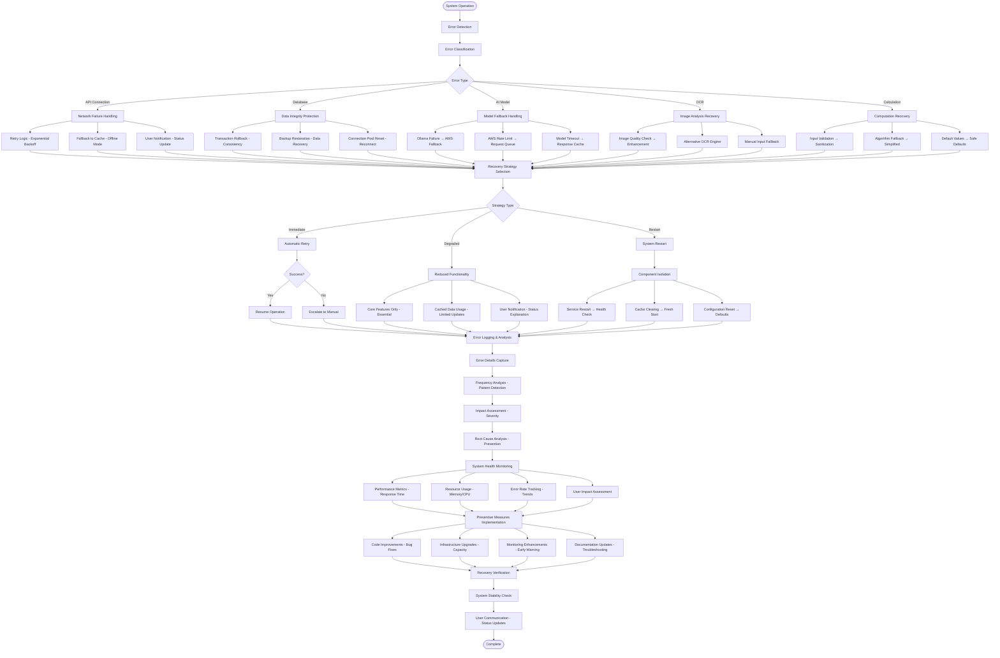
```mermaid
flowchart TD
    Operation([System Operation]) --> ErrorDetection[Error Detection]
    
    ErrorDetection --> ClassifyError[Error Classification]
    
    ClassifyError --> ErrorType{Error Type}
    
    ErrorType -->|API Connection| APIError[Network Failure Handling]
    ErrorType -->|Database| DBError[Data Integrity Protection]
    ErrorType -->|AI Model| AIError[Model Fallback Handling]
    ErrorType -->|OCR| OCRError[Image Analysis Recovery]
    ErrorType -->|Calculation| CalcError[Computation Recovery]
    
    APIError --> RetryLogic[Retry Logic - Exponential Backoff]
    APIError --> FallbackCache[Fallback to Cache - Offline Mode]
    APIError --> NotifyUser1[User Notification - Status Update]
    
    DBError --> Rollback[Transaction Rollback - Consistency]
    DBError --> BackupRestore[Backup Restoration - Data Recovery]
    DBError --> PoolReset[Connection Pool Reset - Reconnect]
    
    AIError --> OllamaFail[Ollama Failure → AWS Fallback]
    AIError --> RateLimit[AWS Rate Limit → Request Queue]
    AIError --> Timeout[Model Timeout → Response Cache]
    
    OCRError --> QualityCheck[Image Quality Check → Enhancement]
    OCRError --> AlternativeOCR[Alternative OCR Engine]
    OCRError --> ManualFallback[Manual Input Fallback]
    
    CalcError --> InputValidation[Input Validation → Sanitization]
    CalcError --> AlgoFallback[Algorithm Fallback → Simplified]
    CalcError --> DefaultValues[Default Values → Safe Defaults]
    
    RetryLogic --> RecoveryStrategy[Recovery Strategy Selection]
    FallbackCache --> RecoveryStrategy
    NotifyUser1 --> RecoveryStrategy
    Rollback --> RecoveryStrategy
    BackupRestore --> RecoveryStrategy
    PoolReset --> RecoveryStrategy
    OllamaFail --> RecoveryStrategy
    RateLimit --> RecoveryStrategy
    Timeout --> RecoveryStrategy
    QualityCheck --> RecoveryStrategy
    AlternativeOCR --> RecoveryStrategy
    ManualFallback --> RecoveryStrategy
    InputValidation --> RecoveryStrategy
    AlgoFallback --> RecoveryStrategy
    DefaultValues --> RecoveryStrategy
    
    RecoveryStrategy --> StrategyType{Strategy Type}
    
    StrategyType -->|Immediate| AutoRetry[Automatic Retry]
    StrategyType -->|Degraded| ReducedFunc[Reduced Functionality]
    StrategyType -->|Restart| SystemRestart[System Restart]
    
    AutoRetry --> RetryResult{Success?}
    RetryResult -->|Yes| ResumeOp[Resume Operation]
    RetryResult -->|No| EscalateManual[Escalate to Manual]
    
    ReducedFunc --> CoreOnly[Core Features Only - Essential]
    ReducedFunc --> CachedOnly[Cached Data Usage - Limited Updates]
    ReducedFunc --> NotifyUser2[User Notification - Status Explanation]
    
    SystemRestart --> Isolate[Component Isolation]
    Isolate --> ServiceRestart[Service Restart → Health Check]
    Isolate --> CacheClear[Cache Clearing → Fresh Start]
    Isolate --> ConfigReset[Configuration Reset → Defaults]
    
    ResumeOp --> LogError[Error Logging & Analysis]
    EscalateManual --> LogError
    CoreOnly --> LogError
    CachedOnly --> LogError
    NotifyUser2 --> LogError
    ServiceRestart --> LogError
    CacheClear --> LogError
    ConfigReset --> LogError
    
    LogError --> CaptureDetails[Error Details Capture]
    CaptureDetails --> FrequencyAnalysis[Frequency Analysis - Pattern Detection]
    FrequencyAnalysis --> ImpactAssess[Impact Assessment - Severity]
    ImpactAssess --> RootCause[Root Cause Analysis - Prevention]
    
    RootCause --> HealthMonitor[System Health Monitoring]
    
    HealthMonitor --> PerfMetrics[Performance Metrics - Response Time]
    HealthMonitor --> ResourceUsage[Resource Usage - Memory/CPU]
    HealthMonitor --> ErrorRate[Error Rate Tracking - Trends]
    HealthMonitor --> UserImpact[User Impact Assessment]
    
    PerfMetrics --> PreventiveMeasures[Preventive Measures Implementation]
    ResourceUsage --> PreventiveMeasures
    ErrorRate --> PreventiveMeasures
    UserImpact --> PreventiveMeasures
    
    PreventiveMeasures --> CodeImprov[Code Improvements - Bug Fixes]
    PreventiveMeasures --> InfraUpgrade[Infrastructure Upgrades - Capacity]
    PreventiveMeasures --> MonitorEnhance[Monitoring Enhancements - Early Warning]
    PreventiveMeasures --> DocsUpdate[Documentation Updates - Troubleshooting]
    
    CodeImprov --> VerifyRecovery[Recovery Verification]
    InfraUpgrade --> VerifyRecovery
    MonitorEnhance --> VerifyRecovery
    DocsUpdate --> VerifyRecovery
    
    VerifyRecovery --> StabilityCheck[System Stability Check]
    StabilityCheck --> CommUser[User Communication - Status Updates]
    
    CommUser --> Complete([Complete])
```

### 8.3 Error Categories and Responses

| Error Category | Detection Method | Recovery Strategy | Escalation Path |
|----------------|------------------|-------------------|-----------------|
| **API Connection** | Timeout, network error | Exponential backoff retry, cache fallback | Circuit breaker open after 5 failures |
| **Database** | SQL exception, constraint violation | Transaction rollback, connection reset | DBA notification after repeated failures |
| **AI Model** | Provider timeout, rate limit | Fallback to alternative provider | Cost alert if fallback usage exceeds threshold |
| **OCR Processing** | Low confidence score | Manual correction UI | User assistance request |
| **Calculation** | Invalid input, out of range | Input sanitization, safe defaults | Log for algorithm review |

### 8.4 Service Implementation

**Middleware**: `ErrorHandlerMiddleware`  
**Location**: `app/Http/Middleware/ErrorHandlerMiddleware.php`

```php
public function handle(Request $request, Closure $next)
{
    try {
        $response = $next($request);
        
        return $response;
        
    } catch (APIException $e) {
        return $this->handleAPIError($e, $request);
        
    } catch (DatabaseException $e) {
        return $this->handleDatabaseError($e, $request);
        
    } catch (AIException $e) {
        return $this->handleAIError($e, $request);
        
    } catch (\Throwable $e) {
        Log::error('Unhandled exception', [
            'exception' => $e->getMessage(),
            'trace' => $e->getTraceAsString(),
            'request' => $request->all(),
        ]);
        
        return $this->handleGenericError($e, $request);
    }
}

private function handleAPIError(APIException $e, Request $request)
{
    // Increment circuit breaker failure count
    $this->circuitBreaker->recordFailure($e->getApi());
    
    // Attempt cache fallback
    if ($cached = Cache::get($e->getCacheKey())) {
        return response()->json([
            'success' => true,
            'data' => $cached,
            'meta' => ['source' => 'cache', 'warning' => 'Using cached data due to API unavailability'],
        ]);
    }
    
    // Return error response
    return response()->json([
        'success' => false,
        'error' => 'External API temporarily unavailable',
        'code' => 'EXT_001',
    ], 503);
}
```

---

## 9. Real-Time Communication Flow

### 9.1 Process Overview

Real-time communication is handled via **Laravel Reverb** (Laravel's native WebSocket server), enabling live updates for training events, race results, and AI recommendations.

### 9.2 WebSocket Communication Flow

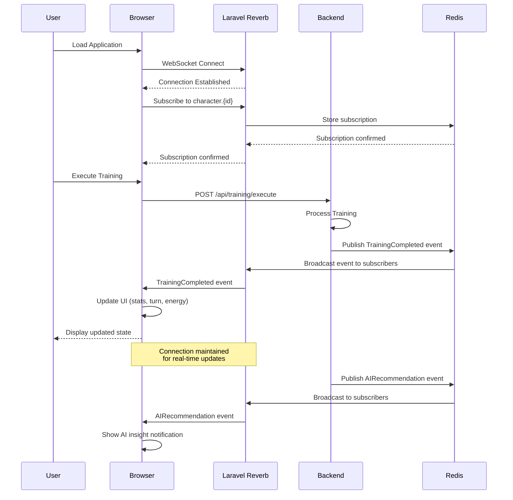
```mermaid
sequenceDiagram
    participant User
    participant Browser
    participant Reverb as Laravel Reverb
    participant Backend
    participant Redis
    
    User->>Browser: Load Application
    Browser->>Reverb: WebSocket Connect
    Reverb-->>Browser: Connection Established
    
    Browser->>Reverb: Subscribe to character.{id}
    Reverb->>Redis: Store subscription
    Redis-->>Reverb: Subscription confirmed
    Reverb-->>Browser: Subscription confirmed
    
    User->>Browser: Execute Training
    Browser->>Backend: POST /api/training/execute
    
    Backend->>Backend: Process Training
    Backend->>Redis: Publish TrainingCompleted event
    
    Redis->>Reverb: Broadcast event to subscribers
    Reverb->>Browser: TrainingCompleted event
    
    Browser->>Browser: Update UI (stats, turn, energy)
    Browser-->>User: Display updated state
    
    Note over Browser,Reverb: Connection maintained<br/>for real-time updates
    
    Backend->>Redis: Publish AIRecommendation event
    Redis->>Reverb: Broadcast to subscribers
    Reverb->>Browser: AIRecommendation event
    Browser->>Browser: Show AI insight notification
```

### 9.3 Event Broadcasting

**Broadcast Events:**

| Event | Channel | Data |
|-------|---------|------|
| `TrainingCompleted` | `character.{id}` | Updated stats, energy, mood, skill hints |
| `RaceCompleted` | `character.{id}` | Race results, fan gains, SP gains |
| `SkillAcquired` | `character.{id}` | Skill details, SP cost, remaining SP |
| `AIRecommendation` | `user.{id}` | Recommendation content, confidence score |
| `ExternalDataUpdated` | `public` | Updated meta tier, community data |

### 9.4 Implementation

**Event Class**: `TrainingCompleted`  
**Location**: `app/Events/TrainingCompleted.php`

```php
class TrainingCompleted implements ShouldBroadcast
{
    use Dispatchable, InteractsWithSockets, SerializesModels;
    
    public function __construct(
        public Career $career,
        public array $statGains,
    ) {}
    
    public function broadcastOn(): Channel
    {
        return new PrivateChannel('character.' . $this->career->character_id);
    }
    
    public function broadcastWith(): array
    {
        return [
            'career_id' => $this->career->id,
            'character_id' => $this->career->character_id,
            'current_turn' => $this->career->current_turn,
            'stats' => [
                'speed' => $this->career->speed,
                'stamina' => $this->career->stamina,
                'power' => $this->career->power,
                'guts' => $this->career->guts,
                'wit' => $this->career->wit,
            ],
            'stat_gains' => $this->statGains,
            'energy' => $this->career->energy,
            'mood' => $this->career->mood->value,
            'timestamp' => now()->toISOString(),
        ];
    }
}
```

---

## 10. Process Flow Summary

### 10.1 Key System Processes

| Process | Technology | Primary Purpose | Performance Target |
|---------|------------|-----------------|-------------------|
| **External Data Sync** | HTTP Client + Circuit Breaker | Game data synchronization | Response < 2s, Fallback < 500ms |
| **Training Prediction** | Service Layer + Caching | Stat gain calculations | Response < 200ms (cached), < 1.2s (calculated) |
| **AI Advisory** | Ollama + AWS Bedrock | Intelligent recommendations | Ollama < 5s, Bedrock < 10s |
| **MCP Tool Execution** | MCP Client + Servers | Agent tool access | Response < 2s per tool |
| **Career Analytics** | Database + Background Jobs | Performance tracking | Real-time metrics, Async reports |
| **OCR Processing** | Tesseract + GD | Screenshot parsing | Processing < 10s per image |
| **Error Recovery** | Circuit Breaker + Fallbacks | System resilience | Automatic recovery within 60s |
| **WebSocket Broadcast** | Laravel Reverb | Real-time updates | Push delay < 100ms |

### 10.2 Critical Data Flows

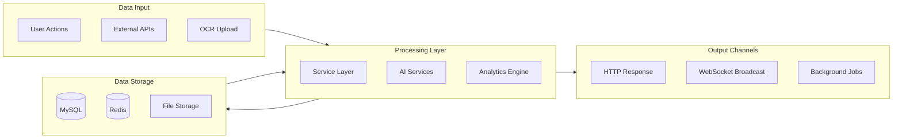
```mermaid
flowchart LR
    subgraph Input[Data Input]
        UserActions[User Actions]
        ExternalAPIs[External APIs]
        OCRUpload[OCR Upload]
    end
    
    subgraph Processing[Processing Layer]
        Services[Service Layer]
        AI[AI Services]
        Analytics[Analytics Engine]
    end
    
    subgraph Storage[Data Storage]
        MySQL[(MySQL)]
        Redis[(Redis)]
        Files[File Storage]
    end
    
    subgraph Output[Output Channels]
        HTTP[HTTP Response]
        WebSocket[WebSocket Broadcast]
        Queue[Background Jobs]
    end
    
    Input --> Processing
    Processing --> Storage
    Processing --> Output
    Storage --> Processing
```

### 10.3 Performance Characteristics

| Metric | Target | Current | Status |
|--------|--------|---------|--------|
| **Page Load Time** | < 2 seconds | ~2.2s | 🟡 Optimizing |
| **First Contentful Paint** | < 1.5 seconds | ~1.7s | 🟡 Optimizing |
| **Time to Interactive** | < 3 seconds | ~3.1s | 🟡 Optimizing |
| **API Response Time (p95)** | < 500ms | ~420ms | ✅ Met |
| **Cache Hit Rate** | > 85% | 88% | ✅ Met |
| **AI Response Time (Ollama)** | < 5 seconds | ~4.2s | ✅ Met |
| **AI Response Time (Bedrock)** | < 10 seconds | ~8.5s | ✅ Met |
| **WebSocket Latency** | < 100ms | ~75ms | ✅ Met |
| **OCR Processing** | < 10 seconds | ~8.3s | ✅ Met |

### 10.4 Scalability Considerations

| Component | Scaling Strategy | Current Limit | Notes |
|-----------|------------------|---------------|-------|
| **Web Tier** | Horizontal (Load Balancer) | 10 req/s per instance | Stateless design enables easy scaling |
| **Database** | Read replicas + Partitioning | 100 concurrent connections | Indexed for query optimization |
| **Cache (Redis)** | Redis Cluster | 10,000 operations/s | In-memory for fast access |
| **AI Processing** | Provider-based (unlimited Bedrock) | Ollama: 1 concurrent | Bedrock scales automatically |
| **WebSocket** | Reverb Horizontal Scaling | 1,000 concurrent connections | Redis pub/sub for multi-server |
| **OCR Pipeline** | Queue-based processing | 10 concurrent jobs | Background job processing |

### 10.5 System Integration Points

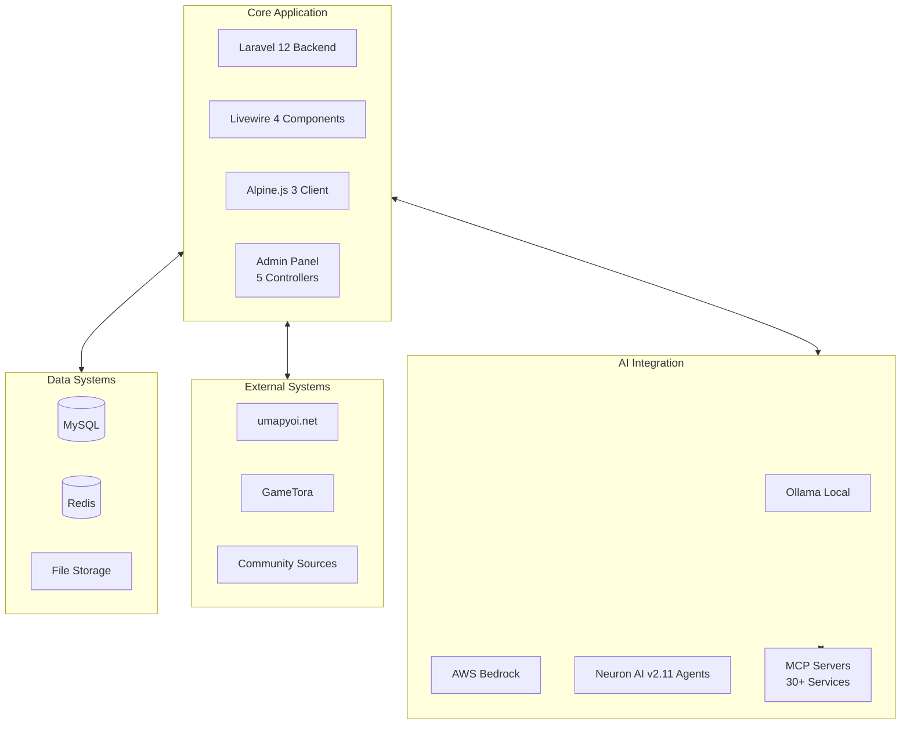
```mermaid
flowchart TB
    subgraph CoreApp[Core Application]
        Laravel[Laravel 12 Backend]
        Livewire[Livewire 4 Components]
        Alpine[Alpine.js 3 Client]
        Admin[Admin Panel<br/>5 Controllers]
    end
    
    subgraph AILayer[AI Integration]
        Ollama[Ollama Local]
        Bedrock[AWS Bedrock]
        Neuron[Neuron AI v2.11 Agents]
        MCP[MCP Servers<br/>30+ Services]
    end
    
    subgraph ExternalSystems[External Systems]
        UmapyoiAPI[umapyoi.net]
        GameToraAPI[GameTora]
        CommunityAPI[Community Sources]
    end
    
    subgraph DataSystems[Data Systems]
        MySQL[(MySQL)]
        Redis[(Redis)]
        S3[File Storage]
    end
    
    CoreApp <--> AILayer
    CoreApp <--> ExternalSystems
    CoreApp <--> DataSystems
    AILayer <--> MCP
```

---

## 11. Performance Monitoring & APM Flow

### 11.1 Overview

The Performance Monitoring system provides comprehensive Application Performance Monitoring (APM) capabilities across all application layers. This includes real-time metrics collection, historical tracking, alerting, and optimization recommendations.

**Key Services (NEW January 2026):**

| Service | Purpose |
|---------|---------|
| `ApmService` | Core APM metrics collection and reporting |
| `ApiPerformanceMonitoringService` | API endpoint performance tracking |
| `QueryOptimizationService` | Database query analysis and optimization |
| `PerformanceAlertingService` | Alert generation and threshold management |
| `RedisCacheOptimizationService` | Cache hit/miss analysis and optimization |
| `ApiResponseCachingService` | Response caching strategies and invalidation |
| `PerformanceRegressionService` | Regression detection across deployments |
| `HistoricalTrackingService` | Long-term metrics storage and analysis |

### 11.2 APM Data Collection Flow

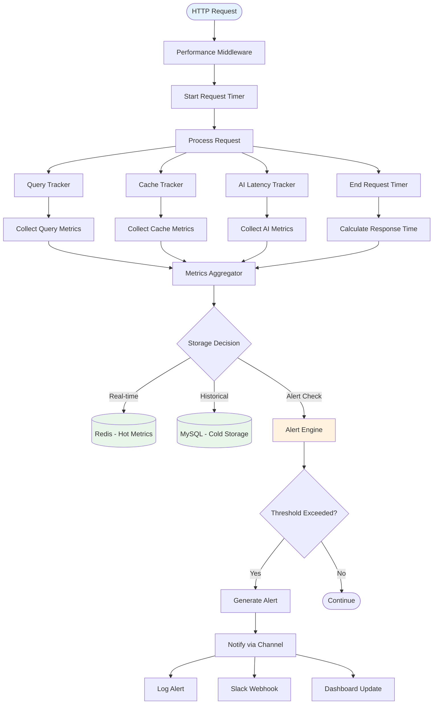
```mermaid
flowchart TD
    Request([HTTP Request]) --> Middleware[Performance Middleware]
    
    Middleware --> StartTimer[Start Request Timer]
    StartTimer --> ProcessRequest[Process Request]
    
    ProcessRequest --> QueryTracker[Query Tracker]
    ProcessRequest --> CacheTracker[Cache Tracker]
    ProcessRequest --> AITracker[AI Latency Tracker]
    
    QueryTracker --> QueryMetrics[Collect Query Metrics]
    CacheTracker --> CacheMetrics[Collect Cache Metrics]
    AITracker --> AIMetrics[Collect AI Metrics]
    
    QueryMetrics --> Aggregator[Metrics Aggregator]
    CacheMetrics --> Aggregator
    AIMetrics --> Aggregator
    
    ProcessRequest --> EndTimer[End Request Timer]
    EndTimer --> ResponseMetrics[Calculate Response Time]
    ResponseMetrics --> Aggregator
    
    Aggregator --> Store{Storage Decision}
    
    Store -->|Real-time| Redis[(Redis - Hot Metrics)]
    Store -->|Historical| MySQL[(MySQL - Cold Storage)]
    Store -->|Alert Check| AlertEngine[Alert Engine]
    
    AlertEngine --> ThresholdCheck{Threshold Exceeded?}
    ThresholdCheck -->|Yes| GenerateAlert[Generate Alert]
    ThresholdCheck -->|No| Continue([Continue])
    
    GenerateAlert --> NotifyChannel[Notify via Channel]
    NotifyChannel --> Log[Log Alert]
    NotifyChannel --> Slack[Slack Webhook]
    NotifyChannel --> Dashboard[Dashboard Update]
    
    style Request fill:#e3f2fd
    style AlertEngine fill:#fff3e0
    style Redis fill:#e8f5e9
    style MySQL fill:#e8f5e9
```

### 11.3 Query Optimization Flow

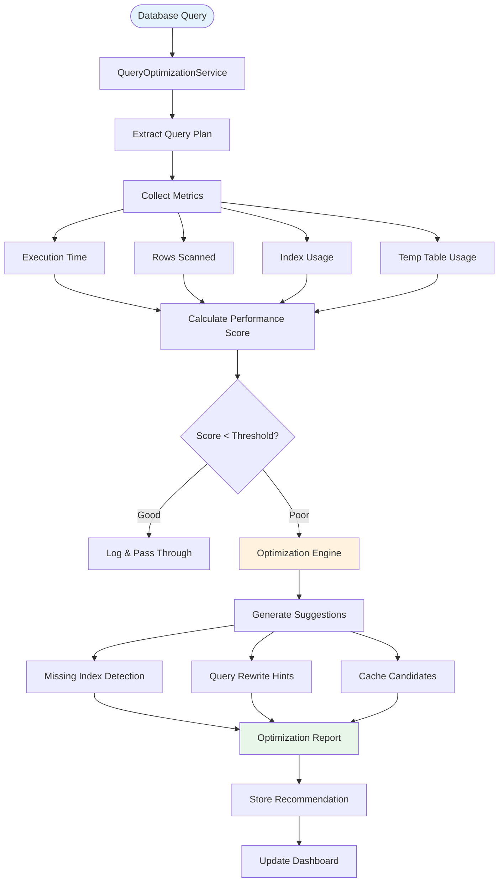
```mermaid
flowchart TD
    Query([Database Query]) --> Analyzer[QueryOptimizationService]
    
    Analyzer --> ExtractPlan[Extract Query Plan]
    ExtractPlan --> Metrics[Collect Metrics]
    
    Metrics --> Duration[Execution Time]
    Metrics --> RowsScanned[Rows Scanned]
    Metrics --> IndexUsage[Index Usage]
    Metrics --> TempTables[Temp Table Usage]
    
    Duration --> ScoreCalc[Calculate Performance Score]
    RowsScanned --> ScoreCalc
    IndexUsage --> ScoreCalc
    TempTables --> ScoreCalc
    
    ScoreCalc --> Evaluation{Score < Threshold?}
    
    Evaluation -->|Good| PassThrough[Log & Pass Through]
    Evaluation -->|Poor| OptimizationEngine[Optimization Engine]
    
    OptimizationEngine --> Suggestions[Generate Suggestions]
    
    Suggestions --> IndexSuggestion[Missing Index Detection]
    Suggestions --> QueryRewrite[Query Rewrite Hints]
    Suggestions --> CacheSuggestion[Cache Candidates]
    
    IndexSuggestion --> Report[Optimization Report]
    QueryRewrite --> Report
    CacheSuggestion --> Report
    
    Report --> Store[Store Recommendation]
    Store --> Dashboard[Update Dashboard]
    
    style Query fill:#e3f2fd
    style OptimizationEngine fill:#fff3e0
    style Report fill:#e8f5e9
```

### 11.4 Cache Optimization Flow

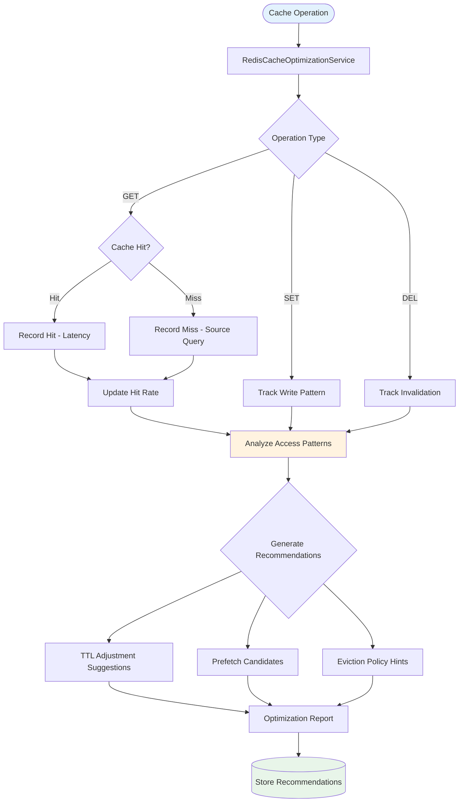
```mermaid
flowchart TD
    CacheOp([Cache Operation]) --> Monitor[RedisCacheOptimizationService]
    
    Monitor --> OperationType{Operation Type}
    
    OperationType -->|GET| CheckHit{Cache Hit?}
    OperationType -->|SET| TrackWrite[Track Write Pattern]
    OperationType -->|DEL| TrackInvalidation[Track Invalidation]
    
    CheckHit -->|Hit| RecordHit[Record Hit - Latency]
    CheckHit -->|Miss| RecordMiss[Record Miss - Source Query]
    
    RecordHit --> HitRateCalc[Update Hit Rate]
    RecordMiss --> HitRateCalc
    
    HitRateCalc --> AnalyzePatterns[Analyze Access Patterns]
    TrackWrite --> AnalyzePatterns
    TrackInvalidation --> AnalyzePatterns
    
    AnalyzePatterns --> Recommendations{Generate Recommendations}
    
    Recommendations --> TTLAdjust[TTL Adjustment Suggestions]
    Recommendations --> PrefetchCandidates[Prefetch Candidates]
    Recommendations --> EvictionPolicy[Eviction Policy Hints]
    
    TTLAdjust --> OptReport[Optimization Report]
    PrefetchCandidates --> OptReport
    EvictionPolicy --> OptReport
    
    OptReport --> Store[(Store Recommendations)]
    
    style CacheOp fill:#e3f2fd
    style AnalyzePatterns fill:#fff3e0
    style Store fill:#e8f5e9
```

### 11.5 Performance Regression Detection

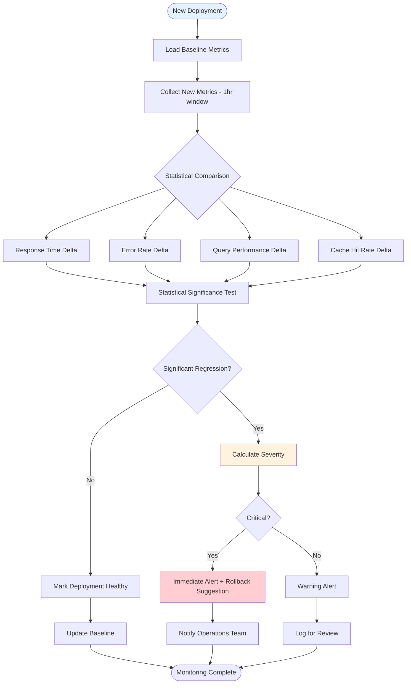
```mermaid
flowchart TD
    Deploy([New Deployment]) --> Baseline[Load Baseline Metrics]
    
    Baseline --> CollectNew[Collect New Metrics - 1hr window]
    
    CollectNew --> Compare{Statistical Comparison}
    
    Compare --> ResponseTime[Response Time Delta]
    Compare --> ErrorRate[Error Rate Delta]
    Compare --> QueryPerf[Query Performance Delta]
    Compare --> CacheHitRate[Cache Hit Rate Delta]
    
    ResponseTime --> StatTest[Statistical Significance Test]
    ErrorRate --> StatTest
    QueryPerf --> StatTest
    CacheHitRate --> StatTest
    
    StatTest --> Significant{Significant Regression?}
    
    Significant -->|Yes| SeverityCalc[Calculate Severity]
    Significant -->|No| Pass[Mark Deployment Healthy]
    
    SeverityCalc --> Critical{Critical?}
    
    Critical -->|Yes| ImmediateAlert[Immediate Alert + Rollback Suggestion]
    Critical -->|No| WarningAlert[Warning Alert]
    
    ImmediateAlert --> NotifyOps[Notify Operations Team]
    WarningAlert --> LogWarning[Log for Review]
    
    Pass --> UpdateBaseline[Update Baseline]
    UpdateBaseline --> Complete([Monitoring Complete])
    NotifyOps --> Complete
    LogWarning --> Complete
    
    style Deploy fill:#e3f2fd
    style SeverityCalc fill:#fff3e0
    style ImmediateAlert fill:#ffcdd2
```

### 11.6 Historical Tracking Architecture

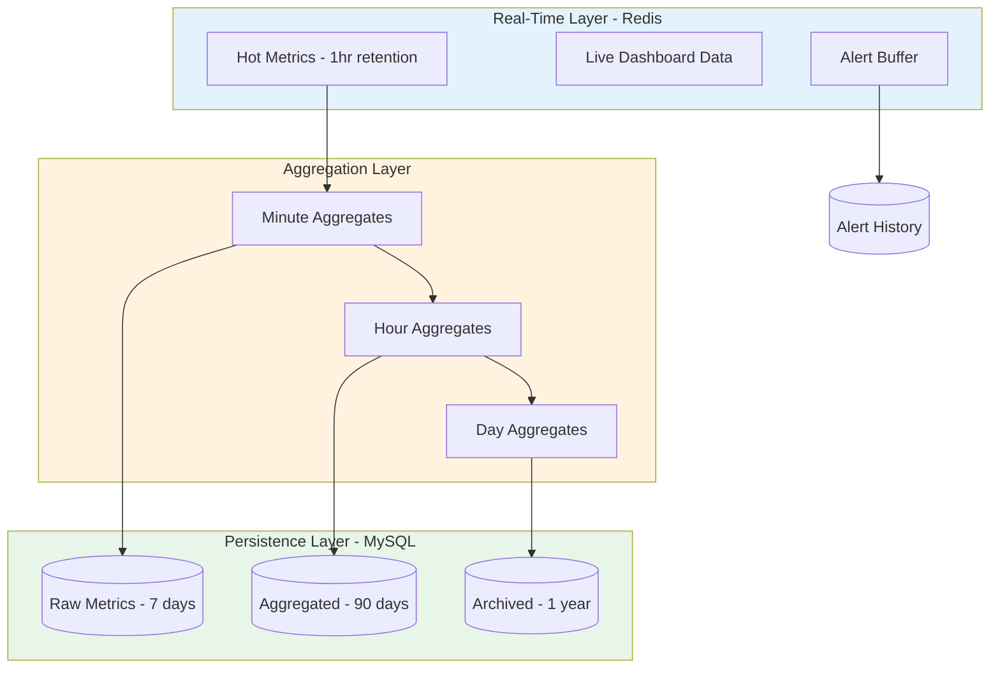
```mermaid
flowchart TB
    subgraph RealTime[Real-Time Layer - Redis]
        HotMetrics[Hot Metrics - 1hr retention]
        LiveDashboard[Live Dashboard Data]
        AlertBuffer[Alert Buffer]
    end
    
    subgraph Aggregation[Aggregation Layer]
        MinuteAgg[Minute Aggregates]
        HourAgg[Hour Aggregates]
        DayAgg[Day Aggregates]
    end
    
    subgraph Persistence[Persistence Layer - MySQL]
        RawMetrics[(Raw Metrics - 7 days)]
        AggregatedMetrics[(Aggregated - 90 days)]
        ArchivedMetrics[(Archived - 1 year)]
    end
    
    HotMetrics --> MinuteAgg
    MinuteAgg --> HourAgg
    HourAgg --> DayAgg
    
    MinuteAgg --> RawMetrics
    HourAgg --> AggregatedMetrics
    DayAgg --> ArchivedMetrics
    
    AlertBuffer --> AlertHistory[(Alert History)]
    
    style RealTime fill:#e3f2fd
    style Aggregation fill:#fff3e0
    style Persistence fill:#e8f5e9
```

---

## Document Control

| Version | Date | Author | Changes |
|---------|------|--------|---------|
| 2.4.0 | 2026-02-22 | Development Team | Fixed TypeScript→Livewire 4/Alpine.js 3 references; added Neuron AI v2.11; updated external API references (GameTora); added Admin Panel to architecture; updated stats |
| 2.3.0 | 2026-02-21 | Development Team | Updated version/date metadata; Livewire 3→4; aligned with 30 current Eloquent models |
| 2.2.0 | 2026-01-27 | Development Team | Added §11 Performance Monitoring & APM Flow; added 8 Performance & Monitoring services |
| 2.1.0 | 2026-01-23 | Development Team | Comprehensive update for v2.0.0: Added MCP integration, OCR pipeline, real-time communication flows; aligned with current implementation |
| 2.0.0 | 2026-01-14 | Development Team | Major revision with Mermaid diagrams |
| 1.0.0 | 2026-01-03 | Development Team | Initial specification |

---

## Related Documents

- [SIP - Software Integration Plan](007_SIP_Software_Integration_Plan.md)
- [SIS - Software Integration Specifications](008_SIS_Software_Integration_Specifications.md)
- [SDS - Software Design Specifications](004_SDS_Software_Design_Specifications.md)
- [SCD - Source Code Documentation](010_SCD_Source_Code_Documentation.md)
- [SPEC-006: AI Advisory Technical](../specs/SPEC-006_AI_Advisory_Technical.md)
- [SPEC-007: External Integration Technical](../specs/SPEC-007_External_Integration_Technical.md)
- [FLOW-006: AI Advisory System](../flows/FLOW-006_AI_Advisory_System.md)
- [FLOW-007: External Integration System](../flows/FLOW-007_External_Integration_System.md)
- [TECH-FLOW-006: AI Advisory Flow](../tech-flow/TECH-FLOW-006_AI_Advisory_Flow.md)
- [TECH-FLOW-007: External Integration Flow](../tech-flow/TECH-FLOW-007_External_Integration_Flow.md)

---

*This document reflects the system-level process flows implemented in the Umamusume Pretty Derby Career Planner v2.4.0 and serves as the authoritative reference for system integration and data flow architecture.*
