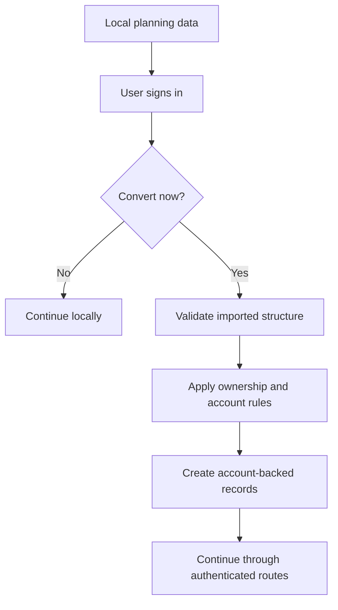

# Umamusume Pretty Derby Career Planner - User Workflow Diagrams

**Document Version**: 2.4.2
**Date**: April 7, 2026
**Project**: Umamusume Pretty Derby Career Planner
**Author**: Development Team
**Status**: Current - user-facing workflows aligned to current routes, storage modes, and authorization boundaries

---

## 1. Overview

> **Diagram scope**: User workflow reference with explicit auth, storage, and policy checkpoints. Route names reflect current web routes where practical.

This document focuses on the major user journeys that are most likely to drift when architecture or
routes change: character planning, training, race planning, AI advisory, OCR import, and data
conversion.

---

## 2. Character Planning Workflow

```mermaid
flowchart TD
    Start([Open planner]) --> Auth{Authenticated?}
    Auth -->|No| Local[Continue in local-first mode]
    Auth -->|Yes| Dashboard[/dashboard]

    Local --> CreateLocal[Create local character state]
    Dashboard --> Characters[/characters]
    Characters --> Create[/characters/create]
    Create --> Save[Store Character]
    Save --> Show[/characters/{character}]

    CreateLocal --> LocalView[Local planning UI]
    Show --> Edit[/characters/{character}/edit]
    Edit --> Update[Persist changes]
    Update --> Show
```

    ```text
    [Open planner]
        |
        v
    [Authenticated?] -- no --> [Continue in local-first mode] --> [Create local character state] --> [Local planning UI]
        |
         yes
        v
     [/dashboard] --> [/characters] --> [/characters/create] --> [Store Character] --> [/characters/{character}]
                                                           |
                                                           v
                                                  [/characters/{character}/edit] --> [Persist changes] --> [/characters/{character}]
    ```

---

## 3. Training Workflow

```mermaid
flowchart TD
    Character[Character detail] --> Training[/characters/{character}/training]
    Training --> Predict[Training prediction and advisory services]
    Predict --> Choose[Choose action]
    Choose --> SaveTurn[Persist turn result]
    SaveTurn --> Next[Continue to next turn or return to character view]
```

    ```text
    [Character detail]
        |
        v
    [/characters/{character}/training]
        |
        v
    [Training prediction and advisory services]
        |
        v
    [Choose action] --> [Persist turn result] --> [Continue to next turn or return to character view]
    ```

---

## 4. Race Planning and Entry Workflow

```mermaid
flowchart TD
    Start([Open race tools]) --> Auth{Authenticated?}
    Auth -->|No| GuestStop[Race entry unavailable in guest account flow]
    Auth -->|Yes| Catalog[/races or /races/calendar or /races/targets]

    Catalog --> Select[Select GameRace]
    Select --> Review[Review readiness, fans, surface, distance, and mood]
    Review --> Ownership{Character ownership check}
    Ownership -->|Denied| Block[Show authorization failure]
    Ownership -->|Allowed| Enter[POST /characters/{character}/races/{gameRace}/enter]
    Enter --> Simulate[RaceExecutionService]
    Simulate --> Result[Redirect with race outcome]
```

    ```text
    [Open race tools]
        |
        v
    [Authenticated?] -- no --> [Race entry unavailable in guest account flow]
        |
         yes
        v
    [/races or /races/calendar or /races/targets]
        |
        v
    [Select GameRace] --> [Review readiness, fans, surface, distance, and mood] --> [Character ownership check]
                                                            | denied
                                                            v
                                                     [Show authorization failure]
                                                            |
                                                          allowed
                                                            v
                                         [POST /characters/{character}/races/{gameRace}/enter]
                                                            |
                                                            v
                                                     [RaceExecutionService] --> [Redirect with race outcome]
    ```

### 4.1 Notes

- Race entry is an authenticated account-mode action.
- `CharacterPolicy` protects the mutable race-entry path.
- Readiness analysis should consider current stat spread, aptitudes, fan requirements, and current run condition.

---

## 5. AI Advisory Workflow

```mermaid
flowchart TD
    Start([Ask AI]) --> Route[/ai/chat or advisory endpoints]
    Route --> Gather[Gather planning context]
    Gather --> Model{Local available?}
    Model -->|Yes| Ollama[llama3.3 default]
    Model -->|No| Bedrock[claude-3-5-sonnet default]
    Bedrock --> Fallback[Supported alternatives when needed]
    Ollama --> Response[Show recommendation]
    Bedrock --> Response
    Fallback --> Response
```

```text
[Ask AI]
    |
    v
[/ai/chat or advisory endpoints] --> [Gather planning context] --> [Local available?]
                                                               | yes                     | no
                                                               v                         v
                                                   [llama3.3 default]      [claude-3-5-sonnet default] --> [Supported alternatives when needed]
                                                               \___________________________  __________________________/
                                                                                           \/
                                                                                 [Show recommendation]
```

### 5.1 Current Model References

| Provider | Model | Role |
| --- | --- | --- |
| Ollama | `llama3.3` | Default local path |
| AWS Bedrock | `claude-3-5-sonnet` | Default cloud path |
| AWS Bedrock | `claude-3-5-haiku` | Fast lower-cost path |
| AWS Bedrock | `claude-opus-4-5` | Heavier reasoning fallback |
| AWS Bedrock | `nova-2-lite`, `nova-2-pro` | Supported optional alternatives |

---

## 6. OCR and Import Workflow

```mermaid
flowchart TD
    Start([Upload screenshot]) --> OCR[/ocr/upload]
    OCR --> Process[GD preprocessing plus Tesseract OCR]
    Process --> Review[Review extracted values]
    Review --> Import{Import into local or account data?}
    Import -->|Local| LocalState[Update local planning state]
    Import -->|Account| Auth[Authenticated write path]
    Auth --> Persist[Persist records]
```

```text
[Upload screenshot] --> [/ocr/upload] --> [GD preprocessing plus Tesseract OCR] --> [Review extracted values]
                                                                                      |
                                                                                      v
                                                                          [Import into local or account data?]
                                                                               | local                | account
                                                                               v                      v
                                                               [Update local planning state]   [Authenticated write path] --> [Persist records]
```

---

## 7. Local to Account Conversion Workflow



```text
[Local planning data] --> [User signs in] --> [Convert now?]
                                             | no                    | yes
                                             v                       v
                                 [Continue locally]   [Validate imported structure] --> [Apply ownership and account rules]
                                                                                          |
                                                                                          v
                                                                            [Create account-backed records] --> [Continue through authenticated routes]
```

---

## 8. Authorization Boundaries

| Flow | Boundary |
| --- | --- |
| Character dashboard and CRUD | `auth` middleware |
| Race entry | `auth` middleware plus `CharacterPolicy::update()` |
| Career read and update in API | `CareerPolicy` ownership checks |
| Admin tools | `auth` plus `admin` middleware |
| Guest or local-only planning | browser-managed state, no account persistence |

### 8.1 Local Mode Feature Limitations

Users in local-first (unauthenticated) mode have access to a subset of features:

| Feature | Local Mode | Account Mode |
| --- | --- | --- |
| Character and career planning | Available | Available |
| Training prediction and advisory | Available | Available |
| Skill planning | Available | Available |
| Race entry (POST to server) | **Not available** | Available |
| Race readiness review (read-only) | Available | Available |
| Cloud backup and cross-device sync | **Not available** | Available |
| OCR import (server-side) | **Not available** | Available |
| Data export (JSON) | Available (browser) | Available |
| Local → Account conversion | N/A | Available at sign-in |

---

## 9. Related Documents

- [PRD-001: Character Management](../02-prds/PRD-001_Character_Management.md)
- [PRD-002: Training Optimization](../02-prds/PRD-002_Training_Optimization.md)
- [PRD-003: Race Strategy](../02-prds/PRD-003_Race_Strategy.md)
- [PRD-006: AI Advisory](../02-prds/PRD-006_AI_Advisory.md)
- [PRD-007: External Integration](../02-prds/PRD-007_External_Integration.md)
- [SPEC-001 through SPEC-007](../02-specs/000_SPECS_INDEX.md)
- [FLOW-001 through FLOW-007](../01-flows/000_FLOWS_INDEX.md)
