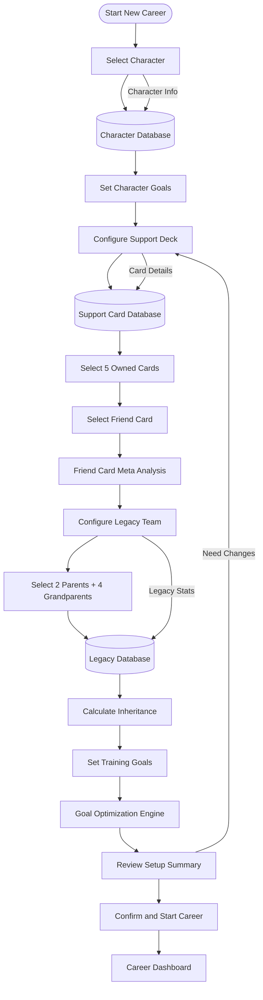
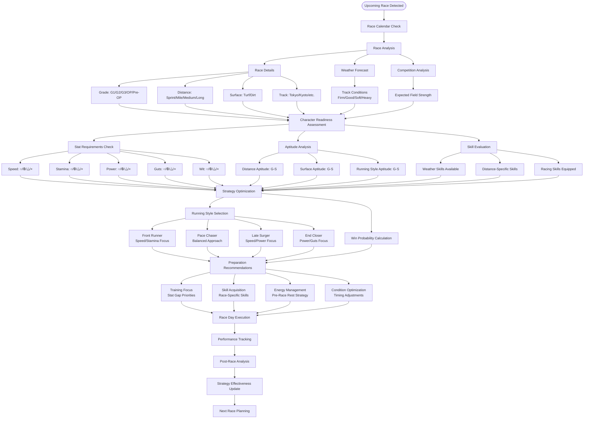
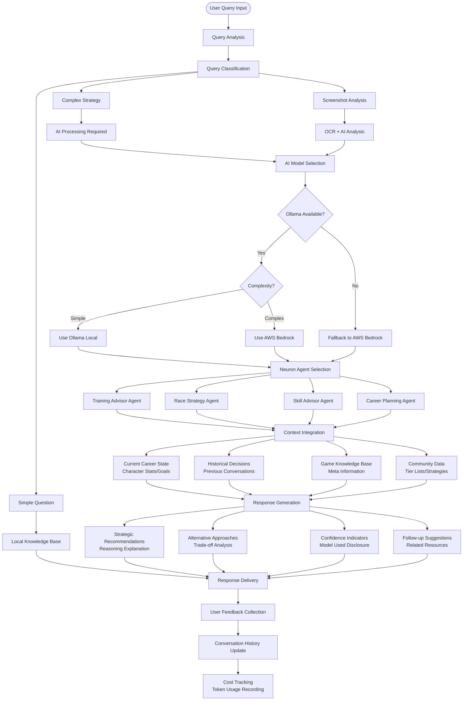
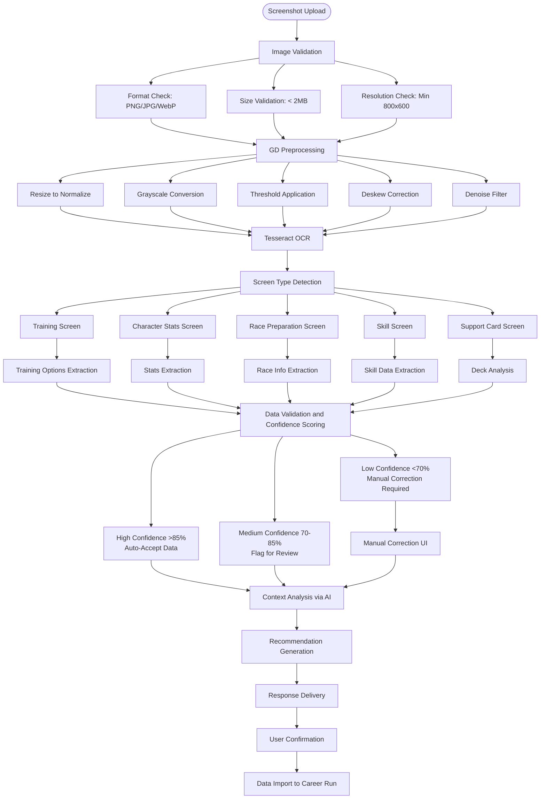
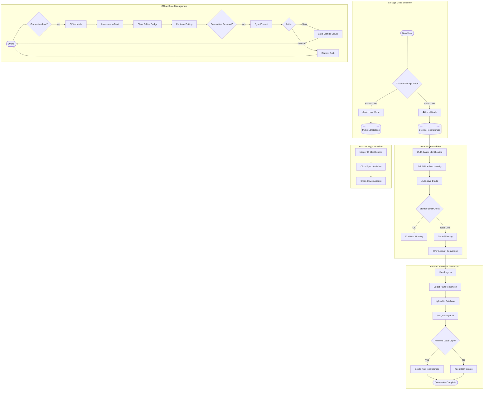

# Umamusume Career Planner - User Workflow Diagrams

## Overview

This document presents the key user workflow diagrams for the Umamusume Pretty Derby Career Planner application, showing how users interact with the system to achieve their optimization goals through various pathways and decision points. The system is built with **Laravel 12** (released February 24, 2025) with **PHP 8.2+**, **Livewire 4**, **Alpine.js 3**, **TailwindCSS v4** (released January 22, 2025), **Neuron AI v2.11**, and integrates with **AWS Bedrock** models and **Ollama** for AI capabilities.

**Document Version**: 2.4.0  
**Date**: February 22, 2026  
**Project**: UmamusumeCareerPlanner  
**Author**: Development Team  
**Status**: Current - Aligned with codebase v2.4.0 (571 routes, 3,316+ tests, 11,563+ assertions)

---

## Table of Contents

1. [Career Setup and Initialization Flow](#1-career-setup-and-initialization-flow)
2. [Turn-by-Turn Training Optimization Flow](#2-turn-by-turn-training-optimization-flow)
3. [Race Preparation and Strategy Flow](#3-race-preparation-and-strategy-flow)
4. [AI Chatbot Interaction Flow](#4-ai-chatbot-interaction-flow)
5. [Screenshot Analysis and Data Extraction Flow](#5-screenshot-analysis-and-data-extraction-flow)
6. [Data Import and Export Flow](#6-data-import-and-export-flow)
7. [Storage Mode and Offline Flow](#7-storage-mode-and-offline-flow)
8. [Flow Diagram Summary](#8-flow-diagram-summary)

---

## 1. Career Setup and Initialization Flow

### 1.1 Text Description

The career setup flow guides users through the initial configuration of a new career run, including character selection, support card deck composition, legacy character inheritance, and goal setting. This foundational workflow determines the optimization strategy for the entire career and supports all core requirements including training optimization, race strategy, and skill planning.

**Related Documents:**

- PRD: [PRD-001](prds/PRD-001_Character_Management.md)
- SPEC: [SPEC-001](specs/SPEC-001_Character_Management_Technical.md)
- Flow: [FLOW-001](flows/FLOW-001_Character_Management_System.md)
- Wireframe: [WF-002](wireframes/WF-002_Character_Creation_Wizard.md)

### 1.2 ASCII Diagram

```text
[Start New Career]
        |
        v
[Select Character] ────────> [Character Database]
        |                           |
        v                           v
[Set Character Goals] <─────────────+
        |
        v
[Configure Support Deck] ────> [Support Card Database]
        |                              |
        v                              v
[Select 5 Owned Cards] <───────────────+
        |
        v
[Select Friend Card] ────> [Friend Card Meta Analysis]
        |                          |
        v                          v
[Configure Legacy Team] <──────────+
        |
        v
[Select 2 Parents + 4 Grandparents] ────> [Legacy Database]
        |                                         |
        v                                         v
[Calculate Inheritance] <─────────────────────────+
        |
        v
[Set Training Goals] ────> [Goal Optimization Engine]
        |                          |
        v                          v
[Review Setup Summary] <───────────+
        |
        v
[Confirm and Start Career]
        |
        v
[Career Dashboard]
```

### 1.3 Mermaid Diagram



### 1.4 Step Details

| Step | Description | Validation Rules |
|------|-------------|------------------|
| Select Character | Choose trainee from character database | Required selection |
| Set Character Goals | Define target stats (0-1200 range) | Stat values within valid range |
| Configure Support Deck | Build 6-card deck (5 owned + 1 borrowed) | Exactly 6 cards required |
| Configure Legacy Team | Select inheritance parents | 2 parents + 4 grandparents |
| Calculate Inheritance | Apply factor bonuses (★☆☆=+5, ★★☆=+12, ★★★=+21) | Valid factor ratings |
| Review Setup Summary | Verify all selections | All required fields complete |

---

## 2. Turn-by-Turn Training Optimization Flow

### 2.1 Text Description

The core optimization flow occurs every turn (1-78), analyzing current character state, available training options, support card participation, and providing AI-powered recommendations based on goals, energy management, and long-term strategy. Enhanced by **Neuron AI v2.11 agents** for intelligent decision making and **Laravel 12** backend for robust processing.

**Related Documents:**

- PRD: [PRD-002](prds/PRD-002_Training_Optimization.md)
- SPEC: [SPEC-002](specs/SPEC-002_Training_Optimization_Technical.md)
- Flow: [FLOW-002](flows/FLOW-002_Training_Optimization_System.md)
- Tech Flow: [TECH-FLOW-002](tech-flow/TECH-FLOW-002_Training_Optimization_Flow.md)

### 2.2 ASCII Diagram

```text
[Start Turn] ────────> [Current Turn: X/78]
     |
     v
[Analyze Character State]
     |
     +────> [Stats Analysis] ────────> [Goal Progress Check]
     |
     +────> [Energy Level] ──────────> [Failure Risk Assessment]
     |
     +────> [Mood Status] ───────────> [Training Effectiveness]
     |
     +────> [Conditions] ────────────> [Condition Impact Analysis]
     |
     v
[Evaluate Training Options]
     |
     +────> [Speed Training] ────────> [Stat Gain Prediction]
     +────> [Stamina Training] ──────> [Support Card Participation]
     +────> [Power Training] ────────> [Friendship Training Bonus]
     +────> [Guts Training] ─────────> [Skill Hint Opportunities]
     +────> [Wit Training] ──────────> [Red "!" Indicators]
     +────> [Rest] ──────────────────> [Energy Recovery]
     |
     v
[Neuron AI Agent Analysis]
     |
     +────> [Goal Priority Weighting]
     +────> [Turn Economy Calculation]
     +────> [Risk-Reward Analysis]
     +────> [Long-term Strategy Impact]
     |
     v
[Generate Recommendations]
     |
     +────> [Primary Recommendation] ────> [Expected Outcomes]
     +────> [Alternative Options] ───────> [Trade-off Analysis]
     +────> [Risk Warnings] ─────────────> [Mitigation Strategies]
     |
     v
[User Decision] ────────> [Execute Training]
     |                         |
     |                         v
     |                    [Record Actual Results]
     |                         |
     |                         v
     |                    [Update Prediction Accuracy]
     |                         |
     v                         v
[AI Chatbot Query?] ────> [Next Turn]
     |
     v
[Neuron Advisory Agent] ────> [Contextual Advice]
     |
     v
[Next Turn]
```

### 2.3 Mermaid Diagram

```mermaid
flowchart TD
    StartTurn([Start Turn]) --> TurnCounter[Current Turn: X/78]
    TurnCounter --> AnalyzeState[Analyze Character State]

    AnalyzeState --> StatsAnalysis[Stats Analysis]
    AnalyzeState --> EnergyLevel[Energy Level]
    AnalyzeState --> MoodStatus[Mood Status]
    AnalyzeState --> Conditions[Conditions]

    StatsAnalysis --> GoalProgress[Goal Progress Check]
    EnergyLevel --> FailureRisk[Failure Risk Assessment]
    MoodStatus --> TrainingEffect[Training Effectiveness]
    Conditions --> ConditionImpact[Condition Impact Analysis]

    GoalProgress --> EvaluateOptions[Evaluate Training Options]
    FailureRisk --> EvaluateOptions
    TrainingEffect --> EvaluateOptions
    ConditionImpact --> EvaluateOptions

    EvaluateOptions --> SpeedTraining[Speed Training]
    EvaluateOptions --> StaminaTraining[Stamina Training]
    EvaluateOptions --> PowerTraining[Power Training]
    EvaluateOptions --> GutsTraining[Guts Training]
    EvaluateOptions --> WitTraining[Wit Training]
    EvaluateOptions --> Rest[Rest]

    SpeedTraining --> StatGains[Stat Gain Prediction]
    StaminaTraining --> SupportParticipation[Support Card Participation]
    PowerTraining --> FriendshipBonus[Friendship Training Bonus]
    GutsTraining --> SkillHints[Skill Hint Opportunities]
    WitTraining --> RedIndicators[Red "!" Indicators]
    Rest --> EnergyRecovery[Energy Recovery]

    StatGains --> OptEngine[Neuron AI Agent Analysis]
    SupportParticipation --> OptEngine
    FriendshipBonus --> OptEngine
    SkillHints --> OptEngine
    RedIndicators --> OptEngine
    EnergyRecovery --> OptEngine

    OptEngine --> GoalPriority[Goal Priority Weighting]
    OptEngine --> TurnEconomy[Turn Economy Calculation]
    OptEngine --> RiskReward[Risk-Reward Analysis]
    OptEngine --> LongTermStrategy[Long-term Strategy Impact]

    GoalPriority --> GenRecs[Generate Recommendations]
    TurnEconomy --> GenRecs
    RiskReward --> GenRecs
    LongTermStrategy --> GenRecs

    GenRecs --> PrimaryRec[Primary Recommendation]
    GenRecs --> AltOptions[Alternative Options]
    GenRecs --> RiskWarnings[Risk Warnings]

    PrimaryRec --> UserDecision{User Decision}
    AltOptions --> UserDecision
    RiskWarnings --> UserDecision

    UserDecision -->|Execute| ExecuteTraining[Execute Training]
    UserDecision -->|Ask AI| AIChatbot[Neuron Advisory Agent]

    ExecuteTraining --> RecordResults[Record Actual Results]
    RecordResults --> UpdateAccuracy[Update Prediction Accuracy]
    UpdateAccuracy --> NextTurn[Next Turn]

    AIChatbot --> ContextualAdvice[Contextual Advice]
    ContextualAdvice --> NextTurn
```

### 2.4 Training Prediction Components

| Component | Description | Cache TTL |
|-----------|-------------|-----------|
| Base Gains | Raw stat increases from training type | 5 minutes |
| Support Bonuses | Multipliers from active support cards | 5 minutes |
| Failure Risk | Chance of training failure (0-90%) | Real-time |
| Hint Chance | Probability of receiving skill hints | 5 minutes |
| Bond Gains | Friendship points with support cards | 5 minutes |

### 2.5 Risk Level Indicators

| Risk Level | Percentage | Indicator | Action |
|------------|------------|-----------|--------|
| Low | <15% | 🟢 Green | Safe to proceed |
| Moderate | 15-40% | 🟡 Amber | Consider alternatives |
| High | >40% | 🔴 Red | Rest recommended |

---

## 3. Race Preparation and Strategy Flow

### 3.1 Text Description

The race preparation workflow activates when races approach, analyzing race requirements, character readiness, strategy selection, and providing comprehensive preparation recommendations powered by the Race Strategy Agent.

**Related Documents:**

- PRD: [PRD-003](prds/PRD-003_Race_Strategy.md)
- SPEC: [SPEC-003](specs/SPEC-003_Race_Strategy_Technical.md)
- Flow: [FLOW-003](flows/FLOW-003_Race_Strategy_System.md)
- Sequence: [SEQ-004](sequences/SEQ-004_Race_Registration_and_Outcome.md)

### 3.2 ASCII Diagram

```text
[Upcoming Race Detected] ────> [Race Calendar Check]
         |
         v
[Race Analysis]
         |
         +────> [Race Details] ────> [Grade: G1/G2/G3/OP/Pre-OP]
         |                           [Distance: Sprint/Mile/Medium/Long]
         |                           [Surface: Turf/Dirt]
         |                           [Track: Tokyo/Kyoto/etc.]
         |
         +────> [Weather Forecast] ────> [Track Conditions]
         |                               [Firm/Good/Soft/Heavy]
         |
         +────> [Competition Analysis] ────> [Expected Field Strength]
         |
         v
[Character Readiness Assessment]
         |
         +────> [Stat Requirements Check]
         |       |
         |       +────> [Speed: ○/⦾/△/×]
         |       +────> [Stamina: ○/⦾/△/×]
         |       +────> [Power: ○/⦾/△/×]
         |       +────> [Guts: ○/⦾/△/×]
         |       +────> [Wit: ○/⦾/△/×]
         |
         +────> [Aptitude Analysis]
         |       |
         |       +────> [Distance Aptitude: G-SS]
         |       +────> [Surface Aptitude: G-SS]
         |       +────> [Running Style Aptitude: G-SS]
         |
         +────> [Skill Evaluation]
         |       |
         |       +────> [Weather Skills Available]
         |       +────> [Distance-Specific Skills]
         |       +────> [Racing Skills Equipped]
         |
         v
[Strategy Optimization]
         |
         +────> [Running Style Selection]
         |       |
         |       +────> [Front Runner (逃げ)] ────> [Speed/Stamina Focus]
         |       +────> [Pace Chaser (先行)] ────> [Balanced Approach]
         |       +────> [Late Surger (差し)] ────> [Speed/Power Focus]
         |       +────> [End Closer (追込)] ────> [Power/Guts Focus]
         |
         +────> [Win Probability Calculation]
         |
         v
[Preparation Recommendations]
         |
         +────> [Training Focus] ────> [Stat Gap Priorities]
         +────> [Skill Acquisition] ────> [Race-Specific Skills]
         +────> [Energy Management] ────> [Pre-Race Rest Strategy]
         +────> [Condition Optimization] ────> [Timing Adjustments]
         |
         v
[Race Day Execution] ────> [Performance Tracking]
         |                        |
         v                        v
[Post-Race Analysis] <────────────+
         |
         v
[Strategy Effectiveness Update]
         |
         v
[Next Race Planning]
```

### 3.3 Mermaid Diagram



### 3.4 Readiness Classification

| Readiness Score | Classification | Indicator |
|-----------------|----------------|-----------|
| ≥85% | Excellent | 🟢 Ready |
| 70-84% | Good | 🟡 Prepared |
| 55-69% | Fair | 🟠 Borderline |
| <55% | Poor | 🔴 Not Ready |

### 3.5 Aptitude Effectiveness

| Rating | Effectiveness | Description |
|--------|---------------|-------------|
| S | +5% | Maximum aptitude (provides positive bonus) |
| A | 0% | Standard aptitude (baseline) |
| B | 90% | Below average |
| C | 80% | Poor aptitude |
| D | 70% | Very poor |
| E | 60% | Extremely poor |
| F | 50% | Minimal |
| G | 40% | Worst possible |

---

## 4. AI Chatbot Interaction Flow

### 4.1 Text Description

The AI advisory system workflow shows how users interact with the chatbot for strategic advice, the system's decision process for using local **Ollama** vs cloud **AWS Bedrock** models, and how contextual recommendations are generated via **Neuron AI agents**. The system intelligently routes based on query complexity and local model availability.

**Related Documents:**

- PRD: [PRD-006](prds/PRD-006_AI_Advisory.md)
- SPEC: [SPEC-006](specs/SPEC-006_AI_Advisory_Technical.md)
- Flow: [FLOW-006](flows/FLOW-006_AI_Advisory_System.md)
- Sequence: [SEQ-006](sequences/SEQ-006_AI_Advice_Generation.md)

### 4.2 ASCII Diagram

```text
[User Query Input] ────> [Query Analysis]
        |
        v
[Query Classification]
        |
        +────> [Simple Question] ────> [Local Knowledge Base]
        |
        +────> [Complex Strategy] ────> [AI Processing Required]
        |
        +────> [Screenshot Analysis] ────> [OCR + AI Analysis]
        |
        v
[AI Model Selection]
        |
        +────> [Check Ollama Availability]
        |              |
        |              +────> [Available] ────> [Assess Complexity]
        |              |                              |
        |              |                              +────> [Simple] ────> [Use Ollama]
        |              |                              |
        |              |                              +────> [Complex] ────> [Use Bedrock]
        |              |
        |              +────> [Unavailable] ────> [Fallback to Bedrock]
        |
        v
[Neuron Agent Selection]
        |
        +────> [Training Advisor Agent] ────> [Training Context]
        +────> [Race Strategy Agent] ────> [Race Context]
        +────> [Skill Advisor Agent] ────> [Skill Context]
        +────> [Career Planning Agent] ────> [Career Context]
        |
        v
[Context Integration]
        |
        +────> [Current Career State] ────> [Character Stats/Goals]
        +────> [Historical Decisions] ────> [Previous Conversations]
        +────> [Game Knowledge Base] ────> [Meta Information]
        +────> [Community Data] ────> [Tier Lists/Strategies]
        |
        v
[Response Generation]
        |
        +────> [Strategic Recommendations] ────> [Reasoning Explanation]
        +────> [Alternative Approaches] ────> [Trade-off Analysis]
        +────> [Confidence Indicators] ────> [Model Used Disclosure]
        +────> [Follow-up Suggestions] ────> [Related Resources]
        |
        v
[Response Delivery] ────> [User Feedback Collection]
        |                        |
        v                        v
[Conversation History Update] <──+
        |
        v
[Cost Tracking] ────> [Token Usage Recording]
```

### 4.3 Mermaid Diagram



### 4.4 AI Provider Configuration

| Provider | Model | Use Case | Cost |
|----------|-------|----------|------|
| Ollama | Local Models (llama3.2) | Simple queries, high volume | Free |
| AWS Bedrock | Claude Haiku | Standard recommendations | $0.25/1M input |
| AWS Bedrock | Claude Sonnet | Complex strategy analysis | $3/1M input |
| AWS Bedrock | Claude Opus | Advanced reasoning (fallback) | $5/1M input |

### 4.5 Neuron Agent Tools

| Agent | Primary Tools | Purpose |
|-------|---------------|---------|
| Training Advisor | GetCharacterStatsTool, GetTrainingPredictionsTool | Training recommendations |
| Race Strategy | GetRaceRequirementsTool, GetAptitudeAnalysisTool | Race preparation |
| Skill Advisor | GetSkillCatalogTool, GetSkillHintsTool | Skill acquisition planning |
| Career Planning | GetGoalProgressTool, GetCareerTimelineTool | Long-term strategy |

---

## 5. Screenshot Analysis and Data Extraction Flow

### 5.1 Text Description

The screenshot processing workflow handles image uploads, performs OCR analysis using Tesseract with GD preprocessing, extracts game state information, and provides contextual recommendations based on the captured data.

**Related Documents:**

- SPEC: [SPEC-007](specs/SPEC-007_External_Integration_Technical.md)
- Flow: [FLOW-007](flows/FLOW-007_External_Integration_System.md)
- Tech Flow: [TECH-FLOW-007](tech-flow/TECH-FLOW-007_External_Integration_Flow.md)

### 5.2 ASCII Diagram

```text
[Screenshot Upload] ────> [Image Validation]
        |                        |
        v                        +────> [Format Check: PNG/JPG/WebP]
[Image Processing]               |
        |                        +────> [Size Validation: < 2MB]
        v                        |
[GD Preprocessing]               +────> [Resolution Check: Min 800x600]
        |
        +────> [Resize to Normalize]
        +────> [Grayscale Conversion]
        +────> [Threshold Application]
        +────> [Deskew Correction]
        +────> [Denoise Filter]
        |
        v
[Tesseract OCR]
        |
        +────> [Screen Type Detection]
        |       |
        |       +────> [Training Screen] ────> [Training Options Extraction]
        |       |                                      |
        |       |                                      +────> [Available Training Types]
        |       |                                      +────> [Support Card Participation]
        |       |                                      +────> [Red "!" Indicators]
        |       |                                      +────> [Predicted Stat Gains]
        |       |
        |       +────> [Character Stats Screen] ────> [Stats Extraction]
        |       |                                            |
        |       |                                            +────> [Current Stat Values]
        |       |                                            +────> [Energy/Mood Status]
        |       |                                            +────> [Conditions Present]
        |       |                                            +────> [Turn Number]
        |       |
        |       +────> [Race Preparation Screen] ────> [Race Info Extraction]
        |       |                                             |
        |       |                                             +────> [Race Details]
        |       |                                             +────> [Strategy Options]
        |       |                                             +────> [Readiness Indicators]
        |       |
        |       +────> [Skill Screen] ────> [Skill Data Extraction]
        |       |                                  |
        |       |                                  +────> [Available Skills]
        |       |                                  +────> [SP Costs]
        |       |                                  +────> [Hint Discounts]
        |       |                                  +────> [Current SP Balance]
        |       |
        |       +────> [Support Card Screen] ────> [Deck Analysis]
        |                                                |
        |                                                +────> [Card Composition]
        |                                                +────> [Bond Levels]
        |                                                +────> [Limit Break Status]
        |
        v
[Data Validation and Confidence Scoring]
        |
        +────> [High Confidence (>85%)] ────> [Auto-Accept Data]
        |
        +────> [Medium Confidence (70-85%)] ────> [Flag for Review]
        |
        +────> [Low Confidence (<70%)] ────> [Manual Correction Required]
        |
        v
[Context Analysis via AI]
        |
        v
[Recommendation Generation]
        |
        v
[Response Delivery] ────> [User Confirmation]
        |
        v
[Data Import to Career Run]
```

### 5.3 Mermaid Diagram



### 5.4 OCR Confidence Thresholds

| Data Type | Detection Pattern | Minimum Confidence |
|-----------|-------------------|-------------------|
| Character stats | Stat labels + numeric values | 85% |
| Skill names | Japanese/English text regions | 80% |
| Race results | Placement + time format | 90% |
| Support cards | Card frame detection | 75% |

### 5.5 Preprocessing Operations

| Operation | Purpose | Implementation |
|-----------|---------|----------------|
| Resize | Normalize dimensions | Max 2000px width |
| Grayscale | Improve contrast | GD `imagefilter()` |
| Threshold | Binary conversion | Adaptive threshold |
| Deskew | Correct rotation | Angle detection |
| Denoise | Remove artifacts | Median filter |

---

## 6. Data Import and Export Flow

### 6.1 Text Description

The data import/export workflow enables users to backup, restore, and migrate their career data across devices and storage modes. Supports JSON, Excel, and CSV formats with schema versioning and conflict resolution.

**Related Documents:**

- D05: [Data Migration Plan](005_DMP_Data_Migration_Plan.md)
- D06: Data Migration Specifications

### 6.2 Mermaid Diagram

```mermaid
flowchart TD
    subgraph Export[Export Workflow]
        ExportStart([User Requests Export]) --> SelectFormat{Select Format}
        SelectFormat -->|JSON| JSONExport[Generate JSON]
        SelectFormat -->|Excel| ExcelExport[Generate XLSX]
        SelectFormat -->|CSV| CSVExport[Generate CSV]
        
        JSONExport --> AddSchema[Add Schema Version]
        ExcelExport --> FormatTables[Format Worksheets]
        CSVExport --> FlattenData[Flatten Nested Data]
        
        AddSchema --> Preview[Preview Export]
        FormatTables --> Preview
        FlattenData --> Preview
        
        Preview --> DownloadAction{Action}
        DownloadAction -->|Download| DownloadFile[Download File]
        DownloadAction -->|Copy| CopyClipboard[Copy to Clipboard]
    end

    subgraph Import[Import Workflow]
        ImportStart([User Uploads File]) --> DetectFormat[Detect Format]
        DetectFormat --> ValidateSchema[Validate Schema]
        ValidateSchema --> ParseData[Parse Data]
        ParseData --> DetectConflicts{Conflicts?}
        
        DetectConflicts -->|Yes| ConflictUI[Show Conflict Resolution]
        DetectConflicts -->|No| PreviewImport[Preview Import]
        
        ConflictUI --> ResolveStrategy{Resolution Strategy}
        ResolveStrategy -->|Skip| SkipDuplicates[Skip Existing]
        ResolveStrategy -->|Overwrite| OverwriteExisting[Replace Existing]
        ResolveStrategy -->|Rename| RenameImport[Import as Copy]
        
        SkipDuplicates --> PreviewImport
        OverwriteExisting --> PreviewImport
        RenameImport --> PreviewImport
        
        PreviewImport --> ConfirmImport[User Confirms]
        ConfirmImport --> ExecuteImport[Execute Import]
        ExecuteImport --> ImportComplete([Import Complete])
    end
```



### 6.3 Export Formats

| Format | Extension | Use Case | Size Limit |
|--------|-----------|----------|------------|
| JSON | .json | Full backup with schema | No limit |
| Excel | .xlsx | Spreadsheet analysis | 50k rows |
| CSV | .csv | Data processing | No limit |

### 6.4 Conflict Resolution Strategies

| Strategy | Behavior | Use Case |
|----------|----------|----------|
| Skip | Keep existing, ignore imported | Preserve user modifications |
| Overwrite | Replace existing with imported | Fresh data sync |
| Rename | Create new with modified identifier | Keep both versions |

---

## 7. Storage Mode and Offline Flow

### 7.1 Text Description

The storage mode workflow manages data persistence across Local (browser localStorage) and Account (database) modes, with seamless offline functionality and automatic draft saving.

**Related Documents:**

- SRS: [FR-10 Local Storage Mode](003_SRS_Software_Requirement_Specifications.md#210-local-storage-mode-fr-10)
- User Manual: [Storage Modes](017_SUM_Software_User_Manual.md#12-storage-modes)

### 7.2 Mermaid Diagram



### 7.3 Storage Mode Comparison

| Feature | Local Mode 🟠 | Account Mode 🟣 |
|---------|---------------|-----------------|
| Login Required | No | Yes |
| Data Location | Browser localStorage | MySQL Database |
| Offline Support | Full | Draft only |
| Cross-Device | No | Yes |
| Identifier | UUID | Integer ID |
| Storage Limit | 5-10MB | Unlimited |
| Data Risk | Browser cache clear | Server backup |

### 7.4 Draft Auto-Save Configuration

| Setting | Value | Description |
|---------|-------|-------------|
| Auto-save Interval | 30 seconds | Time between saves |
| Draft Versions | 3 | Maximum versions kept |
| Draft Expiration | 7 days | Prompt after this period |
| Clear on Save | Yes | Remove drafts after successful save |

---

## 8. Flow Diagram Summary

### 8.1 Key User Workflows

| Workflow | Description | Primary Documents |
|----------|-------------|-------------------|
| Career Setup | Character, deck, and goal configuration | PRD-001, SPEC-001, FLOW-001 |
| Turn-by-Turn Training | Core gameplay with AI recommendations | PRD-002, SPEC-002, FLOW-002 |
| Race Preparation | Strategy and readiness optimization | PRD-003, SPEC-003, FLOW-003 |
| AI Advisory | Intelligent recommendations via Neuron agents | PRD-006, SPEC-006, FLOW-006 |
| Screenshot Analysis | OCR-based data extraction | SPEC-007, FLOW-007 |
| Data Import/Export | Backup, restore, and migration | D05, D06 |
| Storage Modes | Local/Account mode management | SRS FR-10, User Manual |

### 8.2 Critical Decision Points

| Decision Point | Options | Impact |
|----------------|---------|--------|
| AI Model Selection | Ollama local vs AWS Bedrock | Cost, response time, availability |
| Training Selection | 5 training types + rest | Stat development, energy management |
| Race Strategy | 4 running styles | Win probability, skill activation |
| Storage Mode | Local vs Account | Offline capability, data persistence |
| Data Validation | Accept/Review/Reject | Data accuracy, user intervention |

### 8.3 Integration Points

| Integration | Service | Purpose |
|-------------|---------|---------|
| AI Chatbot | Neuron AI Agents | Contextual advice across all workflows |
| OCR Pipeline | Tesseract + GD | Automated data input from screenshots |
| External APIs | umapyoi.net, GameTora | Game data synchronization |
| WebSocket | Laravel Reverb | Real-time updates |
| Caching | Redis | Performance optimization |

### 8.4 Performance Targets

| Metric | Target | Workflow |
|--------|--------|----------|
| Training Prediction | < 1.2s (p95) | Turn-by-Turn Training |
| AI Advisory Response | < 2.5s | AI Chatbot Interaction |
| OCR Processing | < 5s | Screenshot Analysis |
| Export (50k rows) | < 60s | Data Export |
| Page Load | < 2s | All workflows |

---

## Document Control

| Version | Date | Author | Changes |
|---------|------|--------|---------|
| 2.4.0 | 2026-02-22 | Development Team | Added Neuron AI v2.11 version; updated model names (Claude Haiku/Sonnet/Opus); updated external API references (GameTora); updated stats |
| 2.3.0 | 2026-02-21 | Development Team | Updated version/date metadata; Livewire 3→4, Alpine.js→Alpine.js 3; aligned with 30 current Eloquent models |
| 2.1.0 | 2026-01-24 | Development Team | Complete rewrite aligned with v2.0.0 codebase, updated AI integration to Neuron agents, added storage mode and import/export flows, updated technical specifications |
| 2.0.0 | 2026-01-14 | Development Team | Prior revision with initial workflow diagrams |
| 1.0.0 | 2026-01-03 | Development Team | Initial draft |

---

## Related Documents

- [PRD-001: Character Management](prds/PRD-001_Character_Management.md)
- [PRD-002: Training Optimization](prds/PRD-002_Training_Optimization.md)
- [PRD-003: Race Strategy](prds/PRD-003_Race_Strategy.md)
- [PRD-006: AI Advisory](prds/PRD-006_AI_Advisory.md)
- [PRD-007: External Integration](prds/PRD-007_External_Integration.md)
- [SPEC-001 through SPEC-007](specs/000_SPECS_INDEX.md)
- [FLOW-001 through FLOW-007](flows/000_FLOWS_INDEX.md)
- [Software User Manual](017_SUM_Software_User_Manual.md)
- [Software Integration Plan](007_SIP_Software_Integration_Plan.md)

---

*This document reflects the current user workflow design aligned with the Umamusume Career Planner v2.4.0 implementation.*
