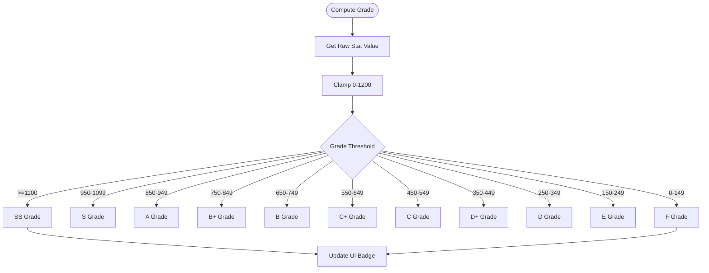
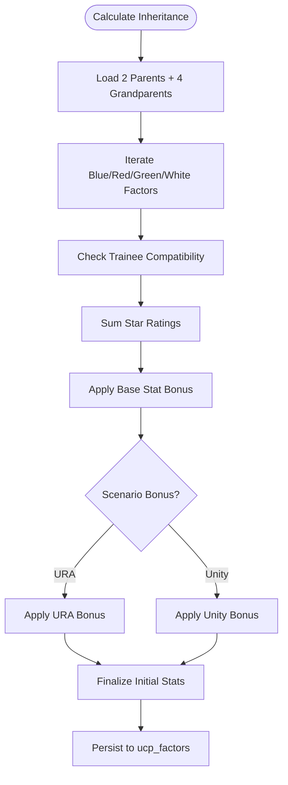
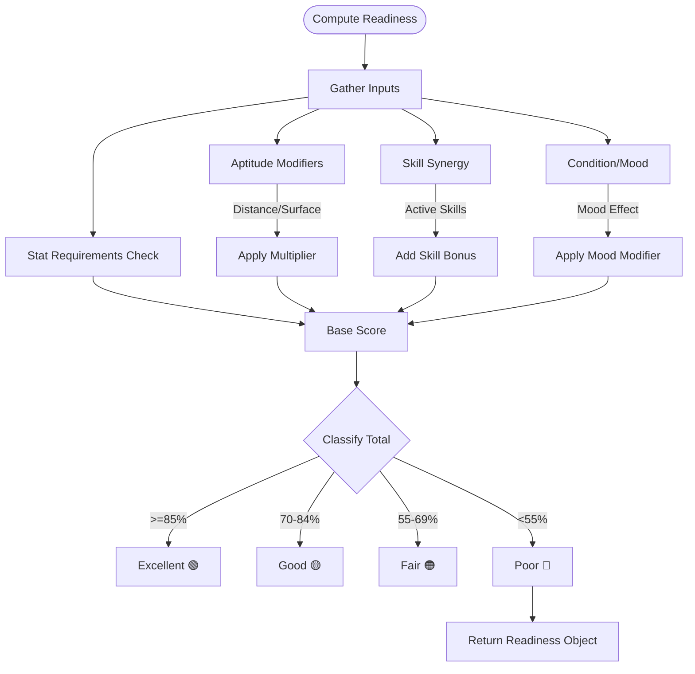

# FLOW-001: Character Management System Flow

## Umamusume Pretty Derby Career Planner

**Document Version**: 2.1.0
**Date**: January 24, 2026
**Project**: UmamusumeCareerPlanner
**Author**: Development Team
**Status**: Current - Aligned with codebase v2.0.0

---

## 1. Character Creation Wizard Flow

This flow details the initialization process for a new character, utilizing the **Laravel 12** backend services and **Livewire 3** wizard components. It integrates `CharacterService` for persistence and `FactorInheritanceService` for stat calculations.

### 1.1 Diagram

```mermaid
flowchart TD
    Start([User Starts New Career]) --> SelectTrainee[Select Trainee]
    SelectTrainee --> LoadBaseStats[Load Base Stats & Growth Rates]
    LoadBaseStats --> SelectScenario[Select Scenario]
    
    SelectScenario --> SelectParents[Select Parents (Inheritance)]
    SelectParents --> CalcInheritance[Calculate Factor Bonuses]
    CalcInheritance --> PreviewInheritance[Display Projected Gains]
    
    PreviewInheritance --> BuildDeck[Build Support Deck]
    BuildDeck --> ValidateDeck{Deck Valid?}
    
    ValidateDeck -->|No| FixDeck[Fix: 5 Owned + 1 Borrowed]
    FixDeck --> ValidateDeck
    
    ValidateDeck -->|Yes| SetGoals[AI-Assisted Goal Setting]
    SetGoals --> FinalReview[Review Configuration]
    
    FinalReview --> CreateRecord[Create Character Record]
    CreateRecord --> InitState[Initialize State]
    
    InitState --> DB{Storage Mode?}
    DB -->|Local| LocalStore[Save to localStorage (UUID)]
    DB -->|Account| CloudStore[Save to MySQL (ucp_characters)]
    
    LocalStore --> Dashboard[Redirect to Dashboard]
    CloudStore --> Dashboard
```

### 1.2 Step Details

| Step | Service/Component | Description |
|------|-------------------|-------------|
| **Select Trainee** | `CharacterService` | Fetches base stats (0-1200) and growth rates from `ucp_game_data`. |
| **Calculate Inheritance** | `FactorInheritanceService` | Applies factor bonuses: ★ (+5), ★★ (+12), ★★★ (+21). |
| **Validate Deck** | `SupportDeckService` | Ensures exactly 6 cards with type balance checks. |
| **Initialize State** | `CareerRunService` | Sets Energy (100), Mood (Normal), Turn (1). |

---

## 2. Turn Progression & State Update Flow

The core loop for updating character state after training or events, triggering **Neuron AI Agents** for analysis.

### 2.1 Diagram

```mermaid
flowchart TD
    StartTurn([Begin Turn]) --> LoadContext[Load Character Context]
    LoadContext --> CheckPhase{Phase?}
    
    CheckPhase -->|Training| TrainingPhase[Training Phase]
    CheckPhase -->|Race Week| RacePhase[Race Preparation]
    
    TrainingPhase --> UserAction[User Selects Training/Rest]
    UserAction --> CalcOutcome[Calculate Outcome]
    
    CalcOutcome --> UpdateStats[Update Stats (Speed/Stamina/etc)]
    CalcOutcome --> UpdateEnergy[Update Energy (-Cost / +Rest)]
    
    RacePhase --> ExecuteRace[Simulate/Record Race]
    ExecuteRace --> UpdateResults[Update Fan Count & Skill Pts]
    
    UpdateStats --> CheckConditions[Check Conditions/Events]
    UpdateResults --> CheckConditions
    
    CheckConditions --> AutoSave[Auto-Save State]
    
    AutoSave --> AICheck{AI Enabled?}
    AICheck -->|Yes| TriggerAgent[Trigger Neuron Agent]
    AICheck -->|No| NextTurn
    
    TriggerAgent --> GenAdvice[Generate Turn Advice]
    GenAdvice --> NextTurn([Advance Turn Counter])
```

---

## 3. Stat Grade Calculation Flow

Logic for determining stat grades based on the v2.0.0 scaling (0-1200 hard cap).

### 3.1 Diagram



---

## 4. Factor Inheritance Calculation Flow

Detailed logic for `FactorInheritanceService` processing parent and grandparent factors.

### 4.1 Diagram



---

## 5. Goal Progress Tracking Flow

How the system tracks user-defined goals and triggers alerts.

### 5.1 Diagram

```mermaid
flowchart TD
    Start([Track Goals]) --> LoadGoals[Load Active Goals (JSON)]
    LoadGoals --> GetCurrentState[Get Current Stats/Results]
    
    GetCurrentState --> IterateGoals{Iterate Goals}
    
    IterateGoals -->|Stat Target| CheckStat[Compare Stat vs Target]
    IterateGoals -->|Race Result| CheckPlacement[Check Race Placement]
    IterateGoals -->|Skill| CheckSkill[Check Skill Inventory]
    
    CheckStat --> CalcProgress[% Progress]
    CheckPlacement --> CalcProgress
    CheckSkill --> CalcProgress
    
    CalcProgress --> StatusCheck{Status?}
    
    StatusCheck -->|Completed| MarkDone[Mark Complete ✅]
    StatusCheck -->|On Track| MarkGood[Mark On Track 🟡]
    StatusCheck -->|Behind| MarkRisk[Mark At Risk 🔴]
    
    MarkRisk --> AIAlert[Trigger AI Warning]
    
    MarkDone --> UpdateUI[Update Goal Component]
    MarkGood --> UpdateUI
    AIAlert --> UpdateUI
```

---

## 6. Race Readiness Calculation Flow

The algorithm used by `RaceService` to determine the Readiness Score (Excellent/Good/Fair/Poor).

### 6.1 Diagram



---

## 7. Character State & Condition Management Flow

Logic for managing energy, mood, and status conditions (e.g., "Overweight", "Lazy").

### 7.1 Diagram

```mermaid
flowchart TD
    Start([Monitor State]) --> CheckEnergy[Check Energy Level]
    
    CheckEnergy --> EnergyLow{Energy < 30?}
    EnergyLow -->|Yes| FlagRest[Flag: High Failure Risk]
    
    EnergyLow -->|No| CheckMood[Check Mood Status]
    CheckMood --> MoodLow{Mood < Normal?}
    MoodLow -->|Yes| FlagMood[Flag: Reduced Training Gains]
    
    CheckMood --> CheckConditions[Check Conditions (JSON)]
    
    CheckConditions --> HasBad{Negative Condition?}
    HasBad -->|Yes| Identify[Identify: Skinny/Overweight/Lazy]
    Identify --> FlagCondition[Flag: Specific Debuff]
    
    FlagRest --> AggregateRisks
    FlagMood --> AggregateRisks
    FlagCondition --> AggregateRisks
    
    AggregateRisks --> AIInput[Send to Training Advisor Agent]
    AIInput --> SuggestAction[Suggest Infirmary/Rest/Date]
    SuggestAction --> UpdateDashboard[Update Dashboard Indicators]
```

---

## Document Control

| Version | Date | Author | Changes |
|---------|------|--------|---------|
| 2.1.0 | 2026-01-24 | Development Team | Updated to align with v2.0.0 codebase, Laravel 12 architecture, and Neuron AI integration points |
| 1.0.0 | 2026-01-14 | Development Team | Initial flow definitions |

---

## Related Documents

- [PRD-001: Character Management](../prds/PRD-001_Character_Management.md)
- [SPEC-001: Character Management Technical](../specs/SPEC-001_Character_Management_Technical.md)
- [009_DBD: Database Documentation](../009_DBD_Database_Documentation.md)
- [017_SUM: Software User Manual](../017_SUM_Software_User_Manual.md)
