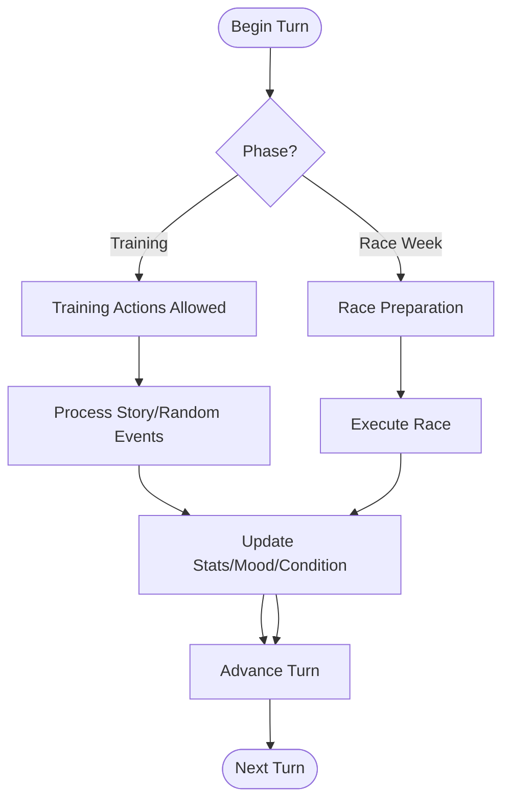
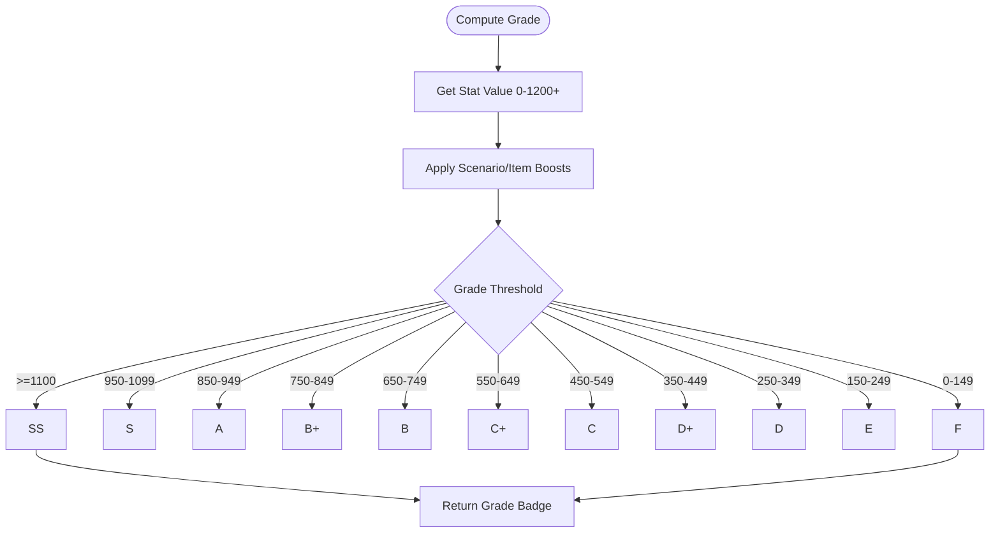
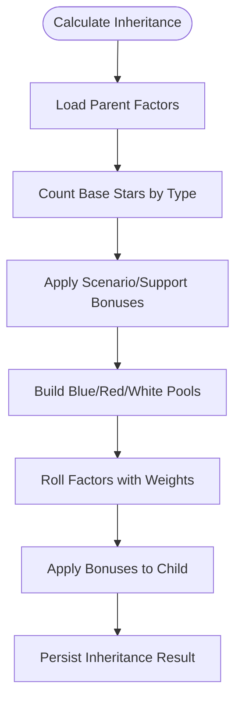
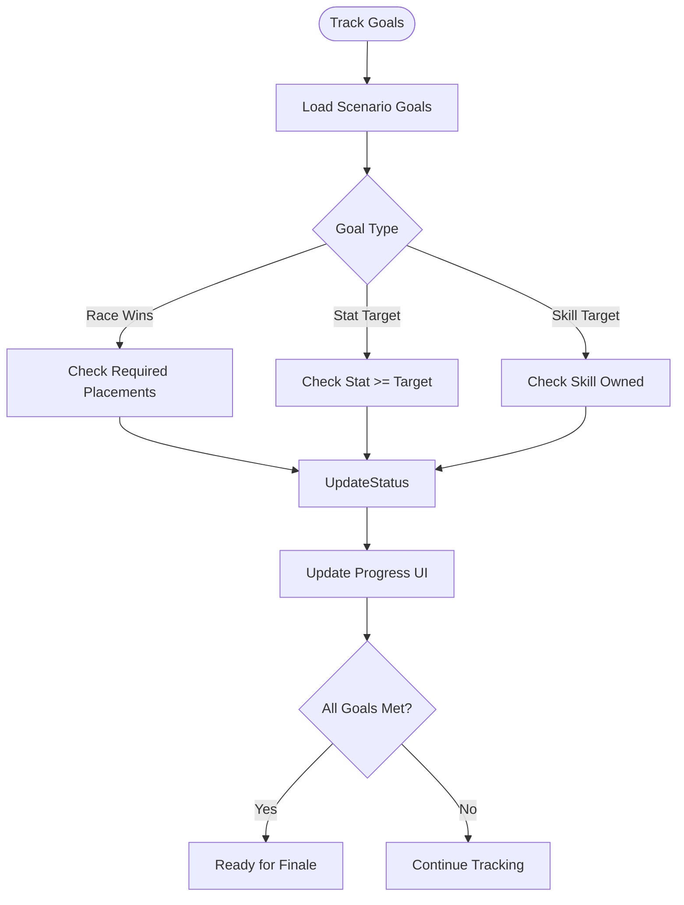
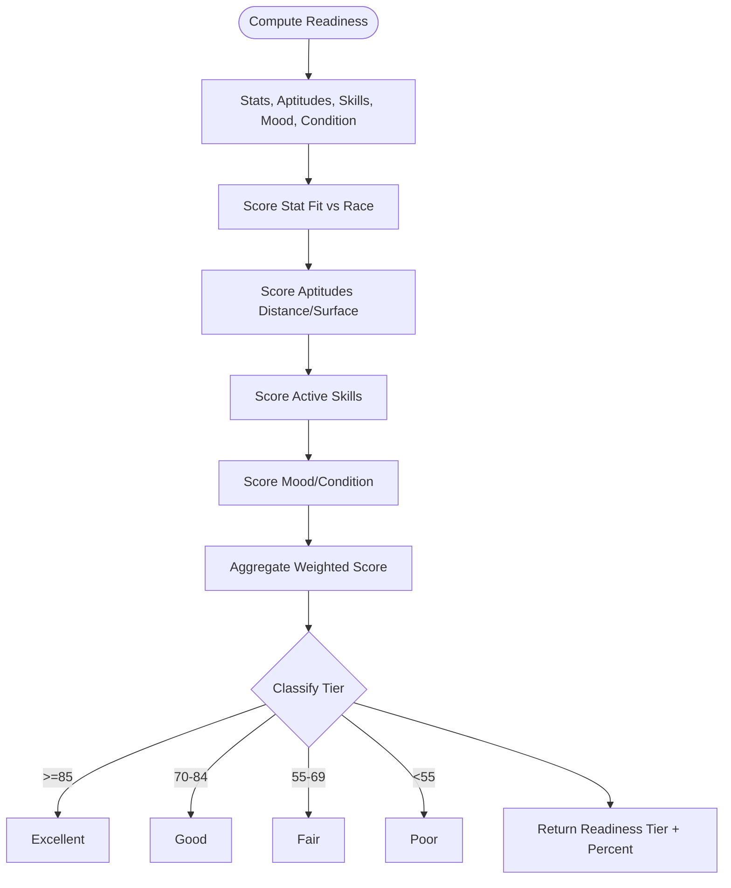
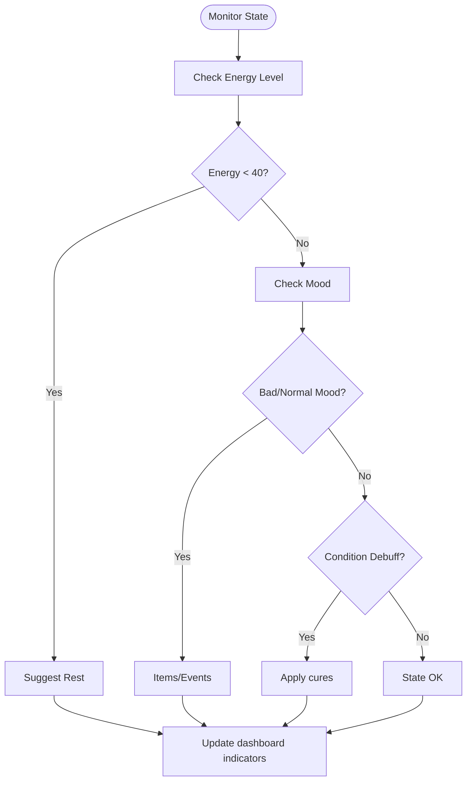

# FLOW-001: Character Management System Flow

## Umamusume Pretty Derby Career Planner

**Document Version**: 1.0
**Date**: January 14, 2026
**Related Documents**: [PRD-001], [SPEC-001]

---

## 1. Character Creation Flow

```mermaid
flowchart TD
    Start([User Starts New Career]) --> SelectTrainee[Select Trainee]
    SelectTrainee --> PickScenario[Pick Scenario]
    PickScenario --> PickParents[Pick Parents A/B]
    PickParents --> PreviewFactors[Preview Factor Bonuses]
    PreviewFactors --> BuildDeck[Build Support Deck (6 slots)]
    BuildDeck --> ValidateDeck{Deck Valid?}
    ValidateDeck -->|No| FixDeck[Fix type/rarity issues]
    FixDeck --> ValidateDeck
    ValidateDeck -->|Yes| InitializeStats[Initialize Stats/Mood/Energy]
    InitializeStats --> SaveRun[Persist Run + Seed]
    SaveRun --> Dashboard[Show Dashboard Day 1]
```

---

## 2. Turn Progression Flow



---

## 3. Stat Grade Calculation Flow



---

## 4. Factor Inheritance Calculation Flow



---

## 5. Goal Progress Tracking Flow



---

## 6. Race Readiness Calculation Flow



---

## 7. Character State Management Flow


