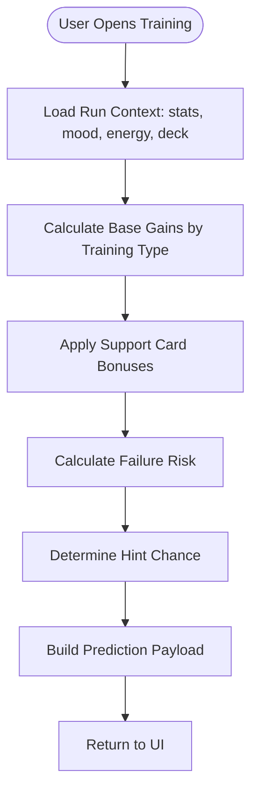
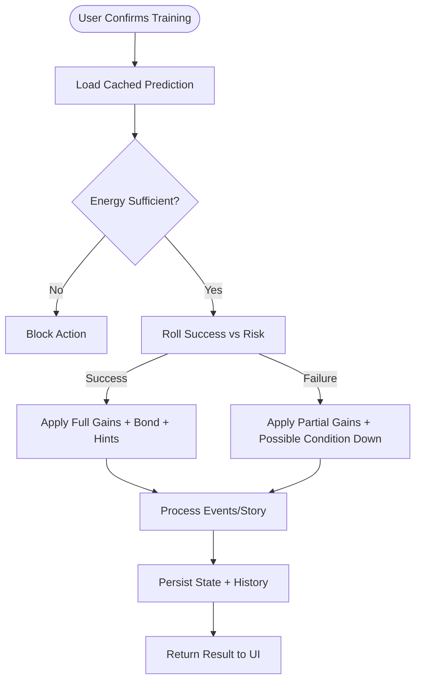
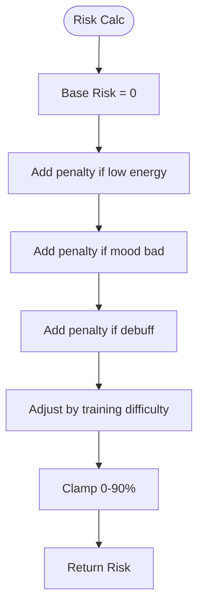
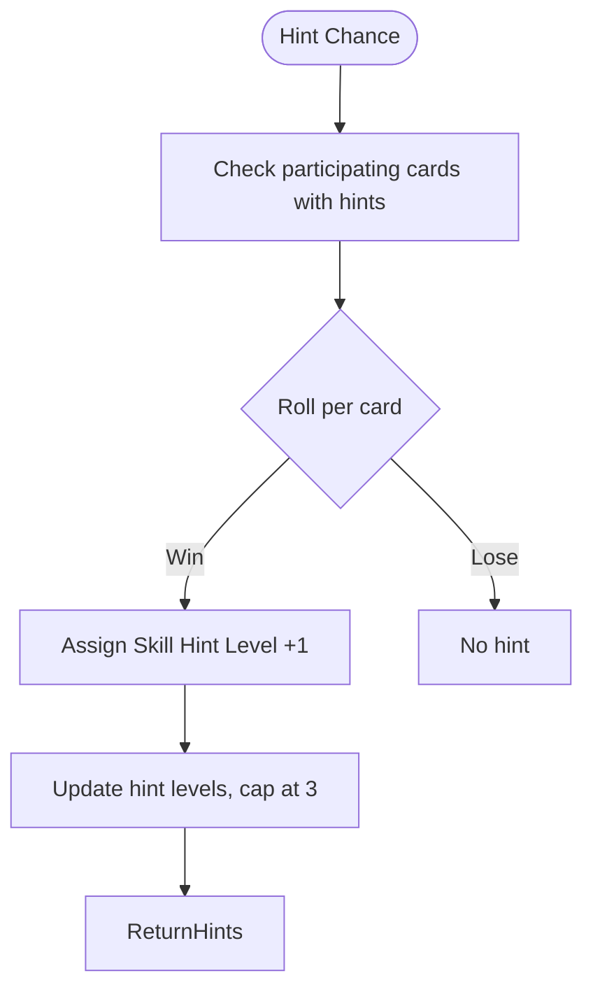
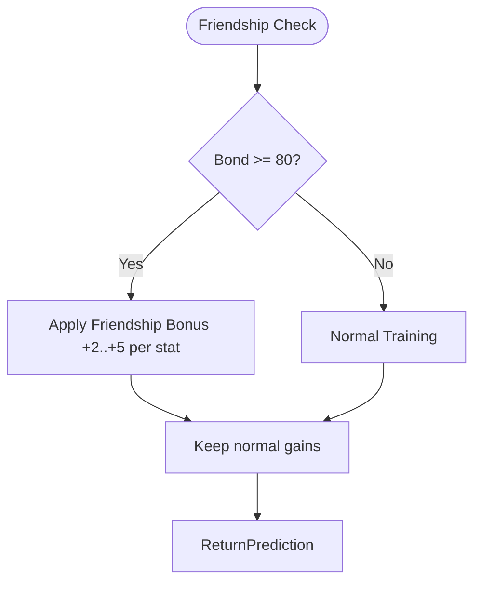
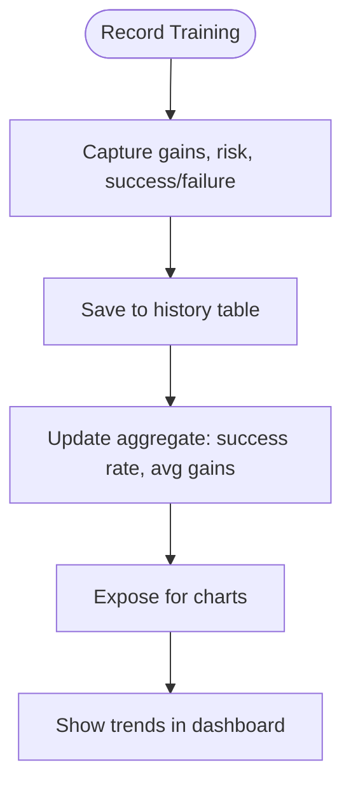

# FLOW-002: Training Optimization System Flow

## Umamusume Pretty Derby Career Planner

**Document Version**: 1.0
**Date**: January 14, 2026
**Related Documents**: [PRD-002], [SPEC-002]

---

## 1. Training Prediction Pipeline Flow



---

## 2. Training Execution Flow



---

## 3. Support Card Bonus Calculation Flow

```mermaid
flowchart TD
    Start([Support Bonus]) --> LoadDeck[Load Active Deck]
    LoadDeck --> IdentifyParticipants[Identify Cards Participating]
    IdentifyParticipants --> SumBonuses[Sum Training Bonuses (type, rarity, level, LB)]
    SumBonuses --> BondFactor[Apply Bond Multipliers]
    BondFactor --> FriendBonus[Apply Friend Slot Bonus if present]
    FriendBonus --> ReturnBonuses[Return Bonus Multipliers]
```

---

## 4. Failure Risk Assessment Flow



---

## 5. Skill Hint Acquisition Flow



---

## 6. Friendship Training Activation Flow



---

## 7. Training History & Analytics Flow


