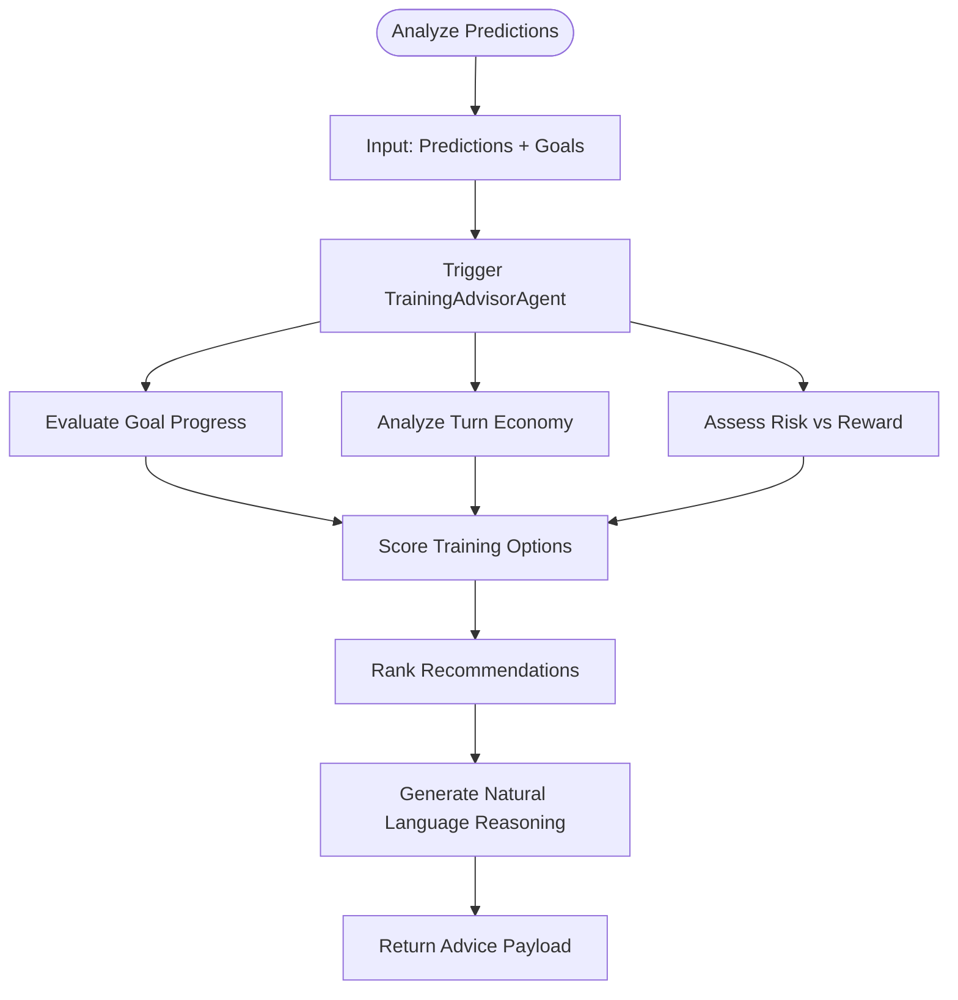
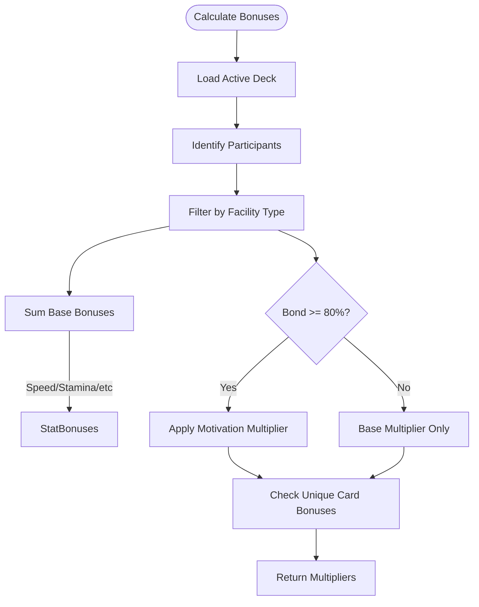
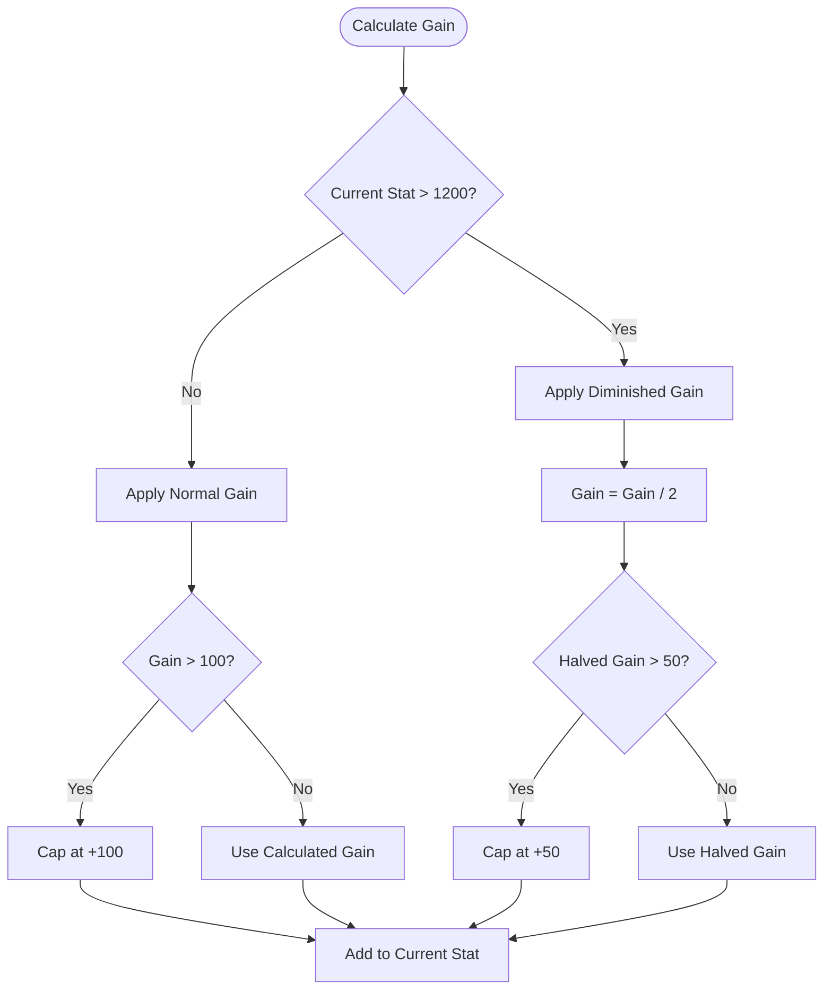

# FLOW-002: Training Optimization System Flow

## Umamusume Pretty Derby Career Planner

**Document Version**: 2.3.0
**Date**: February 22, 2026
**Project**: UmamusumeCareerPlanner
**Author**: Development Team
**Status**: Current - Updated with verified codebase references (70+ services, Neuron AI v2.11)

---

## 1. Training Prediction Pipeline Flow

This flow illustrates how `TrainingPredictionService` generates forecasts for all training facilities, utilizing Redis caching to optimize performance.

```mermaid
flowchart TD
    Start([User Opens Training]) --> CheckCache{Cache Hit?}
    
    CheckCache -->|Yes| ReturnCache[Return Cached Predictions]
    CheckCache -->|No| LoadContext[Load Context]
    
    LoadContext --> FetchState[Fetch Character Stats/Mood/Energy]
    FetchState --> FetchDeck[Fetch Support Deck]
    FetchDeck --> FetchScenario[Fetch Scenario Config]
    
    FetchScenario --> IterateFacilities[Iterate Facilities]
    
    IterateFacilities --> CalcBase[Calculate Base Gains]
    CalcBase --> ApplySupport[Apply Deck Bonuses]
    ApplySupport --> CalcRisk[Calculate Failure Risk]
    CalcRisk --> CalcHints[Determine Hint Probabilities]
    
    CalcHints --> BuildObject[Build TrainingPrediction Object]
    BuildObject --> NextFacility{More Facilities?}
    
    NextFacility -->|Yes| IterateFacilities
    NextFacility -->|No| CacheResults[Cache Results (Redis: 5m)]
    
    CacheResults --> ReturnNew[Return Predictions]
    ReturnCache --> AIAnalysis[Optional: Neuron Agent Analysis]
    ReturnNew --> AIAnalysis
```

---

## 2. Neuron AI Recommendation Flow

This flow details how the **Training Advisor Agent** (`TrainingAdvisorAgent` via Neuron AI v2.11) analyzes raw predictions to provide actionable advice.



---

## 3. Training Execution Flow

The transactional process of executing a training turn via `TrainingService`.

```mermaid
flowchart TD
    Start([User Confirms Action]) --> Validate[Validate Constraints]
    
    Validate -->|Energy Low| Fail[Reject Action]
    Validate -->|Valid| Execute{Execute Transaction}
    
    Execute --> RollOutcome{Roll RNG}
    
    RollOutcome -->|Success| ApplyFull[Apply Full Gains + Bond]
    RollOutcome -->|Failure| ApplyPartial[Apply Partial/Zero Gains]
    
    ApplyFull --> CheckHints[Check Skill Hints]
    CheckHints --> AssignHints[Assign Hints]
    
    ApplyPartial --> CheckConditions[Check Bad Conditions]
    CheckConditions --> ApplyCondition[Apply Condition (e.g. Lazy)]
    
    AssignHints --> UpdateTurn[Increment Turn]
    ApplyCondition --> UpdateTurn
    
    UpdateTurn --> ProcessEvents[Process Support/Scenario Events]
    
    ProcessEvents --> Save[Commit Transaction]
    Save --> Invalidate[Invalidate Predictions Cache]
    Invalidate --> Return[Return TrainingResult]
```

---

## 4. Support Card Bonus Calculation Flow

Logic handled by `SupportBonusCalculator` (in `Training/`) to determine effective stat multipliers.



---

## 5. Failure Risk Assessment Flow

Logic handled by `TrainingPredictionService` to determine the probability of training failure.


---

## 6. Skill Hint Acquisition Flow

Logic handled by `SkillHintService` (in `Training/`) during training execution.

```mermaid
flowchart TD
    Start([Check Hints]) --> GetParticipants[Get Support Cards present]
    
    GetParticipants --> FilterHints[Filter Cards with 'Hint Lv Up']
    
    FilterHints --> Roll{Roll Probability}
    Roll -->|Pass| SelectSkill[Select Random Skill from Card]
    Roll -->|Fail| NoHint
    
    SelectSkill --> CheckOwned{Already Max Hint (Lv 5)?}
    CheckOwned -->|Yes| NoHint
    CheckOwned -->|No| GrantHint[Grant Hint Level +1]
    
    GrantHint --> ReduceCost[Update SP Cost Discount]
    ReduceCost --> ReturnResult
```

### 6.1 Hint Discount Table

| Hint Level | SP Cost Discount |
|------------|------------------|
| 0          | 0% (full price)  |
| 1          | 10%              |
| 2          | 20%              |
| 3          | 30%              |
| 4          | 35%              |
| 5 (max)    | 40%              |

---

## 7. Facility Level & Summer Training Camp Flow

Logic for facility level progression and special training periods.

```mermaid
flowchart TD
    Start([Check Facility]) --> GetLevel[Get Current Facility Level (1-5)]
    
    GetLevel --> CheckCamp{Summer Training Camp?}
    
    CheckCamp -->|Yes| SetMax[All Facilities = Level 5]
    CheckCamp -->|No| UseNormal[Use Current Levels]
    
    SetMax --> CalcBonus[Calculate Training Bonus]
    UseNormal --> CalcBonus
    
    CalcBonus --> ApplyMultiplier[Apply Level Multiplier]
    ApplyMultiplier --> ReturnGains[Return Stat Gains]
```

### 7.1 Summer Training Camp Details

- **Duration**: 4 turns (typically turns 37-40)
- **Effect**: All training facilities temporarily set to Level 5
- **Strategy**: Optimal time for high-stat training sessions

---

## 8. Training Formula & Stat Calculation Flow (Game-Accurate)

The precise formula used by `TrainingCalculationService` to determine stat gains.

### 8.1 Training Formula

```
Stat Gain = (Base + StatBonus) × (1 + GrowthRate) × (1 + MoodMultiplier × (1 + MoodEffect)) × (1 + TrainingEffect) × (1 + 0.05 × NumSupportCards) × FriendshipMultiplier
```

### 8.2 Formula Components

| Component | Description | Typical Values |
|-----------|-------------|----------------|
| **Base** | Facility base stat gain | 10-25 depending on facility level |
| **StatBonus** | Support card stat bonuses | Sum of participating card bonuses |
| **GrowthRate** | Character's innate growth rate | 0-20% per stat |
| **MoodMultiplier** | Mood effect multiplier | Very Good: +20%, Good: +10%, Normal: 0%, Bad: -10%, Very Bad: -20% |
| **MoodEffect** | Additional mood modifiers | From conditions/events |
| **TrainingEffect** | Scenario-specific bonuses | Varies by scenario |
| **NumSupportCards** | Cards present at facility | 0-6 cards (+5% per card) |
| **FriendshipMultiplier** | Friendship training bonus | 1.0 (no bonus) to 1.35 (max) |

### 8.3 Stat Cap Rules



### 8.4 Key Stat Cap Rules

- **Normal Training**: Maximum +100 per training session
- **Above 1200**: Gains are halved, maximum +50 per session
- **No Hard Cap**: Stats can theoretically exceed 1200, but with severe diminishing returns

---

## Document Control

| Version | Date       | Author           | Changes |
|---------|------------|------------------|---------|
| 2.3.0   | 2026-02-22 | Development Team | Updated service references: SupportBonusCalculator (Training/), SkillHintService (Training/), TrainingPredictionService for risk assessment; added Neuron AI v2.11 reference |
| 2.2.0   | 2026-01-28 | Development Team | Updated with verified game mechanics from Global English Server: Added complete training formula, stat cap rules (1200 base, +100/+50 per-training caps, half value above 1200), hint levels max at 5, added hint discount table, added Summer Training Camp flow (4 turns, all facilities Level 5) |
| 2.1.0   | 2026-01-24 | Development Team | Updated to include caching, Neuron AI agents, and Service layer architecture |
| 1.0.0   | 2026-01-14 | Development Team | Initial flow definitions |

---

## Related Documents

- [PRD-002: Training Optimization](../prds/PRD-002_Training_Optimization.md)
- [SPEC-002: Training Optimization Technical](../specs/SPEC-002_Training_Optimization_Technical.md)
- [010_SCD: Source Code Documentation](../010_SCD_Source_Code_Documentation.md)
