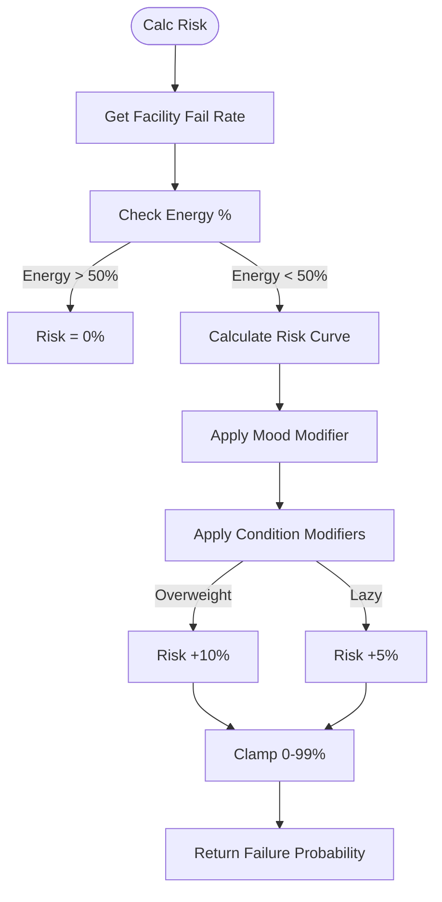
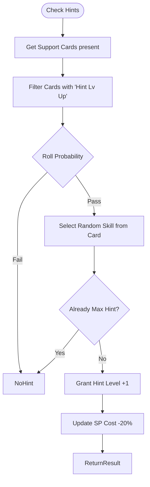

# FLOW-002: Training Optimization System Flow

## Umamusume Pretty Derby Career Planner

**Document Version**: 2.1.0
**Date**: January 24, 2026
**Project**: UmamusumeCareerPlanner
**Author**: Development Team
**Status**: Current - Aligned with codebase v2.0.0

---

## 1. Training Prediction Pipeline Flow

This flow illustrates how `TrainingPredictionService` generates forecasts for all training facilities, utilizing Redis caching to optimize performance.

```mermaid
flowchart TD
    Start([User Opens Training]) --> CheckCache{Cache Hit?}
    
    CheckCache -->|Yes| ReturnCache[Return Cached Predictions]
    CheckCache -->|No| LoadContext[Load Context]
    
    LoadContext --> FetchState[Fetch Character Stats/Mood/Energy]
    FetchState --> FetchDeck[Fetch Support Deck]
    FetchDeck --> FetchScenario[Fetch Scenario Config]
    
    FetchScenario --> IterateFacilities[Iterate Facilities]
    
    IterateFacilities --> CalcBase[Calculate Base Gains]
    CalcBase --> ApplySupport[Apply Deck Bonuses]
    ApplySupport --> CalcRisk[Calculate Failure Risk]
    CalcRisk --> CalcHints[Determine Hint Probabilities]
    
    CalcHints --> BuildObject[Build TrainingPrediction Object]
    BuildObject --> NextFacility{More Facilities?}
    
    NextFacility -->|Yes| IterateFacilities
    NextFacility -->|No| CacheResults[Cache Results (Redis: 5m)]
    
    CacheResults --> ReturnNew[Return Predictions]
    ReturnCache --> AIAnalysis[Optional: Neuron Agent Analysis]
    ReturnNew --> AIAnalysis
```

---

## 2. Neuron AI Recommendation Flow

This flow details how the **Training Advisor Agent** analyzes raw predictions to provide actionable advice.


---

## 3. Training Execution Flow

The transactional process of executing a training turn via `TrainingService`.

```mermaid
flowchart TD
    Start([User Confirms Action]) --> Validate[Validate Constraints]
    
    Validate -->|Energy Low| Fail[Reject Action]
    Validate -->|Valid| Execute{Execute Transaction}
    
    Execute --> RollOutcome{Roll RNG}
    
    RollOutcome -->|Success| ApplyFull[Apply Full Gains + Bond]
    RollOutcome -->|Failure| ApplyPartial[Apply Partial/Zero Gains]
    
    ApplyFull --> CheckHints[Check Skill Hints]
    CheckHints --> AssignHints[Assign Hints]
    
    ApplyPartial --> CheckConditions[Check Bad Conditions]
    CheckConditions --> ApplyCondition[Apply Condition (e.g. Lazy)]
    
    AssignHints --> UpdateTurn[Increment Turn]
    ApplyCondition --> UpdateTurn
    
    UpdateTurn --> ProcessEvents[Process Support/Scenario Events]
    
    ProcessEvents --> Save[Commit Transaction]
    Save --> Invalidate[Invalidate Predictions Cache]
    Invalidate --> Return[Return TrainingResult]
```

---

## 4. Support Card Bonus Calculation Flow

Logic handled by `SupportBonusCalculator` to determine effective stat multipliers.


---

## 5. Failure Risk Assessment Flow

Logic handled by `RiskCalculator` to determine the probability of training failure.



---

## 6. Skill Hint Acquisition Flow

Logic handled by `SkillService` during training execution.



---

## Document Control

| Version | Date | Author | Changes |
|---------|------|--------|---------|
| 2.1.0 | 2026-01-24 | Development Team | Updated to include caching, Neuron AI agents, and Service layer architecture |
| 1.0.0 | 2026-01-14 | Development Team | Initial flow definitions |

---

## Related Documents

- [PRD-002: Training Optimization](../prds/PRD-002_Training_Optimization.md)
- [SPEC-002: Training Optimization Technical](../specs/SPEC-002_Training_Optimization_Technical.md)
- [010_SCD: Source Code Documentation](../010_SCD_Source_Code_Documentation.md)
