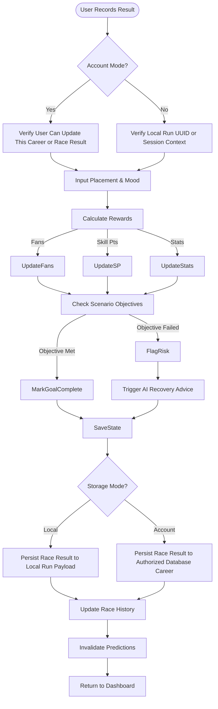
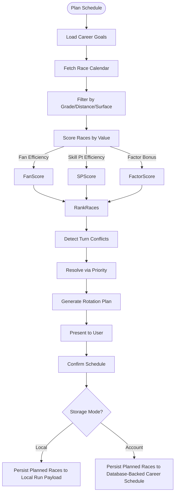
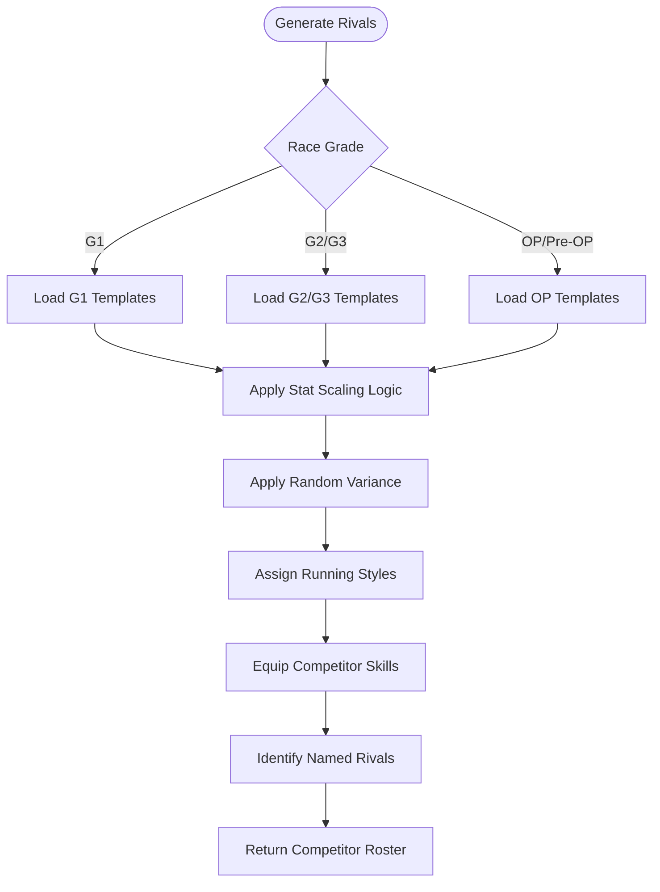

# FLOW-003: Race Strategy System Flow

## Umamusume Pretty Derby Career Planner

**Document Version**: 2.4.2
**Date**: April 7, 2026
**Project**: UmamusumeCareerPlanner
**Author**: Development Team
**Status**: Current - Updated with verified game mechanics from Global English Server

---

## 1. Race Preparation & Strategy Analysis Flow

This flow details how `RaceController`, `RaceConditionService`, and the race-focused advisory flows
analyze upcoming races to provide readiness assessments and strategy recommendations.

Race planning and entry must respect `StorageMode`: Local mode stores race targets and results in
UUID-oriented browser state, while Account mode persists them to authorized database-backed career
records.

```mermaid
flowchart TD
    Start([User Selects Race]) --> FetchDetails[Fetch Race Details]
    FetchDetails --> LoadContext[Load Character Context]

    LoadContext --> CalcReadiness[Calculate Readiness Score]
    CalcReadiness --> GenRivals[Generate/Fetch Competitors]

    GenRivals --> SimRun[Simulate Race Scenarios]
    SimRun --> CalcWinProb[Calculate Win Probability]

    CalcWinProb --> AIAnalysis{AI Analysis Enabled?}

    AIAnalysis -->|Yes| TriggerAgent[Trigger RaceStrategyAgent]
    AIAnalysis -->|No| BasicRecs[Generate Basic Recommendations]

    TriggerAgent --> AnalyzeStyle[Analyze Running Styles (Nige/Senkou/Sashi/Oikomi)]
    AnalyzeStyle --> CheckSkills[Evaluate Skill Synergies]
    CheckSkills --> RecommendStrategy[Recommend Optimal Strategy]

    RecommendStrategy --> DisplayUI[Display Race Preview UI]
    BasicRecs --> DisplayUI

    DisplayUI --> UserAction{User Action}
    UserAction -->|Enter Race| CheckMode{Storage Mode?}
    UserAction -->|Cancel| ReturnToCalendar

    CheckMode -->|Local| SaveLocalRace[Update UUID-Oriented Local Run Payload]
    CheckMode -->|Account| SaveAccountRace[Persist Race Entry to Authorized Database Career]
    SaveAccountRace --> Authz{Authorized and valid?}
    Authz -->|No| ReturnError[Return authorization or validation error]
    Authz -->|Yes| SaveRegistration[Commit Race Entry]
    SaveRegistration --> SaveOk{Saved?}
    SaveOk -->|No| SaveError[Return Persistence Error]
    SaveOk -->|Yes| ConfirmEntry[Confirm Entry]

    SaveLocalRace --> ConfirmEntry
```

In Account mode, race entry and result updates must pass ownership and authorization checks before
persistence. In Local mode, the active run UUID and browser session context act as the write
boundary.

---

## 2. Race Result Processing Flow

The workflow for recording actual race outcomes during a career run, handling stat updates and
scenario objective checks.

Race result recording should branch by storage mode and authorization context before mutating persistent state.



---

## 3. Win Probability Calculation Flow

The algorithmic logic used by `RaceConditionService` to estimate victory chances based on current
character state against generated rivals.

```mermaid
flowchart TD
    Start([Calc Win Probability]) --> GatherInputs[Inputs: Stats, Aptitudes, Skills]

    GatherInputs --> RivalCompare[Compare vs Rivals]
    RivalCompare --> CalcStatDelta[Calculate Stat Differentials]

    CalcStatDelta --> ApplyAptitude[Apply Aptitude Modifiers]
    ApplyAptitude -->|Distance| DistMod[Distance Aptitude (G-S)]
    ApplyAptitude -->|Surface| SurfMod[Surface Aptitude (G-S)]
    ApplyAptitude -->|Style| StyleMod[Running Style Aptitude (G-S)]

    DistMod --> BaseScore
    SurfMod --> BaseScore
    StyleMod --> BaseScore

    BaseScore --> ApplySkills[Apply Skill Multipliers]
    ApplySkills -->|Speed Skills| SpdBonus
    ApplySkills -->|Stamina Skills| StaBonus
    ApplySkills -->|Acceleration| AccBonus

    SpdBonus --> FinalScore
    StaBonus --> FinalScore
    AccBonus --> FinalScore

    FinalScore --> Normalize[Normalize 0-100%]
    Normalize --> ApplyVariance[Apply RNG Variance (+/- 5%)]

    ApplyVariance --> ReturnProb[Return Probability]
```

---

## 4. Race Schedule Planning Flow

How the **Race Strategy Agent** assists users in building a race rotation to meet fan count
objectives and skill point targets.

Race planning must preserve the same storage boundary as race entry. Local mode stores planned races
in the active UUID-oriented run payload. Account mode persists planned races to the authenticated
owner's career records.



---

## 5. Race Schedule Confirmation Flow

After the race schedule is planned and persisted, the application returns a confirmation view to the
user showing the approved race rotation.

```text
[Planned Race Schedule]
  -> {Storage Mode?}
     Local -> [Show Schedule Summary from Local Run Payload]
     Account -> [Show Schedule Summary from Database-Backed Career]
  -> [User Views Confirmed Race Rotation]
```

---

## 6. Track Condition & Weather Impact Flow

Logic for calculating track condition modifiers based on weather and ground state.

```mermaid
flowchart TD
    Start([Check Track Conditions]) --> GetWeather[Get Current Weather]

    GetWeather --> DetermineGround{Ground Condition}

    DetermineGround -->|Good| NoMod[No Modifier (100%)]
    DetermineGround -->|Slightly Heavy| SlightMod[Slight Penalty (-2%)]
    DetermineGround -->|Heavy| HeavyMod[Heavy Penalty (-5%)]
    DetermineGround -->|Bad| BadMod[Severe Penalty (-10%)]

    NoMod --> CheckAptitude[Check Surface Aptitude]
    SlightMod --> CheckAptitude
    HeavyMod --> CheckAptitude
    BadMod --> CheckAptitude

    CheckAptitude --> ApplyAptMod{Aptitude Grade}

    ApplyAptMod -->|S| BestMod[Minimal Impact]
    ApplyAptMod -->|A| GoodMod[Low Impact]
    ApplyAptMod -->|B-C| MedMod[Moderate Impact]
    ApplyAptMod -->|D-G| PoorMod[High Impact]

    BestMod --> FinalCalc[Calculate Final Performance]
    GoodMod --> FinalCalc
    MedMod --> FinalCalc
    PoorMod --> FinalCalc
```

### 6.1 Track Condition Reference (Game-Accurate)

| Condition | Power Penalty (Turf) | Power Penalty (Dirt) | Speed Penalty | Stamina Drain |
| --- | --- | --- | --- | --- |
| Firm | None | None | None | Normal |
| Good | approx. −2% | approx. −2% | None | Normal |
| Soft | approx. −2% | approx. −5% | None | +2%/sec |
| Heavy | approx. −2% | approx. −5% | approx. −2% | +2%/sec |

> **Note**: Percentage values are community-approximated from observed in-game stat deltas. Exact internal values may differ slightly.

### 6.2 Aptitude Grade Scale (Game-Accurate)

- **S**: Maximum grade (best performance, +5% to +10% bonus)
- **A**: Baseline (0% modifier)
- **B**: Good (-10% to -15%)
- **C**: Average (-20% to -25%)
- **D**: Below Average (-30% to -40%)
- **E**: Poor (-50% to -60%)
- **F**: Very Poor (-70% to -80%)
- **G**: Minimum grade (worst performance, -90%)

**Note**: SS grade does not exist in the game. S is the maximum aptitude rating.

### 6.3 Aptitude Modifiers by Category

> **Column Note**: Column headings show the primary stat affected during the race. Surface aptitude affects Power; Distance aptitude affects Speed; Style aptitude affects Wit.

| Grade | Surface (Power) | Distance (Speed) | Style (Wit) |
| --- | --- | --- | --- |
| S | +5% | +5% | +10% |
| A | 0% | 0% | 0% |
| B | -10% | -10% | -15% |
| C | -20% | -20% | -25% |
| D | -30% | -40% | -40% |
| E | -50% | -60% | -60% |
| F | -70% | -80% | -80% |
| G | -90% | -90% | -90% |

---

## 7. Competitor Generation Flow

Logic for generating realistic rivals for race simulations based on the race grade and current scenario.



---

## Document Control

| Version | Date | Author | Changes |
| --- | --- | --- | --- |
| 2.4.2 | 2026-04-07 | Development Team | Synchronized suite-wide documentation metadata and preserved verified flow mechanics and references. |
| 2.3.0 | 2026-03-10 | Development Team | Inserted missing Section 5 (Race Schedule Confirmation Flow); converted track condition table from raw stat values to percentage approximations with community-data note; added aptitude column-to-stat footnote in Section 6.3. |
| 2.2.2 | 2026-03-08 | Development Team | Synchronized the race-entry branch with FLOW-008 by documenting the UUID-oriented Local path and the concrete account-mode POST entry route. |
| 2.2.1 | 2026-03-08 | Development Team | Added StorageMode-aware race entry, result, and schedule persistence branches plus explicit authorization context for Account-mode updates. |
| 2.2.0 | 2026-01-28 | Development Team | Updated with verified game mechanics from Global English Server: Added game-accurate track condition modifiers (Firm/Good/Soft/Heavy with Power/Speed/Stamina penalties), aptitude grade maximum is S (no SS), complete aptitude modifier tables by category (Surface/Distance/Style) |
| 2.1.0 | 2026-01-24 | Development Team | Updated to align with v2.0.0 codebase, Neuron AI agents, and Service layer architecture |
| 1.0.0 | 2026-01-14 | Development Team | Initial flow definitions |

---

## Related Documents

- [PRD-003: Race Strategy](../02-prds/PRD-003_Race_Strategy.md)
- [SPEC-003: Race Strategy Technical](../02-specs/SPEC-003_Race_Strategy_Technical.md)
- [010_SCD: Source Code Documentation](../00-core-docs/010_SCD_Source_Code_Documentation.md)
